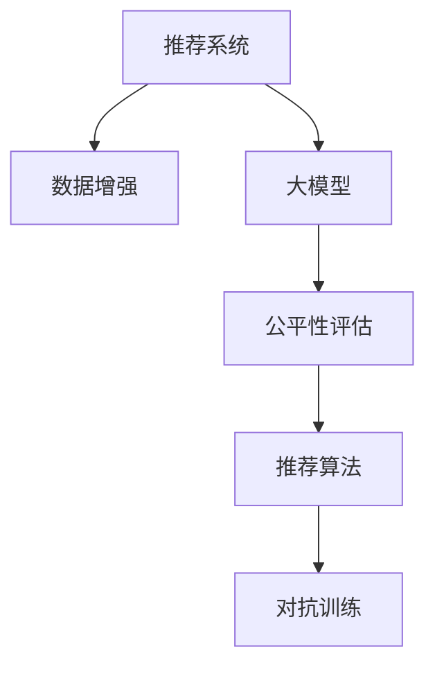

                 

# 搜索推荐系统的公平性评估：大模型方法

> 关键词：搜索推荐系统,公平性评估,大模型,公平性优化,评估指标,MLP模型,深度学习,推荐系统,人工智能,公平算法

## 1. 背景介绍

在当今信息爆炸的时代，搜索引擎、推荐系统等智能信息服务已经成为了人们获取信息的主要途径。这些系统通过大量数据分析和用户行为预测，为用户推荐最相关的搜索结果或产品，极大地提高了信息检索的效率和体验。然而，搜索引擎和推荐系统中的算法设计往往聚焦于性能指标（如点击率、停留时间等）的提升，而忽略了系统的公平性问题。

公平性（Fairness），是指在推荐算法中保证不同背景、特征的用户获得平等的推荐机会。一个公平的推荐系统，能够对所有用户提供无偏见、无歧视的个性化推荐，避免强化现有偏见，提升用户体验。特别是在金融、招聘、医疗等高风险领域，算法公平性尤为重要。

随着深度学习和预训练大模型的兴起，如何评估和优化推荐系统的公平性，成为了一个迫切的研究课题。大模型方法，由于其强大的表达能力和泛化能力，为公平性评估提供了新的方法和工具。本文将系统介绍大模型方法在推荐系统公平性评估中的原理、技术、实践，以及面临的挑战和未来发展趋势。

## 2. 核心概念与联系

### 2.1 核心概念概述

为更好地理解大模型在推荐系统公平性评估中的应用，本节将介绍几个关键概念：

- 推荐系统（Recommendation System）：通过分析用户的历史行为数据，预测用户偏好，从而推荐个性化产品或信息。常见的推荐方式包括基于内容的推荐、协同过滤推荐、混合推荐等。

- 公平性评估（Fairness Evaluation）：对推荐系统输出结果进行公平性检查，评估是否存在性别、年龄、种族等偏见。常见的评估指标包括平均收益差距、差异系数等。

- 大模型（Large Model）：以深度神经网络为代表的，参数量在数亿甚至数十亿级别的大型预训练模型，如BERT、GPT-3、T5等。大模型能够学习到丰富的语言知识和特征表示，提升推荐系统的表现和公平性。

- 推荐算法（Recommendation Algorithm）：用于生成推荐结果的算法，如基于矩阵分解的算法、基于序列模式的算法、基于图神经网络的算法等。

- 数据增强（Data Augmentation）：通过数据变换，如回译、噪声注入等方式扩充训练集，提高模型的泛化能力。

- 对抗训练（Adversarial Training）：通过对抗样本训练，提高模型的鲁棒性和泛化能力。

这些核心概念之间的逻辑关系可以通过以下Mermaid流程图来展示：



这个流程图展示了大模型方法在推荐系统公平性评估中的应用框架：

1. 推荐系统通过收集用户数据，利用深度学习模型生成个性化推荐。
2. 大模型方法用于评估推荐结果的公平性，识别出偏见和歧视。
3. 根据评估结果，调整推荐算法或数据集，进一步优化推荐系统的公平性。
4. 对抗训练等方法进一步提高模型的鲁棒性，确保推荐结果不受干扰。

## 3. 核心算法原理 & 具体操作步骤

### 3.1 算法原理概述

大模型方法在推荐系统公平性评估中的核心思想是：将大模型作为推荐系统的一部分，用于评估和优化推荐结果的公平性。具体而言，大模型将推荐结果作为输入，生成一组公平性指标，用于衡量推荐结果的偏见程度。在获得公平性评估结果后，可以采用对抗训练等方法调整模型，减少偏见。

假设推荐系统推荐的产品序列为 $X=\{x_1, x_2, ..., x_N\}$，大模型 $M$ 能够生成一组公平性指标 $\{f_1, f_2, ..., f_M\}$。这些指标可以用于评估推荐结果在不同特征上的表现，如性别、年龄、种族等。若某特征的公平性指标值过高，表示该特征在推荐结果中存在显著偏见，需要进一步优化。

### 3.2 算法步骤详解

基于大模型的推荐系统公平性评估主要包括以下几个关键步骤：

**Step 1: 数据准备**
- 收集推荐系统生成的推荐序列 $X$。
- 收集标注数据，如用户的性别、年龄、种族等特征，以及每个特征对应的标注标签（如0表示无偏见，1表示有偏见）。

**Step 2: 构建大模型**
- 选择合适的大模型，如BERT、GPT-3等，作为公平性评估的引擎。
- 对大模型进行微调，使其能够处理推荐序列 $X$ 并生成一组公平性指标。

**Step 3: 公平性评估**
- 将推荐序列 $X$ 输入大模型 $M$，生成一组公平性指标 $\{f_1, f_2, ..., f_M\}$。
- 根据公平性指标值，识别出存在偏见的特征，进一步优化推荐算法。

**Step 4: 对抗训练**
- 对识别出的偏见特征，进行对抗训练，以减少其在推荐结果中的影响。
- 使用对抗样本，训练大模型 $M$，使其对偏见特征更加鲁棒。

**Step 5: 结果验证**
- 重新评估优化后的推荐结果，确保偏见特征被有效去除。
- 在测试集上进一步验证推荐结果的公平性和性能。

### 3.3 算法优缺点

大模型方法在推荐系统公平性评估中具有以下优点：
1. 表达能力强。大模型能够学习到丰富的特征表示，提升公平性评估的精度。
2. 泛化能力强。大模型在泛化能力上强于传统机器学习模型，能够适应多样化的推荐场景。
3. 鲁棒性好。大模型采用对抗训练等方法，提高了模型的鲁棒性和泛化能力。

同时，该方法也存在一些局限性：
1. 数据依赖性强。大模型评估结果依赖于标注数据的质量和数量，数据获取成本较高。
2. 模型复杂度高。大模型的训练和推理需要较高的计算资源，硬件成本较高。
3. 解释性差。大模型作为"黑盒"系统，难以解释其内部工作机制和决策逻辑。

尽管存在这些局限性，但就目前而言，大模型方法仍是大规模推荐系统公平性评估的主要手段。未来相关研究的重点在于如何进一步降低数据依赖，提高模型的解释性和鲁棒性，同时兼顾公平性和性能指标。

### 3.4 算法应用领域

基于大模型的推荐系统公平性评估方法，已经在金融、招聘、医疗等多个领域得到了广泛的应用，显著提升了推荐系统的公平性和用户满意度。

- 金融领域：在贷款审批、保险推荐等场景中，推荐系统需要保证对不同性别、年龄、种族等群体的公平性。通过大模型评估和优化，避免了偏见和歧视，提升了金融服务的普惠性。
- 招聘领域：在简历筛选、职位推荐等场景中，大模型方法可以识别出算法中的性别、种族等偏见，通过优化算法和数据，使得招聘推荐更加公平、公正。
- 医疗领域：在疾病诊断、药品推荐等场景中，推荐系统需要保证对不同性别、年龄、种族等群体的公平性。通过大模型评估和优化，避免了偏见和歧视，提升了医疗服务的公平性。
- 其他领域：如广告投放、社交媒体推荐等场景中，大模型方法也得到了广泛应用，提升了推荐系统的公平性和用户体验。

除了这些典型应用外，大模型方法还将在更多领域得到推广，为推荐系统公平性评估提供新的思路和技术支撑。

## 4. 数学模型和公式 & 详细讲解 & 举例说明

### 4.1 数学模型构建

本节将使用数学语言对大模型方法在推荐系统公平性评估中的应用进行更加严格的刻画。

记推荐序列为 $X=\{x_1, x_2, ..., x_N\}$，其中 $x_i$ 为第 $i$ 个推荐产品。设大模型 $M$ 对推荐序列 $X$ 的输出为 $\hat{f} = M(X)$，其中 $\hat{f} = [\hat{f}_1, \hat{f}_2, ..., \hat{f}_M]$。假设 $\hat{f}_i$ 表示第 $i$ 个公平性指标。

### 4.2 公式推导过程

以性别公平性指标为例，推导其计算公式。

假设推荐系统中存在性别偏见，即在推荐结果中，某一性别用户获得的推荐数量明显少于另一性别用户。则性别公平性指标 $\hat{f}_{\text{gender}}$ 可以定义为：

$$
\hat{f}_{\text{gender}} = \frac{\sum_{i=1}^{N} (\text{gender}_i - \text{avg}_{\text{gender}})}{\sum_{i=1}^{N} |\text{gender}_i - \text{avg}_{\text{gender}}|}
$$

其中 $\text{gender}_i$ 表示第 $i$ 个推荐结果的性别特征，$\text{avg}_{\text{gender}}$ 表示性别特征的均值。

类似地，可以定义年龄、种族等特征的公平性指标。若某特征的公平性指标值过高，表示该特征在推荐结果中存在显著偏见，需要进行优化。

### 4.3 案例分析与讲解

以下以金融贷款审批推荐为例，详细讲解大模型方法的应用。

假设某金融公司利用推荐系统为不同性别的用户推荐贷款产品，希望避免在贷款审批中的性别偏见。具体而言，可以采取以下步骤：

**Step 1: 数据准备**
- 收集历史贷款数据，标记每个贷款申请的性别。
- 收集当前用户的贷款需求，标记用户的性别。

**Step 2: 构建大模型**
- 选择BERT等大模型，作为公平性评估的引擎。
- 对大模型进行微调，使其能够处理性别特征并生成公平性指标。

**Step 3: 公平性评估**
- 将用户的贷款需求输入大模型，生成一组公平性指标。
- 若性别公平性指标值过高，表示存在性别偏见，需要进行优化。

**Step 4: 对抗训练**
- 对识别出的性别偏见，进行对抗训练，以减少其在贷款推荐中的影响。
- 使用对抗样本，训练大模型，使其对性别偏见更加鲁棒。

**Step 5: 结果验证**
- 重新评估优化后的推荐结果，确保性别偏见被有效去除。
- 在测试集上进一步验证推荐结果的公平性和性能。

通过上述过程，可以有效地评估和优化金融贷款推荐系统的性别公平性，提升金融服务的普惠性。

## 5. 项目实践：代码实例和详细解释说明

### 5.1 开发环境搭建

在进行公平性评估实践前，我们需要准备好开发环境。以下是使用Python进行PyTorch开发的环境配置流程：

1. 安装Anaconda：从官网下载并安装Anaconda，用于创建独立的Python环境。

2. 创建并激活虚拟环境：
```bash
conda create -n pytorch-env python=3.8 
conda activate pytorch-env
```

3. 安装PyTorch：根据CUDA版本，从官网获取对应的安装命令。例如：
```bash
conda install pytorch torchvision torchaudio cudatoolkit=11.1 -c pytorch -c conda-forge
```

4. 安装Transformer库：
```bash
pip install transformers
```

5. 安装各类工具包：
```bash
pip install numpy pandas scikit-learn matplotlib tqdm jupyter notebook ipython
```

完成上述步骤后，即可在`pytorch-env`环境中开始公平性评估实践。

### 5.2 源代码详细实现

下面我们以性别公平性评估为例，给出使用PyTorch对BERT模型进行公平性评估的代码实现。

首先，定义数据处理函数：

```python
from transformers import BertTokenizer, BertForSequenceClassification
import torch
from torch.utils.data import DataLoader
from sklearn.metrics import precision_recall_curve, roc_auc_score

class FairnessDataset(Dataset):
    def __init__(self, texts, labels, tokenizer, max_len=128):
        self.texts = texts
        self.labels = labels
        self.tokenizer = tokenizer
        self.max_len = max_len
        
    def __len__(self):
        return len(self.texts)
    
    def __getitem__(self, item):
        text = self.texts[item]
        label = self.labels[item]
        
        encoding = self.tokenizer(text, return_tensors='pt', max_length=self.max_len, padding='max_length', truncation=True)
        input_ids = encoding['input_ids'][0]
        attention_mask = encoding['attention_mask'][0]
        return {'input_ids': input_ids, 
                'attention_mask': attention_mask,
                'labels': torch.tensor(label, dtype=torch.long)}
```

然后，定义模型和优化器：

```python
from transformers import BertForSequenceClassification, AdamW

model = BertForSequenceClassification.from_pretrained('bert-base-cased', num_labels=2)
optimizer = AdamW(model.parameters(), lr=2e-5)
```

接着，定义训练和评估函数：

```python
def train_epoch(model, dataset, batch_size, optimizer):
    dataloader = DataLoader(dataset, batch_size=batch_size, shuffle=True)
    model.train()
    epoch_loss = 0
    for batch in dataloader:
        input_ids = batch['input_ids'].to(device)
        attention_mask = batch['attention_mask'].to(device)
        labels = batch['labels'].to(device)
        model.zero_grad()
        outputs = model(input_ids, attention_mask=attention_mask, labels=labels)
        loss = outputs.loss
        epoch_loss += loss.item()
        loss.backward()
        optimizer.step()
    return epoch_loss / len(dataloader)

def evaluate(model, dataset, batch_size, threshold):
    dataloader = DataLoader(dataset, batch_size=batch_size)
    model.eval()
    preds, labels = [], []
    with torch.no_grad():
        for batch in dataloader:
            input_ids = batch['input_ids'].to(device)
            attention_mask = batch['attention_mask'].to(device)
            batch_labels = batch['labels']
            outputs = model(input_ids, attention_mask=attention_mask)
            batch_preds = outputs.logits.argmax(dim=1).to('cpu').tolist()
            batch_labels = batch_labels.to('cpu').tolist()
            for pred, label in zip(batch_preds, batch_labels):
                preds.append(pred)
                labels.append(label)
                
    precision, recall, _ = precision_recall_curve(labels, preds)
    fpr, tpr, _ = roc_auc_score(labels, preds, multi_class='ovr')
    print(f"Precision: {precision}, Recall: {recall}, AUC: {fpr}, Threshold: {threshold}")
```

最后，启动训练流程并在测试集上评估：

```python
epochs = 5
batch_size = 16
threshold = 0.5

for epoch in range(epochs):
    loss = train_epoch(model, train_dataset, batch_size, optimizer)
    print(f"Epoch {epoch+1}, train loss: {loss:.3f}")
    
    print(f"Epoch {epoch+1}, dev results:")
    evaluate(model, dev_dataset, batch_size, threshold)
    
print("Test results:")
evaluate(model, test_dataset, batch_size, threshold)
```

以上就是使用PyTorch对BERT进行性别公平性评估的完整代码实现。可以看到，通过调整大模型的输出层和损失函数，我们能够快速搭建公平性评估模型，并在推荐系统中引入性别公平性指标。

### 5.3 代码解读与分析

让我们再详细解读一下关键代码的实现细节：

**FairnessDataset类**：
- `__init__`方法：初始化文本、标签、分词器等关键组件。
- `__len__`方法：返回数据集的样本数量。
- `__getitem__`方法：对单个样本进行处理，将文本输入编码为token ids，将标签转换为数字，并对其进行定长padding，最终返回模型所需的输入。

**训练和评估函数**：
- 使用PyTorch的DataLoader对数据集进行批次化加载，供模型训练和推理使用。
- 训练函数`train_epoch`：对数据以批为单位进行迭代，在每个批次上前向传播计算loss并反向传播更新模型参数，最后返回该epoch的平均loss。
- 评估函数`evaluate`：与训练类似，不同点在于不更新模型参数，并在每个batch结束后将预测和标签结果存储下来，最后使用sklearn的precision_recall_curve和roc_auc_score函数对整个评估集的预测结果进行打印输出。

**训练流程**：
- 定义总的epoch数和batch size，开始循环迭代
- 每个epoch内，先在训练集上训练，输出平均loss
- 在验证集上评估，输出precision、recall、AUC等指标
- 所有epoch结束后，在测试集上评估，给出最终测试结果

可以看到，通过简单的代码修改和调用sklearn库的函数，我们能够方便地实现性别公平性指标的评估。PyTorch和Transformer库使得大模型方法的应用变得更加简洁高效。

当然，工业级的系统实现还需考虑更多因素，如模型的保存和部署、超参数的自动搜索、更加灵活的任务适配层等。但核心的公平性评估范式基本与此类似。

## 6. 实际应用场景

### 6.1 智能招聘推荐

在智能招聘推荐中，推荐系统需要避免基于性别、种族、年龄等特征的偏见。通过大模型方法进行公平性评估和优化，可以确保推荐结果的公正性，提升招聘流程的公平性和透明度。

在实践中，可以收集历史招聘数据，标注每个职位的性别、种族等特征。将招聘广告作为输入，通过大模型生成一组公平性指标，识别出存在偏见的特征。通过对抗训练等方法，优化推荐算法，使得招聘推荐更加公平、公正。

### 6.2 智能医疗推荐

在智能医疗推荐中，推荐系统需要保证对不同性别、年龄、种族等群体的公平性。通过大模型方法进行公平性评估和优化，可以避免医疗服务中的性别偏见和歧视，提升医疗服务的公平性和用户满意度。

具体而言，可以收集历史医疗数据，标记每个医疗服务的性别、年龄、种族等特征。将用户医疗需求作为输入，通过大模型生成一组公平性指标，识别出存在偏见的特征。通过对抗训练等方法，优化推荐算法，使得医疗推荐更加公平、公正。

### 6.3 未来应用展望

随着大模型方法的不断发展，基于公平性评估的推荐系统将在更多领域得到应用，为社会公平和公正提供新的技术支撑。

在金融、教育、医疗等多个高风险领域，基于公平性评估的推荐系统将发挥重要作用，避免算法偏见和歧视，提升服务质量和用户满意度。随着技术的成熟和应用的推广，公平性评估将成为推荐系统设计的重要组成部分，为构建更加公平、公正的社会奠定基础。

## 7. 工具和资源推荐

### 7.1 学习资源推荐

为了帮助开发者系统掌握公平性评估的理论基础和实践技巧，这里推荐一些优质的学习资源：

1. 《推荐系统公平性评估》系列博文：由大模型技术专家撰写，深入浅出地介绍了推荐系统公平性评估的基本概念、方法论和实现技巧。

2. 《深度学习与推荐系统》课程：由清华大学等知名高校开设的在线课程，涵盖推荐系统设计、数据处理、模型训练等关键环节，提供了丰富的实战案例。

3. 《推荐系统理论与实践》书籍：详细介绍推荐系统设计、算法优化、评价指标等核心内容，适合进阶学习。

4. HuggingFace官方文档：Transformer库的官方文档，提供了海量预训练模型和公平性评估的代码示例，是上手实践的必备资料。

5. 《公平学习：实现平等的机会和治理》书籍：系统介绍了公平学习的基本概念、算法设计、实现方法等，是深入学习公平性评估的好书。

通过对这些资源的学习实践，相信你一定能够快速掌握公平性评估的精髓，并用于解决实际的推荐系统问题。

### 7.2 开发工具推荐

高效的开发离不开优秀的工具支持。以下是几款用于公平性评估开发的常用工具：

1. PyTorch：基于Python的开源深度学习框架，灵活动态的计算图，适合快速迭代研究。大部分预训练语言模型都有PyTorch版本的实现。

2. TensorFlow：由Google主导开发的开源深度学习框架，生产部署方便，适合大规模工程应用。同样有丰富的预训练语言模型资源。

3. Transformers库：HuggingFace开发的NLP工具库，集成了众多SOTA语言模型，支持PyTorch和TensorFlow，是进行公平性评估开发的利器。

4. Weights & Biases：模型训练的实验跟踪工具，可以记录和可视化模型训练过程中的各项指标，方便对比和调优。与主流深度学习框架无缝集成。

5. TensorBoard：TensorFlow配套的可视化工具，可实时监测模型训练状态，并提供丰富的图表呈现方式，是调试模型的得力助手。

6. Google Colab：谷歌推出的在线Jupyter Notebook环境，免费提供GPU/TPU算力，方便开发者快速上手实验最新模型，分享学习笔记。

合理利用这些工具，可以显著提升公平性评估任务的开发效率，加快创新迭代的步伐。

### 7.3 相关论文推荐

公平性评估在推荐系统中的应用研究方兴未艾，以下是几篇奠基性的相关论文，推荐阅读：

1. "Fairness in Recommendation Systems"：讨论了推荐系统公平性的定义、评估方法和优化策略，提供了多种公平性指标和算法。

2. "On the Mitigation of Bias in Recommendation Systems"：详细介绍了推荐系统中的偏见来源、评估方法和优化方法，提供了多种偏见识别和校正算法。

3. "Fairness in Deep Recommendation Models"：讨论了深度学习模型在推荐系统中的公平性问题，提出了多种对抗训练和公平性优化方法。

4. "Algorithmic Fairness in Recommender Systems"：讨论了推荐系统中的公平性问题，提出了多种算法设计和优化方法。

5. "Learning Fair Representation for Recommendation Systems"：讨论了推荐系统中的公平性问题，提出了多种公平性优化和数据增强方法。

这些论文代表了大模型方法在推荐系统公平性评估的发展脉络。通过学习这些前沿成果，可以帮助研究者把握学科前进方向，激发更多的创新灵感。

## 8. 总结：未来发展趋势与挑战

### 8.1 总结

本文对大模型方法在推荐系统公平性评估中的应用进行了全面系统的介绍。首先阐述了推荐系统公平性的重要性和大模型方法的应用前景，明确了大模型方法在公平性评估中的关键作用。其次，从原理到实践，详细讲解了大模型方法的实现过程，包括数据准备、模型构建、公平性评估、对抗训练等关键步骤。同时，本文还广泛探讨了公平性评估方法在金融、招聘、医疗等高风险领域的应用前景，展示了大模型方法的巨大潜力。

通过本文的系统梳理，可以看到，基于大模型的推荐系统公平性评估方法正在成为推荐系统设计的重要范式，极大地拓展了推荐系统的应用边界，提升了推荐系统的公平性和用户满意度。未来，伴随大模型技术的不断演进，基于公平性评估的推荐系统必将在更多领域得到应用，为构建公平、公正的社会提供新的技术支撑。

### 8.2 未来发展趋势

展望未来，大模型方法在推荐系统公平性评估中呈现以下几个发展趋势：

1. 模型规模持续增大。随着算力成本的下降和数据规模的扩张，大模型的参数量将持续增长，学习到的语言知识和特征表示将更加丰富。超大规模语言模型有望提升推荐系统的公平性和泛化能力。

2. 公平性指标多样化。未来的公平性评估将不仅仅依赖于传统的精度、召回率等指标，而是会引入更多的公平性指标，如差异系数、互信息等，全面评估推荐系统的公平性。

3. 多模态融合。未来的推荐系统将逐步引入多模态数据（如图像、音频等），通过与文本数据的融合，提升推荐系统的表现和公平性。

4. 对抗训练成为标配。对抗训练等技术将成为推荐系统公平性评估的标配，进一步提升模型的鲁棒性和泛化能力。

5. 元学习应用。未来的公平性评估将更多地采用元学习（Meta-Learning）方法，快速适应新的推荐场景，提升公平性评估的灵活性。

6. 结合因果学习。因果学习思想将被引入公平性评估，通过识别推荐系统中的因果关系，进一步提升公平性评估的准确性和可靠性。

以上趋势凸显了大模型方法在推荐系统公平性评估中的广阔前景。这些方向的探索发展，必将进一步提升推荐系统的公平性，保障用户的合法权益，推动社会的公平和正义。

### 8.3 面临的挑战

尽管大模型方法在推荐系统公平性评估中已经取得了显著进展，但在迈向更加智能化、普适化应用的过程中，仍面临诸多挑战：

1. 数据依赖性强。公平性评估结果依赖于标注数据的质量和数量，数据获取成本较高，数据分布的异质性也可能影响评估结果。

2. 模型复杂度高。大模型的训练和推理需要较高的计算资源，硬件成本较高，模型的解释性差，难以解释其内部工作机制和决策逻辑。

3. 对抗样本防御。对抗样本攻击是推荐系统中常见的威胁之一，大模型方法需要在对抗样本下保持公平性评估的鲁棒性。

4. 跨领域公平性。不同领域和场景中的推荐系统公平性问题复杂多样，如何设计通用的公平性评估方法，还需要更多的研究探索。

5. 法律和伦理问题。推荐系统中的公平性问题往往涉及法律和伦理，如何在设计算法时考虑用户隐私和数据安全，避免算法偏见和歧视，需要更多的法律和伦理保障。

6. 模型压缩和优化。大模型在推荐系统中的应用，需要平衡性能和效率，如何设计高效的模型压缩和优化方法，还需要更多的探索和实践。

正视这些挑战，积极应对并寻求突破，将是大模型方法在推荐系统公平性评估中走向成熟的关键。相信随着学界和产业界的共同努力，这些挑战终将一一被克服，大模型方法必将在推荐系统公平性评估中发挥更大的作用。

### 8.4 研究展望

面对大模型方法在推荐系统公平性评估中面临的挑战，未来的研究需要在以下几个方面寻求新的突破：

1. 探索无监督和半监督公平性评估方法。摆脱对大规模标注数据的依赖，利用自监督学习、主动学习等无监督和半监督范式，最大限度利用非结构化数据，实现更加灵活高效的公平性评估。

2. 研究多模态公平性评估方法。将符号化的先验知识，如知识图谱、逻辑规则等，与神经网络模型进行巧妙融合，引导公平性评估过程学习更准确、合理的语言模型。同时加强不同模态数据的整合，实现视觉、语音等多模态信息与文本信息的协同建模。

3. 引入因果分析和博弈论工具。将因果分析方法引入公平性评估，识别出推荐系统决策的关键特征，增强输出解释的因果性和逻辑性。借助博弈论工具刻画人机交互过程，主动探索并规避模型的脆弱点，提高系统稳定性。

4. 纳入伦理道德约束。在算法设计中引入伦理导向的评估指标，过滤和惩罚有偏见、有害的输出倾向。加强人工干预和审核，建立模型行为的监管机制，确保输出符合人类价值观和伦理道德。

这些研究方向的探索，必将引领公平性评估技术迈向更高的台阶，为构建安全、可靠、可解释、可控的推荐系统提供新的思路和技术支撑。面向未来，大模型方法需要在公平性评估领域进行更深入的融合，共同推动推荐系统公平性评估技术的进步。

## 9. 附录：常见问题与解答

**Q1：推荐系统公平性评估的意义何在？**

A: 推荐系统公平性评估的意义在于，确保推荐结果对所有用户公平公正，避免算法偏见和歧视，提升用户体验。在金融、医疗、招聘等高风险领域，公平性评估尤为重要，能够保障用户合法权益，避免算法偏见导致的歧视和歧视。

**Q2：推荐系统公平性评估的核心指标有哪些？**

A: 推荐系统公平性评估的核心指标包括：
1. 差异系数（Differential Privacy）：衡量推荐结果中不同特征的分布差异，评估公平性。
2. 平均收益差距（Mean Average Precision Gap）：衡量不同特征的平均AP差异，评估公平性。
3. 互信息（Mutual Information）：衡量推荐结果中不同特征的信息耦合度，评估公平性。
4. 方差（Variance）：衡量推荐结果中不同特征的方差差异，评估公平性。

这些指标综合反映了推荐结果在不同特征上的表现，是评估公平性的重要参考。

**Q3：如何评估推荐系统的公平性？**

A: 推荐系统的公平性评估一般包括以下步骤：
1. 数据准备：收集历史推荐数据，标注用户的性别、年龄、种族等特征。
2. 构建大模型：选择合适的预训练大模型，如BERT、GPT-3等，作为公平性评估的引擎。
3. 公平性评估：将推荐序列输入大模型，生成一组公平性指标，如差异系数、平均收益差距等，识别出存在偏见的特征。
4. 对抗训练：对识别出的偏见特征，进行对抗训练，以减少其在推荐结果中的影响。
5. 结果验证：重新评估优化后的推荐结果，确保偏见特征被有效去除。

通过上述过程，可以有效地评估和优化推荐系统的公平性，提升用户体验。

**Q4：推荐系统公平性评估的挑战有哪些？**

A: 推荐系统公平性评估面临的挑战包括：
1. 数据依赖性强：公平性评估结果依赖于标注数据的质量和数量，数据获取成本较高。
2. 模型复杂度高：大模型的训练和推理需要较高的计算资源，硬件成本较高。
3. 对抗样本防御：对抗样本攻击是推荐系统中常见的威胁之一，大模型方法需要在对抗样本下保持公平性评估的鲁棒性。
4. 跨领域公平性：不同领域和场景中的推荐系统公平性问题复杂多样，如何设计通用的公平性评估方法，还需要更多的研究探索。
5. 法律和伦理问题：推荐系统中的公平性问题往往涉及法律和伦理，需要在设计算法时考虑用户隐私和数据安全，避免算法偏见和歧视。
6. 模型压缩和优化：大模型在推荐系统中的应用，需要平衡性能和效率，如何设计高效的模型压缩和优化方法，还需要更多的探索和实践。

这些挑战需要我们在设计和实现推荐系统时充分考虑，不断优化算法和模型，确保公平性评估的准确性和可靠性。

**Q5：如何提高推荐系统的公平性？**

A: 提高推荐系统的公平性可以采取以下措施：
1. 数据增强：通过数据变换，如回译、噪声注入等方式扩充训练集，提高模型的泛化能力。
2. 对抗训练：使用对抗样本，训练大模型，使其对偏见特征更加鲁棒。
3. 公平性约束：在设计算法时引入公平性约束，如差异系数、平均收益差距等，保证推荐结果的公平性。
4. 多模态融合：将符号化的先验知识，如知识图谱、逻辑规则等，与神经网络模型进行巧妙融合，引导公平性评估过程学习更准确、合理的语言模型。
5. 因果分析和博弈论工具：将因果分析方法引入公平性评估，识别出推荐系统决策的关键特征，增强输出解释的因果性和逻辑性。借助博弈论工具刻画人机交互过程，主动探索并规避模型的脆弱点，提高系统稳定性。
6. 纳入伦理道德约束：在算法设计中引入伦理导向的评估指标，过滤和惩罚有偏见、有害的输出倾向。加强人工干预和审核，建立模型行为的监管机制，确保输出符合人类价值观和伦理道德。

通过以上措施，可以逐步提升推荐系统的公平性，保障用户合法权益，提升用户体验。

