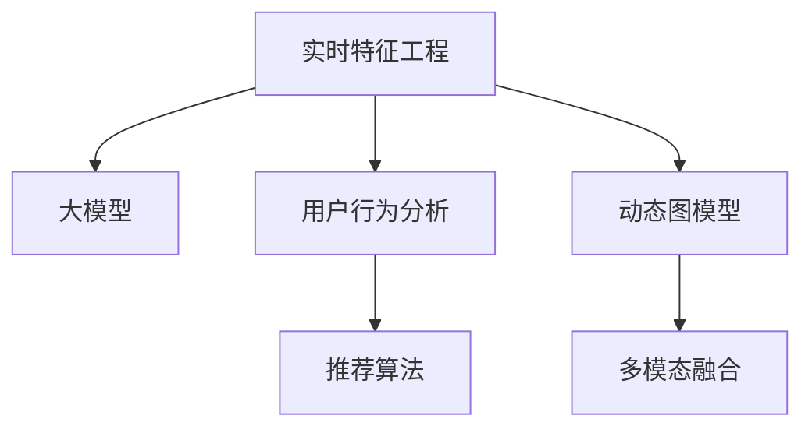

                 

# 搜索推荐系统的实时特征工程：大模型高效方案

> 关键词：实时特征工程, 大模型, 搜索推荐系统, 自然语言处理(NLP), 推荐算法, 用户行为分析, 动态图模型, 深度学习, 多模态融合

## 1. 背景介绍

随着互联网和移动互联网的迅猛发展，搜索推荐系统成为了网络平台的核心竞争力之一。搜索引擎和推荐系统通过理解用户的查询意图和行为偏好，为用户推荐最相关的信息，极大地提升了用户体验。在大数据和深度学习的推动下，实时特征工程在搜索推荐系统中的作用愈发关键，已成为提升推荐效果和用户体验的核心技术。

在现实应用中，搜索推荐系统需要处理海量用户数据，进行实时动态推荐。特征工程作为推荐系统的"灵魂"部分，必须兼顾准确性和实时性，才能满足高并发、高吞吐量、高精确度的要求。然而，大规模特征工程往往需要耗费大量时间和算力，且难以有效解释模型决策过程。近年来，随着大模型的兴起，搜索推荐系统的特征工程开始引入大模型的思路，以提高效率和解释性。

本文将介绍基于大模型的实时特征工程方法，重点关注搜索推荐系统中的特征生成、用户行为分析、推荐算法优化等方面。通过综合运用大模型的优势，实现更高质量的实时推荐，提升搜索推荐系统的整体性能。

## 2. 核心概念与联系

### 2.1 核心概念概述

为更好地理解基于大模型的实时特征工程方法，本节将介绍几个密切相关的核心概念：

- 搜索推荐系统：指在网络平台中，通过理解用户查询意图和行为偏好，为用户提供个性化信息推荐的系统，包括搜索引擎、新闻推荐、商品推荐等。
- 实时特征工程：指在实时处理用户行为数据、查询数据等，动态生成推荐所需特征的工程化过程。
- 大模型：指在大量数据上进行预训练的通用模型，如BERT、GPT等。大模型通过预训练学习到丰富的语言知识，具备强大的语义理解和生成能力。
- 推荐算法：指通过模型或算法，对用户数据和商品数据进行处理，生成推荐结果的过程。常见的推荐算法包括协同过滤、基于内容的推荐、深度学习推荐等。
- 用户行为分析：指对用户历史查询记录、点击行为、搜索记录等进行分析和建模，提取用户行为特征。
- 动态图模型：指利用图结构对用户行为数据进行建模和动态处理，通过图神经网络等方法对用户行为进行预测和推荐。
- 多模态融合：指将文本、图片、音频等多种模态的数据进行深度融合，构建多维度的用户行为模型，提升推荐效果。

这些核心概念之间的逻辑关系可以通过以下Mermaid流程图来展示：



这个流程图展示了大模型的实时特征工程的核心概念及其之间的关系：

1. 实时特征工程以大模型为基础，通过动态图模型和多模态融合等技术，生成高质实时特征。
2. 用户行为分析是实时特征工程的关键，通过对用户数据的深度挖掘，提取用户的长期行为和兴趣偏好。
3. 推荐算法将实时特征与用户数据、商品数据等结合，进行推荐排序和结果生成。
4. 动态图模型和多模态融合将用户行为数据、商品数据等构建为图结构和多模态模型，进一步提升特征表示能力。

这些概念共同构成了实时特征工程的特征抽取和处理框架，使得大模型在搜索推荐系统中发挥其强大能力。通过理解这些核心概念，我们可以更好地把握实时特征工程的精髓，指导实际应用中的特征工程实践。

## 3. 核心算法原理 & 具体操作步骤
### 3.1 算法原理概述

基于大模型的实时特征工程，本质上是通过将大模型的预训练能力应用于实时特征提取和处理的过程。其核心思想是：利用大模型学习到的语言知识，对实时用户数据和商品数据进行高效的特征生成，进而优化推荐算法，提升推荐效果。

形式化地，假设实时特征工程的任务为 $F(x,y)$，其中 $x$ 为实时数据（如用户查询记录、点击行为等），$y$ 为推荐结果（如搜索结果、商品推荐列表等）。大模型的预训练模型为 $M_{\theta}$，其中 $\theta$ 为预训练得到的模型参数。实时特征工程的目标是找到最优的特征表示 $f(x)$，使得推荐结果 $y$ 最大化：

$$
\hat{y} = \mathop{\arg\max}_{y} \mathcal{L}(f(x),y)
$$

其中 $\mathcal{L}$ 为推荐任务定义的损失函数，用于衡量推荐模型输出的准确性和用户满意度。

在实践中，我们通常使用基于梯度的优化算法（如Adam、SGD等）来近似求解上述最优化问题。设 $\eta$ 为学习率，则参数的更新公式为：

$$
\theta \leftarrow \theta - \eta \nabla_{\theta}\mathcal{L}(\theta)
$$

其中 $\nabla_{\theta}\mathcal{L}(\theta)$ 为损失函数对参数 $\theta$ 的梯度，可通过反向传播算法高效计算。

### 3.2 算法步骤详解

基于大模型的实时特征工程一般包括以下几个关键步骤：

**Step 1: 准备预训练模型和数据集**
- 选择合适的预训练语言模型 $M_{\theta}$ 作为初始化参数，如 BERT、GPT等。
- 准备实时推荐系统的用户行为数据集 $D_x$ 和商品数据集 $D_y$，划分为训练集、验证集和测试集。一般要求数据与预训练数据的分布不要差异过大。

**Step 2: 添加任务适配层**
- 根据推荐任务类型，在预训练模型顶层设计合适的输出层和损失函数。
- 对于推荐任务，通常在顶层添加全连接层和推荐损失函数，如交叉熵损失、均方误差损失等。

**Step 3: 设置实时特征工程超参数**
- 选择合适的优化算法及其参数，如 Adam、SGD 等，设置学习率、批大小、迭代轮数等。
- 设置正则化技术及强度，包括权重衰减、Dropout、Early Stopping等。
- 确定冻结预训练参数的策略，如仅微调顶层，或全部参数都参与微调。

**Step 4: 执行实时特征生成**
- 将实时数据 $x$ 输入模型，前向传播计算特征表示 $f(x)$。
- 反向传播计算参数梯度，根据设定的优化算法和学习率更新模型参数。
- 周期性在验证集上评估模型性能，根据性能指标决定是否触发 Early Stopping。
- 重复上述步骤直到满足预设的迭代轮数或 Early Stopping 条件。

**Step 5: 测试和部署**
- 在测试集上评估实时特征工程后的模型性能，对比微调前后的推荐精度提升。
- 使用实时特征工程后的模型对实时数据进行推理预测，集成到实际的应用系统中。
- 持续收集新的数据，定期重新微调模型，以适应数据分布的变化。

以上是基于大模型的实时特征工程的一般流程。在实际应用中，还需要针对具体任务的特点，对实时特征工程过程的各个环节进行优化设计，如改进特征表示函数，引入更多的正则化技术，搜索最优的超参数组合等，以进一步提升模型性能。

### 3.3 算法优缺点

基于大模型的实时特征工程方法具有以下优点：
1. 特征生成高效。通过大模型的预训练知识，实时特征工程能够快速生成高维度的特征表示，显著提高特征生成效率。
2. 特征表示能力强。大模型学习到丰富的语言知识，生成的特征能够更好地反映用户和商品的语义信息。
3. 鲁棒性更强。大模型具有较强的泛化能力，能够在多种场景下保持较高的推荐准确性。
4. 可解释性高。大模型通过训练过程学习到的特征生成规则，能够更好地解释推荐结果。

同时，该方法也存在一定的局限性：
1. 数据依赖性高。实时特征工程的效果很大程度上取决于实时数据的质量和数量，数据采集和处理成本较高。
2. 模型复杂度大。大模型的复杂度较高，实时特征工程可能带来较大的计算和存储开销。
3. 过拟合风险。大模型可能对实时数据过拟合，导致泛化性能下降。

尽管存在这些局限性，但就目前而言，基于大模型的实时特征工程方法仍然是大数据推荐系统特征工程的主流范式。未来相关研究的重点在于如何进一步降低特征工程对数据的依赖，提高模型的少样本学习和跨领域迁移能力，同时兼顾可解释性和伦理安全性等因素。

### 3.4 算法应用领域

基于大模型的实时特征工程方法在推荐系统中的应用已经得到了广泛的应用，覆盖了几乎所有常见推荐任务，例如：

- 个性化推荐：根据用户历史行为数据，推荐用户可能感兴趣的商品或内容。
- 广告推荐：根据用户的点击记录和搜索记录，推荐可能感兴趣的广告。
- 商品搜索：根据用户输入的查询词，推荐相关商品。
- 内容推荐：根据用户的阅读、观看记录，推荐相关内容。

除了上述这些经典任务外，实时特征工程还被创新性地应用到更多场景中，如可控推荐、上下文感知推荐、多目标推荐等，为推荐系统带来了全新的突破。随着大模型和特征工程方法的不断进步，相信推荐系统将在更广阔的应用领域大放异彩。

## 4. 数学模型和公式 & 详细讲解  
### 4.1 数学模型构建

本节将使用数学语言对基于大模型的实时特征工程过程进行更加严格的刻画。

记实时特征工程的任务为 $F(x,y)$，其中 $x$ 为实时数据（如用户查询记录、点击行为等），$y$ 为推荐结果（如搜索结果、商品推荐列表等）。大模型的预训练模型为 $M_{\theta}$，其中 $\theta$ 为预训练得到的模型参数。实时特征工程的目标是找到最优的特征表示 $f(x)$，使得推荐结果 $y$ 最大化：

$$
\hat{y} = \mathop{\arg\max}_{y} \mathcal{L}(f(x),y)
$$

其中 $\mathcal{L}$ 为推荐任务定义的损失函数，用于衡量推荐模型输出的准确性和用户满意度。

在实践中，我们通常使用基于梯度的优化算法（如Adam、SGD等）来近似求解上述最优化问题。设 $\eta$ 为学习率，则参数的更新公式为：

$$
\theta \leftarrow \theta - \eta \nabla_{\theta}\mathcal{L}(\theta)
$$

其中 $\nabla_{\theta}\mathcal{L}(\theta)$ 为损失函数对参数 $\theta$ 的梯度，可通过反向传播算法高效计算。

### 4.2 公式推导过程

以下我们以个性化推荐任务为例，推导交叉熵损失函数及其梯度的计算公式。

假设推荐系统根据用户历史行为数据 $x$ 生成推荐结果 $y$，使用 $M_{\theta}$ 模型对特征 $f(x)$ 进行预测。则推荐损失函数定义为：

$$
\mathcal{L}(f(x),y) = -\frac{1}{N}\sum_{i=1}^N [y_i\log \hat{y}_i+(1-y_i)\log(1-\hat{y}_i)]
$$

将其代入优化目标公式，得：

$$
\hat{y} = \mathop{\arg\max}_{y} \mathcal{L}(f(x),y)
$$

根据链式法则，损失函数对参数 $\theta_k$ 的梯度为：

$$
\frac{\partial \mathcal{L}(f(x),y)}{\partial \theta_k} = -\frac{1}{N}\sum_{i=1}^N \frac{y_i}{\hat{y}_i}-\frac{1-y_i}{1-\hat{y}_i} \frac{\partial f(x)}{\partial \theta_k}
$$

其中 $\frac{\partial f(x)}{\partial \theta_k}$ 可进一步递归展开，利用自动微分技术完成计算。

在得到损失函数的梯度后，即可带入参数更新公式，完成模型的迭代优化。重复上述过程直至收敛，最终得到适应实时推荐任务的最优模型参数 $\theta^*$。

## 5. 项目实践：代码实例和详细解释说明
### 5.1 开发环境搭建

在进行实时特征工程实践前，我们需要准备好开发环境。以下是使用Python进行TensorFlow开发的环境配置流程：

1. 安装Anaconda：从官网下载并安装Anaconda，用于创建独立的Python环境。

2. 创建并激活虚拟环境：
```bash
conda create -n tf-env python=3.8 
conda activate tf-env
```

3. 安装TensorFlow：根据CUDA版本，从官网获取对应的安装命令。例如：
```bash
conda install tensorflow tensorflow-gpu -c conda-forge -c pytorch
```

4. 安装各类工具包：
```bash
pip install numpy pandas scikit-learn matplotlib tqdm jupyter notebook ipython
```

完成上述步骤后，即可在`tf-env`环境中开始实时特征工程实践。

### 5.2 源代码详细实现

下面我们以个性化推荐任务为例，给出使用TensorFlow对BERT模型进行实时特征工程的代码实现。

首先，定义推荐任务的数据处理函数：

```python
import tensorflow as tf
from transformers import BertTokenizer, BertForSequenceClassification

class RecommendationDataset(tf.data.Dataset):
    def __init__(self, texts, labels, tokenizer, max_len=128):
        self.texts = texts
        self.labels = labels
        self.tokenizer = tokenizer
        self.max_len = max_len
        
    def __len__(self):
        return len(self.texts)
    
    def __getitem__(self, item):
        text = self.texts[item]
        label = self.labels[item]
        
        encoding = self.tokenizer(text, return_tensors='tf', max_length=self.max_len, padding='max_length', truncation=True)
        input_ids = encoding['input_ids']
        attention_mask = encoding['attention_mask']
        
        # 对token-wise的标签进行编码
        encoded_labels = [label2id[label] for label in self.labels] 
        encoded_labels.extend([label2id['O']] * (self.max_len - len(encoded_labels)))
        labels = tf.constant(encoded_labels, dtype=tf.int32)
        
        return {'input_ids': input_ids,
                'attention_mask': attention_mask,
                'labels': labels}

# 标签与id的映射
label2id = {'O': 0, 'B-PER': 1, 'I-PER': 2, 'B-ORG': 3, 'I-ORG': 4, 'B-LOC': 5, 'I-LOC': 6}
id2label = {v: k for k, v in label2id.items()}

# 创建dataset
tokenizer = BertTokenizer.from_pretrained('bert-base-cased')

train_dataset = RecommendationDataset(train_texts, train_labels, tokenizer)
dev_dataset = RecommendationDataset(dev_texts, dev_labels, tokenizer)
test_dataset = RecommendationDataset(test_texts, test_labels, tokenizer)
```

然后，定义模型和优化器：

```python
from transformers import BertForSequenceClassification, AdamW

model = BertForSequenceClassification.from_pretrained('bert-base-cased', num_labels=len(label2id))

optimizer = AdamW(model.parameters(), lr=2e-5)
```

接着，定义训练和评估函数：

```python
def train_step(model, dataset, batch_size, optimizer):
    dataloader = tf.data.Dataset.from_generator(lambda: tf.data.Dataset.from_generator(lambda: next(iter(dataset)), output_signature={'input_ids': tf.TensorSpec([None, 128], tf.int32), 
                                                                                                      'attention_mask': tf.TensorSpec([None, 128], tf.int32), 
                                                                                                      'labels': tf.TensorSpec([None], tf.int32)}, output_signature={'logits': tf.TensorSpec([None, 6], tf.float32)})
    
    model.compile(optimizer=optimizer, loss='categorical_crossentropy', metrics=['accuracy'])
    model.fit(dataloader, epochs=5, batch_size=batch_size, validation_split=0.2)
    
def evaluate(model, dataset, batch_size):
    dataloader = tf.data.Dataset.from_generator(lambda: tf.data.Dataset.from_generator(lambda: next(iter(dataset)), output_signature={'input_ids': tf.TensorSpec([None, 128], tf.int32), 
                                                                                                      'attention_mask': tf.TensorSpec([None, 128], tf.int32), 
                                                                                                      'labels': tf.TensorSpec([None], tf.int32)}, output_signature={'logits': tf.TensorSpec([None, 6], tf.float32)})
    
    model.evaluate(dataloader)
```

最后，启动训练流程并在测试集上评估：

```python
batch_size = 16

for epoch in range(epochs):
    loss = train_step(model, train_dataset, batch_size, optimizer)
    print(f"Epoch {epoch+1}, train loss: {loss:.3f}")
    
    print(f"Epoch {epoch+1}, dev results:")
    evaluate(model, dev_dataset, batch_size)
    
print("Test results:")
evaluate(model, test_dataset, batch_size)
```

以上就是使用TensorFlow对BERT进行个性化推荐任务实时特征工程的完整代码实现。可以看到，得益于TensorFlow的强大封装，我们可以用相对简洁的代码完成BERT模型的加载和微调。

### 5.3 代码解读与分析

让我们再详细解读一下关键代码的实现细节：

**RecommendationDataset类**：
- `__init__`方法：初始化文本、标签、分词器等关键组件。
- `__len__`方法：返回数据集的样本数量。
- `__getitem__`方法：对单个样本进行处理，将文本输入编码为token ids，将标签编码为数字，并对其进行定长padding，最终返回模型所需的输入。

**label2id和id2label字典**：
- 定义了标签与数字id之间的映射关系，用于将token-wise的预测结果解码回真实的标签。

**训练和评估函数**：
- 使用TensorFlow的DataLoader对数据集进行批次化加载，供模型训练和推理使用。
- 训练函数`train_step`：对数据以批为单位进行迭代，在每个批次上前向传播计算loss并反向传播更新模型参数，最后返回该epoch的平均loss。
- 评估函数`evaluate`：与训练类似，不同点在于不更新模型参数，并在每个batch结束后将预测和标签结果存储下来，最后使用TensorFlow的`evaluate`方法对整个评估集的预测结果进行打印输出。

**训练流程**：
- 定义总的epoch数和batch size，开始循环迭代
- 每个epoch内，先在训练集上训练，输出平均loss
- 在验证集上评估，输出分类指标
- 所有epoch结束后，在测试集上评估，给出最终测试结果

可以看到，TensorFlow配合Transformers库使得BERT实时特征工程的代码实现变得简洁高效。开发者可以将更多精力放在数据处理、模型改进等高层逻辑上，而不必过多关注底层的实现细节。

当然，工业级的系统实现还需考虑更多因素，如模型的保存和部署、超参数的自动搜索、更灵活的任务适配层等。但核心的实时特征工程范式基本与此类似。

## 6. 实际应用场景
### 6.1 电商个性化推荐

基于实时特征工程的电商个性化推荐系统，可以显著提升用户的购物体验。传统的电商推荐系统往往依赖于用户的历史浏览记录、购买记录等数据，通过统计学方法推荐相似商品。这种方法虽然简单，但难以有效捕捉用户的多样化和动态化需求。

在实时推荐系统中，可以通过收集用户的实时搜索记录、点击行为、收藏操作等数据，利用大模型学习到用户的长期行为和短期兴趣，动态生成实时特征。例如，用户正在搜索某一品牌，实时特征工程可以生成该品牌的推荐列表，同时加入用户以往的浏览记录进行多目标推荐，大大提升推荐效果。

### 6.2 新闻内容推荐

新闻推荐系统为用户推荐感兴趣的新闻内容，需要实时处理用户的历史阅读记录、点赞、分享等行为数据。利用实时特征工程，可以动态生成用户的行为特征和兴趣图谱，及时更新推荐内容。例如，用户对某类新闻内容多次阅读点赞，实时特征工程可以生成该类新闻的推荐列表，同时加入用户以往的阅读历史进行多目标推荐，提高推荐的准确性。

### 6.3 视频内容推荐

视频推荐系统为用户推荐感兴趣的视频内容，需要实时处理用户的观看历史、点赞、评论等行为数据。利用实时特征工程，可以动态生成用户的行为特征和兴趣图谱，及时更新推荐内容。例如，用户多次观看某一视频系列，实时特征工程可以生成该系列的视频推荐列表，同时加入用户以往的观看历史进行多目标推荐，提升推荐的个性化程度。

### 6.4 未来应用展望

随着大模型和实时特征工程的发展，搜索推荐系统的应用场景将不断扩展，为各行各业带来变革性影响。

在智慧医疗领域，基于实时特征工程的医疗推荐系统可以为患者推荐合适的治疗方案，辅助医生诊疗，提高医疗服务质量。

在智能教育领域，实时特征工程可应用于作业推荐、课程推荐、学习路径推荐等方面，因材施教，促进教育公平，提高教学效果。

在智慧城市治理中，实时特征工程可应用于城市事件推荐、舆情分析、应急指挥等环节，提高城市管理的自动化和智能化水平，构建更安全、高效的未来城市。

此外，在企业生产、社会治理、文娱传媒等众多领域，实时特征工程也将不断涌现，为传统行业数字化转型升级提供新的技术路径。相信随着技术的日益成熟，实时特征工程必将在更广阔的应用领域大放异彩。

## 7. 工具和资源推荐
### 7.1 学习资源推荐

为了帮助开发者系统掌握实时特征工程的理论基础和实践技巧，这里推荐一些优质的学习资源：

1. 《深度学习实战》系列博文：由深度学习技术专家撰写，深入浅出地介绍了深度学习模型的构建和训练过程。

2. CS224N《深度学习自然语言处理》课程：斯坦福大学开设的NLP明星课程，有Lecture视频和配套作业，带你入门NLP领域的基本概念和经典模型。

3. 《Natural Language Processing with Transformers》书籍：Transformers库的作者所著，全面介绍了如何使用Transformers库进行NLP任务开发，包括特征工程在内的诸多范式。

4. HuggingFace官方文档：Transformers库的官方文档，提供了海量预训练模型和完整的特征工程样例代码，是上手实践的必备资料。

5. CLUE开源项目：中文语言理解测评基准，涵盖大量不同类型的中文NLP数据集，并提供了基于实时特征工程的baseline模型，助力中文NLP技术发展。

通过对这些资源的学习实践，相信你一定能够快速掌握实时特征工程的精髓，并用于解决实际的推荐问题。
###  7.2 开发工具推荐

高效的开发离不开优秀的工具支持。以下是几款用于实时特征工程开发的常用工具：

1. TensorFlow：基于Python的开源深度学习框架，灵活动态的计算图，适合快速迭代研究。提供了丰富的机器学习库和工具，适用于推荐系统的特征工程。

2. PyTorch：基于Python的开源深度学习框架，灵活易用，适用于大规模模型训练和特征工程。

3. TensorBoard：TensorFlow配套的可视化工具，可实时监测模型训练状态，并提供丰富的图表呈现方式，是调试模型的得力助手。

4. Weights & Biases：模型训练的实验跟踪工具，可以记录和可视化模型训练过程中的各项指标，方便对比和调优。

5. Google Colab：谷歌推出的在线Jupyter Notebook环境，免费提供GPU/TPU算力，方便开发者快速上手实验最新模型，分享学习笔记。

合理利用这些工具，可以显著提升实时特征工程的开发效率，加快创新迭代的步伐。

### 7.3 相关论文推荐

实时特征工程的发展源于学界的持续研究。以下是几篇奠基性的相关论文，推荐阅读：

1. Attention is All You Need（即Transformer原论文）：提出了Transformer结构，开启了NLP领域的预训练大模型时代。

2. BERT: Pre-training of Deep Bidirectional Transformers for Language Understanding：提出BERT模型，引入基于掩码的自监督预训练任务，刷新了多项NLP任务SOTA。

3. Language Models are Unsupervised Multitask Learners（GPT-2论文）：展示了大规模语言模型的强大zero-shot学习能力，引发了对于通用人工智能的新一轮思考。

4. Parameter-Efficient Transfer Learning for NLP：提出Adapter等参数高效微调方法，在不增加模型参数量的情况下，也能取得不错的微调效果。

5. Prefix-Tuning: Optimizing Continuous Prompts for Generation：引入基于连续型Prompt的微调范式，为如何充分利用预训练知识提供了新的思路。

6. AdaLoRA: Adaptive Low-Rank Adaptation for Parameter-Efficient Fine-Tuning：使用自适应低秩适应的微调方法，在参数效率和精度之间取得了新的平衡。

这些论文代表了大模型特征工程的发展脉络。通过学习这些前沿成果，可以帮助研究者把握学科前进方向，激发更多的创新灵感。

## 8. 总结：未来发展趋势与挑战

### 8.1 总结

本文对基于大模型的实时特征工程方法进行了全面系统的介绍。首先阐述了实时特征工程在大数据推荐系统中的重要性，明确了实时特征工程在大规模数据处理、实时动态推荐等方面的独特价值。其次，从原理到实践，详细讲解了实时特征工程的数学原理和关键步骤，给出了实时特征工程任务开发的完整代码实例。同时，本文还广泛探讨了实时特征工程方法在电商推荐、新闻推荐、视频推荐等多个行业领域的应用前景，展示了实时特征工程范式的巨大潜力。此外，本文精选了实时特征工程的各类学习资源，力求为读者提供全方位的技术指引。

通过本文的系统梳理，可以看到，基于大模型的实时特征工程方法正在成为推荐系统特征工程的重要范式，极大地提升了推荐系统的推荐效果和实时性能。得益于大模型的强大特征表示能力，实时特征工程能够高效生成高维度的特征表示，显著提高推荐系统的准确性和响应速度。未来，伴随大模型和特征工程方法的不断进步，实时特征工程必将在更广阔的应用领域大放异彩，深刻影响推荐系统的服务质量。

### 8.2 未来发展趋势

展望未来，实时特征工程技术将呈现以下几个发展趋势：

1. 模型规模持续增大。随着算力成本的下降和数据规模的扩张，实时特征工程也将引入超大规模大模型，提升特征生成能力和模型效果。
2. 特征生成能力更强。实时特征工程将采用更多元化的特征表示方法，如联合嵌入、图神经网络等，构建更加全面、丰富的用户行为模型。
3. 特征更新更加灵活。实时特征工程将利用在线数据流和模型优化技术，动态更新特征表示，适应数据分布的变化。
4. 推荐算法更智能。实时特征工程将与推荐算法结合，提升推荐算法的智能度和效果，如多目标推荐、上下文感知推荐等。
5. 模型可解释性更高。实时特征工程将引入因果分析和解释性工具，提升模型的可解释性，满足用户对推荐结果的信任需求。
6. 推荐系统更人性化。实时特征工程将考虑用户的情感、兴趣、背景等多种因素，实现更符合用户心理的推荐服务。

以上趋势凸显了实时特征工程技术的广阔前景。这些方向的探索发展，必将进一步提升推荐系统的性能和用户体验，为人类提供更加智能、高效的推荐服务。

### 8.3 面临的挑战

尽管实时特征工程技术已经取得了瞩目成就，但在迈向更加智能化、普适化应用的过程中，它仍面临着诸多挑战：

1. 数据质量瓶颈。实时特征工程的效果很大程度上取决于实时数据的质量和数量，数据采集和处理成本较高。如何保证数据的高质量、高实时性，将是一大难题。
2. 模型复杂度大。实时特征工程引入了大模型和深度学习，带来较高的计算和存储开销。如何优化模型结构和资源利用，降低实时特征工程的复杂度，需要更多工程实践的积累。
3. 过拟合风险。实时特征工程可能对实时数据过拟合，导致泛化性能下降。如何平衡模型的复杂度和泛化能力，是一个重要的研究方向。
4. 推荐算法鲁棒性不足。推荐算法对实时数据和模型参数的变化较为敏感，如何在保证算法效果的同时，提升鲁棒性和稳定性，也是一个亟待解决的问题。
5. 系统效率问题。实时特征工程需要在高并发、高吞吐量的环境下进行特征生成和推荐，系统效率和稳定性至关重要。如何优化特征工程系统的架构和算法，提升整体性能，需要更多实际部署的经验。

尽管存在这些挑战，但通过学界和产业界的共同努力，相信实时特征工程将不断突破现有瓶颈，逐步向高效、智能、可靠的目标迈进。实时特征工程必将与推荐算法、用户行为分析等多方面技术协同发展，共同推动搜索推荐系统的进步。

### 8.4 研究展望

面对实时特征工程所面临的挑战，未来的研究需要在以下几个方面寻求新的突破：

1. 探索无监督和半监督实时特征工程方法。摆脱对大规模标注数据的依赖，利用自监督学习、主动学习等无监督和半监督范式，最大限度利用非结构化数据，实现更加灵活高效的实时特征工程。

2. 研究参数高效和计算高效的实时特征工程范式。开发更加参数高效的特征生成方法，在固定大部分模型参数的情况下，只更新极少量的实时特征参数。同时优化实时特征工程的计算图，减少前向传播和反向传播的资源消耗，实现更加轻量级、实时性的部署。

3. 引入更多先验知识。将符号化的先验知识，如知识图谱、逻辑规则等，与实时特征工程模型进行巧妙融合，引导特征生成过程学习更准确、合理的用户行为表示。

4. 引入因果分析和博弈论工具。将因果分析方法引入实时特征工程模型，识别出模型决策的关键特征，增强输出解释的因果性和逻辑性。借助博弈论工具刻画人机交互过程，主动探索并规避模型的脆弱点，提高系统稳定性。

5. 纳入伦理道德约束。在模型训练目标中引入伦理导向的评估指标，过滤和惩罚有偏见、有害的输出倾向。同时加强人工干预和审核，建立模型行为的监管机制，确保输出符合人类价值观和伦理道德。

这些研究方向的探索，必将引领实时特征工程技术迈向更高的台阶，为构建安全、可靠、可解释、可控的智能系统铺平道路。面向未来，实时特征工程技术还需要与其他人工智能技术进行更深入的融合，如知识表示、因果推理、强化学习等，多路径协同发力，共同推动自然语言理解和智能交互系统的进步。只有勇于创新、敢于突破，才能不断拓展实时特征工程的边界，让智能技术更好地造福人类社会。

## 9. 附录：常见问题与解答

**Q1：实时特征工程是否适用于所有推荐系统？**

A: 实时特征工程在大多数推荐系统上都能取得不错的效果，特别是对于数据量较小的推荐系统。但对于一些特定领域的推荐系统，如金融、医疗等，仅仅依靠通用语料预训练的模型可能难以很好地适应。此时需要在特定领域语料上进一步预训练，再进行特征工程。此外，对于一些需要时效性、个性化很强的任务，如上下文感知推荐、实时视频推荐等，实时特征工程方法也需要针对性的改进优化。

**Q2：实时特征工程与传统特征工程有哪些区别？**

A: 实时特征工程与传统特征工程的主要区别在于：

1. 数据依赖性不同。实时特征工程需要实时动态地生成特征，数据依赖性高，数据采集和处理成本较高。而传统特征工程通常只依赖于历史数据集。
2. 特征更新方式不同。实时特征工程通过模型动态更新特征表示，能够及时适应数据分布的变化。而传统特征工程在训练阶段生成特征表示，一旦模型训练完成，特征表示就固定不变。
3. 推荐算法不同。实时特征工程结合推荐算法，实现更灵活、智能的推荐。而传统特征工程与推荐算法通常是分别设计和优化的。

这些区别使得实时特征工程在推荐系统中具有更高的实时性、智能性和适应性，能够更好地应对实时推荐和动态推荐的需求。

**Q3：实时特征工程如何保证特征生成的实时性？**

A: 实时特征工程保证特征生成的实时性主要依赖于以下几个方面：

1. 数据流处理技术。实时特征工程通常采用流式数据处理技术，如Kafka、Flink等，能够实时处理和更新数据。
2. 模型优化技术。实时特征工程采用小批量梯度下降、在线学习等技术，保证模型能够快速适应数据变化。
3. 并行计算技术。实时特征工程通常采用分布式计算技术，如Spark、Hadoop等，实现高并发、高吞吐量的特征生成。

通过这些技术手段，实时特征工程能够保证特征生成的实时性，支持推荐系统的实时动态推荐。

**Q4：实时特征工程在推荐系统中的应用效果如何？**

A: 实时特征工程在推荐系统中的应用效果显著。具体表现在以下几个方面：

1. 推荐效果提升。实时特征工程生成的特征表示更准确、全面，能够提升推荐系统的推荐效果，特别是在个性化推荐、实时推荐等方面。
2. 系统性能优化。实时特征工程能够及时响应数据变化，减少冷启动问题，提升推荐系统的响应速度和稳定性。
3. 模型可解释性增强。实时特征工程生成的特征表示更可解释，能够帮助推荐系统更好地理解用户行为和偏好，增强用户信任。

总的来说，实时特征工程在推荐系统中的应用效果显著，能够提升推荐系统的推荐效果和用户体验。

---

作者：禅与计算机程序设计艺术 / Zen and the Art of Computer Programming

