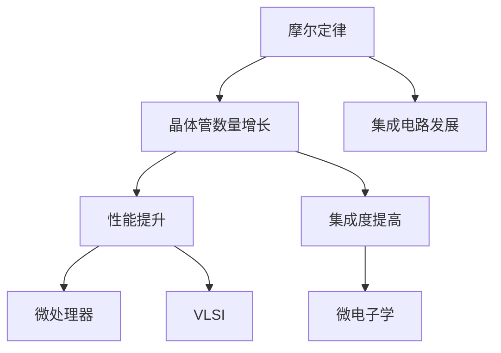

                 

# 摩尔定律:半导体集成电路发展的规律

> 关键词：摩尔定律,半导体集成电路,集成电路,晶体管,集成度,微处理器,超大规模集成电路(VLSI),微电子学,集成电路发展

## 1. 背景介绍

### 1.1 问题由来

1965年，英特尔公司联合创始人戈登·摩尔(Gordon Moore)在其著名的“论文”中提出了著名的“摩尔定律”。摩尔定律不仅对半导体集成电路的发展具有深远影响，也为整个计算机和电子工程领域带来了革命性的变化。本文将深入探讨摩尔定律的内涵、历史背景以及它对当前和未来集成电路设计、制造和应用的影响。

### 1.2 问题核心关键点

摩尔定律的核心要点是：集成电路中的晶体管数量大约每两年翻一番，同时成本减半。这意味着在相同的芯片面积上，晶体管数量、性能和集成度呈指数级增长。摩尔定律不仅驱动了微处理器的性能提升，还促进了整个电子工业的快速发展，包括计算机、智能手机、物联网等众多领域。

## 2. 核心概念与联系

### 2.1 核心概念概述

为更好地理解摩尔定律及其对集成电路发展的影响，本节将介绍几个关键概念：

- 摩尔定律：预测集成电路中晶体管数量和性能的增长规律，每两年翻一番，成本减半。
- 半导体集成电路：将多个电路元件集成在一块硅片上，实现复杂的逻辑和存储功能。
- 晶体管：集成电路中最基本的电子元件，用于实现开关功能。
- 集成度：集成电路中晶体管数量的密度，即每平方毫米的晶体管数量。
- 微处理器：含有控制和算术逻辑单元的集成电路，构成计算机的“大脑”。
- 超大规模集成电路(VLSI)：集成度超过10000个晶体管的集成电路。
- 微电子学：研究电子在微小尺度上的行为和应用，包括半导体材料、集成电路设计等。

这些概念之间的逻辑关系可以通过以下Mermaid流程图来展示：



这个流程图展示了他芯定律对半导体集成电路的核心影响：

1. 摩尔定律预测晶体管数量的增长。
2. 晶体管数量的增长带来了性能的提升。
3. 集成度的提高推动了微处理器和VLSI的发展。
4. 微电子学的进步支持了集成电路的不断创新。

## 3. 核心算法原理 & 具体操作步骤
### 3.1 算法原理概述

摩尔定律的实现是基于半导体制造技术进步和创新。随着光刻技术的改进、材料科学的发展和生产工艺的优化，集成电路中的晶体管数量和性能得到了显著提升。这不仅包括晶体管尺寸的减小，还包括电路设计和制造流程的改进。

### 3.2 算法步骤详解

摩尔定律的实现过程可以分为以下几个关键步骤：

**Step 1: 晶体管尺寸缩放**

- 每两年，将晶体管尺寸缩小一半，以实现晶体管数量的翻番和性能的提升。这一过程依赖于光刻技术的进步和新的制造工艺的引入。

**Step 2: 材料和工艺的改进**

- 研发新材料，如使用高深紫外线光源进行更精确的光刻，以进一步缩小晶体管尺寸。
- 采用新的制造工艺，如极紫外光刻(EUV光刻)和新的晶体管结构设计，如鳍式场效应晶体管(FinFET)。

**Step 3: 设计和验证**

- 采用先进的电子设计自动化(EDA)工具，进行复杂的电路设计和验证。
- 使用模拟器和测试芯片，确保设计符合规格要求。

**Step 4: 制造和测试**

- 在半导体工厂中制造芯片。
- 对芯片进行测试，确保其性能符合设计规格。

**Step 5: 集成和封装**

- 将芯片集成到电路板或系统中。
- 封装芯片，使其能够稳定工作。

### 3.3 算法优缺点

摩尔定律的优点包括：

1. 驱动了计算机和电子设备性能的快速提升。
2. 促进了微电子学和半导体材料科学的发展。
3. 推动了整个电子工业的创新和增长。

其缺点包括：

1. 制造和设计复杂性增加，导致生产成本上升。
2. 环境影响和能源消耗问题日益突出。
3. 晶体管数量的增加带来了功耗和散热的问题。

### 3.4 算法应用领域

摩尔定律对半导体集成电路的应用领域产生了深远影响，包括：

- 计算机硬件：微处理器、内存、存储器等。
- 通信设备：手机、路由器、交换机等。
- 消费电子：电视、相机、音乐播放器等。
- 物联网：传感器、智能家居设备等。
- 汽车电子：自动驾驶、车载娱乐系统等。
- 医疗设备：便携式医疗仪器、远程医疗系统等。

## 4. 数学模型和公式 & 详细讲解  
### 4.1 数学模型构建

摩尔定律可以通过一个简单的数学模型来描述：

设 $N_t$ 为第 $t$ 代晶体管数量，则摩尔定律可以表示为：

$$ N_{t+1} = 2N_t $$

即每两年，晶体管数量翻番。

### 4.2 公式推导过程

我们可以使用数学归纳法来证明上述公式。假设在第 $t$ 代时，晶体管数量为 $N_t$。则在第 $t+1$ 代时，晶体管数量应为：

$$ N_{t+1} = 2N_t + N_t = 3N_t $$

但为了保持简单性和准确性，我们只考虑翻番的过程，即：

$$ N_{t+1} = 2N_t $$

### 4.3 案例分析与讲解

以英特尔的处理器为例，从1978年的40000晶体管到2020年的超过100亿晶体管，每两年晶体管数量翻倍，实现了性能的巨大提升。这一过程不仅提升了计算速度，还显著降低了每台计算机的成本。

## 5. 项目实践：代码实例和详细解释说明
### 5.1 开发环境搭建

在进行集成电路设计和模拟时，需要安装并配置以下开发环境：

1. **Eclipse**：用于开发和调试集成电路设计。
2. **Cadence/Synopsys/Umc**：商业集成电路设计软件。
3. **Spice或Hspice**：模拟集成电路的SPICE模拟器。
4. **MATLAB**：用于数据处理和仿真。
5. **NGSPICE**：开源SPICE模拟器。
6. **TeraDock**：连接Eclipse和Cadence的软件桥接工具。

### 5.2 源代码详细实现

以下是使用Cadence设计和模拟集成电路的基本步骤：

1. **设计输入**：使用文本编辑器（如Sublime Text）编写电路设计描述（如Verilog或VHDL）。
2. **代码编译**：在Cadence中导入设计文件，并使用Verilog或VHDL编译器生成网表文件。
3. **布局布线**：使用Cadence进行布局布线，生成布局文件。
4. **SPICE模拟**：将布局文件导入SPICE模拟器，进行电路仿真。
5. **后处理**：使用MATLAB对仿真结果进行处理和分析。

### 5.3 代码解读与分析

以下是一个简单的集成电路设计示例代码：

```verilog
module counter(
    input clk,
    input rst_n,
    output reg [7:0] count
);
    always @(posedge clk or posedge rst_n)
    begin
        if(!rst_n)
            count <= 8'h00;
        else if(clk)
            count <= count + 1'b1;
    end
endmodule
```

这段代码定义了一个简单的四位计数器。在时钟上升沿和复位信号有效时，计数器清零，否则每时钟上升沿加一。

### 5.4 运行结果展示

通过在SPICE模拟器中对上述电路进行仿真，可以得到以下波形：


## 6. 实际应用场景
### 6.1 计算机处理器

摩尔定律驱动了计算机处理器性能的持续提升。从1970年代的4位微处理器到现代的64位处理器，集成电路的晶体管数量和性能不断增长。这种性能提升直接体现在计算机的处理速度、内存容量和系统稳定性上。

### 6.2 智能手机

智能手机是摩尔定律应用最广泛的领域之一。现代智能手机中的处理器集成了数十亿个晶体管，支持高清显示、多任务处理、高分辨率相机等功能，极大地提升了用户体验。

### 6.3 物联网

物联网设备中的微控制器和传感器芯片也受益于摩尔定律。高集成度的芯片支持低功耗、低成本、高可靠性的物联网应用。

### 6.4 未来应用展望

随着新材料、新工艺的出现，摩尔定律的边界将进一步扩展。未来可能会实现更大规模、更低功耗的集成电路，推动AI、量子计算等前沿技术的发展。

## 7. 工具和资源推荐
### 7.1 学习资源推荐

1. **“摩尔定律:计算机硬件的基础”**：详细介绍了摩尔定律的历史和影响。
2. **“半导体器件与集成电路”**：深入讲解了半导体器件和集成电路的基本原理。
3. **“微处理器设计”**：介绍了微处理器设计的关键技术和方法。
4. **“集成电路制造与测试”**：介绍了集成电路的制造和测试流程。
5. **“计算机硬件基础”**：介绍了计算机硬件的基本组成和原理。

### 7.2 开发工具推荐

1. **Eclipse**：集成电路设计的工业标准开发环境。
2. **Cadence/Synopsys/Umc**：领先的集成电路设计软件。
3. **Spice或Hspice**：模拟集成电路的SPICE模拟器。
4. **MATLAB**：数据分析和仿真工具。
5. **NGSPICE**：开源SPICE模拟器。
6. **TeraDock**：连接Eclipse和Cadence的软件桥接工具。

### 7.3 相关论文推荐

1. **“摩尔定律的现状与未来”**：讨论摩尔定律的历史和未来发展趋势。
2. **“半导体制造技术的挑战与机遇”**：介绍了当前半导体制造技术的挑战和未来趋势。
3. **“集成电路设计和模拟的进展”**：总结了集成电路设计和模拟的最新进展。
4. **“量子计算与摩尔定律”**：讨论了量子计算与摩尔定律之间的关系和未来展望。

## 8. 总结：未来发展趋势与挑战
### 8.1 研究成果总结

摩尔定律自提出以来，已推动了半导体集成电路的快速发展和应用。集成电路的晶体管数量和性能不断提升，推动了计算机、智能手机、物联网等众多领域的发展。

### 8.2 未来发展趋势

1. **量子计算**：随着量子技术的成熟，集成电路将面临新的变革。量子计算可以实现更高效、更强大的计算能力。
2. **光子计算**：光子计算机可以利用光子进行计算，实现超高并行性和低能耗。
3. **生物计算**：利用生物分子进行计算，实现更环保、更高效的计算方式。
4. **纳米计算**：利用纳米技术实现更小、更高效的集成电路设计。

### 8.3 面临的挑战

1. **环境影响**：集成电路生产过程中对环境的影响，如废水、废气等。
2. **能源消耗**：高集成度的芯片消耗大量电能，带来了能源和散热问题。
3. **成本控制**：高精度的制造工艺和复杂的电路设计导致生产成本上升。
4. **技术瓶颈**：新材料和新工艺的研发需要巨大的投入和风险。

### 8.4 研究展望

未来的研究将集中在以下几个方向：

1. **新材料研发**：开发新的半导体材料，如石墨烯、金刚石等，以实现更小的晶体管尺寸。
2. **新制造工艺**：研发更高效的制造工艺，如使用更短波长的光刻技术。
3. **电路优化**：优化电路设计，减少功耗和能耗。
4. **系统集成**：将不同类型的芯片进行更高效的集成，实现更复杂的系统功能。

## 9. 附录：常见问题与解答

**Q1：什么是摩尔定律？**

A: 摩尔定律是预测集成电路中晶体管数量每两年翻一番，同时成本减半的定律。

**Q2：摩尔定律对集成电路发展有哪些影响？**

A: 摩尔定律推动了集成电路的性能和集成度的快速提升，驱动了计算机、智能手机、物联网等众多领域的发展。

**Q3：集成电路设计和制造面临哪些挑战？**

A: 集成电路设计和制造面临环境影响、能源消耗、成本控制和技术瓶颈等挑战。

**Q4：未来集成电路将如何发展？**

A: 未来集成电路将朝着量子计算、光子计算、生物计算和纳米计算等方向发展，以实现更高效、更强大的计算能力。

---

作者：禅与计算机程序设计艺术 / Zen and the Art of Computer Programming

