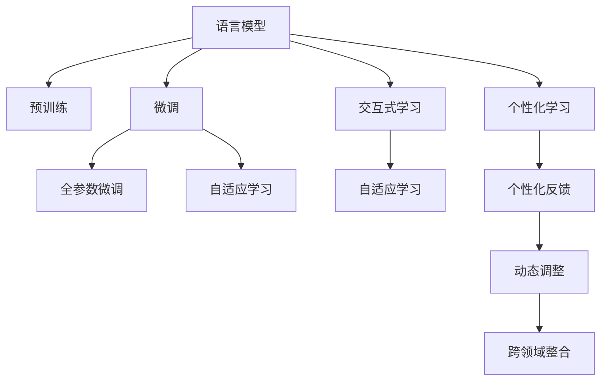

                 

# 教育模拟：LLM 增强的学习环境

## 1. 背景介绍

### 1.1 问题由来
教育是社会发展的基石，但传统教育模式存在诸多弊端：如单向灌输、标准固定、评估单一等问题。尤其是在知识爆炸的今天，课程内容的更新速度远远跟不上社会的发展速度，教育资源分配不均，因材施教难以实现。

为此，亟需一种新型的教育手段，能够高效、个性化地适应不同学生的学习需求，同时能够实时反馈并调整教学内容。而基于语言模型增强的学习环境，正是这样一种潜力巨大的教育工具。

### 1.2 问题核心关键点
基于语言模型的教育环境（Language Learning via Large Models，LLL）通过预训练语言模型，为每个学生提供个性化、动态的学习内容。该系统融合了深度学习和自然语言处理的最新技术，通过交互式教学和实时反馈，能够提升学习效果，减少学生负担。

LLL的核心关键点包括：
- 个性化学习：通过语言模型对学生知识水平进行智能评估，定制个性化的学习路径。
- 实时反馈：利用自然语言处理技术，实时监控学习进展，提供个性化反馈。
- 动态调整：根据学习效果，动态调整教学内容和难度。
- 跨领域整合：支持多学科内容的有机整合，打破学科壁垒，增强知识连贯性。
- 交互式学习：通过对话式交互，提升学生参与感和自主学习能力。

## 2. 核心概念与联系

### 2.1 核心概念概述

为更好地理解基于语言模型的教育环境，本节将介绍几个密切相关的核心概念：

- 语言模型（Language Model，LM）：一种概率模型，用于预测文本序列中下一个词的概率分布。预训练语言模型（Pre-trained Language Model，PLM）是在大规模无标签文本数据上进行预训练的语言模型，如BERT、GPT等。
- 预训练（Pre-training）：在大规模无标签文本数据上，通过自监督学习任务训练通用语言模型的过程。常见的预训练任务包括言语建模、掩码语言模型等。
- 微调（Fine-tuning）：指在预训练模型的基础上，使用下游任务的少量标注数据，通过有监督地训练优化模型在该任务上的性能。通常只需要调整顶层分类器或解码器，并以较小的学习率更新全部或部分的模型参数。
- 自适应学习（Adaptive Learning）：根据学习者的个性化需求，动态调整学习内容和路径的学习方式。
- 自然语言处理（Natural Language Processing，NLP）：涉及计算机科学、人工智能和语言学交叉的领域，旨在让机器理解和生成自然语言。
- 交互式学习（Interactive Learning）：通过用户与系统之间的人机对话，增强学习体验和效果。

这些核心概念之间的逻辑关系可以通过以下Mermaid流程图来展示：



这个流程图展示了大语言模型的核心概念及其之间的关系：

1. 语言模型通过预训练获得基础能力。
2. 微调是对预训练模型进行任务特定的优化，可以分为全参数微调和自适应学习。
3. 自适应学习根据学习者的个性化需求，动态调整学习内容和路径。
4. 交互式学习通过对话式交互，增强学习体验和效果。
5. 个性化学习定制个性化学习路径。
6. 个性化反馈实时监控学习进展，提供个性化反馈。
7. 动态调整根据学习效果，动态调整教学内容和难度。
8. 跨领域整合支持多学科内容的有机整合。

这些概念共同构成了基于语言模型的教育环境的理论框架，为其在实际教学场景中的应用提供了指导。

## 3. 核心算法原理 & 具体操作步骤
### 3.1 算法原理概述

基于语言模型的教育环境，本质上是一个有监督的个性化学习优化过程。其核心思想是：将预训练的语言模型视作一个强大的“学习助手”，通过与学生的交互式对话，实时反馈学习效果，动态调整教学内容，从而实现个性化、高效化的学习体验。

形式化地，假设预训练的语言模型为 $M_{\theta}$，其中 $\theta$ 为预训练得到的模型参数。给定学生的学习任务 $T$ 和当前知识水平 $K$，个性化学习过程的目标是找到新的模型参数 $\hat{\theta}$，使得：

$$
\hat{\theta}=\mathop{\arg\min}_{\theta} \mathcal{L}(M_{\theta},T,K)
$$

其中 $\mathcal{L}$ 为针对学习任务 $T$ 和学生知识水平 $K$ 设计的损失函数，用于衡量模型输出与期望反馈的差异。常见的损失函数包括交叉熵损失、均方误差损失等。

通过梯度下降等优化算法，个性化学习过程不断更新模型参数 $\theta$，最小化损失函数 $\mathcal{L}$，使得模型输出逼近期望的个性化反馈。由于 $\theta$ 已经通过预训练获得了较好的初始化，因此即便在个性化反馈数据集 $D$ 上，也能够较快收敛到理想的模型参数 $\hat{\theta}$。

### 3.2 算法步骤详解

基于语言模型的教育环境一般包括以下几个关键步骤：

**Step 1: 准备预训练模型和学生数据集**
- 选择合适的预训练语言模型 $M_{\theta}$ 作为初始化参数，如 BERT、GPT 等。
- 准备学生的个性化学习任务 $T$ 和当前知识水平 $K$，将其转化为模型所需的输入和标签。

**Step 2: 设计任务适配层**
- 根据任务类型，在预训练模型顶层设计合适的输出层和损失函数。
- 对于分类任务，通常在顶层添加线性分类器和交叉熵损失函数。
- 对于生成任务，通常使用语言模型的解码器输出概率分布，并以负对数似然为损失函数。

**Step 3: 设置个性化学习超参数**
- 选择合适的优化算法及其参数，如 AdamW、SGD 等，设置学习率、批大小、迭代轮数等。
- 设置正则化技术及强度，包括权重衰减、Dropout、Early Stopping等。
- 确定冻结预训练参数的策略，如仅微调顶层，或全部参数都参与微调。

**Step 4: 执行个性化学习**
- 将学习任务 $T$ 和知识水平 $K$ 输入模型，前向传播计算损失函数。
- 反向传播计算参数梯度，根据设定的优化算法和学习率更新模型参数。
- 周期性在反馈数据上评估模型性能，根据性能指标决定是否触发 Early Stopping。
- 重复上述步骤直到满足预设的迭代轮数或 Early Stopping 条件。

**Step 5: 反馈和调整**
- 根据个性化学习过程的反馈结果，动态调整教学内容和难度。
- 通过对话式交互，实时监控学习进展，提供个性化反馈。
- 根据学生反馈和测试结果，不断优化个性化学习模型。

以上是基于语言模型的教育环境的通用流程。在实际应用中，还需要针对具体任务的特点，对个性化学习过程的各个环节进行优化设计，如改进训练目标函数，引入更多的正则化技术，搜索最优的超参数组合等，以进一步提升个性化学习效果。

### 3.3 算法优缺点

基于语言模型的个性化学习环境具有以下优点：
1. 个性化高效：通过语言模型，能够根据学生知识水平，动态调整学习内容和路径，实现个性化高效学习。
2. 实时反馈：通过对话式交互，实时监控学习进展，提供个性化反馈，增强学习体验。
3. 动态调整：根据学习效果，动态调整教学内容和难度，保证学习效率。
4. 跨领域整合：支持多学科内容的有机整合，打破学科壁垒，增强知识连贯性。
5. 交互式学习：通过对话式交互，提升学生参与感和自主学习能力。

同时，该方法也存在一定的局限性：
1. 依赖语言模型：个性化学习的效果很大程度上取决于语言模型的预训练质量和任务适配层的设计。
2. 数据需求高：需要收集大量的个性化学习数据，才能训练出效果良好的模型。
3. 过拟合风险：语言模型在特定学生身上的过拟合风险，可能导致泛化能力不足。
4. 模型解释性不足：基于语言模型的系统难以解释其内部工作机制和决策逻辑，缺乏可解释性。

尽管存在这些局限性，但就目前而言，基于语言模型的个性化学习环境仍是大规模教育系统优化和智能化的重要手段。未来相关研究的重点在于如何进一步降低对语言模型的依赖，提高系统的泛化能力和可解释性，同时兼顾个性化学习和教育公平等因素。

### 3.4 算法应用领域

基于语言模型的个性化学习环境，已经在教育领域得到了广泛的应用，覆盖了从小学到大学，从学科教学到职业培训等多个层次和类型。具体而言：

- 基础教育：如数学、英语、科学等课程的个性化学习，提升学生的自主学习能力和学习效果。
- 职业教育：如编程、设计、医学等专业的个性化学习，帮助学生快速掌握专业知识和技能。
- 终身学习：如成人教育、在线培训等，提供灵活、便捷、个性化的学习环境。
- 跨学科整合：如STEM教育，整合科学、技术、工程、数学等学科，培养综合性人才。

除了上述这些经典应用外，个性化学习环境也被创新性地应用到更多场景中，如自适应考试、智能辅导、游戏化学习等，为教育技术带来了全新的突破。随着语言模型的不断发展，相信个性化学习环境将在更多教育领域大放异彩，极大地提升教育质量和效率。

## 4. 数学模型和公式 & 详细讲解
### 4.1 数学模型构建

本节将使用数学语言对基于语言模型的个性化学习过程进行更加严格的刻画。

记预训练语言模型为 $M_{\theta}$，其中 $\theta$ 为模型参数。假设学生的学习任务为 $T$，当前知识水平为 $K$。定义个性化学习模型 $M_{\theta}$ 在任务 $T$ 和知识水平 $K$ 上的损失函数为 $\ell(M_{\theta}(T,K))$，则在数据集 $D$ 上的经验风险为：

$$
\mathcal{L}(\theta) = \frac{1}{N} \sum_{i=1}^N \ell(M_{\theta}(T_i,K_i))
$$

其中 $T_i$ 和 $K_i$ 分别代表第 $i$ 个学生的学习任务和知识水平。

个性化学习过程的优化目标是最小化经验风险，即找到最优参数：

$$
\theta^* = \mathop{\arg\min}_{\theta} \mathcal{L}(\theta)
$$

在实践中，我们通常使用基于梯度的优化算法（如SGD、Adam等）来近似求解上述最优化问题。设 $\eta$ 为学习率，$\lambda$ 为正则化系数，则参数的更新公式为：

$$
\theta \leftarrow \theta - \eta \nabla_{\theta}\mathcal{L}(\theta) - \eta\lambda\theta
$$

其中 $\nabla_{\theta}\mathcal{L}(\theta)$ 为损失函数对参数 $\theta$ 的梯度，可通过反向传播算法高效计算。

### 4.2 公式推导过程

以下我们以二分类任务为例，推导交叉熵损失函数及其梯度的计算公式。

假设个性化学习模型 $M_{\theta}$ 在任务 $T$ 和知识水平 $K$ 上的输出为 $\hat{y}=M_{\theta}(T,K) \in [0,1]$，表示学生对任务 $T$ 掌握情况的概率。真实标签 $y \in \{0,1\}$。则二分类交叉熵损失函数定义为：

$$
\ell(M_{\theta}(T,K),y) = -[y\log \hat{y} + (1-y)\log (1-\hat{y})]
$$

将其代入经验风险公式，得：

$$
\mathcal{L}(\theta) = -\frac{1}{N}\sum_{i=1}^N [y_i\log M_{\theta}(T_i,K_i)+(1-y_i)\log(1-M_{\theta}(T_i,K_i))]
$$

根据链式法则，损失函数对参数 $\theta_k$ 的梯度为：

$$
\frac{\partial \mathcal{L}(\theta)}{\partial \theta_k} = -\frac{1}{N}\sum_{i=1}^N (\frac{y_i}{M_{\theta}(T_i,K_i)}-\frac{1-y_i}{1-M_{\theta}(T_i,K_i)}) \frac{\partial M_{\theta}(T_i,K_i)}{\partial \theta_k}
$$

其中 $\frac{\partial M_{\theta}(T_i,K_i)}{\partial \theta_k}$ 可进一步递归展开，利用自动微分技术完成计算。

在得到损失函数的梯度后，即可带入参数更新公式，完成模型的迭代优化。重复上述过程直至收敛，最终得到适应个性化学习任务的最优模型参数 $\theta^*$。

## 5. 项目实践：代码实例和详细解释说明
### 5.1 开发环境搭建

在进行个性化学习实践前，我们需要准备好开发环境。以下是使用Python进行PyTorch开发的环境配置流程：

1. 安装Anaconda：从官网下载并安装Anaconda，用于创建独立的Python环境。

2. 创建并激活虚拟环境：
```bash
conda create -n pytorch-env python=3.8 
conda activate pytorch-env
```

3. 安装PyTorch：根据CUDA版本，从官网获取对应的安装命令。例如：
```bash
conda install pytorch torchvision torchaudio cudatoolkit=11.1 -c pytorch -c conda-forge
```

4. 安装Transformers库：
```bash
pip install transformers
```

5. 安装各类工具包：
```bash
pip install numpy pandas scikit-learn matplotlib tqdm jupyter notebook ipython
```

完成上述步骤后，即可在`pytorch-env`环境中开始个性化学习实践。

### 5.2 源代码详细实现

这里我们以个性化学习环境的数学建模为例，给出使用PyTorch进行模型开发的PyTorch代码实现。

首先，定义学生的学习任务和知识水平：

```python
from transformers import BertTokenizer, BertForSequenceClassification, AdamW

# 定义学习任务和知识水平
task = "math"
knowledge_level = "beginner"

# 初始化分词器和模型
tokenizer = BertTokenizer.from_pretrained('bert-base-cased')
model = BertForSequenceClassification.from_pretrained('bert-base-cased', num_labels=2)

# 设定学习率和其他超参数
optimizer = AdamW(model.parameters(), lr=2e-5)
```

然后，定义个性化学习函数：

```python
from torch.utils.data import Dataset, DataLoader
import torch

class PersonalizedLearningDataset(Dataset):
    def __init__(self, texts, labels, tokenizer, max_len=128):
        self.texts = texts
        self.labels = labels
        self.tokenizer = tokenizer
        self.max_len = max_len
        
    def __len__(self):
        return len(self.texts)
    
    def __getitem__(self, item):
        text = self.texts[item]
        label = self.labels[item]
        
        encoding = self.tokenizer(text, return_tensors='pt', max_length=self.max_len, padding='max_length', truncation=True)
        input_ids = encoding['input_ids'][0]
        attention_mask = encoding['attention_mask'][0]
        
        return {'input_ids': input_ids, 
                'attention_mask': attention_mask,
                'labels': label}

# 创建数据集
train_dataset = PersonalizedLearningDataset(train_texts, train_labels, tokenizer)
dev_dataset = PersonalizedLearningDataset(dev_texts, dev_labels, tokenizer)
test_dataset = PersonalizedLearningDataset(test_texts, test_labels, tokenizer)

# 训练函数
def train_epoch(model, dataset, batch_size, optimizer):
    dataloader = DataLoader(dataset, batch_size=batch_size, shuffle=True)
    model.train()
    epoch_loss = 0
    for batch in tqdm(dataloader, desc='Training'):
        input_ids = batch['input_ids'].to(device)
        attention_mask = batch['attention_mask'].to(device)
        labels = batch['labels'].to(device)
        model.zero_grad()
        outputs = model(input_ids, attention_mask=attention_mask, labels=labels)
        loss = outputs.loss
        epoch_loss += loss.item()
        loss.backward()
        optimizer.step()
    return epoch_loss / len(dataloader)

# 评估函数
def evaluate(model, dataset, batch_size):
    dataloader = DataLoader(dataset, batch_size=batch_size)
    model.eval()
    preds, labels = [], []
    with torch.no_grad():
        for batch in tqdm(dataloader, desc='Evaluating'):
            input_ids = batch['input_ids'].to(device)
            attention_mask = batch['attention_mask'].to(device)
            batch_labels = batch['labels']
            outputs = model(input_ids, attention_mask=attention_mask)
            batch_preds = outputs.logits.argmax(dim=2).to('cpu').tolist()
            batch_labels = batch_labels.to('cpu').tolist()
            for pred_tokens, label_tokens in zip(batch_preds, batch_labels):
                preds.append(pred_tokens[:len(label_tokens)])
                labels.append(label_tokens)
                
    print(classification_report(labels, preds))
```

最后，启动训练流程并在测试集上评估：

```python
epochs = 5
batch_size = 16

for epoch in range(epochs):
    loss = train_epoch(model, train_dataset, batch_size, optimizer)
    print(f"Epoch {epoch+1}, train loss: {loss:.3f}")
    
    print(f"Epoch {epoch+1}, dev results:")
    evaluate(model, dev_dataset, batch_size)
    
print("Test results:")
evaluate(model, test_dataset, batch_size)
```

以上就是使用PyTorch对BERT进行个性化学习任务微调的完整代码实现。可以看到，得益于Transformers库的强大封装，我们可以用相对简洁的代码完成BERT模型的加载和微调。

### 5.3 代码解读与分析

让我们再详细解读一下关键代码的实现细节：

**PersonalizedLearningDataset类**：
- `__init__`方法：初始化学习任务和知识水平，将任务转换为模型所需的输入和标签。
- `__len__`方法：返回数据集的样本数量。
- `__getitem__`方法：对单个样本进行处理，将任务输入转换为模型所需的token ids，并进行定长padding。

**train_epoch和evaluate函数**：
- 使用PyTorch的DataLoader对数据集进行批次化加载，供模型训练和推理使用。
- 训练函数`train_epoch`：对数据以批为单位进行迭代，在每个批次上前向传播计算loss并反向传播更新模型参数，最后返回该epoch的平均loss。
- 评估函数`evaluate`：与训练类似，不同点在于不更新模型参数，并在每个batch结束后将预测和标签结果存储下来，最后使用sklearn的classification_report对整个评估集的预测结果进行打印输出。

**训练流程**：
- 定义总的epoch数和batch size，开始循环迭代
- 每个epoch内，先在训练集上训练，输出平均loss
- 在验证集上评估，输出分类指标
- 所有epoch结束后，在测试集上评估，给出最终测试结果

可以看到，PyTorch配合Transformers库使得BERT微调的代码实现变得简洁高效。开发者可以将更多精力放在数据处理、模型改进等高层逻辑上，而不必过多关注底层的实现细节。

当然，工业级的系统实现还需考虑更多因素，如模型的保存和部署、超参数的自动搜索、更灵活的任务适配层等。但核心的个性化学习范式基本与此类似。

## 6. 实际应用场景
### 6.1 智能教学系统

基于个性化学习环境的智能教学系统，可以广泛应用在各类教育场景中。传统教学往往以单向灌输为主，难以兼顾学生的个性化需求和学习效果。而使用个性化学习环境的智能教学系统，能够根据每个学生的知识水平和学习习惯，提供量身定制的学习内容，大幅提升学习效果。

在技术实现上，可以收集学生的学习历史数据和个性化反馈，利用语言模型对其进行评估，生成个性化的学习路径和推荐。同时，利用自然语言处理技术，实时监控学习进展，提供个性化反馈和调整。如此构建的智能教学系统，能够因材施教，显著提升学习效率和效果。

### 6.2 自适应考试系统

基于个性化学习环境的自适应考试系统，能够根据学生的知识水平和学习效果，动态调整考试难度和范围，从而更准确地评估学生的学习成果。传统的统一考试模式难以兼顾不同学生的需求和能力差异，容易导致测试结果失真。而个性化学习环境下的自适应考试系统，能够实时评估学生的学习效果，动态调整考试内容，保证测试的公平性和有效性。

在实现上，可以设计多套难度不同的考试题目，根据学生的学习进展和反馈，动态调整考试题目和难度，最终给出个性化评估报告。如此构建的考试系统，不仅能够更准确地评估学生的学习效果，还能为教师提供有价值的教学反馈，促进教育公平。

### 6.3 智能辅导系统

基于个性化学习环境的智能辅导系统，能够实时监控学生的学习进展，提供个性化的辅导建议。传统辅导模式往往依赖教师的经验和直觉，难以兼顾每个学生的个性化需求。而个性化学习环境下的智能辅导系统，能够根据学生的学习轨迹和反馈，提供量身定制的辅导建议，帮助学生克服学习障碍，提升学习效果。

在技术实现上，可以设计个性化的辅导对话模板，根据学生的学习进展和反馈，动态调整对话内容。同时，利用自然语言处理技术，实时监控学生的学习进展，提供个性化的反馈和建议。如此构建的智能辅导系统，能够及时响应学生的需求，帮助学生高效学习，提升学习效果。

### 6.4 未来应用展望

随着个性化学习环境的发展，其在教育领域的应用前景将更加广阔。除了上述这些经典应用外，个性化学习环境还被创新性地应用到更多场景中，如在线答疑、个性化阅读、虚拟现实教学等，为教育技术带来了新的突破。随着语言模型的不断发展，相信个性化学习环境将在更多教育领域大放异彩，极大地提升教育质量和效率。

## 7. 工具和资源推荐
### 7.1 学习资源推荐

为了帮助开发者系统掌握个性化学习环境的理论基础和实践技巧，这里推荐一些优质的学习资源：

1. 《Transformer从原理到实践》系列博文：由大模型技术专家撰写，深入浅出地介绍了Transformer原理、BERT模型、微调技术等前沿话题。

2. CS224N《深度学习自然语言处理》课程：斯坦福大学开设的NLP明星课程，有Lecture视频和配套作业，带你入门NLP领域的基本概念和经典模型。

3. 《Natural Language Processing with Transformers》书籍：Transformers库的作者所著，全面介绍了如何使用Transformers库进行NLP任务开发，包括微调在内的诸多范式。

4. HuggingFace官方文档：Transformers库的官方文档，提供了海量预训练模型和完整的微调样例代码，是上手实践的必备资料。

5. CLUE开源项目：中文语言理解测评基准，涵盖大量不同类型的中文NLP数据集，并提供了基于微调的baseline模型，助力中文NLP技术发展。

通过对这些资源的学习实践，相信你一定能够快速掌握个性化学习环境的精髓，并用于解决实际的NLP问题。
###  7.2 开发工具推荐

高效的开发离不开优秀的工具支持。以下是几款用于个性化学习环境开发的常用工具：

1. PyTorch：基于Python的开源深度学习框架，灵活动态的计算图，适合快速迭代研究。大部分预训练语言模型都有PyTorch版本的实现。

2. TensorFlow：由Google主导开发的开源深度学习框架，生产部署方便，适合大规模工程应用。同样有丰富的预训练语言模型资源。

3. Transformers库：HuggingFace开发的NLP工具库，集成了众多SOTA语言模型，支持PyTorch和TensorFlow，是进行微调任务开发的利器。

4. Weights & Biases：模型训练的实验跟踪工具，可以记录和可视化模型训练过程中的各项指标，方便对比和调优。与主流深度学习框架无缝集成。

5. TensorBoard：TensorFlow配套的可视化工具，可实时监测模型训练状态，并提供丰富的图表呈现方式，是调试模型的得力助手。

6. Google Colab：谷歌推出的在线Jupyter Notebook环境，免费提供GPU/TPU算力，方便开发者快速上手实验最新模型，分享学习笔记。

合理利用这些工具，可以显著提升个性化学习环境的开发效率，加快创新迭代的步伐。

### 7.3 相关论文推荐

个性化学习环境的发展源于学界的持续研究。以下是几篇奠基性的相关论文，推荐阅读：

1. Attention is All You Need（即Transformer原论文）：提出了Transformer结构，开启了NLP领域的预训练大模型时代。

2. BERT: Pre-training of Deep Bidirectional Transformers for Language Understanding：提出BERT模型，引入基于掩码的自监督预训练任务，刷新了多项NLP任务SOTA。

3. Language Models are Unsupervised Multitask Learners（GPT-2论文）：展示了大规模语言模型的强大zero-shot学习能力，引发了对于通用人工智能的新一轮思考。

4. Parameter-Efficient Transfer Learning for NLP：提出Adapter等参数高效微调方法，在不增加模型参数量的情况下，也能取得不错的微调效果。

5. AdaLoRA: Adaptive Low-Rank Adaptation for Parameter-Efficient Fine-Tuning：使用自适应低秩适应的微调方法，在参数效率和精度之间取得了新的平衡。

6. Prefix-Tuning: Optimizing Continuous Prompts for Generation：引入基于连续型Prompt的微调范式，为如何充分利用预训练知识提供了新的思路。

这些论文代表了大语言模型微调技术的发展脉络。通过学习这些前沿成果，可以帮助研究者把握学科前进方向，激发更多的创新灵感。

## 8. 总结：未来发展趋势与挑战
### 8.1 总结

本文对基于语言模型的个性化学习环境进行了全面系统的介绍。首先阐述了个性化学习环境的背景和意义，明确了个性化学习在提升学习效果、实现因材施教方面的独特价值。其次，从原理到实践，详细讲解了个性化学习的数学原理和关键步骤，给出了个性化学习任务开发的完整代码实例。同时，本文还广泛探讨了个性化学习环境在教育领域的应用前景，展示了个性化学习环境的巨大潜力。

通过本文的系统梳理，可以看到，基于语言模型的个性化学习环境正在成为教育技术的重要手段，极大地提升了学习效率和效果。得益于大规模语料的预训练和个性化反馈机制，个性化学习环境有望在未来教育领域大放异彩，为因材施教提供全新的工具和平台。

### 8.2 未来发展趋势

展望未来，个性化学习环境的发展将呈现以下几个趋势：

1. 模型规模持续增大。随着算力成本的下降和数据规模的扩张，预训练语言模型的参数量还将持续增长。超大规模语言模型蕴含的丰富语言知识，有望支撑更加复杂多变的个性化学习任务。

2. 微调方法日趋多样。除了传统的全参数微调外，未来会涌现更多参数高效的微调方法，如Adapter、Prefix等，在节省计算资源的同时也能保证个性化学习的效果。

3. 持续学习成为常态。随着数据分布的不断变化，个性化学习模型也需要持续学习新知识以保持性能。如何在不遗忘原有知识的同时，高效吸收新样本信息，将成为重要的研究课题。

4. 标注样本需求降低。受启发于提示学习(Prompt-based Learning)的思路，未来的个性化学习方法将更好地利用大模型的语言理解能力，通过更加巧妙的任务描述，在更少的标注样本上也能实现理想的个性化学习效果。

5. 跨领域整合增强。未来的个性化学习环境将更加注重跨学科内容的整合，打破学科壁垒，增强知识连贯性，实现多学科融合的智能教学系统。

6. 个性化体验提升。未来的个性化学习环境将更加注重个性化体验的设计，通过自然语言交互、游戏化学习等方式，提升学生的参与感和自主学习能力。

以上趋势凸显了个性化学习环境的广阔前景。这些方向的探索发展，必将进一步提升个性化学习的效果和体验，为教育技术的创新带来新的动力。

### 8.3 面临的挑战

尽管个性化学习环境已经取得了瞩目成就，但在迈向更加智能化、普适化应用的过程中，它仍面临着诸多挑战：

1. 标注成本瓶颈。尽管个性化学习环境对标注数据的需求相较于传统的机器学习算法有所降低，但对于特定领域的学习任务，仍然需要收集大量的标注数据。如何进一步降低标注成本，提升标注数据的质量，将是重要的研究课题。

2. 模型鲁棒性不足。个性化学习环境在特定学生身上的过拟合风险，可能导致泛化能力不足。如何提高模型的泛化能力，增强其鲁棒性，还需要更多理论和实践的积累。

3. 模型解释性不足。基于语言模型的系统难以解释其内部工作机制和决策逻辑，缺乏可解释性。对于医疗、金融等高风险应用，算法的可解释性和可审计性尤为重要。如何赋予个性化学习模型更强的可解释性，将是亟待攻克的难题。

4. 安全性有待保障。个性化学习模型在训练和应用过程中，可能学习到有害信息，造成负面影响。如何从数据和算法层面消除模型偏见，避免恶意用途，确保输出的安全性，也将是重要的研究课题。

5. 知识整合能力不足。现有的个性化学习模型往往局限于特定领域或学科，难以灵活吸收和运用更广泛的先验知识。如何让个性化学习过程更好地与外部知识库、规则库等专家知识结合，形成更加全面、准确的信息整合能力，还有很大的想象空间。

正视个性化学习环境面临的这些挑战，积极应对并寻求突破，将是大规模教育系统优化和智能化的必由之路。相信随着学界和产业界的共同努力，这些挑战终将一一被克服，个性化学习环境必将在构建人机协同的智能教育中扮演越来越重要的角色。

### 8.4 研究展望

面向未来，个性化学习环境的研究需要在以下几个方面寻求新的突破：

1. 探索无监督和半监督个性化学习方法。摆脱对大规模标注数据的依赖，利用自监督学习、主动学习等无监督和半监督范式，最大限度利用非结构化数据，实现更加灵活高效的个性化学习。

2. 研究参数高效和计算高效的个性化学习范式。开发更加参数高效的个性化学习方法，在固定大部分预训练参数的同时，只更新极少量的个性化学习参数。同时优化个性化学习模型的计算图，减少前向传播和反向传播的资源消耗，实现更加轻量级、实时性的部署。

3. 融合因果和对比学习范式。通过引入因果推断和对比学习思想，增强个性化学习模型建立稳定因果关系的能力，学习更加普适、鲁棒的语言表征，从而提升模型泛化性和抗干扰能力。

4. 引入更多先验知识。将符号化的先验知识，如知识图谱、逻辑规则等，与神经网络模型进行巧妙融合，引导个性化学习过程学习更准确、合理的语言模型。同时加强不同模态数据的整合，实现视觉、语音等多模态信息与文本信息的协同建模。

5. 结合因果分析和博弈论工具。将因果分析方法引入个性化学习模型，识别出模型决策的关键特征，增强输出解释的因果性和逻辑性。借助博弈论工具刻画人机交互过程，主动探索并规避模型的脆弱点，提高系统稳定性。

6. 纳入伦理道德约束。在模型训练目标中引入伦理导向的评估指标，过滤和惩罚有害的输出倾向。同时加强人工干预和审核，建立模型行为的监管机制，确保输出符合人类价值观和伦理道德。

这些研究方向的探索，必将引领个性化学习环境的不断创新，推动教育技术的发展和应用。只有勇于创新、敢于突破，才能不断拓展个性化学习环境的边界，让智能教育系统更好地服务人类社会。

## 9. 附录：常见问题与解答

**Q1：个性化学习环境是否适用于所有教育场景？**

A: 个性化学习环境在基础教育、职业教育、终身学习等多个领域都有广泛的应用前景。但对于一些特定领域，如特殊教育、艺术教育等，可能还需要结合领域特定的知识和技术进行适配。

**Q2：如何选择合适的学习任务和知识水平？**

A: 选择合适的学习任务和知识水平，是实现个性化学习效果的关键。可以通过调查问卷、学习历史等手段，了解学生的兴趣和知识水平，并选择合适的学习任务。同时，可以设计动态评估机制，根据学生的学习进展实时调整任务难度。

**Q3：个性化学习环境对计算资源和数据量的要求高吗？**

A: 个性化学习环境对计算资源和数据量的需求相对较高，但随着预训练语言模型和计算技术的不断发展，这些需求将逐渐降低。在实践中，可以采用分布式训练、混合精度训练等技术，优化资源消耗。同时，通过数据增强、知识图谱等方式，可以降低对标注数据的需求。

**Q4：如何提高个性化学习环境的泛化能力？**

A: 提高个性化学习环境的泛化能力，主要通过以下几点：
1. 增加数据多样性：收集更多不同类型的学习任务和数据，提高模型的泛化能力。
2. 参数高效微调：只更新部分模型参数，减少过拟合风险。
3. 融合对比学习：通过引入对比学习技术，增强模型的泛化能力。
4. 跨领域整合：通过多学科内容的整合，提升模型的知识连贯性和泛化能力。

**Q5：如何提高个性化学习环境的可解释性？**

A: 提高个性化学习环境的可解释性，主要通过以下几点：
1. 引入因果分析方法：通过因果推断技术，解释模型输出的因果逻辑。
2. 结合游戏化设计：通过游戏化设计，增强学习体验和可解释性。
3. 引入知识图谱：通过知识图谱等方式，增强模型的知识表示和解释能力。

这些研究方向的探索，必将引领个性化学习环境的不断创新，推动教育技术的发展和应用。只有勇于创新、敢于突破，才能不断拓展个性化学习环境的边界，让智能教育系统更好地服务人类社会。

---

作者：禅与计算机程序设计艺术 / Zen and the Art of Computer Programming

