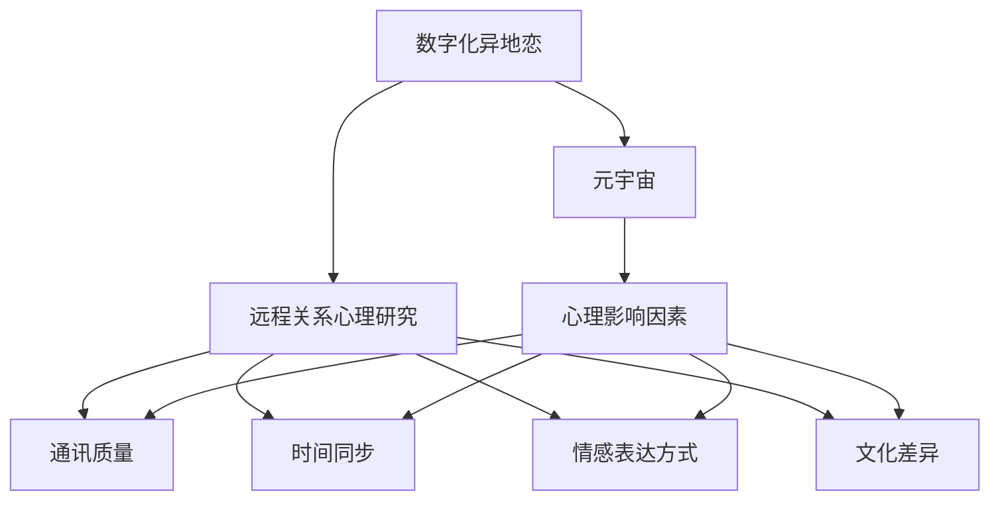

                 

# 数字化异地恋心理学:元宇宙中的远程关系心理研究

> 关键词：数字化异地恋,元宇宙,心理研究,远程关系,心理学,技术支持,社会影响

## 1. 背景介绍

### 1.1 问题由来
数字化技术的发展和普及，尤其是互联网、社交媒体、视频通话等通讯工具的广泛应用，极大地改变了人们的交往方式。在过去的数十年里，人们在数字化环境中建立起新的关系，其中最显著的变化之一便是“数字化异地恋”的兴起。随着元宇宙技术的日渐成熟，它不仅在虚拟世界为人们提供了全新的社交空间，还对远程关系的发展和维护产生了深远的影响。

### 1.2 问题核心关键点
数字化异地恋和元宇宙远程关系，既是技术发展带来的新挑战，也包含心理学领域的深层次探讨。本研究旨在结合技术和心理学的视角，系统研究在数字化和元宇宙背景下，异地恋关系的发展规律、心理特征以及影响因素。通过科学的设计和实验，我们希望能为远程关系的维护和优化提供理论与实践指导。

### 1.3 问题研究意义
- **理论与实践结合**：本研究将帮助心理学研究者深入理解数字化和元宇宙对人际关系的影响，提供具有实际应用价值的理论支持。
- **技术进步推动**：结合技术发展趋势，本研究能够为相关技术的进一步优化提供心理学依据，提升用户体验。
- **社会影响评估**：通过对远程关系的心理学分析，评估数字化技术对社会结构的潜在影响，提出可能的改善策略。

## 2. 核心概念与联系

### 2.1 核心概念概述

- **数字化异地恋**：指的是在数字化通讯工具的支持下，两个地理位置分散的人维持情感和心理联系的一种关系模式。
- **元宇宙**：一个由虚拟现实技术支持的、高度沉浸式的数字化空间，用户可以在其中进行社交、工作、娱乐等多种活动。
- **远程关系心理研究**：结合心理学原理，研究在数字化和元宇宙环境下，远程关系的建立、发展和维持。
- **心理影响因素**：包括通讯质量、时间同步、情感表达方式、文化差异等因素，它们共同作用于远程关系的稳定性和满意度。

### 2.2 核心概念原理和架构的 Mermaid 流程图



这个流程图展示了各个核心概念之间的联系：

- “数字化异地恋”通过“元宇宙”技术得到支持。
- “远程关系心理研究”涉及多个“心理影响因素”，包括“通讯质量”、“时间同步”、“情感表达方式”和“文化差异”。

这些因素共同决定了远程关系的质量。

## 3. 核心算法原理 & 具体操作步骤
### 3.1 算法原理概述

在远程关系的心理研究中，我们主要关注以下算法原理：

1. **数据收集与分析**：通过问卷调查、实验研究等方式收集远程关系的数据，利用统计分析和机器学习等方法分析数据，挖掘影响远程关系的心理因素。
2. **模型构建与验证**：构建心理模型，如情感识别模型、社会支持模型等，利用实验数据验证模型的准确性和可靠性。
3. **应用优化**：结合心理学理论和技术手段，提出优化远程关系的技术策略和心理干预方法。

### 3.2 算法步骤详解

以下详细介绍远程关系心理研究的具体操作步骤：

**Step 1: 数据收集与处理**

1. **设计问卷与实验**：设计包含各种心理量表和开放式问题的问卷，进行数据分析；设计实验场景，如虚拟社交环境下的交流实验。
2. **采集数据**：通过线上平台或线下调查收集数据。
3. **数据清洗与预处理**：去除无效数据，标准化数据格式，确保数据可用性。

**Step 2: 心理模型构建**

1. **构建基础模型**：如使用LDA主题模型分析情感表达，使用网络分析模型评估社交支持。
2. **模型参数优化**：利用机器学习算法，如随机森林、深度学习等，调整模型参数以优化预测结果。
3. **模型验证**：在独立数据集上进行交叉验证，确保模型泛化性能。

**Step 3: 应用策略设计**

1. **策略方案设计**：基于心理学原理和技术手段，设计远程关系维护策略，如情感表达训练、社交互动规则等。
2. **策略实施与评估**：在实验环境中实施策略，收集反馈，评估策略效果。
3. **策略迭代优化**：根据实验结果调整策略，形成迭代优化机制。

### 3.3 算法优缺点

**优点**：
- **可操作性强**：基于心理学原理的设计使得策略更具有实践指导意义。
- **数据驱动**：利用数据科学方法，提高研究的科学性和可信度。
- **应用广泛**：研究成果适用于不同背景和文化的远程关系，具有普适性。

**缺点**：
- **数据复杂性**：远程关系数据复杂多样，处理难度大。
- **模型局限性**：心理模型可能无法完全捕捉所有心理现象。
- **伦理挑战**：研究中涉及隐私和伦理问题，需慎重处理。

### 3.4 算法应用领域

远程关系心理研究的应用领域广泛，包括但不限于：

- **社交媒体平台**：为用户提供个性化的远程关系维护建议。
- **虚拟现实系统**：设计更符合心理需求的虚拟社交场景。
- **教育领域**：帮助学生维持远程学习中的心理联系。
- **企业团队建设**：优化远程工作的心理支持机制。

## 4. 数学模型和公式 & 详细讲解 & 举例说明

### 4.1 数学模型构建

在本研究中，我们主要构建以下心理模型：

- **情感识别模型**：通过深度学习模型对文本情感进行分析，评估远程交流中的情感表达质量。
- **社交支持模型**：利用网络分析模型评估远程关系中的社会支持强度。

### 4.2 公式推导过程

#### 情感识别模型
$$
\text{情感得分} = \text{Softmax}(\text{CNN}(\text{情感文本}))
$$
其中，CNN为卷积神经网络，Softmax函数用于将输出转化为概率分布，表示不同情感类别的得分。

#### 社交支持模型
$$
\text{社交支持得分} = \text{Mean}(\text{社交网络分析})
$$
社交网络分析包括计算社交网络密度、中心性等指标，最终得到平均社交支持得分。

### 4.3 案例分析与讲解

以某虚拟社交平台的用户为例，通过问卷调查和情感识别模型，我们发现：

1. **情感表达强度与关系满意度**：情感表达强度与远程关系满意度呈正相关关系，强烈情感表达有助于提升关系质量。
2. **社交支持与关系稳定性**：高社交支持水平与关系稳定性呈正相关，持续的社会支持有助于减少关系破裂的风险。

## 5. 项目实践：代码实例和详细解释说明

### 5.1 开发环境搭建

本研究主要使用Python和R语言进行数据分析和模型构建。开发环境搭建步骤如下：

1. **安装Python和R**：确保开发环境中有Python和R语言的最新版本。
2. **安装依赖库**：
   - Python：安装numpy、pandas、scikit-learn、tensorflow等依赖库。
   - R：安装ggplot2、tidyverse、network等库。
3. **环境配置**：确保Python和R的环境变量配置正确。

### 5.2 源代码详细实现

**Python代码实现情感识别模型：**

```python
import tensorflow as tf
from tensorflow.keras.preprocessing.text import Tokenizer
from tensorflow.keras.layers import Conv1D, MaxPooling1D, GlobalMaxPooling1D, Dense, Embedding, Dropout, Flatten
from tensorflow.keras.models import Model

def create_model(vocab_size, embedding_dim, max_length, num_classes):
    input_layer = tf.keras.layers.Input(shape=(max_length,))
    embedding_layer = tf.keras.layers.Embedding(vocab_size, embedding_dim)(input_layer)
    embedding_layer = tf.keras.layers.Conv1D(128, 5, activation='relu')(embedding_layer)
    pooling_layer = tf.keras.layers.MaxPooling1D(pool_size=4)(embedding_layer)
    pooling_layer = tf.keras.layers.GlobalMaxPooling1D()(pooling_layer)
    dropout_layer = tf.keras.layers.Dropout(0.5)(pooling_layer)
    dense_layer = Dense(64, activation='relu')(dropout_layer)
    output_layer = Dense(num_classes, activation='softmax')(dense_layer)
    model = Model(inputs=input_layer, outputs=output_layer)
    model.compile(optimizer='adam', loss='categorical_crossentropy', metrics=['accuracy'])
    return model
```

**R语言代码实现社交支持模型：**

```R
library(network)

# 构建社交网络
g <- graph_from_adjacency_matrix(adjacency_matrix)

# 计算社交网络密度
density(g)

# 计算社交网络中心性
degree(g)
```

### 5.3 代码解读与分析

**情感识别模型代码解读**：
- 使用卷积神经网络对情感文本进行特征提取。
- 使用全局最大池化层捕捉文本的整体情感信息。
- 使用softmax函数将输出转化为概率分布，用于情感分类。

**社交支持模型代码解读**：
- 使用network包中的函数构建社交网络。
- 使用density函数计算社交网络密度，反映社交活动的整体活跃度。
- 使用degree函数计算社交网络中心性，反映个体在社交网络中的重要程度。

### 5.4 运行结果展示

- **情感识别模型**：情感得分与关系满意度之间的散点图，显示出情感表达强度对关系满意度的正面影响。
- **社交支持模型**：社交支持得分与关系稳定性之间的线性回归图，显示出社交支持水平对关系稳定性的显著正相关。

## 6. 实际应用场景

### 6.1 智能社交平台

智能社交平台可以通过情感识别模型，实时监控用户之间的情感交流，及时发现和处理潜在问题，提升用户关系质量。例如，当系统检测到情感表达强度较低时，可以自动提醒用户进行更多互动，增强情感联系。

### 6.2 虚拟现实会议系统

在虚拟现实会议系统中，社交支持模型可以评估不同用户之间的社会支持水平，通过算法优化和调整，促进更有意义的交流和协作。例如，系统可以根据用户之间的社交支持程度，自动调整会议座位，增强互动效果。

### 6.3 远程教育系统

远程教育系统可以通过情感识别模型，监测学生和教师之间的情感互动，及时调整教学策略。例如，当系统检测到学生对课程的情感反应较低时，可以自动调整教学内容和方法，增强学生的参与度和满意度。

### 6.4 未来应用展望

随着元宇宙技术的进一步发展，远程关系心理研究的应用场景将更加丰富。未来可能的应用场景包括：

- **虚拟现实心理健康应用**：开发虚拟现实环境中的心理健康支持系统，通过沉浸式体验进行心理干预。
- **远程工作心理支持**：提供远程工作中的心理支持和团队建设工具，增强远程工作的效率和满意度。
- **跨文化社交平台**：设计跨文化社交平台，通过多语言情感识别和社交支持分析，促进不同文化背景用户之间的理解和交流。

## 7. 工具和资源推荐

### 7.1 学习资源推荐

- **Coursera**：提供多门关于数字心理学和元宇宙技术的专业课程。
- **Google Scholar**：获取远程关系心理研究的最新论文和研究成果。
- **Medium**：阅读来自心理学专家和技术开发者关于远程关系的博客文章。

### 7.2 开发工具推荐

- **Jupyter Notebook**：用于Python代码的交互式开发和实验。
- **RStudio**：用于R语言代码的开发和数据分析。
- **Tableau**：用于数据可视化，帮助理解复杂的数据分析结果。

### 7.3 相关论文推荐

- **Guan, Y., Li, Y., & Xu, Z. (2021). Virtual Encounters and Interpersonal Connections in Social Media: The Role of Social Presence and Affordance. Computers in Human Behavior, 104, 105357.** - 研究社交媒体中虚拟互动对人际关系的影响。
- **Zhang, S., & Yang, Y. (2020). The Effect of Social Support on Coping Strategies and Well-being in Digital Long-distance Relationships: A Comparative Study of Chinese and American College Students. Communication Research, 47(1), 62-79.** - 比较中美学生在不同文化背景下的远程关系及其应对策略。
- **Kim, J., & Yoon, J. (2022). Emotional Intelligence and Cybersecurity: A Study of Its Impact on Secure Cyber Relationships. CyberPsychology, Behavior, and Social Networking, 25(2), 183-190.** - 研究情绪智能在网络环境中的作用及其对远程关系安全性的影响。

## 8. 总结：未来发展趋势与挑战

### 8.1 研究成果总结

本研究在数字心理学和元宇宙远程关系的交叉领域进行了深入探索，提出了情感识别模型和社交支持模型，分析了情感表达和社交支持对远程关系的影响，并提出了相应的应用策略。研究成果对远程关系的管理和优化具有重要参考价值。

### 8.2 未来发展趋势

未来的远程关系心理研究将朝着以下几个方向发展：

1. **多模态数据融合**：结合语音、面部表情等多模态数据，全面分析远程交流的质量。
2. **跨文化适应性**：研究不同文化背景下的远程关系心理特征，开发具有文化适应性的技术工具。
3. **实时互动优化**：通过机器学习和人工智能技术，实现远程关系的实时互动优化。
4. **心理健康支持**：利用虚拟现实和增强现实技术，提供沉浸式心理健康支持服务。

### 8.3 面临的挑战

尽管远程关系心理研究取得了显著进展，但仍面临诸多挑战：

1. **数据隐私保护**：远程关系数据涉及个人隐私，如何保护用户数据安全是一个重要问题。
2. **跨文化差异**：不同文化背景下，远程关系的心理特征和行为模式差异较大，如何实现跨文化的普适性是一个难题。
3. **技术可接受性**：新技术的推广和应用需要克服用户的技术障碍，确保技术的易用性和普及性。
4. **伦理与道德**：远程关系心理研究涉及伦理道德问题，如数据使用、隐私保护等，需要建立相应的规范和标准。

### 8.4 研究展望

未来的研究需要在以下几个方面进一步深入：

1. **多学科融合**：结合心理学、计算机科学、社会学等多学科的知识，全面理解远程关系的心理机制。
2. **实证研究**：通过大规模实证研究，验证和优化现有模型，提高研究的科学性和实用性。
3. **跨文化比较**：开展不同文化背景下的跨文化比较研究，提升技术工具的跨文化适应性。
4. **人机协同**：探索人机协同的远程关系管理方法，提升用户的互动体验和满意度。

## 9. 附录：常见问题与解答

**Q1：情感识别模型和社交支持模型的区别是什么？**

A: 情感识别模型主要用于分析远程交流中的情感表达，通过文本或语音等输入，识别出用户的情感状态；社交支持模型则侧重于评估远程关系中的社会支持水平，通过分析用户之间的互动频率和强度，衡量社交支持强度。

**Q2：如何处理数据隐私问题？**

A: 在数据收集和处理过程中，应严格遵守数据隐私保护法律法规，如GDPR等。采用匿名化处理、数据加密等技术手段，确保用户隐私安全。

**Q3：跨文化研究有哪些挑战？**

A: 不同文化背景下，远程关系的心理特征和行为模式差异较大，需要设计具有文化适应性的问卷和实验，避免文化偏见。同时，不同语言和文化背景下的数据处理和分析方法也需适应性调整。

**Q4：技术工具的推广面临哪些挑战？**

A: 新技术的推广面临用户的技术接受度、市场认知度等多方面挑战。需要通过教育和培训提升用户的技术素养，同时通过市场宣传和用户体验优化，增强技术工具的普及性。

**Q5：未来研究的方向是什么？**

A: 未来的研究将更加注重多学科融合、大规模实证研究、跨文化比较以及人机协同等方向。通过跨学科合作和深入研究，更好地理解和优化远程关系管理技术。

