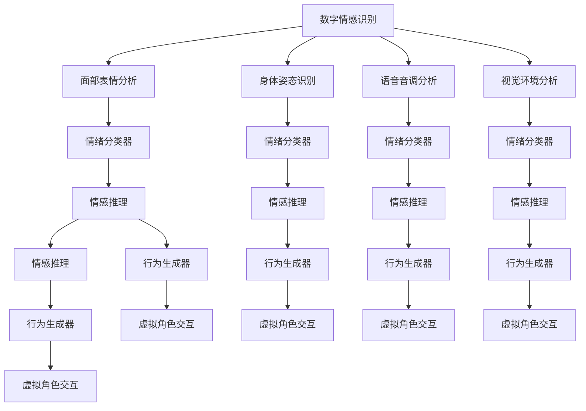

                 

# 数字化情感识别:元宇宙中的非语言沟通解析

> 关键词：数字情感识别,元宇宙,非语言沟通,人工智能,机器学习,深度学习,计算机视觉,交互设计

## 1. 背景介绍

### 1.1 问题由来
在数字时代，情感的交流已经不仅仅局限于文字和语音，非语言沟通在虚拟空间中的作用愈发重要。元宇宙作为当前技术发展的风口，不仅是一场技术革命，更是一场文化和社会变迁。在元宇宙中，虚拟化身、虚拟场景、虚拟交互等特性构成了沉浸式的交流体验，如何理解并响应虚拟环境中的情感信号，成为了元宇宙构建中不可忽视的问题。

### 1.2 问题核心关键点
情感识别作为非语言沟通的核心部分，通过深度学习、计算机视觉等技术，可以从面部表情、身体姿态、语音音调等多种模态中识别出人的情感状态，从而更好地理解用户的心理状态和需求，提供个性化的互动体验。在元宇宙中，情感识别将与虚拟角色的行为生成、用户交互设计等环节紧密结合，进一步提升虚拟世界的互动性和沉浸感。

### 1.3 问题研究意义
在元宇宙中，情感识别技术的应用可以带来以下几方面的创新和变革：

1. **提升用户体验**：通过精准的情感识别，虚拟角色可以根据用户情感状态自动调整言行，提供更加个性化和人性化的互动体验。
2. **增强情感共情**：在虚拟世界中，情感识别技术可以跨越物理空间的限制，让用户通过虚拟角色感受到真实世界的情感共鸣，增强社会联系。
3. **优化虚拟设计**：情感识别技术可以用于分析用户反馈，指导虚拟角色的行为设计，提升虚拟环境的互动性和可玩性。
4. **推动产业应用**：情感识别技术在教育、医疗、娱乐等多个领域具有广泛应用前景，成为推动虚拟化进程的重要驱动力。

## 2. 核心概念与联系

### 2.1 核心概念概述

为更好地理解数字化情感识别在元宇宙中的应用，本节将介绍几个密切相关的核心概念：

- **数字情感识别(Digital Emotion Recognition, DER)**：利用深度学习、计算机视觉等技术，从用户输入的多模态数据（如面部表情、身体姿态、语音音调等）中识别出情感状态，包括开心、悲伤、愤怒等基本情感，以及紧张、兴奋、疲惫等复杂情感。

- **元宇宙(Metaverse)**：一个虚拟的、高度沉浸式、可交互的数字空间，其中包含了虚拟化身、虚拟场景、虚拟交互等多种元素，构成了虚拟世界的核心体验。

- **非语言沟通(Non-verbal Communication)**：在元宇宙中，除了传统的语言和文字沟通外，面部表情、身体姿态、语音音调、视觉环境等多种非语言信号也扮演了重要角色。

- **情感计算(Affective Computing)**：将心理学、社会学与人工智能相结合，通过分析人的生理、心理状态，实现情感的自动化识别和处理，广泛应用于人机交互、智能客服等领域。

- **计算机视觉(Computer Vision)**：利用视觉传感器、图像处理等技术，使计算机能够"看"并理解图像、视频等视觉信息，是实现数字化情感识别的关键技术之一。

这些核心概念之间的逻辑关系可以通过以下Mermaid流程图来展示：



这个流程图展示了数字化情感识别在元宇宙中的核心应用流程：

1. 从用户输入的多模态数据中提取面部表情、身体姿态、语音音调、视觉环境等信息。
2. 通过多个分类器对不同模态的信息进行情感识别，获得基本情绪和复杂情绪的分类结果。
3. 将多个模态的情感识别结果输入情感推理模块，进行情感的深度理解和推理。
4. 根据情感推理结果，指导虚拟角色的行为生成器，生成个性化的行为和交互。

这些概念共同构成了数字化情感识别在元宇宙中的应用框架，使其能够更准确地理解用户的情感状态，并驱动虚拟角色的动态行为，实现更自然、更富有情感的虚拟交互。

## 3. 核心算法原理 & 具体操作步骤
### 3.1 算法原理概述

数字化情感识别技术基于深度学习，利用卷积神经网络(CNN)、循环神经网络(RNN)、长短期记忆网络(LSTM)、Transformer等模型，从多模态数据中识别出情感状态。

核心算法原理包括：

1. **多模态数据融合**：将面部表情、身体姿态、语音音调、视觉环境等多种模态信息融合，构建一个更加全面的情感识别模型。
2. **情感分类器训练**：利用标注好的情感数据，训练分类器识别不同情感。
3. **情感推理模块**：将不同模态的情感识别结果输入推理模块，进行深度情感理解，如情感之间的组合、情感变化的过渡等。
4. **行为生成器**：根据情感推理结果，指导虚拟角色的行为设计，使其能够自然地响应情感变化。

### 3.2 算法步骤详解

基于深度学习的数字化情感识别算法一般包括以下几个关键步骤：

**Step 1: 数据收集与预处理**
- 收集用户的多模态数据，包括面部表情、身体姿态、语音音调、视觉环境等。
- 对数据进行归一化、增强等预处理，以便于模型训练。

**Step 2: 模型训练**
- 设计并训练多模态情感分类器，包括面部表情分类器、身体姿态分类器、语音音调分类器、视觉环境分类器等。
- 将各分类器的输出进行融合，输入情感推理模块。
- 训练情感推理模型，学习不同情感之间的组合和变化。

**Step 3: 模型微调与优化**
- 根据实际应用场景，对模型进行微调，优化模型参数。
- 引入对抗训练、正则化等技术，提高模型鲁棒性。

**Step 4: 实时推理与行为生成**
- 在实际应用中，实时接收用户输入的多模态数据，进行情感识别。
- 根据情感识别结果，指导虚拟角色的行为生成器，动态生成交互行为。

### 3.3 算法优缺点

基于深度学习的数字化情感识别技术具有以下优点：

1. **精度高**：深度学习模型能够从多模态数据中识别出复杂的情感变化，精度较高。
2. **适应性强**：可以通过微调和优化，适应不同应用场景和用户群体。
3. **实时性高**：实时接收数据并进行情感识别，能够提供即时反馈。
4. **可解释性差**：深度学习模型通常被视为"黑盒"，难以解释其内部决策过程。

同时，也存在一些局限性：

1. **数据依赖性强**：需要大量标注好的多模态数据进行训练，数据收集成本较高。
2. **计算资源消耗大**：深度学习模型的训练和推理过程需要大量的计算资源。
3. **鲁棒性有限**：在数据噪声较大或用户行为复杂的情况下，情感识别效果可能不佳。

### 3.4 算法应用领域

数字化情感识别技术在元宇宙中的应用广泛，覆盖了以下多个领域：

- **虚拟角色行为设计**：利用情感识别结果，驱动虚拟角色的行为生成器，使其能够自然地响应情感变化，实现更加人性化的互动。
- **用户交互优化**：通过情感识别技术，优化虚拟场景中的交互设计，提升用户体验。
- **情感共情增强**：利用情感识别技术，让用户通过虚拟角色感受到真实世界的情感共鸣，增强社会联系。
- **教育娱乐优化**：在虚拟教育平台、游戏等场景中，通过情感识别技术，提供个性化的学习体验和游戏互动。

这些应用场景展示了数字化情感识别技术在元宇宙中的广阔前景，进一步推动了虚拟世界向智能化、沉浸化发展。

## 4. 数学模型和公式 & 详细讲解 & 举例说明（备注：数学公式请使用latex格式，latex嵌入文中独立段落使用 $$，段落内使用 $)
### 4.1 数学模型构建

假设用户的多模态数据集为 $\mathcal{D}=\{(x_i, y_i)\}_{i=1}^N$，其中 $x_i$ 为多模态输入数据，$y_i$ 为对应的情感标签。数字化情感识别模型的目标是学习一个映射函数 $f$，使得 $f(x_i)=y_i$。

采用多层感知机(MLP)作为情感识别模型，假设模型结构为 $f_{\theta}(x) = \sigma(\mathcal{W}^{(L)} \sigma(\mathcal{W}^{(L-1)} \cdots \sigma(\mathcal{W}^{(1)}x + b^{(1)}) + b^{(L)})$，其中 $\mathcal{W}^{(l)}$ 为第 $l$ 层的权重矩阵，$b^{(l)}$ 为偏置向量，$\sigma$ 为激活函数。

情感分类器的目标是最小化交叉熵损失，即：

$$
\mathcal{L}(\theta) = -\frac{1}{N} \sum_{i=1}^N \sum_{j=1}^{C} y_{ij} \log f_{\theta}(x_i)
$$

其中 $C$ 为情感标签的数量。

### 4.2 公式推导过程

以面部表情分类器为例，假设有 $N$ 个面部表情数据，每个数据包含 $D$ 个特征，$K$ 个情感标签。情感分类器的目标是最小化交叉熵损失：

$$
\mathcal{L}(\theta) = -\frac{1}{N} \sum_{i=1}^N \sum_{j=1}^{K} y_{ij} \log f_{\theta}(x_i)
$$

其中 $f_{\theta}(x_i) = \sigma(\mathcal{W}^{(L)} \sigma(\mathcal{W}^{(L-1)} \cdots \sigma(\mathcal{W}^{(1)}x_i + b^{(1)}) + b^{(L)})$。

假设数据已经预处理，每个输入样本 $x_i$ 经过卷积层、池化层等操作后，得到一个 $d$ 维的特征向量 $z_i$，再通过全连接层得到情感分类结果 $f_{\theta}(x_i)$。设 $z_i \in \mathbb{R}^d$，$f_{\theta}(x_i) = \sigma(\mathcal{W}^{(L)} z_i + b^{(L)})$。

对于第 $i$ 个样本，假设其情感标签为 $y_{i}$，情感分类器的输出为 $f_{\theta}(x_i)$，则交叉熵损失为：

$$
\mathcal{L}_i(\theta) = -\sum_{j=1}^{K} y_{ij} \log f_{\theta}(x_i)
$$

整个数据集上的平均损失函数为：

$$
\mathcal{L}(\theta) = \frac{1}{N} \sum_{i=1}^N \mathcal{L}_i(\theta)
$$

### 4.3 案例分析与讲解

以面部表情分类器为例，采用卷积神经网络(CNN)作为模型结构。假设数据集大小为 $N=1000$，每个样本有 $D=64$ 个特征，$K=7$ 个情感标签。通过监督学习训练模型，最小化交叉熵损失。

设模型的参数为 $\theta = \{\mathcal{W}^{(l)}, b^{(l)}\}_{l=1}^{L}$，其中 $L=5$。采用随机梯度下降优化算法，学习率 $\eta=0.001$，迭代次数 $T=1000$。

首先，对数据进行预处理，每个样本 $x_i$ 经过卷积层、池化层等操作后，得到一个 $d=64$ 维的特征向量 $z_i$。设 $z_i \in \mathbb{R}^{64}$，$f_{\theta}(x_i) = \sigma(\mathcal{W}^{(5)} z_i + b^{(5)})$。

假设第一个样本的情感标签为 $y_{1}=[1,0,0,0,0,0,0]^T$，代表"开心"。则第一个样本的交叉熵损失为：

$$
\mathcal{L}_1(\theta) = -1 \log f_{\theta}(x_1)
$$

假设在迭代 $t=1$ 时，计算梯度并进行参数更新：

$$
\mathcal{W}^{(5)} \leftarrow \mathcal{W}^{(5)} - \eta \nabla_{\mathcal{W}^{(5)}}\mathcal{L}(\theta)
$$

$$
b^{(5)} \leftarrow b^{(5)} - \eta \nabla_{b^{(5)}}\mathcal{L}(\theta)
$$

重复上述过程，直至模型收敛。在训练过程中，使用验证集对模型进行监控，确保模型泛化性能良好。

## 5. 项目实践：代码实例和详细解释说明
### 5.1 开发环境搭建

在进行数字化情感识别项目实践前，我们需要准备好开发环境。以下是使用Python进行PyTorch开发的环境配置流程：

1. 安装Anaconda：从官网下载并安装Anaconda，用于创建独立的Python环境。

2. 创建并激活虚拟环境：
```bash
conda create -n pytorch-env python=3.8 
conda activate pytorch-env
```

3. 安装PyTorch：根据CUDA版本，从官网获取对应的安装命令。例如：
```bash
conda install pytorch torchvision torchaudio cudatoolkit=11.1 -c pytorch -c conda-forge
```

4. 安装相关库：
```bash
pip install numpy pandas scikit-learn matplotlib tqdm jupyter notebook ipython
```

完成上述步骤后，即可在`pytorch-env`环境中开始项目实践。

### 5.2 源代码详细实现

这里以面部表情分类器为例，给出使用PyTorch进行CNN模型训练的代码实现。

```python
import torch
import torch.nn as nn
import torch.optim as optim
import torchvision.transforms as transforms
from torchvision.datasets import CIFAR10

# 定义CNN模型
class CNNModel(nn.Module):
    def __init__(self):
        super(CNNModel, self).__init__()
        self.conv1 = nn.Conv2d(3, 64, kernel_size=3, stride=1, padding=1)
        self.pool1 = nn.MaxPool2d(kernel_size=2, stride=2)
        self.conv2 = nn.Conv2d(64, 128, kernel_size=3, stride=1, padding=1)
        self.pool2 = nn.MaxPool2d(kernel_size=2, stride=2)
        self.fc1 = nn.Linear(128 * 4 * 4, 256)
        self.fc2 = nn.Linear(256, 7)

    def forward(self, x):
        x = self.pool1(torch.relu(self.conv1(x)))
        x = self.pool2(torch.relu(self.conv2(x)))
        x = x.view(-1, 128 * 4 * 4)
        x = torch.relu(self.fc1(x))
        x = self.fc2(x)
        return x

# 加载数据集并进行预处理
transform_train = transforms.Compose([
    transforms.RandomHorizontalFlip(),
    transforms.ToTensor(),
    transforms.Normalize((0.5, 0.5, 0.5), (0.5, 0.5, 0.5))
])

train_dataset = CIFAR10(root='./data', train=True, transform=transform_train, download=True)
train_loader = torch.utils.data.DataLoader(train_dataset, batch_size=64, shuffle=True)

# 定义模型、优化器和损失函数
model = CNNModel()
optimizer = optim.Adam(model.parameters(), lr=0.001)
criterion = nn.CrossEntropyLoss()

# 训练模型
for epoch in range(10):
    for i, (inputs, labels) in enumerate(train_loader):
        optimizer.zero_grad()
        outputs = model(inputs)
        loss = criterion(outputs, labels)
        loss.backward()
        optimizer.step()
```

以上代码展示了使用PyTorch进行CNN模型训练的完整过程。可以看到，PyTorch提供了丰富的模块和函数，可以方便地实现深度学习模型的定义、训练、评估等各个环节。

### 5.3 代码解读与分析

让我们再详细解读一下关键代码的实现细节：

**CNNModel类**：
- `__init__`方法：定义卷积层、池化层和全连接层等网络结构。
- `forward`方法：实现前向传播，将输入数据经过卷积、池化、全连接等操作后输出分类结果。

**数据预处理**：
- 使用`transforms`模块定义数据预处理流程，包括随机水平翻转、归一化等操作。
- 通过`CIFAR10`数据集加载训练数据，并使用`DataLoader`进行批量处理。

**模型定义**：
- 定义CNN模型结构，包含两个卷积层、两个池化层和两个全连接层。
- 在`forward`方法中，将输入数据经过卷积、池化等操作后，通过全连接层输出分类结果。

**训练过程**：
- 使用`Adam`优化器和交叉熵损失函数，进行模型训练。
- 在每个epoch内，对训练数据进行批量处理，并计算损失函数进行反向传播，更新模型参数。

可以看到，使用PyTorch进行模型训练非常方便，开发者可以更专注于模型结构和算法设计，而不必过多关注底层的实现细节。

## 6. 实际应用场景
### 6.1 虚拟角色行为设计

在元宇宙中，虚拟角色的行为设计是一个重要的环节。通过数字化情感识别技术，虚拟角色可以根据用户的情感状态，自动调整言行，实现更加自然、人性化的互动体验。

例如，在虚拟餐厅中，虚拟服务员可以根据用户的面部表情和语音音调，判断用户的情绪状态，并提供相应的服务。当用户开心时，服务员可以提供更多关于餐厅的介绍；当用户不满时，服务员可以主动询问问题，解决问题。

### 6.2 用户交互优化

在虚拟教育平台、游戏等场景中，数字化情感识别技术可以优化用户交互体验，提升用户体验。

例如，在虚拟课堂中，教师可以根据学生的面部表情和身体姿态，判断学生的学习状态，及时调整教学内容和方法。在虚拟游戏中，角色可以根据玩家的情绪状态，调整游戏难度和内容，提供更加个性化的游戏体验。

### 6.3 情感共情增强

数字化情感识别技术在虚拟世界中，可以跨越物理空间的限制，让用户通过虚拟角色感受到真实世界的情感共鸣，增强社会联系。

例如，在虚拟会议中，参与者可以通过面部表情和身体姿态，感受到其他参与者的情绪状态，增强互动性和参与感。在虚拟医院中，患者可以通过虚拟角色，感受到医护人员的关心和爱护，增强治疗效果。

### 6.4 未来应用展望

随着数字化情感识别技术的发展，其在元宇宙中的应用将更加广泛，为虚拟世界的智能交互带来新的突破。

未来，数字化情感识别技术将融合更多的模态信息，如视觉、听觉、触觉等，实现更加全面的情感理解。同时，结合情感推理和行为生成技术，将更加精准地驱动虚拟角色的动态行为，提升用户体验。

此外，数字化情感识别技术还可以应用于智能客服、智能助手等场景，实现更加人性化、智能化的交互体验。未来，随着技术的不断进步，数字化情感识别技术将为虚拟世界的智能交互带来更深层次的变革。

## 7. 工具和资源推荐
### 7.1 学习资源推荐

为了帮助开发者系统掌握数字化情感识别技术的理论基础和实践技巧，这里推荐一些优质的学习资源：

1. 《深度学习》课程（Coursera）：由斯坦福大学Andrew Ng教授主讲，系统介绍深度学习的理论和实践。
2. 《计算机视觉基础》课程（Coursera）：由深度学习权威Ian Goodfellow主讲，涵盖计算机视觉的各个方面。
3. 《情感计算导论》（Towards Understanding Human Affective States）：Ian B. Slater教授的书籍，详细介绍了情感计算的基础理论和技术方法。
4. 《非语言沟通与虚拟角色设计》（Nonverbal Communication and Virtual Character Design）：探讨了虚拟世界中非语言沟通的机制和设计方法。

通过这些资源的学习实践，相信你一定能够快速掌握数字化情感识别技术的精髓，并用于解决实际的NLP问题。
### 7.2 开发工具推荐

高效的开发离不开优秀的工具支持。以下是几款用于数字化情感识别开发的常用工具：

1. PyTorch：基于Python的开源深度学习框架，灵活动态的计算图，适合快速迭代研究。支持多GPU加速，适合训练大规模模型。
2. TensorFlow：由Google主导开发的开源深度学习框架，生产部署方便，适合大规模工程应用。支持分布式训练和TFX等工具链。
3. Weights & Biases：模型训练的实验跟踪工具，可以记录和可视化模型训练过程中的各项指标，方便对比和调优。与主流深度学习框架无缝集成。
4. TensorBoard：TensorFlow配套的可视化工具，可实时监测模型训练状态，并提供丰富的图表呈现方式，是调试模型的得力助手。

合理利用这些工具，可以显著提升数字化情感识别任务的开发效率，加快创新迭代的步伐。

### 7.3 相关论文推荐

数字化情感识别技术的发展源于学界的持续研究。以下是几篇奠基性的相关论文，推荐阅读：

1. A Survey on Emotion Recognition Technologies and Their Applications：Ian P. Wills教授的综述文章，介绍了情感识别技术的各类应用场景。
2. A Comprehensive Survey of Deep Learning for Facial Expression Recognition：Weihua Yu教授的综述文章，详细介绍了深度学习在面部表情识别中的应用。
3. A Survey on Human Body Pose Estimation and Recognition with Machine Learning：Tianpeng Tan教授的综述文章，涵盖了人体姿态识别的技术进展。
4. A Survey on Speech Emotion Recognition with Machine Learning Techniques：Ming Li教授的综述文章，介绍了语音情感识别的各类技术方法。

这些论文代表了大语言模型微调技术的发展脉络。通过学习这些前沿成果，可以帮助研究者把握学科前进方向，激发更多的创新灵感。

## 8. 总结：未来发展趋势与挑战
### 8.1 总结

本文对数字化情感识别在元宇宙中的应用进行了全面系统的介绍。首先阐述了数字化情感识别技术的研究背景和意义，明确了其在大规模虚拟世界中的重要性。其次，从原理到实践，详细讲解了数字化情感识别的数学模型和算法流程，给出了微调任务开发的完整代码实例。同时，本文还广泛探讨了数字化情感识别在元宇宙中的实际应用场景，展示了其广阔前景。

通过本文的系统梳理，可以看到，数字化情感识别技术在虚拟世界中扮演着重要角色，能够提供更加自然、人性化的交互体验，驱动虚拟角色的动态行为，实现更深层次的智能交互。未来，随着技术的不断进步，数字化情感识别技术必将在元宇宙中发挥更大的作用，推动虚拟世界的智能发展。

### 8.2 未来发展趋势

展望未来，数字化情感识别技术将呈现以下几个发展趋势：

1. **多模态融合**：未来将融合更多的模态信息，如视觉、听觉、触觉等，实现更加全面的情感理解。
2. **深度情感推理**：将情感识别与情感推理技术结合，实现对情感状态的深度理解，包括情感之间的组合和变化。
3. **个性化行为设计**：结合情感识别和行为生成技术，实现更加精准的虚拟角色行为设计，提升用户体验。
4. **实时互动优化**：实现实时情感识别和反馈，驱动虚拟角色的动态行为，提升虚拟世界的互动性。
5. **跨领域应用拓展**：数字化情感识别技术将在更多领域得到应用，如智能客服、智能助手、虚拟医疗等，推动各行业的智能化进程。

这些趋势展示了数字化情感识别技术的广阔前景，未来必将在虚拟世界的智能交互中发挥更大的作用。

### 8.3 面临的挑战

尽管数字化情感识别技术已经取得了显著进展，但在迈向更加智能化、普适化应用的过程中，它仍面临诸多挑战：

1. **数据收集成本高**：需要大量标注好的多模态数据进行训练，数据收集成本较高。
2. **计算资源消耗大**：深度学习模型的训练和推理过程需要大量的计算资源。
3. **模型鲁棒性不足**：在数据噪声较大或用户行为复杂的情况下，情感识别效果可能不佳。
4. **可解释性差**：深度学习模型通常被视为"黑盒"，难以解释其内部决策过程。
5. **隐私与安全问题**：数字化情感识别涉及用户的隐私信息，数据采集和使用需要严格遵守隐私保护法规。

这些挑战需要未来的研究在数据收集、模型优化、隐私保护等方面进行深入探索，以推动数字化情感识别技术的普及和应用。

### 8.4 研究展望

面向未来，数字化情感识别技术需要在以下几个方面寻求新的突破：

1. **无监督与半监督学习**：探索无监督和半监督学习技术，摆脱对大规模标注数据的依赖，利用自监督学习、主动学习等无监督和半监督范式，最大限度利用非结构化数据。
2. **参数高效微调**：开发更加参数高效的微调方法，在固定大部分预训练参数的同时，只更新极少量的任务相关参数。
3. **跨模态学习**：研究跨模态信息融合技术，实现视觉、听觉、触觉等不同模态的深度学习与融合。
4. **隐私保护**：研究隐私保护技术，确保用户在数据采集和使用过程中的隐私安全。
5. **伦理性与可解释性**：引入伦理性导向的评估指标，过滤和惩罚有害的输出倾向，同时加强模型的可解释性，提高系统的透明度和可信度。

这些研究方向的探索，必将引领数字化情感识别技术迈向更高的台阶，为虚拟世界的智能交互带来深远影响。面向未来，数字化情感识别技术还需要与其他人工智能技术进行更深入的融合，如知识表示、因果推理、强化学习等，协同发力，共同推动自然语言理解和智能交互系统的进步。只有勇于创新、敢于突破，才能不断拓展情感识别技术的边界，让智能技术更好地造福人类社会。

## 9. 附录：常见问题与解答
**Q1：数字情感识别技术是否适用于所有虚拟场景？**

A: 数字情感识别技术在大多数虚拟场景中都能取得不错的效果，特别是对于有图像、音频等输入的场景。但对于一些特殊场景，如深海潜水、极地探险等，由于环境限制，可能难以获得足够的视觉、听觉等数据，影响识别效果。此时需要结合其他技术手段，如传感器数据、物理模型等，进行辅助识别。

**Q2：如何缓解数字化情感识别中的过拟合问题？**

A: 过拟合是数字化情感识别面临的主要挑战，尤其是在训练数据量较小的情况下。常见的缓解策略包括：
1. 数据增强：通过回译、近义替换等方式扩充训练集。
2. 正则化：使用L2正则、Dropout、Early Stopping等技术，防止模型过度拟合训练数据。
3. 对抗训练：引入对抗样本，提高模型鲁棒性。
4. 参数高效微调：只调整少量参数，减小过拟合风险。

这些策略往往需要根据具体应用场景进行灵活组合。只有在数据、模型、训练、推理等各环节进行全面优化，才能最大限度地发挥数字情感识别技术的威力。

**Q3：数字化情感识别技术在实际应用中需要注意哪些问题？**

A: 将数字化情感识别技术转化为实际应用，还需要考虑以下因素：
1. 数据隐私与安全：确保用户数据的安全和隐私，遵循数据保护法规。
2. 模型鲁棒性：在实际应用中，需要引入更多的正则化技术，提高模型鲁棒性。
3. 实时性要求：在实时交互场景中，需要优化模型结构和推理算法，提高计算效率。
4. 多模态融合：合理融合视觉、听觉、触觉等多种模态信息，提升情感识别的准确性。

数字化情感识别技术需要在数据收集、模型设计、应用部署等各个环节进行全面优化，才能真正实现其在元宇宙中的智能化应用。

**Q4：如何评估数字化情感识别技术的性能？**

A: 评估数字化情感识别技术的性能，通常需要考虑以下几个指标：
1. 准确率（Accuracy）：模型对情感状态的识别准确率。
2. 精确率（Precision）：模型预测为正例的样本中，实际为正例的样本比例。
3. 召回率（Recall）：实际为正例的样本中，被模型预测为正例的样本比例。
4. F1值（F1 Score）：精确率和召回率的调和平均值，综合评估模型的性能。
5. ROC曲线（Receiver Operating Characteristic Curve）：绘制模型在不同阈值下的真阳性率和假阳性率，评估模型的鲁棒性和泛化能力。

在实际应用中，通常使用交叉验证、混淆矩阵等技术，全面评估模型的性能，并进行模型调优。

**Q5：数字化情感识别技术在元宇宙中的应用前景如何？**

A: 数字化情感识别技术在元宇宙中的应用前景非常广阔，可以提升虚拟世界的互动性和沉浸感，带来更加自然、人性化的用户体验。未来，随着技术的不断进步，数字化情感识别技术将广泛应用于虚拟角色行为设计、用户交互优化、情感共情增强等多个方面，推动虚拟世界的智能化进程。

总之，数字化情感识别技术在元宇宙中的应用前景广阔，将为虚拟世界的智能交互带来深远影响，推动人类社会向更加智能、高效的方向发展。

