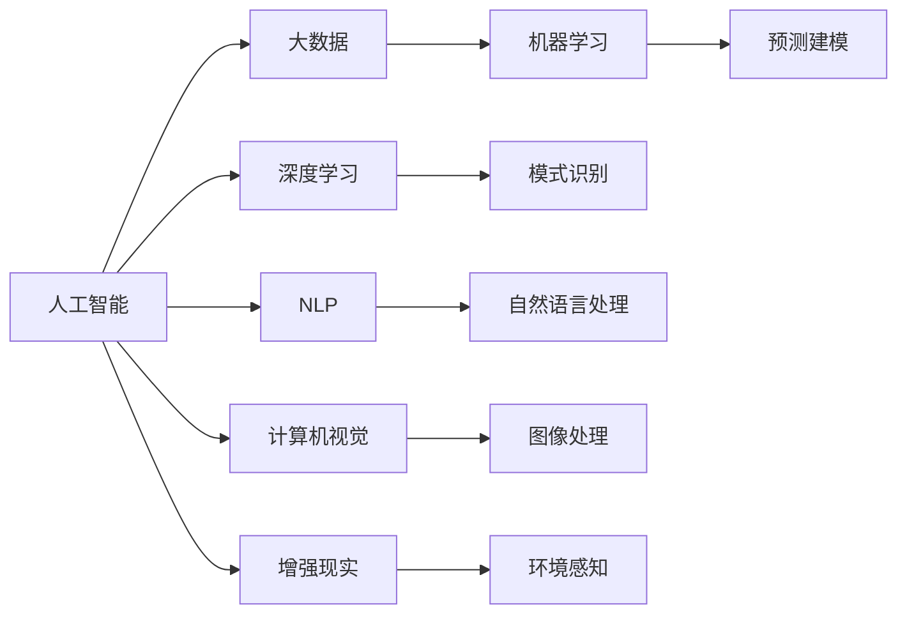

                 

# 数字化想象力：AI激发的创意思维

> 关键词：数字化转型, 人工智能, 创意思维, 数据驱动, 创新驱动

## 1. 背景介绍

### 1.1 问题由来

数字化转型是当今企业发展的必然趋势，尤其在新冠疫情的催化下，数字经济成为驱动全球经济增长的重要引擎。人工智能（AI）作为数字化转型的核心技术，其快速发展不仅改变了企业的运营模式，也极大地激发了人类的创新思维和数字化想象力。数字化想象力不仅体现在利用数据驱动决策的逻辑中，更体现在通过算法发现新知识、新模式、新洞见的创意中。

### 1.2 问题核心关键点

数字化想象力的核心在于将AI技术应用于各个领域，提升人类思维的创造力和决策的精准性。这包括了数据分析、模式识别、预测建模、自然语言处理等多方面的应用。核心关键点包括：

1. **数据分析**：通过对大量数据的收集、处理和分析，揭示数据背后的规律和趋势。
2. **模式识别**：利用AI技术自动识别数据中的规律和模式，帮助人类发现新的问题和解决方案。
3. **预测建模**：利用机器学习算法预测未来趋势，提供决策支持。
4. **自然语言处理**：通过AI技术理解、生成自然语言，提升人机交互效率和效果。

### 1.3 问题研究意义

数字化想象力研究的根本意义在于通过AI技术赋能人类思维，提升创新能力，推动产业升级和经济社会发展。AI技术的应用不仅能够优化决策过程，还能激发新的创意，引领产业变革。具体意义包括：

1. **优化决策**：AI可以处理海量数据，帮助决策者更快、更准确地做出决策。
2. **提升效率**：自动化流程、智能推荐等技术提升生产效率，降低成本。
3. **促进创新**：数据驱动的洞察和新算法的发现，推动新技术和新产品的开发。
4. **推动教育**：通过AI辅助教学，提升教育质量和个性化学习体验。
5. **社会治理**：在公共安全、城市管理等领域，利用AI提高治理效率和响应速度。

## 2. 核心概念与联系

### 2.1 核心概念概述

数字化想象力研究主要涉及以下几个核心概念：

1. **人工智能（AI）**：利用机器学习、深度学习等技术实现模拟人类智能的行为。
2. **大数据**：通过收集和分析大量数据，揭示数据背后的规律和趋势。
3. **机器学习（ML）**：训练数据模型，使其能够从数据中学习和做出预测。
4. **深度学习（DL）**：使用神经网络模型处理高维数据，揭示数据复杂性。
5. **自然语言处理（NLP）**：通过算法理解和生成自然语言，提升人机交互效果。
6. **计算机视觉（CV）**：通过算法理解和生成图像，实现视觉智能。
7. **增强现实（AR）**：通过AI技术增强现实世界的互动体验。

这些核心概念之间存在密切联系，共同构成了数字化想象力的技术基础。

### 2.2 核心概念原理和架构的 Mermaid 流程图



此图展示了核心概念之间的技术关系：

1. 人工智能是整个系统的基础，大数据和机器学习是其核心技术。
2. 深度学习、自然语言处理、计算机视觉、增强现实是其具体应用方向。
3. 预测建模和模式识别是其应用结果，推动决策和创新。

## 3. 核心算法原理 & 具体操作步骤

### 3.1 算法原理概述

数字化想象力的核心算法原理主要包括：

1. **数据收集与预处理**：从不同渠道收集数据，并通过清洗、转换等预处理步骤，确保数据质量。
2. **特征工程**：提取数据中的关键特征，为模型训练提供输入。
3. **模型训练**：利用机器学习算法训练模型，并根据验证集性能调整模型参数。
4. **模型评估**：使用测试集评估模型性能，判断模型是否达到预期效果。
5. **应用部署**：将训练好的模型部署到实际应用中，提供预测或推理服务。

### 3.2 算法步骤详解

1. **数据收集与预处理**
   - **数据源**：从企业内部系统、公开数据集、用户行为数据等渠道收集数据。
   - **数据清洗**：去除噪声数据、处理缺失值和异常值。
   - **数据转换**：将数据转换为适合模型训练的格式，如时间序列、图像数据、文本数据等。

2. **特征工程**
   - **特征选择**：选择对目标变量有重要影响的特征。
   - **特征提取**：将原始数据转换为高维特征空间，如PCA、LDA等降维方法。
   - **特征构建**：生成新的特征，如时间窗口、交叉特征等。

3. **模型训练**
   - **选择合适的算法**：根据任务选择合适的机器学习或深度学习算法。
   - **设置超参数**：如学习率、批大小、迭代次数等。
   - **训练模型**：在训练集上训练模型，优化模型参数。
   - **模型验证**：在验证集上评估模型性能，调整模型参数。

4. **模型评估**
   - **评估指标**：选择适当的评估指标，如准确率、召回率、F1分数等。
   - **交叉验证**：使用交叉验证方法评估模型性能。
   - **模型调优**：根据评估结果调整模型参数。

5. **应用部署**
   - **模型集成**：将训练好的模型集成到应用系统中。
   - **API接口**：提供API接口供外部系统调用。
   - **实时监控**：实时监控模型性能，处理异常情况。

### 3.3 算法优缺点

数字化想象力的算法具有以下优点：

1. **高效性**：通过自动化处理大量数据，提升决策效率。
2. **精准性**：基于数据驱动的决策更加准确。
3. **可扩展性**：模型可以随时调整和优化，适应新的数据和任务。

但同时，这些算法也存在一些缺点：

1. **数据依赖**：高质量的数据是训练和优化模型的基础。
2. **模型复杂性**：深度学习模型复杂，训练和部署难度大。
3. **解释性不足**：黑箱模型难以解释决策过程，缺乏透明性。
4. **数据隐私**：处理敏感数据时需要严格保护隐私。
5. **技术门槛高**：需要专业技术人员进行模型开发和部署。

### 3.4 算法应用领域

数字化想象力的算法广泛应用于以下领域：

1. **金融行业**：利用AI进行风险评估、欺诈检测、投资预测等。
2. **医疗行业**：通过AI分析医疗影像、预测疾病、个性化治疗等。
3. **零售行业**：使用AI进行客户画像、销售预测、推荐系统等。
4. **制造业**：利用AI进行质量控制、设备维护、供应链管理等。
5. **公共安全**：通过AI进行犯罪预测、交通监控、灾害预警等。
6. **教育行业**：使用AI进行个性化教学、智能评估、学习路径规划等。

## 4. 数学模型和公式 & 详细讲解 & 举例说明

### 4.1 数学模型构建

数字化想象力研究的数学模型主要基于以下几个模型：

1. **线性回归模型**：
   - 描述自变量与因变量之间的关系。
   - 公式：$y = w_0 + w_1x_1 + w_2x_2 + \ldots + w_nx_n$

2. **决策树模型**：
   - 利用树形结构对数据进行分类。
   - 公式：$D(t) = \sum_{i=1}^n D(t-1) * I(x_i < t-1)$

3. **随机森林模型**：
   - 利用多个决策树对数据进行分类。
   - 公式：$F(x) = \frac{1}{N} \sum_{i=1}^N f_i(x)$

4. **支持向量机模型**：
   - 利用超平面对数据进行分类。
   - 公式：$w = \frac{1}{||w||^2} \sum_{i=1}^n \alpha_i y_i x_i$

5. **深度学习模型**：
   - 利用多层神经网络对数据进行建模。
   - 公式：$y = \sigma(W * x + b)$

### 4.2 公式推导过程

以线性回归模型为例，推导其参数估计公式：

- **最小二乘法**：最小化平方误差和。
- **梯度下降法**：计算参数的梯度，并沿着梯度方向更新参数。
- **正规方程法**：直接求解矩阵方程，得到参数值。

具体推导过程如下：

1. 目标函数：$J(w) = \frac{1}{2m} \sum_{i=1}^m (y_i - w_0 - w_1x_{1i} - w_2x_{2i} - \ldots - w_nx_{ni})^2$
2. 梯度：$\frac{\partial J}{\partial w_k} = \frac{1}{m} \sum_{i=1}^m (y_i - w_0 - w_1x_{1i} - w_2x_{2i} - \ldots - w_nx_{ni})x_{ki}$
3. 更新规则：$w_k = w_k - \frac{\alpha}{m} \sum_{i=1}^m (y_i - w_0 - w_1x_{1i} - w_2x_{2i} - \ldots - w_nx_{ni})x_{ki}$

### 4.3 案例分析与讲解

以医疗行业为例，分析如何使用AI进行疾病预测：

1. **数据收集**：从医院、体检中心、电子病历等渠道收集患者数据，包括年龄、性别、病史、家族病史、检查结果等。
2. **特征工程**：提取关键特征，如血压、血糖、胆固醇等。
3. **模型训练**：选择适当的机器学习算法，如逻辑回归、随机森林等，训练预测模型。
4. **模型评估**：使用验证集评估模型性能，调整模型参数。
5. **应用部署**：将训练好的模型集成到医疗系统中，实时预测疾病风险。

## 5. 项目实践：代码实例和详细解释说明

### 5.1 开发环境搭建

以下是使用Python进行TensorFlow开发的环境配置流程：

1. 安装Anaconda：从官网下载并安装Anaconda，用于创建独立的Python环境。
2. 创建并激活虚拟环境：
```bash
conda create -n tf-env python=3.8 
conda activate tf-env
```

3. 安装TensorFlow：根据CUDA版本，从官网获取对应的安装命令。例如：
```bash
conda install tensorflow -c tf
```

4. 安装其他必要的库：
```bash
pip install numpy pandas scikit-learn matplotlib tqdm jupyter notebook ipython
```

完成上述步骤后，即可在`tf-env`环境中开始TensorFlow代码实践。

### 5.2 源代码详细实现

以下是使用TensorFlow进行医疗影像分类任务的代码实现。

```python
import tensorflow as tf
from tensorflow.keras import layers, models
from tensorflow.keras.datasets import cifar10
from tensorflow.keras.utils import to_categorical

# 加载CIFAR-10数据集
(x_train, y_train), (x_test, y_test) = cifar10.load_data()

# 数据预处理
x_train = x_train / 255.0
x_test = x_test / 255.0

# 定义模型
model = models.Sequential([
    layers.Conv2D(32, (3, 3), activation='relu', input_shape=(32, 32, 3)),
    layers.MaxPooling2D((2, 2)),
    layers.Conv2D(64, (3, 3), activation='relu'),
    layers.MaxPooling2D((2, 2)),
    layers.Conv2D(64, (3, 3), activation='relu'),
    layers.Flatten(),
    layers.Dense(64, activation='relu'),
    layers.Dense(10)
])

# 编译模型
model.compile(optimizer='adam',
              loss=tf.keras.losses.SparseCategoricalCrossentropy(from_logits=True),
              metrics=['accuracy'])

# 训练模型
history = model.fit(x_train, y_train, epochs=10, validation_data=(x_test, y_test))

# 评估模型
test_loss, test_acc = model.evaluate(x_test, y_test, verbose=2)

# 使用模型进行预测
predictions = model.predict(x_test)
```

### 5.3 代码解读与分析

这段代码实现了使用TensorFlow进行CIFAR-10数据集的图像分类任务。具体步骤如下：

1. 加载CIFAR-10数据集，并对其进行预处理。
2. 定义卷积神经网络模型，包含多个卷积层和池化层，最后输出全连接层。
3. 编译模型，使用Adam优化器和交叉熵损失函数。
4. 训练模型，使用训练集和验证集进行10轮迭代。
5. 评估模型，计算测试集上的准确率。
6. 使用模型进行预测。

## 6. 实际应用场景

### 6.1 智能客服系统

智能客服系统通过AI技术，实现了7x24小时不间断服务，大幅提升客户咨询体验。具体实现流程如下：

1. 收集企业内部的历史客服对话记录，构建监督数据集。
2. 使用BERT模型进行微调，学习文本-标签映射。
3. 在实时抓取的网络文本数据上进行推理，动态生成回答。
4. 集成到实际应用系统中，提供客户服务。

### 6.2 金融舆情监测

金融舆情监测通过AI技术，实时监测市场舆论动向，及时应对负面信息传播。具体实现流程如下：

1. 收集金融领域相关的新闻、报道、评论等文本数据。
2. 对其进行主题标注和情感标注，构建监督数据集。
3. 使用BERT模型进行微调，学习文本分类和情感分析任务。
4. 实时抓取网络文本数据，进行情感分析和舆情监测。
5. 触发异常告警，帮助金融机构快速应对潜在风险。

### 6.3 个性化推荐系统

个性化推荐系统通过AI技术，提升推荐内容的精准性和个性化程度。具体实现流程如下：

1. 收集用户浏览、点击、评论、分享等行为数据。
2. 提取物品标题、描述、标签等文本内容，构建监督数据集。
3. 使用BERT模型进行微调，学习文本-标签映射。
4. 使用模型预测用户兴趣匹配度，生成推荐列表。
5. 结合其他特征综合排序，提供个性化推荐。

### 6.4 未来应用展望

未来，数字化想象力的应用前景更加广阔，以下是几个重要的应用方向：

1. **自动驾驶**：利用AI进行环境感知、路径规划、决策等，提升驾驶安全性和效率。
2. **智能家居**：通过AI进行语音识别、场景理解、设备控制等，提升家居智能化水平。
3. **智慧医疗**：利用AI进行疾病预测、影像分析、个性化治疗等，提升医疗服务质量。
4. **智能制造**：利用AI进行设备维护、质量控制、供应链管理等，提升生产效率。
5. **智慧城市**：通过AI进行交通管理、环境监测、应急响应等，提升城市治理水平。
6. **教育科技**：利用AI进行智能评估、个性化教学、学习路径规划等，提升教育质量。

## 7. 工具和资源推荐

### 7.1 学习资源推荐

为了帮助开发者系统掌握数字化想象力的理论基础和实践技巧，这里推荐一些优质的学习资源：

1. 《深度学习》系列书籍：由Ian Goodfellow等作者撰写，全面介绍了深度学习的基本原理和应用。
2. CS231n《计算机视觉》课程：斯坦福大学开设的计算机视觉明星课程，包含丰富的理论和实践内容。
3. 《自然语言处理综论》书籍：Richard Socher等作者撰写，全面介绍了NLP的各个方面。
4. TensorFlow官方文档：TensorFlow的官方文档，提供了丰富的学习资源和样例代码。
5. Kaggle平台：数据科学竞赛平台，提供大量的数据集和挑战，帮助开发者实践和提升技能。

### 7.2 开发工具推荐

高效的开发离不开优秀的工具支持。以下是几款用于数字化想象力开发的常用工具：

1. TensorFlow：由Google主导开发的深度学习框架，生产部署方便，适合大规模工程应用。
2. PyTorch：基于Python的开源深度学习框架，灵活动态的计算图，适合快速迭代研究。
3. Keras：高层深度学习API，提供了简洁的接口，方便快速搭建模型。
4. Jupyter Notebook：交互式编程环境，适合数据探索、模型调试和可视化。
5. Google Colab：谷歌提供的在线Jupyter Notebook环境，免费提供GPU/TPU算力，方便快速实验新模型。

### 7.3 相关论文推荐

数字化想象力研究源于学界的持续研究。以下是几篇奠基性的相关论文，推荐阅读：

1. Deep Learning（深度学习）：Ian Goodfellow等作者，全面介绍了深度学习的基本原理和应用。
2. Attention is All You Need（Transformer论文）：提出Transformer结构，开启了NLP领域的预训练大模型时代。
3. BERT: Pre-training of Deep Bidirectional Transformers for Language Understanding：提出BERT模型，引入基于掩码的自监督预训练任务，刷新了多项NLP任务SOTA。
4. GANs Trained by a Two Time-Scale Update Rule Converge to the Naive Mode of Competition（GAN论文）：提出GAN模型，实现了生成对抗网络。
5. Generative Adversarial Nets（GAN论文）：提出GAN模型，实现了生成对抗网络。

这些论文代表了大规模语言模型和深度学习的最新进展，对于理解数字化想象力的理论基础和应用实践具有重要意义。

## 8. 总结：未来发展趋势与挑战

### 8.1 研究成果总结

数字化想象力的研究已经取得了丰硕成果，主要体现在以下几个方面：

1. **模型精度提升**：通过深度学习算法，模型精度大幅提升，能够处理更加复杂的数据。
2. **应用领域拓展**：AI技术广泛应用于医疗、金融、零售、制造等多个领域，推动行业数字化转型。
3. **人机交互改善**：通过自然语言处理和计算机视觉技术，改善人机交互体验，提升用户满意度。

### 8.2 未来发展趋势

未来，数字化想象力的发展将呈现以下几个趋势：

1. **模型规模增大**：随着算力成本下降和数据规模扩大，模型规模将持续增大，推动算法复杂性提升。
2. **应用场景丰富**：AI技术将进一步拓展到更多领域，推动数字化转型深入发展。
3. **跨模态融合**：多模态数据融合技术将更加成熟，提升AI系统的综合性能。
4. **联邦学习**：分布式训练技术将得到广泛应用，提升数据隐私和系统安全。
5. **实时计算**：实时计算技术将得到广泛应用，提升AI系统的响应速度和交互效率。
6. **可解释性增强**：可解释性技术将得到广泛应用，提升AI系统的透明度和可信度。

### 8.3 面临的挑战

数字化想象力的发展也面临诸多挑战：

1. **数据隐私**：处理敏感数据时需要严格保护隐私，避免数据泄露和滥用。
2. **模型复杂性**：模型规模增大和复杂性提升，导致训练和部署难度增加。
3. **技术门槛高**：需要专业技术人员进行模型开发和部署，导致人力成本增加。
4. **算力需求高**：大规模模型需要高性能算力支持，导致硬件成本增加。
5. **伦理问题**：AI技术的应用需要遵循伦理原则，避免歧视、偏见等问题。
6. **知识更新快**：AI技术快速发展，需要不断学习和更新知识，保持技术领先。

### 8.4 研究展望

未来的研究需要关注以下几个方面：

1. **数据隐私保护**：研究数据隐私保护技术，确保数据安全。
2. **模型简化**：研究模型简化技术，降低模型复杂性，提升计算效率。
3. **技术普及**：研究如何降低技术门槛，普及AI技术，推动数字化转型。
4. **伦理原则**：研究AI技术的伦理原则，确保技术应用符合人类价值观。
5. **知识整合**：研究如何整合外部知识，提升AI系统的知识储备和推理能力。
6. **实时计算**：研究实时计算技术，提升AI系统的响应速度和交互效率。

## 9. 附录：常见问题与解答

**Q1：如何选择合适的机器学习算法？**

A: 选择合适的算法需要根据数据特点和任务需求综合考虑。一般步骤如下：

1. 数据探索：了解数据类型、特征分布、缺失值情况等。
2. 问题定义：明确任务类型（分类、回归、聚类等）和评价指标（准确率、召回率、F1分数等）。
3. 算法选择：根据问题类型选择适当的算法，如逻辑回归、决策树、随机森林、支持向量机等。
4. 模型训练：使用训练集训练模型，优化模型参数。
5. 模型评估：使用验证集评估模型性能，调整模型参数。

**Q2：如何在模型训练中避免过拟合？**

A: 避免过拟合需要采取多种方法，一般步骤如下：

1. 数据增强：通过回译、近义替换等方式扩充训练集。
2. 正则化：使用L2正则、Dropout、Early Stopping等技术防止过拟合。
3. 模型简化：减少模型复杂度，提升泛化能力。
4. 集成学习：使用多个模型进行集成，降低过拟合风险。
5. 交叉验证：使用交叉验证技术评估模型性能，选择最优模型。

**Q3：如何在实际应用中提升模型性能？**

A: 提升模型性能需要综合考虑多个因素，一般步骤如下：

1. 数据预处理：清洗数据，处理缺失值和异常值。
2. 特征工程：提取关键特征，生成新特征。
3. 模型训练：选择适当的算法，优化模型参数。
4. 模型评估：使用验证集评估模型性能，调整模型参数。
5. 模型部署：将训练好的模型部署到实际应用中，优化性能。

**Q4：如何评估模型性能？**

A: 模型性能评估需要选择合适的指标，一般步骤如下：

1. 确定评估指标：根据任务类型选择适当的评估指标，如准确率、召回率、F1分数、AUC等。
2. 交叉验证：使用交叉验证技术评估模型性能，选择最优模型。
3. 超参数调优：通过调整超参数（如学习率、批大小等）优化模型性能。
4. 模型集成：使用多个模型进行集成，提升模型性能。

**Q5：如何在实际应用中处理数据隐私问题？**

A: 处理数据隐私问题需要采取多种措施，一般步骤如下：

1. 数据匿名化：对敏感数据进行匿名化处理，防止数据泄露。
2. 数据加密：对数据进行加密存储和传输，防止数据被恶意篡改。
3. 访问控制：设置严格的访问权限，防止未经授权的数据访问。
4. 隐私保护算法：研究隐私保护算法，如差分隐私、联邦学习等，保护数据隐私。

---

作者：禅与计算机程序设计艺术 / Zen and the Art of Computer Programming

