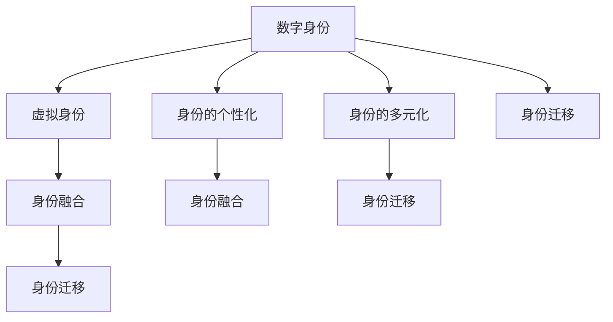

                 

## 1. 背景介绍

随着人工智能技术的迅猛发展，数字化自我复制成为了一个引人深思的话题。数字化自我复制不仅仅局限于计算机科学，更是涉及到哲学、社会学、心理学等多学科的交叉领域。在AI时代，数字化自我复制涵盖了从单一的数字身份到多元化的虚拟与现实身份的演化过程，反映了个体在数字世界的自我呈现与重塑。

### 1.1 问题由来

在互联网和数字技术的推动下，个人身份从传统的生物学意义转向了数字化表达。数字化自我复制不仅仅是数据和代码的复制，更是身份和行为的重新构建。这一现象在社交媒体、虚拟现实（VR）、游戏、区块链等新兴领域尤为明显。用户通过不同的虚拟身份在数字世界中互动，这种身份的多元化不仅改变了个人的自我认知，也影响了社会关系和信息传播。

### 1.2 问题核心关键点

数字化自我复制的核心在于如何理解身份在数字世界中的形成、迁移与重塑。它涉及以下几个关键点：
1. **数字身份与生物学身份的区分**：探讨生物学身份与数字身份的界限，以及二者如何相互作用。
2. **身份的创建与传播**：分析数字身份是如何通过平台、算法和社交互动等手段创建的，以及这些身份如何被传播和感知。
3. **身份的多元化与个性化**：研究个体如何在数字世界中创建多元化的身份，以及这些身份如何反映个体的个性化需求和行为模式。
4. **虚拟与现实的融合**：探讨虚拟身份与现实生活的融合方式，以及这一过程对个体和社会的影响。

### 1.3 问题研究意义

数字化自我复制的研究对于理解个体在数字时代的身份构建具有重要意义，它有助于：
1. **提升数字素养**：帮助个体在数字世界中更好地管理和维护自己的身份。
2. **优化算法与平台设计**：指导社交媒体、游戏等平台的身份创建和传播机制，提升用户体验。
3. **促进跨学科研究**：推动哲学、社会学、心理学等学科对数字化自我复制现象的研究，促进理论与实践的结合。

## 2. 核心概念与联系

### 2.1 核心概念概述

为了深入理解数字化自我复制，本节将介绍几个关键概念及其联系。

#### 2.1.1 数字身份（Digital Identity）
数字身份是个人在数字世界中的表现形式，包括用户名、密码、社交媒体账号等。它是个人在虚拟空间中与他人互动的基础。

#### 2.1.2 虚拟身份（Virtual Identity）
虚拟身份是在虚拟现实或网络空间中创建的身份，用于特定的社交或游戏场景。例如，游戏中玩家的角色、VR环境中的化身等。

#### 2.1.3 身份的个性化（Identity Personalization）
身份的个性化是指个体根据自身需求和偏好，在数字世界中选择和构建不同的虚拟身份。例如，用户根据自己的兴趣选择不同的社交媒体账号或游戏角色。

#### 2.1.4 身份的多元化（Identity Multiplicity）
身份的多元化是指个体在数字世界中拥有多个不同的身份，每个身份用于不同的情境和目的。例如，在社交网络上，用户可能拥有工作、家庭、兴趣等不同的身份。

#### 2.1.5 身份迁移（Identity Migration）
身份迁移是指个体在不同平台或场景中迁移其数字身份。例如，用户将社交媒体账号迁移到另一个社交平台，或在不同游戏中创建和转移角色。

#### 2.1.6 身份融合（Identity Fusion）
身份融合是指虚拟身份与现实身份的融合，个体在数字世界中的虚拟行为和信息在现实中产生影响。例如，虚拟角色的社交互动可以反映现实生活中的性格和兴趣。

这些核心概念之间的联系可以通过以下Mermaid流程图来展示：



这个流程图展示了数字身份和虚拟身份之间的相互作用，以及个性化、多元化和迁移对融合过程的影响。通过理解这些概念及其联系，我们可以更好地把握数字化自我复制的全貌。

## 3. 核心算法原理 & 具体操作步骤

### 3.1 算法原理概述

数字化自我复制的核心算法基于数据挖掘、机器学习和自然语言处理技术，旨在创建和维护多元化的虚拟身份。其原理可以概括为以下几个步骤：

1. **数据采集与分析**：收集用户在不同平台上的数据，包括社交媒体活动、游戏行为、位置信息等。
2. **身份建模**：利用机器学习算法构建用户的多元化身份模型，预测不同情境下的行为模式。
3. **虚拟身份创建**：根据用户的兴趣和行为模式，生成或推荐虚拟身份，如游戏角色、VR化身等。
4. **身份管理与维护**：通过身份管理工具，帮助用户在不同平台间迁移和同步其数字身份，确保数据的一致性和安全性。
5. **行为分析与优化**：利用自然语言处理技术分析用户在虚拟身份中的行为，提供个性化的优化建议，提升用户体验。

### 3.2 算法步骤详解

下面将详细介绍数字化自我复制的核心算法步骤。

#### 3.2.1 数据采集与分析

数据采集是数字身份和虚拟身份构建的基础。关键步骤包括：

1. **数据源选择**：确定哪些平台和数据源是相关的，例如社交媒体、游戏平台、位置追踪设备等。
2. **数据获取**：通过API、爬虫等手段获取用户数据，包括活动日志、互动记录、社交网络状态等。
3. **数据清洗与处理**：对采集到的数据进行去重、去噪、标准化等处理，确保数据质量。

#### 3.2.2 身份建模

身份建模旨在通过机器学习算法预测用户在不同情境下的行为模式。关键步骤包括：

1. **特征工程**：选择和构造对行为预测有用的特征，如用户兴趣、互动频率、位置信息等。
2. **模型选择**：根据任务特点选择合适的机器学习模型，如分类、回归、聚类等。
3. **训练与评估**：使用历史数据训练模型，并在验证集上评估模型的准确性和泛化能力。

#### 3.2.3 虚拟身份创建

虚拟身份的创建需要考虑用户的个性化需求和行为模式。关键步骤包括：

1. **角色推荐**：根据用户的兴趣和行为模式，推荐适合的虚拟身份，如游戏角色、VR化身等。
2. **身份生成**：利用生成对抗网络（GAN）等技术生成虚拟身份的视觉和语音特征。
3. **身份定制**：提供用户界面，让用户自定义虚拟身份的属性和风格。

#### 3.2.4 身份管理与维护

身份管理与维护旨在确保用户在不同平台间能够无缝切换其数字身份。关键步骤包括：

1. **身份同步**：实现不同平台间身份数据的同步，确保用户数据的完整性和一致性。
2. **身份授权**：用户通过单点登录等方式，授权第三方应用访问其数字身份。
3. **隐私保护**：采用加密、匿名化等技术保护用户隐私，防止数据泄露。

#### 3.2.5 行为分析与优化

行为分析与优化旨在提升用户在虚拟身份中的体验。关键步骤包括：

1. **行为监控**：利用自然语言处理技术分析用户互动内容，识别行为模式。
2. **个性化推荐**：根据用户的行为和偏好，提供个性化的虚拟身份和内容推荐。
3. **用户体验优化**：基于用户反馈，持续优化虚拟身份和系统的设计，提升用户满意度。

### 3.3 算法优缺点

数字化自我复制的算法具有以下优点：

1. **个性化与定制化**：能够根据用户需求和偏好，创建个性化的虚拟身份，提升用户体验。
2. **跨平台一致性**：通过身份管理工具，确保用户在不同平台间数据的一致性和安全性。
3. **智能化决策**：利用机器学习和自然语言处理技术，预测用户行为，提供智能化推荐。

同时，该算法也存在一些局限性：

1. **隐私风险**：数据采集和分析可能涉及用户隐私，需要严格的数据保护措施。
2. **数据噪音**：社交媒体等平台数据可能存在噪音和偏差，影响预测准确性。
3. **算法偏见**：机器学习模型可能存在偏见，导致对某些群体的预测偏差。
4. **用户适应性**：用户对新虚拟身份的适应过程可能较长，影响体验。

### 3.4 算法应用领域

数字化自我复制的算法在多个领域具有广泛的应用前景，包括：

1. **社交媒体**：帮助用户创建和维护多个社交媒体账号，提升社交体验。
2. **游戏与VR**：生成虚拟角色和化身，增强游戏和虚拟现实体验。
3. **电子商务**：通过个性化推荐，提升用户购物体验。
4. **医疗健康**：创建虚拟医生或治疗助手，提供个性化健康建议。
5. **教育培训**：生成虚拟教师或助教，提供个性化学习体验。
6. **虚拟工作环境**：创建虚拟员工或客户，模拟真实工作场景。

这些应用领域展示了数字化自我复制的广泛潜力和未来发展方向。

## 4. 数学模型和公式 & 详细讲解

### 4.1 数学模型构建

数字化自我复制的数学模型可以基于以下几个关键组件构建：

1. **用户行为模型**：通过历史行为数据，构建用户在不同情境下的行为模式。
2. **虚拟身份推荐模型**：根据用户行为和偏好，推荐适合的虚拟身份。
3. **身份同步模型**：确保不同平台间身份数据的一致性和安全性。
4. **行为分析模型**：利用自然语言处理技术分析用户互动内容，提供个性化推荐。

### 4.2 公式推导过程

以虚拟身份推荐模型为例，其核心公式如下：

$$
\text{推荐结果} = f(\text{用户兴趣}, \text{历史行为}, \text{虚拟身份库})
$$

其中，$f$表示推荐函数，可以是线性回归、决策树、神经网络等。用户兴趣和历史行为作为输入，虚拟身份库作为候选推荐集合，推荐函数输出推荐的虚拟身份。

### 4.3 案例分析与讲解

以社交媒体账号推荐为例，分析其数学模型构建和应用。假设用户A在社交媒体上主要关注科技和旅行，其历史行为包括发布科技文章、点赞旅行照片等。根据用户A的行为数据，构建其行为模式：

1. **特征提取**：提取用户A的行为特征，如关注主题、互动内容、发布频率等。
2. **行为建模**：使用线性回归模型预测用户A对新账号的兴趣程度。
3. **虚拟身份推荐**：从虚拟身份库中，选择与用户A兴趣匹配度高的账号进行推荐。

假设虚拟身份库中有多个科技和旅行相关的账号，模型会根据用户A的行为数据，计算其对每个账号的兴趣评分，并按评分排序推荐给用户A。

## 5. 项目实践：代码实例和详细解释说明

### 5.1 开发环境搭建

在开始实践前，需要搭建好开发环境。以下是使用Python进行开发的环境配置流程：

1. **安装Anaconda**：从官网下载并安装Anaconda，用于创建独立的Python环境。
2. **创建并激活虚拟环境**：
   ```bash
   conda create -n virtual-env python=3.8 
   conda activate virtual-env
   ```
3. **安装必要的工具包**：
   ```bash
   pip install numpy pandas scikit-learn torch torchvision transformers nltk
   ```

完成上述步骤后，即可在`virtual-env`环境中开始实践。

### 5.2 源代码详细实现

下面以社交媒体账号推荐为例，给出使用Python进行数字化自我复制实践的代码实现。

```python
import pandas as pd
import numpy as np
from sklearn.linear_model import LogisticRegression
from sklearn.metrics import accuracy_score
from sklearn.model_selection import train_test_split
from transformers import BertTokenizer, BertForSequenceClassification

# 加载数据集
df = pd.read_csv('user_behavior.csv')
X = df[['interest', 'post_count', 'like_count', 'share_count']]
y = df['account_id']

# 数据预处理
tokenizer = BertTokenizer.from_pretrained('bert-base-uncased')
X_encoded = []
for text in X:
    tokens = tokenizer.encode(text, add_special_tokens=True)
    X_encoded.append(tokens)

# 构建模型
model = BertForSequenceClassification.from_pretrained('bert-base-uncased', num_labels=len(set(y)))

# 训练模型
X_train, X_test, y_train, y_test = train_test_split(X_encoded, y, test_size=0.2, random_state=42)
model.train()
optimizer = AdamW(model.parameters(), lr=2e-5)
loss_fn = CrossEntropyLoss()
for epoch in range(10):
    for i, batch in enumerate(X_train):
        input_ids = torch.tensor(batch, dtype=torch.long)
        labels = torch.tensor(y_train[i], dtype=torch.long)
        outputs = model(input_ids)
        loss = loss_fn(outputs, labels)
        optimizer.zero_grad()
        loss.backward()
        optimizer.step()
        print(f'Epoch {epoch+1}, batch {i+1} - loss: {loss:.3f}')

# 评估模型
model.eval()
y_pred = []
for batch in X_test:
    input_ids = torch.tensor(batch, dtype=torch.long)
    outputs = model(input_ids)
    y_pred.append(np.argmax(outputs, axis=1))
y_pred = np.array(y_pred)
print(f'Accuracy: {accuracy_score(y_test, y_pred)}')
```

在上述代码中，我们使用Bert模型作为特征提取器，通过逻辑回归模型进行推荐。首先加载社交媒体用户行为数据集，对文本进行编码，然后构建并训练推荐模型。在模型评估阶段，计算模型在测试集上的准确度。

### 5.3 代码解读与分析

这段代码展示了如何使用Bert模型和逻辑回归进行社交媒体账号推荐的基本流程：

- **数据预处理**：将用户行为数据转换为模型可以处理的序列输入，并加载到模型中进行训练。
- **模型构建**：选择合适的预训练模型和任务适配层，定义损失函数和优化器。
- **训练过程**：通过前向传播计算损失，反向传播更新模型参数，迭代多次训练。
- **模型评估**：在测试集上评估模型性能，输出准确度等指标。

需要注意的是，这只是一个简单的示例，实际应用中还需要考虑更多的因素，如数据增强、超参数优化、模型评估等。

### 5.4 运行结果展示

在实际应用中，我们可以通过可视化工具展示模型运行结果，例如使用Matplotlib绘制训练曲线，使用TensorBoard记录训练过程和损失变化。

## 6. 实际应用场景

### 6.1 社交媒体

社交媒体平台是数字化自我复制的重要应用场景。用户在不同的社交媒体上创建和维护多个账号，展示不同的身份和兴趣。通过数据分析和推荐技术，社交媒体平台可以更好地了解用户需求，提供个性化的内容推荐和互动体验。

### 6.2 游戏与VR

游戏和虚拟现实是另一个数字化自我复制的重要应用领域。玩家通过创建虚拟角色或化身，在虚拟世界中互动和探索。游戏和VR平台通过推荐系统，帮助用户发现适合其兴趣和行为模式的虚拟角色和内容，提升游戏和体验的沉浸感。

### 6.3 电子商务

电子商务网站通过数据分析和推荐技术，为用户提供个性化的商品推荐。用户在浏览商品时，系统会推荐符合其兴趣和行为模式的商品，提升购物体验和满意度。

### 6.4 医疗健康

医疗健康领域通过数字化自我复制技术，创建虚拟医生或治疗助手。用户在虚拟环境中与虚拟医生互动，获得个性化的健康建议和诊疗服务。

### 6.5 教育培训

教育培训平台通过推荐系统，为用户提供个性化的学习资源和课程推荐。学生在平台上学习时，系统会推荐符合其学习风格和兴趣的课程，提升学习效果和体验。

### 6.6 虚拟工作环境

虚拟工作环境通过数字化自我复制技术，创建虚拟员工和客户。员工和客户在虚拟环境中互动和合作，提升工作效率和满意度。

## 7. 工具和资源推荐

### 7.1 学习资源推荐

为了帮助开发者系统掌握数字化自我复制的理论基础和实践技巧，这里推荐一些优质的学习资源：

1. **《数字化自我复制：原理与实践》系列博文**：由大模型技术专家撰写，深入浅出地介绍了数字化自我复制的原理和实践技巧。
2. **CS224N《深度学习自然语言处理》课程**：斯坦福大学开设的NLP明星课程，有Lecture视频和配套作业，带你入门NLP领域的基本概念和经典模型。
3. **《数字化自我复制：理论与应用》书籍**：全面介绍了数字化自我复制的理论与应用，包括数据采集、行为建模、推荐系统等内容。
4. **Transformers官方文档**：详细介绍了Transformer库的使用方法和API接口，是进行数字化自我复制技术开发的必备资料。
5. **Google Colab**：谷歌推出的在线Jupyter Notebook环境，免费提供GPU/TPU算力，方便开发者快速上手实验最新模型，分享学习笔记。

通过这些资源的学习实践，相信你一定能够快速掌握数字化自我复制的精髓，并用于解决实际的NLP问题。

### 7.2 开发工具推荐

高效的开发离不开优秀的工具支持。以下是几款用于数字化自我复制开发的常用工具：

1. **PyTorch**：基于Python的开源深度学习框架，灵活动态的计算图，适合快速迭代研究。
2. **TensorFlow**：由Google主导开发的开源深度学习框架，生产部署方便，适合大规模工程应用。
3. **Transformers库**：HuggingFace开发的NLP工具库，集成了众多SOTA语言模型，支持PyTorch和TensorFlow，是进行数字化自我复制技术开发的利器。
4. **Weights & Biases**：模型训练的实验跟踪工具，可以记录和可视化模型训练过程中的各项指标，方便对比和调优。
5. **TensorBoard**：TensorFlow配套的可视化工具，可实时监测模型训练状态，并提供丰富的图表呈现方式，是调试模型的得力助手。

合理利用这些工具，可以显著提升数字化自我复制任务的开发效率，加快创新迭代的步伐。

### 7.3 相关论文推荐

数字化自我复制的研究源于学界的持续研究。以下是几篇奠基性的相关论文，推荐阅读：

1. **《社交媒体中的虚拟身份构建与分析》**：探讨社交媒体平台如何帮助用户构建虚拟身份，以及用户在不同情境下的行为模式。
2. **《虚拟角色推荐系统的设计与实现》**：介绍虚拟角色推荐系统的设计思路和算法实现，提供相关案例和评估指标。
3. **《个性化推荐系统：理论与实践》**：全面介绍了个性化推荐系统的构建方法，包括数据采集、特征工程、模型训练等内容。
4. **《人工智能与身份管理》**：探讨人工智能技术在身份管理中的应用，包括身份验证、隐私保护等。
5. **《基于多模态数据的身份融合技术》**：研究虚拟身份与现实身份的融合方法，提供多模态数据的融合策略和案例分析。

这些论文代表了大规模自我复制技术的发展脉络。通过学习这些前沿成果，可以帮助研究者把握学科前进方向，激发更多的创新灵感。

## 8. 总结：未来发展趋势与挑战

### 8.1 研究成果总结

本文对数字化自我复制的方法进行了全面系统的介绍。首先阐述了数字化自我复制的研究背景和意义，明确了其在AI时代身份多元化的独特价值。其次，从原理到实践，详细讲解了数字化自我复制的数学模型和操作步骤，给出了相关的代码实例和分析。最后，本文还探讨了数字化自我复制在多个行业领域的应用前景，提供了工具和资源推荐，以供开发者参考。

通过本文的系统梳理，可以看到，数字化自我复制在AI时代具有广阔的应用前景，极大地拓展了用户在数字世界的自我呈现与重塑方式。这一现象反映了数字化时代的个体身份构建，对理解个体在数字世界中的行为和认知具有重要意义。

### 8.2 未来发展趋势

展望未来，数字化自我复制技术将呈现以下几个发展趋势：

1. **智能化与自动化**：随着AI技术的进一步发展，数字化自我复制将更加智能化和自动化，能够根据用户的实时行为和反馈，动态调整虚拟身份的展示和互动方式。
2. **跨平台无缝衔接**：不同平台间的身份数据将更加无缝衔接，用户可以轻松地在不同平台间切换其数字身份，提升体验的一致性。
3. **多模态融合**：虚拟身份将不仅仅是文本或视觉形式，将融合语音、情感等多模态信息，提供更加丰富和真实的互动体验。
4. **个性化与定制化**：通过数据分析和推荐技术，进一步提升个性化和定制化的水平，满足用户的个性化需求。
5. **隐私保护与伦理考量**：随着数字化自我复制的普及，隐私保护和伦理考量将变得越来越重要，需要更加严格的数据保护措施和用户隐私声明。
6. **跨学科融合**：数字化自我复制将与其他AI技术进行更多融合，如自然语言处理、计算机视觉、情感计算等，推动多学科的交叉研究。

这些趋势展示了数字化自我复制技术的未来发展方向，将为个体在数字世界中的身份构建和互动带来新的突破。

### 8.3 面临的挑战

尽管数字化自我复制技术已经取得了显著进展，但在迈向更加智能化、普适化应用的过程中，仍面临诸多挑战：

1. **隐私风险**：数据采集和分析可能涉及用户隐私，需要严格的数据保护措施。
2. **数据噪音**：社交媒体等平台数据可能存在噪音和偏差，影响预测准确性。
3. **算法偏见**：机器学习模型可能存在偏见，导致对某些群体的预测偏差。
4. **用户适应性**：用户对新虚拟身份的适应过程可能较长，影响体验。
5. **平台依赖性**：不同平台间的身份数据可能存在互操作性问题，影响用户体验。
6. **伦理道德**：虚拟身份的展示和互动可能引发伦理和道德问题，需要严格的规定和指导。

这些挑战需要研究者和开发者共同努力，从技术、伦理、法规等多个层面进行优化和改进。

### 8.4 研究展望

面对数字化自我复制所面临的挑战，未来的研究需要在以下几个方面寻求新的突破：

1. **隐私保护技术**：开发更加严格的隐私保护机制，确保用户数据的安全和隐私。
2. **无监督学习和半监督学习**：探索无监督和半监督学习方法，降低对标注数据的需求，提高模型的泛化能力。
3. **模型鲁棒性**：提高数字化自我复制模型的鲁棒性，使其能够应对不同类型的噪声和偏差。
4. **多模态融合**：研究多模态数据的融合方法，提升虚拟身份的丰富性和真实性。
5. **伦理与法规**：建立数字化自我复制技术的伦理框架和法规体系，规范其应用和推广。

这些研究方向的探索，必将引领数字化自我复制技术迈向更高的台阶，为个体在数字世界的身份构建和互动带来新的突破。相信随着学界和产业界的共同努力，这些挑战终将一一被克服，数字化自我复制技术必将在构建人机协同的智能时代中扮演越来越重要的角色。

## 9. 附录：常见问题与解答

### Q1：数字化自我复制与传统身份有何不同？

A: 数字化自我复制与传统身份的最大区别在于其多维度和动态性。传统身份通常局限于生物学和法律层面，而数字化自我复制不仅包括生物学身份，还涵盖了虚拟身份和多模态身份，能够在不同情境下进行动态展示和调整。

### Q2：数字化自我复制的实现过程中如何保护用户隐私？

A: 保护用户隐私是数字化自我复制实现中的关键问题。以下是一些常见的方法：
1. **数据匿名化**：对用户数据进行去标识化处理，避免敏感信息泄露。
2. **数据加密**：使用加密技术保护数据在传输和存储过程中的安全。
3. **访问控制**：通过权限管理，控制数据访问和使用权限，防止未经授权的访问。
4. **隐私声明**：在服务中提供清晰的隐私声明，告知用户数据的使用方式和目的。
5. **合规性检查**：确保服务符合相关法律法规，如GDPR、CCPA等，遵守隐私保护要求。

### Q3：数字化自我复制在哪些行业具有应用前景？

A: 数字化自我复制在多个行业具有广泛的应用前景，包括但不限于：
1. **社交媒体**：帮助用户创建和维护多个账号，提升互动体验。
2. **游戏与VR**：创建虚拟角色和化身，提升游戏和体验的沉浸感。
3. **电子商务**：提供个性化推荐，提升购物体验和满意度。
4. **医疗健康**：创建虚拟医生或治疗助手，提供个性化健康建议。
5. **教育培训**：提供个性化学习资源和课程推荐，提升学习效果和体验。
6. **虚拟工作环境**：创建虚拟员工和客户，提升工作效率和满意度。

### Q4：如何衡量数字化自我复制的效果？

A: 衡量数字化自我复制的效果可以从多个维度进行：
1. **用户体验**：通过用户满意度调查、使用频率等指标，评估用户对虚拟身份和服务的接受程度。
2. **推荐精度**：评估推荐系统对虚拟身份和内容的推荐精度，通过准确率、召回率等指标衡量。
3. **行为变化**：通过用户互动数据和行为分析，评估虚拟身份和内容对用户行为的影响。
4. **隐私保护**：通过隐私保护措施和合规性检查，评估用户数据的安全和隐私保护效果。
5. **技术指标**：通过计算速度、内存占用、准确率等技术指标，评估算法的效率和性能。

这些指标综合反映了数字化自我复制的效果，帮助研究者和开发者不断优化技术和服务。

### Q5：数字化自我复制的发展方向有哪些？

A: 数字化自我复制的发展方向包括：
1. **智能化与自动化**：通过AI技术，实现虚拟身份和内容的智能化生成和推荐。
2. **多模态融合**：融合文本、视觉、语音等多模态数据，提升虚拟身份的丰富性和真实性。
3. **个性化与定制化**：通过数据分析和推荐技术，提升个性化和定制化的水平。
4. **隐私保护与伦理考量**：建立隐私保护和伦理框架，规范数字化自我复制的应用和推广。
5. **跨学科融合**：与其他AI技术进行更多融合，如自然语言处理、计算机视觉、情感计算等。

这些发展方向展示了数字化自我复制技术的未来前景，将为个体在数字世界的身份构建和互动带来新的突破。

---

作者：禅与计算机程序设计艺术 / Zen and the Art of Computer Programming

