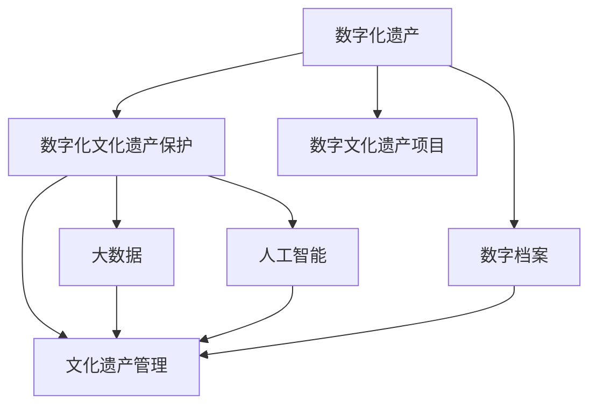

                 

# 数字化遗产保护创业：文化传承的科技支持

> 关键词：数字化遗产保护,文化传承,科技支持,人工智能,大数据,文化遗产管理,数字档案,数字文化遗产

## 1. 背景介绍

### 1.1 问题由来
随着数字技术的发展，数字化遗产保护成为了文化遗产保护的新兴领域。数字化遗产泛指一切以数字形式保存的文化遗产，包括数字档案、数字文本、数字影像、数字音频等。相较于传统物理形式的遗产保护，数字化遗产具有不可破坏、易于传播、易于存储等优势。数字化遗产保护能够为文化遗产的保存、传播和研究提供新的手段和途径。

近年来，随着博物馆、档案馆等文化机构数字化建设的加速推进，以及数字化文化遗产项目（如Google Arts & Culture、Coursera等）的涌现，数字化遗产保护的重要性日益凸显。然而，数字化遗产保护也面临着诸多挑战：如何有效管理海量数字资源、如何保证数字档案的长期保存和可访问性、如何实现对数字化文化遗产的深度挖掘和利用等。

## 2. 核心概念与联系

### 2.1 核心概念概述

为更好地理解数字化遗产保护，本节将介绍几个密切相关的核心概念：

- 数字化遗产（Digital Heritage）：以数字形式保存和管理的文化遗产，包括数字档案、数字文本、数字影像、数字音频等。
- 数字化文化遗产保护（Digital Heritage Conservation）：通过数字化技术手段，对文化遗产进行长期保存、传播和研究的过程。
- 大数据（Big Data）：海量、多源、多维度的数据集合，用于支撑数据的分析、挖掘和可视化。
- 人工智能（AI）：通过算法模拟人类智能，实现语音识别、图像识别、自然语言处理等任务。
- 文化遗产管理（Heritage Management）：对文化遗产资源进行系统化、科学化、专业化管理的活动，包括资源调查、规划设计、维护修复等。
- 数字档案（Digital Archive）：以数字形式存储、管理和利用的档案集合，包括传统档案的数字化和电子档案的保存。
- 数字文化遗产项目（Digital Heritage Projects）：由政府、企业或非营利组织主导，利用数字化技术进行文化遗产保护和传播的项目。

这些核心概念之间的逻辑关系可以通过以下Mermaid流程图来展示：



这个流程图展示了大数字化遗产保护的核心概念及其之间的关系：

1. 数字化遗产保护是数字化文化遗产的核心任务，旨在通过数字技术实现文化遗产的长期保存和深度挖掘。
2. 大数据和人工智能是数字化遗产保护的技术手段，为数字档案的长期保存和深度挖掘提供了支持。
3. 文化遗产管理是大数字化遗产保护的应用领域，旨在通过数字化技术手段，对文化遗产资源进行科学化、专业化管理。
4. 数字档案是数字化遗产的具体表现形式，是数字化文化遗产保护的对象和载体。
5. 数字文化遗产项目是数字化遗产保护的实际应用案例，通过项目推动数字化遗产保护的技术和应用落地。

这些概念共同构成了数字化遗产保护的技术框架，为其提供了技术支持和应用场景。

## 3. 核心算法原理 & 具体操作步骤
### 3.1 算法原理概述

数字化遗产保护的核心算法原理主要涉及以下几个方面：

1. **数据采集与预处理**：通过对原始文化遗产数据进行采集、清洗、标注等预处理操作，将其转化为适合后续分析和挖掘的格式。
2. **大数据分析**：利用大数据技术，对采集到的数据进行聚类、分类、关联分析等操作，挖掘数据中的潜在知识和信息。
3. **人工智能技术**：通过图像识别、语音识别、自然语言处理等人工智能技术，对数字化遗产进行标注、分类、检索等操作。
4. **数字化管理**：利用数字化手段，对数字化遗产进行分类、存储、管理、传播等操作，实现文化遗产的长期保存和可访问性。

### 3.2 算法步骤详解

1. **数据采集与预处理**：
   - 采集原始文化遗产数据，包括文字、影像、音频等。
   - 对数据进行清洗、去重、标注等预处理操作。
   - 将处理后的数据转化为适合后续分析和挖掘的格式，如JSON、CSV等。

2. **大数据分析**：
   - 利用大数据技术，对处理后的数据进行聚类、分类、关联分析等操作。
   - 使用Hadoop、Spark等分布式计算框架，对大数据进行高效处理。
   - 使用机器学习算法，如K-means、SVM等，进行数据分类和模式识别。

3. **人工智能技术**：
   - 利用图像识别技术，对数字化遗产中的影像数据进行标注和分类。
   - 利用语音识别技术，对数字化遗产中的音频数据进行转录和分类。
   - 利用自然语言处理技术，对数字化遗产中的文本数据进行标注、分类和检索。

4. **数字化管理**：
   - 利用数据库和存储技术，对数字化遗产进行分类、存储和管理。
   - 开发数字化文化遗产管理系统，实现文化遗产资源的检索、展示和传播。
   - 使用云计算技术，确保数字化遗产的长期保存和可访问性。

### 3.3 算法优缺点

数字化遗产保护的算法具有以下优点：

1. **高效性**：大数据和人工智能技术能够高效处理海量数据，快速发现其中的潜在知识和信息。
2. **准确性**：利用机器学习算法，可以对数据进行精确分类和标注，提高数字化遗产的准确性。
3. **可扩展性**：大数据和人工智能技术具有很强的可扩展性，能够应对不断增长的数据需求。
4. **灵活性**：算法能够根据具体应用场景进行调整和优化，实现多种任务处理。

然而，算法也存在一些缺点：

1. **复杂性**：算法涉及数据采集、预处理、分析、管理等多个环节，流程复杂。
2. **数据依赖**：算法的性能高度依赖于数据质量，需要高质量的标注数据和清洗操作。
3. **资源消耗**：算法需要大量的计算资源和存储空间，对硬件设备要求较高。
4. **模型依赖**：算法性能取决于所使用的模型和算法，模型的选择和调参需要经验丰富的专家。

### 3.4 算法应用领域

数字化遗产保护的算法主要应用于以下领域：

1. **数字化档案管理**：通过数字化手段，对传统档案进行数字化转换和存储，实现长期保存和可访问性。
2. **数字化图书馆**：对纸质图书进行数字化转换，通过大数据和人工智能技术，实现图书检索、分类、推荐等操作。
3. **数字化博物馆**：利用数字化技术，对博物馆藏品进行数字化展示和传播，实现文化遗产的普及和教育。
4. **文化遗产保护**：通过大数据和人工智能技术，对文化遗产资源进行分类、标注、检索等操作，实现文化遗产的深度挖掘和利用。
5. **数字化文化研究**：利用大数据和人工智能技术，对文化遗产数据进行分析和挖掘，揭示其中的文化规律和历史背景。

## 4. 数学模型和公式 & 详细讲解 & 举例说明
### 4.1 数学模型构建

数字化遗产保护的核心数学模型主要涉及以下几个方面：

1. **数据采集与预处理模型**：
   - 数据清洗模型：用于去除数据中的噪声和错误，如去除重复记录、修正错误数据等。
   - 数据标注模型：用于对数据进行标注和分类，如使用LSTM进行文本分类。
   - 数据转换模型：用于将数据转化为适合后续分析的格式，如使用ETL工具进行数据转换。

2. **大数据分析模型**：
   - 数据聚类模型：用于对数据进行聚类分析，如使用K-means进行用户聚类。
   - 数据分类模型：用于对数据进行分类，如使用SVM进行文本分类。
   - 数据关联模型：用于对数据进行关联分析，如使用关联规则挖掘算法进行用户行为分析。

3. **人工智能技术模型**：
   - 图像识别模型：用于对影像数据进行识别和分类，如使用CNN进行图像分类。
   - 语音识别模型：用于对音频数据进行转录和分类，如使用RNN进行语音识别。
   - 自然语言处理模型：用于对文本数据进行标注、分类和检索，如使用BERT进行文本分类。

4. **数字化管理模型**：
   - 数据库管理系统：用于对数据进行分类、存储和管理，如使用MySQL进行数据库管理。
   - 数字化展示系统：用于对数据进行展示和传播，如使用Web前端技术进行数字化展示。
   - 云计算平台：用于确保数据的长期保存和可访问性，如使用AWS进行云存储管理。

### 4.2 公式推导过程

以下我们以文本分类为例，推导文本分类模型的公式及其梯度计算。

假设文本分类任务有 $n$ 个类别，每个文本有 $m$ 个特征。则文本分类模型的目标是最小化损失函数：

$$
L(w,b) = \frac{1}{N} \sum_{i=1}^N \sum_{j=1}^m (y_{ij} - \hat{y}_{ij})^2
$$

其中 $y_{ij}$ 表示第 $i$ 个文本在第 $j$ 个特征上的真实标签，$\hat{y}_{ij} = sigmoid(w^T x_i + b)$ 表示模型对第 $i$ 个文本在第 $j$ 个特征上的预测标签。$w$ 和 $b$ 分别是模型的权重和偏置。

梯度计算公式为：

$$
\frac{\partial L}{\partial w} = \frac{2}{N} \sum_{i=1}^N \sum_{j=1}^m \hat{y}_{ij}(1 - \hat{y}_{ij})x_{ij}
$$

$$
\frac{\partial L}{\partial b} = \frac{2}{N} \sum_{i=1}^N \sum_{j=1}^m (\hat{y}_{ij} - y_{ij})
$$

通过计算梯度，使用梯度下降等优化算法，不断调整模型参数 $w$ 和 $b$，使得损失函数最小化，从而实现文本分类的目标。

### 4.3 案例分析与讲解

下面以Google Arts & Culture项目为例，分析数字化遗产保护在实际中的应用。

Google Arts & Culture是谷歌推出的一个数字化文化遗产项目，旨在将全球各地的博物馆、美术馆等文化机构的藏品数字化，并通过网络平台进行展示和传播。该项目涉及数据的采集、清洗、标注、分析等多个环节，利用了大数据和人工智能技术。

1. **数据采集**：谷歌通过摄像头、扫描仪等设备，对全球各地的博物馆藏品进行数字化扫描和拍摄。
2. **数据清洗**：对采集到的数字影像数据进行去噪、去重、校正等操作，保证数据的准确性和一致性。
3. **数据标注**：对数字影像数据进行标注，如识别出图像中的人物、物品等。
4. **数据分析**：利用大数据技术，对标注后的数据进行聚类、分类、关联分析等操作，挖掘数据中的潜在知识和信息。
5. **数字化展示**：将处理后的数据上传到Google Arts & Culture平台，通过Web前端技术进行展示和传播。

该项目利用了大数据和人工智能技术，实现了文化遗产的数字化保护和传播。通过该项目的实践，谷歌积累了大量的数字化文化遗产数据，推动了数字化遗产保护的发展。

## 5. 项目实践：代码实例和详细解释说明
### 5.1 开发环境搭建

在进行数字化遗产保护项目开发前，我们需要准备好开发环境。以下是使用Python进行PyTorch开发的环境配置流程：

1. 安装Anaconda：从官网下载并安装Anaconda，用于创建独立的Python环境。

2. 创建并激活虚拟环境：
```bash
conda create -n pytorch-env python=3.8 
conda activate pytorch-env
```

3. 安装PyTorch：根据CUDA版本，从官网获取对应的安装命令。例如：
```bash
conda install pytorch torchvision torchaudio cudatoolkit=11.1 -c pytorch -c conda-forge
```

4. 安装各类工具包：
```bash
pip install numpy pandas scikit-learn matplotlib tqdm jupyter notebook ipython
```

完成上述步骤后，即可在`pytorch-env`环境中开始数字化遗产保护项目的开发。

### 5.2 源代码详细实现

下面我们以数字化遗产保护中的文本分类任务为例，给出使用Transformers库对BERT模型进行文本分类的PyTorch代码实现。

首先，定义文本分类任务的数据处理函数：

```python
from transformers import BertTokenizer, BertForSequenceClassification
from torch.utils.data import Dataset, DataLoader
import torch

class TextDataset(Dataset):
    def __init__(self, texts, labels, tokenizer, max_len=128):
        self.texts = texts
        self.labels = labels
        self.tokenizer = tokenizer
        self.max_len = max_len
        
    def __len__(self):
        return len(self.texts)
    
    def __getitem__(self, item):
        text = self.texts[item]
        label = self.labels[item]
        
        encoding = self.tokenizer(text, return_tensors='pt', max_length=self.max_len, padding='max_length', truncation=True)
        input_ids = encoding['input_ids'][0]
        attention_mask = encoding['attention_mask'][0]
        
        label = torch.tensor(label, dtype=torch.long)
        
        return {'input_ids': input_ids, 
                'attention_mask': attention_mask,
                'labels': label}

tokenizer = BertTokenizer.from_pretrained('bert-base-cased')

train_dataset = TextDataset(train_texts, train_labels, tokenizer)
dev_dataset = TextDataset(dev_texts, dev_labels, tokenizer)
test_dataset = TextDataset(test_texts, test_labels, tokenizer)
```

然后，定义模型和优化器：

```python
from transformers import AdamW

model = BertForSequenceClassification.from_pretrained('bert-base-cased', num_labels=2)

optimizer = AdamW(model.parameters(), lr=2e-5)
```

接着，定义训练和评估函数：

```python
from tqdm import tqdm
from sklearn.metrics import classification_report

device = torch.device('cuda') if torch.cuda.is_available() else torch.device('cpu')
model.to(device)

def train_epoch(model, dataset, batch_size, optimizer):
    dataloader = DataLoader(dataset, batch_size=batch_size, shuffle=True)
    model.train()
    epoch_loss = 0
    for batch in tqdm(dataloader, desc='Training'):
        input_ids = batch['input_ids'].to(device)
        attention_mask = batch['attention_mask'].to(device)
        labels = batch['labels'].to(device)
        model.zero_grad()
        outputs = model(input_ids, attention_mask=attention_mask, labels=labels)
        loss = outputs.loss
        epoch_loss += loss.item()
        loss.backward()
        optimizer.step()
    return epoch_loss / len(dataloader)

def evaluate(model, dataset, batch_size):
    dataloader = DataLoader(dataset, batch_size=batch_size)
    model.eval()
    preds, labels = [], []
    with torch.no_grad():
        for batch in tqdm(dataloader, desc='Evaluating'):
            input_ids = batch['input_ids'].to(device)
            attention_mask = batch['attention_mask'].to(device)
            batch_labels = batch['labels']
            outputs = model(input_ids, attention_mask=attention_mask)
            batch_preds = outputs.logits.argmax(dim=2).to('cpu').tolist()
            batch_labels = batch_labels.to('cpu').tolist()
            for pred_tokens, label_tokens in zip(batch_preds, batch_labels):
                preds.append(pred_tokens[:len(label_tokens)])
                labels.append(label_tokens)
                
    print(classification_report(labels, preds))
```

最后，启动训练流程并在测试集上评估：

```python
epochs = 5
batch_size = 16

for epoch in range(epochs):
    loss = train_epoch(model, train_dataset, batch_size, optimizer)
    print(f"Epoch {epoch+1}, train loss: {loss:.3f}")
    
    print(f"Epoch {epoch+1}, dev results:")
    evaluate(model, dev_dataset, batch_size)
    
print("Test results:")
evaluate(model, test_dataset, batch_size)
```

以上就是使用PyTorch对BERT进行文本分类任务的完整代码实现。可以看到，得益于Transformers库的强大封装，我们可以用相对简洁的代码完成BERT模型的加载和文本分类任务的微调。

### 5.3 代码解读与分析

让我们再详细解读一下关键代码的实现细节：

**TextDataset类**：
- `__init__`方法：初始化文本、标签、分词器等关键组件。
- `__len__`方法：返回数据集的样本数量。
- `__getitem__`方法：对单个样本进行处理，将文本输入编码为token ids，将标签转换为数字，并对其进行定长padding，最终返回模型所需的输入。

**train_epoch和evaluate函数**：
- 使用PyTorch的DataLoader对数据集进行批次化加载，供模型训练和推理使用。
- 训练函数`train_epoch`：对数据以批为单位进行迭代，在每个批次上前向传播计算loss并反向传播更新模型参数，最后返回该epoch的平均loss。
- 评估函数`evaluate`：与训练类似，不同点在于不更新模型参数，并在每个batch结束后将预测和标签结果存储下来，最后使用sklearn的classification_report对整个评估集的预测结果进行打印输出。

**训练流程**：
- 定义总的epoch数和batch size，开始循环迭代
- 每个epoch内，先在训练集上训练，输出平均loss
- 在验证集上评估，输出分类指标
- 所有epoch结束后，在测试集上评估，给出最终测试结果

可以看到，PyTorch配合Transformers库使得BERT微调的代码实现变得简洁高效。开发者可以将更多精力放在数据处理、模型改进等高层逻辑上，而不必过多关注底层的实现细节。

当然，工业级的系统实现还需考虑更多因素，如模型的保存和部署、超参数的自动搜索、更灵活的任务适配层等。但核心的微调范式基本与此类似。

## 6. 实际应用场景
### 6.1 智能档案馆

智能档案馆是数字化遗产保护的重要应用场景之一。传统的档案馆管理方式繁琐耗时，且容易出错，难以实现高效的档案管理。数字化遗产保护可以为档案馆管理带来新的手段和途径。

具体而言，可以利用数字化遗产保护技术，对档案馆的纸质档案进行数字化扫描和存储。通过大数据和人工智能技术，对数字化档案进行分类、标注、检索等操作，实现档案的深度挖掘和利用。例如，可以将档案按照主题进行分类，建立索引库，方便用户检索。通过自然语言处理技术，对档案内容进行自动摘要和关键词提取，提高档案的可读性和可访问性。

### 6.2 数字化博物馆

数字化博物馆是另一个数字化遗产保护的重要应用场景。传统的博物馆展览方式需要大量人力物力，且展览效果有限。数字化遗产保护可以为博物馆展览带来新的方式和途径。

具体而言，可以利用数字化遗产保护技术，对博物馆的藏品进行数字化扫描和存储。通过大数据和人工智能技术，对数字化藏品进行分类、标注、检索等操作，实现藏品的深度挖掘和利用。例如，可以将藏品按照类别进行分类，建立索引库，方便用户检索。通过图像识别技术，对藏品进行图像分类和标注，提高藏品的可读性和可访问性。通过自然语言处理技术，对藏品的描述信息进行自动摘要和关键词提取，提高藏品的展示效果。

### 6.3 数字化图书馆

数字化图书馆是数字化遗产保护的重要应用场景之一。传统的图书馆管理方式繁琐耗时，且容易出错，难以实现高效的图书馆管理。数字化遗产保护可以为图书馆管理带来新的手段和途径。

具体而言，可以利用数字化遗产保护技术，对图书馆的纸质图书进行数字化扫描和存储。通过大数据和人工智能技术，对数字化图书进行分类、标注、检索等操作，实现图书的深度挖掘和利用。例如，可以将图书按照类别进行分类，建立索引库，方便用户检索。通过自然语言处理技术，对图书内容进行自动摘要和关键词提取，提高图书的可读性和可访问性。

### 6.4 未来应用展望

随着数字化遗产保护技术的不断发展，未来在多个领域将有更广泛的应用：

1. **智能教育**：利用数字化遗产保护技术，对教育资源进行数字化保存和传播，实现教育资源的深度挖掘和利用。例如，可以将教材、习题、论文等数字化资源进行分类、标注、检索等操作，方便教师和学生检索和使用。
2. **智慧医疗**：利用数字化遗产保护技术，对医疗资源进行数字化保存和传播，实现医疗资源的深度挖掘和利用。例如，可以将医疗记录、影像、文献等数字化资源进行分类、标注、检索等操作，方便医生和患者检索和使用。
3. **数字化传媒**：利用数字化遗产保护技术，对媒体资源进行数字化保存和传播，实现媒体资源的深度挖掘和利用。例如，可以将新闻、纪录片、广播等媒体资源进行分类、标注、检索等操作，方便媒体从业者和公众检索和使用。
4. **数字文化创意**：利用数字化遗产保护技术，对文化创意资源进行数字化保存和传播，实现文化创意资源的深度挖掘和利用。例如，可以将电影、音乐、艺术品等数字化资源进行分类、标注、检索等操作，方便艺术家和文化爱好者检索和使用。

## 7. 工具和资源推荐
### 7.1 学习资源推荐

为了帮助开发者系统掌握数字化遗产保护的理论基础和实践技巧，这里推荐一些优质的学习资源：

1. 《数字化遗产保护技术》系列博文：由大遗产保护专家撰写，深入浅出地介绍了数字化遗产保护的理论基础和实践技巧。

2. Coursera《数字文化遗产保护》课程：由斯坦福大学和哈佛大学等名校开设的数字文化遗产保护课程，涵盖数字化遗产保护的基本概念和前沿技术。

3. 《数字化遗产保护》书籍：专注于数字化遗产保护的技术和应用，是数字化遗产保护领域的经典著作。

4. HuggingFace官方文档：Transformer库的官方文档，提供了海量预训练语言模型和完整的微调样例代码，是上手实践的必备资料。

5. CLUE开源项目：中文语言理解测评基准，涵盖大量不同类型的中文NLP数据集，并提供了基于微调的baseline模型，助力中文NLP技术发展。

通过对这些资源的学习实践，相信你一定能够快速掌握数字化遗产保护的核心技术，并用于解决实际的NLP问题。
###  7.2 开发工具推荐

高效的开发离不开优秀的工具支持。以下是几款用于数字化遗产保护开发的常用工具：

1. PyTorch：基于Python的开源深度学习框架，灵活动态的计算图，适合快速迭代研究。大部分预训练语言模型都有PyTorch版本的实现。

2. TensorFlow：由Google主导开发的开源深度学习框架，生产部署方便，适合大规模工程应用。同样有丰富的预训练语言模型资源。

3. Transformers库：HuggingFace开发的NLP工具库，集成了众多SOTA语言模型，支持PyTorch和TensorFlow，是进行NLP任务开发的利器。

4. Weights & Biases：模型训练的实验跟踪工具，可以记录和可视化模型训练过程中的各项指标，方便对比和调优。与主流深度学习框架无缝集成。

5. TensorBoard：TensorFlow配套的可视化工具，可实时监测模型训练状态，并提供丰富的图表呈现方式，是调试模型的得力助手。

6. Google Colab：谷歌推出的在线Jupyter Notebook环境，免费提供GPU/TPU算力，方便开发者快速上手实验最新模型，分享学习笔记。

合理利用这些工具，可以显著提升数字化遗产保护项目的开发效率，加快创新迭代的步伐。

### 7.3 相关论文推荐

数字化遗产保护技术的不断发展，得益于学界的持续研究。以下是几篇奠基性的相关论文，推荐阅读：

1. Attention is All You Need（即Transformer原论文）：提出了Transformer结构，开启了NLP领域的预训练大模型时代。

2. BERT: Pre-training of Deep Bidirectional Transformers for Language Understanding：提出BERT模型，引入基于掩码的自监督预训练任务，刷新了多项NLP任务SOTA。

3. Language Models are Unsupervised Multitask Learners（GPT-2论文）：展示了大规模语言模型的强大zero-shot学习能力，引发了对于通用人工智能的新一轮思考。

4. Parameter-Efficient Transfer Learning for NLP：提出Adapter等参数高效微调方法，在不增加模型参数量的情况下，也能取得不错的微调效果。

5. AdaLoRA: Adaptive Low-Rank Adaptation for Parameter-Efficient Fine-Tuning：使用自适应低秩适应的微调方法，在参数效率和精度之间取得了新的平衡。

这些论文代表了大遗产保护技术的发展脉络。通过学习这些前沿成果，可以帮助研究者把握学科前进方向，激发更多的创新灵感。

## 8. 总结：未来发展趋势与挑战
### 8.1 总结

本文对数字化遗产保护创业进行了全面系统的介绍。首先阐述了数字化遗产保护的研究背景和意义，明确了数字化遗产保护在文化遗产保护中的重要地位。其次，从原理到实践，详细讲解了数字化遗产保护的核心算法原理和操作步骤，给出了微调任务开发的完整代码实例。同时，本文还广泛探讨了数字化遗产保护在实际应用中的多个场景，展示了数字化遗产保护技术的广阔前景。此外，本文精选了数字化遗产保护的相关学习资源和开发工具，力求为读者提供全方位的技术指引。

通过本文的系统梳理，可以看到，数字化遗产保护技术正在成为文化遗产保护的新兴领域，为文化遗产的保存、传播和研究提供了新的手段和途径。数字化遗产保护技术的不断发展，必将推动文化遗产保护的现代化、科学化、专业化，助力人类文化的传承和发展。

### 8.2 未来发展趋势

展望未来，数字化遗产保护技术将呈现以下几个发展趋势：

1. **智能化水平提升**：利用大数据和人工智能技术，对数字化遗产进行深度挖掘和利用，实现智能化、自动化的管理。例如，利用自然语言处理技术，对文化遗产进行自动标注和分类，提高文化遗产的可访问性和可利用性。
2. **技术融合创新**：将数字化遗产保护技术与更多领域的技术进行融合，如物联网、区块链等，实现更高效、更安全的数据管理。例如，利用区块链技术，实现数字化遗产的透明、可信、不可篡改的存储和管理。
3. **资源整合优化**：将更多领域的数据资源整合到数字化遗产保护体系中，实现更全面、更深入的数字化遗产挖掘和利用。例如，将教育资源、医疗资源、媒体资源等多领域的数字化资源整合到数字化遗产保护体系中，实现跨领域的数据共享和利用。
4. **用户体验优化**：利用大数据和人工智能技术，实现个性化、定制化的数字化遗产服务。例如，利用推荐系统技术，为用户推荐感兴趣的数字化遗产资源，提高用户的满意度和使用体验。
5. **安全保障增强**：增强数字化遗产保护的安全保障能力，防范数据泄露、篡改等风险。例如，利用加密技术、访问控制技术等手段，保障数字化遗产的安全性和隐私性。

以上趋势凸显了数字化遗产保护技术的广阔前景。这些方向的探索发展，必将进一步提升数字化遗产保护的智能化、自动化、安全性，为文化遗产的保存、传播和研究提供更强大的技术支持。

### 8.3 面临的挑战

尽管数字化遗产保护技术已经取得了一定的成果，但在迈向更加智能化、普适化应用的过程中，它仍面临着诸多挑战：

1. **数据质量依赖**：数字化遗产保护的高度依赖于高质量的数据资源，数据采集、清洗、标注等环节容易出现错误，影响数字化遗产保护的效果。
2. **技术复杂性高**：数字化遗产保护技术涉及多领域的技术融合，技术复杂度高，需要多学科知识的协同配合。
3. **资源消耗大**：数字化遗产保护技术对计算资源、存储空间等硬件资源的要求较高，需要高性能的硬件设备和算法优化。
4. **标准化问题**：数字化遗产保护领域缺乏统一的标准和规范，不同数据格式、存储方式等存在差异，影响了数据的互通和共享。
5. **法律和伦理问题**：数字化遗产保护涉及隐私保护、数据安全等法律和伦理问题，需要在技术应用过程中加以规范和监管。

正视数字化遗产保护面临的这些挑战，积极应对并寻求突破，将是大遗产保护技术走向成熟的必由之路。相信随着学界和产业界的共同努力，这些挑战终将一一被克服，数字化遗产保护技术必将在文化遗产保护中发挥更大的作用。

### 8.4 研究展望

面向未来，数字化遗产保护技术需要在以下几个方面寻求新的突破：

1. **数据质量保障**：提升数据采集、清洗、标注等环节的自动化和智能化水平，减少人为错误，提高数据质量。例如，利用自动标注技术，对数字化遗产进行自动标注和分类，提高数据采集和标注的效率和准确性。
2. **技术融合创新**：将数字化遗产保护技术与更多领域的技术进行融合，实现更全面、更深入的数字化遗产挖掘和利用。例如，将物联网、区块链等技术引入数字化遗产保护体系中，实现更高效、更安全的数据管理。
3. **资源整合优化**：将更多领域的数据资源整合到数字化遗产保护体系中，实现更全面、更深入的数字化遗产挖掘和利用。例如，将教育资源、医疗资源、媒体资源等多领域的数字化资源整合到数字化遗产保护体系中，实现跨领域的数据共享和利用。
4. **用户体验优化**：利用大数据和人工智能技术，实现个性化、定制化的数字化遗产服务。例如，利用推荐系统技术，为用户推荐感兴趣的数字化遗产资源，提高用户的满意度和使用体验。
5. **安全保障增强**：增强数字化遗产保护的安全保障能力，防范数据泄露、篡改等风险。例如，利用加密技术、访问控制技术等手段，保障数字化遗产的安全性和隐私性。

这些研究方向将进一步推动数字化遗产保护技术的发展，为文化遗产的保存、传播和研究提供更强大的技术支持。

## 9. 附录：常见问题与解答
**Q1：数字化遗产保护是否适用于所有文化遗产类型？**

A: 数字化遗产保护技术适用于大部分文化遗产类型，包括文字、影像、音频等数字化形式的文化遗产。但对于一些需要实物保护的文化遗产（如雕塑、绘画等），目前仍无法实现数字化保存。未来随着数字化技术的进步，更多种类的文化遗产将可以数字化保存和传播。

**Q2：数字化遗产保护如何实现跨领域的数据整合？**

A: 数字化遗产保护实现跨领域数据整合的关键在于建立统一的数据标准和规范，实现不同数据格式、存储方式的互通和共享。例如，可以利用数据交换标准（如JSON-LD）将不同领域的数据进行整合，实现数据的统一管理和利用。

**Q3：数字化遗产保护如何保证数据的隐私和安全？**

A: 数字化遗产保护保证数据隐私和安全的措施主要包括：
1. 数据加密：对敏感数据进行加密处理，确保数据在传输和存储过程中的安全性。
2. 访问控制：采用严格的访问控制策略，确保只有授权用户才能访问和操作数字化遗产数据。
3. 数据匿名化：对数据进行匿名化处理，确保用户隐私不受侵犯。
4. 安全审计：建立安全审计机制，定期对数据访问和使用情况进行监控和记录，确保数据的安全性和合规性。

**Q4：数字化遗产保护技术如何应用于智慧教育？**

A: 数字化遗产保护技术在智慧教育中的应用主要包括：
1. 数字化教材：利用数字化遗产保护技术，对教材进行数字化扫描和存储，实现教材的数字化保存和传播。
2. 教育资源整合：将不同领域的数字化资源整合到教育体系中，实现跨领域的数据共享和利用。例如，将教育资源、医疗资源、媒体资源等多领域的数字化资源整合到数字化遗产保护体系中，实现教育资源的深度挖掘和利用。
3. 教育数据分析：利用大数据和人工智能技术，对教育数据进行分析和挖掘，揭示教育规律和趋势。例如，利用机器学习算法，对学生成绩、学习行为等数据进行分类和预测，提高教育质量和效率。

这些应用将进一步推动教育数字化和智能化发展，为教育公平、个性化教育提供新的手段和途径。

**Q5：数字化遗产保护技术如何应用于智慧医疗？**

A: 数字化遗产保护技术在智慧医疗中的应用主要包括：
1. 数字化医疗记录：利用数字化遗产保护技术，对医疗记录进行数字化扫描和存储，实现医疗记录的数字化保存和传播。
2. 医疗资源整合：将不同领域的数字化资源整合到医疗体系中，实现跨领域的数据共享和利用。例如，将医疗资源、教育资源、媒体资源等多领域的数字化资源整合到数字化遗产保护体系中，实现医疗资源的深度挖掘和利用。
3. 医疗数据分析：利用大数据和人工智能技术，对医疗数据进行分析和挖掘，揭示医疗规律和趋势。例如，利用机器学习算法，对患者病历、检查报告等数据进行分类和预测，提高医疗诊断和治疗效果。

这些应用将进一步推动医疗数字化和智能化发展，为医疗健康提供新的手段和途径。

**Q6：数字化遗产保护技术如何应用于数字化传媒？**

A: 数字化遗产保护技术在数字化传媒中的应用主要包括：
1. 数字化新闻资源：利用数字化遗产保护技术，对新闻资源进行数字化扫描和存储，实现新闻资源的数字化保存和传播。
2. 媒体资源整合：将不同领域的数字化资源整合到媒体体系中，实现跨领域的数据共享和利用。例如，将新闻资源、纪录片资源、广播资源等多领域的数字化资源整合到数字化遗产保护体系中，实现媒体资源的深度挖掘和利用。
3. 媒体数据分析：利用大数据和人工智能技术，对媒体数据进行分析和挖掘，揭示媒体规律和趋势。例如，利用机器学习算法，对新闻阅读量、视频观看量等数据进行分类和预测，提高媒体的传播效果和用户满意度。

这些应用将进一步推动媒体数字化和智能化发展，为媒体内容生产、分发和传播提供新的手段和途径。

---

作者：禅与计算机程序设计艺术 / Zen and the Art of Computer Programming

