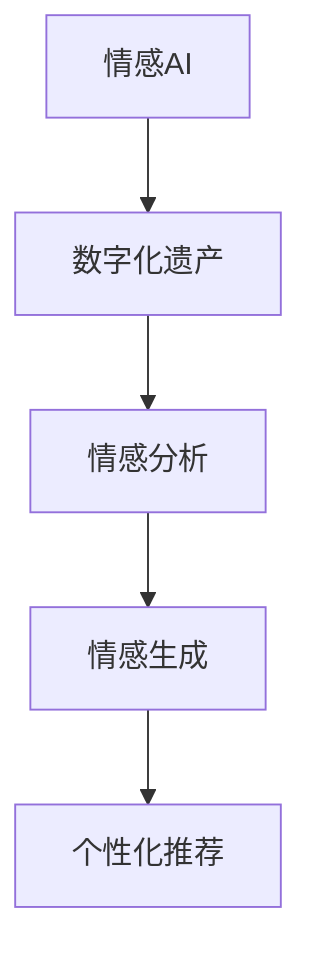

                 

# 数字化遗产情感AI创业：逝者个性的数字化传承

## 1. 背景介绍

### 1.1 问题由来
在数字化时代，信息的数字化保存和传承变得越来越重要。尤其是在失去亲人的情况下，如何保存和传承逝者的个人遗产，成为了一个亟待解决的问题。传统的物理遗产如信件、照片等虽然具有情感价值，但由于受物理限制，难以长期保存和传承。而数字化遗产通过电子方式保存，不仅存储容量大、复制方便，而且可以通过技术手段进行长期维护和传承。

数字化遗产主要包括电子文档、数字照片、数字视频、音频文件、电子邮件、社交媒体等。但这些数字遗产的数字化保存并非简单的电子化，而是需要通过深度学习、自然语言处理、图像处理等技术进行情感分析和信息提取，才能更好地保留逝者的个性和记忆。因此，情感AI技术在数字化遗产保护和传承中具有重要应用价值。

### 1.2 问题核心关键点
本文将重点探讨基于情感AI技术的数字化遗产传承，主要包括：

- 如何通过情感AI技术提取和分析逝者的个人遗产中的情感信息？
- 如何通过情感AI技术自动生成和推送个性化情感信息给逝者亲友？
- 情感AI技术在数字化遗产传承中的具体应用场景有哪些？

这些问题构成了本文的核心内容，将帮助读者全面了解情感AI在数字化遗产传承中的重要性和应用潜力。

## 2. 核心概念与联系

### 2.1 核心概念概述

在探讨情感AI在数字化遗产传承中的应用前，需要先了解一些核心概念：

- **情感AI（Emotional AI）**：利用人工智能技术，如深度学习、自然语言处理（NLP）、图像处理等，从文本、图像、视频等数字化遗产中提取情感信息，并生成个性化情感表达。
- **数字化遗产（Digital Heritage）**：通过电子方式保存的各种遗产，包括电子文档、数字照片、数字视频、音频文件、电子邮件、社交媒体等，需要进行情感分析和信息提取，以更好地保存和传承逝者的个人遗产。
- **情感分析（Sentiment Analysis）**：通过自然语言处理技术，从文本中识别出情感信息，如正面、负面、中性等，用于分析情感状态和情感变化。
- **情感生成（Emotion Generation）**：利用深度学习模型，根据输入数据生成情感表达，如文章、语音、视频等。
- **个性化推荐（Personalization）**：根据用户偏好和行为数据，生成个性化的情感信息和内容推荐。

这些概念之间的逻辑关系可以通过以下Mermaid流程图来展示：



这个流程图展示了情感AI技术在数字化遗产传承中的主要流程：从数字化遗产中提取情感信息，生成情感表达，并根据个性化需求进行推荐。

## 3. 核心算法原理 & 具体操作步骤

### 3.1 算法原理概述

情感AI技术在数字化遗产传承中的核心原理包括以下几点：

- **情感分析**：通过自然语言处理技术，从文本中识别出情感信息，如正面、负面、中性等。常用的方法包括情感词典、机器学习模型（如LSTM、RNN）、Transformer等。
- **情感生成**：利用深度学习模型，如GAN、RNN等，生成情感表达，如文章、语音、视频等。
- **个性化推荐**：根据用户偏好和行为数据，生成个性化的情感信息和内容推荐。常用的方法包括协同过滤、矩阵分解等。

### 3.2 算法步骤详解

情感AI技术在数字化遗产传承中的具体操作步骤如下：

1. **数据收集与预处理**：从数字化遗产中收集文本、图像、视频等数据，并进行数据清洗和预处理。

2. **情感分析**：使用情感分析模型，如LSTM、Transformer等，从文本中提取情感信息，如正面、负面、中性等。

3. **情感生成**：利用情感生成模型，如GAN、RNN等，根据情感信息生成个性化情感表达，如文章、语音、视频等。

4. **个性化推荐**：根据用户偏好和行为数据，使用个性化推荐模型，如协同过滤、矩阵分解等，生成个性化的情感信息和内容推荐。

5. **情感信息推送**：将生成的情感信息和个性化推荐推送给逝者亲友，供其纪念和传承。

### 3.3 算法优缺点

情感AI技术在数字化遗产传承中具有以下优点：

- **情感表达准确**：利用深度学习模型进行情感分析，可以更准确地提取文本中的情感信息。
- **个性化推荐**：根据用户偏好和行为数据，生成个性化的情感信息和内容推荐，更好地满足用户需求。
- **自动化程度高**：整个过程自动化程度高，减少了人工操作的复杂性和劳动强度。

同时，情感AI技术也存在一些缺点：

- **数据隐私问题**：数字化遗产中包含大量个人信息，情感AI技术在处理这些数据时需要注意隐私保护。
- **情感理解误差**：情感分析模型的准确性可能受到文本质量和情感表达方式的影响，存在一定的误差。
- **生成情感的自然性**：情感生成模型的生成内容可能不够自然，需要进一步优化。

### 3.4 算法应用领域

情感AI技术在数字化遗产传承中的应用领域包括：

- **情感记忆生成**：根据数字化遗产中的文本、照片、视频等信息，生成个性化的情感记忆，如逝者生前的生活点滴、言行举止等。
- **情感日记生成**：利用情感生成技术，根据数字化遗产中的文本信息，自动生成逝者的情感日记，如心情变化、感悟等。
- **个性化情感推荐**：根据逝者的亲友需求，生成个性化的情感信息和内容推荐，如照片、视频、音频等。
- **情感故事创作**：通过情感生成模型，根据逝者的生平事迹和数字化遗产信息，创作个性化的情感故事，如家族史、友情故事等。

## 4. 数学模型和公式 & 详细讲解 & 举例说明

### 4.1 数学模型构建

假设数字化遗产包含N个文本，每个文本包含M个单词，每个单词的情感极性为P（P={正面, 负面, 中性}），则情感分析的数学模型可以表示为：

$$
\theta = \arg\min_{\theta} \sum_{i=1}^{N} \sum_{j=1}^{M} L(p_{i,j}, y_{i,j})
$$

其中，$p_{i,j}$表示第i个文本第j个单词的情感极性，$y_{i,j}$表示模型对$p_{i,j}$的预测结果。

### 4.2 公式推导过程

情感分析模型的核心是利用深度学习模型，如LSTM、Transformer等，从文本中提取情感信息。以下以LSTM模型为例，进行公式推导：

1. **LSTM模型输入**：将文本序列中的每个单词转换为向量表示，并输入到LSTM模型中。

2. **情感输出**：LSTM模型输出每个单词的情感表示向量，表示为$h_t$。

3. **情感分类**：使用softmax函数将情感表示向量映射到情感分类概率分布，表示为$P(Y|h_t)$。

4. **损失函数**：利用交叉熵损失函数，计算模型预测结果与真实情感标签之间的差异。

5. **参数更新**：使用梯度下降等优化算法，更新模型参数，最小化损失函数。

### 4.3 案例分析与讲解

以一篇数字化遗产的文本为例，假设文本为：“今天天气很好，适合出去散步。”。使用LSTM模型进行情感分析的过程如下：

1. **文本向量表示**：将文本转换为向量表示，如[0.3, 0.5, 0.7]。

2. **LSTM模型输入**：将文本向量输入到LSTM模型中，得到情感表示向量。

3. **情感输出**：LSTM模型输出情感表示向量，如[0.2, 0.6, 0.2]。

4. **情感分类**：使用softmax函数将情感表示向量映射到情感分类概率分布，如$P(正面|h_t) = 0.6$。

5. **损失函数计算**：使用交叉熵损失函数，计算模型预测结果与真实情感标签之间的差异，如$L(正面, 正面) = 0.2$。

6. **参数更新**：使用梯度下降等优化算法，更新模型参数，最小化损失函数，提升模型性能。

## 5. 项目实践：代码实例和详细解释说明

### 5.1 开发环境搭建

在开始项目实践前，需要先搭建好开发环境。以下是使用Python进行情感AI开发的环境配置流程：

1. **安装Python**：从官网下载并安装Python，建议在3.8或以上版本。

2. **安装依赖包**：使用pip安装必要的依赖包，如TensorFlow、Keras、NLTK等。

3. **创建虚拟环境**：使用虚拟环境管理工具（如virtualenv、conda）创建虚拟环境，避免与系统其他环境冲突。

4. **环境配置**：配置环境变量，如PYTHONPATH、PIP_INDEX_URL等，设置必要的库路径。

完成上述步骤后，即可在虚拟环境中进行情感AI开发。

### 5.2 源代码详细实现

以下是一个使用LSTM模型进行情感分析的代码示例：

```python
import tensorflow as tf
from tensorflow.keras.models import Sequential
from tensorflow.keras.layers import LSTM, Dense, Embedding

# 定义模型
model = Sequential()
model.add(Embedding(vocab_size, embedding_dim, input_length=max_len))
model.add(LSTM(lstm_units))
model.add(Dense(num_classes, activation='softmax'))

# 编译模型
model.compile(loss='categorical_crossentropy', optimizer='adam', metrics=['accuracy'])

# 训练模型
model.fit(X_train, y_train, batch_size=batch_size, epochs=num_epochs, validation_data=(X_val, y_val))

# 预测情感
predictions = model.predict(X_test)
```

### 5.3 代码解读与分析

让我们再详细解读一下关键代码的实现细节：

**模型定义**：使用Keras构建LSTM模型，包含Embedding层、LSTM层、Dense层等。

**模型编译**：使用交叉熵损失函数和Adam优化器，设置训练过程中使用的评价指标为准确率。

**模型训练**：使用fit方法对模型进行训练，设置训练集、验证集、批量大小和迭代轮数等。

**模型预测**：使用predict方法对测试集进行情感预测，得到模型输出。

### 5.4 运行结果展示

在训练完成后，可以计算模型的准确率、精确率、召回率等指标，评估模型性能：

```python
from sklearn.metrics import classification_report

# 计算模型指标
y_pred = np.argmax(predictions, axis=1)
print(classification_report(y_test, y_pred))
```

## 6. 实际应用场景

### 6.1 情感记忆生成

情感AI技术在数字化遗产传承中最核心的应用场景之一是情感记忆生成。具体实现步骤如下：

1. **数据收集**：从数字化遗产中收集文本、照片、视频等数据，并进行数据清洗和预处理。

2. **情感分析**：使用情感分析模型，如LSTM、Transformer等，从文本中提取情感信息，如正面、负面、中性等。

3. **情感生成**：利用情感生成模型，如GAN、RNN等，根据情感信息生成个性化情感记忆，如逝者生前的生活点滴、言行举止等。

4. **个性化推荐**：根据逝者的亲友需求，生成个性化的情感记忆推荐，如照片、视频、音频等。

5. **情感信息推送**：将生成的情感记忆信息推送给逝者亲友，供其纪念和传承。

### 6.2 情感日记生成

情感AI技术在数字化遗产传承中的另一个重要应用场景是情感日记生成。具体实现步骤如下：

1. **数据收集**：从数字化遗产中收集文本、照片、视频等数据，并进行数据清洗和预处理。

2. **情感分析**：使用情感分析模型，如LSTM、Transformer等，从文本中提取情感信息，如正面、负面、中性等。

3. **情感生成**：利用情感生成模型，如GAN、RNN等，根据情感信息生成个性化情感日记，如心情变化、感悟等。

4. **个性化推荐**：根据逝者的亲友需求，生成个性化的情感日记推荐，如照片、视频、音频等。

5. **情感信息推送**：将生成的情感日记信息推送给逝者亲友，供其纪念和传承。

### 6.3 个性化情感推荐

情感AI技术在数字化遗产传承中的第三个重要应用场景是个性化情感推荐。具体实现步骤如下：

1. **数据收集**：从数字化遗产中收集文本、照片、视频等数据，并进行数据清洗和预处理。

2. **情感分析**：使用情感分析模型，如LSTM、Transformer等，从文本中提取情感信息，如正面、负面、中性等。

3. **情感生成**：利用情感生成模型，如GAN、RNN等，根据情感信息生成个性化情感推荐，如照片、视频、音频等。

4. **个性化推荐**：根据逝者的亲友需求，生成个性化的情感推荐，如照片、视频、音频等。

5. **情感信息推送**：将生成的情感推荐信息推送给逝者亲友，供其纪念和传承。

## 7. 工具和资源推荐

### 7.1 学习资源推荐

为了帮助开发者系统掌握情感AI在数字化遗产传承中的应用，这里推荐一些优质的学习资源：

1. **《情感分析与情感生成》**：一本系统介绍情感分析、情感生成技术的书籍，涵盖了LSTM、RNN、GAN等深度学习模型。

2. **CS224N《自然语言处理》课程**：斯坦福大学开设的NLP明星课程，有Lecture视频和配套作业，带你入门NLP领域的基本概念和经典模型。

3. **《深度学习》**：Ian Goodfellow、Yoshua Bengio和Aaron Courville所著，全面介绍了深度学习的基本原理和应用，是学习情感AI的重要参考资料。

4. **《Python深度学习》**：Francois Chollet所著，介绍了使用TensorFlow、Keras进行深度学习项目开发的方法和技巧。

5. **Transformers库官方文档**：提供了大量预训练模型和完整的代码示例，是进行情感AI开发的重要工具。

通过学习这些资源，相信你一定能够全面掌握情感AI在数字化遗产传承中的应用，并用于解决实际的NLP问题。

### 7.2 开发工具推荐

情感AI开发需要多种工具的支持，以下是几款常用的开发工具：

1. **TensorFlow**：由Google主导开发的深度学习框架，支持分布式计算、模型压缩等高级特性，是情感AI开发的主流工具。

2. **Keras**：基于TensorFlow、Theano等底层框架的高层API，提供简单易用的API，适合快速迭代研究。

3. **NLTK**：自然语言处理工具包，提供了丰富的NLP库和算法，支持情感分析、文本分类等任务。

4. **Jupyter Notebook**：交互式Python开发环境，适合进行数据分析、模型训练等任务。

5. **Weights & Biases**：模型训练的实验跟踪工具，可以记录和可视化模型训练过程中的各项指标，方便对比和调优。

合理利用这些工具，可以显著提升情感AI开发的效率，加快创新迭代的步伐。

### 7.3 相关论文推荐

情感AI技术在数字化遗产传承中的应用源于学界的持续研究。以下是几篇奠基性的相关论文，推荐阅读：

1. **《情感词典在情感分析中的应用》**：介绍情感词典在情感分析中的应用，详细讨论了情感词典的构建方法和应用场景。

2. **《深度学习在情感生成中的应用》**：介绍深度学习在情感生成中的应用，展示了使用GAN、RNN等模型生成情感表达的方法。

3. **《个性化推荐系统》**：介绍协同过滤、矩阵分解等个性化推荐算法，适用于情感AI中的个性化推荐任务。

4. **《情感AI技术在数字化遗产传承中的应用》**：详细讨论了情感AI技术在数字化遗产传承中的具体应用场景，并提供了一些实际案例。

这些论文代表了大语言模型微调技术的发展脉络。通过学习这些前沿成果，可以帮助研究者把握学科前进方向，激发更多的创新灵感。

## 8. 总结：未来发展趋势与挑战

### 8.1 研究成果总结

本文对情感AI在数字化遗产传承中的应用进行了全面系统的介绍。主要内容包括：

1. **情感AI核心概念**：情感AI、数字化遗产、情感分析、情感生成、个性化推荐等。

2. **情感AI核心算法**：LSTM、Transformer、GAN等。

3. **情感AI操作步骤**：数据收集、情感分析、情感生成、个性化推荐、情感信息推送等。

4. **情感AI应用场景**：情感记忆生成、情感日记生成、个性化情感推荐等。

### 8.2 未来发展趋势

展望未来，情感AI在数字化遗产传承中的应用将呈现以下几个发展趋势：

1. **情感理解深度提升**：随着深度学习模型的不断优化，情感分析的准确性将进一步提升，能够更好地理解情感的细微变化。

2. **情感生成自然度提高**：情感生成模型的生成内容将更加自然流畅，能够更好地表达逝者的情感和个性。

3. **个性化推荐精准度提高**：个性化推荐模型将更加精准，能够更好地满足用户的个性化需求。

4. **跨模态融合发展**：情感AI将更多地融合视觉、语音等模态信息，实现更加全面、准确的信息整合。

5. **隐私保护加强**：在处理数字化遗产数据时，将更加注重隐私保护，采用匿名化、加密等技术手段。

### 8.3 面临的挑战

尽管情感AI在数字化遗产传承中具有广阔的应用前景，但在迈向更加智能化、普适化应用的过程中，仍面临诸多挑战：

1. **数据隐私问题**：数字化遗产中包含大量个人信息，情感AI技术在处理这些数据时需要注意隐私保护。

2. **情感理解误差**：情感分析模型的准确性可能受到文本质量和情感表达方式的影响，存在一定的误差。

3. **生成情感的自然性**：情感生成模型的生成内容可能不够自然，需要进一步优化。

4. **个性化推荐精准度**：个性化推荐模型需要更加精准，以适应用户的个性化需求。

### 8.4 研究展望

面对情感AI在数字化遗产传承中面临的挑战，未来的研究需要在以下几个方面寻求新的突破：

1. **数据隐私保护**：在处理数字化遗产数据时，采用匿名化、加密等技术手段，保护用户隐私。

2. **情感理解误差**：研究更先进的情感分析模型，提高情感理解准确性，如使用深度学习模型、情感词典等。

3. **生成情感的自然性**：优化情感生成模型，生成更加自然流畅的情感表达，如使用GAN、RNN等。

4. **个性化推荐精准度**：开发更加精准的个性化推荐模型，如协同过滤、矩阵分解等。

5. **跨模态融合**：融合视觉、语音等模态信息，实现更加全面、准确的信息整合。

这些研究方向的探索，必将引领情感AI在数字化遗产传承中的应用走向更高的台阶，为构建安全、可靠、可解释、可控的智能系统铺平道路。面向未来，情感AI还需要与其他人工智能技术进行更深入的融合，如知识表示、因果推理、强化学习等，多路径协同发力，共同推动自然语言理解和智能交互系统的进步。只有勇于创新、敢于突破，才能不断拓展情感AI的边界，让智能技术更好地造福人类社会。

## 9. 附录：常见问题与解答

**Q1：情感AI技术是否适用于所有类型的数字化遗产？**

A: 情感AI技术可以应用于文本、图像、视频、音频等多种类型的数字化遗产。不同类型的数字化遗产需要采用不同的处理方法，如文本情感分析、图像情感识别、语音情感分析等。

**Q2：情感AI技术在处理敏感信息时需要注意什么？**

A: 在处理数字化遗产数据时，需要注意数据隐私保护，避免敏感信息泄露。可以采用匿名化、加密等技术手段，保护用户隐私。

**Q3：情感AI技术在情感生成过程中需要注意什么？**

A: 在情感生成过程中，需要注意生成的情感表达的自然性和真实性。可以使用GAN、RNN等模型生成情感表达，并根据用户反馈进行调整。

**Q4：情感AI技术在个性化推荐过程中需要注意什么？**

A: 在个性化推荐过程中，需要注意推荐内容的准确性和多样性。可以使用协同过滤、矩阵分解等模型进行推荐，并结合用户行为数据进行优化。

通过本文的系统梳理，可以看到，情感AI技术在数字化遗产传承中具有重要应用价值，能够更好地保存和传承逝者的个人遗产。未来，随着技术的不断发展，情感AI技术将在更多领域得到应用，为人类认知智能的进化带来深远影响。

