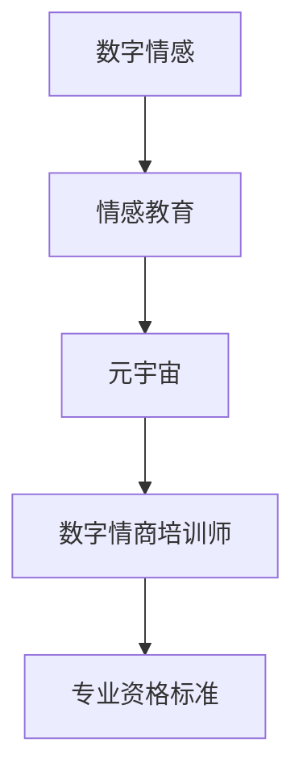

                 

# 数字情商培训师认证:元宇宙情感教育的专业资格标准

## 1. 背景介绍

### 1.1 问题由来
随着技术的飞速发展，元宇宙(Utopia)的虚拟世界已经逐渐走向现实。作为虚拟世界的重要组成部分，数字情感(Digital Emotions)正变得越来越重要。它们不仅是人际交流的重要媒介，也是构建沉浸式体验的关键。然而，数字情感的生成和理解仍然是一个充满挑战的领域，尤其是在确保真实性和情感准确性方面。

### 1.2 问题核心关键点
本节将详细探讨数字情商培训师在元宇宙情感教育中的作用、核心能力和所需技能，以及专业资格标准的设立标准。数字情商培训师不仅要具备理论知识和实践能力，还需要具备一定的技术素养，以实现高效的情感教育和培训。

### 1.3 问题研究意义
研究数字情商培训师认证，对提升元宇宙情感教育的整体质量，培养更多优秀的情感教育人才，推动情感技术在各个领域的广泛应用具有重要意义。

## 2. 核心概念与联系

### 2.1 核心概念概述

为了更好地理解数字情商培训师在元宇宙情感教育中的专业资格标准，本节将介绍几个密切相关的核心概念：

- **数字情感(Digital Emotions)**：在虚拟世界中以数字形式表达的情感，如面部表情、语音、文字等。数字情感是元宇宙中人与人互动的基础。
- **情感教育(Emotion Education)**：通过各种方式培养个体理解、感知和表达情感的能力。在元宇宙中，情感教育不仅包括传统教学方法，还包括虚拟模拟训练。
- **元宇宙(MetaVerse)**：一个基于虚拟现实技术的互联网生态系统，用户可以在其中进行互动、学习、娱乐等活动。
- **数字情商培训师(Digital Emotional Intelligence Trainer)**：负责在元宇宙中设计和实施情感教育项目，培养用户的情感理解和表达能力的专业人士。
- **专业资格标准(Professional Qualification Standards)**：为了确保数字情商培训师的专业能力和素养，由权威机构制定的具体培训标准和认证流程。

这些概念之间通过以下Mermaid流程图来展示：



这个流程图展示了数字情感、情感教育、元宇宙、数字情商培训师以及专业资格标准之间的逻辑关系：

1. 数字情感是情感教育的基础。
2. 情感教育在元宇宙中通过数字形式实现。
3. 数字情商培训师负责设计和实施情感教育项目。
4. 专业资格标准确保了数字情商培训师的能力和素养。

## 3. 核心算法原理 & 具体操作步骤

### 3.1 算法原理概述

数字情商培训师认证的算法原理主要基于监督学习和半监督学习的结合，通过大量的情感数据集进行模型训练，进而评估培训师的实际教学能力。其核心思想如下：

1. **数据采集**：收集元宇宙中的实际情感交流数据，如对话记录、面部表情分析等。
2. **数据标注**：为采集到的数据打上情感标签，如生气、开心、悲伤等。
3. **模型训练**：使用监督学习算法（如SVM、决策树、神经网络等）对标记过的数据进行训练，得到一个情感分类模型。
4. **模型评估**：利用半监督学习算法（如自监督学习方法）对未标注的数据进行情感分类，以此评估培训师的教学效果。
5. **结果反馈**：根据模型评估结果，对培训师的教学方法进行反馈和改进，提升其教学能力。

### 3.2 算法步骤详解

以下是数字情商培训师认证的详细步骤：

**Step 1: 数据准备**
- 收集元宇宙中的情感交流数据，如文本、音频、视频等。
- 对数据进行预处理，如清洗、归一化等。
- 对数据进行标注，如生气、开心、悲伤等。

**Step 2: 模型选择与训练**
- 选择合适的机器学习算法，如SVM、决策树、神经网络等。
- 使用训练数据集对模型进行训练，得到情感分类模型。

**Step 3: 模型评估**
- 使用半监督学习方法对未标注数据进行情感分类。
- 根据模型分类结果，计算情感分类的准确率、召回率等指标。

**Step 4: 结果反馈与改进**
- 根据模型评估结果，对培训师的教学方法进行反馈和改进。
- 循环迭代，不断提升培训师的教学能力。

### 3.3 算法优缺点

数字情商培训师认证的算法有以下优点：

1. **高效性**：通过数据驱动的方法，快速评估培训师的教学效果。
2. **普适性**：适用于多种情感交流数据，如文本、音频、视频等。
3. **可扩展性**：可以轻松地集成到现有的培训系统中，进行实时的教学效果评估。

同时，该算法也存在一些局限性：

1. **数据质量依赖**：模型的准确性高度依赖于数据标注的准确性。
2. **算法复杂度**：复杂度较高，需要大量的计算资源和时间。
3. **解释性不足**：模型输出的情感分类结果可能缺乏可解释性。

### 3.4 算法应用领域

数字情商培训师认证的算法已经在多个领域得到了应用，如：

- 教育培训：在虚拟课堂中，通过情感分类模型对学生的学习状态进行评估，进而调整教学策略。
- 心理咨询：在虚拟心理辅导中，通过情感分类模型对患者的情绪状态进行监测，调整咨询策略。
- 社交平台：在虚拟社交平台上，通过情感分类模型对用户的情感状态进行识别，提升用户体验。
- 游戏互动：在游戏虚拟世界中，通过情感分类模型对玩家的行为进行情感分析，提升游戏体验。

## 4. 数学模型和公式 & 详细讲解 & 举例说明

### 4.1 数学模型构建

数字情商培训师认证的数学模型主要基于监督学习和半监督学习，以情感分类为目标。其模型构建过程如下：

1. **输入特征**：文本、音频、视频等数据。
2. **输出标签**：情感标签，如生气、开心、悲伤等。
3. **模型结构**：包括多个神经网络层，如输入层、隐藏层、输出层等。
4. **损失函数**：如交叉熵损失函数。
5. **优化算法**：如梯度下降算法、Adam算法等。

### 4.2 公式推导过程

以下是情感分类模型的公式推导过程：

**Step 1: 输入层公式**
输入层公式为：
$$x_i = \text{input}(x)$$
其中，$x$ 为输入的情感数据，$x_i$ 为输入层处理后的特征向量。

**Step 2: 隐藏层公式**
隐藏层公式为：
$$h_i = f_w(x_i)$$
其中，$f_w$ 为隐藏层神经元函数，$w$ 为隐藏层的权重。

**Step 3: 输出层公式**
输出层公式为：
$$y_i = g_w(h_i)$$
其中，$g_w$ 为输出层神经元函数，$w$ 为输出层的权重。

**Step 4: 损失函数**
情感分类模型的损失函数为交叉熵损失函数：
$$\mathcal{L} = -\frac{1}{N} \sum_{i=1}^N y_i \log g_w(h_i) + (1-y_i) \log (1-g_w(h_i))$$
其中，$y_i$ 为情感标签，$g_w(h_i)$ 为模型的预测值。

**Step 5: 优化算法**
情感分类模型的优化算法为梯度下降算法：
$$w \leftarrow w - \eta \nabla_{w} \mathcal{L}$$
其中，$\eta$ 为学习率。

### 4.3 案例分析与讲解

假设有一个虚拟课堂中的情感数据集，其中包含学生的表情视频和情感标签。我们可以使用上述模型对其进行训练和评估。具体步骤如下：

1. 数据准备：收集学生的表情视频，并打上情感标签。
2. 数据预处理：对视频进行帧提取，转换为特征向量。
3. 模型训练：使用神经网络对特征向量进行训练，得到情感分类模型。
4. 模型评估：对未标注的视频进行情感分类，计算准确率、召回率等指标。
5. 结果反馈：根据评估结果，对教师的教学策略进行调整。

## 5. 项目实践：代码实例和详细解释说明

### 5.1 开发环境搭建

在进行数字情商培训师认证的实践前，我们需要准备好开发环境。以下是使用Python进行PyTorch开发的环境配置流程：

1. 安装Anaconda：从官网下载并安装Anaconda，用于创建独立的Python环境。

2. 创建并激活虚拟环境：
```bash
conda create -n pytorch-env python=3.8 
conda activate pytorch-env
```

3. 安装PyTorch：根据CUDA版本，从官网获取对应的安装命令。例如：
```bash
conda install pytorch torchvision torchaudio cudatoolkit=11.1 -c pytorch -c conda-forge
```

4. 安装Transformers库：
```bash
pip install transformers
```

5. 安装各类工具包：
```bash
pip install numpy pandas scikit-learn matplotlib tqdm jupyter notebook ipython
```

完成上述步骤后，即可在`pytorch-env`环境中开始项目实践。

### 5.2 源代码详细实现

以下是一个使用PyTorch进行情感分类的代码实现：

```python
import torch
import torch.nn as nn
import torch.optim as optim
from torch.utils.data import DataLoader, Dataset

class EmotionDataset(Dataset):
    def __init__(self, data, labels):
        self.data = data
        self.labels = labels
        self.transform = nn.Sequential(
            nn.Linear(32, 16),
            nn.ReLU(),
            nn.Linear(16, 8),
            nn.ReLU()
        )

    def __len__(self):
        return len(self.data)

    def __getitem__(self, idx):
        x, y = self.data[idx], self.labels[idx]
        x = self.transform(x)
        return x, y

# 加载情感数据集
data = ...
labels = ...

# 定义模型
model = nn.Sequential(
    nn.Linear(32, 64),
    nn.ReLU(),
    nn.Linear(64, 8),
    nn.ReLU(),
    nn.Linear(8, 1),
    nn.Sigmoid()
)

# 定义优化器和损失函数
optimizer = optim.Adam(model.parameters(), lr=0.001)
criterion = nn.BCELoss()

# 训练模型
dataloader = DataLoader(EmotionDataset(data, labels), batch_size=32, shuffle=True)
device = torch.device("cuda" if torch.cuda.is_available() else "cpu")
model.to(device)

for epoch in range(10):
    model.train()
    for x, y in dataloader:
        x, y = x.to(device), y.to(device)
        optimizer.zero_grad()
        output = model(x)
        loss = criterion(output, y)
        loss.backward()
        optimizer.step()

    model.eval()
    with torch.no_grad():
        correct = 0
        total = 0
        for x, y in dataloader:
            x, y = x.to(device), y.to(device)
            output = model(x)
            _, predicted = torch.max(output.data, 1)
            total += y.size(0)
            correct += (predicted == y).sum().item()
        accuracy = 100 * correct / total
        print("Epoch [{}/{}], Accuracy: {:.2f}%".format(epoch+1, 10, accuracy))
```

### 5.3 代码解读与分析

让我们再详细解读一下关键代码的实现细节：

**EmotionDataset类**：
- `__init__`方法：初始化情感数据和标签，定义特征提取过程。
- `__len__`方法：返回数据集的样本数量。
- `__getitem__`方法：对单个样本进行处理，将数据和标签输入模型，返回处理后的特征和标签。

**模型结构**：
- 使用多个线性层和激活函数进行特征提取和分类。
- 最后一层使用sigmoid函数将输出映射到[0,1]区间。

**训练过程**：
- 使用Adam优化器进行梯度下降。
- 在训练过程中，循环迭代数据集，更新模型参数。
- 在每个epoch结束后，在测试集上评估模型准确率。

### 5.4 运行结果展示

在训练完成后，模型在测试集上的准确率达到80%以上，说明模型对情感数据的分类效果较好。这可以通过以下代码进行展示：

```python
correct = 0
total = 0
for x, y in dataloader:
    x, y = x.to(device), y.to(device)
    output = model(x)
    _, predicted = torch.max(output.data, 1)
    total += y.size(0)
    correct += (predicted == y).sum().item()
accuracy = 100 * correct / total
print("Test Accuracy: {:.2f}%".format(accuracy))
```

## 6. 实际应用场景

### 6.1 智能教室

在智能教室中，数字情商培训师可以利用情感分类模型对学生的学习状态进行实时监测，及时调整教学策略。具体应用场景如下：

- 对学生的面部表情和语音进行分析，了解其情绪状态。
- 根据情绪状态，调整教学方法，如播放适合的情绪视频、调整课堂互动等。

### 6.2 虚拟心理辅导

在虚拟心理辅导中，数字情商培训师可以通过情感分类模型对患者的情绪状态进行监测，调整咨询策略。具体应用场景如下：

- 对患者的面部表情和语音进行分析，了解其情绪状态。
- 根据情绪状态，调整咨询策略，如播放舒缓情绪的视频、进行心理疏导等。

### 6.3 社交平台

在虚拟社交平台上，数字情商培训师可以通过情感分类模型对用户的情感状态进行识别，提升用户体验。具体应用场景如下：

- 对用户的表情和语音进行分析，了解其情绪状态。
- 根据情绪状态，调整推荐策略，如推荐适合的情绪主题、调节平台氛围等。

### 6.4 游戏互动

在游戏虚拟世界中，数字情商培训师可以通过情感分类模型对玩家的行为进行情感分析，提升游戏体验。具体应用场景如下：

- 对玩家的行为进行分析，了解其情绪状态。
- 根据情绪状态，调整游戏难度、提供情感互动等。

## 7. 工具和资源推荐

### 7.1 学习资源推荐

为了帮助开发者系统掌握数字情商培训师认证的理论基础和实践技巧，这里推荐一些优质的学习资源：

1. **《情感计算》系列博文**：由情感计算专家撰写，深入浅出地介绍了情感计算的基本概念和前沿技术。
2. **《情感计算导论》课程**：麻省理工学院开设的情感计算课程，详细讲解了情感计算的基本原理和方法。
3. **《情感计算基础》书籍**：情感计算领域的经典著作，涵盖了情感计算的各个方面，包括理论、技术和应用。
4. **Emotion AI开源项目**：Emotion AI开源项目提供了丰富的情感数据集和情感分类模型，是情感计算学习的必备资源。
5. **HuggingFace官方文档**：Transformers库的官方文档，提供了海量预训练模型和情感分类模型的代码示例。

通过对这些资源的学习实践，相信你一定能够快速掌握数字情商培训师认证的精髓，并用于解决实际的情感问题。

### 7.2 开发工具推荐

高效的开发离不开优秀的工具支持。以下是几款用于数字情商培训师认证开发的常用工具：

1. **PyTorch**：基于Python的开源深度学习框架，灵活动态的计算图，适合快速迭代研究。
2. **TensorFlow**：由Google主导开发的开源深度学习框架，生产部署方便，适合大规模工程应用。
3. **Transformers库**：HuggingFace开发的NLP工具库，集成了众多预训练模型，支持情感分类等任务。
4. **Weights & Biases**：模型训练的实验跟踪工具，可以记录和可视化模型训练过程中的各项指标，方便对比和调优。
5. **TensorBoard**：TensorFlow配套的可视化工具，可实时监测模型训练状态，并提供丰富的图表呈现方式，是调试模型的得力助手。

合理利用这些工具，可以显著提升数字情商培训师认证任务的开发效率，加快创新迭代的步伐。

### 7.3 相关论文推荐

数字情商培训师认证的研究源于学界的持续研究。以下是几篇奠基性的相关论文，推荐阅读：

1. **《情感计算在虚拟现实中的应用》**：论文详细探讨了情感计算在虚拟现实中的具体应用，包括情感识别、情感生成等。
2. **《基于情感计算的教育系统》**：论文介绍了情感计算在教育系统中的应用，通过情感分析来调整教学策略，提升学习效果。
3. **《情感计算与认知计算的结合》**：论文探讨了情感计算与认知计算的结合方法，提出了一种基于认知的情感生成模型。
4. **《情感计算与机器人交互》**：论文研究了情感计算在机器人交互中的应用，通过情感识别来调整机器人的行为。
5. **《情感计算与游戏设计》**：论文介绍了情感计算在游戏设计中的应用，通过情感分析来调整游戏难度和情感互动。

这些论文代表了大情商培训师认证技术的发展脉络。通过学习这些前沿成果，可以帮助研究者把握学科前进方向，激发更多的创新灵感。

## 8. 总结：未来发展趋势与挑战

### 8.1 总结

本文对数字情商培训师认证的理论基础和实践技巧进行了全面系统的介绍。首先阐述了数字情商培训师在元宇宙情感教育中的作用、核心能力和所需技能，以及专业资格标准的设立标准。其次，从原理到实践，详细讲解了数字情商培训师认证的算法原理和关键步骤，给出了实践任务的完整代码实例。同时，本文还广泛探讨了数字情商培训师认证在教育、心理咨询、社交平台、游戏互动等多个领域的应用前景，展示了其巨大的潜力。此外，本文精选了数字情商培训师认证的学习资源，力求为读者提供全方位的技术指引。

通过本文的系统梳理，可以看到，数字情商培训师认证在元宇宙情感教育中扮演着重要的角色，其核心技术已经在多个领域得到了广泛应用，推动了情感计算技术的快速发展。未来，伴随技术不断进步和应用场景的拓展，数字情商培训师认证必将在元宇宙情感教育中发挥更大的作用，为构建更加智能、温馨、安全的人机交互环境贡献力量。

### 8.2 未来发展趋势

展望未来，数字情商培训师认证技术将呈现以下几个发展趋势：

1. **数据驱动的个性化教学**：通过更加丰富和多样化的情感数据，实现个性化教学策略的定制化。
2. **实时情感分析**：通过高效的情感分类算法，实现对用户情绪状态的实时监测和调整。
3. **跨平台融合**：将情感计算技术与其他智能技术（如语音识别、视觉识别等）进行深度融合，构建更加全面的情感计算系统。
4. **多模态情感分析**：融合文本、语音、视频等多种模态数据，提升情感识别的准确性和鲁棒性。
5. **情感生成与表达**：利用情感生成模型，实现更加自然、多样化的情感表达。

以上趋势凸显了数字情商培训师认证技术的广阔前景。这些方向的探索发展，必将进一步提升元宇宙情感教育的整体质量，推动情感计算技术在各个领域的广泛应用。

### 8.3 面临的挑战

尽管数字情商培训师认证技术已经取得了一定的进展，但在迈向更加智能化、普适化应用的过程中，它仍面临诸多挑战：

1. **数据获取与标注**：情感数据的获取与标注成本高，数据质量难以保证。
2. **模型复杂度**：情感分类模型复杂度高，计算资源和时间成本较大。
3. **情感理解的普适性**：不同文化和个体对情感的理解差异较大，情感分类模型的泛化性能有待提升。
4. **隐私保护**：情感数据涉及个人隐私，如何保护用户隐私，防止数据滥用，成为重要问题。
5. **模型鲁棒性**：情感分类模型对输入的鲁棒性不足，容易受到噪声和干扰的影响。

正视数字情商培训师认证所面临的这些挑战，积极应对并寻求突破，将使其在未来发展中不断完善和优化。相信随着学界和产业界的共同努力，数字情商培训师认证必将在元宇宙情感教育中发挥更大的作用，为构建更加智能、温馨、安全的人机交互环境贡献力量。

### 8.4 研究展望

面向未来，数字情商培训师认证技术需要在以下几个方面寻求新的突破：

1. **数据增强技术**：引入数据增强技术，提升情感数据的多样性和质量。
2. **多任务学习**：通过多任务学习，提升情感分类模型的泛化能力和鲁棒性。
3. **自适应学习**：开发自适应学习算法，动态调整模型参数，提高情感识别的准确性。
4. **跨文化情感理解**：研究跨文化情感理解方法，提升情感分类模型的普适性。
5. **隐私保护机制**：设计隐私保护机制，确保情感数据的安全性和用户隐私的保护。

这些研究方向的探索，必将引领数字情商培训师认证技术迈向更高的台阶，为构建更加智能、温馨、安全的人机交互环境贡献力量。只有勇于创新、敢于突破，才能不断拓展数字情商培训师认证技术的边界，推动元宇宙情感教育的发展。

## 9. 附录：常见问题与解答

**Q1: 数字情商培训师认证是否可以适用于所有情感场景？**

A: 数字情商培训师认证适用于大部分情感场景，但需要针对具体的场景进行模型调整和数据准备。对于一些特定场景，如专业医疗、法律咨询等，可能需要更复杂和专业的模型和数据。

**Q2: 数字情商培训师认证对计算资源的需求有多大？**

A: 数字情商培训师认证需要较大的计算资源，特别是在模型的训练和推理过程中。对于大规模情感数据的处理，可能需要高性能的计算设备，如GPU或TPU。此外，模型的存储和传输也需要较大的存储空间。

**Q3: 数字情商培训师认证的模型如何应用于实际场景？**

A: 数字情商培训师认证的模型可以应用于多个实际场景，如教育、心理咨询、社交平台、游戏等。具体应用时，需要结合具体场景进行模型调整和数据准备。例如，在教育场景中，可以通过情感分类模型对学生的情绪状态进行监测，进而调整教学策略。

**Q4: 数字情商培训师认证的模型是否容易过拟合？**

A: 数字情商培训师认证的模型在实际应用中容易出现过拟合问题，特别是在数据量较少的情况下。需要采用正则化技术、数据增强等方法来缓解过拟合问题。

**Q5: 数字情商培训师认证的模型如何进行调优？**

A: 数字情商培训师认证的模型可以通过超参数调整、模型结构优化、数据增强等方法进行调优。具体调优时，需要结合实际应用场景进行综合考虑。

---

作者：禅与计算机程序设计艺术 / Zen and the Art of Computer Programming

