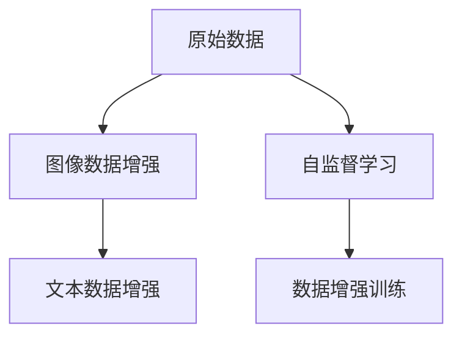

                 

# 数据增强技术：图像和文本

在当今的信息时代，数据增强（Data Augmentation, DA）技术已成为提升机器学习模型性能、减少对标注数据依赖、提升模型泛化能力的关键工具。无论是在图像处理、自然语言处理（NLP）还是其他领域，数据增强都能在有限的标注数据下显著提升模型的预测效果。本文将全面系统地介绍数据增强技术的原理、操作步骤以及其在图像和文本领域的应用实例，并展望未来发展趋势与挑战。

## 1. 背景介绍

### 1.1 问题由来

在机器学习尤其是深度学习（Deep Learning）领域，模型训练通常依赖大量的标注数据。然而，实际应用中获取高质量标注数据往往成本高昂且耗时。为了在数据稀缺的情况下提升模型性能，数据增强技术应运而生。数据增强技术通过对原始数据进行一系列变换，生成新的样本数据，扩展训练数据集，从而提升模型对输入数据的鲁棒性和泛化能力。

### 1.2 问题核心关键点

数据增强技术主要包含两个关键方面：

1. **变换策略**：包括随机裁剪、翻转、旋转、缩放、噪声注入等。这些变换在图像处理中应用广泛，而在文本处理中，则通过同义词替换、句子重构、随机插入等操作实现。
2. **数据生成**：通过这些变换策略生成新的数据样本，用于模型训练。这些数据与原始数据具有相似的统计特征，但又不完全相同，可以有效提高模型的泛化能力。

## 2. 核心概念与联系

### 2.1 核心概念概述

1. **数据增强（Data Augmentation）**：通过一系列变换生成新的数据样本，扩展训练集，提升模型泛化能力。
2. **图像数据增强（Image Data Augmentation）**：对图像数据进行随机变换，如随机裁剪、翻转、旋转、缩放等，生成新的图像数据。
3. **文本数据增强（Text Data Augmentation）**：通过同义词替换、句子重构、随机插入等方法，生成新的文本数据。
4. **自监督学习（Self-Supervised Learning）**：利用无标签数据进行模型训练，提升模型的泛化能力和自适应性。

### 2.2 核心概念原理和架构的 Mermaid 流程图



### 2.3 核心概念间的联系

数据增强、图像数据增强和文本数据增强是数据增强技术的三个核心概念，自监督学习则是数据增强技术的高级应用。数据增强技术通过生成新的数据样本，扩充训练集，提升模型的泛化能力；而图像和文本数据增强则是数据增强技术的两个重要分支，分别针对图像和文本数据进行随机变换，生成新的数据样本；自监督学习则是在无标签数据上训练模型，提升模型的泛化能力和自适应性。

## 3. 核心算法原理 & 具体操作步骤

### 3.1 算法原理概述

数据增强技术的核心思想是通过对原始数据进行一系列随机变换，生成新的数据样本，用于模型训练。这些新样本与原始样本具有相似的统计特征，但又不完全相同，可以有效提高模型的泛化能力。

### 3.2 算法步骤详解

数据增强的一般步骤包括：

1. **定义变换策略**：根据具体任务和数据特点，选择合适的数据增强策略。
2. **应用变换策略**：对原始数据应用定义的变换策略，生成新的数据样本。
3. **更新训练集**：将新生成数据样本添加到训练集中，用于模型训练。
4. **评估模型性能**：在验证集或测试集上评估模型性能，确定是否继续增强数据或停止。

### 3.3 算法优缺点

数据增强技术的优点包括：

- 提升泛化能力：通过生成新数据，模型能够更好地适应不同的输入，提升泛化能力。
- 减少对标注数据依赖：在有限的标注数据下，通过数据增强可以显著提升模型性能。
- 提高计算效率：数据增强可以在模型训练前对数据进行预处理，减少模型训练时间。

缺点包括：

- 过拟合风险：过度的数据增强可能导致模型过拟合。
- 变换策略选择困难：选择合适的变换策略对于特定任务具有挑战性。
- 噪声引入：部分变换策略可能会引入噪声，影响模型性能。

### 3.4 算法应用领域

数据增强技术在图像和文本领域都有广泛应用，以下是两个典型的应用场景：

- **图像分类**：通过随机裁剪、翻转、旋转等策略生成新的图像样本，用于分类模型的训练，提升模型的泛化能力。
- **机器翻译**：通过随机插入、替换、重构等策略生成新的句子，用于机器翻译模型的训练，提升模型的泛化能力。

## 4. 数学模型和公式 & 详细讲解 & 举例说明

### 4.1 数学模型构建

在图像数据增强中，常用的变换包括随机裁剪、翻转、旋转、缩放等。对于文本数据增强，常用的方法包括同义词替换、句子重构、随机插入等。

### 4.2 公式推导过程

以图像数据增强中的随机裁剪为例，设原始图像大小为 $w \times h$，裁剪面积为 $a \times b$。随机裁剪过程可以分为两个步骤：

1. 随机选择裁剪区域的左上角坐标 $(x, y)$：
   $$
   x \sim U[0, w-a], y \sim U[0, h-b]
   $$

2. 随机选择裁剪区域的角度 $\theta$：
   $$
   \theta \sim U[0, 2\pi]
   $$

生成的裁剪图像大小为 $a \times b$，新图像与原始图像的相似度可以通过余弦相似度表示：
$$
\cos\theta = \frac{a}{\sqrt{w \times h} \times \sqrt{a \times b}}
$$

### 4.3 案例分析与讲解

在实际应用中，数据增强技术已经广泛应用于图像分类、目标检测、医疗影像分析等多个领域。以医疗影像分析为例，数据增强技术可以生成多种变换后的图像，包括旋转、缩放、翻转等，用于训练模型识别不同类型的病变区域。

在文本数据增强中，同义词替换是一种常见的方法。例如，在情感分析任务中，可以使用同义词替换技术生成新的训练样本，扩展训练集，提升模型对不同表达方式的适应能力。

## 5. 项目实践：代码实例和详细解释说明

### 5.1 开发环境搭建

为了进行数据增强实践，需要准备以下几个开发环境：

1. **Python**：Python 是最常用的机器学习编程语言，几乎所有的数据增强库都是基于 Python 开发的。
2. **Pillow**：Pillow 是 Python 的图像处理库，提供了丰富的图像处理功能，包括裁剪、旋转、缩放等。
3. **NLTK**：NLTK 是 Python 的自然语言处理库，提供了大量的文本处理功能，包括同义词替换、句子重构等。
4. **TensorFlow 或 PyTorch**：这两个深度学习框架提供了丰富的工具和库，用于模型训练和数据增强。

### 5.2 源代码详细实现

下面以图像数据增强为例，给出使用 TensorFlow 和 Pillow 库实现随机裁剪的代码：

```python
import tensorflow as tf
from PIL import Image
import numpy as np
import random

def random_crop(image, size):
    width, height = image.size
    x1 = random.randint(0, width - size[0])
    y1 = random.randint(0, height - size[1])
    return image.crop((x1, y1, x1+size[0], y1+size[1]))

# 加载图像
image = Image.open('image.jpg')

# 随机裁剪
new_image = random_crop(image, (224, 224))

# 转换为 TensorFlow 张量
new_image_tensor = tf.convert_to_tensor(new_image)

# 模型输入
model_input = tf.keras.Input(shape=(224, 224, 3))
```

### 5.3 代码解读与分析

在上述代码中，`random_crop` 函数用于随机裁剪图像，`Image.open` 函数用于加载图像，`tf.convert_to_tensor` 函数用于将图像转换为 TensorFlow 张量，`tf.keras.Input` 函数用于定义模型输入。这些代码展示了数据增强在图像处理中的应用。

### 5.4 运行结果展示

在模型训练过程中，通过不断应用随机裁剪等数据增强策略，可以显著提升模型的泛化能力。例如，在 ImageNet 数据集上，通过随机裁剪、翻转等策略，可以显著提升模型的分类准确率。

## 6. 实际应用场景

### 6.1 图像分类

在图像分类任务中，数据增强技术可以显著提升模型的泛化能力。例如，在 CIFAR-10 数据集上，通过随机裁剪、翻转等策略，可以显著提升模型的分类准确率。

### 6.2 目标检测

在目标检测任务中，数据增强技术可以生成多种变换后的图像，用于训练模型检测不同的物体。例如，在 PASCAL VOC 数据集上，通过随机裁剪、旋转等策略，可以显著提升模型的检测性能。

### 6.3 医疗影像分析

在医疗影像分析任务中，数据增强技术可以生成多种变换后的图像，用于训练模型识别不同类型的病变区域。例如，在医学影像数据集上，通过旋转、缩放等策略，可以显著提升模型的识别准确率。

### 6.4 未来应用展望

随着深度学习技术的不断发展，数据增强技术在图像和文本领域的应用将更加广泛和深入。未来的发展趋势包括：

- **多模态数据增强**：将图像、文本、语音等多种模态数据进行融合，生成更加丰富多样的训练数据。
- **自适应数据增强**：根据不同任务的特征和数据分布，自适应地选择数据增强策略，提升模型性能。
- **无监督数据增强**：在无标签数据上应用数据增强技术，提升模型的自适应能力和泛化能力。
- **生成对抗网络（GAN）增强**：利用 GAN 生成高质量的增强数据，用于模型训练和测试。

## 7. 工具和资源推荐

### 7.1 学习资源推荐

1. **《深度学习》书籍**：Ian Goodfellow 的《深度学习》一书，系统介绍了深度学习的基本概念和算法。
2. **《TensorFlow 实战》书籍**：Manning 出版社的《TensorFlow 实战》一书，介绍了 TensorFlow 的深度学习应用。
3. **Kaggle 竞赛**：Kaggle 是一个数据科学竞赛平台，提供了大量的数据集和竞赛项目，可以练习和展示数据增强技术的应用。
4. **GitHub 项目**：GitHub 上有很多数据增强项目的代码和文档，可以学习和借鉴。
5. **在线课程**：Coursera、Udacity 等在线平台提供了很多深度学习和数据增强的课程，可以系统学习。

### 7.2 开发工具推荐

1. **TensorFlow**：TensorFlow 是 Google 开源的深度学习框架，提供了丰富的工具和库，支持数据增强等操作。
2. **PyTorch**：PyTorch 是 Facebook 开源的深度学习框架，支持动态图和静态图，方便数据增强等操作的实现。
3. **Pillow**：Pillow 是 Python 的图像处理库，提供了丰富的图像处理功能，包括裁剪、旋转、缩放等。
4. **NLTK**：NLTK 是 Python 的自然语言处理库，提供了大量的文本处理功能，包括同义词替换、句子重构等。

### 7.3 相关论文推荐

1. **《Image Data Augmentation》**：由 A. C. Larsen 等人发表的论文，介绍了图像数据增强的技术和应用。
2. **《Text Data Augmentation》**：由 I. Goodfellow 等人发表的论文，介绍了文本数据增强的技术和应用。
3. **《Self-Supervised Learning》**：由 Yann LeCun 等人发表的论文，介绍了自监督学习的原理和应用。

## 8. 总结：未来发展趋势与挑战

### 8.1 总结

本文对数据增强技术的原理、操作步骤以及其在图像和文本领域的应用实例进行了全面系统的介绍。首先，阐述了数据增强技术的背景和核心概念，明确了其在提升模型性能、减少对标注数据依赖等方面的重要价值。其次，从原理到实践，详细讲解了数据增强的数学原理和关键步骤，给出了数据增强任务开发的完整代码实例。同时，本文还广泛探讨了数据增强方法在图像和文本领域的应用场景，展示了数据增强范式的巨大潜力。

通过本文的系统梳理，可以看到，数据增强技术正在成为深度学习领域的重要范式，极大地拓展了数据稀疏情况下的模型训练边界，催生了更多的落地场景。受益于数据增强技术的不断发展，深度学习模型的泛化能力、鲁棒性和自适应性将进一步提升，为人工智能技术的落地应用带来更广泛的应用前景。

### 8.2 未来发展趋势

展望未来，数据增强技术将呈现以下几个发展趋势：

- **多模态数据增强**：将图像、文本、语音等多种模态数据进行融合，生成更加丰富多样的训练数据。
- **自适应数据增强**：根据不同任务的特征和数据分布，自适应地选择数据增强策略，提升模型性能。
- **无监督数据增强**：在无标签数据上应用数据增强技术，提升模型的自适应能力和泛化能力。
- **生成对抗网络（GAN）增强**：利用 GAN 生成高质量的增强数据，用于模型训练和测试。

这些趋势凸显了数据增强技术的广阔前景。这些方向的探索发展，必将进一步提升深度学习模型的性能和应用范围，为人工智能技术的发展注入新的动力。

### 8.3 面临的挑战

尽管数据增强技术已经取得了显著成果，但在迈向更加智能化、普适化应用的过程中，它仍面临诸多挑战：

- **过拟合风险**：过度的数据增强可能导致模型过拟合。
- **变换策略选择困难**：选择合适的变换策略对于特定任务具有挑战性。
- **噪声引入**：部分变换策略可能会引入噪声，影响模型性能。
- **资源消耗**：数据增强操作可能会增加计算资源消耗，需要优化。

### 8.4 研究展望

面对数据增强技术面临的这些挑战，未来的研究需要在以下几个方面寻求新的突破：

- **数据增强策略优化**：设计更高效、更鲁棒的数据增强策略，避免过拟合和噪声引入。
- **多模态数据融合**：将多种模态数据进行融合，生成更加丰富多样的训练数据。
- **自适应数据增强**：根据不同任务的特征和数据分布，自适应地选择数据增强策略，提升模型性能。
- **生成对抗网络（GAN）增强**：利用 GAN 生成高质量的增强数据，用于模型训练和测试。

这些研究方向的探索，必将引领数据增强技术迈向更高的台阶，为构建安全、可靠、可解释、可控的智能系统铺平道路。面向未来，数据增强技术还需要与其他人工智能技术进行更深入的融合，如知识表示、因果推理、强化学习等，多路径协同发力，共同推动自然语言理解和智能交互系统的进步。只有勇于创新、敢于突破，才能不断拓展数据增强技术的边界，让智能技术更好地造福人类社会。

## 9. 附录：常见问题与解答

**Q1：数据增强是否适用于所有深度学习模型？**

A: 数据增强技术主要适用于深度学习模型，特别是卷积神经网络（CNN）和循环神经网络（RNN）等。对于非深度学习模型，如支持向量机（SVM）等，数据增强的效果可能不如深度学习模型明显。

**Q2：数据增强是否会引入噪声？**

A: 部分数据增强策略可能会引入噪声，如随机插入等。为了避免噪声影响，可以在训练过程中使用一些正则化技术，如 Dropout、L2 正则化等。

**Q3：数据增强是否会增加计算资源消耗？**

A: 数据增强操作可能会增加计算资源消耗，尤其是图像和语音数据增强。为了优化资源消耗，可以使用 GPU 和 TPU 等高性能设备，同时优化数据增强操作的并行性和内存使用。

**Q4：数据增强如何选择合适的策略？**

A: 选择合适的数据增强策略需要考虑具体任务和数据特点。可以通过实验比较不同策略的效果，选择最有效的策略。例如，在图像分类任务中，随机裁剪、翻转等策略通常效果较好。

**Q5：数据增强是否会影响模型性能？**

A: 数据增强技术在合理应用的情况下，可以有效提升模型性能。但过度使用或不当使用可能导致模型过拟合或性能下降。因此，需要根据具体情况进行选择和调整。

---

作者：禅与计算机程序设计艺术 / Zen and the Art of Computer Programming

