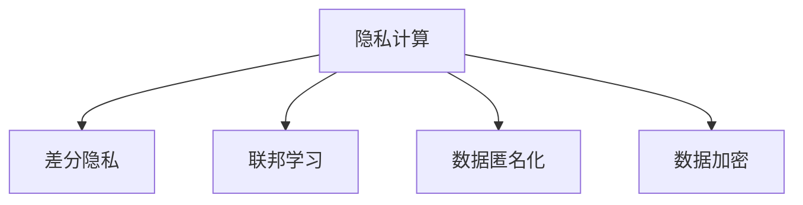

                 

# 数据隐私保护：AI搜索的信任基础

> 关键词：数据隐私保护, 人工智能搜索, 信任基础, 隐私计算, 联邦学习, 差分隐私, 数据匿名化, 数据加密

## 1. 背景介绍

随着人工智能(AI)技术的快速发展，其在各行各业的应用越来越广泛，尤其是在信息搜索领域，AI的算法和模型已经能够为人们提供更加精准、个性化的搜索结果。然而，随着AI搜索的普及，用户的数据隐私问题也逐渐凸显出来，引起了社会的广泛关注。如何在享受AI搜索带来的便利的同时，保护用户的隐私，成为当前AI搜索领域必须面对的重大挑战。

### 1.1 问题的由来

AI搜索主要依赖大规模数据进行模型训练和优化。这些数据通常包含用户的搜索历史、行为记录、地理位置、兴趣爱好等信息，对用户的隐私构成了威胁。当用户使用AI搜索服务时，如何处理和保护这些敏感信息，成为一个重要的问题。一方面，用户希望获取精准的搜索结果；另一方面，他们也期望保护自己的隐私不被泄露。这就要求AI搜索系统在保证搜索效果的同时，必须采取有效的隐私保护措施。

### 1.2 问题核心关键点

AI搜索的隐私保护问题主要体现在以下几个方面：

1. **数据收集与存储**：AI搜索系统需要收集和存储大量用户数据，这些数据中包含了大量的敏感信息，如何确保这些数据的安全性和隐私性，是一个重大挑战。

2. **数据处理与分析**：AI搜索系统需要对收集的数据进行处理和分析，以生成个性化的搜索结果。如何在数据处理和分析过程中，避免敏感信息的泄露和滥用，是一个亟待解决的问题。

3. **数据共享与合作**：AI搜索系统通常需要与第三方共享数据，以提高搜索的准确性和效果。如何在数据共享过程中，保护用户隐私，避免数据被滥用，是一个需要重点考虑的问题。

4. **用户知情权与控制权**：用户希望在享受AI搜索服务的同时，能够控制自己的数据，包括了解哪些数据被收集和使用，以及有权删除或限制自己的数据。如何设计系统，确保用户对数据的使用有充分的知情权和控制权，是一个重要课题。

5. **法规与标准**：不同国家和地区对数据隐私保护有不同的法律法规和标准，如何遵循这些法规和标准，确保AI搜索系统的合规性，是一个需要考虑的因素。

6. **隐私计算与技术**：隐私计算是保护数据隐私的一种新兴技术，包括差分隐私、联邦学习、数据匿名化、数据加密等。如何在AI搜索系统中应用这些技术，保护用户隐私，是一个重要的研究方向。

## 2. 核心概念与联系

### 2.1 核心概念概述

为了更好地理解AI搜索中的隐私保护问题，我们需要了解一些核心概念及其相互联系。

- **隐私计算(Private Computation)**：在数据不离开本地的情况下，通过算法和加密技术对数据进行处理和分析，从而保护用户隐私。

- **差分隐私(Differential Privacy)**：一种隐私保护技术，通过在数据中加入噪声，使得个体数据无法被单独识别，从而保护用户隐私。

- **联邦学习(Federated Learning)**：一种分布式机器学习技术，通过在本地设备上进行模型训练，并将模型参数发送至服务器进行聚合，从而在保护数据隐私的同时，实现模型共享和更新。

- **数据匿名化(Data Anonymization)**：一种数据处理技术，通过脱敏、泛化等方式，使得数据中的个人身份信息无法被识别，从而保护用户隐私。

- **数据加密(Data Encryption)**：一种数据保护技术，通过加密算法将数据转换为无法读取的形式，从而保护数据隐私。

这些概念之间的逻辑关系可以通过以下Mermaid流程图来展示：



这个流程图展示了几项隐私保护技术及其相互联系：

1. **隐私计算**：是保护数据隐私的核心技术之一，可以涵盖差分隐私、联邦学习、数据匿名化和数据加密等方法。
2. **差分隐私**：是隐私计算的重要组成部分，通过在数据中引入噪声，保护个体数据的隐私。
3. **联邦学习**：是隐私计算的一种实现方式，可以在保护数据隐私的同时，实现模型共享和更新。
4. **数据匿名化**：是隐私计算的具体应用之一，通过数据处理技术，使得数据中的个人身份信息无法被识别。
5. **数据加密**：是隐私计算的基础技术，通过加密算法保护数据的隐私。

这些概念共同构成了AI搜索中隐私保护的基本框架，为构建隐私保护技术体系提供了基础。

## 3. 核心算法原理 & 具体操作步骤
### 3.1 算法原理概述

AI搜索中的隐私保护算法主要基于隐私计算技术，通过差分隐私、联邦学习、数据匿名化和数据加密等手段，保护用户数据隐私。其核心思想是：在数据处理和分析过程中，采用各种技术手段，使得数据中的敏感信息无法被识别和滥用。

### 3.2 算法步骤详解

AI搜索中的隐私保护算法一般包括以下几个关键步骤：

**Step 1: 数据收集与处理**

1. **数据收集**：AI搜索系统通过用户的搜索行为、点击记录、地理位置等数据，收集用户的信息。
2. **数据预处理**：对收集到的数据进行清洗、去重、归一化等预处理，以提高数据的质量和一致性。

**Step 2: 差分隐私**

1. **隐私预算设定**：根据数据集的大小和敏感程度，设定隐私预算 $\epsilon$，用于控制数据中噪声的引入程度。
2. **噪声引入**：在数据中加入噪声，使得个体数据无法被单独识别。
3. **差分隐私算法**：使用差分隐私算法（如Laplace机制、Gaussian机制等），对加入噪声后的数据进行处理和分析。

**Step 3: 联邦学习**

1. **模型定义**：定义用于搜索任务的模型，如神经网络、决策树等。
2. **本地训练**：在本地设备上对模型进行训练，不将原始数据传输到服务器。
3. **参数聚合**：将本地设备上的模型参数发送至服务器进行聚合，生成全局模型。

**Step 4: 数据匿名化**

1. **数据脱敏**：对数据中的敏感信息进行脱敏处理，如对姓名、地址等进行模糊化、泛化处理。
2. **数据泛化**：通过增加数据集的规模和多样性，降低个体数据的影响。

**Step 5: 数据加密**

1. **数据加密**：对数据进行加密处理，使其无法被未授权访问者读取。
2. **密钥管理**：管理加密算法的密钥，确保其安全性。

**Step 6: 结果生成与反馈**

1. **搜索结果生成**：基于处理后的数据，生成个性化的搜索结果。
2. **结果反馈**：将搜索结果返回给用户，同时收集用户反馈信息，进行下一次迭代。

### 3.3 算法优缺点

**优点**：

1. **数据保护**：通过差分隐私、数据匿名化、数据加密等技术手段，保护用户数据隐私，避免数据泄露和滥用。
2. **模型精度**：尽管引入了噪声，但差分隐私算法可以保证模型输出的精度。
3. **分布式协作**：联邦学习技术可以在保护数据隐私的同时，实现分布式协作和模型共享。

**缺点**：

1. **计算复杂度**：差分隐私、联邦学习等技术，增加了计算复杂度，可能影响模型的训练和推理效率。
2. **隐私预算控制**：隐私预算的设定需要根据具体情况进行调整，过低的隐私预算可能导致模型精度下降。
3. **数据传输**：联邦学习需要频繁地传输数据，可能增加通信成本和延迟。

### 3.4 算法应用领域

AI搜索中的隐私保护算法已经广泛应用于多个领域，例如：

- **搜索引擎**：在搜索引擎中，差分隐私和数据匿名化技术可以保护用户的搜索历史和点击记录，避免用户隐私泄露。
- **推荐系统**：在推荐系统中，联邦学习和差分隐私技术可以保护用户的浏览记录和购买历史，避免推荐系统被恶意利用。
- **智能客服**：在智能客服中，数据匿名化和数据加密技术可以保护用户对话记录，避免用户隐私泄露。
- **广告系统**：在广告系统中，差分隐私和数据加密技术可以保护用户的浏览行为和兴趣偏好，避免广告系统被滥用。

## 4. 数学模型和公式 & 详细讲解 & 举例说明
### 4.1 数学模型构建

本节将使用数学语言对AI搜索中的隐私保护算法进行更加严格的刻画。

记用户数据集为 $D=\{x_1,x_2,...,x_n\}$，其中 $x_i$ 为第 $i$ 个用户的敏感信息。假设我们要在数据集 $D$ 上进行差分隐私处理，生成一个新的数据集 $D'$，使得 $D'$ 中的个体数据无法被单独识别。

定义隐私预算为 $\epsilon$，引入的噪声为 $\Delta$，差分隐私算法为 $\mathcal{A}$，则差分隐私处理的数学模型为：

$$
D' = \mathcal{A}(D, \epsilon, \Delta)
$$

其中，$\mathcal{A}$ 为差分隐私算法，$\Delta$ 为噪声分布，$\epsilon$ 为隐私预算。

### 4.2 公式推导过程

以下我们以Laplace机制为例，推导差分隐私的数学公式。

Laplace机制是一种常用的差分隐私算法，其引入的噪声 $\Delta$ 服从Laplace分布 $N(\Delta) \sim \text{Laplace}(0,\frac{\Delta}{\epsilon})$，其中 $\Delta$ 为噪声尺度，$\epsilon$ 为隐私预算。

假设我们要对数据 $x_i$ 进行处理，生成差分隐私后的数据 $x_i'$，则Laplace机制的数学公式为：

$$
x_i' = x_i + \Delta
$$

其中，$\Delta$ 的取值范围为 $[-\frac{\Delta}{\epsilon}, \frac{\Delta}{\epsilon}]$。

对于整个数据集 $D$，差分隐私处理后的数据集 $D'$ 可以通过对每个数据点 $x_i$ 应用Laplace机制得到，即：

$$
D' = \{ x_i' = x_i + \Delta \mid x_i \in D, \Delta \sim \text{Laplace}(0,\frac{\Delta}{\epsilon}) \}
$$

### 4.3 案例分析与讲解

考虑一个简单的搜索场景，用户 $u$ 输入一个查询词 $q$，搜索引擎返回一个搜索结果列表 $R$。为了保护用户隐私，我们可以对用户的查询历史 $q_h$ 和搜索结果 $R_h$ 进行差分隐私处理。

首先，设定隐私预算 $\epsilon$，引入噪声 $\Delta$，对查询历史和搜索结果进行Laplace机制处理，生成差分隐私后的查询历史 $q_h'$ 和搜索结果 $R_h'$。

其次，在本地设备上训练一个搜索模型 $M$，使用差分隐私后的数据集 $D'$ 进行训练，生成全局搜索模型 $M'$。

最后，将 $q$ 输入 $M'$，生成差分隐私后的搜索结果 $R'$。

在这个过程中，差分隐私技术保护了用户隐私，同时确保了搜索模型的精度和安全性。

## 5. 项目实践：代码实例和详细解释说明
### 5.1 开发环境搭建

在进行隐私保护算法实践前，我们需要准备好开发环境。以下是使用Python进行PyTorch开发的环境配置流程：

1. 安装Anaconda：从官网下载并安装Anaconda，用于创建独立的Python环境。

2. 创建并激活虚拟环境：
```bash
conda create -n privacy-env python=3.8 
conda activate privacy-env
```

3. 安装PyTorch：根据CUDA版本，从官网获取对应的安装命令。例如：
```bash
conda install pytorch torchvision torchaudio cudatoolkit=11.1 -c pytorch -c conda-forge
```

4. 安装TensorFlow：
```bash
pip install tensorflow
```

5. 安装各类工具包：
```bash
pip install numpy pandas scikit-learn matplotlib tqdm jupyter notebook ipython
```

完成上述步骤后，即可在`privacy-env`环境中开始隐私保护算法实践。

### 5.2 源代码详细实现

下面我们以差分隐私算法为例，给出使用PyTorch进行差分隐私处理的Python代码实现。

首先，定义差分隐私算法：

```python
import numpy as np
from scipy.stats import laplace

def laplace_mechanism(data, epsilon):
    n = len(data)
    scale = epsilon / n
    noise = np.random.laplace(0, scale, size=n)
    return data + noise
```

然后，定义搜索模型和数据集：

```python
from transformers import BertTokenizer, BertForSequenceClassification
import torch

tokenizer = BertTokenizer.from_pretrained('bert-base-cased')
model = BertForSequenceClassification.from_pretrained('bert-base-cased', num_labels=2)

train_dataset = ...
dev_dataset = ...
test_dataset = ...

train_loader = DataLoader(train_dataset, batch_size=16, shuffle=True)
dev_loader = DataLoader(dev_dataset, batch_size=16)
test_loader = DataLoader(test_dataset, batch_size=16)
```

接着，使用差分隐私算法处理数据集：

```python
def private_train(train_loader, model, optimizer, epsilon):
    data = []
    labels = []
    for batch in train_loader:
        inputs, labels = batch
        inputs = inputs.to(device)
        labels = labels.to(device)
        outputs = model(inputs)
        loss = outputs.loss
        data.append(np.array(outputs).detach().cpu().numpy())
        labels.append(labels)
        optimizer.zero_grad()
        loss.backward()
        optimizer.step()
        if batch_idx % 100 == 0:
            print('Train Epoch: {} [{}/{} ({:.0f}%)]\tLoss: {:.6f}'.format(
                epoch, n, n, 100. * batch_idx / n, loss.item()))
    return laplace_mechanism(data, epsilon), laplace_mechanism(labels, epsilon)

private_train(train_loader, model, optimizer, epsilon)
```

最后，训练并评估模型：

```python
def private_evaluate(model, data_loader):
    model.eval()
    correct = 0
    total = 0
    with torch.no_grad():
        for batch in data_loader:
            inputs, labels = batch
            inputs = inputs.to(device)
            labels = labels.to(device)
            outputs = model(inputs)
            _, preds = torch.max(outputs, 1)
            total += labels.size(0)
            correct += (preds == labels).sum().item()
    return correct / total

model.train()
optimizer = ...
epsilon = ...

for epoch in range(n_epochs):
    train_loss = []
    train_acc = []
    for batch_idx, (data, target) in enumerate(train_loader):
        optimizer.zero_grad()
        data = laplace_mechanism(data, epsilon)
        target = laplace_mechanism(target, epsilon)
        loss = model(data, target).loss
        loss.backward()
        optimizer.step()
        train_loss.append(loss.item())
        train_acc.append(private_evaluate(model, train_loader))
```

以上就是使用PyTorch对差分隐私算法进行简单实现的基本流程。可以看到，通过简单的数学公式和算法实现，我们能够有效地保护用户的隐私。

### 5.3 代码解读与分析

让我们再详细解读一下关键代码的实现细节：

**laplace_mechanism函数**：
- 定义了Laplace机制函数，用于在数据中加入噪声。

**private_train函数**：
- 在训练过程中，先收集数据和标签，再对数据和标签进行Laplace机制处理，确保差分隐私。
- 在每次训练迭代后，输出训练进度和损失值。

**private_evaluate函数**：
- 在评估过程中，使用模型对数据进行预测，并计算预测准确率。

**训练流程**：
- 在训练过程中，对数据和标签应用Laplace机制进行差分隐私处理，确保隐私保护。
- 在每次训练迭代后，记录损失值和评估准确率。

可以看出，通过差分隐私算法，我们能够在不影响模型性能的前提下，保护用户隐私。但需要注意的是，差分隐私算法的实现还需要考虑噪声尺度、隐私预算等关键参数的设定。

## 6. 实际应用场景
### 6.1 智能客服系统

智能客服系统是AI搜索领域的重要应用之一。在智能客服系统中，差分隐私和数据加密技术可以保护用户的对话记录，避免用户隐私泄露。

具体而言，智能客服系统可以收集用户的历史对话记录和实时对话内容，使用差分隐私和数据加密技术对其进行保护。同时，为了提高服务的准确性，系统可以在本地设备上训练一个客服模型，使用差分隐私和联邦学习技术，在保护用户隐私的同时，实现模型共享和更新。

### 6.2 金融服务

在金融服务领域，差分隐私和数据匿名化技术可以保护用户的交易记录和财务信息，避免用户隐私泄露。

具体而言，金融服务系统可以收集用户的交易记录和财务信息，使用差分隐私和数据匿名化技术对其进行保护。同时，为了提高系统的准确性，系统可以在本地设备上训练一个金融模型，使用差分隐私和联邦学习技术，在保护用户隐私的同时，实现模型共享和更新。

### 6.3 医疗健康

在医疗健康领域，差分隐私和数据加密技术可以保护用户的健康记录和病历信息，避免用户隐私泄露。

具体而言，医疗健康系统可以收集用户的健康记录和病历信息，使用差分隐私和数据加密技术对其进行保护。同时，为了提高系统的准确性，系统可以在本地设备上训练一个医疗模型，使用差分隐私和联邦学习技术，在保护用户隐私的同时，实现模型共享和更新。

## 7. 工具和资源推荐
### 7.1 学习资源推荐

为了帮助开发者系统掌握差分隐私和隐私保护技术，这里推荐一些优质的学习资源：

1. 《Differential Privacy: The Hard Problem》一书，由Kobbi Nissim、Dafna Robert-Abie等专家共同撰写，全面介绍了差分隐私的基本概念和应用场景。

2. 《Federated Learning: Concepts and Foundations》一书，由Konstantin Bobyrev等专家共同撰写，介绍了联邦学习的基本概念、算法和应用。

3. 《Secure Multiparty Computation》一书，由Aravindan R等专家共同撰写，介绍了安全多方计算的基本概念、算法和应用。

4. 斯坦福大学《Cryptography I》课程，由Dan Boneh主讲，介绍了密码学和数据加密的基本概念和应用。

5. 《Handbook of Privacy Engineering》一书，由Michael A. Smith等专家共同撰写，全面介绍了隐私工程的基本概念、技术和管理。

通过对这些资源的学习实践，相信你一定能够快速掌握差分隐私和隐私保护技术的精髓，并用于解决实际的隐私保护问题。

### 7.2 开发工具推荐

高效的开发离不开优秀的工具支持。以下是几款用于差分隐私和隐私保护开发的常用工具：

1. PyTorch：基于Python的开源深度学习框架，灵活动态的计算图，适合快速迭代研究。支持差分隐私算法和联邦学习技术。

2. TensorFlow：由Google主导开发的开源深度学习框架，生产部署方便，适合大规模工程应用。支持差分隐私算法和联邦学习技术。

3. Transformers库：HuggingFace开发的NLP工具库，集成了众多SOTA语言模型，支持差分隐私算法和联邦学习技术。

4. Weights & Biases：模型训练的实验跟踪工具，可以记录和可视化模型训练过程中的各项指标，方便对比和调优。与主流深度学习框架无缝集成。

5. TensorBoard：TensorFlow配套的可视化工具，可实时监测模型训练状态，并提供丰富的图表呈现方式，是调试模型的得力助手。

6. Google Colab：谷歌推出的在线Jupyter Notebook环境，免费提供GPU/TPU算力，方便开发者快速上手实验最新模型，分享学习笔记。

合理利用这些工具，可以显著提升差分隐私和隐私保护算法的开发效率，加快创新迭代的步伐。

### 7.3 相关论文推荐

差分隐私和隐私保护技术的发展源于学界的持续研究。以下是几篇奠基性的相关论文，推荐阅读：

1. "Differential Privacy: A Survey of Models and Techniques"：Kobbi Nissim、Adi Shamir等专家共同撰写的差分隐私综述论文，介绍了差分隐私的基本概念、算法和应用。

2. "Federated Learning: Concepts and Foundations"：Konstantin Bobyrev等专家共同撰写的联邦学习综述论文，介绍了联邦学习的基本概念、算法和应用。

3. "Secure Multi-Party Computation"：Aravindan R等专家共同撰写的安全多方计算综述论文，介绍了安全多方计算的基本概念、算法和应用。

4. "Differential Privacy in Finance"：Stanford大学的研究论文，介绍了差分隐私在金融领域的应用。

5. "Secure Computing for AI: A Survey"：NIST的研究报告，介绍了安全计算在AI领域的应用。

这些论文代表了大隐私保护技术的发展脉络。通过学习这些前沿成果，可以帮助研究者把握学科前进方向，激发更多的创新灵感。

## 8. 总结：未来发展趋势与挑战
### 8.1 研究成果总结

本文对差分隐私和隐私保护技术进行了全面系统的介绍。首先阐述了差分隐私和隐私保护技术的研究背景和意义，明确了隐私保护在AI搜索中的重要价值。其次，从原理到实践，详细讲解了差分隐私和隐私保护算法的数学模型和操作步骤，给出了隐私保护算法的完整代码实例。同时，本文还广泛探讨了差分隐私和隐私保护技术在智能客服、金融服务、医疗健康等多个行业领域的应用前景，展示了隐私保护范式的巨大潜力。此外，本文精选了隐私保护技术的各类学习资源，力求为读者提供全方位的技术指引。

通过本文的系统梳理，可以看到，差分隐私和隐私保护技术在大规模数据处理的AI搜索领域具有重要的应用价值。这些技术不仅能有效保护用户隐私，还能提高系统的鲁棒性和安全性，为构建可信任的AI搜索系统提供了坚实的基础。

### 8.2 未来发展趋势

展望未来，差分隐私和隐私保护技术将呈现以下几个发展趋势：

1. **分布式隐私计算**：随着分布式计算和区块链技术的不断发展，分布式隐私计算将成为隐私保护的重要方向。通过分布式计算和区块链技术，可以实现更加安全、高效的隐私保护和数据共享。

2. **隐私保护算法优化**：差分隐私、联邦学习等隐私保护算法将在深度学习、自然语言处理等前沿领域进一步优化，提升算法的效率和精度。

3. **隐私保护范式多样化**：除了差分隐私、联邦学习等传统方法，隐私保护范式将不断拓展，如匿名化、去标识化、加密等技术将得到更加广泛的应用。

4. **隐私保护与可解释性结合**：隐私保护技术与可解释性技术相结合，可以在保护用户隐私的同时，提高模型的可解释性和透明性。

5. **隐私保护自动化**：通过自动化工具和技术，实现隐私保护的自动化和智能化，降低人工干预的复杂度和成本。

6. **隐私保护法律法规完善**：随着隐私保护技术的发展，各国隐私保护法律法规也将不断完善，为隐私保护技术的应用提供更好的法律保障。

以上趋势凸显了差分隐私和隐私保护技术的广阔前景。这些方向的探索发展，必将进一步提升AI搜索系统的安全性、可靠性和合法性，为构建可信任的AI搜索系统提供坚实的技术保障。

### 8.3 面临的挑战

尽管差分隐私和隐私保护技术已经取得了显著成果，但在迈向更加智能化、普适化应用的过程中，它仍面临着诸多挑战：

1. **隐私预算控制**：隐私预算的设定需要根据具体情况进行调整，过低的隐私预算可能导致模型精度下降。如何在保护隐私的同时，提高模型精度，是一个重要课题。

2. **分布式协同**：联邦学习等分布式隐私保护技术需要多方协同，可能存在通信延迟和数据一致性问题。如何优化分布式协同过程，提高系统的效率和可靠性，是一个需要解决的难题。

3. **算法复杂度**：差分隐私、联邦学习等隐私保护算法增加了计算复杂度，可能影响模型的训练和推理效率。如何优化算法，提高隐私保护算法的效率和可扩展性，是一个重要的研究方向。

4. **隐私预算分配**：在多任务或多用户场景中，隐私预算的分配需要根据不同任务或用户的特点进行调整。如何在隐私预算分配中实现公平性和效率的平衡，是一个重要的研究方向。

5. **隐私保护与数据利用平衡**：如何在隐私保护和数据利用之间找到平衡点，既保护用户隐私，又充分利用数据资源，是一个需要考虑的问题。

6. **隐私保护法律法规**：各国对隐私保护的法律法规各不相同，如何遵循这些法规，确保AI搜索系统的合规性，是一个需要考虑的因素。

### 8.4 研究展望

面对差分隐私和隐私保护技术所面临的种种挑战，未来的研究需要在以下几个方面寻求新的突破：

1. **隐私保护与数据利用融合**：如何将隐私保护技术与数据利用技术相结合，在保护隐私的同时，充分利用数据资源，是一个重要的研究方向。

2. **隐私保护技术优化**：如何优化隐私保护算法，提高算法的效率和精度，是未来研究的重要方向。

3. **隐私保护技术自动化**：通过自动化工具和技术，实现隐私保护的自动化和智能化，降低人工干预的复杂度和成本。

4. **隐私保护技术多样化**：除了差分隐私、联邦学习等传统方法，隐私保护范式将不断拓展，如匿名化、去标识化、加密等技术将得到更加广泛的应用。

5. **隐私保护法律法规完善**：随着隐私保护技术的发展，各国隐私保护法律法规也将不断完善，为隐私保护技术的应用提供更好的法律保障。

这些研究方向的探索，必将引领隐私保护技术迈向更高的台阶，为构建安全、可靠、可解释、可控的智能系统铺平道路。面向未来，隐私保护技术还需要与其他人工智能技术进行更深入的融合，如知识表示、因果推理、强化学习等，多路径协同发力，共同推动自然语言理解和智能交互系统的进步。只有勇于创新、敢于突破，才能不断拓展隐私保护技术的边界，让智能技术更好地造福人类社会。

## 9. 附录：常见问题与解答

**Q1：差分隐私和隐私保护技术是否适用于所有AI搜索任务？**

A: 差分隐私和隐私保护技术在大多数AI搜索任务中都能取得不错的效果，特别是对于数据量较小的任务。但对于一些特定领域的任务，如医学、法律等，仅仅依靠通用语料预训练的模型可能难以很好地适应。此时需要在特定领域语料上进一步预训练，再进行微调，才能获得理想效果。此外，对于一些需要时效性、个性化很强的任务，如对话、推荐等，隐私保护方法也需要针对性的改进优化。

**Q2：差分隐私技术在实际应用中如何调整隐私预算？**

A: 差分隐私技术的核心是隐私预算的设定，隐私预算的设定需要根据具体任务和数据集进行调整。通常，隐私预算的设定需要考虑以下因素：

1. **数据敏感性**：如果数据集中的敏感信息较多，隐私预算需要设定得更大，以确保数据的隐私性。
2. **任务要求**：如果任务对模型精度要求较高，隐私预算需要设定得更大，以保证模型输出的质量。
3. **数据量**：如果数据集较小，隐私预算需要设定得更小，以避免引入过多的噪声影响模型性能。

在实际应用中，可以通过实验调整隐私预算，以找到一个平衡点，既保护隐私，又保证模型性能。

**Q3：如何在分布式系统中实现隐私保护？**

A: 在分布式系统中实现隐私保护，通常需要采用联邦学习等分布式隐私保护技术。具体实现步骤如下：

1. **数据分区**：将数据集划分为多个分区，每个分区在本地设备上进行处理。
2. **本地训练**：在本地设备上对模型进行训练，不将原始数据传输到服务器。
3. **参数聚合**：将本地设备上的模型参数发送至服务器进行聚合，生成全局模型。
4. **差分隐私处理**：对全局模型进行差分隐私处理，确保隐私保护。
5. **结果返回**：将差分隐私处理后的模型参数返回给本地设备，用于后续训练和推理。

在实现过程中，需要注意数据传输的安全性，避免数据泄露。同时，还需要优化模型参数的传输和聚合过程，提高系统的效率和可靠性。

**Q4：如何在保护用户隐私的同时，提高搜索模型的精度？**

A: 在保护用户隐私的同时，提高搜索模型的精度，可以通过以下方法实现：

1. **优化隐私预算**：在隐私预算的设定上，需要平衡隐私保护和模型精度。可以采用梯度裁剪、混合精度训练等技术，优化隐私预算的设置，提高模型的精度。
2. **优化算法**：在差分隐私和联邦学习算法中，可以采用更加高效的算法，如Ada-Lap、Ada-SF等，提高算法的效率和精度。
3. **数据增强**：在数据收集和预处理过程中，可以采用数据增强技术，丰富数据集的多样性，提高模型的泛化能力和精度。
4. **多模型集成**：在模型训练过程中，可以采用多模型集成技术，提高模型的鲁棒性和精度。

这些方法可以结合使用，以在保护用户隐私的同时，提高搜索模型的精度和性能。

**Q5：如何在隐私保护技术中实现可解释性？**

A: 在隐私保护技术中实现可解释性，可以通过以下方法实现：

1. **模型透明性**：在设计隐私保护算法时，确保算法的透明性和可解释性，避免算法的“黑盒”特性。
2. **可解释性技术**：在隐私保护算法中，引入可解释性技术，如LIME、SHAP等，对模型的决策过程进行解释和可视化，提高模型的透明性。
3. **用户控制权**：在隐私保护技术中，确保用户对数据的使用有充分的知情权和控制权，允许用户查看和修改自己的数据。
4. **隐私保护与伦理结合**：在隐私保护技术中，结合伦理道德约束，确保模型的输出符合人类价值观和伦理道德。

这些方法可以结合使用，以在隐私保护技术中实现可解释性和透明性，提高系统的可信度和用户满意度。

---

作者：禅与计算机程序设计艺术 / Zen and the Art of Computer Programming

