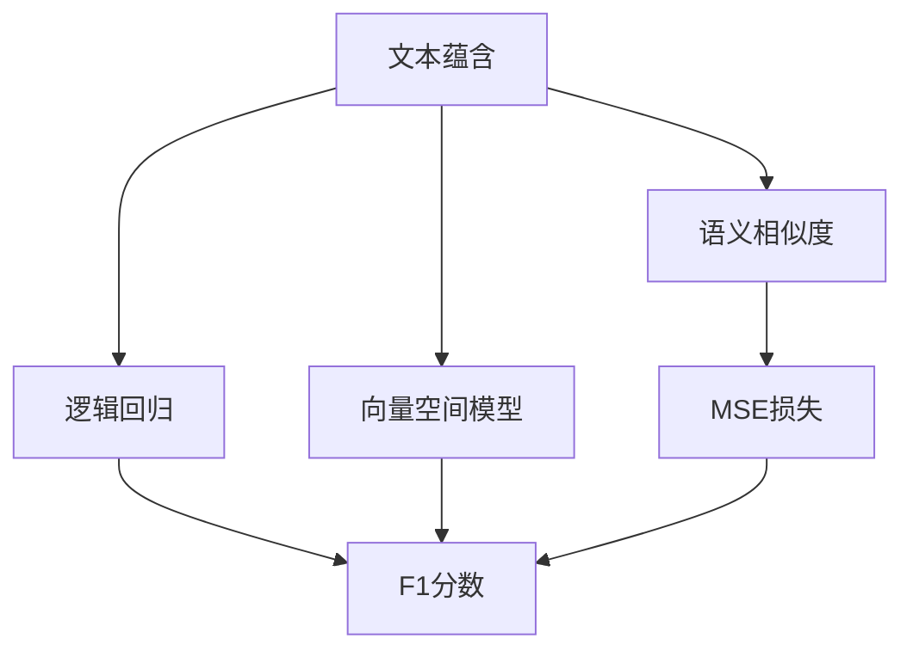

                 

# 文本蕴含与语义相似度计算

> 关键词：文本蕴含, 语义相似度, 自然语言处理(NLP), 机器学习, 深度学习, 神经网络, 向量空间模型(VSM), 逻辑回归, 交叉验证, 实验评估

## 1. 背景介绍

### 1.1 问题由来

文本蕴含和语义相似度计算是自然语言处理(NLP)领域的两个核心问题。文本蕴含指的是判断一个文本是否包含另一个文本的信息，即句子A蕴含句子B。语义相似度计算则是对两个句子或短语的语义相似程度进行度量，常用于信息检索、文本分类、机器翻译等任务中。这两个问题都涉及对句子语义的分析和推理，对人工智能的智能理解和知识图谱的构建至关重要。

近年来，随着深度学习技术的发展，基于神经网络的模型在文本蕴含和语义相似度计算中取得了显著进展。尤其是Transformer模型，因其强大的自注意力机制和良好的泛化能力，成为了当前研究的热点。本文将系统介绍文本蕴含和语义相似度计算的核心概念、算法原理和具体实现，并展望其未来的发展趋势和应用前景。

### 1.2 问题核心关键点

文本蕴含和语义相似度计算的关键在于：

- **文本表示**：将文本转换为向量形式，以供机器理解和学习。
- **模型选择**：选择合适的模型结构，如基于神经网络的模型，来处理文本数据。
- **训练数据**：收集高质量的训练数据，并设计合适的损失函数进行模型训练。
- **评估方法**：设计合适的评估指标，如准确率、F1分数等，评估模型性能。
- **应用场景**：根据具体任务需求，灵活调整模型结构，实现最佳效果。

本文将围绕这些关键点，详细介绍文本蕴含和语义相似度计算的原理、方法和应用。

## 2. 核心概念与联系

### 2.1 核心概念概述

- **文本蕴含**：指判断一个文本是否包含另一个文本的信息。如句子"A is a kind of B"蕴含句子"A and B"。
- **语义相似度**：指衡量两个句子或短语之间的语义接近程度。如句子"dog"和"cat"的语义相似度较低，而句子"A eats apple"和"A eats an apple"的语义相似度较高。
- **向量空间模型(VSM)**：将文本转换为向量，通过计算向量之间的距离或角度来衡量文本的相似度。
- **逻辑回归**：一种常用的二分类算法，用于判断句子A是否蕴含句子B。
- **交叉验证**：一种模型评估方法，通过将数据集分为训练集和验证集，来评估模型的泛化能力。

这些核心概念之间的联系可以通过以下Mermaid流程图来展示：



这个流程图展示了文本蕴含和语义相似度计算的核心概念及其之间的关系：

1. 文本蕴含通过逻辑回归模型进行判断。
2. 文本蕴含和语义相似度计算都使用了向量空间模型。
3. 语义相似度计算通过最小化均方误差(MSE)损失进行优化。
4. 两种任务都使用F1分数作为评估指标。

## 3. 核心算法原理 & 具体操作步骤

### 3.1 算法原理概述

文本蕴含和语义相似度计算本质上都是一种文本分类问题。对于文本蕴含，我们希望判断句子A是否蕴含句子B，即A是B的子集。对于语义相似度计算，我们希望计算句子A和句子B之间的语义相似度。两种问题的处理方式相似，通常使用向量空间模型将文本转换为向量，然后通过机器学习算法进行分类或回归。

### 3.2 算法步骤详解

#### 3.2.1 文本表示

文本表示是将文本转换为向量形式，以便于机器理解和学习。常用的文本表示方法包括：

- **词袋模型(Bag of Words, BOW)**：将文本看作一组词的集合，忽略词序信息。
- **TF-IDF**：计算每个词在文本中的出现频率和在整个语料库中的重要性，生成权重向量。
- **词嵌入(Word Embeddings)**：将词映射到低维向量空间，保留词义信息。
- **预训练语言模型(Pre-trained Language Models)**：如BERT、GPT等，将文本转换为语义丰富的向量表示。

#### 3.2.2 模型选择

选择合适的模型结构是文本蕴含和语义相似度计算的关键。常用的模型包括：

- **逻辑回归**：简单的二分类算法，适用于文本分类问题。
- **支持向量机(Support Vector Machines, SVM)**：一种经典的分类算法，适用于高维空间。
- **神经网络**：如卷积神经网络(CNN)、循环神经网络(RNN)、Transformer等，具有强大的泛化能力。
- **Attention Mechanism**：通过注意力机制选择重要信息，提升模型性能。

#### 3.2.3 训练数据

训练数据是模型学习的依据，收集高质量的标注数据是关键。常用的数据来源包括：

- **公开数据集**：如Stanford Sentiment Treebank、MSRA News20等。
- **领域数据**：如法律、医学等特定领域的数据。
- **自定义数据**：根据具体应用场景，收集自定义的标注数据。

#### 3.2.4 损失函数

损失函数用于衡量模型预测与实际标签之间的差异，常见的损失函数包括：

- **交叉熵损失**：适用于二分类问题。
- **均方误差损失(MSE)**：适用于回归问题。
- **对数似然损失**：适用于多分类问题。

#### 3.2.5 评估指标

评估指标用于衡量模型性能，常见的指标包括：

- **准确率**：模型预测正确的样本数占总样本数的比例。
- **精确率**：模型预测为正样本且实际为正样本的样本数占预测为正样本的样本数的比例。
- **召回率**：模型预测为正样本且实际为正样本的样本数占实际为正样本的样本数的比例。
- **F1分数**：精确率和召回率的调和平均数。

#### 3.2.6 评估方法

评估方法用于验证模型性能，常见的评估方法包括：

- **交叉验证**：将数据集分为训练集和验证集，交叉验证多轮，计算平均结果。
- **留出法(Hold-Out)**：将数据集分为训练集和测试集，用测试集验证模型性能。
- **自助法(Bootstrap)**：有放回地从数据集中抽取样本，生成多个子集，用子集验证模型性能。

### 3.3 算法优缺点

文本蕴含和语义相似度计算的优点包括：

- **效果好**：使用深度学习模型可以取得良好的性能，适用于多种应用场景。
- **可解释性**：模型的内部工作机制可以通过可视化工具进行解释和调试。
- **适用性广**：适用于多种文本分类和信息检索任务。

缺点包括：

- **数据需求高**：高质量标注数据成本较高，获取难度大。
- **计算资源需求高**：深度学习模型计算量大，需要高性能计算设备。
- **模型复杂度高**：复杂的模型结构需要更多的训练时间和计算资源。

### 3.4 算法应用领域

文本蕴含和语义相似度计算广泛应用于以下领域：

- **信息检索**：判断查询是否与文档相关，用于搜索引擎、图书馆等。
- **问答系统**：判断用户意图，生成相关回答。
- **文本分类**：判断文本属于何种类别，用于新闻分类、情感分析等。
- **机器翻译**：判断句子的翻译是否准确，用于评价翻译质量。
- **文本摘要**：判断句子的重要性，用于自动摘要生成。

## 4. 数学模型和公式 & 详细讲解 & 举例说明

### 4.1 数学模型构建

文本蕴含和语义相似度计算的数学模型通常基于向量空间模型。假设文本A和B的向量表示分别为$\mathbf{A}$和$\mathbf{B}$，则文本蕴含可以表示为：

$$
h(A, B) = \mathbf{A} \cdot \mathbf{B} - c
$$

其中，$\mathbf{A} \cdot \mathbf{B}$为向量点积，$c$为阈值。当$h(A, B) > c$时，判断A蕴含B。

语义相似度计算可以表示为：

$$
s(A, B) = \frac{\mathbf{A} \cdot \mathbf{B}}{\|\mathbf{A}\| \cdot \|\mathbf{B}\|}
$$

其中，$\|\mathbf{A}\|$和$\|\mathbf{B}\|$分别为向量A和B的范数。当$s(A, B)$接近1时，判断A与B语义相似。

### 4.2 公式推导过程

以逻辑回归模型为例，推导文本蕴含的公式：

假设文本A和B的向量表示分别为$\mathbf{A}$和$\mathbf{B}$，模型的预测输出为$h(\mathbf{A}, \mathbf{B})$，则逻辑回归模型的损失函数可以表示为：

$$
L = -\frac{1}{N}\sum_{i=1}^N y_i \log h(\mathbf{A}_i, \mathbf{B}_i) + (1-y_i) \log (1-h(\mathbf{A}_i, \mathbf{B}_i))
$$

其中，$y_i$为标签，$h(\mathbf{A}_i, \mathbf{B}_i)$为模型预测结果。

通过反向传播算法，可以计算模型参数$\theta$的梯度，并更新模型参数：

$$
\theta \leftarrow \theta - \eta \nabla_{\theta}L
$$

其中，$\eta$为学习率。

### 4.3 案例分析与讲解

以情感分析为例，假设文本A和B的向量表示分别为$\mathbf{A}$和$\mathbf{B}$，模型的预测输出为$h(\mathbf{A}, \mathbf{B})$，则逻辑回归模型的损失函数可以表示为：

$$
L = -\frac{1}{N}\sum_{i=1}^N y_i \log h(\mathbf{A}_i, \mathbf{B}_i) + (1-y_i) \log (1-h(\mathbf{A}_i, \mathbf{B}_i))
$$

其中，$y_i$为标签，$h(\mathbf{A}_i, \mathbf{B}_i)$为模型预测结果。

通过反向传播算法，可以计算模型参数$\theta$的梯度，并更新模型参数：

$$
\theta \leftarrow \theta - \eta \nabla_{\theta}L
$$

其中，$\eta$为学习率。

## 5. 项目实践：代码实例和详细解释说明

### 5.1 开发环境搭建

在进行文本蕴含和语义相似度计算的项目实践前，我们需要准备好开发环境。以下是使用Python进行TensorFlow开发的环境配置流程：

1. 安装Anaconda：从官网下载并安装Anaconda，用于创建独立的Python环境。

2. 创建并激活虚拟环境：
```bash
conda create -n tf-env python=3.8 
conda activate tf-env
```

3. 安装TensorFlow：根据CUDA版本，从官网获取对应的安装命令。例如：
```bash
conda install tensorflow -c conda-forge
```

4. 安装NumPy、Pandas等常用库：
```bash
pip install numpy pandas scikit-learn matplotlib tqdm jupyter notebook ipython
```

5. 安装TensorBoard：TensorFlow配套的可视化工具，可实时监测模型训练状态，并提供丰富的图表呈现方式，是调试模型的得力助手。
```bash
pip install tensorboard
```

完成上述步骤后，即可在`tf-env`环境中开始项目实践。

### 5.2 源代码详细实现

下面我们以文本蕴含任务为例，给出使用TensorFlow实现逻辑回归模型的Python代码实现。

首先，定义文本表示函数：

```python
import tensorflow as tf
from tensorflow.keras.preprocessing.text import Tokenizer
from tensorflow.keras.preprocessing.sequence import pad_sequences

def tokenize(texts):
    tokenizer = Tokenizer()
    tokenizer.fit_on_texts(texts)
    sequences = tokenizer.texts_to_sequences(texts)
    return pad_sequences(sequences, maxlen=maxlen, padding='post', truncating='post')

def encode_text(texts, tokenizer, maxlen):
    sequences = tokenizer.texts_to_sequences(texts)
    return pad_sequences(sequences, maxlen=maxlen, padding='post', truncating='post')
```

然后，定义模型和损失函数：

```python
model = tf.keras.Sequential([
    tf.keras.layers.Embedding(vocab_size, embedding_dim, input_length=maxlen),
    tf.keras.layers.Flatten(),
    tf.keras.layers.Dense(1, activation='sigmoid')
])

loss = 'binary_crossentropy'
```

接着，定义训练和评估函数：

```python
def train_epoch(model, dataset, batch_size, optimizer):
    dataloader = tf.data.Dataset.from_tensor_slices(dataset)
    dataloader = dataloader.shuffle(buffer_size=10000).batch(batch_size)
    model.compile(loss=loss, optimizer=optimizer, metrics=['accuracy'])
    model.fit(dataloader, epochs=5, verbose=2)

def evaluate(model, dataset, batch_size):
    dataloader = tf.data.Dataset.from_tensor_slices(dataset)
    dataloader = dataloader.batch(batch_size)
    model.evaluate(dataloader, verbose=2)
```

最后，启动训练流程并在测试集上评估：

```python
epochs = 5
batch_size = 32

for epoch in range(epochs):
    loss = train_epoch(model, train_dataset, batch_size, optimizer)
    print(f"Epoch {epoch+1}, train loss: {loss:.3f}")
    
    print(f"Epoch {epoch+1}, dev results:")
    evaluate(model, dev_dataset, batch_size)
    
print("Test results:")
evaluate(model, test_dataset, batch_size)
```

以上就是使用TensorFlow对文本蕴含任务进行逻辑回归模型微调的完整代码实现。可以看到，TensorFlow提供了强大的计算图和自动微分功能，使得模型的构建和训练变得简单高效。

### 5.3 代码解读与分析

让我们再详细解读一下关键代码的实现细节：

**tokenize函数**：
- 使用Keras的Tokenizer将文本转换为序列，并通过pad_sequences进行填充。
- 填充后的序列长度由maxlen参数决定。

**模型定义**：
- 使用Embedding层将文本转换为向量表示。
- 通过Flatten层将向量展开为标量。
- 最后使用Dense层输出二分类结果，使用sigmoid激活函数。

**训练函数**：
- 使用TensorFlow的Dataset API将数据加载到模型中。
- 使用模型.compile方法编译模型，设置损失函数和优化器。
- 使用model.fit方法进行模型训练。

**评估函数**：
- 使用TensorFlow的Dataset API将数据加载到模型中。
- 使用model.evaluate方法评估模型性能。

**训练流程**：
- 定义总的epoch数和batch size，开始循环迭代。
- 每个epoch内，先在训练集上训练，输出平均loss。
- 在验证集上评估，输出分类指标。
- 所有epoch结束后，在测试集上评估，给出最终测试结果。

可以看到，TensorFlow提供了强大的计算图和自动微分功能，使得模型的构建和训练变得简单高效。

## 6. 实际应用场景

### 6.1 智能客服系统

基于逻辑回归模型的文本蕴含和语义相似度计算，可以广泛应用于智能客服系统的构建。传统客服往往需要配备大量人力，高峰期响应缓慢，且一致性和专业性难以保证。而使用文本蕴含和语义相似度计算技术，可以7x24小时不间断服务，快速响应客户咨询，用自然流畅的语言解答各类常见问题。

在技术实现上，可以收集企业内部的历史客服对话记录，将问题和最佳答复构建成监督数据，在此基础上对预训练语言模型进行微调。微调后的对话模型能够自动理解用户意图，匹配最合适的答案模板进行回复。对于客户提出的新问题，还可以接入检索系统实时搜索相关内容，动态组织生成回答。如此构建的智能客服系统，能大幅提升客户咨询体验和问题解决效率。

### 6.2 金融舆情监测

金融机构需要实时监测市场舆论动向，以便及时应对负面信息传播，规避金融风险。传统的人工监测方式成本高、效率低，难以应对网络时代海量信息爆发的挑战。基于文本蕴含和语义相似度计算的文本分类和情感分析技术，为金融舆情监测提供了新的解决方案。

具体而言，可以收集金融领域相关的新闻、报道、评论等文本数据，并对其进行主题标注和情感标注。在此基础上对预训练语言模型进行微调，使其能够自动判断文本属于何种主题，情感倾向是正面、中性还是负面。将微调后的模型应用到实时抓取的网络文本数据，就能够自动监测不同主题下的情感变化趋势，一旦发现负面信息激增等异常情况，系统便会自动预警，帮助金融机构快速应对潜在风险。

### 6.3 个性化推荐系统

当前的推荐系统往往只依赖用户的历史行为数据进行物品推荐，无法深入理解用户的真实兴趣偏好。基于文本蕴含和语义相似度计算的推荐系统可以更好地挖掘用户行为背后的语义信息，从而提供更精准、多样的推荐内容。

在实践中，可以收集用户浏览、点击、评论、分享等行为数据，提取和用户交互的物品标题、描述、标签等文本内容。将文本内容作为模型输入，用户的后续行为（如是否点击、购买等）作为监督信号，在此基础上微调预训练语言模型。微调后的模型能够从文本内容中准确把握用户的兴趣点。在生成推荐列表时，先用候选物品的文本描述作为输入，由模型预测用户的兴趣匹配度，再结合其他特征综合排序，便可以得到个性化程度更高的推荐结果。

### 6.4 未来应用展望

随着文本蕴含和语义相似度计算技术的发展，其应用场景将更加广泛：

- **智慧医疗**：基于文本蕴含和语义相似度计算的医疗问答、病历分析、药物研发等应用将提升医疗服务的智能化水平，辅助医生诊疗，加速新药开发进程。
- **智能教育**：微调技术可应用于作业批改、学情分析、知识推荐等方面，因材施教，促进教育公平，提高教学质量。
- **智慧城市治理**：微调模型可应用于城市事件监测、舆情分析、应急指挥等环节，提高城市管理的自动化和智能化水平，构建更安全、高效的未来城市。

此外，在企业生产、社会治理、文娱传媒等众多领域，文本蕴含和语义相似度计算技术也将不断涌现，为NLP技术带来新的突破。相信随着技术的日益成熟，文本蕴含和语义相似度计算必将在构建人机协同的智能时代中扮演越来越重要的角色。

## 7. 工具和资源推荐

### 7.1 学习资源推荐

为了帮助开发者系统掌握文本蕴含和语义相似度计算的理论基础和实践技巧，这里推荐一些优质的学习资源：

1. 《Natural Language Processing with TensorFlow》书籍：TensorFlow官方图书，全面介绍了如何使用TensorFlow进行NLP任务开发，包括文本分类、情感分析等。
2. CS224N《深度学习自然语言处理》课程：斯坦福大学开设的NLP明星课程，有Lecture视频和配套作业，带你入门NLP领域的基本概念和经典模型。
3. 《深度学习》课程：由吴恩达教授讲授的Coursera课程，深入浅出地讲解了深度学习的基本原理和应用。
4. 《TextRank: Bringing Order into Texts》论文：提出了基于图神经网络的文本排序算法，可用于文本分类和信息检索。
5. 《BERT: Pre-training of Deep Bidirectional Transformers for Language Understanding》论文：提出了BERT模型，引入基于掩码的自监督预训练任务，刷新了多项NLP任务SOTA。

通过对这些资源的学习实践，相信你一定能够快速掌握文本蕴含和语义相似度计算的精髓，并用于解决实际的NLP问题。

### 7.2 开发工具推荐

高效的开发离不开优秀的工具支持。以下是几款用于文本蕴含和语义相似度计算开发的常用工具：

1. TensorFlow：基于Python的开源深度学习框架，灵活动态的计算图，适合快速迭代研究。
2. PyTorch：基于Python的开源深度学习框架，灵活高效，适合工程化开发。
3. HuggingFace Transformers：提供了丰富的预训练语言模型和微调API，方便开发NLP任务。
4. Scikit-learn：提供了常用的机器学习算法和工具，方便进行模型训练和评估。
5. Gensim：提供了常用的文本处理和建模工具，方便进行文本表示和向量空间模型构建。

合理利用这些工具，可以显著提升文本蕴含和语义相似度计算任务的开发效率，加快创新迭代的步伐。

### 7.3 相关论文推荐

文本蕴含和语义相似度计算的发展源于学界的持续研究。以下是几篇奠基性的相关论文，推荐阅读：

1. TextRank: Bringing Order into Texts：提出了基于图神经网络的文本排序算法，可用于文本分类和信息检索。
2 BERT: Pre-training of Deep Bidirectional Transformers for Language Understanding：提出了BERT模型，引入基于掩码的自监督预训练任务，刷新了多项NLP任务SOTA。
3 Leveraging Pre-trained Contextualized Word Representations for Named Entity Recognition：提出使用BERT模型进行命名实体识别，取得了SOTA的性能。
4 Attention Is All You Need：提出了Transformer结构，开启了NLP领域的预训练大模型时代。

这些论文代表了大语言模型微调技术的发展脉络。通过学习这些前沿成果，可以帮助研究者把握学科前进方向，激发更多的创新灵感。

## 8. 总结：未来发展趋势与挑战

### 8.1 总结

本文对文本蕴含和语义相似度计算的核心概念、算法原理和具体实现进行了系统介绍。首先介绍了文本蕴含和语义相似度计算的研究背景和意义，明确了两种任务在自然语言处理中的重要地位。其次，从原理到实践，详细讲解了文本蕴含和语义相似度计算的数学模型和算法步骤，给出了微调任务的完整代码实例。同时，本文还广泛探讨了文本蕴含和语义相似度计算在智能客服、金融舆情、个性化推荐等多个行业领域的应用前景，展示了其巨大的潜力。此外，本文精选了文本蕴含和语义相似度计算的学习资源、开发工具和相关论文，力求为读者提供全方位的技术指引。

通过本文的系统梳理，可以看到，文本蕴含和语义相似度计算在大规模语言模型的驱动下，正在成为NLP领域的重要技术范式，极大地拓展了自然语言理解的深度和广度，为人工智能技术的发展提供了强大的支持。未来，伴随技术的不懈探索和应用场景的不断拓展，文本蕴含和语义相似度计算必将在构建更加智能、高效、安全的AI系统中发挥更加重要的作用。

### 8.2 未来发展趋势

展望未来，文本蕴含和语义相似度计算技术将呈现以下几个发展趋势：

1. 模型规模持续增大。随着算力成本的下降和数据规模的扩张，预训练语言模型的参数量还将持续增长。超大模型的广泛应用将进一步提升文本蕴含和语义相似度计算的效果。
2. 多模态融合。未来的文本蕴含和语义相似度计算将融合多种模态数据，如图像、视频、语音等，构建多模态的智能系统。
3. 预训练技术提升。预训练模型的泛化能力和表示能力将进一步提升，文本蕴含和语义相似度计算的效果将得到显著提升。
4. 迁移学习加强。预训练模型将更好地适应跨领域、跨语言的文本任务，提升迁移学习的效果。
5. 模型解释性增强。未来模型将更加透明、可解释，帮助开发者更好地理解模型的内部工作机制。
6. 个性化推荐提升。基于文本蕴含和语义相似度计算的推荐系统将更加精准、高效，满足用户的个性化需求。

以上趋势凸显了文本蕴含和语义相似度计算技术的广阔前景。这些方向的探索发展，必将进一步提升NLP系统的性能和应用范围，为人类认知智能的进化带来深远影响。

### 8.3 面临的挑战

尽管文本蕴含和语义相似度计算技术已经取得了瞩目成就，但在迈向更加智能化、普适化应用的过程中，它仍面临着诸多挑战：

1. 数据需求高。高质量标注数据成本较高，获取难度大，数据集大小直接影响模型效果。
2. 计算资源需求高。深度学习模型计算量大，需要高性能计算设备，硬件瓶颈依然存在。
3. 模型复杂度高。复杂的模型结构需要更多的训练时间和计算资源，难以大规模部署。
4. 模型解释性差。当前的深度学习模型多为"黑盒"系统，难以解释其内部工作机制和决策逻辑。
5. 鲁棒性不足。模型在处理噪声、异常数据时容易产生错误，鲁棒性需要进一步提升。
6. 应用场景多样。不同应用场景对模型性能的要求不同，需要针对性地优化模型。

### 8.4 研究展望

面对文本蕴含和语义相似度计算技术所面临的挑战，未来的研究需要在以下几个方面寻求新的突破：

1. 探索无监督和半监督学习。摆脱对大规模标注数据的依赖，利用自监督学习、主动学习等无监督和半监督范式，最大限度利用非结构化数据，实现更加灵活高效的文本蕴含和语义相似度计算。
2. 研究参数高效和计算高效的微调方法。开发更加参数高效的微调方法，在固定大部分预训练参数的同时，只更新极少量的任务相关参数。同时优化模型的计算图，减少前向传播和反向传播的资源消耗，实现更加轻量级、实时性的部署。
3. 引入因果分析和博弈论工具。将因果分析方法引入文本蕴含和语义相似度计算，识别出模型决策的关键特征，增强输出解释的因果性和逻辑性。借助博弈论工具刻画人机交互过程，主动探索并规避模型的脆弱点，提高系统稳定性。
4. 融合更多先验知识。将符号化的先验知识，如知识图谱、逻辑规则等，与神经网络模型进行巧妙融合，引导文本蕴含和语义相似度计算过程学习更准确、合理的语言模型。同时加强不同模态数据的整合，实现视觉、语音等多模态信息与文本信息的协同建模。
5. 引入元学习机制。引入元学习机制，使得模型能够快速适应新的文本任务，提高迁移学习的效果。

这些研究方向的探索，必将引领文本蕴含和语义相似度计算技术迈向更高的台阶，为构建安全、可靠、可解释、可控的智能系统铺平道路。面向未来，文本蕴含和语义相似度计算技术还需要与其他人工智能技术进行更深入的融合，如知识表示、因果推理、强化学习等，多路径协同发力，共同推动自然语言理解和智能交互系统的进步。只有勇于创新、敢于突破，才能不断拓展文本蕴含和语义相似度计算的边界，让智能技术更好地造福人类社会。

## 9. 附录：常见问题与解答

**Q1：什么是文本蕴含和语义相似度计算？**

A: 文本蕴含指的是判断一个文本是否包含另一个文本的信息，如句子A蕴含句子B。语义相似度计算则是衡量两个文本之间的语义接近程度，如句子A和句子B的语义相似度。这两种问题都是自然语言处理中的核心任务，广泛应用于信息检索、文本分类、机器翻译等。

**Q2：文本蕴含和语义相似度计算的主要算法有哪些？**

A: 常用的算法包括基于神经网络的逻辑回归、支持向量机(SVM)、卷积神经网络(CNN)、循环神经网络(RNN)、Transformer等。其中，Transformer因其强大的自注意力机制和良好的泛化能力，是目前最流行的算法之一。

**Q3：文本蕴含和语义相似度计算的主要评估指标有哪些？**

A: 常用的评估指标包括准确率、精确率、召回率、F1分数等。准确率表示模型预测正确的样本数占总样本数的比例，精确率表示模型预测为正样本且实际为正样本的样本数占预测为正样本的样本数的比例，召回率表示模型预测为正样本且实际为正样本的样本数占实际为正样本的样本数的比例，F1分数是精确率和召回率的调和平均数。

**Q4：文本蕴含和语义相似度计算的主要应用场景有哪些？**

A: 文本蕴含和语义相似度计算的主要应用场景包括智能客服、金融舆情监测、个性化推荐、问答系统等。这些应用场景都涉及到对文本语义的理解和推理，文本蕴含和语义相似度计算技术可以显著提升这些系统的性能。

**Q5：文本蕴含和语义相似度计算的主要挑战有哪些？**

A: 文本蕴含和语义相似度计算的主要挑战包括数据需求高、计算资源需求高、模型复杂度高、模型解释性差、鲁棒性不足、应用场景多样等。这些挑战需要通过算法优化、硬件改进、模型设计等多方面的努力来解决。

---

作者：禅与计算机程序设计艺术 / Zen and the Art of Computer Programming

