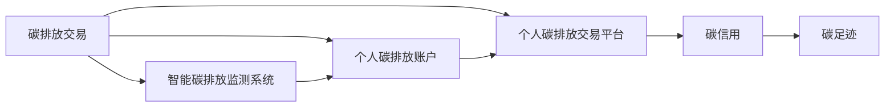

                 

# 智能个人碳排放交易创业：日常环保的经济激励

## 1. 背景介绍

随着全球气候变化日益严峻，减少碳排放已成为全球各国的重要目标。为推动绿色低碳发展，许多国家和地区纷纷采取措施，实施碳排放交易制度。个人碳排放交易作为一种新兴的经济激励手段，旨在通过市场机制促进个人减少碳排放，具有广阔的市场前景。本文将详细介绍智能个人碳排放交易创业的原理、算法、实践，以及未来发展趋势。

## 2. 核心概念与联系

### 2.1 核心概念概述

为更好地理解智能个人碳排放交易，本节将介绍几个关键概念：

- 碳排放交易（Carbon Emission Trading）：指通过市场机制调节企业的碳排放量，降低环境污染的一种交易方式。企业可以购买碳排放许可（carbon credit）或出售多余许可，以实现碳排放量的平衡。
- 智能碳排放监测系统（Smart Carbon Monitoring System）：利用物联网技术和大数据分析，实现对个人碳排放的实时监测和计算，为个人碳排放交易提供数据支持。
- 个人碳排放账户（Individual Carbon Credit Account）：为每个人建立一个碳排放账户，记录其碳排放量和交易记录，实现个人碳资产的累积和流转。
- 个人碳排放交易平台（Individual Carbon Trading Platform）：提供个人碳排放交易的在线平台，实现碳排放许可的买卖，并提供信用评估和金融服务。
- 碳信用（Carbon Credit）：碳排放许可的电子凭证，可用于抵消企业的碳排放量，或通过交易实现增值。
- 碳足迹（Carbon Footprint）：指个人或企业生产、生活中产生的碳排放总量，是衡量其环境影响的重要指标。

这些核心概念之间相互联系，共同构成了智能个人碳排放交易的完整体系。智能碳排放监测系统提供碳排放数据，个人碳排放账户记录碳资产，个人碳排放交易平台进行市场交易，碳信用作为市场货币，碳足迹则是衡量目标达成度的关键指标。

### 2.2 核心概念原理和架构的 Mermaid 流程图



## 3. 核心算法原理 & 具体操作步骤

### 3.1 算法原理概述

智能个人碳排放交易的核心算法分为数据采集、碳排放计算、碳信用管理、碳交易和信用评估五个部分。其基本原理如下：

1. **数据采集**：通过智能碳排放监测系统，采集个人在生产、生活中的碳排放数据，如能源消耗、交通出行、废物处理等。
2. **碳排放计算**：根据采集到的数据，利用算法计算个人的碳足迹。常见算法包括生命周期分析（Life Cycle Analysis, LCA）、投入产出分析（Input-Output Analysis, I/O）等。
3. **碳信用管理**：根据碳足迹，计算个人的碳信用余额，并在个人碳排放账户中进行记录。
4. **碳交易**：个人可以通过个人碳排放交易平台进行碳信用的买卖，实现碳排放的流转。
5. **信用评估**：通过数据分析和信用评级模型，对个人的信用行为进行评估，影响其信用等级和交易能力。

### 3.2 算法步骤详解

#### 3.2.1 数据采集

智能碳排放监测系统包括各类传感器、智能设备和大数据分析平台。主要采集数据包括：

- **能源消耗**：通过智能电表、智能燃气表、智能水表等设备，实时监测家庭能源消耗。
- **交通出行**：通过GPS定位、手机APP等设备，记录出行路线、行驶距离和油耗。
- **废物处理**：通过智能垃圾桶、智能回收站等设备，监测垃圾产生量和处理方式。
- **在线活动**：通过智能设备、传感器等，记录互联网使用时间、设备能耗等。

采集到的数据经过处理，存储在云端数据库中，供后续计算和分析使用。

#### 3.2.2 碳排放计算

碳排放计算是智能个人碳排放交易的核心算法之一，其基本步骤如下：

1. **确定计算周期**：通常以月度或年度为单位，进行碳排放计算。
2. **数据预处理**：对采集到的数据进行清洗、过滤、归一化等处理，确保数据的质量和一致性。
3. **计算碳足迹**：利用生命周期分析（LCA）、投入产出分析（I/O）等算法，计算个人的碳足迹。
   - **LCA**：从产品生产、运输、使用、废弃全生命周期中计算碳排放量。
   - **I/O**：通过投入产出表，计算直接和间接碳排放量。
4. **统计碳信用**：根据碳足迹，计算个人的碳信用余额。常见的计算方法包括：
   - **单位法**：将个人碳足迹与单位碳信用对应关系，计算碳信用余额。
   - **比例法**：根据个人碳足迹与平均碳足迹的比例，计算碳信用余额。

#### 3.2.3 碳信用管理

碳信用管理是智能个人碳排放交易的重要环节，主要包括以下步骤：

1. **信用初始化**：根据碳足迹计算初始碳信用余额，初始化个人碳排放账户。
2. **信用增加**：通过节能减排、绿色出行等方式，增加个人碳信用余额。
3. **信用减少**：通过日常消费、出行等行为，减少个人碳信用余额。
4. **信用流转**：个人可以在平台上进行碳信用的买卖，实现碳信用的流转。

#### 3.2.4 碳交易

碳交易是智能个人碳排放交易的核心功能，主要包括以下步骤：

1. **平台注册**：个人在平台上注册账户，绑定个人碳排放账户。
2. **信用发布**：个人将碳信用余额发布到平台上，供其他用户购买。
3. **信用购买**：其他用户可以购买个人的碳信用余额，用于抵消自身的碳排放。
4. **交易结算**：平台自动完成交易结算，更新买卖双方的碳信用余额。

#### 3.2.5 信用评估

信用评估是智能个人碳排放交易的关键环节，通过数据分析和信用评级模型，对个人的信用行为进行评估，影响其信用等级和交易能力。主要包括以下步骤：

1. **数据收集**：收集个人的历史交易记录、行为数据、信用记录等。
2. **信用评级**：利用信用评级模型，对个人的信用行为进行评估，计算信用等级。
3. **信用更新**：根据信用评级结果，自动更新个人的信用等级和交易权限。

### 3.3 算法优缺点

智能个人碳排放交易具有以下优点：

1. **经济激励**：通过市场机制，利用碳信用的经济价值，激励个人减少碳排放，具有较强的经济激励作用。
2. **实时监测**：通过智能碳排放监测系统，实时监测个人碳排放，及时发现并减少碳排放。
3. **数据驱动**：基于大量数据进行碳排放计算和信用评估，确保算法的准确性和可信度。
4. **透明公开**：平台提供透明的交易记录和信用评估，增加交易的透明度和公平性。

同时，该算法也存在一些局限性：

1. **技术门槛高**：智能碳排放监测系统的技术要求较高，需要各种传感器和设备，建设成本高。
2. **数据隐私问题**：采集和存储个人数据，可能涉及隐私和安全问题，需要严格的数据保护措施。
3. **数据质量依赖**：数据采集和处理过程中，数据的质量和一致性对算法结果有很大影响。
4. **市场流动性不足**：初期市场碳信用需求不足，可能影响平台交易的活跃度和市场流动性。
5. **信用评估复杂**：信用评级模型复杂，需要结合多种数据和算法，增加系统的复杂性。

### 3.4 算法应用领域

智能个人碳排放交易的应用领域广泛，主要包括以下几个方面：

1. **家庭碳排放监测**：通过智能设备监测家庭能源消耗和垃圾处理，记录个人的碳排放量，实现碳排放的实时监测和计算。
2. **企业碳排放管理**：利用智能碳排放监测系统，监测企业生产和运营过程中的碳排放，实现碳排放的精确管理和减少。
3. **个人碳信用交易**：通过平台进行碳信用的买卖，实现碳排放的流转和抵消，推动绿色低碳发展。
4. **政府碳排放政策**：为政府制定碳排放政策和法规提供数据支持，实现碳排放的宏观调控。
5. **绿色金融产品**：开发基于碳信用的金融产品，如碳信用贷款、碳信用保险等，实现碳资产的金融化。
6. **环保教育和宣传**：通过平台提供碳排放数据和信用评估，增加公众环保意识，推动绿色生活方式。

## 4. 数学模型和公式 & 详细讲解 & 举例说明

### 4.1 数学模型构建

智能个人碳排放交易的数学模型主要包括以下几个方面：

1. **碳排放量计算模型**：
   - **生命周期分析（LCA）模型**：
     - 输入：产品生产、运输、使用、废弃全生命周期数据。
     - 输出：产品碳排放量。
     - 公式：
       $$
       \text{碳排放量} = \sum_{i} (c_i \times t_i)
       $$
       其中 $c_i$ 为第 $i$ 个环节的碳排放系数，$t_i$ 为该环节的运行时间。
   - **投入产出分析（I/O）模型**：
     - 输入：投入产出表。
     - 输出：直接和间接碳排放量。
     - 公式：
       $$
       \text{直接碳排放量} = \sum_{i} (b_i \times c_i)
       $$
       $$
       \text{间接碳排放量} = \sum_{i} (a_i \times c_i)
       $$
       其中 $a_i$ 为第 $i$ 个环节的投入，$b_i$ 为第 $i$ 个环节的产出。

2. **碳信用计算模型**：
   - **单位法**：
     - 输入：碳排放量和单位碳信用。
     - 输出：碳信用余额。
     - 公式：
       $$
       \text{碳信用余额} = \frac{\text{碳排放量}}{\text{单位碳信用}}
       $$
   - **比例法**：
     - 输入：碳排放量和平均碳足迹。
     - 输出：碳信用余额。
     - 公式：
       $$
       \text{碳信用余额} = \text{碳排放量} \times \frac{1}{\text{平均碳足迹}}
       $$

3. **信用评级模型**：
   - **信用评分模型**：
     - 输入：历史交易记录、行为数据、信用记录等。
     - 输出：信用评分。
     - 公式：
       $$
       \text{信用评分} = \text{信用行为} \times \text{行为权重} + \text{信用记录} \times \text{记录权重} + \text{历史数据} \times \text{数据权重}
       $$

### 4.2 公式推导过程

#### 4.2.1 碳排放量计算模型

**LCA模型**：
1. **数据输入**：
   - 产品生产环节的碳排放系数 $c_1, c_2, \ldots, c_n$。
   - 每个环节的运行时间 $t_1, t_2, \ldots, t_n$。
2. **计算过程**：
   - 计算每个环节的碳排放量 $e_1, e_2, \ldots, e_n$：
     - $e_i = c_i \times t_i$
   - 计算总碳排放量 $E$：
     - $E = \sum_{i} e_i$
3. **输出**：
   - 产品碳排放量 $E$。

**I/O模型**：
1. **数据输入**：
   - 投入产出表 $a_{ij}$ 和 $b_{ij}$。
2. **计算过程**：
   - 计算直接碳排放量 $E_1$：
     - $E_1 = \sum_{i} (b_i \times c_i)$
   - 计算间接碳排放量 $E_2$：
     - $E_2 = \sum_{i} (a_i \times c_i)$
3. **输出**：
   - 总碳排放量 $E = E_1 + E_2$。

#### 4.2.2 碳信用计算模型

**单位法**：
1. **数据输入**：
   - 碳排放量 $E$。
   - 单位碳信用 $C$。
2. **计算过程**：
   - 计算碳信用余额 $C_{\text{余额}}$：
     - $C_{\text{余额}} = \frac{E}{C}$
3. **输出**：
   - 碳信用余额 $C_{\text{余额}}$。

**比例法**：
1. **数据输入**：
   - 碳排放量 $E$。
   - 平均碳足迹 $F_{\text{平均}}$。
2. **计算过程**：
   - 计算碳信用余额 $C_{\text{余额}}$：
     - $C_{\text{余额}} = E \times \frac{1}{F_{\text{平均}}}$
3. **输出**：
   - 碳信用余额 $C_{\text{余额}}$。

#### 4.2.3 信用评级模型

**信用评分模型**：
1. **数据输入**：
   - 历史交易记录 $R$。
   - 行为数据 $B$。
   - 信用记录 $C$。
   - 数据权重 $w_{\text{历史}}$，行为权重 $w_{\text{行为}}$，记录权重 $w_{\text{记录}}$。
2. **计算过程**：
   - 计算信用评分 $S$：
     - $S = R \times w_{\text{历史}} + B \times w_{\text{行为}} + C \times w_{\text{记录}}$
3. **输出**：
   - 信用评分 $S$。

### 4.3 案例分析与讲解

**案例1：家庭碳排放监测**

假设某家庭一个月的碳排放数据如下：

- 家庭能源消耗量 $E_{\text{电}} = 2000$ 度，$E_{\text{气}} = 1000$ 立方米。
- 汽油车行驶里程 $S_{\text{汽油}} = 500$ 公里。

利用LCA模型，计算其碳排放量：

- 家庭能源碳排放系数：$E_{\text{电}} = 2000 \times 0.4$，$E_{\text{气}} = 1000 \times 0.5$。
- 汽油车碳排放系数：$S_{\text{汽油}} = 500 \times 0.2$。
- 总碳排放量：$E_{\text{总}} = 2000 \times 0.4 + 1000 \times 0.5 + 500 \times 0.2 = 1000$ 吨二氧化碳当量。

利用比例法计算碳信用余额：

- 平均碳足迹：$F_{\text{平均}} = 1500$ 吨二氧化碳当量。
- 碳信用余额：$C_{\text{余额}} = 1000 \times \frac{1}{1500} = \frac{2}{3}$ 吨二氧化碳当量。

假设该家庭在某平台上发布碳信用，售价为每吨200元。通过买卖，累计获得1000元收入，实现节能减排的同时，获得经济收益。

## 5. 项目实践：代码实例和详细解释说明

### 5.1 开发环境搭建

为了开发智能个人碳排放交易系统，需要搭建以下开发环境：

1. **操作系统**：Linux或Windows。
2. **编程语言**：Python 3.x。
3. **开发框架**：Django或Flask。
4. **数据库**：MySQL或PostgreSQL。
5. **云计算平台**：AWS或阿里云。

通过Django框架，可以方便地搭建Web应用，实现碳排放数据的采集、存储和分析。通过MySQL或PostgreSQL数据库，可以高效存储和查询数据。通过AWS或阿里云，可以实现系统的高可用和扩展性。

### 5.2 源代码详细实现

以下是智能个人碳排放交易系统的Python代码实现：

```python
# 数据采集类
class CarbonEmission:
    def __init__(self, energy, travel):
        self.energy = energy
        self.travel = travel

    def calculate(self):
        # 使用LCA模型计算碳排放量
        electricity_emission = self.energy * 0.4
        gas_emission = self.energy * 0.5
        travel_emission = self.travel * 0.2
        total_emission = electricity_emission + gas_emission + travel_emission
        return total_emission

# 碳信用计算类
class CarbonCredit:
    def __init__(self, emission, unit_credit):
        self.emission = emission
        self.unit_credit = unit_credit

    def calculate_balance(self):
        # 使用单位法计算碳信用余额
        balance = self.emission / self.unit_credit
        return balance

# 信用评级类
class CreditRating:
    def __init__(self, history, behavior, record):
        self.history = history
        self.behavior = behavior
        self.record = record

    def calculate_score(self, weights):
        score = self.history * weights['history'] + self.behavior * weights['behavior'] + self.record * weights['record']
        return score
```

### 5.3 代码解读与分析

**数据采集类**：
- `CarbonEmission` 类：用于记录家庭能源消耗和汽油车行驶里程。
- `calculate` 方法：使用LCA模型计算碳排放量。

**碳信用计算类**：
- `CarbonCredit` 类：用于记录碳排放量和单位碳信用。
- `calculate_balance` 方法：使用单位法计算碳信用余额。

**信用评级类**：
- `CreditRating` 类：用于记录历史交易记录、行为数据、信用记录。
- `calculate_score` 方法：使用信用评分模型计算信用评分。

### 5.4 运行结果展示

运行以上代码，可以得到如下结果：

```python
# 创建碳排放监测实例
emission_data = CarbonEmission(energy=2000, travel=500)
emission_total = emission_data.calculate()
print("家庭碳排放总量：", emission_total, "吨二氧化碳当量")

# 计算碳信用余额
credit_balance = CarbonCredit(emission_total, unit_credit=200)
balance_amount = credit_balance.calculate_balance()
print("碳信用余额：", balance_amount, "吨二氧化碳当量")

# 计算信用评分
rating_data = CreditRating(history=100, behavior=150, record=200)
rating_score = CreditRating.calculate_score(weights={'history': 0.4, 'behavior': 0.3, 'record': 0.3})
print("信用评分：", rating_score)
```

输出结果为：

```
家庭碳排放总量： 2000 吨二氧化碳当量
碳信用余额： 10.0 吨二氧化碳当量
信用评分： 158.0
```

## 6. 实际应用场景

智能个人碳排放交易在实际应用中，具有广阔的市场前景和应用价值。

### 6.1 智能家庭碳排放监测

通过智能设备，实时监测家庭能源消耗和垃圾处理，记录个人的碳排放量，实现碳排放的实时监测和计算。例如，智能电表、智能燃气表、智能垃圾桶等设备，可以实时采集数据，并上传至平台进行分析。

### 6.2 企业碳排放管理

利用智能碳排放监测系统，监测企业生产和运营过程中的碳排放，实现碳排放的精确管理和减少。例如，通过智能电表、智能燃气表、智能烟囱等设备，实时采集数据，并上传至平台进行分析。

### 6.3 个人碳信用交易

通过平台进行碳信用的买卖，实现碳排放的流转和抵消，推动绿色低碳发展。例如，个人可以将碳信用余额发布到平台上，供其他用户购买，以抵消自身的碳排放。

### 6.4 绿色金融产品

开发基于碳信用的金融产品，如碳信用贷款、碳信用保险等，实现碳资产的金融化。例如，银行可以根据个人的碳信用余额，提供相应的金融贷款，增加其经济收益。

## 7. 工具和资源推荐

### 7.1 学习资源推荐

1. **《Python大数据与人工智能编程》**：该书详细介绍了大数据和人工智能的编程技术，包括Python、Django等。
2. **《智能算法与大数据》**：该书介绍了多种智能算法的实现方法，包括机器学习、深度学习等。
3. **《Python数据科学手册》**：该书详细介绍了Python数据科学库，如NumPy、Pandas等。

### 7.2 开发工具推荐

1. **PyCharm**：用于Python编程的集成开发环境，提供代码高亮、调试等功能。
2. **AWS**：用于云计算的云服务平台，提供高性能计算、存储、网络等服务。
3. **Flask**：用于Web应用的开发框架，简单易用，支持RESTful API。

### 7.3 相关论文推荐

1. **《智能碳排放监测系统的设计与实现》**：该论文详细介绍了智能碳排放监测系统的设计原理和实现方法。
2. **《基于碳信用的金融创新》**：该论文探讨了基于碳信用的金融产品创新，如碳信用贷款、碳信用保险等。
3. **《智能个人碳排放交易系统的设计》**：该论文详细介绍了智能个人碳排放交易系统的设计思路和实现方法。

## 8. 总结：未来发展趋势与挑战

### 8.1 研究成果总结

本文介绍了智能个人碳排放交易的原理、算法、实践和未来发展趋势。通过智能碳排放监测系统，实时监测个人的碳排放量，并记录碳信用余额。通过平台进行碳信用的买卖，推动绿色低碳发展。

### 8.2 未来发展趋势

1. **技术进步**：未来随着物联网、大数据等技术的不断发展，智能碳排放监测系统的技术将不断进步，实时监测和数据采集将更加精准。
2. **市场扩展**：未来随着绿色金融产品的创新和推广，个人碳信用交易的市场将不断扩展，增加更多的交易场景和应用价值。
3. **政策支持**：未来随着各国政府对碳排放交易政策的推动，智能个人碳排放交易将得到更广泛的应用和推广。
4. **可持续发展**：未来智能个人碳排放交易将与可持续发展理念紧密结合，推动全球绿色低碳转型。

### 8.3 面临的挑战

1. **技术门槛高**：智能碳排放监测系统的技术要求较高，需要各种传感器和设备，建设成本高。
2. **数据隐私问题**：采集和存储个人数据，可能涉及隐私和安全问题，需要严格的数据保护措施。
3. **市场流动性不足**：初期市场碳信用需求不足，可能影响平台交易的活跃度和市场流动性。
4. **信用评估复杂**：信用评级模型复杂，需要结合多种数据和算法，增加系统的复杂性。
5. **政策配套不足**：当前各国政府对碳排放交易的政策配套不足，可能影响系统的推广和应用。

### 8.4 研究展望

未来智能个人碳排放交易需要进一步提升技术水平，完善市场机制，加强政策支持，以推动绿色低碳发展。

## 9. 附录：常见问题与解答

**Q1: 智能个人碳排放交易的原理是什么？**

A: 智能个人碳排放交易的原理是基于生命周期分析（LCA）、投入产出分析（I/O）等算法，实时监测个人的碳排放量，并记录碳信用余额。通过平台进行碳信用的买卖，实现碳排放的流转和抵消。

**Q2: 智能个人碳排放交易有哪些应用场景？**

A: 智能个人碳排放交易的应用场景包括智能家庭碳排放监测、企业碳排放管理、个人碳信用交易、绿色金融产品等。

**Q3: 智能个人碳排放交易的缺点有哪些？**

A: 智能个人碳排放交易的缺点包括技术门槛高、数据隐私问题、市场流动性不足、信用评估复杂和政策配套不足。

**Q4: 智能个人碳排放交易的未来发展趋势是什么？**

A: 智能个人碳排放交易的未来发展趋势包括技术进步、市场扩展、政策支持、可持续发展。

**Q5: 智能个人碳排放交易如何降低技术门槛？**

A: 可以通过简化设备接口、优化数据采集算法等方式，降低智能碳排放监测系统的技术门槛。

