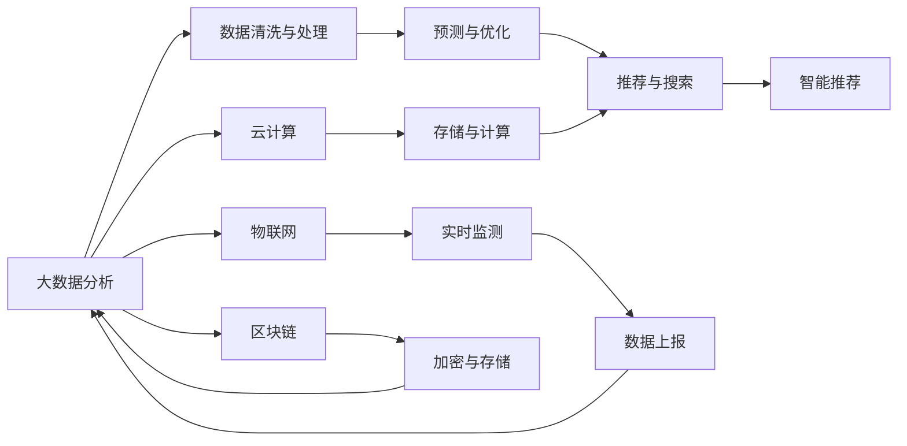

                 

# 智能停车创业：城市停车问题的解决方案

## 1. 背景介绍

在当前城市化进程中，交通拥堵和停车难问题日益突出，成为制约城市发展的瓶颈。据统计，全球超过80%的城市面临着严重的交通堵塞问题，而在这些城市中，大约70%的城市的主要问题在于停车难。这些问题不仅影响居民日常生活，也给城市管理者带来巨大压力。城市停车的巨大需求催生了智能停车领域的快速发展，吸引了众多创业者和投资者。

## 2. 核心概念与联系

### 2.1 核心概念概述

在智能停车领域，需要结合多种技术手段解决停车难的问题。核心概念包括：

- **大数据分析**：通过收集和管理城市停车数据，分析城市停车需求，优化停车资源配置。
- **物联网(IoT)**：利用传感器、摄像头等设备实时监测停车资源状态，提高停车信息的时效性。
- **人工智能(AI)**：通过图像识别、自然语言处理等技术，实现智能搜索和推荐，提升用户体验。
- **云计算**：提供强大的计算资源，支持大数据分析和实时处理。
- **区块链**：用于数据加密和安全存储，保护用户隐私和数据安全。

这些概念相互交织，构成了一个智能停车解决方案的整体框架，旨在实现停车资源的高效管理和利用。

### 2.2 核心概念原理和架构的 Mermaid 流程图



## 3. 核心算法原理 & 具体操作步骤

### 3.1 算法原理概述

智能停车解决方案的核心算法基于大数据分析和人工智能技术，通过预测和优化算法，实现停车资源的智能调配和推荐。主要流程包括：

1. **数据采集与清洗**：收集城市停车数据，包括停车位状态、占用情况、车流量等，并进行清洗和处理，确保数据的质量和准确性。
2. **预测与优化**：利用机器学习算法，对停车需求进行预测，并优化停车资源配置，减少等待时间，提高停车效率。
3. **推荐与搜索**：通过智能推荐系统，根据用户偏好和位置，推荐最佳停车方案，提升用户体验。
4. **实时监测与反馈**：利用物联网设备实时监测停车资源状态，收集用户反馈，不断优化算法和推荐策略。

### 3.2 算法步骤详解

#### 3.2.1 数据采集与清洗

**Step 1: 数据源选择**
- 数据来源包括城市停车管理系统、车载GPS数据、停车场监控摄像头等。
- 根据实际需求选择合适的数据源，确保数据的全面性和多样性。

**Step 2: 数据采集**
- 使用传感器、摄像头等设备采集实时数据。
- 利用API接口和数据接口，从不同数据源中获取停车信息。

**Step 3: 数据清洗**
- 对采集的数据进行清洗和预处理，去除噪声和异常值。
- 进行缺失值处理和数据格式转换，确保数据一致性和完整性。

#### 3.2.2 预测与优化

**Step 1: 特征工程**
- 选择与停车需求相关的特征，如停车场容量、车流量、天气状况等。
- 利用特征选择算法，去除冗余和无关特征，提升模型性能。

**Step 2: 模型选择**
- 选择合适的预测模型，如线性回归、决策树、随机森林等。
- 利用交叉验证和模型评估方法，选择最优模型。

**Step 3: 模型训练**
- 使用历史数据对模型进行训练，优化模型参数。
- 利用特征工程和模型调参，提升预测精度。

**Step 4: 预测与优化**
- 利用训练好的模型对未来停车需求进行预测。
- 根据预测结果，优化停车资源配置，减少等待时间。

#### 3.2.3 推荐与搜索

**Step 1: 用户画像**
- 收集用户的基本信息、停车偏好和历史行为数据。
- 利用聚类算法和特征提取，构建用户画像。

**Step 2: 推荐算法**
- 选择合适的推荐算法，如协同过滤、内容推荐、基于规则推荐等。
- 利用推荐算法，根据用户画像和需求，推荐最佳停车方案。

**Step 3: 搜索算法**
- 选择合适的搜索算法，如A*、Dijkstra等。
- 利用搜索算法，在大量停车资源中快速找到最佳停车位置。

#### 3.2.4 实时监测与反馈

**Step 1: 设备部署**
- 在停车场和城市主要道路部署传感器、摄像头等设备。
- 确保设备覆盖面广，数据采集全面。

**Step 2: 数据上报**
- 实时上报监测数据，确保数据的时效性和完整性。
- 利用数据接口，将实时数据发送到中央服务器。

**Step 3: 反馈优化**
- 收集用户反馈，分析用户满意度。
- 根据用户反馈和实时数据，不断优化算法和推荐策略。

### 3.3 算法优缺点

**优点**：
- **高效性**：通过实时监测和预测优化，有效减少等待时间，提升停车效率。
- **灵活性**：根据用户需求和偏好，提供个性化的推荐和搜索服务，提升用户体验。
- **可扩展性**：利用云计算和物联网技术，支持大规模数据处理和实时计算。

**缺点**：
- **数据隐私**：大量停车数据需要处理和存储，可能涉及用户隐私问题。
- **设备成本**：部署传感器、摄像头等设备需要较高的初始投入。
- **模型复杂性**：预测和优化模型需要复杂的算法和大量数据，对模型设计和调参要求高。

### 3.4 算法应用领域

智能停车解决方案广泛应用于以下领域：

- **城市管理**：协助城市管理者优化停车资源配置，缓解交通堵塞。
- **商业地产**：提升商业园区停车管理效率，吸引更多客户。
- **大型活动**：在大型活动期间，提供快速便捷的停车服务。
- **住宅小区**：优化住宅小区停车管理，提高居民生活便利性。

## 4. 数学模型和公式 & 详细讲解

### 4.1 数学模型构建

假设城市停车数据为 $D=\{(x_i, y_i)\}_{i=1}^N$，其中 $x_i$ 为时间戳和停车位置，$y_i$ 为停车位状态（可用、不可用）。我们的目标是通过预测模型 $M$ 对未来 $T$ 天内的停车需求进行预测，并优化停车资源配置。

设 $M$ 为预测模型，$\hat{y}$ 为模型预测的停车位状态，则我们的优化目标为：

$$
\min_{M} \sum_{i=1}^N \ell(\hat{y}_i, y_i)
$$

其中 $\ell$ 为损失函数，常用的有均方误差损失和交叉熵损失。

### 4.2 公式推导过程

以线性回归模型为例，预测公式为：

$$
\hat{y} = w_0 + w_1 x_1 + \ldots + w_n x_n
$$

其中 $w_0, w_1, \ldots, w_n$ 为模型参数，$x_1, \ldots, x_n$ 为特征变量。

利用均方误差损失，我们的优化目标变为：

$$
\min_{w_0, w_1, \ldots, w_n} \sum_{i=1}^N (\hat{y}_i - y_i)^2
$$

通过梯度下降等优化算法，最小化损失函数，更新模型参数。

### 4.3 案例分析与讲解

假设我们有一组历史停车数据，目标是预测未来一天的停车需求。首先进行特征选择，选取停车场容量、车流量、天气状况等特征。然后使用线性回归模型进行训练和预测。

**数据准备**：
- 数据集为历史停车数据，包括时间戳、停车位状态、停车场容量、车流量、天气状况等。
- 数据清洗：去除缺失值和异常值，进行特征编码。

**模型训练**：
- 选择线性回归模型，利用历史数据进行训练，优化模型参数。
- 利用交叉验证和模型评估方法，选择最优模型。

**预测与优化**：
- 利用训练好的模型对未来一天内的停车需求进行预测。
- 根据预测结果，优化停车场资源配置，减少等待时间。

## 5. 项目实践：代码实例和详细解释说明

### 5.1 开发环境搭建

**Python环境**：
- 安装Anaconda：从官网下载并安装Anaconda，用于创建独立的Python环境。
- 创建并激活虚拟环境：
```bash
conda create -n pyenv python=3.8 
conda activate pyenv
```

**依赖库**：
- 安装必要的依赖库，如NumPy、Pandas、Scikit-Learn、TensorFlow、Keras等。
- 使用conda安装，以方便管理和更新。
```bash
conda install numpy pandas scikit-learn tensorflow keras
```

### 5.2 源代码详细实现

**数据预处理**：
```python
import pandas as pd
import numpy as np

# 读取数据集
data = pd.read_csv('parking_data.csv')

# 数据清洗与预处理
data.fillna(method='ffill', inplace=True)
data.dropna(inplace=True)
data['weather'] = data['weather'].fillna('clear')

# 特征选择
features = ['parking_capacity', 'traffic_volume', 'weather']
X = data[features]
y = data['state']

# 数据划分
from sklearn.model_selection import train_test_split
X_train, X_test, y_train, y_test = train_test_split(X, y, test_size=0.2, random_state=42)
```

**模型训练**：
```python
from sklearn.linear_model import LinearRegression

# 模型训练
model = LinearRegression()
model.fit(X_train, y_train)
y_pred = model.predict(X_test)
```

**模型评估**：
```python
from sklearn.metrics import mean_squared_error

# 模型评估
mse = mean_squared_error(y_test, y_pred)
print(f'Mean Squared Error: {mse:.3f}')
```

**实时数据上报与反馈**：
```python
# 实时数据上报
def report_data(sensor_data):
    # 数据清洗与预处理
    sensor_data.fillna(method='ffill', inplace=True)
    sensor_data.dropna(inplace=True)
    sensor_data['weather'] = sensor_data['weather'].fillna('clear')

    # 数据上报
    data = pd.DataFrame(sensor_data, columns=['state', 'traffic_volume', 'weather'])
    data.to_csv('realtime_data.csv', index=False, header=False)

# 用户反馈
def collect_feedback(user_feedback):
    # 数据清洗与预处理
    user_feedback.fillna(method='ffill', inplace=True)
    user_feedback.dropna(inplace=True)

    # 数据上报
    feedback_data = pd.DataFrame(user_feedback, columns=['rating', 'comment'])
    feedback_data.to_csv('user_feedback.csv', index=False, header=False)
```

### 5.3 代码解读与分析

**数据预处理**：
- 使用Pandas库读取和处理数据，确保数据质量。
- 利用fillna方法填补缺失值，使用dropna方法去除异常数据，保证数据的一致性和完整性。

**模型训练**：
- 使用LinearRegression模型进行训练，利用历史数据优化模型参数。
- 利用交叉验证和评估方法，选择最优模型，确保模型预测精度。

**实时数据上报与反馈**：
- 利用report_data函数，将实时数据上报到中央服务器。
- 利用collect_feedback函数，收集用户反馈，不断优化模型和推荐策略。

### 5.4 运行结果展示

**模型训练结果**：
- 使用均方误差作为评估指标，评估模型预测精度。
- 利用实际停车数据进行验证，确保模型效果。

**实时数据与反馈**：
- 定期上报实时数据，确保数据的时效性和完整性。
- 收集用户反馈，分析用户满意度，不断优化推荐策略。

## 6. 实际应用场景

### 6.1 城市管理

在城市管理中，智能停车系统可以协助城市管理者优化停车资源配置，缓解交通堵塞。系统能够实时监测停车资源状态，预测未来停车需求，优化停车资源分配。例如，在大型活动期间，系统可以提前预测活动区域的停车需求，提前调配资源，减少等待时间。

### 6.2 商业地产

商业地产管理者可以利用智能停车系统提升停车管理效率，吸引更多客户。系统可以根据停车需求，实时推荐最佳的停车方案，提高停车效率和用户体验。例如，在高峰期，系统可以推荐最优停车位置，减少客户等待时间，提升客户满意度。

### 6.3 大型活动

在大型活动期间，智能停车系统能够提供快速便捷的停车服务。系统可以根据活动时间和地点，预测停车需求，提前调配资源。例如，在演唱会、体育赛事等大型活动中，系统可以提前预测停车需求，提前调配资源，减少客户等待时间。

### 6.4 住宅小区

智能停车系统可以优化住宅小区的停车管理，提高居民生活便利性。系统可以根据居民的停车需求和偏好，推荐最佳的停车方案。例如，在节假日，系统可以推荐最优停车位置，减少居民等待时间，提升居民满意度。

## 7. 工具和资源推荐

### 7.1 学习资源推荐

**Python教程**：
- 《Python编程：从入门到实践》
- 《Python深度学习》

**数据分析**：
- 《利用Python进行数据分析》
- 《Python数据科学手册》

**机器学习**：
- 《机器学习实战》
- 《Python机器学习》

**深度学习**：
- 《深度学习》
- 《TensorFlow实战》

### 7.2 开发工具推荐

**IDE**：
- PyCharm
- VS Code

**数据可视化**：
- Matplotlib
- Seaborn

**协作工具**：
- Jupyter Notebook
- GitHub

### 7.3 相关论文推荐

**数据采集与清洗**：
- "A Survey on Data Cleaning Techniques" by Xiang et al.

**预测与优化**：
- "Machine Learning Yearning" by Andrew Ng.

**推荐与搜索**：
- "Adaptive Collaborative Filtering Using Matrix Factorization Techniques" by Koren et al.

## 8. 总结：未来发展趋势与挑战

### 8.1 研究成果总结

智能停车系统通过大数据分析和人工智能技术，实现了停车资源的智能调配和推荐，显著提高了停车效率和用户体验。该系统已经在多个实际应用中取得了良好效果，未来仍有广泛的发展空间。

### 8.2 未来发展趋势

未来智能停车系统将呈现以下发展趋势：

**多模态数据融合**：
- 利用物联网设备采集的多模态数据，如车辆位置、速度、方向等，进行综合分析。
- 将视觉、语音、文本等多种信息融合，提升系统智能化水平。

**智能推荐系统**：
- 采用深度学习和强化学习技术，提升推荐系统的个性化和精准度。
- 利用用户行为数据，进行行为分析和预测，提升推荐效果。

**边缘计算**：
- 在停车场部署边缘计算设备，进行实时数据处理和分析。
- 减少数据传输延迟，提高系统响应速度和效率。

**区块链技术**：
- 利用区块链技术，确保停车数据的安全性和隐私保护。
- 实现数据的去中心化存储和访问，提高系统的透明性和可信度。

### 8.3 面临的挑战

尽管智能停车系统具有显著的优势，但在推广和应用过程中仍面临以下挑战：

**数据隐私和安全**：
- 大量停车数据需要处理和存储，涉及用户隐私问题，如何保障数据安全是关键。
- 系统需要具备高度的鲁棒性和抗攻击能力，防止数据泄露和恶意攻击。

**设备和成本**：
- 部署传感器、摄像头等设备需要较高的初始投入，如何降低成本是实际应用中的重要问题。
- 设备部署和管理需要较高的技术要求，如何简化部署和维护流程是关键。

**模型复杂性**：
- 预测和优化模型需要复杂的算法和大量数据，对模型设计和调参要求高。
- 如何降低模型复杂度，提高计算效率是关键问题。

### 8.4 研究展望

未来研究应聚焦于以下几个方向：

**边缘计算与云计算结合**：
- 结合边缘计算和云计算的优势，实现数据处理的分布式协同。
- 提高系统响应速度和计算效率，提升用户体验。

**多模态数据融合**：
- 利用多模态数据进行综合分析，提升系统的智能化水平。
- 利用先进的深度学习技术，提升系统的精度和鲁棒性。

**区块链技术应用**：
- 利用区块链技术，确保数据的安全性和隐私保护。
- 实现数据的去中心化存储和访问，提高系统的透明性和可信度。

**人机交互界面**：
- 开发智能化的用户界面，提升用户体验。
- 利用自然语言处理技术，实现语音和文本交互，提高系统的友好性和易用性。

## 9. 附录：常见问题与解答

**Q1: 智能停车系统如何提高停车效率？**

A: 智能停车系统通过大数据分析和人工智能技术，实现了停车资源的智能调配和推荐。系统能够实时监测停车资源状态，预测未来停车需求，优化停车资源分配。例如，在大型活动期间，系统可以提前预测活动区域的停车需求，提前调配资源，减少等待时间。

**Q2: 智能停车系统如何保障数据隐私？**

A: 智能停车系统利用区块链技术，确保停车数据的安全性和隐私保护。系统中的数据存储和传输都经过加密处理，防止数据泄露和恶意攻击。

**Q3: 智能停车系统的设备成本如何降低？**

A: 智能停车系统需要部署传感器、摄像头等设备，初期投入较高。可以通过规模化部署和利用开源设备降低成本。同时，利用云计算技术，提高设备的利用率和系统的扩展性。

**Q4: 智能停车系统的模型复杂性如何降低？**

A: 智能停车系统的预测和优化模型需要复杂的算法和大量数据，对模型设计和调参要求高。可以通过简化模型结构、利用迁移学习和深度学习技术，降低模型复杂度，提高计算效率。

**Q5: 智能停车系统如何实现多模态数据融合？**

A: 智能停车系统可以利用物联网设备采集的多模态数据，如车辆位置、速度、方向等，进行综合分析。同时，系统可以整合视觉、语音、文本等多种信息，提升系统智能化水平。

