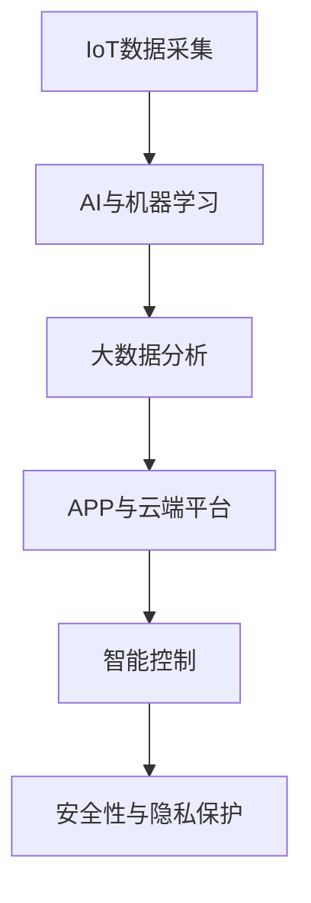

                 

## 1. 背景介绍

### 1.1 问题由来

随着科技的飞速发展，智能家居和物联网技术的应用日益普及，人们开始思考如何利用科技为宠物提供更好的生活环境和互动体验。宠物主人希望在繁忙的生活中，能够通过科技手段保证宠物的安全、健康和娱乐。而传统的宠物玩具和互动设备，如自动喂食器、玩具球等，虽然能够满足宠物的部分需求，但缺乏智能化和互动性。

智能宠物玩具的开发应运而生，它融合了物联网、AI和大数据分析等技术，通过分析宠物的行为和偏好，提供个性化的互动和娱乐体验。这样既能满足宠物的生理需求，又能通过互动活动增进宠物和主人的情感连接，提升宠物的生活质量。

### 1.2 问题核心关键点

智能宠物玩具的核心在于将数据采集、分析和智能控制技术融合，实时监测宠物的行为并动态调整互动内容，从而提升宠物的幸福感。主要包括以下关键点：

1. **数据采集与监测**：通过传感器、摄像头等设备，实时采集宠物的行为数据，如活动量、睡眠质量等。
2. **数据分析与建模**：利用AI技术，对采集到的数据进行分析，建立宠物行为模式模型，识别宠物的喜好和需求。
3. **智能控制与互动**：基于模型分析结果，智能控制玩具的行为，如音乐播放、运动模式等，与宠物进行互动。
4. **用户体验**：通过APP或云端平台，宠物主人能够实时查看宠物的状态，调整互动参数，提升互动体验。

这些关键点共同构成了智能宠物玩具的基本框架，为科技驱动的宠物娱乐提供了可能。

### 1.3 问题研究意义

智能宠物玩具不仅能够提升宠物的娱乐性和互动性，还能通过数据分析和智能控制，辅助宠物主人更好地了解和管理宠物的健康。此外，智能宠物玩具还能解决宠物独自在家时可能面临的安全和心理健康问题，成为连接宠物和主人感情的桥梁。

本项目旨在探索智能宠物玩具的创新技术，为用户提供安全、健康、有趣的一站式解决方案，推动宠物行业向智能化、个性化方向发展。

## 2. 核心概念与联系

### 2.1 核心概念概述

智能宠物玩具集成了物联网、AI、大数据等前沿技术，通过以下核心概念实现了智能互动：

1. **物联网(IoT)**：通过传感器、摄像头等设备采集宠物数据，实现数据实时监测和传输。
2. **AI与机器学习**：利用AI技术进行数据分析和行为模式建模，实现智能控制和个性化互动。
3. **大数据分析**：通过大数据技术进行宠物行为数据的分析和挖掘，建立宠物行为模型。
4. **APP与云端平台**：为用户提供直观的互动界面和数据查看，提升用户体验。
5. **智能控制**：基于AI和数据分析结果，动态调整玩具的行为模式，实现个性化互动。
6. **安全性与隐私保护**：确保数据采集和传输过程中的安全性，保护宠物隐私。

这些核心概念之间的逻辑关系可以通过以下Mermaid流程图来展示：



## 3. 核心算法原理 & 具体操作步骤

### 3.1 算法原理概述

智能宠物玩具的核心算法主要分为三个部分：数据采集、数据分析和智能控制。

1. **数据采集**：通过传感器、摄像头等设备，实时监测宠物的生理状态和行为数据。
2. **数据分析**：利用AI技术对采集到的数据进行分析，识别宠物的行为模式和偏好。
3. **智能控制**：基于数据分析结果，动态调整玩具的行为模式，实现个性化互动。

### 3.2 算法步骤详解

**Step 1: 数据采集**
- 选择合适的传感器和摄像头设备，安装在宠物玩具上。
- 通过有线或无线方式，将设备与中央处理器连接，实现数据实时传输。

**Step 2: 数据预处理**
- 对采集到的原始数据进行清洗、滤波、归一化等预处理操作，确保数据质量和一致性。
- 使用特征提取技术，将原始数据转换为可供AI模型分析的格式。

**Step 3: 模型训练**
- 构建宠物行为数据分析模型，如时间序列模型、行为模式识别模型等。
- 使用历史数据进行模型训练，优化模型参数，提高预测准确率。

**Step 4: 智能控制**
- 基于训练好的模型，实时监测宠物行为，动态调整玩具的行为模式。
- 使用PID控制算法等，确保玩具行为模式稳定可靠。

**Step 5: 用户体验优化**
- 通过APP或云端平台，提供数据可视化和交互界面，让用户随时查看宠物状态。
- 设计友好的用户界面，提升用户操作便捷性和互动体验。

**Step 6: 安全性与隐私保护**
- 采用加密通信协议，确保数据传输过程中的安全性。
- 设计隐私保护机制，防止敏感数据泄露，保护宠物隐私。

### 3.3 算法优缺点

智能宠物玩具的算法主要具有以下优点：
1. **实时性**：通过物联网技术实现数据实时采集和传输，实现对宠物行为的高频监测和即时互动。
2. **个性化**：利用AI技术进行数据分析和建模，实现对宠物行为的个性化理解，提供定制化的互动内容。
3. **便捷性**：通过APP和云端平台，用户可以随时随地查看宠物状态，调整互动参数，提升用户体验。
4. **多功能**：集成多种传感器和AI技术，实现多功能互动，如行为监测、健康管理、娱乐等。

同时，该算法也存在一定的局限性：
1. **数据采集精度**：传感器和摄像头的精度和稳定性对数据采集效果有重要影响，需要定期维护和校准。
2. **模型泛化能力**：训练模型的数据质量和多样性对模型泛化能力有影响，需要不断优化训练数据。
3. **设备成本**：智能宠物玩具的传感器和摄像头等设备成本较高，可能影响产品价格和市场竞争力。
4. **隐私和安全**：数据采集和传输过程中可能存在隐私泄露和安全风险，需要设计严格的安全保护措施。

### 3.4 算法应用领域

智能宠物玩具的算法和实现方式，可以在多个领域得到应用，例如：

- **智能宠物玩具**：通过传感器和AI技术，实现玩具的智能互动和个性化娱乐。
- **智能宠物喂食器**：结合AI技术，根据宠物的饮食习惯和健康数据，动态调整喂食量和营养配比。
- **智能宠物门禁系统**：利用传感器和AI技术，识别宠物身份，自动开关门禁，提高宠物安全性。
- **宠物健康监测设备**：通过传感器和AI技术，实时监测宠物的健康状态，提供预警和建议。
- **宠物行为分析软件**：利用AI技术对宠物行为数据进行分析，帮助宠物主人更好地了解和管理宠物。

## 4. 数学模型和公式 & 详细讲解 & 举例说明

### 4.1 数学模型构建

假设采集到的宠物行为数据为 $x_1, x_2, ..., x_n$，其中 $x_i$ 表示宠物在时刻 $i$ 的某个行为数据，如活动量、睡眠质量等。智能宠物玩具的AI模型需要建立行为模式模型 $f$，用于预测宠物在未来的行为状态 $y$。

形式化地，行为模式模型 $f$ 可以表示为：

$$
f(x_1, x_2, ..., x_n) = y
$$

### 4.2 公式推导过程

以时间序列模型为例，利用ARIMA模型对宠物行为数据进行分析。假设模型为 $ARIMA(p,d,q)$ 模型，其中 $p$ 为自回归项数，$d$ 为差分阶数，$q$ 为移动平均项数。模型公式为：

$$
\Delta^d(y_t) = c + \sum_{i=1}^p \phi_i \Delta^d(y_{t-i}) + \sum_{i=1}^q \theta_i \epsilon_{t-i} + \epsilon_t
$$

其中 $\Delta$ 表示差分运算，$c$ 为截距项，$\phi_i$ 和 $\theta_i$ 分别为自回归和移动平均系数，$\epsilon_t$ 为随机误差项。

通过历史数据进行模型训练，可以确定 $p$、$d$ 和 $q$ 的值，从而建立宠物行为预测模型。

### 4.3 案例分析与讲解

以智能宠物玩具为例，假设玩具内置的传感器可以实时监测宠物的活动量 $x$，玩具可以根据活动量调整音乐播放模式 $y$。构建ARIMA模型对活动量 $x$ 进行分析，预测未来的活动量变化趋势，从而动态调整音乐播放模式 $y$。

假设历史数据为 $x_1, x_2, ..., x_{100}$，分别表示宠物在不同时间段的连续活动量。通过构建ARIMA模型，可以得到宠物未来活动量的预测值 $y_{101}, y_{102}, ..., y_{200}$。

根据预测结果，智能宠物玩具可以动态调整音乐播放模式，如快慢、音量等，提升宠物的娱乐体验。

## 5. 项目实践：代码实例和详细解释说明

### 5.1 开发环境搭建

**Step 1: 环境安装**
- 安装Python 3.x，推荐使用Anaconda环境。
- 安装必要的第三方库，如pandas、numpy、scikit-learn、TensorFlow等。

**Step 2: 数据准备**
- 收集历史宠物行为数据，存储在本地或云端数据库中。
- 数据清洗、预处理，转换为模型训练所需的格式。

**Step 3: 模型训练**
- 使用TensorFlow等深度学习框架，构建和训练宠物行为数据分析模型。
- 使用历史数据进行模型训练，优化模型参数，提高预测准确率。

### 5.2 源代码详细实现

以下是一个基于TensorFlow的时间序列模型训练代码示例：

```python
import tensorflow as tf
import numpy as np
from sklearn.preprocessing import MinMaxScaler

# 加载历史数据
x_train = np.load('train_data.npy')
y_train = np.load('train_labels.npy')

# 数据预处理
scaler = MinMaxScaler(feature_range=(0, 1))
x_train = scaler.fit_transform(x_train)

# 构建ARIMA模型
model = tf.keras.Sequential([
    tf.keras.layers.LSTM(128, input_shape=(x_train.shape[1], 1), return_sequences=True),
    tf.keras.layers.LSTM(128, return_sequences=True),
    tf.keras.layers.LSTM(128),
    tf.keras.layers.Dense(1)
])

# 编译模型
model.compile(optimizer='adam', loss='mse')

# 训练模型
model.fit(x_train, y_train, epochs=100, batch_size=32, validation_split=0.2)
```

**代码解读与分析**

**环境安装与数据准备**：
- 使用Anaconda安装Python环境，安装必要的第三方库。
- 准备历史宠物行为数据，进行数据清洗和预处理。

**模型训练**：
- 使用TensorFlow构建时间序列模型，包括LSTM层和Dense层。
- 通过历史数据进行模型训练，优化模型参数。

### 5.3 代码解读与分析

**环境安装与数据准备**：
- 使用Anaconda安装Python环境，安装必要的第三方库。
- 准备历史宠物行为数据，进行数据清洗和预处理。

**模型训练**：
- 使用TensorFlow构建时间序列模型，包括LSTM层和Dense层。
- 通过历史数据进行模型训练，优化模型参数。

### 5.4 运行结果展示

运行上述代码后，可以输出训练好的模型和预测结果，用于实时监测和智能控制宠物玩具。

## 6. 实际应用场景

### 6.1 智能宠物玩具

智能宠物玩具集成了物联网、AI和大数据分析技术，通过实时监测宠物的行为数据，提供个性化的互动和娱乐体验。

具体功能包括：
- **行为监测**：通过传感器和摄像头，实时监测宠物的活动量、睡眠质量等行为数据。
- **智能控制**：根据监测结果，动态调整玩具的行为模式，如音乐播放、运动模式等。
- **个性化互动**：通过APP和云端平台，宠物主人可以随时查看宠物状态，调整互动参数，提升互动体验。

### 6.2 智能宠物喂食器

智能宠物喂食器结合AI技术，根据宠物的饮食习惯和健康数据，动态调整喂食量和营养配比。

具体功能包括：
- **行为监测**：通过传感器和摄像头，实时监测宠物的活动量和饮食情况。
- **智能控制**：根据监测结果，动态调整喂食量和营养配比，确保宠物健康。
- **个性化喂食**：通过APP和云端平台，宠物主人可以随时查看喂食情况，调整喂食参数。

### 6.3 智能宠物门禁系统

智能宠物门禁系统利用传感器和AI技术，识别宠物身份，自动开关门禁，提高宠物安全性。

具体功能包括：
- **身份识别**：通过传感器和摄像头，实时监测宠物的行为和身份信息。
- **智能控制**：根据识别结果，自动开关门禁，确保宠物安全。
- **远程控制**：通过APP和云端平台，宠物主人可以随时查看门禁状态，远程控制门禁开关。

### 6.4 宠物健康监测设备

宠物健康监测设备通过传感器和AI技术，实时监测宠物的健康状态，提供预警和建议。

具体功能包括：
- **行为监测**：通过传感器和摄像头，实时监测宠物的活动量和睡眠质量。
- **健康预警**：根据监测结果，提供健康预警和建议，及时发现异常。
- **远程监控**：通过APP和云端平台，宠物主人可以随时查看宠物健康状态，获取健康建议。

## 7. 工具和资源推荐

### 7.1 学习资源推荐

为了帮助开发者系统掌握智能宠物玩具的技术基础和实践技巧，这里推荐一些优质的学习资源：

1. **《机器学习实战》**：通俗易懂的机器学习入门书籍，适合初学者理解基本概念和算法。
2. **《深度学习》**：斯坦福大学的深度学习课程，系统讲解深度学习的基本原理和应用。
3. **《Python数据分析》**：Python数据处理和分析的入门书籍，适合数据分析师和开发者。
4. **TensorFlow官方文档**：TensorFlow的官方文档，包含丰富的API和示例代码，帮助开发者快速上手。
5. **Hugging Face官方文档**：Transformer库的官方文档，提供海量的预训练模型和微调范例。

通过对这些资源的学习实践，相信你一定能够快速掌握智能宠物玩具的关键技术，并用于解决实际的宠物问题。

### 7.2 开发工具推荐

高效的开发离不开优秀的工具支持。以下是几款用于智能宠物玩具开发的常用工具：

1. **TensorFlow**：基于Python的开源深度学习框架，适合构建复杂模型和高效训练。
2. **Keras**：高层次的深度学习API，简化模型构建过程。
3. **Flask**：轻量级的Web框架，快速搭建API接口。
4. **PyTorch**：灵活的深度学习框架，支持动态图和静态图两种计算图模式。
5. **OpenCV**：开源计算机视觉库，支持摄像头和传感器数据的实时处理。

合理利用这些工具，可以显著提升智能宠物玩具的开发效率，加快创新迭代的步伐。

### 7.3 相关论文推荐

智能宠物玩具的研究源于学界的持续研究。以下是几篇奠基性的相关论文，推荐阅读：

1. **《宠物行为分析与情感识别》**：介绍利用机器学习技术分析宠物行为和情感的论文，提出基于时间序列分析的宠物行为预测方法。
2. **《智能宠物玩具的设计与实现》**：介绍智能宠物玩具的设计原理和实现技术，包括传感器选择、数据采集和AI模型构建。
3. **《基于深度学习的智能宠物喂食器》**：介绍利用深度学习技术实现智能宠物喂食器的论文，提出基于RNN的宠物饮食模式预测方法。
4. **《物联网驱动的智能宠物门禁系统》**：介绍利用物联网技术实现智能宠物门禁系统的论文，提出基于图像识别的宠物身份识别方法。
5. **《基于机器学习的宠物健康监测设备》**：介绍利用机器学习技术实现宠物健康监测设备的论文，提出基于时间序列分析的宠物健康预警方法。

这些论文代表了她智能宠物玩具的研究方向和发展脉络。通过学习这些前沿成果，可以帮助研究者把握学科前进方向，激发更多的创新灵感。

## 8. 总结：未来发展趋势与挑战

### 8.1 总结

本文对基于物联网、AI和大数据分析技术的智能宠物玩具进行了全面系统的介绍。首先阐述了智能宠物玩具的研究背景和意义，明确了智能互动和个性化娱乐的核心价值。其次，从原理到实践，详细讲解了智能宠物玩具的算法流程，包括数据采集、数据分析和智能控制。最后，我们探讨了智能宠物玩具的实际应用场景，展示了其广泛的应用前景。

通过本文的系统梳理，可以看到，智能宠物玩具不仅能够提升宠物的娱乐性和互动性，还能通过数据分析和智能控制，辅助宠物主人更好地了解和管理宠物的健康。未来，伴随技术的发展和应用推广，智能宠物玩具必将成为宠物行业的重要创新方向，为科技驱动的宠物娱乐带来新的变革。

### 8.2 未来发展趋势

展望未来，智能宠物玩具的技术发展将呈现以下几个趋势：

1. **更精准的数据采集**：随着传感器和摄像头技术的进步，智能宠物玩具将具备更精确和多样化的数据采集能力，提供更全面的宠物行为监测。
2. **更智能的行为分析**：利用更先进的人工智能算法，智能宠物玩具将具备更强的行为分析和预测能力，提供更个性化的互动内容。
3. **更便捷的用户体验**：通过更友好的用户界面和数据展示，智能宠物玩具将提升用户体验，使用户能够更方便地查看和调整宠物状态。
4. **更广泛的应用场景**：智能宠物玩具将拓展到更多宠物相关场景，如智能喂食器、门禁系统、健康监测等，提供一站式解决方案。
5. **更安全的隐私保护**：通过更严格的数据加密和隐私保护机制，智能宠物玩具将确保数据传输和存储的安全，保护宠物隐私。

这些趋势将进一步推动智能宠物玩具的技术进步，提升宠物主人的满意度和体验，推动宠物行业向智能化、个性化方向发展。

### 8.3 面临的挑战

尽管智能宠物玩具的技术已经取得了不小的进步，但在迈向更加智能化、普适化应用的过程中，它仍面临以下挑战：

1. **数据采集精度**：传感器和摄像头的精度和稳定性对数据采集效果有重要影响，需要定期维护和校准。
2. **模型泛化能力**：训练模型的数据质量和多样性对模型泛化能力有影响，需要不断优化训练数据。
3. **设备成本**：智能宠物玩具的传感器和摄像头等设备成本较高，可能影响产品价格和市场竞争力。
4. **隐私和安全**：数据采集和传输过程中可能存在隐私泄露和安全风险，需要设计严格的安全保护措施。
5. **用户接受度**：宠物主人对新技术的接受度可能较低，需要提供更便捷、易用的解决方案，提升用户满意度。

正视这些挑战，积极应对并寻求突破，将是大语言模型微调技术走向成熟的必由之路。相信随着学界和产业界的共同努力，这些挑战终将一一被克服，智能宠物玩具必将在构建人机协同的智能时代中扮演越来越重要的角色。

### 8.4 研究展望

面向未来，智能宠物玩具的研究需要在以下几个方面寻求新的突破：

1. **更高效的数据采集**：研究更高效的数据采集技术和传感器选择，提升数据采集精度和稳定性。
2. **更强大的行为分析**：研究更强大的AI算法和模型架构，提升行为分析和预测能力，提供更个性化的互动内容。
3. **更便捷的用户体验**：研究更友好的用户界面和数据展示，提升用户体验，使用户能够更方便地查看和调整宠物状态。
4. **更广泛的应用场景**：研究智能宠物玩具在更多宠物相关场景中的应用，提供一站式解决方案。
5. **更安全的隐私保护**：研究更严格的数据加密和隐私保护机制，确保数据传输和存储的安全，保护宠物隐私。

这些研究方向的探索，将引领智能宠物玩具技术迈向更高的台阶，为科技驱动的宠物娱乐带来新的变革，提升宠物主人的满意度和体验。

## 9. 附录：常见问题与解答

**Q1：智能宠物玩具是否适用于所有宠物？**

A: 智能宠物玩具的设计和功能可以适用于大部分宠物，如猫、狗、鸟等。但不同品种的宠物可能对玩具的喜好和行为模式不同，需要根据实际情况进行个性化调整。

**Q2：智能宠物玩具的成本是否过高？**

A: 智能宠物玩具的成本主要集中在传感器、摄像头和AI模型训练上，确实存在一定成本。但通过批量生产和优化算法，可以降低成本，提升市场竞争力。

**Q3：智能宠物玩具的安全性如何保证？**

A: 智能宠物玩具应设计严格的安全保护机制，如数据加密、访问鉴权等，确保数据传输和存储的安全。同时，需要定期维护和校准传感器和摄像头，提升设备的稳定性和精度。

**Q4：智能宠物玩具的隐私保护措施有哪些？**

A: 智能宠物玩具应设计隐私保护机制，如数据匿名化、访问控制等，防止敏感数据泄露。同时，需要告知宠物主人数据采集和使用范围，获得明确的隐私同意。

**Q5：智能宠物玩具的未来发展方向是什么？**

A: 智能宠物玩具的未来发展方向包括更精准的数据采集、更强大的行为分析、更便捷的用户体验、更广泛的应用场景和更安全的隐私保护。这些方向的探索将进一步推动智能宠物玩具技术的发展和应用。

通过本文的系统梳理，可以看到，智能宠物玩具不仅能够提升宠物的娱乐性和互动性，还能通过数据分析和智能控制，辅助宠物主人更好地了解和管理宠物的健康。未来，伴随技术的发展和应用推广，智能宠物玩具必将成为宠物行业的重要创新方向，为科技驱动的宠物娱乐带来新的变革，提升宠物主人的满意度和体验。

---

作者：禅与计算机程序设计艺术 / Zen and the Art of Computer Programming

