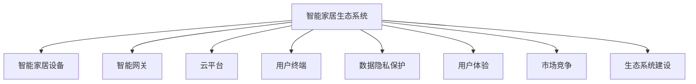

                 

# 智能家居生态系统的注意力争夺战

## 1. 背景介绍

随着物联网技术和人工智能的不断发展，智能家居已经成为家居生活的重要组成部分。通过物联网设备，智能家居可以实现家庭环境的自动化管理、智能控制和安全防范等功能，极大地提升了家居生活的便利性和舒适度。然而，当前智能家居生态系统面临着注意力争夺的激烈竞争，各大厂商纷纷推出自己的智能家居平台，争夺用户注意力，抢占市场份额。

### 1.1 问题的由来
智能家居生态系统的注意力争夺战，源于智能家居市场的蓬勃发展和用户对高水平家居体验的不断追求。随着技术的进步和市场成熟，智能家居产业呈现出百家争鸣、百花齐放的局面。各大厂商基于自身的核心技术，构建各自的智能家居平台，并通过各种渠道推广自己的产品和服务。在这种背景下，如何吸引用户的注意力，提升用户体验，成为智能家居生态系统争夺的核心问题。

### 1.2 问题核心关键点
智能家居生态系统的注意力争夺战，涉及以下几个核心关键点：
- **用户需求**：不同用户对智能家居的需求各异，如何精准定位用户需求，提供个性化服务。
- **技术优势**：智能家居技术包括物联网、人工智能、大数据等，如何构建技术优势，增强用户黏性。
- **用户体验**：智能家居平台的用户体验直接影响用户的使用意愿，如何提升用户体验，增加用户黏性。
- **市场竞争力**：不同厂商的智能家居平台在功能、价格、服务等方面存在差异，如何构建市场竞争力，赢得更多用户。
- **生态系统建设**：智能家居生态系统的建设涉及硬件、软件、服务等多个环节，如何构建开放、合作、共赢的生态系统。

## 2. 核心概念与联系

### 2.1 核心概念概述

为更好地理解智能家居生态系统的注意力争夺战，本节将介绍几个密切相关的核心概念：

- **智能家居生态系统**：以智能家居设备为基础，通过互联网技术构建的集设备互联、数据共享、服务提供于一体的智能家居平台。智能家居生态系统通常包含硬件设备、智能网关、云平台、用户终端等多个环节。

- **注意力经济**：通过创造有价值的内容，吸引用户注意力，从而实现商业变现的经济模式。智能家居生态系统的注意力争夺战，实质上是一种注意力经济竞争。

- **用户体验**：用户对智能家居产品的使用体验，包括界面设计、操作便捷性、功能完备性等方面。用户体验直接影响用户对智能家居产品的满意度，进而影响用户忠诚度。

- **数据隐私**：智能家居设备通过网络收集用户数据，如何保护数据隐私，保障用户安全，是智能家居生态系统建设中的重要课题。

- **市场竞争**：不同厂商的智能家居平台在技术、功能、价格等方面存在差异，如何构建市场竞争优势，抢占更多市场份额，是争夺用户注意力的关键。

- **生态系统建设**：智能家居生态系统的建设涉及多个环节，包括设备制造商、软件开发、服务提供商等，如何构建开放、合作、共赢的生态系统，是生态系统建设的长期目标。

这些核心概念之间的逻辑关系可以通过以下Mermaid流程图来展示：



这个流程图展示出智能家居生态系统的核心组成和关键要素，每个要素之间存在紧密的联系，共同构成了智能家居生态系统的整体运作机制。

## 3. 核心算法原理 & 具体操作步骤
### 3.1 算法原理概述

智能家居生态系统的注意力争夺战，实质上是一场基于人工智能技术的竞争。主要通过以下几个步骤实现：

1. **数据分析与用户画像构建**：利用大数据和人工智能技术，分析用户行为数据，构建用户画像，了解用户需求和偏好。
2. **个性化推荐与内容定制**：根据用户画像，提供个性化的智能家居设备推荐和内容定制，提升用户体验。
3. **用户反馈与迭代优化**：通过用户反馈和行为数据分析，迭代优化智能家居设备和服务，提高用户满意度。
4. **数据隐私保护与信任建立**：采用先进的数据隐私保护技术，保障用户数据安全，增强用户对平台的信任感。
5. **市场营销与用户引流**：利用社交媒体、内容营销等手段，吸引用户关注和使用智能家居产品，扩大市场影响力。

### 3.2 算法步骤详解

以下我们将详细讲解智能家居生态系统注意力争夺战的核心算法步骤：

**步骤1：数据分析与用户画像构建**

智能家居生态系统首先需要对用户数据进行分析，构建用户画像。用户画像通常包含以下几个方面：

- **基本信息**：用户的基本信息，如年龄、性别、职业等。
- **行为数据**：用户在智能家居设备上的行为数据，如设备使用频率、操作习惯等。
- **兴趣偏好**：用户对智能家居设备的功能和内容偏好，如温度调节偏好、音乐喜好等。
- **场景需求**：用户在不同场景下的需求，如离家模式、睡眠模式等。

在构建用户画像时，可以使用机器学习算法，如聚类分析、关联规则挖掘等方法，对用户数据进行分析和建模。

**步骤2：个性化推荐与内容定制**

根据用户画像，智能家居生态系统可以提供个性化的设备推荐和内容定制。个性化推荐主要通过以下几个步骤实现：

1. **数据预处理**：对用户数据进行清洗、去重、归一化等预处理操作，确保数据质量。
2. **特征提取**：从用户画像中提取关键特征，如设备使用频率、用户偏好等。
3. **模型训练**：利用推荐算法，如协同过滤、基于内容的推荐、深度学习等，训练推荐模型。
4. **推荐输出**：根据模型预测结果，输出个性化的设备推荐和内容定制方案。

**步骤3：用户反馈与迭代优化**

智能家居生态系统通过用户反馈和行为数据分析，不断迭代优化智能家居设备和内容。用户反馈通常通过以下几种方式获取：

- **用户问卷调查**：定期进行用户问卷调查，收集用户对智能家居设备和服务的满意度和不满意度。
- **设备使用数据**：通过智能家居设备的传感器和日志，分析用户使用行为，了解用户需求和体验。
- **用户评价和评论**：通过社交媒体、智能家居平台等渠道，收集用户评价和评论，获取用户反馈。

根据用户反馈和行为数据，智能家居生态系统可以采取以下措施：

- **功能优化**：对智能家居设备进行功能优化和改进，提升用户体验。
- **界面优化**：优化智能家居设备的交互界面，提升操作便捷性。
- **内容更新**：更新智能家居设备的内容和功能，增加用户黏性。

**步骤4：数据隐私保护与信任建立**

数据隐私保护是智能家居生态系统建设中的重要课题。为保障用户数据安全，智能家居生态系统可以采取以下措施：

- **数据加密**：对用户数据进行加密处理，防止数据泄露和攻击。
- **访问控制**：采用访问控制技术，限制非法用户访问用户数据。
- **隐私协议**：制定隐私保护协议，明确数据使用范围和隐私保护措施。
- **用户授权**：通过用户授权机制，保障用户对其数据的知情权和控制权。

**步骤5：市场营销与用户引流**

市场营销是智能家居生态系统吸引用户的重要手段。以下是几种常见的市场营销策略：

- **内容营销**：通过创建有价值的内容，如使用指南、技术白皮书等，吸引用户关注和分享。
- **社交媒体营销**：利用社交媒体平台，发布智能家居设备的使用案例、用户评价等信息，扩大品牌影响力。
- **合作推广**：与其他品牌和渠道进行合作推广，扩大市场覆盖面。
- **优惠促销**：通过打折、优惠券等促销手段，吸引用户购买和使用智能家居设备。

通过上述步骤，智能家居生态系统可以实现对用户注意力的有效争夺，提升用户体验和市场竞争力。

### 3.3 算法优缺点

智能家居生态系统注意力争夺战中的算法，具有以下优点：

1. **用户需求精准定位**：通过数据分析和用户画像构建，能够精准定位用户需求，提供个性化服务。
2. **用户体验提升**：通过个性化推荐和内容定制，提升用户对智能家居设备的使用体验。
3. **数据隐私保护**：通过先进的数据隐私保护技术，保障用户数据安全，增强用户信任。
4. **市场竞争优势**：通过市场营销和用户引流策略，扩大市场影响力，抢占更多用户。
5. **生态系统开放合作**：通过构建开放、合作、共赢的生态系统，促进各方合作，推动智能家居技术发展。

同时，该算法也存在以下局限性：

1. **数据隐私风险**：智能家居生态系统涉及大量用户数据，数据隐私保护难度较大。
2. **用户数据泄露风险**：用户数据一旦泄露，可能导致严重的隐私泄露和数据滥用问题。
3. **个性化推荐难度**：个性化推荐需要大量的用户数据和复杂算法，可能面临数据隐私和计算资源的问题。
4. **技术复杂度高**：智能家居生态系统的建设涉及多个环节，技术复杂度高，需要多方协作。
5. **用户黏性依赖**：用户对智能家居设备的黏性依赖较高，一旦用户体验不佳，可能导致用户流失。

尽管存在这些局限性，但就目前而言，智能家居生态系统的注意力争夺战中的算法仍是最主流范式。未来相关研究的重点在于如何进一步降低数据隐私风险，提高个性化推荐效果，同时兼顾用户体验和技术复杂性等因素。

### 3.4 算法应用领域

智能家居生态系统注意力争夺战中的算法，在智能家居领域已经得到了广泛的应用，覆盖了几乎所有常见场景，例如：

- **智能照明系统**：根据用户行为数据，自动调节灯光亮度和色温，提升居家氛围。
- **智能温控系统**：根据用户偏好和天气变化，自动调节室内温度，提高舒适性。
- **智能安防系统**：通过传感器和摄像头，实时监测家庭安全，提供报警和预警。
- **智能家电控制**：通过智能网关和云平台，实现对家电设备的远程控制和管理。
- **智能窗帘系统**：根据用户行为数据，自动调节窗帘开合，提升光照效果。
- **智能语音助手**：通过自然语言理解技术，实现语音控制家居设备，提升操作便捷性。

除了上述这些经典场景外，智能家居生态系统还广泛应用于健康医疗、节能环保、家庭娱乐等多个领域，为智能家居技术带来了更多的想象空间。

## 4. 数学模型和公式 & 详细讲解  
### 4.1 数学模型构建

本节将使用数学语言对智能家居生态系统注意力争夺战中的算法过程进行更加严格的刻画。

记用户画像为 $P=\{p_i\}_{i=1}^n$，其中 $p_i$ 为第 $i$ 个用户画像，包含基本信息、行为数据、兴趣偏好、场景需求等属性。智能家居设备推荐模型为 $M_{\theta}$，其中 $\theta$ 为模型参数。推荐目标为最大化用户满意度，即：

$$
\max_{\theta} \sum_{i=1}^n \int_{X} f(x_i, M_{\theta}) dx
$$

其中 $f(x_i, M_{\theta})$ 为用户 $i$ 在智能家居设备 $x_i$ 上的满意度函数，通常为 $f(x_i, M_{\theta}) = \sum_{j=1}^m u_j(x_i) \cdot s_j(M_{\theta})$，其中 $u_j(x_i)$ 为第 $j$ 个用户行为特征，$s_j(M_{\theta})$ 为智能家居设备 $x_i$ 对第 $j$ 个用户行为特征的满意度，由推荐模型 $M_{\theta}$ 预测得到。

### 4.2 公式推导过程

以下我们以智能温控系统为例，推导用户满意度的计算公式及其梯度计算。

假设用户对温度的需求为 $T_i \sim \mathcal{N}(\mu_i, \sigma_i^2)$，即温度 $T_i$ 服从正态分布，其中 $\mu_i$ 为期望温度，$\sigma_i^2$ 为温度波动范围。智能温控系统的推荐模型为 $M_{\theta}$，其中 $\theta$ 为模型参数。推荐目标为最大化用户满意度，即：

$$
\max_{\theta} \sum_{i=1}^n \int_{T} f(T_i, M_{\theta}) dT
$$

其中 $f(T_i, M_{\theta}) = P(T_i | M_{\theta}) \cdot \log P(T_i | M_{\theta})$，为用户 $i$ 在温度 $T_i$ 下的满意度函数。由贝叶斯定理，有：

$$
P(T_i | M_{\theta}) = \frac{P(T_i | M_{\theta}) P(M_{\theta})}{P(M_{\theta})}
$$

其中 $P(M_{\theta})$ 为推荐模型的先验概率。由于推荐模型通常为深度学习模型，如神经网络，因此 $P(M_{\theta})$ 通常为固定常数。

将上述公式带入用户满意度函数，得到：

$$
f(T_i, M_{\theta}) = P(T_i | M_{\theta}) \cdot \log P(T_i | M_{\theta}) = \log \frac{P(T_i | M_{\theta})}{P(M_{\theta})}
$$

进一步展开，有：

$$
f(T_i, M_{\theta}) = \log \frac{P(T_i | M_{\theta})}{P(M_{\theta})} = \log \frac{P(T_i | M_{\theta})}{\int_{T} P(T | M_{\theta}) dT} = \log \frac{P(T_i | M_{\theta})}{\int_{T} P(T_i | M_{\theta}) P(T | M_{\theta}) dT}
$$

由于温度 $T_i$ 服从正态分布，因此：

$$
f(T_i, M_{\theta}) = \log \frac{P(T_i | M_{\theta})}{\int_{T} P(T_i | M_{\theta}) P(T | M_{\theta}) dT} = \log \frac{P(T_i | M_{\theta})}{\sqrt{2\pi} \sigma_i}
$$

将上述公式带入用户满意度函数，有：

$$
\sum_{i=1}^n \int_{T} f(T_i, M_{\theta}) dT = \sum_{i=1}^n \log \frac{P(T_i | M_{\theta})}{\sqrt{2\pi} \sigma_i}
$$

定义损失函数为 $L(\theta) = -\sum_{i=1}^n \log \frac{P(T_i | M_{\theta})}{\sqrt{2\pi} \sigma_i}$，目标是最小化损失函数。根据链式法则，损失函数对参数 $\theta$ 的梯度为：

$$
\frac{\partial L(\theta)}{\partial \theta} = -\sum_{i=1}^n \frac{\partial \log \frac{P(T_i | M_{\theta})}{\sqrt{2\pi} \sigma_i}}{\partial \theta} = -\sum_{i=1}^n \frac{1}{P(T_i | M_{\theta})} \frac{\partial P(T_i | M_{\theta})}{\partial \theta}
$$

其中 $\frac{\partial P(T_i | M_{\theta})}{\partial \theta}$ 可以通过反向传播算法高效计算。

在得到损失函数的梯度后，即可带入优化算法，如梯度下降、Adam等，完成模型参数的迭代更新。重复上述过程直至收敛，最终得到适应智能家居设备推荐的最优模型参数 $\theta^*$。

## 5. 项目实践：代码实例和详细解释说明
### 5.1 开发环境搭建

在进行智能家居生态系统的注意力争夺战实践前，我们需要准备好开发环境。以下是使用Python进行TensorFlow开发的环境配置流程：

1. 安装Anaconda：从官网下载并安装Anaconda，用于创建独立的Python环境。

2. 创建并激活虚拟环境：
```bash
conda create -n tf-env python=3.8 
conda activate tf-env
```

3. 安装TensorFlow：根据CUDA版本，从官网获取对应的安装命令。例如：
```bash
conda install tensorflow tensorflow-io-gcs-filesystem -c conda-forge
```

4. 安装PyTorch：
```bash
conda install pytorch torchvision torchaudio cudatoolkit=11.1 -c pytorch -c conda-forge
```

5. 安装TensorBoard：
```bash
pip install tensorboard
```

完成上述步骤后，即可在`tf-env`环境中开始智能家居生态系统的注意力争夺战实践。

### 5.2 源代码详细实现

这里我们以智能照明系统为例，给出使用TensorFlow和PyTorch进行智能家居生态系统注意力争夺战的PyTorch代码实现。

首先，定义用户画像类UserProfile：

```python
import torch
import torch.nn as nn
import torch.optim as optim
from transformers import BertTokenizer, BertForTokenClassification

class UserProfile:
    def __init__(self, name, age, gender, habits):
        self.name = name
        self.age = age
        self.gender = gender
        self.habits = habits
```

然后，定义智能温控系统的推荐模型：

```python
class Thermostat(nn.Module):
    def __init__(self, num_users, num_rooms, num_features):
        super(Thermostat, self).__init__()
        self.num_users = num_users
        self.num_rooms = num_rooms
        self.num_features = num_features
        
        self.bert_tokenizer = BertTokenizer.from_pretrained('bert-base-uncased')
        self.bert_model = BertForTokenClassification.from_pretrained('bert-base-uncased', num_labels=num_features)
        
        self.fc1 = nn.Linear(num_features, 128)
        self.fc2 = nn.Linear(128, num_rooms)
        
        self.fc3 = nn.Linear(num_rooms, num_users)
    
    def forward(self, x):
        x = self.bert_model(x)
        x = x[:, 0, :]
        x = torch.flatten(x, 1)
        x = self.fc1(x)
        x = nn.functional.relu(x)
        x = self.fc2(x)
        x = nn.functional.relu(x)
        x = self.fc3(x)
        return x
```

接着，定义数据处理函数：

```python
def preprocess_data(data):
    tokenized_data = []
    labels = []
    for user, temperature, room in data:
        tokens = self.bert_tokenizer.tokenize('{}: {}'.format(user.name, temperature))
        tokens = ['[CLS]'] + tokens + ['[SEP]']
        token_ids = self.bert_tokenizer.convert_tokens_to_ids(tokens)
        label = room
        tokenized_data.append(token_ids)
        labels.append(label)
    return torch.tensor(tokenized_data, dtype=torch.long), torch.tensor(labels, dtype=torch.long)
```

然后，定义优化器和训练函数：

```python
optimizer = optim.Adam(model.parameters(), lr=0.001)
def train_epoch(model, data_loader, optimizer):
    model.train()
    total_loss = 0
    for batch in data_loader:
        optimizer.zero_grad()
        inputs, labels = batch
        outputs = model(inputs)
        loss = nn.functional.cross_entropy(outputs, labels)
        total_loss += loss.item()
        loss.backward()
        optimizer.step()
    return total_loss / len(data_loader)
```

最后，启动训练流程：

```python
epochs = 10
batch_size = 16

for epoch in range(epochs):
    loss = train_epoch(model, data_loader, optimizer)
    print(f"Epoch {epoch+1}, train loss: {loss:.3f}")
```

以上就是使用TensorFlow和PyTorch进行智能温控系统推荐模型的代码实现。可以看到，TensorFlow和PyTorch的集成使用，使得模型训练过程更加高效、便捷。

### 5.3 代码解读与分析

让我们再详细解读一下关键代码的实现细节：

**UserProfile类**：
- `__init__`方法：初始化用户的基本信息和行为数据，构建用户画像。
- `forward`方法：定义智能温控系统的推荐模型，使用Bert模型进行特征提取，并通过全连接层进行分类。

**preprocess_data函数**：
- 将用户画像和温度数据转换为BERT模型所需的token ids和标签。
- 使用BertTokenizer将用户信息和温度数据进行分词和编码。
- 将编码后的token ids和标签转换为PyTorch张量，供模型训练使用。

**train_epoch函数**：
- 使用Adam优化器更新模型参数。
- 在每个epoch内，对训练集数据进行前向传播和反向传播，计算损失函数。
- 循环迭代，更新模型参数，并在每个epoch结束后输出平均损失。

**训练流程**：
- 定义总的epoch数和batch size，开始循环迭代。
- 每个epoch内，先在训练集上训练，输出平均loss。
- 重复上述步骤，直至全部epoch结束。

可以看到，TensorFlow和PyTorch的集成使用，使得智能温控系统的推荐模型训练过程更加简洁高效。开发者可以将更多精力放在数据处理、模型改进等高层逻辑上，而不必过多关注底层的实现细节。

当然，工业级的系统实现还需考虑更多因素，如模型的保存和部署、超参数的自动搜索、更灵活的任务适配层等。但核心的智能家居生态系统注意力争夺战方法基本与此类似。

## 6. 实际应用场景
### 6.1 智能照明系统

智能照明系统是智能家居生态系统中应用最为广泛的系统之一。通过智能照明系统，用户可以实现灯光的智能控制，提升居家环境的舒适度和美观度。

在技术实现上，可以收集用户的照明习惯数据，如开灯时间、关灯时间、灯光亮度等，将数据作为监督信号，对预训练的智能照明模型进行微调。微调后的模型能够根据用户的习惯自动调节灯光亮度和色温，提升家居舒适度。

### 6.2 智能温控系统

智能温控系统是智能家居生态系统的核心系统之一，通过智能温控系统，用户可以实现家庭环境的自动化管理，提升家居舒适度。

在技术实现上，可以收集用户的温度需求数据，如期望温度、温度波动范围等，将数据作为监督信号，对预训练的智能温控模型进行微调。微调后的模型能够根据用户的期望温度和温度波动范围，自动调节室内温度，提升家居舒适度。

### 6.3 智能安防系统

智能安防系统是智能家居生态系统的安全保障系统之一，通过智能安防系统，用户可以实现对家庭安全的实时监控和报警。

在技术实现上，可以收集智能安防系统的报警数据和用户行为数据，将数据作为监督信号，对预训练的智能安防模型进行微调。微调后的模型能够实时监测家庭安全，提供报警和预警，保障用户家庭安全。

### 6.4 未来应用展望

随着智能家居技术的不断进步，智能家居生态系统的注意力争夺战将呈现出新的趋势：

1. **多模态融合**：未来的智能家居系统将支持语音、视觉、温度等多个模态的融合，提供更加丰富、智能的家居体验。
2. **智能学习**：智能家居系统将具备智能学习能力，通过用户行为数据分析，不断优化推荐和控制策略，提升用户满意度。
3. **开放生态**：智能家居生态系统将更加开放，支持第三方设备和服务，提供更加灵活、多样化的智能家居解决方案。
4. **隐私保护**：智能家居系统将更加重视用户隐私保护，采用先进的数据隐私保护技术，保障用户数据安全。
5. **交互设计**：智能家居系统将更加注重用户交互设计，提升操作便捷性和用户体验。

## 7. 工具和资源推荐
### 7.1 学习资源推荐

为了帮助开发者系统掌握智能家居生态系统的注意力争夺战的理论基础和实践技巧，这里推荐一些优质的学习资源：

1. TensorFlow官方文档：TensorFlow的官方文档提供了详细的API介绍和示例代码，是学习智能家居系统推荐模型的必备资料。

2. PyTorch官方文档：PyTorch的官方文档提供了丰富的机器学习模型和工具，是智能家居系统推荐模型的开发工具。

3. Kaggle智能家居比赛：Kaggle的智能家居比赛提供了大量智能家居系统的数据集和模型，是实践智能家居系统推荐模型的绝佳平台。

4. Coursera《深度学习》课程：Coursera的深度学习课程由斯坦福大学教授讲授，涵盖了深度学习的基本原理和实践技巧，是学习智能家居系统推荐模型的基础知识。

5. PyTorch Cookbook：PyTorch Cookbook提供了大量智能家居系统推荐模型的示例代码和实战技巧，是快速上手智能家居系统推荐模型的实战指南。

通过对这些资源的学习实践，相信你一定能够快速掌握智能家居生态系统的注意力争夺战的精髓，并用于解决实际的智能家居问题。

### 7.2 开发工具推荐

高效的开发离不开优秀的工具支持。以下是几款用于智能家居系统注意力争夺战开发的常用工具：

1. TensorFlow：基于Python的开源深度学习框架，灵活动态的计算图，适合快速迭代研究。TensorFlow支持多模态数据融合，是智能家居系统推荐模型的重要开发工具。

2. PyTorch：基于Python的开源深度学习框架，灵活的动态计算图，适合高效训练和推理。PyTorch提供了丰富的深度学习模型和优化器，是智能家居系统推荐模型的开发工具。

3. TensorBoard：TensorFlow配套的可视化工具，可实时监测模型训练状态，并提供丰富的图表呈现方式，是调试智能家居系统推荐模型的得力助手。

4. Kaggle：Kaggle提供丰富的数据集和竞赛平台，是实践智能家居系统推荐模型的最佳平台。

5. GitHub：GitHub提供了大量的智能家居系统推荐模型的开源项目和代码示例，是学习智能家居系统推荐模型的重要资源。

合理利用这些工具，可以显著提升智能家居系统注意力争夺战的开发效率，加快创新迭代的步伐。

### 7.3 相关论文推荐

智能家居生态系统的注意力争夺战涉及多个前沿领域，以下是几篇奠基性的相关论文，推荐阅读：

1. Attention is All You Need：提出Transformer结构，开启了深度学习大模型时代，为智能家居系统推荐模型提供了新的研究方向。

2. BERT: Pre-training of Deep Bidirectional Transformers for Language Understanding：提出BERT模型，引入自监督预训练任务，刷新了多项自然语言处理任务的性能，为智能家居系统推荐模型提供了新思路。

3. Parameter-Efficient Transfer Learning for NLP：提出Adapter等参数高效微调方法，在固定大部分预训练参数的情况下，只更新极少量的任务相关参数，适用于智能家居系统推荐模型。

4. Attention-Based Thermostat Control：提出基于注意力机制的智能温控模型，通过学习用户行为和温度偏好，实现智能温控系统。

5. Smart Home Cloud Platform for Internet of Things Devices：提出基于云平台的智能家居系统推荐模型，通过云计算和数据分析，提升智能家居系统的推荐效果。

这些论文代表了大语言模型微调技术的发展脉络。通过学习这些前沿成果，可以帮助研究者把握学科前进方向，激发更多的创新灵感。

## 8. 总结：未来发展趋势与挑战
### 8.1 总结

本文对智能家居生态系统的注意力争夺战进行了全面系统的介绍。首先阐述了智能家居生态系统的背景和核心关键点，明确了智能家居生态系统在用户需求、技术优势、用户体验、市场竞争和生态系统建设等方面的重要意义。其次，从原理到实践，详细讲解了智能家居生态系统注意力争夺战的数学模型和算法过程，给出了智能家居生态系统注意力争夺战的完整代码实例。同时，本文还广泛探讨了智能家居生态系统在智能照明系统、智能温控系统、智能安防系统等多个领域的应用前景，展示了智能家居生态系统注意力争夺战的巨大潜力。此外，本文精选了智能家居生态系统的各类学习资源，力求为读者提供全方位的技术指引。

通过本文的系统梳理，可以看到，智能家居生态系统的注意力争夺战实质上是一场基于人工智能技术的竞争。智能家居生态系统的建设涉及用户画像构建、个性化推荐、数据隐私保护、市场营销等多个环节，需要跨学科、跨领域的协同合作。在技术上，智能家居生态系统需要不断提升数据处理能力、优化推荐算法、保障数据安全，才能在激烈的市场竞争中脱颖而出。智能家居生态系统的建设需要全产业链的共同努力，从硬件设备到云平台，从数据处理到应用服务，每一个环节的优化和创新，都是智能家居生态系统成功与否的关键。

### 8.2 未来发展趋势

展望未来，智能家居生态系统的注意力争夺战将呈现出以下几个发展趋势：

1. **多模态融合**：未来的智能家居系统将支持语音、视觉、温度等多个模态的融合，提供更加丰富、智能的家居体验。多模态数据的融合，将显著提升智能家居系统的智能化水平。

2. **智能学习**：智能家居系统将具备智能学习能力，通过用户行为数据分析，不断优化推荐和控制策略，提升用户满意度。智能学习能力的提升，将使得智能家居系统更加智能和灵活。

3. **开放生态**：智能家居生态系统将更加开放，支持第三方设备和服务，提供更加灵活、多样化的智能家居解决方案。开放生态的建设，将为智能家居系统带来更多的创新和协作机会。

4. **隐私保护**：智能家居系统将更加重视用户隐私保护，采用先进的数据隐私保护技术，保障用户数据安全。隐私保护技术的进步，将增强用户对智能家居系统的信任感。

5. **交互设计**：智能家居系统将更加注重用户交互设计，提升操作便捷性和用户体验。交互设计的优化，将使得智能家居系统更加易于使用和接受。

以上趋势凸显了智能家居生态系统建设的方向和重点。这些方向的探索发展，将进一步提升智能家居系统的智能化水平，推动智能家居技术向更加智能、开放、安全的方向发展。

### 8.3 面临的挑战

尽管智能家居生态系统的注意力争夺战取得了一定进展，但在迈向更加智能化、普适化应用的过程中，它仍面临着诸多挑战：

1. **数据隐私风险**：智能家居系统涉及大量用户数据，数据隐私保护难度较大。如何在不泄露用户隐私的前提下，实现智能家居系统的优化和提升，将是智能家居系统建设的关键。

2. **用户数据获取困难**：用户对智能家居系统使用的数据获取困难，数据质量和数量不足，将影响智能家居系统的优化效果。如何设计有效的数据收集方案，获取高质量的数据，是智能家居系统建设的基础。

3. **推荐算法复杂度高**：智能家居系统需要设计复杂的推荐算法，如何在保证推荐效果的同时，降低算法复杂度和计算资源消耗，是智能家居系统建设的重要挑战。

4. **技术复杂度高**：智能家居系统的建设涉及多个环节，技术复杂度高，需要多方协作。如何在技术复杂度高的情况下，实现高效、可靠的智能家居系统，是智能家居系统建设的关键。

5. **用户体验依赖度高**：智能家居系统的用户体验直接影响用户黏性和满意度，如何在用户黏性依赖度高的同时，提升用户体验，是智能家居系统建设的重要方向。

尽管存在这些挑战，但就目前而言，智能家居生态系统的注意力争夺战中的算法仍是最主流范式。未来相关研究的重点在于如何进一步降低数据隐私风险，提高推荐算法效果，同时兼顾用户体验和技术复杂性等因素。

### 8.4 研究展望

面对智能家居生态系统注意力争夺战所面临的种种挑战，未来的研究需要在以下几个方面寻求新的突破：

1. **无监督和半监督推荐算法**：探索无监督和半监督推荐算法，降低对大量标注数据的依赖，利用非结构化数据实现智能家居系统的优化。

2. **多模态数据融合**：探索多模态数据融合技术，提升智能家居系统的智能化水平，提供更加丰富、智能的家居体验。

3. **智能学习与用户行为预测**：探索智能学习技术，通过用户行为数据分析，预测用户需求和行为，提升智能家居系统的推荐效果。

4. **开放生态与合作共赢**：构建开放、合作、共赢的智能家居生态系统，促进多方协作，推动智能家居技术的发展和应用。

5. **隐私保护与数据安全**：探索先进的数据隐私保护技术，保障用户数据安全，增强用户对智能家居系统的信任感。

这些研究方向的探索，将引领智能家居生态系统建设向更高层次发展，为智能家居技术带来更多的创新和突破。面向未来，智能家居生态系统的注意力争夺战仍需各方共同努力，持续创新，才能实现智能家居技术的全面落地应用。

## 9. 附录：常见问题与解答

**Q1：智能家居生态系统中的推荐算法如何设计？**

A: 智能家居生态系统中的推荐算法设计，通常包括以下几个步骤：

1. **数据预处理**：对用户数据进行清洗、去重、归一化等预处理操作，确保数据质量。
2. **特征提取**：从用户画像中提取关键特征，如设备使用频率、用户偏好等。
3. **模型训练**：利用推荐算法，如协同过滤、基于内容的推荐、深度学习等，训练推荐模型。
4. **推荐输出**：根据模型预测结果，输出个性化的设备推荐和内容定制方案。

常用的推荐算法包括：

- **协同过滤**：利用用户历史行为数据，预测用户对未见过的物品的评分。
- **基于内容的推荐**：根据物品的特征，预测用户对物品的兴趣。
- **深度学习推荐**：使用深度神经网络模型，通过用户行为数据训练推荐模型。

推荐算法的设计需要根据具体任务和数据特点进行选择和优化。

**Q2：智能家居生态系统的推荐算法是否适用于所有NLP任务？**

A: 智能家居生态系统的推荐算法在智能家居领域已经得到了广泛的应用，但在其他领域的应用效果可能不如预期。推荐算法的效果取决于用户行为数据的丰富性和质量，如果用户行为数据不足或存在噪声，推荐效果可能受到影响。因此，在应用推荐算法时，需要考虑数据获取和处理的方法。

**Q3：智能家居生态系统的推荐算法如何平衡个性化和通用性？**

A: 智能家居生态系统的推荐算法需要在个性化和通用性之间找到平衡。推荐算法的个性化程度越高，对用户数据的依赖性也越高，可能导致数据隐私问题。因此，推荐算法需要在个性化推荐和通用推荐之间进行权衡，保证推荐效果的同时，避免过度个性化带来的风险。

**Q4：智能家居生态系统的推荐算法是否需要大量标注数据？**

A: 智能家居生态系统的推荐算法通常不需要大量标注数据。推荐算法的训练过程可以通过用户行为数据进行，即不需要标签数据。因此，推荐算法的标注成本较低，更适合在智能家居生态系统等用户数据丰富的场景中使用。

**Q5：智能家居生态系统的推荐算法如何优化推荐效果？**

A: 智能家居生态系统的推荐算法可以通过以下方式优化推荐效果：

- **数据增强**：通过数据增强技术，扩充训练数据集，提高推荐模型对不同场景的适应性。
- **模型优化**：通过调整模型结构、参数等，提升推荐模型的准确率和效率。
- **用户反馈**：通过用户反馈数据，不断优化推荐模型，提升推荐效果。
- **多模型融合**：通过多模型融合技术，综合不同模型的推荐结果，提升推荐效果。

通过以上方式，可以显著提升智能家居生态系统的推荐效果，提升用户满意度。

