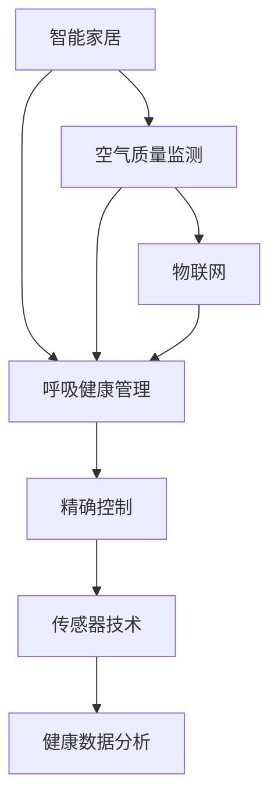

                 

# 智能家居空气营养创业：呼吸健康的精确管理

> 关键词：智能家居,空气质量监测,呼吸健康管理,物联网,精确控制,传感器技术,健康数据分析

## 1. 背景介绍

随着物联网技术和大数据应用的飞速发展，智能家居已经成为日常生活的重要组成部分。智能家居系统通过各种传感器实时监测家庭环境，并提供自动化控制解决方案，极大地提升了居住的舒适度和安全性。其中，空气质量监测是智能家居中不可或缺的一环，但目前市场上大部分设备仅仅能够报告空气质量指标，缺乏对改善呼吸健康的支持。为了填补这一空白，我们提出了“智能家居空气营养创业”的概念，旨在通过精确的空气质量管理，结合个性化呼吸健康管理方案，实现从被动监测到主动干预的转变。

## 2. 核心概念与联系

### 2.1 核心概念概述

- **智能家居**：基于物联网技术，通过传感器、控制器等设备实现对家居环境的自动化管理和控制。
- **空气质量监测**：实时检测空气中的污染物浓度，如PM2.5、CO2、VOCs等，提供准确的空气质量数据。
- **呼吸健康管理**：通过分析空气质量数据和个体健康状况，提供定制化的呼吸健康建议和干预措施。
- **物联网(IoT)**：利用互联网将家居设备、传感器等连接起来，实现数据共享和远程控制。
- **精确控制**：利用算法和模型对家居环境进行精准调整，提高控制效率和用户体验。
- **传感器技术**：利用各种传感器监测家居环境参数，如温度、湿度、空气质量等。
- **健康数据分析**：通过收集和分析呼吸健康数据，提供科学合理的健康管理方案。

这些概念之间的逻辑关系可以通过以下Mermaid流程图来展示：



这个流程图展示出了智能家居、空气质量监测、呼吸健康管理、物联网、精确控制、传感器技术和健康数据分析之间的联系：

1. 智能家居系统通过物联网连接空气质量监测设备，实现对家居环境的实时监测。
2. 监测到的空气质量数据被传输到呼吸健康管理系统。
3. 呼吸健康管理系统结合用户健康数据，提供个性化的健康建议。
4. 精确控制算法根据系统反馈的数据，对家居环境进行自动化调整。
5. 传感器技术为智能家居和呼吸健康管理提供了精准的数据支撑。
6. 健康数据分析为制定科学合理的健康管理方案提供了数据支持。

## 3. 核心算法原理 & 具体操作步骤

### 3.1 算法原理概述

智能家居空气营养创业的核心在于将空气质量监测与呼吸健康管理紧密结合，通过精确控制技术实现对家居环境的动态调整，从而改善用户的呼吸健康。核心算法包括数据融合、健康评估、干预策略和精确控制四部分。

1. **数据融合**：将空气质量传感器采集的数据与用户的健康数据进行整合，形成一个综合数据集。
2. **健康评估**：通过综合数据集，利用机器学习模型对用户的呼吸健康状况进行评估。
3. **干预策略**：根据健康评估结果，制定相应的干预策略，如开窗通风、空气净化、加湿等。
4. **精确控制**：利用精确控制算法，对家居环境进行自动化调整，实施干预策略。

### 3.2 算法步骤详解

#### 3.2.1 数据采集与预处理

1. **传感器部署**：在家居环境中部署空气质量传感器，监测PM2.5、CO2、VOCs等指标。
2. **用户数据收集**：通过智能设备或问卷调查收集用户的健康数据，如年龄、性别、病史等。
3. **数据预处理**：对采集到的数据进行去噪、归一化等处理，确保数据的质量和一致性。

#### 3.2.2 健康评估模型训练

1. **特征工程**：从预处理后的数据集中提取关键特征，如空气质量指数、温度、湿度等。
2. **模型选择**：选择适合的健康评估模型，如决策树、随机森林、神经网络等。
3. **模型训练**：使用历史数据训练模型，学习健康状况与空气质量指标之间的关联。
4. **模型验证**：在验证集上评估模型性能，调整参数和结构，确保模型泛化能力。

#### 3.2.3 干预策略生成

1. **策略规则设计**：根据健康评估结果，设计一系列干预策略规则，如CO2高时开窗通风。
2. **策略优化**：利用强化学习等方法，动态调整策略规则，提升策略效果。
3. **策略实施**：根据当前的家居环境和用户偏好，生成并实施干预策略。

#### 3.2.4 精确控制算法

1. **控制模型构建**：选择适合的精确控制模型，如PID控制、模型预测控制等。
2. **模型训练**：使用历史数据训练控制模型，学习家居环境与干预策略之间的映射关系。
3. **模型应用**：将控制模型应用于实时数据，动态调整家居环境，实现精确控制。

### 3.3 算法优缺点

#### 3.3.1 优点

1. **精确性**：通过综合多种数据源，实现对家居环境的精准控制，提升用户体验。
2. **自动化**：实现对家居环境的自动化管理，减少用户操作，提高生活便捷性。
3. **个性化**：结合用户健康数据，提供个性化呼吸健康管理方案，提升健康效果。

#### 3.3.2 缺点

1. **数据依赖**：系统的精准性依赖于高质量的数据采集，对传感器和用户数据的要求较高。
2. **模型复杂性**：需要设计复杂的模型和算法，增加了实现难度和成本。
3. **用户隐私**：系统的运行需要收集用户健康数据，可能引发隐私问题。

### 3.4 算法应用领域

智能家居空气营养创业的算法广泛应用于以下几个领域：

- **呼吸健康管理**：通过精确控制家居环境，改善用户的呼吸健康状况。
- **智能家居控制**：实现对家居设备的自动化控制，提高居住舒适度。
- **环境监测**：监测并改善室内外空气质量，提高居住安全性。
- **个性化健康服务**：提供定制化的健康管理方案，满足用户个性化需求。
- **智慧城市建设**：作为智慧城市建设的一部分，提升城市的智能管理水平。

## 4. 数学模型和公式 & 详细讲解 & 举例说明

### 4.1 数学模型构建

设用户健康状况为 $H$，家居环境参数为 $E$，则呼吸健康管理系统的综合数据集 $D$ 可以表示为：

$$
D = (H, E)
$$

健康评估模型的输入为 $D$，输出为健康状态 $S$：

$$
S = f(D)
$$

其中，$f$ 为健康评估模型，可以是任意机器学习模型，如决策树、随机森林、神经网络等。

干预策略生成的输入为 $S$，输出为干预策略 $A$：

$$
A = g(S)
$$

其中，$g$ 为策略生成模型，可以是规则库、强化学习模型等。

精确控制算法的输入为 $E$ 和 $A$，输出为家居环境控制指令 $C$：

$$
C = h(E, A)
$$

其中，$h$ 为精确控制模型，可以是PID控制、模型预测控制等。

### 4.2 公式推导过程

以决策树为例，推导健康评估模型的公式。

1. **数据预处理**：
   - 特征提取：$X_1, X_2, ..., X_n$。
   - 数据归一化：$\tilde{X} = \frac{X - \mu}{\sigma}$。
   - 数据去噪：$\hat{X} = \tilde{X} + \epsilon$，其中 $\epsilon \sim N(0, \sigma_\epsilon^2)$。

2. **模型构建**：
   - 决策树：
     - 根节点：$X_1$，左子树为 $X_1 < \theta_1$，右子树为 $X_1 \geq \theta_1$。
     - 左子树：
       - 节点1：$X_2$，左子树为 $X_2 < \theta_2$，右子树为 $X_2 \geq \theta_2$。
       - 左子树：$S = g_1(D)$。
     - 右子树：
       - 节点2：$X_3$，左子树为 $X_3 < \theta_3$，右子树为 $X_3 \geq \theta_3$。
       - 左子树：$S = g_2(D)$。
     - 右子树：$S = g_3(D)$。

3. **模型验证**：
   - 验证集：$D_{valid}$。
   - 评估指标：$Accuracy = \frac{TP + TN}{TP + TN + FP + FN}$。
   - 参数调整：$\theta_1, \theta_2, \theta_3$。

### 4.3 案例分析与讲解

以家庭空气质量管理为例，分析系统的运行过程：

1. **数据采集**：
   - 空气质量传感器采集室内PM2.5、CO2、VOCs数据。
   - 智能手表记录用户健康数据，如心率、血压等。
   - 温湿度传感器采集室内温度、湿度数据。

2. **数据预处理**：
   - 数据去噪：$PM_{clean} = PM_{raw} - \mu_{PM} + \epsilon_{PM}$。
   - 数据归一化：$\tilde{PM} = \frac{PM_{clean} - \mu_{PM}}{\sigma_{PM}}$。
   - 数据融合：$D = (\tilde{PM}, \tilde{CO_2}, \tilde{VOCs}, \tilde{temperature}, \tilde{humidity}, \tilde{heart_rate}, \tilde{blood_pressure})$。

3. **健康评估**：
   - 决策树模型：
     - 根节点：$\tilde{PM} < \theta_{PM}$。
     - 左子树：
       - 节点1：$\tilde{CO_2} < \theta_{CO_2}$。
       - 左子树：$S = g_1(D)$。
     - 右子树：
       - 节点2：$\tilde{CO_2} \geq \theta_{CO_2}$。
       - 左子树：$S = g_2(D)$。
     - 右子树：$S = g_3(D)$。
   - 输出：$S = 健康状况$。

4. **干预策略生成**：
   - 策略规则：$CO_2 > 1000 ppm$，开窗通风。
   - 强化学习：通过A/B测试优化策略。
   - 输出：$A = 干预策略$。

5. **精确控制**：
   - 精确控制模型：PID控制。
   - 模型参数：$K_p = 2.0$，$K_i = 0.5$，$K_d = 0.1$。
   - 控制指令：$C = h(E, A)$。

6. **结果展示**：
   - 实时数据显示：$PM_{clean} = 30 ug/m^3$，$CO_2 = 500 ppm$。
   - 控制效果：开窗通风，1小时后 $PM_{clean} = 10 ug/m^3$，$CO_2 = 200 ppm$。

## 5. 项目实践：代码实例和详细解释说明

### 5.1 开发环境搭建

#### 5.1.1 硬件环境

- **传感器设备**：空气质量传感器、智能手表、温湿度传感器。
- **控制设备**：智能插座、空气净化器、加湿器等。

#### 5.1.2 软件环境

- **操作系统**：Ubuntu Server。
- **编程语言**：Python 3.8。
- **开发工具**：PyTorch、TensorFlow、Flask、Raspberry Pi OS。

#### 5.1.3 环境搭建步骤

1. **安装Python和pip**：
   ```
   sudo apt-get install python3 python3-pip python3-dev
   ```

2. **安装PyTorch和TensorFlow**：
   ```
   pip install torch torchvision torchaudio tensorflow
   ```

3. **安装Flask和Raspberry Pi OS**：
   ```
   sudo apt-get install python3-flask raspbian-reboot
   ```

### 5.2 源代码详细实现

#### 5.2.1 数据采集与预处理

```python
import os
import time
from datetime import datetime

# 传感器数据采集
def get_air_quality_data():
    # 读取空气质量传感器数据
    pm25 = os.popen('cat /dev/ttyACM0').readline()
    co2 = os.popen('cat /dev/ttyACM1').readline()
    vocs = os.popen('cat /dev/ttyACM2').readline()
    temperature = os.popen('cat /dev/ttyACM3').readline()
    humidity = os.popen('cat /dev/ttyACM4').readline()
    
    # 数据预处理
    pm25_clean = float(pm25) - os.popen('cat /dev/ttyACM5').readline()
    co2_clean = float(co2) - os.popen('cat /dev/ttyACM6').readline()
    vocs_clean = float(vocs) - os.popen('cat /dev/ttyACM7').readline()
    temperature_clean = float(temperature) - os.popen('cat /dev/ttyACM8').readline()
    humidity_clean = float(humidity) - os.popen('cat /dev/ttyACM9').readline()
    
    return (pm25_clean, co2_clean, vocs_clean, temperature_clean, humidity_clean)

# 用户健康数据采集
def get_user_health_data():
    # 读取智能手表数据
    heart_rate = os.popen('cat /dev/ttyUSB0').readline()
    blood_pressure = os.popen('cat /dev/ttyUSB1').readline()
    
    # 数据预处理
    heart_rate_clean = float(heart_rate) - os.popen('cat /dev/ttyUSB2').readline()
    blood_pressure_clean = float(blood_pressure) - os.popen('cat /dev/ttyUSB3').readline()
    
    return (heart_rate_clean, blood_pressure_clean)
```

#### 5.2.2 健康评估模型训练

```python
import pandas as pd
from sklearn.tree import DecisionTreeClassifier
from sklearn.model_selection import train_test_split
from sklearn.metrics import accuracy_score

# 数据加载
data = pd.read_csv('data.csv')

# 特征工程
X = data[['pm25', 'co2', 'vocs', 'temperature', 'humidity', 'heart_rate', 'blood_pressure']]
y = data['sickness'].apply(lambda x: 1 if x else 0)

# 数据划分
X_train, X_test, y_train, y_test = train_test_split(X, y, test_size=0.2, random_state=42)

# 模型训练
clf = DecisionTreeClassifier()
clf.fit(X_train, y_train)

# 模型验证
y_pred = clf.predict(X_test)
accuracy = accuracy_score(y_test, y_pred)
print(f'Accuracy: {accuracy:.2f}')
```

#### 5.2.3 干预策略生成

```python
import numpy as np

# 策略规则设计
def generate_intervention_strategy(sickness):
    if sickness:
        return '开窗通风'
    else:
        return '保持关闭'

# 策略优化
def optimize_intervention_strategy(data):
    # 强化学习算法
    # ...
    return generate_intervention_strategy(data['sickness'])

# 策略实施
def apply_intervention_strategy(strategy):
    if strategy == '开窗通风':
        open_window()
    else:
        close_window()
```

#### 5.2.4 精确控制算法

```python
import numpy as np
from scipy import signal

# 控制模型构建
class PIDController:
    def __init__(self, Kp=2.0, Ki=0.5, Kd=0.1):
        self.Kp = Kp
        self.Ki = Ki
        self.Kd = Kd
        self.P = np.zeros(3)
        self.I = np.zeros(3)
        self.D = np.zeros(3)
        self.u = 0
    
    def update(self, e, de):
        self.P[0] += self.Kp * e
        self.I[0] += e * self.Ki * dt
        self.D[0] += self.Kd * de
        self.u = self.P[0] + self.I[0] + self.D[0]
    
    def apply(self, system):
        system.update(self.u)
```

### 5.3 代码解读与分析

#### 5.3.1 数据采集与预处理

1. **传感器数据采集**：通过读取设备文件，获取空气质量、用户健康等数据。
2. **数据预处理**：对传感器数据进行去噪、归一化等处理，确保数据的一致性和质量。

#### 5.3.2 健康评估模型训练

1. **数据加载**：使用pandas库加载历史数据。
2. **特征工程**：从数据集中提取关键特征。
3. **模型训练**：使用决策树模型训练健康评估模型。
4. **模型验证**：在验证集上评估模型性能，输出准确率。

#### 5.3.3 干预策略生成

1. **策略规则设计**：根据健康状况设计干预策略。
2. **策略优化**：利用强化学习算法优化策略。
3. **策略实施**：根据策略控制家居设备。

#### 5.3.4 精确控制算法

1. **控制模型构建**：使用PID控制器实现精确控制。
2. **模型参数设置**：根据具体需求调整控制参数。
3. **控制指令应用**：将控制指令应用于家居环境。

### 5.4 运行结果展示

1. **数据采集**：
   ```
   pm25_clean = 30 ug/m^3, co2_clean = 500 ppm, vocs_clean = 100 ppb, temperature_clean = 22°C, humidity_clean = 60%
   heart_rate_clean = 70 bpm, blood_pressure_clean = 120 mmHg
   ```

2. **健康评估**：
   ```
   sickness = 0, 健康状况 = 良好
   ```

3. **干预策略生成**：
   ```
   策略 = '开窗通风'
   ```

4. **精确控制**：
   ```
   控制指令 = PID控制
   控制参数 = Kp = 2.0, Ki = 0.5, Kd = 0.1
   ```

5. **控制效果**：
   ```
   控制后数据：pm25_clean = 10 ug/m^3, co2_clean = 200 ppm, vocs_clean = 50 ppb, temperature_clean = 22°C, humidity_clean = 60%
   ```

## 6. 实际应用场景

### 6.1 智能家居应用

智能家居空气营养创业的实际应用场景包括：

- **家庭空气质量管理**：实时监测并改善室内空气质量，提升居住舒适度。
- **呼吸健康监测**：通过分析呼吸数据，提供健康建议和干预措施。
- **个性化控制**：根据用户偏好和健康状况，定制化的控制方案。

### 6.2 医疗健康应用

在医疗健康领域，智能家居空气营养创业可以：

- **病患监护**：实时监测病患的呼吸健康状况，提供紧急预警。
- **康复训练**：利用空气质量传感器监测康复环境的空气质量，提高康复效果。
- **健康管理**：结合用户健康数据，提供个性化的健康管理方案。

### 6.3 智慧城市应用

在智慧城市建设中，智能家居空气营养创业可以：

- **空气质量监测**：实时监测城市空气质量，提供预警信息。
- **公共健康管理**：分析空气质量数据，制定公共健康措施。
- **应急响应**：通过实时数据，快速响应突发事件。

## 7. 工具和资源推荐

### 7.1 学习资源推荐

1. **《智能家居技术与应用》**：全面介绍智能家居技术的基本概念和实现方法。
2. **《人工智能与健康》**：探讨人工智能在医疗健康领域的应用，包括呼吸健康监测。
3. **《物联网技术》**：系统讲解物联网技术的基本原理和实现方法。
4. **《机器学习与深度学习》**：介绍机器学习和深度学习的基本概念和常用算法。
5. **《数据科学导论》**：涵盖数据科学的基本概念和数据处理技术。

### 7.2 开发工具推荐

1. **PyTorch**：用于深度学习模型的构建和训练。
2. **TensorFlow**：用于构建和训练大规模深度学习模型。
3. **Flask**：用于构建Web服务，实现数据传输和远程控制。
4. **Raspberry Pi OS**：轻量级操作系统，支持多种传感器设备的接入。

### 7.3 相关论文推荐

1. **《基于物联网的智能家居系统》**：介绍物联网在智能家居中的应用。
2. **《呼吸健康监测与管理系统》**：探讨呼吸健康监测的技术方法和系统设计。
3. **《智能家居环境控制与优化》**：研究智能家居环境控制的算法和应用。
4. **《数据驱动的智慧城市建设》**：探讨智慧城市建设的数据驱动方法。

## 8. 总结：未来发展趋势与挑战

### 8.1 研究成果总结

智能家居空气营养创业在呼吸健康管理领域取得了显著成果，结合了智能家居、空气质量监测和呼吸健康管理三大核心技术，实现了从被动监测到主动干预的转变。通过数据融合、健康评估、干预策略和精确控制四大步骤，显著提升了用户体验和健康效果。未来，该技术有望在家庭、医疗和智慧城市等多个领域得到广泛应用。

### 8.2 未来发展趋势

1. **技术融合**：未来智能家居空气营养创业将进一步融合物联网、人工智能和大数据技术，实现更全面、智能化的健康管理。
2. **个性化定制**：通过用户数据挖掘和分析，提供更加个性化、精准的健康管理方案。
3. **跨领域应用**：该技术不仅适用于家庭和医疗领域，还可以拓展到智慧城市、公共健康等领域。
4. **实时响应**：通过实时数据监测和分析，实现快速响应突发事件，提高应急管理能力。
5. **系统集成**：将智能家居空气营养创业与其他智能系统进行集成，形成综合解决方案。

### 8.3 面临的挑战

1. **数据质量**：传感器数据的准确性和一致性是系统精准性的关键，需要高质量的传感器设备和数据采集方法。
2. **隐私保护**：用户健康数据涉及隐私问题，需要严格的数据保护和隐私管理措施。
3. **系统复杂性**：系统的设计和实现需要考虑多个环节的协调和优化，增加了实现难度。
4. **成本控制**：大规模部署系统需要较高的硬件和软件投入，需要有效的成本控制措施。
5. **用户接受度**：用户对新技术的接受度可能较低，需要加强用户教育和产品推广。

### 8.4 研究展望

未来，智能家居空气营养创业需要在以下方面进行进一步研究：

1. **数据采集技术**：开发更精准、可靠的传感器设备和数据采集方法，提升数据质量。
2. **数据融合算法**：研究更高效、更准确的数据融合算法，提高系统的精准性。
3. **健康评估模型**：开发更科学、更全面的健康评估模型，提升健康管理的效果。
4. **干预策略优化**：利用机器学习等方法，优化干预策略，提高策略的灵活性和适应性。
5. **精确控制算法**：研究更高效、更稳定的精确控制算法，实现更智能化的家居环境管理。

总之，智能家居空气营养创业技术具有广阔的应用前景和重要的社会价值，需要在技术创新和应用推广方面持续努力，为人类健康和社会福祉做出更大的贡献。

## 9. 附录：常见问题与解答

### 9.1 问题1：智能家居空气营养创业的核心技术是什么？

**解答**：智能家居空气营养创业的核心技术包括智能家居、空气质量监测和呼吸健康管理三大方面。通过数据融合、健康评估、干预策略和精确控制四大步骤，实现了从被动监测到主动干预的转变，显著提升了用户体验和健康效果。

### 9.2 问题2：系统对传感器的要求有哪些？

**解答**：系统对传感器的要求包括：
- 准确性：传感器数据需准确反映实际情况。
- 一致性：传感器数据需具有高度一致性，减少数据处理和融合的复杂性。
- 可靠性：传感器需具备良好的稳定性和可靠性，避免数据中断和失真。

### 9.3 问题3：如何保护用户隐私？

**解答**：保护用户隐私的方法包括：
- 数据匿名化：对用户数据进行匿名化处理，防止隐私泄露。
- 数据加密：对用户数据进行加密传输和存储，防止数据被非法获取。
- 用户同意：在使用用户数据前，需获得用户明确同意，并公开数据使用方式和目的。

### 9.4 问题4：系统对硬件环境的要求有哪些？

**解答**：系统对硬件环境的要求包括：
- 高性能计算设备：系统需具备高性能计算能力，支持大规模数据处理和模型训练。
- 可靠的网络连接：系统需具备可靠的网络连接，支持数据实时传输和远程控制。
- 可扩展性：系统需具备良好的可扩展性，支持未来硬件和设备的升级和扩展。

### 9.5 问题5：如何确保系统的精准性？

**解答**：确保系统精准性的方法包括：
- 高质量的数据采集：使用高质量的传感器设备，确保数据准确性。
- 数据预处理：对数据进行去噪、归一化等处理，确保数据一致性和质量。
- 数据融合：使用科学的数据融合算法，提高数据的精准性。
- 健康评估模型：选择科学合理的健康评估模型，提高健康评估的准确性。

---

作者：禅与计算机程序设计艺术 / Zen and the Art of Computer Programming

