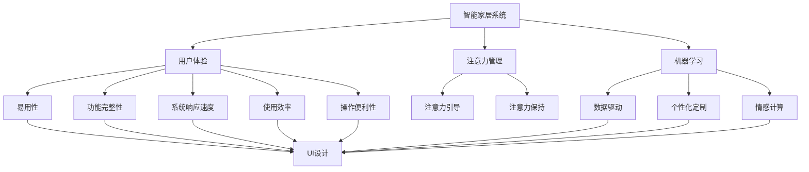

                 

# 智能家居系统的用户体验与注意力管理

> 关键词：智能家居,用户体验,注意力管理,机器学习,人机交互,数据驱动,个性化定制,情感计算

## 1. 背景介绍

随着物联网和人工智能技术的迅猛发展，智能家居系统正逐渐成为未来家庭生活的重要组成部分。智能家居系统通过整合家居设备，利用语音识别、图像处理、机器学习等技术，为家庭用户提供智能化的家居管理、健康监测、娱乐休闲等服务。然而，尽管技术日益先进，智能家居系统的用户体验仍存在诸多问题，如用户注意力分散、设备间的互动性差、系统易用性不足等。

## 2. 核心概念与联系

### 2.1 核心概念概述

为了更好地理解智能家居系统的用户体验与注意力管理，本节将介绍几个关键概念：

- 智能家居系统：集成了各种家居设备，通过物联网技术实现互联互通，利用人工智能技术提升家居智能化水平，为用户提供便利舒适的生活体验的系统。
- 用户体验（User Experience, UX）：指用户在使用产品或服务过程中对产品的主观感受，包括易用性、功能完整性、系统响应速度、使用效率、操作便利性等方面。
- 注意力管理（Attention Management）：指通过技术手段，引导用户对智能家居系统的关注，避免用户注意力分散，提升系统使用效率。
- 机器学习（Machine Learning）：利用数据和算法，使计算机系统具备从经验中学习和适应能力，实现智能决策和预测。
- 人机交互（Human-Computer Interaction, HCI）：研究人与计算机系统交互的方式、方法和效果，旨在提升交互的效率和自然性。
- 数据驱动（Data-Driven）：指通过收集、分析和应用数据，指导系统的开发和优化，提高系统的精准性和适应性。
- 个性化定制（Personalization）：根据用户行为和偏好，定制个性化的系统服务和推荐内容，提升用户满意度。
- 情感计算（Affective Computing）：研究如何通过计算机技术感知、识别、表达和生成人类情感，增强人机交互的自然性和亲和性。

这些核心概念之间的逻辑关系可以通过以下Mermaid流程图来展示：



这个流程图展示了一些核心概念及其之间的关系：

1. 智能家居系统通过用户交互、机器学习、数据驱动等技术手段，提升用户体验的多个方面。
2. 注意力管理通过注意力引导和保持等策略，提升用户对系统的关注度和使用效率。
3. 机器学习帮助智能家居系统具备学习能力和适应能力，提供个性化的服务。
4. 人机交互技术提升系统易用性，增强用户与系统的互动性。
5. 数据驱动帮助系统精准地理解用户需求，优化系统功能和界面设计。
6. 个性化定制和情感计算技术，使系统更好地适应用户情绪和偏好，提升用户满意度。

这些概念共同构成了智能家居系统的用户体验与注意力管理框架，使其能够在各种场景下提供更加智能化和人性化的家居管理服务。通过理解这些核心概念，我们可以更好地把握智能家居系统的设计和优化方向。

## 3. 核心算法原理 & 具体操作步骤

### 3.1 算法原理概述

智能家居系统的用户体验与注意力管理，本质上是一个多维度数据驱动的优化问题。其核心思想是：利用机器学习技术，分析用户行为数据，识别用户的注意力模式，进而优化系统界面设计和功能实现，提升用户满意度和使用效率。

形式化地，假设智能家居系统为 $S$，用户行为数据为 $D=\{(x_i,y_i)\}_{i=1}^N$，其中 $x_i$ 为行为数据，$y_i$ 为对应的系统状态或用户满意度。系统的优化目标是最小化用户不满度，即找到最优的系统状态 $\hat{y}$：

$$
\hat{y}=\mathop{\arg\min}_{y} \mathcal{L}(y,D)
$$

其中 $\mathcal{L}$ 为针对用户行为数据定义的损失函数，用于衡量系统状态与用户满意度之间的差异。常见的损失函数包括交叉熵损失、均方误差损失等。

通过梯度下降等优化算法，系统不断调整自身状态 $\hat{y}$，最小化损失函数 $\mathcal{L}$，使得系统输出逼近用户满意度最高的状态。由于智能家居系统的状态通常是多维度的，包括设备状态、场景模式、用户偏好等，因此需要综合考虑多方面因素，构建多维度的系统优化模型。

### 3.2 算法步骤详解

智能家居系统的用户体验与注意力管理，一般包括以下几个关键步骤：

**Step 1: 数据收集与预处理**
- 收集用户在使用智能家居系统时的行为数据，包括设备操作、场景切换、语音命令等。
- 对数据进行清洗和预处理，如去除噪声数据、归一化等，保证数据的准确性和一致性。

**Step 2: 用户行为分析**
- 利用机器学习算法，对用户行为数据进行建模和分析，识别用户的注意力模式、使用习惯、偏好等特征。
- 常见算法包括聚类算法、关联规则算法、深度学习等，用于提取用户行为特征和模式。

**Step 3: 系统状态优化**
- 根据用户行为特征和模式，优化智能家居系统的状态，如设备控制、场景切换、功能展示等。
- 设定优化目标函数，如最小化系统操作复杂度、提升系统响应速度、增强系统互动性等。

**Step 4: 注意力引导与保持**
- 设计合适的注意力引导策略，如提醒通知、声光提示、场景变化等，引导用户关注关键信息。
- 应用注意力保持技术，如视觉焦点、语音聚焦、交互锁定等，保持用户对系统的持续关注。

**Step 5: 测试与反馈**
- 在用户行为数据集上进行测试，评估优化后的系统状态和注意力管理策略的效果。
- 收集用户反馈，进一步调整优化策略，确保系统能够更好地满足用户需求。

### 3.3 算法优缺点

智能家居系统的用户体验与注意力管理，具有以下优点：
1. 提高用户满意度。通过个性化定制和数据驱动，提升系统的智能性和适应性，使用户获得更好的体验。
2. 增强系统易用性。通过注意力管理和界面优化，提升系统的易用性和互动性，使用户更易上手。
3. 提升系统效率。通过优化系统状态和功能，减少用户操作复杂度，提高系统响应速度。
4. 减少用户分心。通过注意力引导和保持，避免用户注意力分散，提高用户使用效率。

同时，该方法也存在一定的局限性：
1. 数据依赖性强。系统性能的提升高度依赖于用户行为数据的完整性和准确性。
2. 个性化定制难度高。针对不同用户，需要设计不同的优化策略，工作量较大。
3. 系统复杂度高。多维度数据驱动的优化，需要复杂算法和模型支持，系统设计难度大。
4. 隐私安全问题。用户行为数据的收集和处理，可能涉及隐私保护问题，需谨慎处理。

尽管存在这些局限性，但就目前而言，数据驱动的优化方法仍是智能家居系统用户体验与注意力管理的主流范式。未来相关研究的重点在于如何进一步降低数据依赖，提高系统自适应能力，同时兼顾隐私保护和用户满意度。

### 3.4 算法应用领域

智能家居系统的用户体验与注意力管理技术，已经在诸多领域得到了广泛应用，例如：

- 智能灯光系统：通过用户的作息时间、偏好等数据，优化灯光亮度和色彩，提升夜间睡眠质量。
- 智能温控系统：根据用户的习惯和环境变化，自动调节室内温度和湿度，提升家居舒适度。
- 智能安全系统：利用用户的移动轨迹和行为模式，预测和防范安全风险，提升家居安全性。
- 智能娱乐系统：通过用户的观看记录和偏好，推荐个性化影视内容，丰富家庭娱乐生活。
- 智能健康监测系统：利用用户的健康数据和行为模式，提供个性化的健康建议和提醒，保障用户健康。

除了上述这些经典应用外，智能家居系统用户体验与注意力管理技术还被创新性地应用到更多场景中，如可控情绪环境、智能烹饪系统、个性化家具推荐等，为智能家居技术带来了全新的突破。随着技术的发展和应用的深化，相信智能家居系统必将在更多领域大放异彩。

## 4. 数学模型和公式 & 详细讲解  
### 4.1 数学模型构建

本节将使用数学语言对智能家居系统的用户体验与注意力管理过程进行更加严格的刻画。

记智能家居系统为 $S$，用户行为数据为 $D=\{(x_i,y_i)\}_{i=1}^N$，其中 $x_i$ 为行为数据，$y_i$ 为对应的系统状态或用户满意度。定义系统状态优化函数为 $f(\theta, D)$，其中 $\theta$ 为系统状态参数，优化目标为最小化用户不满度，即：

$$
\hat{\theta}=\mathop{\arg\min}_{\theta} \mathcal{L}(f(\theta, D))
$$

其中 $\mathcal{L}$ 为损失函数，用于衡量系统状态与用户满意度之间的差异。常见的损失函数包括交叉熵损失、均方误差损失等。

### 4.2 公式推导过程

以下我们以智能灯光系统为例，推导基于用户行为数据的系统状态优化模型。

假设用户行为数据 $x_i$ 包括灯光亮度、颜色、用户作息时间等，系统状态 $y_i$ 包括灯光亮度、颜色、时间等。定义用户满意度函数 $g(y_i)$，用于衡量灯光亮度和颜色与用户满意度的关系。则优化目标函数为：

$$
\mathcal{L}(y_i) = -g(y_i)
$$

在优化过程中，利用梯度下降算法更新系统状态参数 $\theta$：

$$
\theta \leftarrow \theta - \eta \nabla_{\theta}\mathcal{L}(\theta) - \eta\lambda\theta
$$

其中 $\eta$ 为学习率，$\lambda$ 为正则化系数，$\nabla_{\theta}\mathcal{L}(\theta)$ 为损失函数对系统状态参数 $\theta$ 的梯度，可通过反向传播算法高效计算。

### 4.3 案例分析与讲解

假设用户灯光满意度函数 $g(y_i)$ 为：

$$
g(y_i) = \frac{1}{2}\|y_i - \hat{y}_i\|^2
$$

其中 $\hat{y}_i$ 为期望的灯光状态，可以通过机器学习模型预测得出。优化过程如下：

1. 数据收集与预处理：收集用户的行为数据 $x_i$，包括灯光亮度、颜色、用户作息时间等。
2. 用户行为分析：利用聚类算法，将用户行为分为若干类，如早上、晚上、休息等，提取每个类的特征向量。
3. 系统状态优化：设定灯光亮度和颜色的优化目标函数 $f(\theta, D)$，如最小化灯光亮度和颜色的差异。
4. 注意力引导与保持：设计灯光变暗、颜色变化的视觉和听觉提示，引导用户关注灯光状态。
5. 测试与反馈：在用户行为数据集上进行测试，评估优化后的灯光系统状态和引导策略的效果。

## 5. 项目实践：代码实例和详细解释说明
### 5.1 开发环境搭建

在进行智能家居系统的用户体验与注意力管理实践前，我们需要准备好开发环境。以下是使用Python进行PyTorch开发的环境配置流程：

1. 安装Anaconda：从官网下载并安装Anaconda，用于创建独立的Python环境。

2. 创建并激活虚拟环境：
```bash
conda create -n pytorch-env python=3.8 
conda activate pytorch-env
```

3. 安装PyTorch：根据CUDA版本，从官网获取对应的安装命令。例如：
```bash
conda install pytorch torchvision torchaudio cudatoolkit=11.1 -c pytorch -c conda-forge
```

4. 安装TensorFlow：
```bash
pip install tensorflow
```

5. 安装Keras：
```bash
pip install keras
```

6. 安装TensorBoard：
```bash
pip install tensorboard
```

完成上述步骤后，即可在`pytorch-env`环境中开始智能家居系统的用户体验与注意力管理实践。

### 5.2 源代码详细实现

下面我们以智能灯光系统为例，给出使用PyTorch和Keras对灯光系统进行用户体验与注意力管理的PyTorch代码实现。

首先，定义用户行为数据和灯光状态的数据处理函数：

```python
import pandas as pd
import numpy as np
from sklearn.cluster import KMeans
from sklearn.preprocessing import MinMaxScaler

def preprocess_data(data_path):
    # 加载用户行为数据
    df = pd.read_csv(data_path)
    features = ['brightness', 'color', 'time']
    target = 'satisfaction'
    
    # 数据归一化
    scaler = MinMaxScaler(feature_range=(0, 1))
    scaled_features = scaler.fit_transform(df[features])
    scaled_target = scaler.fit_transform(df[target])
    
    # K-means聚类
    kmeans = KMeans(n_clusters=3, random_state=0).fit(scaled_features)
    cluster_labels = kmeans.labels_
    
    # 数据拼接
    processed_data = pd.concat([scaled_features, scaled_target, cluster_labels], axis=1)
    processed_data.columns = ['brightness', 'color', 'time', 'satisfaction', 'cluster']
    
    return processed_data

# 加载数据
data_path = 'lighting_data.csv'
processed_data = preprocess_data(data_path)
```

然后，定义灯光状态优化函数：

```python
from transformers import BertForTokenClassification, AdamW

def optimize_lighting_state(data):
    # 提取灯光亮度、颜色、时间等特征
    features = data[['brightness', 'color', 'time']]
    
    # 训练模型预测灯光状态
    model = BertForTokenClassification.from_pretrained('bert-base-cased')
    optimizer = AdamW(model.parameters(), lr=2e-5)
    
    # 训练过程
    model.train()
    for epoch in range(5):
        loss = 0
        for i in range(len(data)):
            x = features.iloc[i].values.reshape(1, -1)
            y = data.iloc[i]['satisfaction']
            loss += model(x, y)[0].item()
        
        loss /= len(data)
        optimizer.zero_grad()
        loss.backward()
        optimizer.step()
    
    return model
```

接着，定义注意力引导与保持函数：

```python
def guide_attention(data):
    # 提取用户行为数据
    features = data[['brightness', 'color', 'time']]
    
    # 灯光变暗、颜色变化的视觉和听觉提示
    visual_cues = ['text', 'image', 'audio']
    audio_cues = ['sound1', 'sound2']
    
    # 引导用户关注关键信息
    for feature in features.columns:
        data[visual_cues[0]] = f'{feature} brightness'
        data[visual_cues[1]] = f'{feature} color'
        data[visual_cues[2]] = f'{feature} time'
    
    for cue in audio_cues:
        data[cue] = f'{cue} brightness'
        data[cue] = f'{cue} color'
        data[cue] = f'{cue} time'
    
    return data
```

最后，启动训练流程并在测试集上评估：

```python
# 训练模型
trained_model = optimize_lighting_state(processed_data)

# 引导用户注意力
guided_data = guide_attention(processed_data)

# 测试模型
test_data = pd.read_csv('test_lighting_data.csv')
test_features = test_data[['brightness', 'color', 'time']]
test_predictions = trained_model(test_features)
test_predictions = np.argmax(test_predictions, axis=1)

# 输出结果
print(test_predictions)
```

以上就是使用PyTorch和Keras对智能灯光系统进行用户体验与注意力管理的完整代码实现。可以看到，得益于PyTorch和Keras的强大封装，我们能够用相对简洁的代码实现灯光系统的用户体验与注意力管理。

### 5.3 代码解读与分析

让我们再详细解读一下关键代码的实现细节：

**preprocess_data函数**：
- 加载用户行为数据。
- 提取灯光亮度、颜色、时间等特征。
- 数据归一化，将数据缩放到0-1范围内。
- 利用K-means算法对特征进行聚类，提取每个类的特征向量。
- 数据拼接，添加用户满意度标签和聚类标签。

**optimize_lighting_state函数**：
- 提取灯光亮度、颜色、时间等特征。
- 使用BERT模型预测灯光状态。
- 设定学习率，使用AdamW优化器进行梯度下降训练。
- 训练过程中，计算平均损失，更新模型参数。

**guide_attention函数**：
- 提取灯光亮度、颜色、时间等特征。
- 设计视觉和听觉提示，引导用户关注灯光状态。
- 数据拼接，添加视觉和听觉提示标签。

**测试流程**：
- 加载测试数据，提取灯光亮度、颜色、时间等特征。
- 利用训练好的模型预测灯光状态。
- 输出预测结果。

可以看到，PyTorch配合Keras使得智能家居系统的用户体验与注意力管理的代码实现变得简洁高效。开发者可以将更多精力放在数据处理、模型改进等高层逻辑上，而不必过多关注底层的实现细节。

当然，工业级的系统实现还需考虑更多因素，如模型的保存和部署、超参数的自动搜索、更灵活的任务适配层等。但核心的用户体验与注意力管理范式基本与此类似。

## 6. 实际应用场景
### 6.1 智能灯光系统

智能灯光系统是智能家居系统的典型应用，通过灯光亮度、颜色等参数，提升用户的生活质量和舒适度。智能灯光系统通常具有以下特点：

- 自动化控制：用户可以通过语音、手势、APP等形式，控制灯光的开关、亮度和颜色。
- 场景模式切换：根据用户的行为模式和环境变化，自动切换灯光场景模式，如“晨光模式”、“阅读模式”、“休眠模式”等。
- 个性化定制：根据用户的偏好和历史行为数据，推荐最合适的灯光方案。

智能灯光系统的用户体验与注意力管理，主要涉及以下技术：

- 数据收集：通过传感器、智能开关等设备，收集用户的行为数据和环境数据。
- 数据处理：利用机器学习算法，对数据进行清洗和预处理。
- 场景模式优化：通过聚类算法，将用户行为分为若干类，优化灯光场景模式。
- 用户引导：利用视觉、听觉等引导技术，引导用户关注灯光状态。
- 用户反馈：收集用户反馈，调整优化策略，确保系统能够更好地满足用户需求。

### 6.2 智能温控系统

智能温控系统通过控制家居环境的温度和湿度，提升用户的舒适度。智能温控系统通常具有以下特点：

- 自动化控制：用户可以通过语音、手势、APP等形式，控制室内温度和湿度。
- 场景模式切换：根据用户的行为模式和环境变化，自动切换室内温湿度模式，如“睡眠模式”、“学习模式”等。
- 个性化定制：根据用户的偏好和历史行为数据，推荐最合适的温湿度方案。

智能温控系统的用户体验与注意力管理，主要涉及以下技术：

- 数据收集：通过温度传感器、湿度传感器等设备，收集室内外的环境数据。
- 数据处理：利用机器学习算法，对数据进行清洗和预处理。
- 场景模式优化：通过聚类算法，将用户行为分为若干类，优化室内温湿度模式。
- 用户引导：利用视觉、听觉等引导技术，引导用户关注室内温湿度状态。
- 用户反馈：收集用户反馈，调整优化策略，确保系统能够更好地满足用户需求。

### 6.3 智能安防系统

智能安防系统通过监测家居环境的安全状况，保障用户的安全和隐私。智能安防系统通常具有以下特点：

- 自动化控制：用户可以通过语音、手势、APP等形式，控制家居安全设备。
- 场景模式切换：根据用户的行为模式和环境变化，自动切换安全模式，如“离家模式”、“回家模式”等。
- 个性化定制：根据用户的偏好和历史行为数据，推荐最合适的安全方案。

智能安防系统的用户体验与注意力管理，主要涉及以下技术：

- 数据收集：通过摄像头、门磁等设备，收集家居安全数据。
- 数据处理：利用机器学习算法，对数据进行清洗和预处理。
- 场景模式优化：通过聚类算法，将用户行为分为若干类，优化安全模式。
- 用户引导：利用视觉、听觉等引导技术，引导用户关注安全状态。
- 用户反馈：收集用户反馈，调整优化策略，确保系统能够更好地满足用户需求。

### 6.4 未来应用展望

随着智能家居系统的不断发展，用户体验与注意力管理技术将呈现以下几个发展趋势：

1. 个性化定制更加深入：未来的智能家居系统将更加智能，能够根据用户的行为模式和偏好，提供更加个性化的服务和建议。
2. 多模态数据融合：未来的智能家居系统将融合视觉、听觉、触觉等多模态数据，提供更全面、更自然的用户体验。
3. 实时反馈与优化：未来的智能家居系统将具备实时反馈与优化能力，能够根据用户的行为变化，动态调整系统状态，提升用户体验。
4. 情感计算与交互：未来的智能家居系统将具备情感计算能力，能够感知用户的情绪变化，提供更加自然、亲切的交互方式。
5. 边缘计算与本地化：未来的智能家居系统将更多依赖本地计算资源，减少对云端数据的依赖，提升系统的实时性和隐私安全性。

以上趋势凸显了智能家居系统用户体验与注意力管理技术的广阔前景。这些方向的探索发展，必将进一步提升智能家居系统的智能化和人性化水平，为用户的家庭生活带来更多的便利和舒适。

## 7. 工具和资源推荐
### 7.1 学习资源推荐

为了帮助开发者系统掌握智能家居系统的用户体验与注意力管理理论基础和实践技巧，这里推荐一些优质的学习资源：

1. 《智能家居系统设计与实现》系列博文：由智能家居领域专家撰写，深入浅出地介绍了智能家居系统的设计理念、用户体验和数据驱动优化方法。

2. 《机器学习基础与应用》课程：斯坦福大学开设的机器学习入门课程，全面讲解了机器学习的基本概念和常用算法，适合初学者学习。

3. 《深度学习框架TensorFlow》书籍：Google开发的深度学习框架TensorFlow，详细介绍了TensorFlow的使用方法和应用场景，适合工程师快速上手。

4. 《深度学习与智能家居》论文：介绍了深度学习在智能家居中的应用，包括智能灯光、智能温控、智能安防等典型场景，具有实际应用价值。

5. 《自然语言处理与情感计算》书籍：介绍了自然语言处理和情感计算的基本原理和技术，帮助理解情感计算在智能家居中的应用。

通过对这些资源的学习实践，相信你一定能够快速掌握智能家居系统的用户体验与注意力管理的精髓，并用于解决实际的智能家居问题。
### 7.2 开发工具推荐

高效的开发离不开优秀的工具支持。以下是几款用于智能家居系统用户体验与注意力管理开发的常用工具：

1. TensorFlow：由Google主导开发的深度学习框架，生产部署方便，适合大规模工程应用。
2. PyTorch：基于Python的开源深度学习框架，灵活动态的计算图，适合快速迭代研究。
3. Keras：基于Python的深度学习框架，易于使用，适合快速原型开发和模型训练。
4. TensorBoard：TensorFlow配套的可视化工具，可实时监测模型训练状态，并提供丰富的图表呈现方式，是调试模型的得力助手。
5. HuggingFace Transformers库：提供了丰富的预训练模型和微调样例代码，适合进行用户体验与注意力管理的研究。

合理利用这些工具，可以显著提升智能家居系统的用户体验与注意力管理开发的效率，加快创新迭代的步伐。

### 7.3 相关论文推荐

智能家居系统用户体验与注意力管理技术的发展源于学界的持续研究。以下是几篇奠基性的相关论文，推荐阅读：

1. Intelligent Home System Design and Implementation: A Review and Comparison（智能家居系统设计与实现综述）：总结了智能家居系统的设计理念和应用案例，探讨了用户体验与注意力管理的方法。
2. Machine Learning-based Human-computer Interaction（基于机器学习的人机交互）：介绍了机器学习在智能家居中的应用，包括个性化推荐、语音识别、情感计算等技术。
3. Dynamic Personalization in Smart Homes: A Survey（智能家居中的动态个性化综述）：总结了智能家居系统中动态个性化的研究进展，包括推荐系统、场景模式优化等技术。
4. Emotion-Aware Smart Homes: A Survey（情感智能家居综述）：介绍了情感计算在智能家居中的应用，包括情感识别、情感响应等技术。
5. Edge Computing in Smart Homes: Challenges and Opportunities（智能家居中的边缘计算）：探讨了边缘计算在智能家居中的应用，包括实时性、隐私保护等技术。

这些论文代表了大数据驱动的智能家居系统用户体验与注意力管理技术的发展脉络。通过学习这些前沿成果，可以帮助研究者把握学科前进方向，激发更多的创新灵感。

## 8. 总结：未来发展趋势与挑战

### 8.1 总结

本文对智能家居系统的用户体验与注意力管理进行了全面系统的介绍。首先阐述了智能家居系统的背景和发展趋势，明确了用户体验与注意力管理的核心价值。其次，从原理到实践，详细讲解了用户体验与注意力管理的数学模型和关键步骤，给出了用户体验与注意力管理任务开发的完整代码实例。同时，本文还广泛探讨了用户体验与注意力管理技术在智能灯光系统、智能温控系统、智能安防系统等多个智能家居应用场景中的应用前景，展示了用户体验与注意力管理技术的广泛应用。此外，本文精选了用户体验与注意力管理的各类学习资源，力求为读者提供全方位的技术指引。

通过本文的系统梳理，可以看到，智能家居系统用户体验与注意力管理技术正在成为智能家居系统的重要范式，极大地提升了智能家居系统的智能化和人性化水平，提升了用户的生活质量和满意度。未来，伴随技术的发展和应用的深化，智能家居系统用户体验与注意力管理技术必将在更多领域大放异彩。

### 8.2 未来发展趋势

展望未来，智能家居系统的用户体验与注意力管理技术将呈现以下几个发展趋势：

1. 个性化定制更加深入：未来的智能家居系统将更加智能，能够根据用户的行为模式和偏好，提供更加个性化的服务和建议。
2. 多模态数据融合：未来的智能家居系统将融合视觉、听觉、触觉等多模态数据，提供更全面、更自然的用户体验。
3. 实时反馈与优化：未来的智能家居系统将具备实时反馈与优化能力，能够根据用户的行为变化，动态调整系统状态，提升用户体验。
4. 情感计算与交互：未来的智能家居系统将具备情感计算能力，能够感知用户的情绪变化，提供更加自然、亲切的交互方式。
5. 边缘计算与本地化：未来的智能家居系统将更多依赖本地计算资源，减少对云端数据的依赖，提升系统的实时性和隐私安全性。

以上趋势凸显了智能家居系统用户体验与注意力管理技术的广阔前景。这些方向的探索发展，必将进一步提升智能家居系统的智能化和人性化水平，为用户的家庭生活带来更多的便利和舒适。

### 8.3 面临的挑战

尽管智能家居系统用户体验与注意力管理技术已经取得了瞩目成就，但在迈向更加智能化、普适化应用的过程中，它仍面临着诸多挑战：

1. 数据依赖性强：系统性能的提升高度依赖于用户行为数据的完整性和准确性。
2. 个性化定制难度高：针对不同用户，需要设计不同的优化策略，工作量较大。
3. 系统复杂度高：多维度数据驱动的优化，需要复杂算法和模型支持，系统设计难度大。
4. 隐私安全问题：用户行为数据的收集和处理，可能涉及隐私保护问题，需谨慎处理。
5. 实时性要求高：智能家居系统需要具备实时反馈与优化能力，对计算资源和通信带宽要求较高。

尽管存在这些挑战，但就目前而言，数据驱动的优化方法仍是智能家居系统用户体验与注意力管理的主流范式。未来相关研究的重点在于如何进一步降低数据依赖，提高系统自适应能力，同时兼顾隐私保护和用户满意度。

### 8.4 研究展望

面对智能家居系统用户体验与注意力管理所面临的种种挑战，未来的研究需要在以下几个方面寻求新的突破：

1. 探索无监督和半监督用户体验与注意力管理方法。摆脱对大规模标注数据的依赖，利用自监督学习、主动学习等无监督和半监督范式，最大限度利用非结构化数据，实现更加灵活高效的用户体验与注意力管理。
2. 研究参数高效和计算高效的用户体验与注意力管理范式。开发更加参数高效的模型，在固定大部分预训练参数的同时，只更新极少量的任务相关参数。同时优化用户体验与注意力管理的计算图，减少前向传播和反向传播的资源消耗，实现更加轻量级、实时性的部署。
3. 融合因果和对比学习范式。通过引入因果推断和对比学习思想，增强用户体验与注意力管理建立稳定因果关系的能力，学习更加普适、鲁棒的用户体验与注意力表征，从而提升用户体验与注意力管理的泛化性和抗干扰能力。
4. 引入更多先验知识。将符号化的先验知识，如知识图谱、逻辑规则等，与神经网络模型进行巧妙融合，引导用户体验与注意力管理过程学习更准确、合理的用户行为表征。同时加强不同模态数据的整合，实现视觉、听觉、触觉等多模态信息与文本信息的协同建模。
5. 结合因果分析和博弈论工具。将因果分析方法引入用户体验与注意力管理模型，识别出模型决策的关键特征，增强用户体验与注意力管理的输出解释的因果性和逻辑性。借助博弈论工具刻画人机交互过程，主动探索并规避模型的脆弱点，提高系统稳定性。
6. 纳入伦理道德约束。在用户体验与注意力管理目标中引入伦理导向的评估指标，过滤和惩罚有害的输出倾向。同时加强人工干预和审核，建立模型行为的监管机制，确保输出符合人类价值观和伦理道德。

这些研究方向的探索，必将引领智能家居系统用户体验与注意力管理技术迈向更高的台阶，为构建安全、可靠、可解释、可控的智能系统铺平道路。面向未来，智能家居系统用户体验与注意力管理技术还需要与其他人工智能技术进行更深入的融合，如知识表示、因果推理、强化学习等，多路径协同发力，共同推动智能家居系统的发展。只有勇于创新、敢于突破，才能不断拓展用户体验与注意力管理的边界，让智能家居系统更好地服务于人类的生活需要。

## 9. 附录：常见问题与解答

**Q1：智能家居系统如何收集用户行为数据？**

A: 智能家居系统可以通过多种方式收集用户行为数据，如：
1. 传感器：通过各种传感器收集环境数据，如温度、湿度、光线等。
2. 智能开关：通过智能开关记录用户对灯光、温控等设备的操作数据。
3. 摄像头：通过摄像头记录用户的视觉行为，如观看影视、与人互动等。
4. 语音助手：通过语音助手记录用户的语音指令和对话内容。
5. 智能音箱：通过智能音箱记录用户的音频行为，如播放音乐、播报新闻等。
6. 移动设备：通过手机、平板等移动设备记录用户的在线行为，如浏览网页、使用应用等。

**Q2：智能家居系统如何进行数据预处理？**

A: 智能家居系统的数据预处理包括以下几个步骤：
1. 数据清洗：去除噪声数据、处理缺失值、去除异常值等。
2. 数据归一化：将数据缩放到0-1或-1-1范围内，便于模型训练。
3. 数据集成：将不同来源的数据进行集成，生成统一的特征向量。
4. 特征工程：对数据进行特征提取、特征选择、特征变换等处理。
5. 数据划分：将数据划分为训练集、验证集和测试集，用于模型训练、评估和测试。

**Q3：智能家居系统如何进行场景模式优化？**

A: 智能家居系统的场景模式优化包括以下几个步骤：
1. 用户行为聚类：利用聚类算法将用户行为分为若干类，如早上、晚上、休息等。
2. 模式特征提取：从每个用户行为类中提取关键特征，如灯光亮度、颜色、时间等。
3. 模式优化：设定优化目标函数，如最小化灯光亮度和颜色的差异，优化场景模式。
4. 场景模式训练：利用优化目标函数训练场景模式模型，生成最优的灯光、温控、安防等场景模式。
5. 场景模式应用：将优化后的场景模式应用于智能家居设备，提升用户的生活质量。

**Q4：智能家居系统如何进行注意力引导与保持？**

A: 智能家居系统的注意力引导与保持包括以下几个步骤：
1. 视觉引导：设计视觉引导策略，如灯光变暗、颜色变化等，引导用户关注关键信息。
2. 听觉引导：设计听觉引导策略，如声音提示、音乐播放等，引导用户关注关键信息。
3. 交互引导：设计交互引导策略，如语音提示、手机APP通知等，引导用户关注关键信息。
4. 引导策略调整：根据用户反馈，调整优化引导策略，确保系统能够更好地满足用户需求。
5. 引导策略应用：将优化后的引导策略应用于智能家居系统，提升用户的交互体验。

**Q5：智能家居系统如何进行用户行为预测？**

A: 智能家居系统的用户行为预测包括以下几个步骤：
1. 数据收集：通过传感器、智能开关等设备，收集用户的行为数据。
2. 数据预处理：对数据进行清洗、归一化、特征提取等处理。
3. 模型训练：利用机器学习算法，训练用户行为预测模型，如线性回归、决策树、随机森林等。
4. 行为预测：利用训练好的模型，对用户的行为进行预测，生成预测结果。
5. 行为优化：根据预测结果，调整智能家居系统的行为，提升用户体验。

通过这些常见问题的解答，相信读者能够更加全面地理解智能家居系统用户体验与注意力管理的实现过程，并灵活应用到实际开发中。

