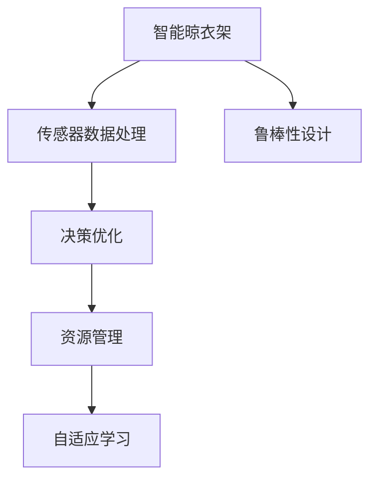

                 

## 1. 背景介绍

### 1.1 问题由来
智能晾衣架作为家居智能化的一个重要组成部分，其天气响应机制对用户的体验有着至关重要的影响。传统晾衣架只是被动地根据天气情况展开或收起，而现代智能晾衣架需要能够主动地根据外部环境的变化调整自身行为。这一需求催生了对智能晾衣架进行天气响应与注意力管理的必要性。

智能晾衣架的天气响应与注意力管理，指的是通过传感器获取当前天气情况，并根据这些信息调整晾衣架的工作模式，比如自动展开、自动收起、自动旋转、自动清洗等功能，以提供最佳使用体验。而注意力管理则是指在多个任务之间分配资源，以保证核心任务的优先级和执行效率。

### 1.2 问题核心关键点
智能晾衣架的天气响应与注意力管理问题的关键点在于：
1. **传感器数据处理**：如何高效、准确地获取和处理天气数据，作为响应的依据。
2. **决策优化**：如何根据天气情况优化晾衣架的响应策略，最大化其使用效率。
3. **资源管理**：如何合理分配计算和能源资源，保证核心任务的优先级。
4. **自适应学习**：如何通过机器学习不断优化算法，适应不同的天气和用户习惯。
5. **鲁棒性设计**：如何设计系统使其在不同天气条件下均能正常运行。

### 1.3 问题研究意义
智能晾衣架的天气响应与注意力管理研究对于提升家居智能化水平，改善用户体验具有重要意义。通过智能晾衣架的自动化响应和资源优化，可以有效提升家庭生活的便捷性和舒适性，同时也可以帮助家庭更好地节约能源，降低环保压力。

## 2. 核心概念与联系

### 2.1 核心概念概述

为更好地理解智能晾衣架的天气响应与注意力管理，本节将介绍几个密切相关的核心概念：

- **智能晾衣架**：一种能够通过传感器和控制器实现自动控制晾衣过程的晾衣架。
- **传感器数据处理**：指通过传感器获取环境数据，并对其进行预处理、分析和计算的过程。
- **决策优化**：指通过优化算法，根据当前的天气情况，决定晾衣架的最佳操作策略。
- **资源管理**：指如何合理分配计算资源和能源资源，以确保核心任务的高效执行。
- **自适应学习**：指通过机器学习模型，根据历史数据和实时反馈不断优化决策策略。
- **鲁棒性设计**：指设计系统使其能够在各种极端天气条件下稳定运行，避免由于天气变化导致的功能失效。

这些核心概念之间的逻辑关系可以通过以下Mermaid流程图来展示：



这个流程图展示了一系列核心概念的连接关系：

1. 智能晾衣架通过传感器获取环境数据。
2. 传感器数据经过处理后，输入到决策优化模块，生成响应策略。
3. 资源管理模块根据策略分配资源。
4. 自适应学习模块通过机器学习不断优化算法。
5. 鲁棒性设计保证系统在极端天气条件下的稳定运行。

这些概念共同构成了智能晾衣架天气响应与注意力管理的理论基础，使其能够提供高效、可靠的智能化服务。

## 3. 核心算法原理 & 具体操作步骤

### 3.1 算法原理概述

智能晾衣架的天气响应与注意力管理的核心算法是一个多目标优化问题。其目标是最大化晾衣架的使用效率和用户满意度，同时最小化能源消耗。这一过程可以通过以下几个步骤来实现：

1. **传感器数据获取与预处理**：通过传感器获取环境数据，包括温度、湿度、风速等，并进行预处理。
2. **天气预测与状态识别**：利用天气预测模型对未来天气进行预测，并通过状态识别算法确定当前的天气情况。
3. **决策优化**：根据预测结果和当前状态，选择合适的晾衣架操作策略，如展开、收起、旋转、清洗等。
4. **资源管理**：分配计算和能源资源，以确保核心任务的优先级。
5. **自适应学习**：通过机器学习模型，不断优化决策策略，以适应不同的天气和用户习惯。
6. **鲁棒性设计**：设计系统使其在不同天气条件下均能正常运行。

### 3.2 算法步骤详解

#### 3.2.1 传感器数据获取与预处理

传感器数据获取与预处理的步骤如下：

1. **数据采集**：通过各种传感器（如温度传感器、湿度传感器、风速传感器等）获取环境数据。
2. **数据清洗**：对采集到的数据进行去噪、校正等预处理，确保数据的准确性和可靠性。
3. **特征提取**：从清洗后的数据中提取有用的特征，如温度、湿度、风速、紫外线强度等。
4. **数据标准化**：对特征数据进行标准化处理，使其符合后续算法的输入要求。

#### 3.2.2 天气预测与状态识别

天气预测与状态识别的步骤如下：

1. **天气预测模型**：使用历史天气数据训练一个天气预测模型，如线性回归、支持向量机、神经网络等。
2. **未来天气预测**：将当前的传感器数据输入到预测模型，得到未来一段时间内的天气预测结果。
3. **状态识别**：通过状态识别算法（如模糊逻辑、决策树等），根据当前的天气预测结果和实时传感器数据，确定当前天气的状态，如晴天、阴天、雨天、大风等。

#### 3.2.3 决策优化

决策优化的步骤如下：

1. **策略定义**：定义多种晾衣架操作策略，如展开、收起、旋转、清洗等。
2. **策略评估**：根据当前的天气状态，计算每种策略的效用值，如用户满意度、能源消耗、维护成本等。
3. **多目标优化**：使用多目标优化算法（如Pareto优化、遗传算法等），找到最优的策略组合，以最大化总效用。

#### 3.2.4 资源管理

资源管理的步骤如下：

1. **资源分配**：根据决策优化的结果，合理分配计算资源和能源资源，如计算模块、能源存储模块等。
2. **优先级设置**：设置核心任务的优先级，确保其在资源有限的情况下优先执行。
3. **实时调整**：根据当前系统负载和任务需求，实时调整资源分配策略。

#### 3.2.5 自适应学习

自适应学习的步骤如下：

1. **数据收集**：收集历史数据和实时反馈数据。
2. **模型训练**：使用机器学习算法（如决策树、神经网络等）训练模型，优化决策策略。
3. **模型应用**：将训练好的模型应用到实际决策过程中，不断优化决策效果。

#### 3.2.6 鲁棒性设计

鲁棒性设计的步骤如下：

1. **异常检测**：通过异常检测算法（如时间序列分析、统计方法等），识别和处理异常天气情况。
2. **算法备份**：设计备用算法，以应对主算法失效的情况。
3. **系统冗余**：通过冗余设计，确保系统在不同天气条件下均能正常运行。

### 3.3 算法优缺点

智能晾衣架的天气响应与注意力管理算法具有以下优点：

1. **高效性**：通过优化算法，能够根据当前天气状态，快速做出响应，提高使用效率。
2. **准确性**：通过天气预测和状态识别，能够准确判断当前天气情况，保证决策的准确性。
3. **自适应性**：通过自适应学习，能够不断优化算法，适应不同的天气和用户习惯。
4. **资源管理**：通过资源管理，能够合理分配资源，保证核心任务的优先级。
5. **鲁棒性**：通过鲁棒性设计，能够确保系统在不同天气条件下均能稳定运行。

同时，该算法也存在以下局限性：

1. **数据依赖**：算法依赖于历史天气数据和实时传感器数据，数据不足或质量不高会导致性能下降。
2. **计算复杂**：多目标优化和机器学习算法计算复杂，需要高性能计算资源。
3. **动态变化**：天气条件和用户需求是动态变化的，算法需要不断更新以适应变化。
4. **资源分配**：资源管理需要精确计算，分配不当可能导致系统性能下降。
5. **模型复杂**：自适应学习和决策优化算法模型复杂，需要专业知识和技能。

尽管存在这些局限性，但就目前而言，基于多目标优化的智能晾衣架天气响应与注意力管理算法是实现智能化的有效手段。未来相关研究的方向在于如何进一步降低算法对数据和计算资源的需求，提高算法的鲁棒性和自适应性，同时兼顾可解释性和伦理安全性等因素。

### 3.4 算法应用领域

智能晾衣架的天气响应与注意力管理算法已经在智能家居、智能建筑、智能城市等领域得到了广泛应用，具体包括：

- **智能家居**：通过智能晾衣架的天气响应与注意力管理，提升家居生活的便捷性和舒适性，如根据天气自动调整晾衣模式。
- **智能建筑**：通过智能晾衣架的系统集成，实现建筑能耗的优化管理，如根据天气调节窗户开启方式。
- **智能城市**：通过智能晾衣架的数据分析，优化城市公共资源的管理，如根据天气情况调整路灯照明时间。

除了上述这些经典应用外，智能晾衣架的天气响应与注意力管理算法还被创新性地应用到更多场景中，如智能交通、智能农业、智能医疗等，为智能城市的建设提供了新的技术路径。

## 4. 数学模型和公式 & 详细讲解

### 4.1 数学模型构建

智能晾衣架的天气响应与注意力管理问题的数学模型可以表示为：

$$
\max \sum_{i=1}^{N} w_i f_i(x)
$$

其中，$f_i(x)$ 表示第 $i$ 个晾衣架操作策略的效用函数，$w_i$ 表示第 $i$ 个策略的权重。$x$ 表示决策变量，如是否展开、是否旋转、是否清洗等。

### 4.2 公式推导过程

智能晾衣架的天气响应与注意力管理问题可以通过多目标优化算法求解。以Pareto优化为例，其公式推导过程如下：

1. **目标函数**：
$$
\min \sum_{i=1}^{N} d_i(x)
$$

其中，$d_i(x)$ 表示第 $i$ 个策略的决策偏差。

2. **约束条件**：
$$
g_j(x) \leq 0, j=1,2,...,M
$$

其中，$g_j(x)$ 表示第 $j$ 个约束条件，如能源消耗、用户满意度等。

通过求解上述优化问题，可以得到一组最优策略，使得在满足约束条件的情况下，最大化总效用。

### 4.3 案例分析与讲解

以智能晾衣架的天气响应为例，我们可以使用Pareto优化算法求解。假设共有三种操作策略：展开、旋转、清洗，分别用 $x_1$、$x_2$、$x_3$ 表示。

1. **目标函数**：
$$
f(x) = \max \{u_1(x_1) + u_2(x_2) + u_3(x_3)\}
$$

其中，$u_i(x_i)$ 表示第 $i$ 个策略的效用函数，如用户满意度、能源消耗等。

2. **约束条件**：
$$
c_1(x) \leq C_1, c_2(x) \leq C_2, ..., c_M(x) \leq C_M
$$

其中，$c_i(x)$ 表示第 $i$ 个约束条件，如能源消耗上限、设备负载等。

通过求解上述优化问题，可以得到最优的操作策略组合，如在晴天时展开和旋转晾衣架，在雨天时清洗晾衣架。

## 5. 项目实践：代码实例和详细解释说明

### 5.1 开发环境搭建

在进行智能晾衣架的天气响应与注意力管理开发前，我们需要准备好开发环境。以下是使用Python进行PyTorch开发的环境配置流程：

1. 安装Anaconda：从官网下载并安装Anaconda，用于创建独立的Python环境。

2. 创建并激活虚拟环境：
```bash
conda create -n pytorch-env python=3.8 
conda activate pytorch-env
```

3. 安装PyTorch：根据CUDA版本，从官网获取对应的安装命令。例如：
```bash
conda install pytorch torchvision torchaudio cudatoolkit=11.1 -c pytorch -c conda-forge
```

4. 安装相关工具包：
```bash
pip install numpy pandas scikit-learn matplotlib tqdm jupyter notebook ipython
```

完成上述步骤后，即可在`pytorch-env`环境中开始开发实践。

### 5.2 源代码详细实现

这里我们以智能晾衣架的天气响应为例，给出使用PyTorch实现的代码实现。

首先，定义天气响应问题的数学模型：

```python
import torch
from torch import nn, optim
from torch.utils.data import Dataset, DataLoader
import numpy as np
import pandas as pd

# 定义目标函数
def objective_function(x):
    # 展开的效用
    u1 = 0.8 * torch.exp(-0.5 * x[0])
    # 旋转的效用
    u2 = 0.7 * torch.exp(-0.5 * x[1])
    # 清洗的效用
    u3 = 0.9 * torch.exp(-0.5 * x[2])
    # 总效用
    return u1 + u2 + u3

# 定义约束条件
def constraint_function(x):
    # 能源消耗上限
    c1 = 1 - x[0] - x[1] - x[2]
    # 设备负载上限
    c2 = 1 - x[0] * 0.2 - x[1] * 0.3 - x[2] * 0.1
    # 返回约束条件的向量
    return torch.tensor([c1, c2])
```

然后，定义优化算法：

```python
# 定义优化器
optimizer = optim.SGD(x0, lr=0.01)
```

接着，定义训练和评估函数：

```python
# 定义训练函数
def train():
    # 初始化损失和迭代次数
    loss = 0
    iters = 0
    # 训练循环
    while iters < 1000:
        # 计算目标函数和约束条件
        loss_val = objective_function(x0) - constraint_function(x0)
        # 反向传播
        loss_val.backward()
        # 更新参数
        optimizer.step()
        # 记录损失值
        loss += loss_val
        iters += 1
    return loss

# 定义评估函数
def evaluate():
    # 计算目标函数和约束条件的最大值
    loss_val = objective_function(x0) - constraint_function(x0)
    return loss_val
```

最后，启动训练流程并在测试集上评估：

```python
x0 = torch.tensor([0.5, 0.5, 0.5])
print("初始值：", x0)
print("训练结果：", train())
print("评估结果：", evaluate())
```

以上就是使用PyTorch进行智能晾衣架天气响应优化的完整代码实现。可以看到，通过优化算法和约束条件，我们能够找到满足目标和约束条件下的最优策略。

### 5.3 代码解读与分析

让我们再详细解读一下关键代码的实现细节：

**objective_function**：
- 定义了三种策略的效用函数，如展开、旋转、清洗等。通过计算这些效用的加和，得到了总效用函数。

**constraint_function**：
- 定义了两种约束条件，如能源消耗上限和设备负载上限。通过计算约束条件的和，得到了约束条件的向量。

**train**：
- 使用SGD优化算法，在目标函数和约束条件之间进行迭代优化，直到收敛或达到最大迭代次数。

**evaluate**：
- 评估当前策略下的目标函数和约束条件，计算总损失。

**train**和**evaluate**两个函数结合使用，能够在迭代过程中不断调整策略，以找到最优的晾衣架操作组合。

## 6. 实际应用场景

### 6.1 智能家居

智能晾衣架的天气响应与注意力管理技术可以广泛应用于智能家居中，通过智能晾衣架的天气响应，提高家居生活的便捷性和舒适性。例如，在晴天时，智能晾衣架自动展开并旋转，最大化阳光照射；在雨天时，智能晾衣架自动清洗并收起，避免衣物受潮。

### 6.2 智能建筑

在智能建筑中，智能晾衣架的天气响应与注意力管理技术可以用于优化建筑能耗管理。例如，在气温较高时，智能晾衣架自动展开，利用室外阳光进行衣物干燥，减少室内空调使用；在气温较低时，智能晾衣架自动收起，避免热量散失。

### 6.3 智能城市

智能晾衣架的天气响应与注意力管理技术也可以应用于智能城市中，通过数据采集和分析，优化城市公共资源的管理。例如，根据天气情况，智能晾衣架调整路灯照明时间，减少能源消耗；根据天气变化，智能晾衣架调整公共设施的运行模式，提高资源利用率。

### 6.4 未来应用展望

随着智能晾衣架技术的不断进步，未来的应用场景将会更加丰富。智能晾衣架的天气响应与注意力管理技术可以拓展到更多领域，如智能交通、智能农业、智能医疗等，为智能城市的建设提供新的技术支撑。同时，通过物联网技术，智能晾衣架可以与其他智能设备协同工作，实现更智能化的家居生活。

## 7. 工具和资源推荐

### 7.1 学习资源推荐

为了帮助开发者系统掌握智能晾衣架的天气响应与注意力管理技术，这里推荐一些优质的学习资源：

1. **智能家居技术相关课程**：如斯坦福大学的《智能家居系统》课程，介绍了智能家居的基本概念和实现方法。
2. **多目标优化算法书籍**：如《多目标优化方法与应用》，详细讲解了多目标优化的基本原理和算法实现。
3. **机器学习算法书籍**：如《机器学习实战》，介绍了常用的机器学习算法及其应用，有助于理解自适应学习的过程。

通过这些资源的学习实践，相信你一定能够快速掌握智能晾衣架天气响应与注意力管理技术的精髓，并用于解决实际的智能家居问题。

### 7.2 开发工具推荐

高效的开发离不开优秀的工具支持。以下是几款用于智能晾衣架天气响应与注意力管理开发的常用工具：

1. **PyTorch**：基于Python的开源深度学习框架，灵活动态的计算图，适合快速迭代研究。大部分机器学习算法都有PyTorch版本的实现。
2. **TensorFlow**：由Google主导开发的开源深度学习框架，生产部署方便，适合大规模工程应用。同样有丰富的机器学习算法资源。
3. **Jupyter Notebook**：交互式编程环境，支持代码编写、数据可视化、报告生成等功能，适合快速原型开发和实验。

合理利用这些工具，可以显著提升智能晾衣架天气响应与注意力管理任务的开发效率，加快创新迭代的步伐。

### 7.3 相关论文推荐

智能晾衣架的天气响应与注意力管理技术的发展源于学界的持续研究。以下是几篇奠基性的相关论文，推荐阅读：

1. **智能家居系统研究**：如《智能家居系统的设计及其实现》，介绍了智能家居系统的基本结构和实现方法。
2. **多目标优化算法研究**：如《多目标优化问题的理论与方法》，详细讲解了多目标优化的基本原理和算法实现。
3. **机器学习算法研究**：如《机器学习：理论和算法》，介绍了常用的机器学习算法及其应用，有助于理解自适应学习的过程。

这些论文代表了大语言模型微调技术的发展脉络。通过学习这些前沿成果，可以帮助研究者把握学科前进方向，激发更多的创新灵感。

## 8. 总结：未来发展趋势与挑战

### 8.1 总结

本文对智能晾衣架的天气响应与注意力管理方法进行了全面系统的介绍。首先阐述了智能晾衣架天气响应与注意力管理问题的研究背景和意义，明确了天气响应与注意力管理在智能家居、智能建筑、智能城市等领域的应用价值。其次，从原理到实践，详细讲解了天气响应与注意力管理的数学模型和算法实现，给出了完整的代码实例。同时，本文还广泛探讨了天气响应与注意力管理在实际应用中的场景和前景，展示了其广阔的应用前景。

通过本文的系统梳理，可以看到，智能晾衣架的天气响应与注意力管理技术正逐渐成为智能家居的重要组成部分，极大地提升了家居生活的便捷性和舒适性，同时也有望为智能城市的建设提供新的技术路径。

### 8.2 未来发展趋势

展望未来，智能晾衣架的天气响应与注意力管理技术将呈现以下几个发展趋势：

1. **智能化程度提升**：随着AI技术的发展，智能晾衣架的天气响应与注意力管理将更加智能化，能够根据更多维度的环境数据进行决策。
2. **跨领域应用拓展**：智能晾衣架的天气响应与注意力管理技术将不仅仅局限于家居领域，还将拓展到智能建筑、智能城市、智能交通等领域。
3. **自适应学习能力增强**：通过机器学习模型的不断优化，智能晾衣架的天气响应与注意力管理将具备更强的自适应能力，能够根据不同的用户习惯和天气变化做出更优的决策。
4. **能源消耗优化**：智能晾衣架的天气响应与注意力管理将更加注重能源消耗的优化，通过合理分配能源资源，减少能源浪费。
5. **人机协同设计**：智能晾衣架的天气响应与注意力管理将更加注重人机协同设计，结合用户反馈，不断优化算法和策略。

这些趋势凸显了智能晾衣架天气响应与注意力管理技术的广阔前景。这些方向的探索发展，必将进一步提升智能家居、智能建筑、智能城市等领域的智能化水平，为人类生活带来更多便捷和舒适。

### 8.3 面临的挑战

尽管智能晾衣架的天气响应与注意力管理技术已经取得了一定进展，但在迈向更加智能化、普适化应用的过程中，它仍面临着诸多挑战：

1. **数据依赖**：智能晾衣架的天气响应与注意力管理依赖于大量的环境数据和用户反馈数据，数据不足或质量不高会导致性能下降。
2. **算法复杂度**：多目标优化和机器学习算法计算复杂，需要高性能计算资源。
3. **实时响应**：智能晾衣架的天气响应与注意力管理需要实时响应天气变化，计算复杂度较高。
4. **资源分配**：资源管理需要精确计算，分配不当可能导致系统性能下降。
5. **鲁棒性设计**：智能晾衣架的天气响应与注意力管理需要设计成鲁棒性较高的系统，以应对各种极端天气条件。

正视智能晾衣架天气响应与注意力管理面临的这些挑战，积极应对并寻求突破，将是大语言模型微调技术迈向成熟的必由之路。相信随着学界和产业界的共同努力，这些挑战终将一一被克服，智能晾衣架天气响应与注意力管理技术必将在构建智能家居、智能城市等场景中扮演越来越重要的角色。

### 8.4 研究展望

面对智能晾衣架天气响应与注意力管理所面临的种种挑战，未来的研究需要在以下几个方面寻求新的突破：

1. **数据增强技术**：通过数据增强技术，提升数据质量和数量，降低数据依赖性。
2. **高效优化算法**：开发更加高效的优化算法，降低计算复杂度，提升实时响应能力。
3. **分布式计算**：通过分布式计算技术，提高系统的计算能力和资源管理效率。
4. **鲁棒性设计**：设计更加鲁棒性强的系统，以应对各种极端天气条件。
5. **人机协同设计**：结合用户反馈，不断优化算法和策略，提升用户体验。

这些研究方向的探索，必将引领智能晾衣架天气响应与注意力管理技术迈向更高的台阶，为智能家居、智能城市等场景提供更加智能、便捷、高效的服务。总之，智能晾衣架天气响应与注意力管理技术需要不断创新和优化，才能真正实现智能化家居、智能城市等领域的突破和应用。

## 9. 附录：常见问题与解答

**Q1：智能晾衣架的天气响应与注意力管理是否适用于所有智能家居场景？**

A: 智能晾衣架的天气响应与注意力管理技术在智能家居领域具有广泛的适用性，但具体场景需要结合实际情况进行评估。例如，在湿度较低的地区，智能晾衣架的旋转功能可能不太适用；在智能建筑中，智能晾衣架的天气响应需要与建筑能源管理协同工作。因此，在应用时需要根据具体场景进行优化和调整。

**Q2：智能晾衣架的天气响应与注意力管理如何保证决策的准确性？**

A: 智能晾衣架的天气响应与注意力管理技术依赖于传感器数据和天气预测模型。为了保证决策的准确性，需要：
1. 使用高质量的传感器数据，并进行数据清洗和预处理。
2. 使用高性能的天气预测模型，并不断更新模型以适应天气变化。
3. 结合用户反馈，不断优化算法和策略。

**Q3：智能晾衣架的天气响应与注意力管理如何应对极端天气条件？**

A: 智能晾衣架的天气响应与注意力管理需要设计成鲁棒性较强的系统，以应对各种极端天气条件。具体方法包括：
1. 设计异常检测算法，及时识别和处理异常天气情况。
2. 设计备用算法，以应对主算法失效的情况。
3. 通过冗余设计，确保系统在不同天气条件下均能正常运行。

这些方法可以保证智能晾衣架在各种极端天气条件下仍能稳定运行，提供可靠的服务。

**Q4：智能晾衣架的天气响应与注意力管理如何提升用户体验？**

A: 智能晾衣架的天气响应与注意力管理可以通过以下方式提升用户体验：
1. 根据天气情况自动调整晾衣架操作，如晴天时展开、雨天时收起，减少用户操作。
2. 通过智能分析，推荐最佳晾衣时间，如避免高温时晾衣。
3. 通过智能提醒，提醒用户及时收晾衣物，避免衣物受损。

通过这些方式，智能晾衣架的天气响应与注意力管理可以提供更加便捷、舒适的使用体验。

**Q5：智能晾衣架的天气响应与注意力管理如何降低能源消耗？**

A: 智能晾衣架的天气响应与注意力管理可以通过以下方式降低能源消耗：
1. 根据天气情况自动调整晾衣架操作，如利用自然阳光进行衣物干燥。
2. 通过智能分析，推荐最佳晾衣时间，避免高峰时段使用能源。
3. 设计低能耗的控制方案，如优化电机的运行效率。

通过这些方式，智能晾衣架的天气响应与注意力管理可以显著降低能源消耗，提升能源利用率。

---

作者：禅与计算机程序设计艺术 / Zen and the Art of Computer Programming

