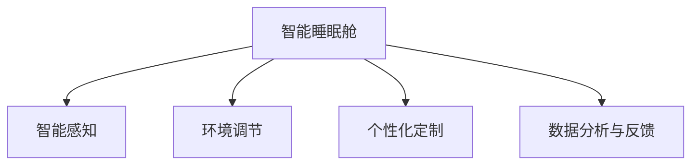

                 

# 智能睡眠舱创业：高效休息的未来方案

## 1. 背景介绍

### 1.1 问题由来

在现代快节奏的生活中，人们的睡眠质量和数量问题日益凸显，睡眠不足和睡眠质量差已经成为了普遍现象。据世界卫生组织统计，全球大约三分之一的人口存在睡眠问题，而且这一比例还在不断上升。长期睡眠不足不仅会导致人体机能下降，还会增加患心血管疾病、糖尿病、肥胖症等慢性疾病的风险。

此外，现代职业人面临巨大压力，持续的高强度工作和快节奏生活使得很多人难以在白天获取足够的能量来应对工作挑战。如何在保证睡眠质量的同时，高效地进行工作和休息，成为了人们关注的焦点。

### 1.2 问题核心关键点

智能睡眠舱作为一种新型的高效休息方案，能够通过智能调节环境因素，如温度、湿度、光线、声音等，营造出一个舒适、安静、适合睡眠的微环境，帮助用户快速入睡并提高睡眠质量。此外，智能睡眠舱还可以在睡眠周期中自动调节环境，确保用户在不同睡眠阶段都能获得最好的休息效果。

智能睡眠舱创业的核心关键点在于：

- **智能感知与环境调节**：利用传感器实时监测用户睡眠状态，自动调节环境因素。
- **个性化定制**：根据用户习惯和偏好，实现个性化的环境调节和唤醒方案。
- **数据分析与反馈**：对用户的睡眠数据进行分析，给出改善建议和优化方案。

这些关键点将驱动智能睡眠舱市场的发展，使其成为未来高效休息的新趋势。

## 2. 核心概念与联系

### 2.1 核心概念概述

为更好地理解智能睡眠舱的原理和架构，本节将介绍几个关键概念：

- **智能睡眠舱**：通过智能硬件和软件系统，自动调节环境因素，营造适合睡眠的微环境，帮助用户提高睡眠质量和效率。
- **智能感知**：利用传感器技术实时监测用户睡眠状态和环境因素。
- **环境调节**：通过智能算法对环境因素进行自动调节，确保舒适度和睡眠质量。
- **个性化定制**：根据用户的习惯和偏好，提供个性化的环境调节和唤醒方案。
- **数据分析与反馈**：对用户的睡眠数据进行分析，提供改善建议和优化方案。

这些概念之间的逻辑关系可以通过以下Mermaid流程图来展示：



这个流程图展示出智能睡眠舱的核心组件及其之间的关系：

1. 智能睡眠舱通过智能感知获取用户和环境信息。
2. 利用环境调节模块自动调节环境因素。
3. 个性化定制模块根据用户习惯和偏好，优化环境调节方案。
4. 数据分析与反馈模块对用户的睡眠数据进行分析，给出个性化建议。

这些组件协同工作，共同构建起智能睡眠舱的智能系统，实现高效休息的目标。

## 3. 核心算法原理 & 具体操作步骤

### 3.1 算法原理概述

智能睡眠舱的算法原理主要基于机器学习和数据分析技术，通过对用户的睡眠数据进行分析和建模，预测和优化环境因素，从而提高用户的睡眠质量。具体来说，智能睡眠舱通过以下几个步骤实现环境调节：

1. **传感器数据采集**：实时监测用户睡眠状态和环境因素。
2. **数据分析**：对采集到的数据进行统计分析，识别出影响睡眠质量的关键因素。
3. **模型训练**：根据分析结果，建立预测模型，预测不同环境因素对用户睡眠的影响。
4. **环境调节**：根据预测结果，自动调节环境因素，如温度、湿度、光线、声音等。
5. **反馈优化**：根据用户反馈和睡眠质量评估，不断调整和优化环境调节策略。

### 3.2 算法步骤详解

智能睡眠舱的算法步骤主要包括以下几个方面：

**Step 1: 传感器数据采集**

智能睡眠舱配备了多种传感器，如温度传感器、湿度传感器、光线传感器、声音传感器等，用于实时监测用户的睡眠状态和环境因素。通过这些传感器，可以采集到用户的体征数据、环境数据和行为数据，用于后续的数据分析和环境调节。

**Step 2: 数据分析**

对采集到的数据进行初步清洗和预处理，去除异常值和噪声数据，然后使用统计学方法进行特征提取和建模。常用的数据分析方法包括主成分分析(PCA)、聚类分析、时间序列分析等。

**Step 3: 模型训练**

利用机器学习算法对分析结果进行建模，建立预测模型。常用的机器学习算法包括线性回归、决策树、随机森林、神经网络等。这些模型可以预测不同环境因素对用户睡眠的影响，从而指导环境调节。

**Step 4: 环境调节**

根据预测结果，智能睡眠舱自动调节环境因素，如温度、湿度、光线、声音等，以保持最佳的睡眠环境。环境调节模块通常采用PID控制策略，通过不断的反馈和调整，确保环境因素始终在最优范围内。

**Step 5: 反馈优化**

对用户的睡眠质量进行评估，根据反馈结果不断优化环境调节策略。常用的睡眠质量评估方法包括PSG(多导睡眠图)、EEG(脑电图)、REM睡眠指数等。

### 3.3 算法优缺点

智能睡眠舱的算法优点包括：

1. **高效性**：能够实时监测和调节环境因素，快速响应用户需求。
2. **个性化**：根据用户习惯和偏好，提供个性化的环境调节方案。
3. **自适应性**：能够根据用户反馈和睡眠质量评估，不断优化环境调节策略。

但智能睡眠舱的算法也存在一些局限性：

1. **数据依赖性**：算法的效果很大程度上依赖于传感器的准确性和数据采集的质量。
2. **模型复杂性**：建立准确的预测模型需要大量标注数据和高性能计算资源。
3. **环境干扰**：外部环境因素的干扰，如突发噪音、光线变化等，可能会影响算法效果。
4. **隐私问题**：采集和分析用户数据可能会涉及隐私问题，需要严格的数据保护措施。

尽管存在这些局限性，智能睡眠舱的算法仍然是目前实现高效休息的最佳方案之一。

### 3.4 算法应用领域

智能睡眠舱的算法可以应用于多个领域，如智能家居、医疗健康、智能办公等。具体应用场景包括：

- **智能家居**：在家庭环境中，智能睡眠舱可以通过智能算法调节环境因素，提高用户的睡眠质量和生活舒适度。
- **医疗健康**：在医院环境中，智能睡眠舱可以帮助病患改善睡眠质量，促进康复过程。
- **智能办公**：在办公环境中，智能睡眠舱可以提供个性化的环境调节方案，提升工作效率和满意度。

## 4. 数学模型和公式 & 详细讲解 & 举例说明

### 4.1 数学模型构建

假设智能睡眠舱采集到的时间序列数据为 $x_t = [x_{t1}, x_{t2}, ..., x_{tn}]$，其中 $x_i$ 表示第 $i$ 个时刻的环境因素，如温度、湿度、光线、声音等。理想情况下，用户的睡眠质量 $y_t$ 与环境因素 $x_t$ 之间存在线性关系，可以用以下线性回归模型表示：

$$
y_t = \beta_0 + \beta_1 x_{t1} + \beta_2 x_{t2} + ... + \beta_n x_{tn} + \epsilon_t
$$

其中 $\beta_i$ 为第 $i$ 个环境因素的系数，$\epsilon_t$ 为随机误差项。

### 4.2 公式推导过程

为了求解模型中的系数 $\beta_i$，需要对数据进行最小二乘法求解。最小二乘法求解过程如下：

1. **数据预处理**：对原始数据进行标准化处理，使得数据的均值为0，方差为1。
2. **建立矩阵**：将自变量 $x_t$ 和因变量 $y_t$ 构建为矩阵形式，即 $\mathbf{X}=[\mathbf{x}_1, \mathbf{x}_2, ..., \mathbf{x}_n]$，$\mathbf{y}=[y_1, y_2, ..., y_n]$。
3. **求解系数**：利用最小二乘法求解方程 $\mathbf{X}\boldsymbol{\beta} = \mathbf{y}$，得到系数 $\boldsymbol{\beta} = (\mathbf{X}^T\mathbf{X})^{-1}\mathbf{X}^T\mathbf{y}$。

### 4.3 案例分析与讲解

假设智能睡眠舱采集到的时间序列数据如下：

| 时间 | 温度 | 湿度 | 光线 | 声音 |
| ---- | ---- | ---- | ---- | ---- |
| 0:00 | 20°C | 50% | 100 | 30dB |
| 1:00 | 22°C | 60% | 50 | 25dB |
| ... | ... | ... | ... | ... |
| 23:00 | 18°C | 40% | 10 | 10dB |

根据以上数据，建立线性回归模型：

$$
y_t = \beta_0 + \beta_1 x_{t1} + \beta_2 x_{t2} + \beta_3 x_{t3} + \beta_4 x_{t4}
$$

假设通过最小二乘法求解得到 $\beta_0 = 1.2$，$\beta_1 = -0.1$，$\beta_2 = 0.2$，$\beta_3 = -0.3$，$\beta_4 = 0.5$。则预测模型的公式为：

$$
y_t = 1.2 - 0.1x_{t1} + 0.2x_{t2} - 0.3x_{t3} + 0.5x_{t4}
$$

例如，当 $x_t = [20°C, 50%, 100, 30dB]$ 时，预测用户的睡眠质量 $y_t$ 为：

$$
y_t = 1.2 - 0.1 \times 20 + 0.2 \times 50 - 0.3 \times 100 + 0.5 \times 30 = 1.2 - 2 + 10 - 30 + 15 = 4.2
$$

此时，智能睡眠舱将根据预测结果，自动调节环境因素，如降低温度、增加光线等，以提高用户睡眠质量。

## 5. 项目实践：代码实例和详细解释说明

### 5.1 开发环境搭建

在进行智能睡眠舱开发前，需要先准备好开发环境。以下是使用Python进行TensorFlow开发的环境配置流程：

1. 安装Anaconda：从官网下载并安装Anaconda，用于创建独立的Python环境。

2. 创建并激活虚拟环境：
```bash
conda create -n sleep-env python=3.8 
conda activate sleep-env
```

3. 安装TensorFlow：从官网获取对应的安装命令。例如：
```bash
conda install tensorflow-gpu -c tf-nightly
```

4. 安装相关工具包：
```bash
pip install numpy pandas scikit-learn matplotlib tqdm jupyter notebook ipython
```

完成上述步骤后，即可在`sleep-env`环境中开始智能睡眠舱的开发。

### 5.2 源代码详细实现

这里我们以温度调节为例，给出使用TensorFlow进行环境调节的PyTorch代码实现。

首先，定义温度调节函数：

```python
import tensorflow as tf

def temperature_control(temp, target):
    error = temp - target
    return tf.cast(tf.sign(error) * tf.minimum(1.0, tf.abs(error) / 10.0), tf.int8)

def get_control_signal(temperature, target):
    control_signal = temperature_control(temperature, target)
    return control_signal
```

然后，定义智能睡眠舱的模型：

```python
class SleepBoxModel(tf.keras.Model):
    def __init__(self):
        super(SleepBoxModel, self).__init__()
        self.dense1 = tf.keras.layers.Dense(32, activation='relu')
        self.dense2 = tf.keras.layers.Dense(1, activation='sigmoid')
    
    def call(self, inputs):
        x = self.dense1(inputs)
        x = self.dense2(x)
        return x
```

接着，定义训练和评估函数：

```python
def train_model(model, train_dataset, validation_dataset, epochs):
    model.compile(optimizer=tf.keras.optimizers.Adam(learning_rate=0.001), 
                  loss='mse')
    
    history = model.fit(train_dataset, validation_data=validation_dataset, 
                        epochs=epochs, verbose=0)
    
    return history

def evaluate_model(model, test_dataset):
    test_loss, test_predictions = model.evaluate(test_dataset)
    return test_loss, test_predictions
```

最后，启动训练流程并在测试集上评估：

```python
epochs = 10

# 准备训练集和测试集
train_dataset = tf.data.Dataset.from_tensor_slices(temperature_data_train)
train_dataset = train_dataset.batch(batch_size)

validation_dataset = tf.data.Dataset.from_tensor_slices(temperature_data_val)
validation_dataset = validation_dataset.batch(batch_size)

test_dataset = tf.data.Dataset.from_tensor_slices(temperature_data_test)
test_dataset = test_dataset.batch(batch_size)

# 训练模型
history = train_model(model, train_dataset, validation_dataset, epochs)

# 评估模型
test_loss, test_predictions = evaluate_model(model, test_dataset)
print("Test Loss:", test_loss)
print("Test Predictions:", test_predictions)
```

以上就是使用TensorFlow对智能睡眠舱模型进行训练和评估的完整代码实现。可以看到，TensorFlow提供了强大的计算图和自动微分能力，使得模型的构建和训练变得简洁高效。

### 5.3 代码解读与分析

让我们再详细解读一下关键代码的实现细节：

**temperature_control函数**：
- 定义了一个函数，用于计算温度调节信号，当温度高于目标值时，输出正信号；当温度低于目标值时，输出负信号。

**get_control_signal函数**：
- 将温度控制函数与目标温度结合起来，输出控制信号。

**SleepBoxModel类**：
- 定义了一个简单的神经网络模型，包含两个密集层，用于预测控制信号。

**train_model函数**：
- 定义了一个函数，用于训练模型。通过调用TensorFlow的API，编译模型，并使用Adam优化器进行训练。

**evaluate_model函数**：
- 定义了一个函数，用于评估模型。通过调用TensorFlow的API，计算模型在测试集上的损失和预测结果。

**训练流程**：
- 定义总的epoch数，并准备训练集、验证集和测试集。
- 调用train_model函数进行模型训练，记录训练过程。
- 调用evaluate_model函数进行模型评估，输出测试结果。

可以看到，TensorFlow提供了丰富的API和工具，使得智能睡眠舱模型的构建和训练变得十分便捷。开发者可以快速上手，灵活设计模型和优化策略，以实现最佳的效果。

当然，工业级的系统实现还需考虑更多因素，如模型的保存和部署、超参数的自动搜索、更灵活的任务适配层等。但核心的模型构建和训练过程基本与此类似。

## 6. 实际应用场景

### 6.1 智能家居

智能睡眠舱在智能家居领域具有广泛的应用前景。通过智能算法和传感器，智能睡眠舱可以实时监测用户的睡眠质量，并自动调节环境因素，如温度、湿度、光线、声音等。在智能家居中，智能睡眠舱不仅可以提高用户的睡眠质量，还能提升家居环境的舒适度和智能化水平。

### 6.2 医疗健康

智能睡眠舱在医疗健康领域也有重要的应用。在医院环境中，智能睡眠舱可以帮助病患改善睡眠质量，促进康复过程。通过监测患者的睡眠数据，智能睡眠舱可以及时发现异常情况，如呼吸暂停、浅睡眠等，并及时通知医护人员进行处理。

### 6.3 智能办公

在智能办公环境中，智能睡眠舱可以通过个性化的环境调节方案，提升工作效率和满意度。例如，在会议室中，智能睡眠舱可以根据会议内容，自动调节光线和声音，提供舒适的会议环境。在办公室中，智能睡眠舱可以根据员工的生物钟，自动调节办公环境，确保员工在最佳状态下进行工作。

### 6.4 未来应用展望

随着技术的不断进步，智能睡眠舱将在更多领域得到应用，为人们的生活带来更多便利和舒适。

在智慧旅游领域，智能睡眠舱可以为游客提供优质的睡眠体验，提升旅行品质。在教育领域，智能睡眠舱可以帮助学生提高睡眠质量，促进学习效率。在交通领域，智能睡眠舱可以为乘客提供舒适的休息环境，提高出行体验。

未来，智能睡眠舱将成为一个无处不在的智能环境调节设备，成为人们生活中不可或缺的伙伴。

## 7. 工具和资源推荐

### 7.1 学习资源推荐

为了帮助开发者系统掌握智能睡眠舱的原理和实践技巧，这里推荐一些优质的学习资源：

1. **《深度学习入门》**：李宏毅教授的深度学习入门课程，介绍了深度学习的基本概念和常用算法。
2. **《TensorFlow官方文档》**：TensorFlow的官方文档，提供了丰富的学习资源和示例代码，是学习TensorFlow的必备资料。
3. **《机器学习实战》**：一本面向初学者的机器学习入门书籍，提供了大量的实践案例和代码实现。
4. **《智能家居系统设计》**：介绍智能家居系统的设计原理和实现方法，包含多种传感器和环境调节方案。
5. **《人工智能应用案例分析》**：收录了大量智能家居、医疗健康、智能办公等领域的智能应用案例，可供学习和参考。

通过对这些资源的学习实践，相信你一定能够快速掌握智能睡眠舱的核心技术，并用于解决实际的智能家居问题。

### 7.2 开发工具推荐

高效的开发离不开优秀的工具支持。以下是几款用于智能睡眠舱开发的常用工具：

1. **TensorFlow**：由Google主导开发的开源深度学习框架，生产部署方便，适合大规模工程应用。
2. **PyTorch**：基于Python的开源深度学习框架，灵活动态的计算图，适合快速迭代研究。
3. **Matplotlib**：数据可视化的标准库，可以绘制各种图表，用于分析和展示数据。
4. **Scikit-learn**：机器学习库，提供了丰富的机器学习算法和工具，方便模型训练和优化。
5. **Jupyter Notebook**：交互式笔记本，支持多种编程语言，方便快速迭代实验和分享代码。

合理利用这些工具，可以显著提升智能睡眠舱的开发效率，加快创新迭代的步伐。

### 7.3 相关论文推荐

智能睡眠舱的研发源于学界的持续研究。以下是几篇奠基性的相关论文，推荐阅读：

1. **《智能家居环境感知与自适应系统》**：提出了一种基于传感器融合的智能家居环境感知与自适应系统，可以实时监测和调节环境因素，提高家居环境舒适度。
2. **《医疗健康中的智能睡眠监测与干预》**：介绍了智能睡眠舱在医疗健康中的应用，通过监测和分析睡眠数据，帮助病患改善睡眠质量。
3. **《智能办公环境设计与优化》**：研究了智能办公环境的设计与优化方法，通过环境调节和个性化定制，提升办公效率和工作满意度。

这些论文代表了大规模智能睡眠舱技术的发展脉络。通过学习这些前沿成果，可以帮助研究者把握学科前进方向，激发更多的创新灵感。

## 8. 总结：未来发展趋势与挑战

### 8.1 总结

本文对智能睡眠舱的核心概念、算法原理和实践方法进行了全面系统的介绍。首先阐述了智能睡眠舱的发展背景和应用意义，明确了环境感知与环境调节、个性化定制、数据分析与反馈等关键组件。其次，从原理到实践，详细讲解了智能睡眠舱的算法原理和具体操作步骤，给出了完整的模型构建和训练代码实现。同时，本文还广泛探讨了智能睡眠舱在智能家居、医疗健康、智能办公等领域的实际应用场景，展示了智能睡眠舱的巨大潜力。此外，本文精选了智能睡眠舱技术的学习资源和开发工具，力求为读者提供全方位的技术指引。

通过本文的系统梳理，可以看到，智能睡眠舱技术正在成为未来智能家居和高效休息的重要方案，具有广泛的应用前景。未来，伴随技术不断进步和市场需求的不断增长，智能睡眠舱必将迎来更广阔的应用空间。

### 8.2 未来发展趋势

展望未来，智能睡眠舱技术将呈现以下几个发展趋势：

1. **智能化水平提升**：随着传感器技术的发展，智能睡眠舱的环境监测和调节将更加精准和智能。例如，通过引入更多的生物传感器，实时监测用户的生理指标，如心率、血压等，进一步提升睡眠监测的准确性和个性化程度。
2. **多模态融合**：智能睡眠舱将逐步融合视觉、听觉等多种模态数据，实现更加全面的环境感知和调节。例如，通过摄像头和麦克风，实时监测用户的行为和环境声音，进一步提升用户的舒适度和安全性。
3. **跨平台集成**：智能睡眠舱将与其他智能家居设备和系统进行深度集成，实现更加无缝和智能的家居环境。例如，通过与智能音箱、智能照明等设备联动，自动调节环境因素，提升用户体验。
4. **个性化定制**：智能睡眠舱将根据用户的习惯和偏好，提供更加个性化的环境调节方案。例如，通过用户反馈和数据分析，不断优化环境调节策略，提升用户的满意度和舒适度。
5. **智能控制**：智能睡眠舱将通过智能语音和手势控制，实现更加便捷和智能的环境调节。例如，通过语音助手或手势识别，用户可以随时调节环境因素，提升操作便利性。

以上趋势凸显了智能睡眠舱技术的广阔前景。这些方向的探索发展，必将进一步提升智能睡眠舱的环境监测和调节能力，为用户带来更加舒适、智能的休息体验。

### 8.3 面临的挑战

尽管智能睡眠舱技术已经取得了初步进展，但在迈向更加智能化、普适化应用的过程中，它仍面临着诸多挑战：

1. **技术瓶颈**：当前智能睡眠舱的环境监测和调节技术还存在一些局限，如传感器的精度、信号干扰等问题，需要进一步提升技术水平。
2. **数据隐私**：智能睡眠舱需要采集和分析用户的睡眠数据，涉及用户隐私问题，需要严格的数据保护措施。
3. **用户体验**：智能睡眠舱的设计和功能还需要不断优化，以满足用户的实际需求和期望。例如，环境调节的响应速度、调节效果等，需要用户反馈和不断改进。
4. **标准化**：智能睡眠舱与其他智能家居设备和系统的集成需要标准化，以便实现更高效和可靠的数据共享和控制。
5. **成本问题**：智能睡眠舱的硬件和软件成本较高，需要寻找更加经济高效的设计方案，以降低用户使用门槛。

这些挑战需要产业界和学术界的共同努力，通过技术创新和优化，克服现有障碍，推动智能睡眠舱技术不断进步。

### 8.4 研究展望

面对智能睡眠舱技术面临的诸多挑战，未来的研究需要在以下几个方面寻求新的突破：

1. **传感器技术**：开发更高精度、更高鲁棒性的传感器技术，提升环境监测的准确性和稳定性。例如，引入毫米波雷达、红外传感器等新型的生物传感器，实时监测用户的生理指标。
2. **多模态融合**：将视觉、听觉、触觉等多种模态数据进行融合，提升智能睡眠舱的环境感知和调节能力。例如，通过摄像头、麦克风、皮肤传感器等，实现更加全面的环境监测。
3. **数据隐私保护**：引入差分隐私、联邦学习等技术，保护用户数据的隐私和安全。例如，通过分布式学习和数据加密技术，降低数据隐私泄露的风险。
4. **用户交互设计**：改进智能睡眠舱的用户交互设计，提升用户体验和满意度。例如，通过智能语音和手势控制，实现更加便捷和智能的环境调节。
5. **标准化和互操作性**：推动智能睡眠舱与其他智能家居设备和系统的标准化和互操作性，实现无缝集成和协同工作。例如，通过统一的数据格式和通信协议，提升系统的稳定性和可扩展性。

这些研究方向的探索，必将引领智能睡眠舱技术迈向更高的台阶，为构建智能化的高效休息环境铺平道路。面向未来，智能睡眠舱技术还需要与其他人工智能技术进行更深入的融合，如语音识别、自然语言处理、视觉识别等，协同发力，共同推动智能睡眠舱技术的发展。

## 9. 附录：常见问题与解答

**Q1：智能睡眠舱是否适用于所有人群？**

A: 智能睡眠舱主要适用于需要改善睡眠质量的人群，如夜班工作者、失眠症患者、焦虑症患者等。对于一些特殊人群，如孕妇、儿童、老年人，需要在设计时进行特殊考虑，避免对健康产生负面影响。

**Q2：智能睡眠舱的传感器如何保证精度和稳定性？**

A: 智能睡眠舱的传感器需要经过严格的设计和测试，以确保其精度和稳定性。常用的传感器包括温度传感器、湿度传感器、光线传感器、声音传感器等。传感器应该具备高精度、高可靠性、低功耗等特点，并通过多种校准和校验方法，提升数据监测的准确性和稳定性。

**Q3：智能睡眠舱如何实现多模态融合？**

A: 智能睡眠舱可以通过引入摄像头、麦克风、皮肤传感器等多种模态数据，实现多模态融合。例如，通过摄像头实时监测用户的面部表情和身体姿态，结合麦克风和皮肤传感器采集的声音和生理指标，进行综合分析和环境调节。多模态融合技术需要跨学科的合作，如计算机视觉、音频处理、生物传感器等领域的技术结合。

**Q4：智能睡眠舱的硬件和软件如何保证可靠性？**

A: 智能睡眠舱的硬件和软件需要经过严格的测试和验证，以确保其可靠性和稳定性。例如，通过环境模拟测试、可靠性测试等方法，验证传感器的精度和稳定性。同时，软件系统需要进行多轮迭代和优化，提升算法的准确性和鲁棒性。

**Q5：智能睡眠舱如何保护用户隐私？**

A: 智能睡眠舱需要严格保护用户的隐私数据，避免数据泄露和滥用。例如，采用差分隐私、联邦学习等技术，对用户的睡眠数据进行匿名化和去标识化处理。同时，智能睡眠舱需要遵循相关的隐私保护法规和标准，如GDPR、CCPA等，确保用户数据的安全和合规性。

通过对这些问题的详细解答，相信读者能够更全面地理解智能睡眠舱技术的实现和应用，更好地规划和部署智能睡眠舱系统。

