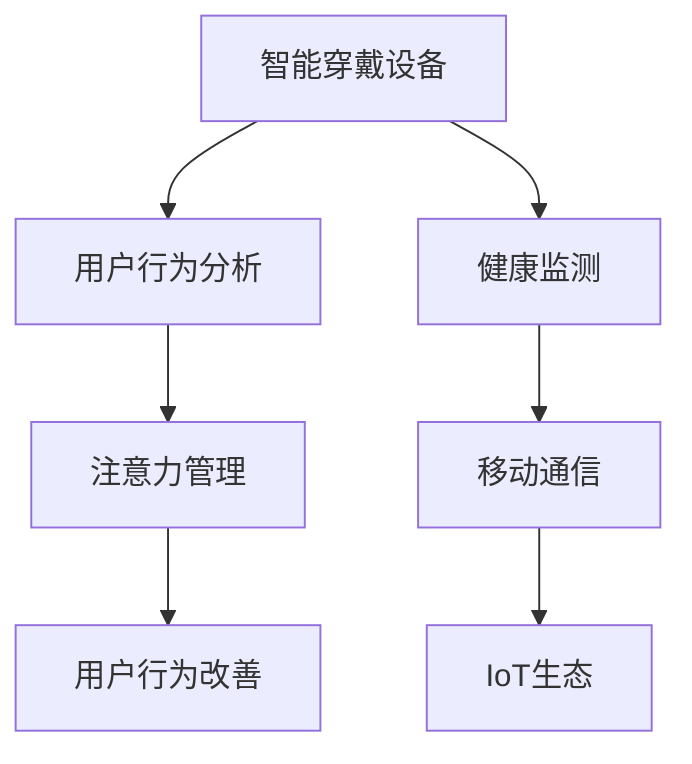

                 

# 智能穿戴设备与注意力管理

> 关键词：智能穿戴设备,注意力管理,用户行为分析,健康监测,移动通信,物联网(IoT)

## 1. 背景介绍

### 1.1 问题由来
智能穿戴设备因其便携性、实时性、数据采集能力等特点，逐渐成为健康监测、运动追踪、个性化健身等领域的重要工具。通过穿戴设备采集的数据，用户可以实时了解自身状态和活动情况，从而进行科学锻炼、健康管理。然而，智能穿戴设备并非万能，其功能的发挥受到设备设计、用户行为、数据处理等多个因素的影响。

特别是在注意力管理领域，智能穿戴设备如何通过数据采集、分析和干预，有效提升用户的注意力集中度和生产力，成为当前的研究热点。本文将从智能穿戴设备的视角，探讨注意力管理的实现原理和应用场景。

## 2. 核心概念与联系

### 2.1 核心概念概述

为了更好地理解智能穿戴设备与注意力管理的关联，本节将介绍几个关键概念：

- **智能穿戴设备**：利用传感器、通信模块、计算硬件等技术，能够实时采集用户生理、行为数据，并通过智能算法进行分析和应用的可穿戴设备，如智能手表、健身追踪器、智能眼镜等。
- **注意力管理**：指通过各种技术手段，如心理学、神经科学、计算机视觉等，识别用户注意力状态，并采取干预措施，提升注意力集中度和生产力的过程。
- **用户行为分析**：通过对用户的行为数据进行建模和分析，预测其行为趋势，以便进行个性化推荐和辅助决策。
- **健康监测**：利用智能穿戴设备采集用户的心率、血氧、睡眠质量等生理数据，辅助健康管理。
- **移动通信**：智能穿戴设备通过通信模块接入移动网络，实现数据传输、远程控制等功能。
- **物联网(IoT)**：基于网络技术，将智能穿戴设备等终端设备互联互通，构建智能生态系统。

这些概念之间的关系可以通过以下Mermaid流程图来展示：



这个流程图展示了几者之间的关系：

1. 智能穿戴设备采集用户生理和行为数据。
2. 用户行为分析利用采集的数据，预测用户行为趋势，优化用户体验。
3. 注意力管理通过分析注意力状态，采取干预措施，提升注意力集中度。
4. 健康监测利用生理数据，辅助健康管理和疾病预防。
5. 移动通信实现设备间的互联互通，提升智能穿戴设备的灵活性和应用范围。
6. IoT生态通过智能穿戴设备构建智能生态，实现跨领域应用。

这些概念共同构成了智能穿戴设备的功能体系，其交叉融合将极大提升设备对用户的综合服务能力。

## 3. 核心算法原理 & 具体操作步骤

### 3.1 算法原理概述

智能穿戴设备与注意力管理的核心在于数据采集、分析与干预的闭环过程。具体而言，通过智能穿戴设备采集用户的行为和生理数据，利用机器学习和数据挖掘技术，分析用户注意力状态，并采取相应的干预措施。

形式化地，假设智能穿戴设备为 $S$，采集的数据集为 $D=\{(x_i,y_i)\}_{i=1}^N$，其中 $x_i$ 为生理或行为特征向量，$y_i$ 为注意力状态标签。注意力管理的优化目标是最小化损失函数 $\mathcal{L}$，即：

$$
\mathop{\arg\min}_{\theta} \mathcal{L}(\theta|D)
$$

其中 $\theta$ 为模型的参数，用于拟合注意力状态预测模型。

通过梯度下降等优化算法，注意力管理过程不断更新模型参数 $\theta$，最小化损失函数 $\mathcal{L}$，从而构建出预测准确、干预有效的注意力管理模型。

### 3.2 算法步骤详解

基于智能穿戴设备与注意力管理的数据采集与分析过程，一般包括以下几个关键步骤：

**Step 1: 数据采集与预处理**
- 利用智能穿戴设备采集用户的心率、血氧、肌电、脑电等生理数据，以及步数、运动轨迹、坐姿、屏幕时间等行为数据。
- 对采集到的原始数据进行滤波、归一化、降维等预处理操作，提升数据质量。

**Step 2: 特征工程与模型训练**
- 根据用户生理和行为数据，设计关键特征向量 $x$，包括心率变化、运动强度、屏幕使用时间等。
- 选择合适的人工智能算法（如随机森林、神经网络等），利用标注数据集 $D$ 进行模型训练，优化参数 $\theta$。

**Step 3: 注意力状态预测**
- 利用训练好的模型对用户行为特征 $x$ 进行预测，得到注意力状态标签 $y$。
- 可采用多模态特征融合、时序建模等技术，提升预测准确性。

**Step 4: 干预措施生成**
- 根据预测得到的注意力状态，设计针对性的干预措施，如提醒、通知、呼吸调节等。
- 可结合用户偏好、活动场景等个性化信息，动态调整干预策略。

**Step 5: 效果评估与反馈优化**
- 定期评估干预措施的效果，通过用户反馈、生理指标变化等进行模型优化。
- 通过调整特征选择、模型架构、干预策略等，提升注意力管理的效果和用户体验。

### 3.3 算法优缺点

智能穿戴设备与注意力管理方法具有以下优点：
1. 实时性高。通过智能穿戴设备实时采集数据，快速响应用户注意力变化。
2. 数据丰富。智能穿戴设备可采集多种生理和行为数据，为注意力分析提供丰富信息。
3. 个性化强。根据用户的行为和生理特征，设计个性化干预措施，提升用户体验。
4. 可扩展性强。结合移动通信、物联网等技术，可以实现设备的互联互通，拓展应用场景。

但该方法也存在一些局限性：
1. 设备隐私问题。采集生理和行为数据涉及用户隐私，需要严格遵守数据保护法规。
2. 数据准确性不足。传感器误差、运动捕捉偏差等，可能导致数据采集的不准确。
3. 模型复杂度高。多模态数据融合、时序建模等技术，需要复杂的算法和大量计算资源。
4. 干预措施多样性受限。干预措施的有效性依赖于模型的准确性和用户配合度。
5. 用户接受度不一。部分用户可能对设备侵入感到不适或对数据泄露感到担忧，影响用户体验。

尽管存在这些局限性，但智能穿戴设备与注意力管理方法在提升注意力集中度和生产力的应用中展现出显著潜力，值得进一步研究和探索。

### 3.4 算法应用领域

智能穿戴设备与注意力管理技术在多个领域具有广泛应用：

1. **健康管理**：在智能穿戴设备上应用注意力管理技术，帮助用户优化运动、睡眠、饮食等生活习惯，提升整体健康状况。
2. **工作效率**：在办公环境中，通过智能穿戴设备监测用户注意力状态，提供专注力训练、休息提醒等功能，提升工作效能。
3. **教育辅助**：在教育场景中，利用注意力管理技术，监测学生的注意力变化，提供个性化学习建议和辅助。
4. **游戏娱乐**：在电子游戏中，通过智能穿戴设备监测玩家注意力，提供实时反馈和调整游戏难度，提升游戏体验。
5. **交通出行**：在智能交通系统中，监测驾驶员的注意力状态，提供疲劳预警、注意力提升等功能，保障行车安全。

此外，智能穿戴设备与注意力管理还将在智能家居、智能办公、智能健身等多个领域得到应用，推动各行业的智能化转型升级。

## 4. 数学模型和公式 & 详细讲解  
### 4.1 数学模型构建

本节将使用数学语言对智能穿戴设备与注意力管理的原理进行更加严格的刻画。

假设智能穿戴设备 $S$ 通过传感器 $S_i$ 采集用户数据 $x_i$，经过预处理和特征选择，得到特征向量 $x \in \mathbb{R}^d$。注意力状态预测模型为 $M_{\theta}$，其中 $\theta$ 为模型参数。注意力状态标签 $y \in \{0,1\}$，表示用户当前处于注意力集中或不集中状态。

定义注意力管理系统的损失函数为：

$$
\mathcal{L}(\theta|D) = -\frac{1}{N}\sum_{i=1}^N[y_i\log M_{\theta}(x_i)+(1-y_i)\log(1-M_{\theta}(x_i))]
$$

其中 $M_{\theta}(x_i)$ 为模型对输入 $x_i$ 的预测结果，$\log$ 为自然对数。

### 4.2 公式推导过程

以下我们以注意力管理任务的数学模型为例，推导损失函数的计算过程。

设 $x \in \mathbb{R}^d$ 为输入特征向量，$y \in \{0,1\}$ 为注意力状态标签。假设注意力管理模型的预测结果为 $M_{\theta}(x)$，则注意力管理的损失函数定义为：

$$
\mathcal{L}(\theta|x,y) = -[y\log M_{\theta}(x)+(1-y)\log(1-M_{\theta}(x))]
$$

将其代入经验风险公式，得：

$$
\mathcal{L}(\theta|D) = -\frac{1}{N}\sum_{i=1}^N [y_i\log M_{\theta}(x_i)+(1-y_i)\log(1-M_{\theta}(x_i))]
$$

根据链式法则，损失函数对模型参数 $\theta$ 的梯度为：

$$
\frac{\partial \mathcal{L}(\theta|x,y)}{\partial \theta} = -y\frac{\partial M_{\theta}(x)}{\partial \theta} - (1-y)\frac{\partial M_{\theta}(x)}{\partial \theta}
$$

在得到损失函数的梯度后，即可带入梯度下降等优化算法，更新模型参数 $\theta$，最小化损失函数 $\mathcal{L}(\theta|D)$。重复上述过程直至收敛，最终得到针对当前用户注意力状态的最佳模型参数 $\theta^*$。

## 5. 项目实践：代码实例和详细解释说明

### 5.1 开发环境搭建

在进行智能穿戴设备与注意力管理的实践前，我们需要准备好开发环境。以下是使用Python进行TensorFlow开发的环境配置流程：

1. 安装Anaconda：从官网下载并安装Anaconda，用于创建独立的Python环境。

2. 创建并激活虚拟环境：
```bash
conda create -n tf-env python=3.8 
conda activate tf-env
```

3. 安装TensorFlow：根据CUDA版本，从官网获取对应的安装命令。例如：
```bash
conda install tensorflow -c conda-forge
```

4. 安装相关库：
```bash
pip install sklearn pandas matplotlib
```

完成上述步骤后，即可在`tf-env`环境中开始实践。

### 5.2 源代码详细实现

下面以智能穿戴设备采集的数据进行注意力状态预测为例，给出使用TensorFlow进行注意力管理的代码实现。

首先，定义注意力状态预测模型：

```python
import tensorflow as tf
from tensorflow.keras import layers

model = tf.keras.Sequential([
    layers.Dense(128, activation='relu', input_shape=(d_features,)),
    layers.Dense(1, activation='sigmoid')
])
```

然后，定义训练和评估函数：

```python
from sklearn.model_selection import train_test_split
from sklearn.metrics import confusion_matrix, accuracy_score

def train_model(model, X_train, y_train, X_test, y_test):
    model.compile(optimizer='adam', loss='binary_crossentropy', metrics=['accuracy'])
    model.fit(X_train, y_train, epochs=50, batch_size=32, validation_data=(X_test, y_test))
    y_pred = model.predict(X_test)
    return y_pred, confusion_matrix(y_test, y_pred), accuracy_score(y_test, y_pred)

X_train, X_test, y_train, y_test = train_test_split(X, y, test_size=0.2, random_state=42)

y_pred, cm, acc = train_model(model, X_train, y_train, X_test, y_test)
print('Confusion matrix:\n', cm)
print('Accuracy: ', acc)
```

最后，运行模型并进行评估：

```python
# 假设X为特征向量，y为注意力状态标签
# 假设d_features为特征向量的维度

# 加载数据
# ...

# 划分训练集和测试集
# ...

# 定义模型
# ...

# 训练模型
# ...

# 评估模型
# ...
```

以上代码实现了一个基于TensorFlow的注意力状态预测模型。可以看到，借助TensorFlow的强大工具箱，我们可以快速搭建和训练注意力管理模型，分析用户注意力状态，提供个性化干预措施。

### 5.3 代码解读与分析

让我们再详细解读一下关键代码的实现细节：

**数据准备**：
- 假设X为特征向量，y为注意力状态标签。
- 使用train_test_split将数据划分为训练集和测试集。

**模型定义**：
- 使用Sequential模型构建神经网络。
- 添加一个全连接层和一个Sigmoid激活函数，用于二分类任务。
- 模型编译时，选择Adam优化器、二元交叉熵损失函数和准确率指标。

**模型训练**：
- 使用fit方法训练模型，设置训练轮数为50，批次大小为32。
- 在验证集上进行评估，输出混淆矩阵和准确率。

**模型评估**：
- 在测试集上预测注意力状态，并计算混淆矩阵和准确率。
- 输出混淆矩阵和准确率，分析模型性能。

通过以上代码实现，智能穿戴设备与注意力管理模型的训练和评估流程得到了详细展示。开发者可以基于此框架，进一步优化模型结构和训练过程，实现更好的注意力管理效果。

## 6. 实际应用场景

### 6.1 智能办公应用

在智能办公环境中，智能穿戴设备与注意力管理技术可以显著提升工作效率。例如，智能手表可以监测员工的心率、运动量和注意力状态，自动提醒员工进行短暂的休息和活动，避免长时间连续工作带来的疲劳和健康问题。

此外，通过智能穿戴设备，可以监测员工在不同时间段的工作效率，生成工作报告，帮助企业优化工作安排和提升员工满意度。智能穿戴设备还可以与办公系统集成，实现实时任务管理、进度跟踪等功能，进一步提升办公自动化水平。

### 6.2 个性化学习应用

在教育领域，智能穿戴设备与注意力管理技术可以帮助学生保持专注，提升学习效率。例如，智能眼镜可以监测学生的注意力状态，自动提醒学生集中注意力，并提供针对性的学习建议和资源。

智能穿戴设备还可以采集学生的生理数据，如心跳、体温等，通过生理指标监测学生的学习状态，及时调整学习计划。学生可以通过智能穿戴设备记录学习轨迹，生成个性化学习报告，帮助自我反思和调整。

### 6.3 健康管理应用

在健康管理领域，智能穿戴设备与注意力管理技术可以监测用户的注意力状态，提供健康管理建议。例如，智能手表可以监测用户的工作和休息时间，提供健康提醒和建议，帮助用户建立良好的作息习惯。

智能穿戴设备还可以采集用户的生理数据，如心率、血氧等，通过生理指标监测用户的健康状态，及时发现异常并采取措施。用户可以通过智能穿戴设备记录日常活动和健康数据，生成健康报告，帮助制定科学的生活方式。

### 6.4 未来应用展望

随着智能穿戴设备与注意力管理技术的不断发展，未来将在更多领域得到应用：

1. **智能家居**：在智能家居中，智能穿戴设备可以监测用户的注意力状态，提供个性化的家居控制建议，提升生活品质。
2. **智能交通**：在智能交通中，智能穿戴设备可以监测驾驶员的注意力状态，提供疲劳预警和注意力提升功能，保障行车安全。
3. **智能娱乐**：在电子游戏中，智能穿戴设备可以监测玩家注意力，提供实时反馈和调整游戏难度，提升游戏体验。
4. **智能医疗**：在医疗领域，智能穿戴设备可以监测患者的注意力状态，提供个性化的健康管理建议，提升医疗服务质量。

总之，智能穿戴设备与注意力管理技术在健康、教育、办公、娱乐等多个领域具有广阔的应用前景，将极大地提升人类生产力和生活质量。

## 7. 工具和资源推荐

### 7.1 学习资源推荐

为了帮助开发者系统掌握智能穿戴设备与注意力管理技术的理论基础和实践技巧，这里推荐一些优质的学习资源：

1. **《智能穿戴设备与健康监测》**：详细介绍了智能穿戴设备的基本原理、传感器技术、数据采集和处理方法等。
2. **《注意力管理与认知增强》**：系统介绍了注意力管理的基本概念、心理机制、计算模型等，提供了丰富的案例和实践指导。
3. **TensorFlow官方文档**：详细介绍了TensorFlow的基本用法、神经网络模型构建、数据处理等，是进行深度学习开发的重要参考资料。
4. **Keras官方文档**：提供了Keras的使用教程、示例代码、API参考等，适合初学者入门。
5. **Coursera《深度学习与神经网络》课程**：由斯坦福大学教授讲授，涵盖了深度学习的基本概念和常用算法，适合深入学习。

通过对这些资源的学习实践，相信你一定能够快速掌握智能穿戴设备与注意力管理的精髓，并用于解决实际的NLP问题。

### 7.2 开发工具推荐

高效的开发离不开优秀的工具支持。以下是几款用于智能穿戴设备与注意力管理开发的常用工具：

1. **TensorFlow**：由Google主导开发的深度学习框架，支持多种硬件平台，适合复杂神经网络的构建和训练。
2. **Keras**：基于TensorFlow的高级神经网络API，使用简单，适合快速原型设计和模型部署。
3. **Python**：Python是一种高级编程语言，具有简单易学、库丰富等特点，适合开发智能穿戴设备和数据分析应用。
4. **Jupyter Notebook**：Python开发中常用的交互式笔记本环境，支持代码编写、数据可视化、结果展示等功能。
5. **GitHub**：代码托管平台，支持版本控制、协作开发等，方便团队共同维护智能穿戴设备和注意力管理项目。

合理利用这些工具，可以显著提升智能穿戴设备与注意力管理项目的开发效率，加快创新迭代的步伐。

### 7.3 相关论文推荐

智能穿戴设备与注意力管理技术的发展源于学界的持续研究。以下是几篇奠基性的相关论文，推荐阅读：

1. **《智能穿戴设备在健康监测中的应用》**：详细介绍了智能穿戴设备在健康监测中的实现方法和效果。
2. **《基于注意力管理的个性化学习系统》**：提出了基于注意力管理的个性化学习系统，显著提升了学生的学习效率和满意度。
3. **《智能穿戴设备在办公场景中的应用》**：分析了智能穿戴设备在提升办公效率、优化工作安排等方面的应用效果。
4. **《注意力管理的计算模型与算法》**：系统介绍了注意力管理的计算模型和常用算法，提供了丰富的案例和应用场景。

这些论文代表了大语言模型微调技术的发展脉络。通过学习这些前沿成果，可以帮助研究者把握学科前进方向，激发更多的创新灵感。

## 8. 总结：未来发展趋势与挑战

### 8.1 总结

本文对智能穿戴设备与注意力管理的实现原理和应用场景进行了全面系统的介绍。首先阐述了智能穿戴设备在注意力管理中的重要作用，明确了注意力管理技术在提升用户注意力集中度和生产力方面的独特价值。其次，从原理到实践，详细讲解了注意力管理的数学模型和关键步骤，给出了智能穿戴设备与注意力管理的完整代码实例。同时，本文还广泛探讨了注意力管理技术在多个行业领域的应用前景，展示了其广阔的应用空间。此外，本文精选了注意力管理的各类学习资源，力求为读者提供全方位的技术指引。

通过本文的系统梳理，可以看到，智能穿戴设备与注意力管理技术正在成为智能化应用的重要范式，极大地提升用户的注意力集中度和生产效率。其应用场景的广泛性和数据驱动的特性，使得智能穿戴设备与注意力管理成为未来智能化发展的关键方向。

### 8.2 未来发展趋势

展望未来，智能穿戴设备与注意力管理技术将呈现以下几个发展趋势：

1. **多模态数据融合**：未来智能穿戴设备将采集更多种类的数据，如生理数据、环境数据、用户行为数据等。通过多模态数据的融合，可以更全面地监测用户状态，提升注意力管理的准确性和有效性。
2. **实时性增强**：随着5G、物联网等技术的发展，智能穿戴设备的数据采集和传输速度将进一步提升。实时性更高的数据采集和处理技术，将使得注意力管理的干预措施更加及时和精准。
3. **个性化强化**：智能穿戴设备与注意力管理技术将更注重用户个性化需求，通过定制化干预策略，提升用户体验和满意度。
4. **智能化提升**：未来智能穿戴设备将搭载更多智能算法，如深度学习、强化学习等，提升注意力管理的智能化水平。
5. **跨领域应用拓展**：智能穿戴设备与注意力管理技术将在医疗、教育、办公等多个领域得到应用，推动各行业的智能化转型升级。

以上趋势凸显了智能穿戴设备与注意力管理技术的广阔前景。这些方向的探索发展，必将进一步提升注意力管理的效果和应用范围，为构建智能生态奠定坚实基础。

### 8.3 面临的挑战

尽管智能穿戴设备与注意力管理技术已经取得了瞩目成就，但在迈向更加智能化、普适化应用的过程中，它仍面临诸多挑战：

1. **隐私和安全问题**：智能穿戴设备采集的生理和行为数据涉及用户隐私，需要严格遵守数据保护法规。如何保护用户隐私，防止数据泄露和滥用，将成为一大难题。
2. **数据准确性和完整性**：传感器误差、运动捕捉偏差等可能导致数据采集的不准确和缺失，影响注意力管理的效果。如何提高数据采集的准确性和完整性，还需要更多技术和方法上的突破。
3. **模型复杂度与资源消耗**：多模态数据融合、深度学习等技术，需要复杂的算法和大量计算资源。如何降低模型复杂度，提升计算效率，还需要进一步探索。
4. **干预措施的多样性与适用性**：不同用户的个性化需求和适应性不同，单一的干预措施可能无法满足所有用户的需求。如何设计多样化的干预措施，提高其适用性和用户接受度，将是重要的研究方向。
5. **用户接受度与习惯培养**：部分用户可能对智能穿戴设备的使用感到不适或对数据收集感到担忧，影响用户体验。如何培养用户习惯，提高用户接受度，需要进一步的用户教育和引导。

正视智能穿戴设备与注意力管理面临的这些挑战，积极应对并寻求突破，将是大语言模型微调走向成熟的必由之路。相信随着学界和产业界的共同努力，这些挑战终将一一被克服，智能穿戴设备与注意力管理必将在构建智能生态中扮演越来越重要的角色。

### 8.4 研究展望

面对智能穿戴设备与注意力管理所面临的种种挑战，未来的研究需要在以下几个方面寻求新的突破：

1. **隐私保护技术**：开发更为先进的隐私保护技术，如差分隐私、联邦学习等，在保障用户隐私的同时，实现数据的有效利用。
2. **多模态数据融合方法**：探索多模态数据融合的新方法，提升数据采集的准确性和融合的效率。
3. **智能化算法优化**：开发更高效、更智能的算法，如自适应学习、端到端训练等，提升注意力管理的性能和效果。
4. **用户个性化干预策略**：通过深度学习和个性化推荐技术，设计更为多样化和适用的干预策略，提升用户的接受度和满意度。
5. **智能穿戴设备与外部系统的协同**：研究智能穿戴设备与外部系统的协同机制，如与办公系统、教育系统等集成，提升跨领域应用的智能化水平。

这些研究方向的探索，必将引领智能穿戴设备与注意力管理技术迈向更高的台阶，为构建智能生态和提升人类生活质量提供新的动力。总之，智能穿戴设备与注意力管理技术需要在隐私保护、数据融合、算法优化、个性化干预策略等多个方面进行协同创新，方能实现更广泛的智能应用。

## 9. 附录：常见问题与解答

**Q1：智能穿戴设备如何采集生理和行为数据？**

A: 智能穿戴设备通过各种传感器进行数据采集。常见的传感器包括：
1. 加速度传感器：用于监测用户的运动状态和运动轨迹。
2. 陀螺仪传感器：用于监测用户的姿态和运动方向。
3. 心率传感器：用于监测用户的心率变化。
4. 血氧传感器：用于监测用户的血氧水平。
5. 脑电传感器：用于监测用户的大脑活动状态。

这些传感器通过蓝牙、Wi-Fi等通信模块将数据传输到设备进行处理和存储。通过合理的算法和数据分析，智能穿戴设备能够实时监测用户的生理和行为状态。

**Q2：智能穿戴设备采集数据的精度如何保障？**

A: 智能穿戴设备采集数据的精度受多种因素影响，如传感器性能、环境干扰、运动状态等。为提高数据采集的准确性，可以采取以下措施：
1. 校准传感器：定期对传感器进行校准，确保其准确性。
2. 数据滤波：使用数字滤波算法对采集数据进行滤波处理，去除噪声和异常点。
3. 多传感器融合：通过多传感器融合技术，综合不同传感器的数据，提升采集数据的鲁棒性和准确性。
4. 环境感知：利用环境感知技术，如GPS、Wi-Fi等，对传感器数据进行辅助校正，提升数据采集的精度。

通过这些措施，智能穿戴设备能够更好地采集高质量的数据，为注意力管理提供可靠的输入。

**Q3：智能穿戴设备与注意力管理的干预措施有哪些？**

A: 智能穿戴设备与注意力管理的干预措施主要包括以下几种：
1. 注意力提醒：通过震动、声音、通知等方式提醒用户集中注意力。
2. 呼吸调节：通过引导用户进行深呼吸、冥想等活动，帮助用户放松和恢复注意力。
3. 运动提醒：通过监测用户运动状态，提示用户进行活动，提升注意力集中度。
4. 任务切换：监测用户注意力状态，自动切换任务，减少疲劳和分心。
5. 个性化建议：根据用户行为和生理数据，提供个性化的注意力提升建议。

这些干预措施可以根据用户的反馈和行为调整，逐步优化，提升用户的体验和效果。

**Q4：智能穿戴设备与注意力管理的实现过程中需要注意哪些问题？**

A: 智能穿戴设备与注意力管理的实现过程中需要注意以下问题：
1. 数据隐私保护：智能穿戴设备采集的生理和行为数据涉及用户隐私，需要严格遵守数据保护法规。
2. 数据采集准确性：传感器误差、运动捕捉偏差等可能导致数据采集的不准确，影响注意力管理的效果。
3. 模型复杂度与资源消耗：多模态数据融合、深度学习等技术，需要复杂的算法和大量计算资源。
4. 用户个性化需求：不同用户的个性化需求和适应性不同，单一的干预措施可能无法满足所有用户的需求。
5. 用户接受度与习惯培养：部分用户可能对智能穿戴设备的使用感到不适或对数据收集感到担忧，影响用户体验。

只有在数据采集、模型训练、干预措施等多个环节进行全面优化，才能最大限度地发挥智能穿戴设备与注意力管理的威力。开发者需要根据具体任务，不断迭代和优化模型、数据和算法，方能得到理想的效果。

---

作者：禅与计算机程序设计艺术 / Zen and the Art of Computer Programming

