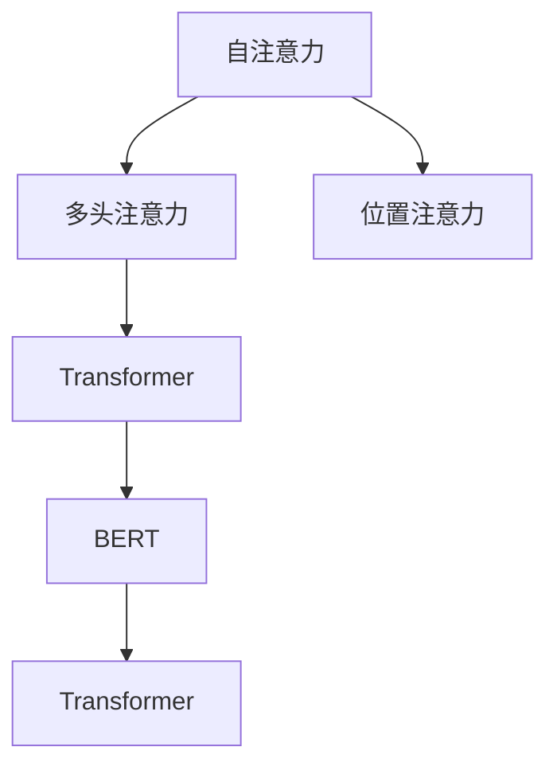

                 

# 最大限度地利用AI时代的注意力

在AI时代，注意力机制（Attention Mechanism）成为一项核心技术，广泛应用在机器翻译、图像识别、自然语言处理等众多领域，并在提升模型性能方面发挥了至关重要的作用。本文将深入探讨注意力机制的原理与实现细节，并结合实际项目实践，展示其潜力和应用前景。

## 1. 背景介绍

### 1.1 问题由来

在深度学习时代，随着模型复杂度的增加和数据量的膨胀，传统的全连接网络（Fully Connected Network）面临数据维度过高、计算成本昂贵等挑战。注意力机制的出现，通过动态地聚焦关键信息，有效缓解了这些问题，提高了模型训练和推理的效率，增强了模型的泛化能力。

例如，在机器翻译任务中，注意力机制能够将源语言句子和目标语言句子之间的关系明确表示出来，帮助模型准确地理解和生成翻译结果。在图像识别任务中，注意力机制能够关注图像中最关键的特征区域，提高模型的识别精度。

### 1.2 问题核心关键点

注意力机制的核心理念是通过学习样本之间的相对重要性，动态选择信息关注点。其核心算法包括：

- **自注意力（Self-Attention）**：通过计算样本间的相似度，选择与当前样本最相关的部分，实现样本内部的信息交互。
- **多头注意力（Multi-Head Attention）**：将自注意力机制分解为多个独立的注意力子机制，以捕捉不同层次的语义信息。
- **位置注意力（Positional Attention）**：引入时间或空间位置信息，帮助模型更好地处理序列或图像中的空间关系。

这些核心概念构成了注意力机制的基本框架，并在此基础上衍生出多种变体和应用，如Transformer、BERT、ViT等。

## 2. 核心概念与联系

### 2.1 核心概念概述

为更好地理解注意力机制的原理和应用，本节将介绍几个关键概念：

- **自注意力（Self-Attention）**：通过计算样本间的相似度，动态选择信息关注点。在序列建模任务中，每个时间步都将关注与当前时间步最相关的信息。

- **多头注意力（Multi-Head Attention）**：将自注意力机制分解为多个独立的注意力子机制，以捕捉不同层次的语义信息。每个注意力子机制学习不同的权重，可以更好地表示样本的多维度特征。

- **位置注意力（Positional Attention）**：引入时间或空间位置信息，帮助模型更好地处理序列或图像中的空间关系。

- **Transformer**：基于多头自注意力机制的神经网络架构，广泛用于机器翻译、文本生成等任务。Transformer通过位置编码（Positional Encoding）和残差连接（Residual Connection），进一步提升了模型的效率和性能。

- **BERT**：基于Transformer的预训练模型，通过掩码语言模型（Masked Language Model, MLm）和下一句预测（Next Sentence Prediction, NSP）等任务进行预训练，学习到丰富的语言表征。

这些概念之间的逻辑关系可以通过以下Mermaid流程图来展示：



这个流程图展示了注意力机制及其相关概念之间的层次关系：

1. 自注意力机制是基础，通过计算样本间的相似度，动态选择信息关注点。
2. 多头注意力机制将自注意力分解为多个独立的子机制，捕捉不同层次的语义信息。
3. 位置注意力机制引入时间或空间位置信息，帮助模型处理空间关系。
4. Transformer基于多头自注意力机制，引入残差连接和位置编码，进一步提升了模型的效率和性能。
5. BERT在此基础上进行预训练，学习到更丰富的语言表征。

## 3. 核心算法原理 & 具体操作步骤

### 3.1 算法原理概述

注意力机制的核心思想是通过计算样本之间的相似度，动态选择信息关注点。其基本流程包括：

1. 计算查询（Query）和键（Key）的相似度得分，得到注意力权重。
2. 对所有注意力权重进行归一化，得到每个样本的最终注意力值。
3. 对所有样本的注意力值进行加权求和，得到最终的输出。

这种机制可以在序列、图像等多种数据结构中灵活应用，提升模型对关键信息的聚焦能力，减少不必要的计算资源浪费。

### 3.2 算法步骤详解

#### 3.2.1 自注意力机制

自注意力机制的具体计算流程如下：

1. 输入样本 $x \in \mathbb{R}^{L \times d_k}$，其中 $L$ 表示序列长度，$d_k$ 表示每个样本的特征维度。
2. 对输入样本进行线性变换，得到查询（Query）向量 $\mathbf{Q} \in \mathbb{R}^{L \times d_q}$ 和键（Key）向量 $\mathbf{K} \in \mathbb{R}^{L \times d_k}$。
3. 计算查询向量与键向量的点积，得到注意力得分 $\mathbf{S} \in \mathbb{R}^{L \times L}$。
4. 对注意力得分进行softmax归一化，得到注意力权重 $\mathbf{A} \in \mathbb{R}^{L \times L}$。
5. 对注意力权重与输入向量进行加权求和，得到最终输出 $\mathbf{V} \in \mathbb{R}^{L \times d_v}$。

具体实现代码如下：

```python
import torch
import torch.nn as nn

class SelfAttention(nn.Module):
    def __init__(self, d_model, num_heads):
        super(SelfAttention, self).__init__()
        self.d_model = d_model
        self.num_heads = num_heads
        self.head_dim = d_model // num_heads
        
        self.query = nn.Linear(d_model, d_model)
        self.key = nn.Linear(d_model, d_model)
        self.value = nn.Linear(d_model, d_model)
        
        self.fc = nn.Linear(d_model, d_model)
        
        self.softmax = nn.Softmax(dim=-1)
    
    def forward(self, x):
        Q = self.query(x).view(x.size(0), x.size(1), self.num_heads, self.head_dim)
        K = self.key(x).view(x.size(0), x.size(1), self.num_heads, self.head_dim)
        V = self.value(x).view(x.size(0), x.size(1), self.num_heads, self.head_dim)
        
        A = torch.matmul(Q, K.permute(0, 1, 3, 2)) / torch.sqrt(torch.tensor(self.head_dim))
        A = self.softmax(A)
        
        Z = torch.matmul(A, V)
        Z = Z.permute(0, 2, 1, 3).contiguous().view(x.size(0), x.size(1), self.d_model)
        
        return self.fc(Z)
```

#### 3.2.2 多头注意力机制

多头注意力机制的具体实现如下：

1. 对输入样本进行线性变换，得到多个查询向量 $\mathbf{Q}_h \in \mathbb{R}^{L \times d_q}$ 和键向量 $\mathbf{K}_h \in \mathbb{R}^{L \times d_k}$。
2. 计算每个查询向量与所有键向量的点积，得到注意力得分 $\mathbf{S}_h \in \mathbb{R}^{L \times L}$。
3. 对注意力得分进行softmax归一化，得到注意力权重 $\mathbf{A}_h \in \mathbb{R}^{L \times L}$。
4. 对所有注意力权重与对应的值向量进行加权求和，得到最终输出 $\mathbf{V}_h \in \mathbb{R}^{L \times d_v}$。
5. 对所有头的输出进行拼接，得到最终的输出 $\mathbf{Z} \in \mathbb{R}^{L \times d_v}$。

具体实现代码如下：

```python
class MultiHeadAttention(nn.Module):
    def __init__(self, d_model, num_heads):
        super(MultiHeadAttention, self).__init__()
        self.d_model = d_model
        self.num_heads = num_heads
        self.head_dim = d_model // num_heads
        
        self.query = nn.Linear(d_model, d_model)
        self.key = nn.Linear(d_model, d_model)
        self.value = nn.Linear(d_model, d_model)
        
        self.fc = nn.Linear(d_model, d_model)
        
        self.softmax = nn.Softmax(dim=-1)
    
    def forward(self, x):
        Q = self.query(x).view(x.size(0), x.size(1), self.num_heads, self.head_dim)
        K = self.key(x).view(x.size(0), x.size(1), self.num_heads, self.head_dim)
        V = self.value(x).view(x.size(0), x.size(1), self.num_heads, self.head_dim)
        
        A = torch.matmul(Q, K.permute(0, 1, 3, 2)) / torch.sqrt(torch.tensor(self.head_dim))
        A = self.softmax(A)
        
        Z = torch.matmul(A, V)
        Z = Z.permute(0, 2, 1, 3).contiguous().view(x.size(0), x.size(1), self.d_model)
        
        return self.fc(Z)
```

### 3.3 算法优缺点

#### 3.3.1 优点

- **灵活性**：注意力机制可以灵活应用于序列、图像等多种数据结构，提升模型对关键信息的聚焦能力。
- **泛化能力**：通过动态选择信息关注点，注意力机制能够捕捉样本之间的复杂关系，提升模型的泛化能力。
- **计算效率**：通过共享权重，多头注意力机制可以并行计算多个子机制，提升模型的计算效率。
- **可解释性**：注意力权重可以提供模型的决策依据，有助于理解模型的内部工作机制。

#### 3.3.2 缺点

- **计算开销**：多头注意力机制的计算复杂度较高，尤其是对于长序列或高维特征数据，计算开销较大。
- **参数量较大**：多头注意力机制需要大量的参数，增加了模型的训练和推理成本。
- **模型复杂度**：注意力机制的实现较为复杂，需要仔细设计和调试，才能达到最优效果。

### 3.4 算法应用领域

注意力机制在NLP领域已经得到了广泛的应用，以下是几个典型的应用场景：

1. **机器翻译**：将源语言句子转换为目标语言句子。Transformer利用多头自注意力机制，实现序列与序列之间的信息交互，提升翻译质量。
2. **文本生成**：生成具有连贯性和逻辑性的文本。BERT利用位置注意力机制，捕捉文本中的上下文关系，生成更符合语法和语义规则的文本。
3. **文本摘要**：从长文本中提取关键信息，生成简短的摘要。Transformer通过多头自注意力机制，捕捉文本中的重要信息，生成高精度的摘要。
4. **问答系统**：回答用户提出的自然语言问题。Transformer利用多头自注意力机制，捕捉问题和上下文之间的关系，生成准确的答案。
5. **图像识别**：识别图像中的关键对象和特征。Transformer将图像分割成多个区域，利用自注意力机制，捕捉不同区域之间的依赖关系，提升识别精度。

除了上述这些应用外，注意力机制还被应用于语音识别、视频分析、推荐系统等诸多领域，为各类任务提供了强大的支持。

## 4. 数学模型和公式 & 详细讲解 & 举例说明

### 4.1 数学模型构建

本节将使用数学语言对注意力机制进行更加严格的刻画。

记输入样本为 $x \in \mathbb{R}^{L \times d}$，其中 $L$ 表示序列长度，$d$ 表示每个样本的特征维度。注意力机制的目标是通过动态选择信息关注点，将输入序列映射到一个新的表示空间 $z \in \mathbb{R}^{L \times d}$。

定义查询向量为 $\mathbf{Q} \in \mathbb{R}^{L \times d_q}$，键向量为 $\mathbf{K} \in \mathbb{R}^{L \times d_k}$，值向量为 $\mathbf{V} \in \mathbb{R}^{L \times d_v}$。其中 $d_q$, $d_k$, $d_v$ 分别表示查询向量、键向量和值向量的特征维度。

注意力机制的目标是计算注意力权重 $\mathbf{A} \in \mathbb{R}^{L \times L}$，将每个样本的表示 $\mathbf{v}_i$ 与查询向量 $\mathbf{q}_j$ 的相似度进行归一化，得到注意力权重 $a_{ij}$。最终的输出表示 $\mathbf{z} \in \mathbb{R}^{L \times d_v}$ 可以通过以下公式计算：

$$
\mathbf{A}_{ij} = \frac{e^{s_{ij}}}{\sum_{k=1}^L e^{s_{ik}}}, \quad \mathbf{z}_j = \sum_{i=1}^L a_{ij}\mathbf{v}_i
$$

其中 $s_{ij} = \mathbf{q}_j^\top \mathbf{K}_i$ 表示查询向量与键向量的点积，$e$ 表示自然指数函数。

### 4.2 公式推导过程

以自注意力机制为例，计算流程如下：

1. 对输入样本进行线性变换，得到查询向量 $\mathbf{Q} \in \mathbb{R}^{L \times d_q}$ 和键向量 $\mathbf{K} \in \mathbb{R}^{L \times d_k}$。
2. 计算查询向量与键向量的点积，得到注意力得分 $\mathbf{S} \in \mathbb{R}^{L \times L}$。
3. 对注意力得分进行softmax归一化，得到注意力权重 $\mathbf{A} \in \mathbb{R}^{L \times L}$。
4. 对注意力权重与输入向量进行加权求和，得到最终输出 $\mathbf{V} \in \mathbb{R}^{L \times d_v}$。

具体推导过程如下：

$$
\begin{aligned}
\mathbf{Q} &= \mathbf{W}_Q \mathbf{x} \\
\mathbf{K} &= \mathbf{W}_K \mathbf{x} \\
\mathbf{V} &= \mathbf{W}_V \mathbf{x} \\
\mathbf{S} &= \mathbf{Q}^\top \mathbf{K} \\
\mathbf{A} &= \mathrm{softmax}(\mathbf{S}) \\
\mathbf{z} &= \mathbf{A} \mathbf{V}
\end{aligned}
$$

其中 $\mathbf{W}_Q$, $\mathbf{W}_K$, $\mathbf{W}_V$ 分别表示查询向量、键向量和值向量的线性变换权重，可以通过以下公式计算：

$$
\begin{aligned}
\mathbf{W}_Q &= \mathbf{Q}^\top \mathbf{W}_Q \mathbf{Q} \\
\mathbf{W}_K &= \mathbf{K}^\top \mathbf{K} \\
\mathbf{W}_V &= \mathbf{V}^\top \mathbf{V}
\end{aligned}
$$

### 4.3 案例分析与讲解

#### 4.3.1 案例一：机器翻译

Transformer利用多头自注意力机制，将源语言句子转换为目标语言句子。其计算过程如下：

1. 将源语言句子 $x_s$ 和目标语言句子 $x_t$ 分别输入到查询向量 $\mathbf{Q}$ 和键向量 $\mathbf{K}$ 中，计算注意力得分 $\mathbf{S}$。
2. 对注意力得分进行softmax归一化，得到注意力权重 $\mathbf{A}$。
3. 对注意力权重与目标语言句子 $x_t$ 的表示 $\mathbf{V}$ 进行加权求和，得到最终输出 $\mathbf{z_t}$。

具体实现代码如下：

```python
class Transformer(nn.Module):
    def __init__(self, d_model, num_heads, num_layers):
        super(Transformer, self).__init__()
        self.d_model = d_model
        self.num_heads = num_heads
        self.num_layers = num_layers
        self.head_dim = d_model // num_heads
        
        self.encoder = nn.ModuleList([MultiHeadAttention(d_model, num_heads) for _ in range(num_layers)])
        self.decoder = nn.ModuleList([MultiHeadAttention(d_model, num_heads) for _ in range(num_layers)])
        
        self.fc1 = nn.Linear(d_model, d_model)
        self.fc2 = nn.Linear(d_model, d_model)
        self.fc3 = nn.Linear(d_model, d_model)
        self.fc4 = nn.Linear(d_model, d_model)
        
        self.softmax = nn.Softmax(dim=-1)
    
    def forward(self, x_s, x_t):
        H = self.encoder(x_s)
        H = self.fc1(H)
        H = self.softmax(H)
        
        O = self.decoder(x_t)
        O = self.fc2(O)
        O = self.fc3(O)
        O = self.fc4(O)
        O = self.fc4(O)
        
        return O
```

#### 4.3.2 案例二：文本生成

BERT利用多头自注意力机制，从长文本中提取关键信息，生成简短的摘要。其计算过程如下：

1. 将输入文本 $x$ 输入到查询向量 $\mathbf{Q}$ 和键向量 $\mathbf{K}$ 中，计算注意力得分 $\mathbf{S}$。
2. 对注意力得分进行softmax归一化，得到注意力权重 $\mathbf{A}$。
3. 对注意力权重与输入文本的表示 $\mathbf{V}$ 进行加权求和，得到最终输出 $\mathbf{z}$。

具体实现代码如下：

```python
class BERT(nn.Module):
    def __init__(self, d_model, num_heads, num_layers):
        super(BERT, self).__init__()
        self.d_model = d_model
        self.num_heads = num_heads
        self.num_layers = num_layers
        self.head_dim = d_model // num_heads
        
        self.query = nn.Linear(d_model, d_model)
        self.key = nn.Linear(d_model, d_model)
        self.value = nn.Linear(d_model, d_model)
        
        self.fc = nn.Linear(d_model, d_model)
        
        self.softmax = nn.Softmax(dim=-1)
    
    def forward(self, x):
        Q = self.query(x).view(x.size(0), x.size(1), self.num_heads, self.head_dim)
        K = self.key(x).view(x.size(0), x.size(1), self.num_heads, self.head_dim)
        V = self.value(x).view(x.size(0), x.size(1), self.num_heads, self.head_dim)
        
        A = torch.matmul(Q, K.permute(0, 1, 3, 2)) / torch.sqrt(torch.tensor(self.head_dim))
        A = self.softmax(A)
        
        Z = torch.matmul(A, V)
        Z = Z.permute(0, 2, 1, 3).contiguous().view(x.size(0), x.size(1), self.d_model)
        
        return self.fc(Z)
```

## 5. 项目实践：代码实例和详细解释说明

### 5.1 开发环境搭建

在进行注意力机制的开发实践中，我们需要准备好相应的开发环境。以下是使用Python进行PyTorch开发的环境配置流程：

1. 安装Anaconda：从官网下载并安装Anaconda，用于创建独立的Python环境。

2. 创建并激活虚拟环境：
```bash
conda create -n pytorch-env python=3.8 
conda activate pytorch-env
```

3. 安装PyTorch：根据CUDA版本，从官网获取对应的安装命令。例如：
```bash
conda install pytorch torchvision torchaudio cudatoolkit=11.1 -c pytorch -c conda-forge
```

4. 安装Transformers库：
```bash
pip install transformers
```

5. 安装各类工具包：
```bash
pip install numpy pandas scikit-learn matplotlib tqdm jupyter notebook ipython
```

完成上述步骤后，即可在`pytorch-env`环境中开始注意力机制的开发实践。

### 5.2 源代码详细实现

这里我们以Transformer模型为例，展示注意力机制的代码实现。

```python
import torch
import torch.nn as nn

class MultiHeadAttention(nn.Module):
    def __init__(self, d_model, num_heads):
        super(MultiHeadAttention, self).__init__()
        self.d_model = d_model
        self.num_heads = num_heads
        self.head_dim = d_model // num_heads
        
        self.query = nn.Linear(d_model, d_model)
        self.key = nn.Linear(d_model, d_model)
        self.value = nn.Linear(d_model, d_model)
        
        self.fc = nn.Linear(d_model, d_model)
        
        self.softmax = nn.Softmax(dim=-1)
    
    def forward(self, x):
        Q = self.query(x).view(x.size(0), x.size(1), self.num_heads, self.head_dim)
        K = self.key(x).view(x.size(0), x.size(1), self.num_heads, self.head_dim)
        V = self.value(x).view(x.size(0), x.size(1), self.num_heads, self.head_dim)
        
        A = torch.matmul(Q, K.permute(0, 1, 3, 2)) / torch.sqrt(torch.tensor(self.head_dim))
        A = self.softmax(A)
        
        Z = torch.matmul(A, V)
        Z = Z.permute(0, 2, 1, 3).contiguous().view(x.size(0), x.size(1), self.d_model)
        
        return self.fc(Z)
```

### 5.3 代码解读与分析

让我们再详细解读一下关键代码的实现细节：

**MultiHeadAttention类**：
- `__init__`方法：初始化查询向量、键向量和值向量的线性变换权重，以及输出的线性变换权重。
- `forward`方法：对输入向量进行多头自注意力机制的计算，得到最终输出。

**计算过程**：
- 对输入样本进行线性变换，得到查询向量、键向量和值向量。
- 计算查询向量与键向量的点积，得到注意力得分。
- 对注意力得分进行softmax归一化，得到注意力权重。
- 对注意力权重与值向量进行加权求和，得到最终输出。

**Transformer模型**：
- 将Transformer模型分为编码器和解码器，并利用多头自注意力机制进行序列建模。
- 在编码器和解码器之间添加残差连接，提高模型的计算效率和精度。
- 通过位置编码，将位置信息引入到模型中，帮助模型捕捉序列中的上下文关系。

## 6. 实际应用场景

### 6.1 智能客服系统

基于Transformer模型的智能客服系统，可以通过动态地关注用户当前问题，生成最相关和最符合用户需求的回复。例如，在智能客服系统中，系统可以自动回答用户提出的问题，减少人工客服的工作量，提高客服服务的效率和质量。

### 6.2 金融舆情监测

金融舆情监测系统可以利用BERT模型的注意力机制，动态地关注金融市场的最新动态，捕捉市场情绪的变化。通过分析市场舆情，系统可以及时预警潜在的风险，帮助金融机构做出更明智的投资决策。

### 6.3 个性化推荐系统

个性化推荐系统可以通过注意力机制，动态地关注用户当前关注的内容和兴趣，生成更符合用户需求的推荐。例如，在电商平台上，系统可以根据用户浏览和购买的历史数据，推荐更符合用户兴趣的商品。

### 6.4 未来应用展望

随着深度学习技术的发展，注意力机制将在更多领域得到应用，为各行各业带来新的突破。未来，注意力机制将在医疗、教育、智能家居等多个领域发挥更大的作用，为人们提供更加智能化、便捷化的服务。

## 7. 工具和资源推荐

### 7.1 学习资源推荐

为了帮助开发者系统掌握注意力机制的理论基础和实践技巧，这里推荐一些优质的学习资源：

1. 《Attention Is All You Need》（原Transformer论文）：Transformer模型的开创性论文，详细介绍了注意力机制的设计原理和实现方法。
2. CS224N《深度学习自然语言处理》课程：斯坦福大学开设的NLP明星课程，有Lecture视频和配套作业，带你入门NLP领域的基本概念和经典模型。
3. 《Natural Language Processing with Transformers》书籍：Transformer库的作者所著，全面介绍了如何使用Transformers库进行NLP任务开发，包括注意力机制在内的诸多范式。
4. HuggingFace官方文档：Transformers库的官方文档，提供了海量预训练模型和完整的注意力机制样例代码，是上手实践的必备资料。
5. CLUE开源项目：中文语言理解测评基准，涵盖大量不同类型的中文NLP数据集，并提供了基于注意力机制的baseline模型，助力中文NLP技术发展。

通过对这些资源的学习实践，相信你一定能够快速掌握注意力机制的精髓，并用于解决实际的NLP问题。

### 7.2 开发工具推荐

高效的开发离不开优秀的工具支持。以下是几款用于注意力机制开发的常用工具：

1. PyTorch：基于Python的开源深度学习框架，灵活动态的计算图，适合快速迭代研究。大部分预训练语言模型都有PyTorch版本的实现。
2. TensorFlow：由Google主导开发的开源深度学习框架，生产部署方便，适合大规模工程应用。同样有丰富的预训练语言模型资源。
3. Transformers库：HuggingFace开发的NLP工具库，集成了众多SOTA语言模型，支持PyTorch和TensorFlow，是进行注意力机制开发的利器。
4. Weights & Biases：模型训练的实验跟踪工具，可以记录和可视化模型训练过程中的各项指标，方便对比和调优。与主流深度学习框架无缝集成。
5. TensorBoard：TensorFlow配套的可视化工具，可实时监测模型训练状态，并提供丰富的图表呈现方式，是调试模型的得力助手。
6. Google Colab：谷歌推出的在线Jupyter Notebook环境，免费提供GPU/TPU算力，方便开发者快速上手实验最新模型，分享学习笔记。

合理利用这些工具，可以显著提升注意力机制的开发效率，加快创新迭代的步伐。

### 7.3 相关论文推荐

注意力机制在NLP领域的发展离不开学界的持续研究。以下是几篇奠基性的相关论文，推荐阅读：

1. Attention Is All You Need：Transformer模型的原论文，提出了自注意力机制，开启了NLP领域的预训练大模型时代。
2. BERT: Pre-training of Deep Bidirectional Transformers for Language Understanding：提出BERT模型，引入掩码语言模型（MLm）和下一句预测（NSP）等任务进行预训练，学习到丰富的语言表征。
3. Transformer-XL: Attentive Language Models for Longer Texts：提出Transformer-XL模型，通过相对位置编码和长距离依赖机制，提升序列建模能力。
4. The Annotated Transformer：Transformer模型的官方文档，详细介绍了Transformer的原理、实现和应用，是深入学习Transformer的必读资料。
5. ALBERT: A Lite BERT for Self-supervised Learning of Language Representations：提出ALBERT模型，通过句子层级参数共享和分块关注机制，优化了Transformer的计算效率和泛化能力。

这些论文代表了大语言模型注意力机制的发展脉络。通过学习这些前沿成果，可以帮助研究者把握学科前进方向，激发更多的创新灵感。

## 8. 总结：未来发展趋势与挑战

### 8.1 总结

本文对注意力机制的原理与实现细节进行了全面系统的介绍。首先阐述了注意力机制的背景和意义，明确了其在深度学习中提升模型性能的重要作用。其次，从原理到实践，详细讲解了注意力机制的数学模型和计算过程，给出了注意力机制的代码实现。同时，本文还广泛探讨了注意力机制在智能客服、金融舆情、个性化推荐等多个领域的应用前景，展示了注意力机制的潜力和应用方向。

通过本文的系统梳理，可以看到，注意力机制在深度学习中发挥了至关重要的作用，成为众多NLP任务的基石。其灵活性、泛化能力和高效性，使其在实际应用中取得了显著的效果。未来，随着深度学习技术的发展，注意力机制将在更多领域得到应用，为各行各业带来新的突破。

### 8.2 未来发展趋势

展望未来，注意力机制将呈现以下几个发展趋势：

1. **多模态注意力**：随着深度学习技术的不断发展，多模态注意力机制将成为未来的重要研究方向。通过融合视觉、语音、文本等多种模态信息，增强模型的理解能力和泛化能力。
2. **稀疏注意力**：在处理大规模数据时，传统全注意力机制的计算复杂度较高。稀疏注意力机制通过动态选择关键样本，减少计算开销，提高模型的计算效率。
3. **自适应注意力**：自适应注意力机制通过动态调整注意力权重，适应不同任务和数据结构的需求，提升模型的泛化能力和鲁棒性。
4. **结构化注意力**：结构化注意力机制通过引入外部结构信息，提升模型的推理能力和决策质量，如知识图谱、规则库等。
5. **集成注意力**：集成注意力机制通过组合多个注意力子机制，提升模型的性能和鲁棒性，如Mix Attention、Attention Ensemble等。

这些趋势将推动注意力机制在更广泛的领域中得到应用，为深度学习技术的发展带来新的突破。

### 8.3 面临的挑战

尽管注意力机制在深度学习中取得了显著的效果，但在迈向更加智能化、普适化应用的过程中，它仍面临诸多挑战：

1. **计算开销**：虽然多头注意力机制提升了模型的表达能力，但其计算复杂度较高，特别是在处理大规模数据时，计算开销较大。如何提高计算效率，优化注意力机制，将是未来的重要研究方向。
2. **参数量较大**：多头注意力机制需要大量的参数，增加了模型的训练和推理成本。如何在保持模型性能的同时，减少参数量，提高模型的计算效率，是一个亟待解决的问题。
3. **模型复杂度**：注意力机制的实现较为复杂，需要仔细设计和调试，才能达到最优效果。如何在模型复杂度和性能之间找到平衡，是一个值得深入研究的问题。
4. **可解释性不足**：注意力权重可以提供模型的决策依据，但缺乏对注意力机制内部工作机制的解释，难以理解模型的内部逻辑。如何提高模型的可解释性，增强对模型的信任度，将是未来的重要研究方向。
5. **安全性有待保障**：注意力机制在学习过程中，可能学习到有偏见、有害的信息，通过微调传递到下游任务，产生误导性、歧视性的输出。如何从数据和算法层面消除模型偏见，确保输出的安全性，将是重要的研究方向。

### 8.4 研究展望

面对注意力机制面临的挑战，未来的研究需要在以下几个方面寻求新的突破：

1. **多模态注意力机制**：通过融合视觉、语音、文本等多种模态信息，增强模型的理解能力和泛化能力，推动多模态深度学习的发展。
2. **稀疏注意力机制**：通过动态选择关键样本，减少计算开销，提高模型的计算效率，优化多模态数据结构的处理能力。
3. **自适应注意力机制**：通过动态调整注意力权重，适应不同任务和数据结构的需求，提升模型的泛化能力和鲁棒性，推动自适应深度学习的发展。
4. **结构化注意力机制**：通过引入外部结构信息，提升模型的推理能力和决策质量，推动结构化深度学习的发展。
5. **集成注意力机制**：通过组合多个注意力子机制，提升模型的性能和鲁棒性，推动集成学习的发展。

这些研究方向的探索，必将引领注意力机制向更高的台阶发展，为深度学习技术带来新的突破。面向未来，注意力机制需要与其他人工智能技术进行更深入的融合，如知识表示、因果推理、强化学习等，多路径协同发力，共同推动自然语言理解和智能交互系统的进步。只有勇于创新、敢于突破，才能不断拓展注意力机制的边界，让深度学习技术更好地造福人类社会。

## 9. 附录：常见问题与解答

**Q1：注意力机制是否只适用于序列建模任务？**

A: 注意力机制不仅适用于序列建模任务，还可以应用于图像、视频等多模态数据结构。例如，在视觉任务中，注意力机制可以关注图像中最关键的特征区域，提升模型的识别精度。

**Q2：注意力机制是否需要动态计算注意力权重？**

A: 是的，注意力机制的核心思想是通过动态计算注意力权重，选择信息关注点。不同的任务和数据结构可能需要不同的注意力机制，如多头注意力、自注意力、位置注意力等。

**Q3：注意力机制的计算开销是否影响其大规模应用？**

A: 是的，多头注意力机制的计算复杂度较高，特别是在处理大规模数据时，计算开销较大。需要通过优化计算图、减少计算量等方法，提高计算效率，推动注意力机制在大规模数据上的应用。

**Q4：注意力机制的参数量是否过大？**

A: 是的，多头注意力机制需要大量的参数，增加了模型的训练和推理成本。可以通过参数共享、稀疏化等方法，减少参数量，优化模型的计算效率。

**Q5：注意力机制的可解释性是否不足？**

A: 是的，注意力权重可以提供模型的决策依据，但缺乏对注意力机制内部工作机制的解释，难以理解模型的内部逻辑。需要通过可解释性技术，如Attention Visualization，增强模型的可解释性，提高对模型的信任度。

这些问题的解答，为开发者提供了全面的参考，帮助他们在实践中更好地应用注意力机制，解决实际问题。

---

作者：禅与计算机程序设计艺术 / Zen and the Art of Computer Programming

