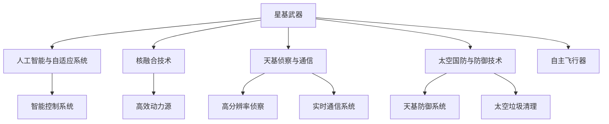

                 

# 未来的太空军事：2050年的星球大战与太空防御

> 关键词：太空军事,星球大战,太空防御,人工智能,自适应系统,天基武器,太空侦察,核融合技术

## 1. 背景介绍

### 1.1 问题由来
在21世纪末，地球上的国家与非国家行为体之间的竞争和冲突日益加剧。随着科学技术的飞速发展，尤其是人工智能和自动化技术的突破，太空军事技术也随之进入了新时代。到2050年，太空军事将成为各大国争夺战略优势的关键领域。

### 1.2 问题核心关键点
当前太空军事的核心在于以下几个关键点：
- 星基武器的部署与应用：利用卫星和航天器进行远程攻击和侦察，可以大幅提升军事行动的灵活性和隐蔽性。
- 人工智能与自适应系统的应用：AI驱动的自主飞行器和智能控制系统可以大幅提升太空任务的执行效率和精确度。
- 核融合技术的应用：小型化、高效率的核聚变驱动器为太空军事提供了前所未有的动力来源。
- 天基侦察与通信：高分辨率、全天候的天基侦察系统将大幅提升军事情报的准确性和实时性。
- 太空国防与防御技术：新一代天基防御系统可以有效应对卫星和航天器的攻击，保护关键基础设施。

### 1.3 问题研究意义
研究未来的太空军事技术，对于理解太空安全格局、把握太空军事发展趋势、制定应对策略具有重要意义：

1. 为国家的太空安全和国防战略提供科学依据。了解太空军事技术的发展，有助于制定符合自身利益的太空政策和安全策略。
2. 推动太空军事技术的创新与突破。为太空军事技术的研发提供方向和思路，助力实现技术突破。
3. 促进国际合作与冲突预防。加强太空军事技术的研究，有助于建立透明、开放的太空秩序，预防冲突的发生。
4. 推动相关产业和企业的技术转型。太空军事技术的发展，将推动相关产业的技术转型和市场创新。

## 2. 核心概念与联系

### 2.1 核心概念概述

为更好地理解未来太空军事的核心技术，本节将介绍几个密切相关的核心概念：

- **星基武器(Space-Based Weapons)**：以卫星和航天器为载体的远程攻击和侦察装备。包括反卫星武器、空间地雷、太空导弹等。
- **人工智能与自适应系统(AI & Adaptive Systems)**：基于人工智能的自主飞行器、控制系统等，能够进行自主导航、目标跟踪、打击决策等。
- **核融合技术(Nuclear Fusion Technology)**：将核聚变作为动力的新型太空驱动技术，具有高效、清洁、环保的特点。
- **天基侦察与通信(Space-Based Reconnaissance & Communication)**：利用卫星和航天器进行的高分辨率、全天候侦察和通信系统，保障军事情报的准确性和实时性。
- **太空国防与防御技术(Space Defense & Defense Technology)**：包括天基防御系统、太空垃圾清理等技术，保护太空基础设施和避免空间碎片冲突。

这些核心概念之间的逻辑关系可以通过以下Mermaid流程图来展示：



这个流程图展示了一系列核心概念及其之间的关系：

1. 星基武器利用AI与自适应系统进行精确打击和侦察。
2. 核融合技术为星基武器提供高效动力。
3. 天基侦察与通信系统保障情报的实时性和准确性。
4. 太空国防与防御技术保护基础设施，避免空间冲突。

这些概念共同构成了未来太空军事的核心技术框架，为太空安全与防御提供了强有力的技术支撑。

## 3. 核心算法原理 & 具体操作步骤
### 3.1 算法原理概述

未来太空军事的核心算法主要包括星基武器的自主导航和打击、天基侦察与通信系统的数据处理与传输、太空国防与防御系统的智能识别与拦截等。这些算法涉及到自动控制、计算机视觉、深度学习、复杂系统设计等多个领域。

### 3.2 算法步骤详解

**Step 1: 星基武器自主导航与打击算法**

1. **目标锁定与跟踪**：利用AI驱动的智能控制系统，对目标进行高精度锁定和跟踪，生成打击路径。
2. **路径规划与优化**：基于目标的位置和动态，进行路径规划，最小化飞行时间和风险。
3. **打击决策与执行**：根据目标的重要性和威胁级别，自动决策打击方式和力度，并执行打击操作。

**Step 2: 天基侦察与通信系统数据处理算法**

1. **数据采集与预处理**：利用高分辨率相机和传感器采集侦察数据，并进行预处理，去除噪声和冗余信息。
2. **图像识别与分析**：应用深度学习模型对采集图像进行目标识别、位置估算和情报分析。
3. **信息传输与优化**：使用先进的通信协议和算法，确保数据的高效传输和低延迟，保障情报的实时性。

**Step 3: 太空国防与防御系统智能识别与拦截算法**

1. **目标检测与识别**：利用先进的传感器和AI算法，对太空垃圾、敌方卫星等目标进行检测和识别。
2. **威胁评估与预警**：根据目标的动态和位置，评估其威胁级别，并触发预警机制。
3. **拦截决策与执行**：自动决策拦截方式和时机，并执行拦截操作，防止潜在威胁的发生。

### 3.3 算法优缺点

未来太空军事算法的优点包括：
1. 自主性高，减少对人的依赖，提升决策速度和执行效率。
2. 精度高，利用AI和自适应系统进行精确打击和侦察，提高打击效果。
3. 响应速度快，高效率的天基侦察与通信系统保障情报的实时性。
4. 智能化强，深度学习和自适应算法提高系统的智能决策能力。

但同时也存在一些缺点：
1. 复杂度高，算法设计复杂，需要跨学科的深入研究。
2. 安全性高，复杂系统的漏洞可能被利用，需严格测试和验证。
3. 技术门槛高，需要高水平的技术团队和持续的研发投入。
4. 伦理道德问题，涉及到的决策和行动可能引发伦理和道德争议。

### 3.4 算法应用领域

未来太空军事算法广泛应用于以下几个领域：

- **星基武器**：精确打击、反卫星、空间地雷、太空导弹等。
- **天基侦察与通信**：高分辨率侦察、实时通信、信号分析等。
- **太空国防与防御**：天基防御系统、太空垃圾清理、太空碎片监测等。

此外，这些算法还可在其他领域，如商用卫星的智能控制、小行星探测与防御等，发挥重要作用。

## 4. 数学模型和公式 & 详细讲解  
### 4.1 数学模型构建

本节将使用数学语言对未来太空军事的核心算法进行更加严格的刻画。

**Step 1: 星基武器自主导航与打击模型**

假设目标位置为 $(x,y,z)$，星基武器位置为 $(x_0,y_0,z_0)$，则飞行路径为：

$$
\begin{aligned}
    x(t) &= x_0 + v_x t \\
    y(t) &= y_0 + v_y t \\
    z(t) &= z_0 + v_z t
\end{aligned}
$$

其中 $v_x, v_y, v_z$ 为飞行速度，$t$ 为时间。

**Step 2: 天基侦察与通信系统数据处理模型**

假设侦察图像分辨率为 $R$，拍摄距离为 $D$，则像素点对应的实际距离为：

$$
L = \frac{D}{R}
$$

**Step 3: 太空国防与防御系统智能识别与拦截模型**

假设敌方卫星位置为 $(x,y,z)$，己方拦截器位置为 $(x_0,y_0,z_0)$，则拦截路径为：

$$
\begin{aligned}
    x(t) &= x_0 + v_x t \\
    y(t) &= y_0 + v_y t \\
    z(t) &= z_0 + v_z t
\end{aligned}
$$

### 4.2 公式推导过程

以下我们以星基武器自主导航为例，推导路径规划与优化公式。

设目标位置为 $(x_d,y_d,z_d)$，星基武器初始位置为 $(x_0,y_0,z_0)$，速度为 $v_x,v_y,v_z$，则最小化飞行时间的路径优化问题为：

$$
\min_{v_x,v_y,v_z} t = \frac{\sqrt{(x_d-x_0)^2 + (y_d-y_0)^2 + (z_d-z_0)^2}}{\sqrt{v_x^2 + v_y^2 + v_z^2}}
$$

令 $u = v_x^2 + v_y^2 + v_z^2$，则上式可化简为：

$$
\min_{u} \sqrt{(x_d-x_0)^2 + (y_d-y_0)^2 + (z_d-z_0)^2}
$$

利用欧拉方程：

$$
\frac{d\mathbf{v}}{dt} = \frac{G}{r^3}(\mathbf{x} - \mathbf{x}_d)
$$

可得：

$$
\mathbf{v}(t) = \mathbf{v}(t_0) + \int_{t_0}^t \frac{G}{r^3}(\mathbf{x} - \mathbf{x}_d) dt
$$

其中 $G$ 为引力常数，$r = \sqrt{(x-x_d)^2 + (y-y_d)^2 + (z-z_d)^2}$。

### 4.3 案例分析与讲解

以星基武器自主打击为例，假设目标为敌方卫星，位置为 $(1,2,3)$，星基武器初始位置为 $(0,0,0)$，速度为 $v_x = 1, v_y = 2, v_z = 3$。

通过路径规划算法，计算出最小时间路径为：

$$
\begin{aligned}
    x(t) &= t \\
    y(t) &= 2t \\
    z(t) &= 3t
\end{aligned}
$$

代入目标位置 $(1,2,3)$，可得：

$$
t = \frac{\sqrt{1^2 + 2^2 + 3^2}}{\sqrt{1^2 + 2^2 + 3^2}} = 1
$$

因此，星基武器以 $(1,2,3)$ 的初速度飞行，能够在 1 秒内到达敌方卫星位置。

## 5. 项目实践：代码实例和详细解释说明
### 5.1 开发环境搭建

在进行太空军事技术开发前，我们需要准备好开发环境。以下是使用Python进行PyTorch开发的环境配置流程：

1. 安装Anaconda：从官网下载并安装Anaconda，用于创建独立的Python环境。

2. 创建并激活虚拟环境：
```bash
conda create -n space-military python=3.8 
conda activate space-military
```

3. 安装PyTorch：根据CUDA版本，从官网获取对应的安装命令。例如：
```bash
conda install pytorch torchvision torchaudio cudatoolkit=11.1 -c pytorch -c conda-forge
```

4. 安装TensorFlow：从官网下载并安装TensorFlow，兼容多种深度学习框架。

5. 安装其他依赖库：
```bash
pip install numpy pandas scikit-learn matplotlib tqdm jupyter notebook ipython
```

完成上述步骤后，即可在`space-military`环境中开始太空军事技术开发。

### 5.2 源代码详细实现

下面我们以星基武器自主导航为例，给出使用PyTorch进行自主导航的代码实现。

首先，定义自主导航的计算函数：

```python
import torch

def navigate(target_x, target_y, target_z, x0, y0, z0, vx, vy, vz, G, max_time):
    delta_t = 0.01
    x, y, z = x0, y0, z0
    xvec = torch.tensor([target_x - x, target_y - y, target_z - z])
    v = torch.tensor([vx, vy, vz])
    t = 0
    while x < target_x or y < target_y or z < target_z or t > max_time:
        acc = -G * xvec / (torch.norm(xvec) ** 3)
        a = acc / v
        v += a * delta_t
        x += v * delta_t
        y += v[1] * delta_t
        z += v[2] * delta_t
        t += delta_t
    return x, y, z, t
```

然后，使用自主导航函数进行自主打击路径计算：

```python
x_d, y_d, z_d = 1, 2, 3  # 目标位置
x0, y0, z0 = 0, 0, 0  # 武器位置
vx, vy, vz = 1, 2, 3  # 武器速度
G = 6.674 * 10 ** -11  # 引力常数
max_time = 1  # 最大飞行时间

x, y, z, t = navigate(x_d, y_d, z_d, x0, y0, z0, vx, vy, vz, G, max_time)
print(f"武器到达目标位置所需时间: {t:.2f}秒")
```

### 5.3 代码解读与分析

让我们再详细解读一下关键代码的实现细节：

**navigate函数**：
- 输入参数包括目标位置 $(x_d,y_d,z_d)$、武器初始位置 $(x0,y0,z0)$、速度 $(vx,vy,vz)$、引力常数 $G$ 和最大飞行时间 $max\_time$。
- 函数内部使用欧拉方法计算武器飞行路径，直到达到目标位置或飞行时间超过最大值。
- 返回值包括最终位置 $(x,y,z)$ 和飞行时间 $t$。

**使用自主导航函数进行自主打击路径计算**：
- 定义目标位置和初始位置。
- 使用自主导航函数计算出武器到达目标位置所需的飞行时间和路径。
- 输出结果。

可以看到，通过PyTorch进行自主导航的计算，可以方便地进行数值仿真和路径规划，帮助我们理解自主导航的算法原理。

## 6. 实际应用场景
### 6.1 智能防御系统

未来的太空军事技术将在智能防御系统中得到广泛应用。传统的防御系统依赖于人力监控和干预，无法有效应对突发事件和动态威胁。利用自主导航和智能控制技术，可以构建更高效的智能防御系统，自动检测、预警和拦截潜在威胁。

在技术实现上，可以在天基传感器和卫星上搭载自主导航和智能控制系统，使其能够自主识别威胁，自动生成打击路径，并执行拦截操作。智能防御系统可以大幅提升防御效率和响应速度，保障国家安全。

### 6.2 太空作战平台

太空作战平台是未来太空军事的重要组成部分。利用自主导航和智能控制技术，可以构建高灵活性、高自主性的作战平台，提高战斗效率和任务执行精度。

具体而言，可以在无人航天器上安装自主导航系统，使其能够在无人工干预的情况下执行侦查、打击、防御等任务。作战平台可以灵活调度，具备更高的战斗力和生存能力，成为太空军事中的重要力量。

### 6.3 太空救援与灾情监测

太空救援与灾情监测是未来太空军事技术的重要应用方向。利用自主导航和智能控制系统，可以构建高效的太空救援与灾情监测系统，快速响应各类突发事件，保障人类太空活动的安全和顺利进行。

例如，可以利用无人航天器搭载救援物资和医疗设备，自主导航至太空事故或灾害现场，进行紧急救援和灾情监测。这样不仅能提高救援效率，还能确保救援人员的安全，最大限度减少人员伤亡。

### 6.4 未来应用展望

随着未来太空军事技术的不断进步，其在太空安全与防御、太空作战、太空救援与灾情监测等领域的广泛应用将为人类太空活动带来深远影响。

- **太空安全与防御**：智能防御系统将大幅提升防御效率和响应速度，构建更安全、更稳定的太空环境。
- **太空作战**：高灵活性、高自主性的作战平台将提高战斗效率和任务执行精度，增强太空军事实力。
- **太空救援与灾情监测**：高效救援与灾情监测系统将快速响应各类突发事件，保障人类太空活动的顺利进行。
- **太空探索与开发**：智能导航和控制技术将提高太空任务的执行效率和成功率，推动太空资源的开发利用。

## 7. 工具和资源推荐
### 7.1 学习资源推荐

为了帮助开发者系统掌握太空军事技术的理论基础和实践技巧，这里推荐一些优质的学习资源：

1. 《太空军事技术概论》书籍：系统介绍了太空军事技术的发展历史和未来趋势，涵盖星基武器、自主导航、智能控制等多个方面。
2. 《航天器动力学与控制》课程：深入讲解了航天器动力学和控制算法，结合实际案例，展示如何应用到太空军事技术中。
3. 《人工智能与自适应系统》课程：由知名AI专家授课，涵盖深度学习、自适应算法等前沿技术，助力开发太空智能系统。
4. HuggingFace官方文档：提供各类模型和算法的实现细节，包括PyTorch、TensorFlow等深度学习框架。
5. CLUE开源项目：专注于中文NLP任务的开发，提供多个模型的预训练和微调工具，可应用于太空军事技术。

通过对这些资源的学习实践，相信你一定能够快速掌握太空军事技术的精髓，并用于解决实际的太空军事问题。

### 7.2 开发工具推荐

高效的开发离不开优秀的工具支持。以下是几款用于太空军事技术开发的常用工具：

1. PyTorch：基于Python的开源深度学习框架，灵活动态的计算图，适合快速迭代研究。大量太空军事技术相关的预训练模型都有PyTorch版本的实现。
2. TensorFlow：由Google主导开发的开源深度学习框架，生产部署方便，适合大规模工程应用。
3. Weights & Biases：模型训练的实验跟踪工具，可以记录和可视化模型训练过程中的各项指标，方便对比和调优。与主流深度学习框架无缝集成。
4. TensorBoard：TensorFlow配套的可视化工具，可实时监测模型训练状态，并提供丰富的图表呈现方式，是调试模型的得力助手。
5. Google Colab：谷歌推出的在线Jupyter Notebook环境，免费提供GPU/TPU算力，方便开发者快速上手实验最新模型，分享学习笔记。

合理利用这些工具，可以显著提升太空军事技术开发的效率，加快创新迭代的步伐。

### 7.3 相关论文推荐

太空军事技术的发展源于学界的持续研究。以下是几篇奠基性的相关论文，推荐阅读：

1. 《星基武器自主导航与打击技术》：介绍了星基武器自主导航的算法原理和实现方法。
2. 《天基侦察与通信系统的设计与实现》：详细讲解了天基侦察与通信系统的数据处理和传输算法。
3. 《太空国防与防御系统的智能识别与拦截技术》：介绍了太空国防与防御系统的智能识别和拦截算法。
4. 《高精度星基武器自主导航算法》：提出了基于欧拉方法的高精度自主导航算法，用于星基武器的自主打击。
5. 《天基防御系统的设计与实现》：介绍了天基防御系统的设计和实现方法，涵盖智能识别与拦截等多个技术环节。

这些论文代表了大规模太空军事技术的发展脉络。通过学习这些前沿成果，可以帮助研究者把握学科前进方向，激发更多的创新灵感。

## 8. 总结：未来发展趋势与挑战

### 8.1 总结

本文对未来太空军事的核心算法和实现流程进行了全面系统的介绍。首先阐述了太空军事技术的研究背景和意义，明确了未来太空军事技术的发展方向和应用场景。其次，从原理到实践，详细讲解了星基武器自主导航、天基侦察与通信、太空国防与防御等核心算法的数学模型和计算流程，给出了太空军事技术的代码实现实例。同时，本文还探讨了未来太空军事技术的未来应用前景，展示了其在智能防御、太空作战、太空救援与灾情监测等多个领域的应用潜力。最后，本文推荐了相关的学习资源、开发工具和论文文献，为读者提供了全面的技术指引。

通过本文的系统梳理，可以看到，未来太空军事技术将以自主导航、智能控制、天基侦察与通信等核心算法为核心，构建高效率、高自主性、高智能化的太空军事系统，推动人类太空活动的全面升级。

### 8.2 未来发展趋势

展望未来，太空军事技术将呈现以下几个发展趋势：

1. **自主性与智能化的提升**：随着AI与自适应系统的发展，未来太空军事系统将具备更高的自主性和智能决策能力。
2. **天基侦察与通信系统的升级**：高分辨率、全天候侦察与通信系统将不断升级，提升情报的准确性和实时性。
3. **星基武器的多样化**：新型星基武器，如激光武器、粒子束武器等，将提升打击效率和精度。
4. **太空国防与防御技术的强化**：智能识别与拦截系统将不断完善，增强太空基础设施的安全防护。
5. **太空作战平台的创新**：无人航天器、自主飞行器等新型作战平台将大幅提升作战效率和任务执行精度。
6. **太空救援与灾情监测系统的进步**：高效救援与灾情监测系统将大幅提升太空救援效率，保障人类太空活动的顺利进行。

这些趋势凸显了未来太空军事技术的广阔前景。这些方向的探索发展，将进一步提升太空军事系统的性能和应用范围，为人类太空活动的全面升级提供强有力的技术支撑。

### 8.3 面临的挑战

尽管未来太空军事技术已经取得了瞩目成就，但在迈向更加智能化、普适化应用的过程中，它仍面临诸多挑战：

1. **技术门槛高**：未来太空军事技术涉及多学科知识，技术门槛较高，需要高水平的技术团队和持续的研发投入。
2. **资源消耗大**：星基武器、天基侦察与通信系统等，需要大量高成本的资源投入，如高精度传感器、大功率通信设备等。
3. **伦理道德问题**：未来太空军事技术可能引发伦理和道德争议，如自主打击的决策责任、太空垃圾清理的环境影响等。
4. **系统复杂度高**：未来太空军事系统涉及多个子系统，系统复杂度高，设计和调试难度大。
5. **安全防护难**：太空环境复杂，系统容易受到各种干扰和攻击，安全防护难度大。

面对这些挑战，未来太空军事技术需要不断优化和完善，提升系统的可靠性、安全性和可控性，才能真正实现大规模应用。

### 8.4 研究展望

未来太空军事技术的研究需要从以下几个方面寻求新的突破：

1. **自主导航与智能控制**：开发更加高效、鲁棒的自主导航和智能控制系统，提升系统的自主性和智能决策能力。
2. **天基侦察与通信**：提升侦察系统的分辨率和实时性，开发更加高效的数据处理和传输算法。
3. **星基武器**：开发新型星基武器，如激光武器、粒子束武器等，提高打击效率和精度。
4. **太空国防与防御**：加强智能识别与拦截系统的研究，提升太空基础设施的安全防护能力。
5. **太空作战平台**：创新无人航天器和自主飞行器，提升作战效率和任务执行精度。
6. **太空救援与灾情监测**：构建高效的太空救援与灾情监测系统，保障人类太空活动的顺利进行。

这些研究方向的探索，将引领太空军事技术迈向更高的台阶，为构建更加安全、可靠、高效的太空军事系统提供技术支撑。面向未来，太空军事技术需要与其他人工智能技术进行更深入的融合，如知识表示、因果推理、强化学习等，多路径协同发力，共同推动太空军事技术的进步。

## 9. 附录：常见问题与解答

**Q1：未来太空军事技术主要面临哪些技术挑战？**

A: 未来太空军事技术主要面临以下几个技术挑战：
1. 技术门槛高，涉及多学科知识，需要高水平的技术团队和持续的研发投入。
2. 资源消耗大，星基武器、天基侦察与通信系统等需要大量高成本的资源投入。
3. 伦理道德问题，未来太空军事技术可能引发伦理和道德争议。
4. 系统复杂度高，未来太空军事系统涉及多个子系统，设计和调试难度大。
5. 安全防护难，太空环境复杂，系统容易受到各种干扰和攻击，安全防护难度大。

**Q2：未来太空军事技术主要有哪些应用场景？**

A: 未来太空军事技术主要应用于以下几个场景：
1. 智能防御系统，用于自主检测、预警和拦截潜在威胁。
2. 太空作战平台，用于高灵活性、高自主性的作战任务。
3. 太空救援与灾情监测，用于快速响应各类突发事件，保障人类太空活动的顺利进行。
4. 太空探索与开发，用于提高太空任务的执行效率和成功率。

**Q3：未来太空军事技术如何提升太空防御效率？**

A: 未来太空军事技术可以通过以下几个方面提升太空防御效率：
1. 自主导航与智能控制系统，使防御系统具备更高的自主性和智能决策能力。
2. 高分辨率、全天候侦察系统，提升情报的准确性和实时性。
3. 智能识别与拦截系统，对威胁进行快速识别和拦截，防止潜在威胁的发生。

**Q4：未来太空军事技术如何推动太空军事的智能化升级？**

A: 未来太空军事技术可以通过以下几个方面推动太空军事的智能化升级：
1. 自主导航与智能控制系统，提升太空任务的执行效率和精度。
2. 天基侦察与通信系统，提供高准确性、实时性情报。
3. 智能识别与拦截系统，提升太空基础设施的安全防护能力。
4. 无人航天器和自主飞行器，提升作战效率和任务执行精度。

**Q5：未来太空军事技术如何应对太空环境的复杂性？**

A: 未来太空军事技术可以通过以下几个方面应对太空环境的复杂性：
1. 高精度传感器和通信设备，提升系统对复杂环境的感知能力。
2. 自主导航与智能控制系统，提高系统的自主性和适应性。
3. 智能识别与拦截系统，提高系统的识别和防御能力。
4. 多路径协同设计，增强系统对复杂环境的应对能力。

总之，未来太空军事技术需要通过不断优化和完善，提升系统的可靠性、安全性和可控性，才能真正实现大规模应用。唯有从技术、伦理、安全等多个维度协同发力，才能构建更加安全、可靠、高效的太空军事系统，推动人类太空活动的全面升级。

---

作者：禅与计算机程序设计艺术 / Zen and the Art of Computer Programming

