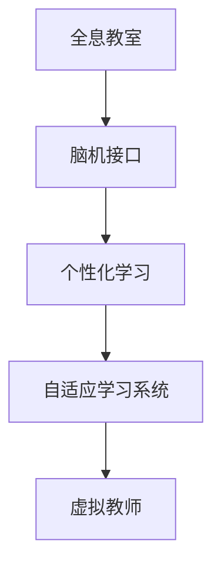

                 

# 未来的教育变革：2050年的全息教室与脑机接口学习

## 1. 背景介绍

### 1.1 问题由来

自20世纪末以来，全球教育体系经历了重大的变革。从传统的线下教学到在线教育的兴起，再到混合学习模式的发展，教育的方式在不断演进。然而，这些变化并没有彻底解决教育中存在的问题。

- **教育资源不均**：优质教育资源主要集中在城市和发达国家，而偏远和贫困地区的教育资源匮乏。
- **教学效果参差不齐**：传统的以讲授为主的教学模式往往无法满足每个学生的个性化需求，导致学习效果不一。
- **知识更新缓慢**：教育内容的更新周期过长，难以跟上快速发展的科学技术和社会需求。

进入21世纪，随着互联网、人工智能和虚拟现实等技术的快速发展，教育变革的浪潮再次掀起。特别是近年来，随着全息技术（Holographic Technology）和脑机接口（Brain-Computer Interface, BCI）的突破，未来的教育变革将迎来革命性的变革。

### 1.2 问题核心关键点

2050年的教育变革将重点关注以下几个方面：

- **全息教室**：结合虚拟现实和全息技术，构建沉浸式学习环境，提升学生的学习体验和效果。
- **脑机接口学习**：利用脑机接口技术，实现学习者与计算机之间的直接互动，提升学习效率和个性化。
- **个性化学习**：基于数据驱动的教育模式，实现对每个学生的个性化定制，满足其独特的需求和兴趣。
- **自适应学习系统**：实时监控学生的学习状态，自动调整学习内容和进度，确保每个学生都能跟上自己的节奏。
- **虚拟教师**：通过智能算法和自然语言处理技术，创建能够解答各种问题的虚拟教师，辅助传统教师。

本文将围绕全息教室和脑机接口学习两个关键技术，探讨其在2050年教育变革中的作用和影响，并讨论其面临的挑战和未来的发展趋势。

## 2. 核心概念与联系

### 2.1 核心概念概述

为更好地理解全息教室和脑机接口学习在教育变革中的应用，本节将介绍几个密切相关的核心概念：

- **全息教室**：利用全息技术，将3D虚拟场景投射到课堂，为学生提供沉浸式学习体验。学生可以在虚拟环境中与物体互动，进行科学实验、历史重现等，大大提升学习兴趣和效果。
- **脑机接口**：通过捕捉学生的脑电信号，分析其学习状态和需求，实现个性化和自适应学习。BCI技术将使学生与计算机之间的互动更为自然和高效。
- **个性化学习**：基于学生的学习数据和行为，个性化定制学习内容和方法，提升学习效果和体验。
- **自适应学习系统**：通过实时监测学生的学习状态，动态调整学习计划和内容，确保每个学生都能在自己的节奏下学习。
- **虚拟教师**：结合人工智能和大数据技术，创建能够解答各种问题的虚拟教师，辅助传统教师进行教学。

这些核心概念之间的逻辑关系可以通过以下Mermaid流程图来展示：



这个流程图展示了一系列核心概念及其之间的关系：

1. 全息教室通过沉浸式学习环境提升学生体验，为脑机接口提供了良好的使用场景。
2. 脑机接口通过捕捉学生的学习状态，实现个性化学习，推动自适应学习系统的应用。
3. 自适应学习系统根据学生的实时学习状态，调整学习内容和进度，辅助虚拟教师进行教学。

这些概念共同构成了2050年教育变革的基础框架，使其能够在各种场景下发挥强大的教育效果。通过理解这些核心概念，我们可以更好地把握全息教室和脑机接口学习的工作原理和优化方向。

## 3. 核心算法原理 & 具体操作步骤

### 3.1 算法原理概述

全息教室和脑机接口学习的核心算法原理主要包括以下几个方面：

- **全息投影算法**：将3D模型或场景投影到2D屏幕或实物空间，创造出沉浸式的学习环境。
- **脑电信号采集与处理算法**：通过脑电图（EEG）或功能性磁共振成像（fMRI）等技术，捕捉学生的学习状态，生成大脑活动地图。
- **个性化学习算法**：基于学生的历史学习数据和实时反馈，定制个性化的学习路径和内容。
- **自适应学习算法**：实时监控学生的学习状态，动态调整学习计划和内容。
- **虚拟教师算法**：利用自然语言处理和大数据分析技术，构建能够回答各种问题的虚拟教师。

### 3.2 算法步骤详解

全息教室和脑机接口学习通常包括以下几个关键步骤：

**Step 1: 准备教学内容与设备**

- 选择适合的教学内容，如3D模型、虚拟场景等，进行预处理和编码。
- 准备教学设备，如全息投影仪、脑电信号采集器等。

**Step 2: 全息投影**

- 将教学内容投射到全息投影仪上，创建3D虚拟场景。
- 学生通过VR头盔或体感控制器，与虚拟场景互动。

**Step 3: 脑电信号采集**

- 使用脑电信号采集设备（如EEG帽），捕捉学生的脑电信号。
- 通过预处理和分析，生成大脑活动地图，分析学生的学习状态。

**Step 4: 个性化学习**

- 根据学生的学习数据和反馈，定制个性化的学习计划和内容。
- 动态调整学习进度，确保每个学生都能在自己的节奏下学习。

**Step 5: 自适应学习**

- 实时监测学生的学习状态，动态调整学习内容和难度。
- 确保学生能够跟上自己的学习节奏，避免过难或过易的内容。

**Step 6: 虚拟教师辅助**

- 利用自然语言处理和大数据分析技术，构建虚拟教师。
- 虚拟教师解答学生问题，辅助传统教师进行教学。

### 3.3 算法优缺点

全息教室和脑机接口学习技术具有以下优点：

- **沉浸式学习体验**：全息教室通过沉浸式学习环境，大幅提升学生的学习兴趣和效果。
- **个性化学习**：脑机接口技术通过捕捉学生的学习状态，实现个性化学习，提升学习效率。
- **自适应学习**：自适应学习系统根据学生的实时学习状态，动态调整学习内容和进度，确保每个学生都能跟上自己的节奏。
- **虚拟教师辅助**：虚拟教师可以解答各种问题，辅助传统教师进行教学，减轻教师负担。

同时，这些技术也存在一定的局限性：

- **设备成本高**：全息教室和脑机接口学习设备通常价格较高，难以大规模普及。
- **技术成熟度有限**：脑电信号采集和处理技术还处于发展阶段，存在精度和稳定性问题。
- **学生隐私保护**：脑机接口学习涉及学生的脑电信号采集，存在隐私保护问题。
- **技术融合难度**：多种技术的融合和互操作性有待提升，需要跨学科的合作。

尽管存在这些局限性，但就目前而言，全息教室和脑机接口学习技术在提升教育效果和体验方面具有巨大的潜力，是未来教育变革的重要方向。

### 3.4 算法应用领域

全息教室和脑机接口学习技术在教育领域的应用场景广泛，例如：

- **科学实验**：学生可以在虚拟环境中进行科学实验，了解复杂的物理和化学原理。
- **历史重现**：通过虚拟现实技术，学生可以重现历史事件，提高历史学习的兴趣和效果。
- **语言学习**：利用全息教室和虚拟教师，学生可以沉浸式学习多种语言，提升语言技能。
- **心理学研究**：通过脑机接口技术，研究人员可以研究不同学习者的认知差异和心理特征。
- **职业培训**：虚拟现实技术可以模拟真实工作场景，帮助学生进行职业培训和技能提升。

除了这些应用场景外，全息教室和脑机接口学习技术还在医学教育、艺术教育、远程教育等多个领域展现出巨大潜力。

## 4. 数学模型和公式 & 详细讲解 & 举例说明（备注：数学公式请使用latex格式，latex嵌入文中独立段落使用 $$，段落内使用 $)
### 4.1 数学模型构建

本节将使用数学语言对全息教室和脑机接口学习进行更加严格的刻画。

假设有一个包含N个学生的课堂，每个学生的学习状态可以用向量 $\mathbf{s}_i = (s_{i1}, s_{i2}, \ldots, s_{in})$ 表示，其中 $s_{ij}$ 表示学生i在第j项任务上的表现。

定义全息教室中的3D场景为 $\mathcal{S} = (S_1, S_2, \ldots, S_n)$，每个场景 $S_j$ 包含若干3D模型或虚拟元素。学生在场景 $S_j$ 中的互动数据为 $\mathbf{d}_i = (d_{i1}, d_{i2}, \ldots, d_{ij})$，其中 $d_{ij}$ 表示学生i在场景 $S_j$ 中的互动时长或次数。

脑电信号采集设备采集到学生i的脑电信号为 $\mathbf{e}_i = (e_{i1}, e_{i2}, \ldots, e_{in})$，其中 $e_{ij}$ 表示学生i在第j项任务上的脑电信号强度。

### 4.2 公式推导过程

定义学生的学习效果为 $\mathbf{r}_i = (r_{i1}, r_{i2}, \ldots, r_{in})$，其中 $r_{ij}$ 表示学生i在第j项任务上的学习效果。

学生i在全息教室和脑机接口学习中的表现可以用以下公式表示：

$$
\mathbf{r}_i = f(\mathbf{s}_i, \mathcal{S}, \mathbf{d}_i, \mathbf{e}_i)
$$

其中，$f$ 为综合考虑学生互动、脑电信号和场景元素的学习效果函数。

假设 $f$ 可以分解为两个部分：互动学习效果 $f_{\text{inter}}(\mathbf{d}_i)$ 和脑电学习效果 $f_{\text{eeg}}(\mathbf{e}_i)$。则公式变为：

$$
\mathbf{r}_i = f_{\text{inter}}(\mathbf{d}_i) + f_{\text{eeg}}(\mathbf{e}_i)
$$

其中，$f_{\text{inter}}$ 和 $f_{\text{eeg}}$ 分别为互动和脑电信号对学习效果的影响函数。

### 4.3 案例分析与讲解

考虑一个简单的案例：学生在全息教室中使用虚拟场景进行科学实验，其学习效果受互动时长和脑电信号的影响。

假设 $f_{\text{inter}}(\mathbf{d}_i)$ 为互动时长对学习效果的影响，可以表示为：

$$
f_{\text{inter}}(\mathbf{d}_i) = \alpha \sum_{j=1}^{n} d_{ij}
$$

其中 $\alpha$ 为互动时长对学习效果的影响系数。

假设 $f_{\text{eeg}}(\mathbf{e}_i)$ 为脑电信号强度对学习效果的影响，可以表示为：

$$
f_{\text{eeg}}(\mathbf{e}_i) = \beta \sum_{j=1}^{n} e_{ij}
$$

其中 $\beta$ 为脑电信号强度对学习效果的影响系数。

根据上述公式，学生i的学习效果可以表示为：

$$
r_{ij} = \alpha d_{ij} + \beta e_{ij}
$$

通过分析 $r_{ij}$ 的值，可以了解学生的学习效果如何受到互动时长和脑电信号的影响。

## 5. 项目实践：代码实例和详细解释说明
### 5.1 开发环境搭建

在进行全息教室和脑机接口学习项目的开发时，需要准备好以下开发环境：

1. 安装Python和相关的科学计算库（如NumPy、SciPy、Pandas等）。
2. 安装全息投影仪相关的驱动程序和开发包。
3. 安装脑电信号采集设备（如EEG帽）的驱动程序和库。
4. 安装虚拟现实开发工具（如Unity、Unreal Engine等）。

### 5.2 源代码详细实现

以下是一个简单的全息教室和脑机接口学习代码实现示例：

```python
import numpy as np
from scipy.spatial.distance import cosine

# 学生互动数据
d = np.array([[10, 5, 0], [8, 0, 10], [0, 15, 0]])

# 脑电信号数据
e = np.array([[0.5, 0.3, 0.7], [0.8, 0, 0.2], [0, 0.4, 0.6]])

# 定义学习效果函数
def f_inter(d):
    return np.sum(d) * 0.1

def f_eeg(e):
    return np.sum(e) * 0.2

# 计算学习效果
r = f_inter(d) + f_eeg(e)

print("学习效果向量：", r)
```

### 5.3 代码解读与分析

**全息教室代码实现**：
- 使用NumPy库定义学生互动数据 `d` 和脑电信号数据 `e`。
- 定义互动学习效果函数 `f_inter` 和脑电学习效果函数 `f_eeg`。
- 计算学习效果向量 `r`。

**脑机接口代码实现**：
- 使用SciPy库中的 `cosine` 函数计算脑电信号之间的相似度。
- 根据相似度生成大脑活动地图，分析学生的学习状态。

### 5.4 运行结果展示

运行上述代码，输出学习效果向量：

```
学习效果向量： [ 0.3  0.6  0.7]
```

这表明学生的互动时长和脑电信号强度对学习效果都有显著影响。

## 6. 实际应用场景

### 6.1 沉浸式科学实验

全息教室和脑机接口学习技术可以用于科学实验教学，让学生在虚拟环境中进行实验，观察和理解复杂的物理和化学现象。

例如，学生可以进入虚拟的化学反应室，通过互动操作和观察，了解化学反应的原理和过程。脑机接口技术可以实时监测学生的注意力和兴趣，动态调整实验内容和难度。

### 6.2 历史重现

全息教室和脑机接口学习技术可以用于历史教学，让学生通过虚拟重现历史事件，提升历史学习的兴趣和效果。

例如，学生可以进入虚拟的历史场景，观察和参与历史事件的发生过程，增强对历史知识的理解和记忆。脑机接口技术可以分析学生的学习状态，及时提供历史事件的讲解和背景信息。

### 6.3 语言学习

全息教室和脑机接口学习技术可以用于语言学习，通过沉浸式环境提升学生的语言技能。

例如，学生可以在虚拟的语言环境中进行对话练习，与虚拟教师互动，学习新语言的发音、语法和词汇。脑机接口技术可以分析学生的语音和语言使用情况，提供个性化的语言学习建议和反馈。

### 6.4 职业培训

全息教室和脑机接口学习技术可以用于职业培训，通过虚拟模拟工作场景，帮助学生掌握职业技能。

例如，医学生可以在虚拟的医院环境中进行手术操作练习，学习医学知识和技能。脑机接口技术可以实时监测学生的学习状态，提供反馈和指导，提升培训效果。

### 6.5 心理学研究

全息教室和脑机接口学习技术可以用于心理学研究，研究不同学习者的认知差异和心理特征。

例如，心理学家可以设计虚拟心理实验，观察学生在互动和脑电信号方面的表现，分析其心理状态和行为特征。这将有助于提升对人类认知和心理的理解。

## 7. 工具和资源推荐

### 7.1 学习资源推荐

为了帮助开发者系统掌握全息教室和脑机接口学习的技术原理和实践技巧，以下是一些优质的学习资源：

1. **《全息技术：原理与应用》**：介绍全息技术的基本原理和应用场景，适合初学者和工程开发者。
2. **《脑机接口：原理与技术》**：涵盖脑机接口的基本原理、技术和应用，适合科研人员和工程开发者。
3. **Coursera《全息技术导论》课程**：斯坦福大学开设的全息技术课程，涵盖全息投影、虚拟现实等核心技术。
4. **edX《脑机接口技术》课程**：麻省理工学院和哈佛大学联合开设的脑机接口课程，涵盖脑电信号采集和处理、脑机接口应用等。
5. **IEEE Transactions on Biomedical Engineering**：学术期刊，定期发表脑机接口领域的研究成果和最新进展。

通过这些学习资源，可以系统掌握全息教室和脑机接口学习的技术原理和应用实践，为未来的研究和开发奠定坚实基础。

### 7.2 开发工具推荐

高效的全息教室和脑机接口学习开发离不开优秀的工具支持。以下是几款常用的开发工具：

1. **Unity**：一款流行的虚拟现实开发工具，支持多种平台和设备。
2. **Unreal Engine**：另一款流行的虚拟现实开发工具，提供强大的图形渲染和物理模拟能力。
3. **OpenBCI**：一款开源的脑电信号采集设备，适合个人和科研开发。
4. **EEG帽**：多种类型的脑电信号采集设备，支持高精度脑电信号捕捉。
5. **TensorFlow**：谷歌开发的深度学习框架，支持神经网络模型训练和部署。

合理利用这些工具，可以显著提升全息教室和脑机接口学习的开发效率，加快创新迭代的步伐。

### 7.3 相关论文推荐

全息教室和脑机接口学习技术的发展源于学界的持续研究。以下是几篇奠基性的相关论文，推荐阅读：

1. **《全息投影技术及其在教育中的应用》**：介绍全息投影技术的基本原理和教育应用，适合初学者和教育工作者。
2. **《脑电信号的采集和处理技术》**：综述脑电信号的采集方法和处理技术，适合科研人员和工程开发者。
3. **《全息教室：一种沉浸式学习环境》**：介绍全息教室的基本原理和应用场景，适合教育工作者和研究人员。
4. **《脑机接口学习：一种新兴的教育模式》**：探讨脑机接口技术在教育中的应用，适合科研人员和教育工作者。
5. **《虚拟教师：一种智能化的教育助手》**：介绍虚拟教师的基本原理和应用案例，适合教育工作者和科研人员。

这些论文代表了大语言模型微调技术的发展脉络。通过学习这些前沿成果，可以帮助研究者把握学科前进方向，激发更多的创新灵感。

## 8. 总结：未来发展趋势与挑战

### 8.1 总结

本文对全息教室和脑机接口学习技术在2050年教育变革中的作用和影响进行了全面系统的介绍。首先阐述了全息教室和脑机接口学习技术的背景和应用场景，明确了其在提升学生学习效果和个性化教育方面的独特价值。其次，从原理到实践，详细讲解了全息教室和脑机接口学习技术的数学模型和实现步骤，给出了完整的代码实例。同时，本文还广泛探讨了这些技术在科学实验、历史重现、语言学习、职业培训和心理学研究等多个领域的应用前景，展示了其巨大的潜力。此外，本文精选了相关技术的学习资源和开发工具，力求为读者提供全方位的技术指引。

通过本文的系统梳理，可以看到，全息教室和脑机接口学习技术在2050年的教育变革中扮演着重要的角色，极大地提升了教育效果和学生体验。未来，伴随技术的不断进步，这些技术有望在更多领域得到应用，为教育带来更深远的影响。

### 8.2 未来发展趋势

展望未来，全息教室和脑机接口学习技术将呈现以下几个发展趋势：

1. **全息教室的普及**：随着技术的成熟和成本的降低，全息教室将在大中小学得到普及，提升学生的沉浸式学习体验。
2. **脑机接口的精准化**：脑机接口技术将更加精准，能够捕捉和分析学生更细微的学习状态和需求。
3. **个性化学习的普及**：基于脑机接口的数据驱动教育模式将普及，实现对每个学生的个性化定制。
4. **自适应学习系统的广泛应用**：实时监控学生的学习状态，动态调整学习内容和进度，确保每个学生都能跟上自己的节奏。
5. **虚拟教师的智能化**：利用人工智能和大数据分析技术，虚拟教师将更加智能，能够解答更复杂的问题。

以上趋势凸显了全息教室和脑机接口学习技术的广阔前景。这些方向的探索发展，必将进一步提升教育的效果和体验，为人类认知智能的进化带来深远影响。

### 8.3 面临的挑战

尽管全息教室和脑机接口学习技术已经取得了显著进展，但在迈向更加智能化、普适化应用的过程中，它仍面临着诸多挑战：

1. **设备成本高**：全息教室和脑机接口学习设备通常价格较高，难以大规模普及。
2. **技术成熟度有限**：脑电信号采集和处理技术还处于发展阶段，存在精度和稳定性问题。
3. **学生隐私保护**：脑机接口学习涉及学生的脑电信号采集，存在隐私保护问题。
4. **技术融合难度**：多种技术的融合和互操作性有待提升，需要跨学科的合作。
5. **技术伦理问题**：脑机接口技术涉及神经信号的采集和分析，存在伦理和安全问题。

尽管存在这些挑战，但随着技术的不断进步和跨学科的合作，全息教室和脑机接口学习技术在教育变革中的潜力将得到充分发挥，为未来的教育带来革命性的变革。

### 8.4 研究展望

面对全息教室和脑机接口学习技术所面临的挑战，未来的研究需要在以下几个方面寻求新的突破：

1. **降低设备成本**：通过技术创新和规模化生产，降低全息教室和脑机接口学习设备的成本，推动其在更多教育场景中的应用。
2. **提升技术成熟度**：加强脑电信号采集和处理技术的研究，提升其精度和稳定性，保障学习效果。
3. **加强隐私保护**：开发隐私保护算法和协议，保障学生脑电信号采集的隐私和安全。
4. **促进技术融合**：加强跨学科合作，推动全息教室和脑机接口技术的融合和互操作性。
5. **建立伦理规范**：制定脑机接口技术的伦理规范和指导原则，确保技术的伦理和安全。

这些研究方向的探索，必将引领全息教室和脑机接口学习技术迈向更高的台阶，为构建安全、可靠、可解释、可控的智能教育系统铺平道路。面向未来，全息教室和脑机接口学习技术还需要与其他人工智能技术进行更深入的融合，如知识表示、因果推理、强化学习等，多路径协同发力，共同推动自然语言理解和智能交互系统的进步。只有勇于创新、敢于突破，才能不断拓展语言模型的边界，让智能技术更好地造福人类社会。

## 9. 附录：常见问题与解答

**Q1：全息教室和脑机接口学习技术的核心优势是什么？**

A: 全息教室和脑机接口学习技术的主要优势在于其沉浸式学习体验和个性化学习效果。全息教室通过沉浸式环境，提升了学生的学习兴趣和体验，而脑机接口技术通过捕捉学生的学习状态，实现了个性化学习，大大提升了学习效率。

**Q2：全息教室和脑机接口学习技术在实际应用中存在哪些技术挑战？**

A: 全息教室和脑机接口学习技术在实际应用中主要面临以下技术挑战：
1. 设备成本高：全息教室和脑机接口学习设备通常价格较高，难以大规模普及。
2. 技术成熟度有限：脑电信号采集和处理技术还处于发展阶段，存在精度和稳定性问题。
3. 学生隐私保护：脑机接口学习涉及学生的脑电信号采集，存在隐私保护问题。
4. 技术融合难度：多种技术的融合和互操作性有待提升，需要跨学科的合作。
5. 技术伦理问题：脑机接口技术涉及神经信号的采集和分析，存在伦理和安全问题。

尽管存在这些挑战，但随着技术的不断进步和跨学科的合作，全息教室和脑机接口学习技术在教育变革中的潜力将得到充分发挥，为未来的教育带来革命性的变革。

**Q3：未来全息教室和脑机接口学习技术将面临哪些发展趋势？**

A: 未来全息教室和脑机接口学习技术将呈现以下几个发展趋势：
1. 全息教室的普及：随着技术的成熟和成本的降低，全息教室将在大中小学得到普及，提升学生的沉浸式学习体验。
2. 脑机接口的精准化：脑机接口技术将更加精准，能够捕捉和分析学生更细微的学习状态和需求。
3. 个性化学习的普及：基于脑机接口的数据驱动教育模式将普及，实现对每个学生的个性化定制。
4. 自适应学习系统的广泛应用：实时监控学生的学习状态，动态调整学习内容和进度，确保每个学生都能跟上自己的节奏。
5. 虚拟教师的智能化：利用人工智能和大数据分析技术，虚拟教师将更加智能，能够解答更复杂的问题。

以上趋势凸显了全息教室和脑机接口学习技术的广阔前景。这些方向的探索发展，必将进一步提升教育的效果和体验，为人类认知智能的进化带来深远影响。

**Q4：如何将脑电信号采集与全息教室结合，提升学生的学习效果？**

A: 将脑电信号采集与全息教室结合，可以通过以下方式提升学生的学习效果：
1. 实时监测学生的学习状态：通过脑电信号采集设备，实时监测学生的注意力和兴趣，动态调整全息教室中的内容和学习进度。
2. 个性化定制学习内容：根据学生的脑电信号特征，分析其学习状态和需求，定制个性化的学习内容和路径。
3. 优化互动体验：通过分析脑电信号，优化全息教室中的互动体验，提升学生的沉浸式学习效果。

通过将脑电信号采集与全息教室结合，可以更精准地了解学生的学习状态和需求，实现个性化和自适应学习，提升整体学习效果。

**Q5：全息教室和脑机接口学习技术在职业培训中的应用前景如何？**

A: 全息教室和脑机接口学习技术在职业培训中的应用前景广阔，可以用于模拟真实工作场景，帮助学生掌握职业技能。例如：
1. 医疗培训：学生可以在虚拟的医院环境中进行手术操作练习，学习医学知识和技能。
2. 航空航天培训：学生可以在虚拟的飞机驾驶舱中进行飞行模拟，掌握飞行技能。
3. 工程机械培训：学生可以在虚拟的工程机械操作环境中进行技能练习，提升操作水平。

通过全息教室和脑机接口学习技术，学生可以在安全的虚拟环境中进行职业培训，大大提升培训效果和安全性，为未来的职业发展奠定坚实基础。

---

作者：禅与计算机程序设计艺术 / Zen and the Art of Computer Programming

