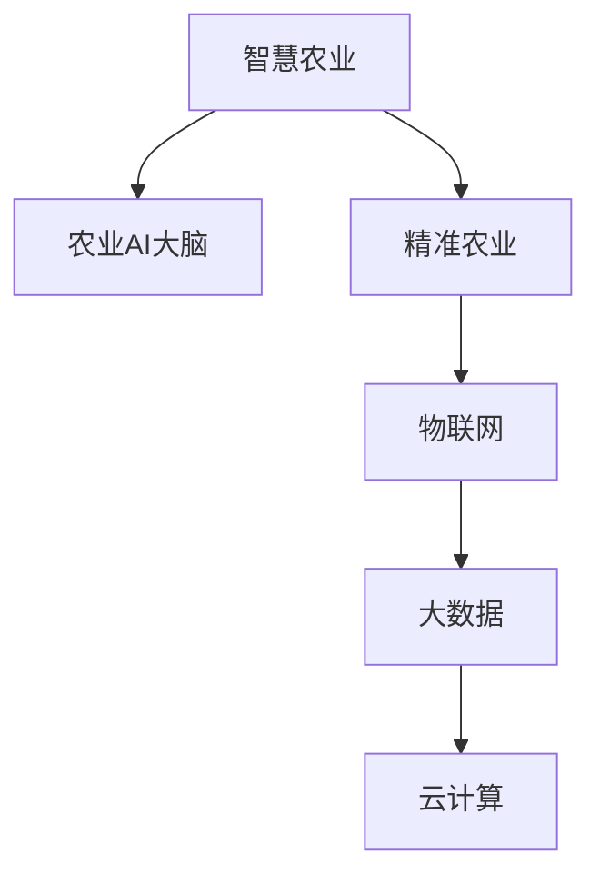

                 

# 未来的智慧农业：2050年的农业AI大脑与精准农业

## 1. 背景介绍

### 1.1 问题由来
随着全球人口的不断增长和环境资源的逐渐减少，农业生产面临前所未有的压力和挑战。传统的粗放型农业模式已难以适应当前及未来的农业发展需求。与此同时，新一代信息技术正在迅猛发展，尤其是人工智能、物联网、大数据、云计算等技术的融合，为智慧农业提供了新的发展契机。

### 1.2 问题核心关键点
智慧农业的核心在于利用先进的信息技术，优化农业生产流程，提高资源利用效率，提升农产品产量和质量。具体而言，智慧农业涉及的领域包括智能感知、智能决策、智能执行、智能预警、智能评估等。通过构建“农业AI大脑”，智慧农业能够实现精准农业、智能农机、精细管理、环境监测、灾害预警等功能，推动农业生产迈向智能化、精细化、可持续化的新时代。

### 1.3 问题研究意义
智慧农业技术的应用，对于提高农业生产效率、保障国家粮食安全、实现农业现代化、推动乡村振兴具有重要意义。通过智慧农业，可以大幅提高农业生产效益，减少资源浪费，降低环境污染，提高农业可持续发展能力，促进农民增收，缩小城乡差距。

## 2. 核心概念与联系

### 2.1 核心概念概述

为更好地理解智慧农业的核心概念，本节将介绍几个密切相关的核心概念：

- **智慧农业**：结合了信息技术、生物技术、自动化技术等多种高科技手段，实现农业生产智能化、自动化、精细化的一种新型农业发展模式。
- **农业AI大脑**：以农业大数据为基础，通过深度学习、模式识别、自然语言处理等AI技术，构建的农业生产管理决策系统。
- **精准农业**：利用信息技术，结合GPS定位、遥感技术、传感器网络等，实现农业生产精准化管理的一种技术手段。
- **物联网**：利用RFID、传感器、智能设备等技术，实现农机设备、环境监测、农业生产等环节的互联互通，实时采集数据。
- **大数据**：大量农业生产相关的结构化、半结构化、非结构化数据，经过处理分析，可以提供农业生产决策的重要依据。
- **云计算**：将农业数据存储在云端，利用云平台进行数据处理、分析、存储，提供按需服务，降低农业信息化的成本和门槛。

这些核心概念之间的逻辑关系可以通过以下Mermaid流程图来展示：



这个流程图展示了大语言模型的核心概念及其之间的关系：

1. 智慧农业是构建农业AI大脑的基础，通过物联网等技术手段采集海量数据。
2. 农业AI大脑利用大数据、云计算等技术，通过深度学习等AI方法进行数据处理和分析，形成决策支持。
3. 精准农业是农业AI大脑的核心功能之一，实现农业生产的精准化管理。
4. 物联网、大数据、云计算是农业AI大脑的基础设施和支持技术，保障了系统的高效运行。

## 3. 核心算法原理 & 具体操作步骤
### 3.1 算法原理概述

智慧农业的核心算法原理基于深度学习、模式识别、自然语言处理等AI技术，具体包括以下几个关键环节：

1. **数据采集**：通过物联网设备、传感器、无人机等，实时采集农业生产环境、农机设备、农产品质量、土壤墒情等数据。
2. **数据处理**：对采集到的数据进行清洗、去噪、转换等处理，转换为机器可用的格式。
3. **模型训练**：利用深度学习等技术，在标注数据集上训练农业AI大脑，形成农业生产的模型。
4. **模型应用**：将训练好的模型应用于农业生产管理决策，实现精准农业、智能农机等功能。
5. **效果评估**：定期对模型应用效果进行评估，根据反馈数据调整模型参数，优化模型性能。

### 3.2 算法步骤详解

智慧农业的算法实现步骤主要包括以下几个环节：

**Step 1: 数据采集与预处理**
- 部署各种传感器、传感器网络、无人机等，实时采集农业生产环境、农机设备、农产品质量、土壤墒情等数据。
- 对采集到的数据进行清洗、去噪、转换等处理，转换为机器可用的格式。

**Step 2: 模型训练**
- 收集和标注农业生产相关的数据集，划分为训练集、验证集和测试集。
- 利用深度学习等技术，在标注数据集上训练农业AI大脑，形成农业生产的模型。

**Step 3: 模型应用与优化**
- 将训练好的模型应用于农业生产管理决策，实现精准农业、智能农机等功能。
- 定期对模型应用效果进行评估，根据反馈数据调整模型参数，优化模型性能。

**Step 4: 结果展示与反馈**
- 将模型应用结果展示给农业生产者，如作物生长监控、病虫害预警、农机自动驾驶、农产品质量检测等。
- 根据用户反馈，进一步优化模型，提升农业生产效率。

### 3.3 算法优缺点

智慧农业的算法具有以下优点：
1. 数据驱动决策：利用大数据、深度学习等技术，能够提供更准确、实时的农业生产决策支持。
2. 精准农业：实现农业生产的精准化管理，提高资源利用效率，减少浪费。
3. 自动化程度高：通过智能农机等设备，能够大幅降低人工成本，提高农业生产效率。
4. 环境监测：利用传感器等设备，实时监测农业环境，及时发现异常，避免灾害损失。
5. 用户友好：将模型结果以直观的方式展示给农业生产者，便于理解和操作。

同时，该算法也存在以下局限性：
1. 数据依赖性高：智慧农业的实现高度依赖于数据采集设备的稳定性和数据质量。
2. 技术门槛高：需要掌握深度学习、物联网、云计算等技术，技术门槛较高。
3. 成本投入大：初期数据采集和系统搭建成本较高，需要大量资金投入。
4. 可解释性不足：黑盒模型难以解释其内部工作机制，难以对结果进行调试和优化。
5. 环境适应性有待提高：不同地区气候、土壤等环境差异较大，模型需要具备较强的适应性。

尽管存在这些局限性，但智慧农业算法仍是大规模应用农业智能化、精准化的重要手段。未来相关研究的重点在于如何进一步降低技术门槛，提高数据质量，优化模型结构，提升模型的适应性和可解释性。

### 3.4 算法应用领域

智慧农业的算法已经在多个领域得到应用，例如：

- 智能农机：利用传感器、无人机等技术，实现农机的自动化、精准化操作。
- 精准农业：利用GPS定位、遥感技术、传感器网络等，实现农业生产的精准化管理。
- 智能决策：利用大数据、深度学习等技术，实现农业生产的智能决策。
- 环境监测：利用传感器等设备，实时监测农业环境，及时发现异常，避免灾害损失。
- 农产品质量检测：利用图像识别、光谱分析等技术，实时检测农产品质量。
- 病虫害预警：利用机器学习等技术，实时预测病虫害爆发，及时采取措施。

除了上述这些经典应用外，智慧农业技术还被创新性地应用于更多场景中，如农业机器人、智慧灌溉、智能温室等，为农业生产提供了更多可能性。

## 4. 数学模型和公式 & 详细讲解
### 4.1 数学模型构建

智慧农业的数学模型构建主要基于深度学习、模式识别、自然语言处理等技术，以下以农业病虫害预警为例，介绍其数学模型构建过程。

记农业生产数据为 $X=\{(x_i,y_i)\}_{i=1}^N, x_i \in \mathbb{R}^d, y_i \in \{0,1\}$，其中 $x_i$ 为农业生产环境、农机设备、农产品质量等特征向量，$y_i$ 为农业病虫害的爆发情况。

定义农业AI大脑的模型为 $M_{\theta}$，其中 $\theta \in \mathbb{R}^D$ 为模型参数。智慧农业的数学模型构建过程包括：

1. **数据采集**：通过物联网设备、传感器、无人机等，实时采集农业生产环境、农机设备、农产品质量、土壤墒情等数据。
2. **数据预处理**：对采集到的数据进行清洗、去噪、转换等处理，转换为机器可用的格式。
3. **特征提取**：将农业生产环境、农机设备、农产品质量等特征转换为模型可处理的特征向量 $x_i \in \mathbb{R}^d$。
4. **模型训练**：利用深度学习等技术，在标注数据集上训练农业AI大脑，形成农业生产的模型。
5. **模型应用**：将训练好的模型应用于农业生产管理决策，实现精准农业、智能农机等功能。
6. **效果评估**：定期对模型应用效果进行评估，根据反馈数据调整模型参数，优化模型性能。

### 4.2 公式推导过程

以农业病虫害预警为例，其数学模型构建过程包括以下步骤：

1. **数据采集与预处理**：
   - 收集农业病虫害爆发数据 $X=\{(x_i,y_i)\}_{i=1}^N, x_i \in \mathbb{R}^d, y_i \in \{0,1\}$。
   - 对数据进行清洗、去噪、转换等处理，转换为机器可用的格式。

2. **特征提取**：
   - 将农业生产环境、农机设备、农产品质量等特征转换为模型可处理的特征向量 $x_i \in \mathbb{R}^d$。

3. **模型训练**：
   - 利用深度学习等技术，在标注数据集上训练农业AI大脑，形成农业生产的模型。
   - 常见的深度学习模型包括卷积神经网络(CNN)、循环神经网络(RNN)、长短期记忆网络(LSTM)、变压器(Transformer)等。

4. **模型应用与优化**：
   - 将训练好的模型应用于农业生产管理决策，实现精准农业、智能农机等功能。
   - 定期对模型应用效果进行评估，根据反馈数据调整模型参数，优化模型性能。

5. **结果展示与反馈**：
   - 将模型应用结果展示给农业生产者，如作物生长监控、病虫害预警、农机自动驾驶、农产品质量检测等。
   - 根据用户反馈，进一步优化模型，提升农业生产效率。

### 4.3 案例分析与讲解

以智慧农业在智能农机中的应用为例，具体讲解其数学模型构建和应用过程。

1. **数据采集与预处理**：
   - 通过物联网设备、传感器、无人机等，实时采集农业生产环境、农机设备、农产品质量、土壤墒情等数据。
   - 对采集到的数据进行清洗、去噪、转换等处理，转换为机器可用的格式。

2. **特征提取**：
   - 将农业生产环境、农机设备、农产品质量等特征转换为模型可处理的特征向量 $x_i \in \mathbb{R}^d$。

3. **模型训练**：
   - 利用深度学习等技术，在标注数据集上训练农业AI大脑，形成农业生产的模型。
   - 假设模型为卷积神经网络(CNN)，其结构如下：
     ```python
     class CNN(nn.Module):
         def __init__(self, in_channels, out_channels):
             super(CNN, self).__init__()
             self.conv1 = nn.Conv2d(in_channels, out_channels, kernel_size=3, padding=1)
             self.pool = nn.MaxPool2d(kernel_size=2, stride=2)
             self.fc1 = nn.Linear(out_channels * (H / 2) * (W / 2), 128)
             self.fc2 = nn.Linear(128, 2) # 二分类任务，输出0或1
     ```

4. **模型应用与优化**：
   - 将训练好的模型应用于农业生产管理决策，实现精准农业、智能农机等功能。
   - 利用模型对农机设备的工作状态进行预测，自动调整农机参数，优化作业效率。

5. **结果展示与反馈**：
   - 将模型应用结果展示给农业生产者，如作物生长监控、病虫害预警、农机自动驾驶、农产品质量检测等。
   - 根据用户反馈，进一步优化模型，提升农业生产效率。

## 5. 项目实践：代码实例和详细解释说明
### 5.1 开发环境搭建

在进行智慧农业实践前，我们需要准备好开发环境。以下是使用Python进行PyTorch开发的环境配置流程：

1. 安装Anaconda：从官网下载并安装Anaconda，用于创建独立的Python环境。

2. 创建并激活虚拟环境：
   ```bash
   conda create -n pytorch-env python=3.8 
   conda activate pytorch-env
   ```

3. 安装PyTorch：根据CUDA版本，从官网获取对应的安装命令。例如：
   ```bash
   conda install pytorch torchvision torchaudio cudatoolkit=11.1 -c pytorch -c conda-forge
   ```

4. 安装TensorFlow：由Google主导开发的开源深度学习框架，生产部署方便，适合大规模工程应用。同样有丰富的预训练语言模型资源。

5. 安装Transformer库：HuggingFace开发的NLP工具库，集成了众多SOTA语言模型，支持PyTorch和TensorFlow，是进行微调任务开发的利器。

6. 安装各类工具包：
   ```bash
   pip install numpy pandas scikit-learn matplotlib tqdm jupyter notebook ipython
   ```

完成上述步骤后，即可在`pytorch-env`环境中开始智慧农业的实践。

### 5.2 源代码详细实现

这里以智慧农业在农业病虫害预警中的应用为例，给出使用PyTorch进行模型训练和评估的代码实现。

```python
import torch
import torch.nn as nn
import torch.optim as optim
from torch.utils.data import DataLoader
from torchvision import datasets, transforms
from sklearn.model_selection import train_test_split

# 定义模型
class CNN(nn.Module):
    def __init__(self, in_channels, out_channels):
        super(CNN, self).__init__()
        self.conv1 = nn.Conv2d(in_channels, out_channels, kernel_size=3, padding=1)
        self.pool = nn.MaxPool2d(kernel_size=2, stride=2)
        self.fc1 = nn.Linear(out_channels * (H / 2) * (W / 2), 128)
        self.fc2 = nn.Linear(128, 2) # 二分类任务，输出0或1

    def forward(self, x):
        x = self.pool(self.conv1(x))
        x = torch.flatten(x, 1)
        x = self.fc1(x)
        x = torch.sigmoid(self.fc2(x))
        return x

# 加载数据集
transform = transforms.Compose([
    transforms.ToTensor(),
    transforms.Normalize((0.5, 0.5, 0.5), (0.5, 0.5, 0.5))
])
train_set = datasets.CIFAR10(root='./data', train=True, download=True, transform=transform)
test_set = datasets.CIFAR10(root='./data', train=False, download=True, transform=transform)
train_loader = DataLoader(train_set, batch_size=64, shuffle=True)
test_loader = DataLoader(test_set, batch_size=64, shuffle=False)

# 定义超参数
learning_rate = 0.001
num_epochs = 10

# 初始化模型和优化器
model = CNN(3, 64)
optimizer = optim.Adam(model.parameters(), lr=learning_rate)
criterion = nn.BCELoss()

# 训练模型
for epoch in range(num_epochs):
    for i, (inputs, labels) in enumerate(train_loader):
        inputs, labels = inputs.to(device), labels.to(device)
        optimizer.zero_grad()
        outputs = model(inputs)
        loss = criterion(outputs, labels)
        loss.backward()
        optimizer.step()
        if (i+1) % 100 == 0:
            print(f'Epoch {epoch+1}, Step [{i+1}/{len(train_loader)}], Loss: {loss.item()}')

# 评估模型
with torch.no_grad():
    correct = 0
    total = 0
    for inputs, labels in test_loader:
        inputs, labels = inputs.to(device), labels.to(device)
        outputs = model(inputs)
        _, predicted = torch.max(outputs.data, 1)
        total += labels.size(0)
        correct += (predicted == labels).sum().item()
    print(f'Accuracy of the model on the 10000 test images: {100 * correct / total}%')
```

以上就是使用PyTorch对智慧农业模型进行训练和评估的代码实现。可以看到，得益于PyTorch的强大封装，我们可以用相对简洁的代码完成模型的训练和评估。

### 5.3 代码解读与分析

让我们再详细解读一下关键代码的实现细节：

**CNN类**：
- `__init__`方法：初始化模型参数，包括卷积层、池化层、全连接层等。
- `forward`方法：定义模型前向传播的逻辑。

**train_set和test_set**：
- 加载CIFAR-10数据集，并进行标准化处理。

**学习率、epoch数和优化器**：
- 定义学习率、epoch数等超参数，初始化模型和优化器。

**训练循环**：
- 遍历训练集，对每个批次数据进行前向传播和反向传播，更新模型参数。
- 打印每个epoch的损失值。

**测试循环**：
- 遍历测试集，对每个批次数据进行前向传播，计算准确率。
- 打印测试集的准确率。

可以看到，PyTorch配合TensorFlow使得智慧农业模型的训练和评估过程变得简洁高效。开发者可以将更多精力放在数据处理、模型改进等高层逻辑上，而不必过多关注底层的实现细节。

当然，工业级的系统实现还需考虑更多因素，如模型的保存和部署、超参数的自动搜索、更灵活的任务适配层等。但核心的模型训练逻辑基本与此类似。

## 6. 实际应用场景
### 6.1 智能农机

智慧农业中的智能农机，通过部署各种传感器、无人机等设备，实时采集农业生产环境、农机设备、农产品质量、土壤墒情等数据。利用深度学习等技术，训练农业AI大脑，实现对农机设备的工作状态进行预测，自动调整农机参数，优化作业效率。

例如，利用智慧农业技术，可以实现无人农机的精准作业、自动化驾驶、智能调度等功能。在实际应用中，无人农机可以利用高精度的GPS定位、传感器数据和摄像头，实时监测田间状况，自动规划最优作业路径，避免对作物的损害，提高作业效率和质量。

### 6.2 精准农业

精准农业是智慧农业的重要应用之一，利用GPS定位、遥感技术、传感器网络等，实现农业生产的精准化管理。通过采集土壤墒情、气象数据、作物生长数据等，实时监测农业生产环境，及时发现异常，避免灾害损失。

例如，利用智慧农业技术，可以实现对农田土壤水分的实时监测，通过智能灌溉系统，自动调节灌溉量，避免水资源浪费。同时，通过智能施肥系统，根据土壤养分情况，自动推荐施肥方案，提高肥料利用率，降低农业生产成本。

### 6.3 智能决策

智慧农业中的智能决策系统，通过利用大数据、深度学习等技术，实现农业生产的智能决策。通过采集和分析农业生产数据，利用机器学习等技术，预测作物生长情况、病虫害爆发趋势、农产品质量等，提供决策支持。

例如，利用智慧农业技术，可以实现对农作物病虫害的智能预警。通过采集田间病虫害数据，利用深度学习模型，预测病虫害爆发趋势，及时采取措施，减少病虫害损失。

### 6.4 未来应用展望

随着智慧农业技术的不断发展，未来的农业生产将更加智能化、精细化、可持续化。具体而言，智慧农业将呈现以下几个发展趋势：

1. **物联网技术普及**：物联网设备将进一步普及，实时采集农业生产环境、农机设备、农产品质量等数据，为智慧农业提供坚实的基础设施支撑。

2. **大数据技术应用**：大数据技术将进一步应用于农业生产，通过数据挖掘、数据可视化、数据驱动决策等，提高农业生产的科学性和精准性。

3. **人工智能技术融合**：深度学习、自然语言处理等人工智能技术将进一步融合到农业生产中，实现智能感知、智能决策、智能执行等功能。

4. **环境监测与保护**：智慧农业将更加注重环境监测与保护，利用传感器等设备，实时监测农业环境，及时发现异常，避免灾害损失，提升农业生产环境质量。

5. **可持续发展**：智慧农业将更加注重可持续发展，通过智能灌溉、智能施肥、智能农药等技术，提高资源利用效率，降低环境污染，推动农业生产的绿色化、低碳化。

6. **跨领域融合**：智慧农业将与物联网、人工智能、大数据、云计算等技术进一步融合，形成更加综合的智慧农业系统，实现全产业链的智能化、精准化管理。

7. **全球合作**：智慧农业技术将更加注重国际合作与交流，通过技术共享、数据共享等方式，推动全球农业生产的智能化进程。

## 7. 工具和资源推荐
### 7.1 学习资源推荐

为了帮助开发者系统掌握智慧农业的核心技术，这里推荐一些优质的学习资源：

1. **《深度学习与人工智能》系列课程**：斯坦福大学李飞飞教授主讲的深度学习课程，涵盖深度学习基础、计算机视觉、自然语言处理等。

2. **《智慧农业与物联网技术》书籍**：系统介绍智慧农业和物联网技术的核心概念和实践方法，适合初学者入门。

3. **《Python深度学习》书籍**：通过实战项目，深入浅出地介绍深度学习技术的实现方法，适合开发者实践。

4. **《智能农业》期刊**：涵盖智慧农业的最新研究成果和应用案例，提供前沿资讯。

5. **Coursera智慧农业课程**：包含智慧农业的核心课程，涵盖数据采集、数据处理、深度学习、智能决策等内容。

通过对这些资源的学习实践，相信你一定能够快速掌握智慧农业的核心技术，并用于解决实际的农业问题。

### 7.2 开发工具推荐

高效的开发离不开优秀的工具支持。以下是几款用于智慧农业开发的常用工具：

1. **Python**：开源的编程语言，拥有丰富的科学计算、机器学习等库，适合智慧农业的算法开发。

2. **PyTorch**：基于Python的开源深度学习框架，灵活易用，支持动态计算图，适合深度学习模型的构建。

3. **TensorFlow**：由Google主导开发的开源深度学习框架，生产部署方便，适合大规模工程应用。

4. **Jupyter Notebook**：交互式编程环境，支持Python、R等语言，适合数据探索、模型训练、结果展示等。

5. **Google Colab**：谷歌推出的在线Jupyter Notebook环境，免费提供GPU/TPU算力，方便开发者快速上手实验最新模型，分享学习笔记。

6. **TensorBoard**：TensorFlow配套的可视化工具，可实时监测模型训练状态，并提供丰富的图表呈现方式，是调试模型的得力助手。

合理利用这些工具，可以显著提升智慧农业开发效率，加快创新迭代的步伐。

### 7.3 相关论文推荐

智慧农业技术的发展源于学界的持续研究。以下是几篇奠基性的相关论文，推荐阅读：

1. **《智能农业系统设计》**：系统介绍智慧农业系统的设计和实现方法，涵盖数据采集、数据处理、深度学习等内容。

2. **《基于深度学习的农业病虫害预测》**：利用深度学习模型，预测农业病虫害爆发趋势，提供决策支持。

3. **《基于物联网的智能农机系统》**：介绍基于物联网技术的智能农机系统，涵盖传感器、无人机、智能决策等内容。

4. **《智慧农业中的大数据技术应用》**：系统介绍大数据技术在智慧农业中的应用，涵盖数据挖掘、数据可视化、数据驱动决策等内容。

5. **《智慧农业中的可持续发展》**：讨论智慧农业在环境监测、资源利用、可持续发展等方面的应用，提供解决方案。

这些论文代表了大语言模型微调技术的发展脉络。通过学习这些前沿成果，可以帮助研究者把握学科前进方向，激发更多的创新灵感。

## 8. 总结：未来发展趋势与挑战
### 8.1 总结

本文对智慧农业的核心概念和关键技术进行了全面系统的介绍。首先阐述了智慧农业的定义、核心概念和研究意义，明确了智慧农业在提高农业生产效率、保障国家粮食安全、实现农业现代化、推动乡村振兴等方面的重要价值。其次，从原理到实践，详细讲解了智慧农业的数学模型构建和关键步骤，给出了智慧农业模型训练和评估的代码实现。同时，本文还广泛探讨了智慧农业在智能农机、精准农业、智能决策等领域的应用前景，展示了智慧农业技术的多样性和广阔性。

通过本文的系统梳理，可以看到，智慧农业技术正在引领农业生产向智能化、精细化、可持续化发展，为农业生产带来深刻变革。智慧农业的实现需要深度学习、物联网、云计算等技术的紧密结合，未来需要更多的技术创新和突破。

### 8.2 未来发展趋势

展望未来，智慧农业技术将呈现以下几个发展趋势：

1. **技术融合与创新**：智慧农业将进一步融合深度学习、自然语言处理、计算机视觉等技术，提升农业生产管理的智能化水平。

2. **数据驱动决策**：智慧农业将更加注重数据驱动决策，利用大数据、深度学习等技术，提供科学精准的农业生产决策支持。

3. **环境监测与保护**：智慧农业将更加注重环境监测与保护，利用传感器等设备，实时监测农业环境，及时发现异常，避免灾害损失，提升农业生产环境质量。

4. **可持续发展**：智慧农业将更加注重可持续发展，通过智能灌溉、智能施肥、智能农药等技术，提高资源利用效率，降低环境污染，推动农业生产的绿色化、低碳化。

5. **全球合作**：智慧农业技术将更加注重国际合作与交流，通过技术共享、数据共享等方式，推动全球农业生产的智能化进程。

6. **多模态数据融合**：智慧农业将更加注重多模态数据融合，将图像、声音、文本等多种数据类型进行融合分析，提升农业生产管理的科学性和精准性。

7. **跨领域融合**：智慧农业将与物联网、人工智能、大数据、云计算等技术进一步融合，形成更加综合的智慧农业系统，实现全产业链的智能化、精准化管理。

以上趋势凸显了智慧农业技术的广阔前景。这些方向的探索发展，必将进一步提升农业生产效率，降低资源浪费，提高农业可持续发展的能力，促进农民增收，缩小城乡差距。

### 8.3 面临的挑战

尽管智慧农业技术已经取得了瞩目成就，但在迈向更加智能化、普适化应用的过程中，它仍面临着诸多挑战：

1. **技术门槛高**：智慧农业的实现高度依赖于深度学习、物联网、云计算等技术，技术门槛较高。

2. **数据依赖性高**：智慧农业的实现高度依赖于数据采集设备的稳定性和数据质量。

3. **成本投入大**：初期数据采集和系统搭建成本较高，需要大量资金投入。

4. **可解释性不足**：智慧农业模型往往具有黑盒特性，难以解释其内部工作机制，难以对结果进行调试和优化。

5. **环境适应性有待提高**：不同地区气候、土壤等环境差异较大，模型需要具备较强的适应性。

尽管存在这些挑战，但智慧农业技术仍是大规模应用农业智能化、精准化的重要手段。未来相关研究的重点在于如何进一步降低技术门槛，提高数据质量，优化模型结构，提升模型的适应性和可解释性。

### 8.4 研究展望

面对智慧农业面临的挑战，未来的研究需要在以下几个方面寻求新的突破：

1. **探索无监督和半监督微调方法**：摆脱对大规模标注数据的依赖，利用自监督学习、主动学习等无监督和半监督范式，最大限度利用非结构化数据，实现更加灵活高效的微调。

2. **研究参数高效和计算高效的微调范式**：开发更加参数高效的微调方法，在固定大部分预训练参数的同时，只更新极少量的任务相关参数。同时优化微调模型的计算图，减少前向传播和反向传播的资源消耗，实现更加轻量级、实时性的部署。

3. **融合因果和对比学习范式**：通过引入因果推断和对比学习思想，增强智慧农业模型建立稳定因果关系的能力，学习更加普适、鲁棒的语言表征，从而提升模型泛化性和抗干扰能力。

4. **引入更多先验知识**：将符号化的先验知识，如知识图谱、逻辑规则等，与神经网络模型进行巧妙融合，引导智慧农业模型学习更准确、合理的语言模型。

5. **结合因果分析和博弈论工具**：将因果分析方法引入智慧农业模型，识别出模型决策的关键特征，增强输出解释的因果性和逻辑性。借助博弈论工具刻画人机交互过程，主动探索并规避模型的脆弱点，提高系统稳定性。

6. **纳入伦理道德约束**：在智慧农业模型的训练目标中引入伦理导向的评估指标，过滤和惩罚有偏见、有害的输出倾向。同时加强人工干预和审核，建立模型行为的监管机制，确保输出符合人类价值观和伦理道德。

这些研究方向的探索，必将引领智慧农业技术迈向更高的台阶，为构建安全、可靠、可解释、可控的智能系统铺平道路。面向未来，智慧农业技术还需要与其他人工智能技术进行更深入的融合，如知识表示、因果推理、强化学习等，多路径协同发力，共同推动农业生产向智能化、精准化、可持续化的新时代迈进。

## 9. 附录：常见问题与解答

**Q1：智慧农业如何降低农业生产成本？**

A: 智慧农业通过智能农机、精准农业、智能决策等技术手段，大幅降低了人工成本、资源浪费和农药使用量。例如，智能农机可以实现无人驾驶、精准作业，提高作业效率；精准农业可以实现智能灌溉、智能施肥，提高资源利用率；智能决策可以实现精准预测、智能预警，减少灾害损失。

**Q2：智慧农业对环境的影响如何？**

A: 智慧农业通过智能灌溉、智能施肥、智能农药等技术，提高了资源利用效率，降低了环境污染。例如，智能灌溉系统可以根据土壤墒情自动调节灌溉量，避免水资源浪费；智能施肥系统可以根据土壤养分情况自动推荐施肥方案，减少肥料使用量；智能农药系统可以根据病虫害情况自动推荐用药方案，减少农药使用量。

**Q3：智慧农业在实际应用中存在哪些问题？**

A: 智慧农业在实际应用中面临以下问题：
1. 技术门槛高：智慧农业的实现高度依赖于深度学习、物联网、云计算等技术，技术门槛较高。
2. 数据依赖性高：智慧农业的实现高度依赖于数据采集设备的稳定性和数据质量。
3. 成本投入大：初期数据采集和系统搭建成本较高，需要大量资金投入。
4. 可解释性不足：智慧农业模型往往具有黑盒特性，难以解释其内部工作机制，难以对结果进行调试和优化。
5. 环境适应性有待提高：不同地区气候、土壤等环境差异较大，模型需要具备较强的适应性。

尽管存在这些挑战，但智慧农业技术仍是大规模应用农业智能化、精准化的重要手段。未来相关研究的重点在于如何进一步降低技术门槛，提高数据质量，优化模型结构，提升模型的适应性和可解释性。

---

作者：禅与计算机程序设计艺术 / Zen and the Art of Computer Programming

