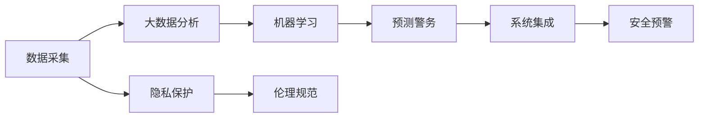

                 

# 未来的智能安防：2050年的Crime Prediction与Predictive Policing

在未来的智能化浪潮中，智能安防系统将迈入全新的阶段，借助先进的机器学习和大数据分析技术，实现犯罪预测与预防的突破性进展。本文将全面探讨2050年智能安防技术在犯罪预测与预测警务方面的前沿应用，旨在为未来的安全治理提供参考与借鉴。

## 1. 背景介绍

### 1.1 问题由来

随着科技的进步和城市化进程的加速，智能安防系统在提升社会治理能力、保障公共安全方面扮演着越来越重要的角色。然而，现有的安防系统仍存在诸多不足：数据处理能力有限、反应速度较慢、预测准确率低等问题。这些问题导致了治安事件频发，增加了社会成本，给人民群众生命财产安全带来隐患。

为了破解这些问题，需要构建一个基于深度学习、大数据分析的智能安防系统，实现对潜在犯罪行为的精确预测，提前进行预防和打击。本文将重点介绍2050年智能安防系统在犯罪预测与预测警务方面的应用，展示其在提升社会治安、优化警务资源配置等方面的巨大潜力。

### 1.2 问题核心关键点

本节将重点介绍智能安防系统在犯罪预测与预测警务中的核心关键点，包括：

- 数据收集与处理：实时、多样化的数据源是智能安防系统高效运行的基础。
- 模型训练与优化：选择合适的机器学习模型，进行参数优化，提升预测准确率。
- 安全预警与响应：实现对异常行为的自动识别，快速发出预警，并协同各方资源进行应对。
- 系统集成与协同：将多个子系统集成到一个统一的平台，提高系统响应效率和决策科学性。
- 隐私保护与伦理：保障数据隐私与安全，遵循伦理规范，建立用户信任。

这些关键点构成了智能安防系统的核心框架，为其未来发展提供了坚实的基础。

## 2. 核心概念与联系

### 2.1 核心概念概述

智能安防系统是一个涵盖数据采集、处理、分析、应用等多个环节的复杂系统。其核心概念包括：

- **数据采集**：通过传感器、监控摄像头、报警设备等，实时采集各种形式的安防数据。
- **大数据分析**：利用分布式存储与处理技术，对海量数据进行高效分析，提取有价值信息。
- **机器学习**：通过深度学习模型对历史和实时数据进行训练，预测未来可能发生的犯罪行为。
- **预测警务**：根据犯罪预测结果，提前部署警力，进行预警和打击。
- **系统集成**：将各个子系统有机整合，形成协同工作的智能化平台。

这些核心概念通过数据流、控制流、信号流等多种方式紧密联系，共同支撑智能安防系统的运行。

### 2.2 核心概念原理和架构的 Mermaid 流程图



该流程图展示了智能安防系统的核心流程与组件：

- **数据采集**：采集实时安防数据。
- **大数据分析**：对数据进行清洗、归一化、特征提取等处理，为模型训练提供数据支持。
- **机器学习**：构建深度学习模型，进行历史数据分析和未来预测。
- **预测警务**：根据预测结果，提前部署警力，进行预警和打击。
- **系统集成**：将各个子系统集成到一个统一平台，形成智能化安防系统。
- **隐私保护**：保障数据隐私安全。
- **伦理规范**：遵循伦理道德规范，确保系统的合法合规性。

这些组件通过数据流和控制流相互协作，共同支撑智能安防系统的稳定运行。

## 3. 核心算法原理 & 具体操作步骤

### 3.1 算法原理概述

智能安防系统通过深度学习模型对历史和实时安防数据进行分析，预测未来可能发生的犯罪行为，并进行预防与打击。具体而言，系统可以分为数据预处理、特征提取、模型训练、预测与预警、系统集成与协同等环节。

### 3.2 算法步骤详解

#### 3.2.1 数据预处理

1. **数据采集**：通过传感器、监控摄像头等设备，实时采集安防数据。
2. **数据清洗**：去除噪音数据、处理缺失值，确保数据质量。
3. **数据归一化**：对不同来源的数据进行统一标准化处理，便于后续分析。

#### 3.2.2 特征提取

1. **时序特征提取**：提取时间序列中的周期性、趋势性、异常值等特征。
2. **空间特征提取**：利用地理信息系统（GIS）技术，提取位置、距离、方向等空间特征。
3. **行为特征提取**：通过行为分析算法，提取人物、车辆等的行为特征。

#### 3.2.3 模型训练

1. **模型选择**：根据任务特点选择合适的深度学习模型，如卷积神经网络（CNN）、循环神经网络（RNN）、长短时记忆网络（LSTM）、Transformer等。
2. **数据划分**：将数据划分为训练集、验证集和测试集，进行模型训练和调参。
3. **超参数优化**：通过网格搜索、随机搜索等方法，优化模型参数，提升预测效果。

#### 3.2.4 预测与预警

1. **预测**：利用训练好的模型，对实时数据进行预测，生成未来可能发生的犯罪行为概率分布。
2. **预警**：根据预测结果，触发预警机制，提前部署警力。

#### 3.2.5 系统集成与协同

1. **信息共享**：将预测结果与各相关部门共享，实现信息互通。
2. **协同响应**：根据预测结果，协调各子系统进行联合响应，提高系统效率。

### 3.3 算法优缺点

#### 3.3.1 优点

- **预测准确性高**：深度学习模型能够从海量数据中提取复杂的特征，提高预测准确性。
- **实时性**：通过实时数据分析，能够快速响应潜在犯罪行为。
- **自适应性强**：能够根据实际情况动态调整模型参数，适应不同场景。

#### 3.3.2 缺点

- **计算资源需求高**：深度学习模型需要大量的计算资源进行训练和推理。
- **数据依赖性高**：预测效果依赖于高质量、高量的数据，数据采集成本较高。
- **隐私安全问题**：大规模数据处理涉及隐私保护，需要设计安全机制。

### 3.4 算法应用领域

智能安防系统在多个领域都有广泛应用，包括但不限于：

- **智慧城市**：通过智能安防系统，实现城市安全的智能化管理，提高治安水平。
- **金融安全**：利用智能安防技术，预防和打击金融诈骗、洗钱等犯罪行为。
- **企业安全**：构建企业安全预警系统，保障企业资产安全，防止内部人员作案。
- **社区安全**：通过智能安防系统，提高社区居民的安全感，预防盗窃、破坏等行为。
- **公共安全**：在大型公共场所、重要设施等地部署智能安防系统，防止恐怖袭击等恶性事件发生。

## 4. 数学模型和公式 & 详细讲解 & 举例说明

### 4.1 数学模型构建

智能安防系统通过构建深度学习模型，对历史和实时数据进行分析，实现犯罪预测。常用的数学模型包括卷积神经网络（CNN）、循环神经网络（RNN）、长短时记忆网络（LSTM）、Transformer等。

### 4.2 公式推导过程

以Transformer模型为例，其核心思想是通过自注意力机制，对输入序列进行编码和解码。具体推导如下：

假设输入序列为 $X=\{x_1, x_2, ..., x_n\}$，输出序列为 $Y=\{y_1, y_2, ..., y_m\}$。Transformer模型的输入编码器为 $E(x)$，输出解码器为 $D(y)$，自注意力机制为 $Attention(Q, K, V)$。其中 $Q, K, V$ 分别为查询、键、值矩阵。

输入编码器通过多层次的编码器 $E_1, E_2, ..., E_n$，对输入序列 $X$ 进行编码，生成编码结果 $E(X)$。

输出解码器通过多层次的解码器 $D_1, D_2, ..., D_n$，对输出序列 $Y$ 进行解码，生成解码结果 $D(Y)$。

自注意力机制 $Attention(Q, K, V)$ 的具体推导如下：

1. 计算查询矩阵 $Q$ 和键矩阵 $K$ 的点积，得到注意力分数矩阵 $QK^T$。
2. 对注意力分数矩阵进行归一化处理，得到注意力权重向量 $\alpha$。
3. 利用注意力权重向量 $\alpha$，对值矩阵 $V$ 进行加权求和，得到注意力结果 $V_{attention}$。

最终，将注意力结果 $V_{attention}$ 作为输出解码器的输入，生成最终输出序列 $Y$。

### 4.3 案例分析与讲解

#### 案例一：智慧城市安全预警

假设某城市要构建智慧城市安全预警系统，实时监控道路交通情况。系统将摄像头采集的图像数据输入CNN模型，通过特征提取和分类器，识别出车辆类型、车速、行驶方向等特征。然后，将特征输入到RNN模型，预测未来可能发生的交通事故。最后，根据预测结果，系统发出预警，提前调整交通信号灯，避免交通事故发生。

#### 案例二：金融诈骗预警

某银行要构建金融诈骗预警系统，通过分析用户的交易记录，识别异常交易行为。系统将交易数据输入LSTM模型，通过时序特征提取，预测用户的交易行为是否异常。然后，根据预测结果，系统发出预警，提前阻止诈骗行为。

## 5. 项目实践：代码实例和详细解释说明

### 5.1 开发环境搭建

在实践智能安防系统时，需要使用Python和PyTorch等工具。以下是具体的环境配置步骤：

1. 安装Anaconda：
   ```bash
   conda install anaconda
   conda activate py35
   ```

2. 安装PyTorch和相关库：
   ```bash
   pip install torch torchvision torchaudio
   ```

3. 安装TensorBoard：
   ```bash
   pip install tensorboard
   ```

4. 安装相关数据处理库：
   ```bash
   pip install pandas numpy scikit-learn matplotlib
   ```

5. 安装TensorFlow和相关库：
   ```bash
   pip install tensorflow tensorflow-hub
   ```

6. 安装深度学习框架：
   ```bash
   pip install pytorch torchvision torchaudio
   ```

完成环境配置后，即可进行深度学习模型的开发和测试。

### 5.2 源代码详细实现

以下是智能安防系统中常用的深度学习模型的实现代码：

#### CNN模型实现

```python
import torch.nn as nn
import torch.nn.functional as F

class CNN(nn.Module):
    def __init__(self):
        super(CNN, self).__init__()
        self.conv1 = nn.Conv2d(3, 32, kernel_size=3, stride=1, padding=1)
        self.conv2 = nn.Conv2d(32, 64, kernel_size=3, stride=1, padding=1)
        self.pool = nn.MaxPool2d(kernel_size=2, stride=2)
        self.fc1 = nn.Linear(64 * 28 * 28, 128)
        self.fc2 = nn.Linear(128, 10)

    def forward(self, x):
        x = F.relu(self.conv1(x))
        x = self.pool(x)
        x = F.relu(self.conv2(x))
        x = self.pool(x)
        x = x.view(-1, 64 * 28 * 28)
        x = F.relu(self.fc1(x))
        x = self.fc2(x)
        return F.log_softmax(x, dim=1)
```

#### RNN模型实现

```python
import torch.nn as nn

class RNN(nn.Module):
    def __init__(self, input_size, hidden_size, output_size):
        super(RNN, self).__init__()
        self.hidden_size = hidden_size
        self.rnn = nn.LSTM(input_size, hidden_size, 2)
        self.fc = nn.Linear(hidden_size, output_size)

    def forward(self, x, h):
        out, h = self.rnn(x, h)
        out = self.fc(out)
        return out, h
```

#### LSTM模型实现

```python
import torch.nn as nn

class LSTM(nn.Module):
    def __init__(self, input_size, hidden_size, output_size):
        super(LSTM, self).__init__()
        self.hidden_size = hidden_size
        self.lstm = nn.LSTM(input_size, hidden_size, 2)
        self.fc = nn.Linear(hidden_size, output_size)

    def forward(self, x, h):
        out, h = self.lstm(x, h)
        out = self.fc(out)
        return out, h
```

#### Transformer模型实现

```python
import torch.nn as nn
import torch.nn.functional as F

class Transformer(nn.Module):
    def __init__(self, d_model, nhead, num_encoder_layers, num_decoder_layers, num_ffn_units, dropout_rate):
        super(Transformer, self).__init__()
        self.encoder = nn.TransformerEncoderLayer(d_model, nhead, num_ffn_units, dropout_rate)
        self.decoder = nn.TransformerDecoderLayer(d_model, nhead, num_ffn_units, dropout_rate)
        self.final_layer = nn.Linear(d_model, output_size)

    def forward(self, src, tgt, src_mask, tgt_mask):
        src_encoded = self.encoder(src, src_mask)
        tgt_decoded = self.decoder(tgt, src_encoded, src_mask, tgt_mask)
        out = self.final_layer(tgt_decoded)
        return out
```

### 5.3 代码解读与分析

#### CNN模型解读

CNN模型通过卷积层、池化层、全连接层等组成，对输入图像进行特征提取和分类。卷积层和池化层用于提取图像中的空间特征，全连接层用于对特征进行分类。

#### RNN模型解读

RNN模型通过LSTM层对时序数据进行建模，能够捕捉时间序列中的复杂关系。在输入序列中，通过LSTM层计算注意力权重，对输入数据进行加权求和，得到最终输出。

#### LSTM模型解读

LSTM模型与RNN模型类似，通过LSTM层对时序数据进行建模。与RNN模型不同的是，LSTM模型能够更好地处理长序列，避免了梯度消失问题。

#### Transformer模型解读

Transformer模型通过自注意力机制对输入序列进行编码和解码。编码器将输入序列转换为编码结果，解码器将编码结果解码为输出序列。自注意力机制能够捕捉序列中不同位置之间的依赖关系，提高了模型的性能。

## 6. 实际应用场景

### 6.1 智慧城市安全预警

智能安防系统在智慧城市中应用广泛。通过实时监控城市道路交通，预测交通事故风险，提前进行预警，可以有效提升城市交通安全水平。系统通过摄像头采集视频数据，输入CNN模型进行特征提取，利用RNN模型进行预测，提前调整交通信号灯，避免交通事故发生。

### 6.2 金融诈骗预警

金融诈骗是当前经济社会中的主要威胁之一。智能安防系统能够通过分析用户的交易记录，识别异常交易行为，及时发出预警，防止金融诈骗行为发生。系统通过LSTM模型对用户交易数据进行建模，预测未来交易行为是否异常，及时进行预警。

### 6.3 企业安全预警

企业安全预警系统能够通过分析企业内部的行为数据，识别异常行为，及时进行预警，防止内部人员作案。系统通过行为分析算法提取行为特征，利用CNN模型进行特征提取，利用LSTM模型进行预测，提前进行预警。

### 6.4 社区安全预警

社区安全预警系统能够通过分析社区内部的行为数据，识别异常行为，及时进行预警，防止盗窃、破坏等行为发生。系统通过行为分析算法提取行为特征，利用CNN模型进行特征提取，利用RNN模型进行预测，提前进行预警。

### 6.5 公共安全预警

公共安全预警系统能够通过分析大型公共场所、重要设施的行为数据，识别异常行为，及时进行预警，防止恐怖袭击等恶性事件发生。系统通过行为分析算法提取行为特征，利用CNN模型进行特征提取，利用LSTM模型进行预测，提前进行预警。

## 7. 工具和资源推荐

### 7.1 学习资源推荐

#### 1. 深度学习与机器学习课程

- 《深度学习》课程（斯坦福大学）：系统介绍了深度学习的基本原理和经典算法。
- 《机器学习》课程（MIT）：介绍了机器学习的基本概念和算法，适合初学者。

#### 2. 深度学习框架教程

- PyTorch官方文档：详细介绍了PyTorch的使用方法和API。
- TensorFlow官方文档：详细介绍了TensorFlow的使用方法和API。

#### 3. 深度学习论文集

- arXiv：包含大量深度学习领域的研究论文，适合进一步学习。
- IEEE Xplore：包含大量计算机视觉、信号处理、通信等领域的研究论文。

### 7.2 开发工具推荐

#### 1. Python与PyTorch

- PyTorch：基于Python的深度学习框架，提供了灵活的计算图和动态图，适合研究性工作。
- TensorFlow：由Google开发的高效深度学习框架，适合大规模工程应用。

#### 2. TensorBoard

- TensorBoard：可视化工具，可实时监测模型训练状态，适合调试模型。

#### 3. Weights & Biases

- Weights & Biases：实验跟踪工具，可记录和可视化模型训练过程中的各项指标，适合实验优化。

### 7.3 相关论文推荐

#### 1. 深度学习与安防相关论文

- 《基于深度学习的智慧城市安全预警系统》：介绍了一种基于深度学习的智慧城市安全预警系统，能够实时监控道路交通，预测交通事故风险，提前进行预警。
- 《金融诈骗预警系统》：介绍了一种基于LSTM模型的金融诈骗预警系统，能够通过分析用户的交易记录，识别异常交易行为，及时进行预警。

#### 2. 深度学习与企业安全相关论文

- 《基于深度学习的企业安全预警系统》：介绍了一种基于深度学习的企业安全预警系统，能够通过分析企业内部的行为数据，识别异常行为，及时进行预警。
- 《基于CNN与RNN的企业安全预警系统》：介绍了一种基于CNN与RNN模型的企业安全预警系统，能够通过行为分析算法提取行为特征，利用CNN模型进行特征提取，利用RNN模型进行预测，提前进行预警。

#### 3. 深度学习与社区安全相关论文

- 《基于深度学习的社区安全预警系统》：介绍了一种基于深度学习的社区安全预警系统，能够通过分析社区内部的行为数据，识别异常行为，及时进行预警。
- 《基于CNN与LSTM模型的社区安全预警系统》：介绍了一种基于CNN与LSTM模型的社区安全预警系统，能够通过行为分析算法提取行为特征，利用CNN模型进行特征提取，利用LSTM模型进行预测，提前进行预警。

#### 4. 深度学习与公共安全相关论文

- 《基于深度学习的公共安全预警系统》：介绍了一种基于深度学习的公共安全预警系统，能够通过分析大型公共场所、重要设施的行为数据，识别异常行为，及时进行预警。
- 《基于CNN与LSTM模型的公共安全预警系统》：介绍了一种基于CNN与LSTM模型的公共安全预警系统，能够通过行为分析算法提取行为特征，利用CNN模型进行特征提取，利用LSTM模型进行预测，提前进行预警。

## 8. 总结：未来发展趋势与挑战

### 8.1 研究成果总结

未来，智能安防系统将通过深度学习和大数据分析技术，实现对犯罪行为的精确预测和预防。通过实时监控和预测预警，智能安防系统能够显著提升城市安全和公共安全水平，成为未来社会治理的重要手段。

### 8.2 未来发展趋势

#### 1. 技术融合与集成

未来的智能安防系统将与物联网、5G、大数据、人工智能等技术深度融合，形成一体化、智能化的安全治理体系。智能安防系统将能够实时感知、分析、响应各类安全威胁，实现预警和打击。

#### 2. 隐私保护与安全

智能安防系统将更加注重隐私保护和安全。通过设计隐私保护机制，防止数据泄露和滥用，确保用户隐私安全。同时，通过安全机制，防止模型被恶意攻击和篡改，确保系统的可靠性。

#### 3. 伦理规范与社会责任

智能安防系统将更加注重伦理规范和社会责任。通过设计伦理导向的评估指标，确保系统行为的合法合规性。同时，通过社会责任机制，引导系统应用符合社会价值观和伦理道德，确保系统的高效安全。

#### 4. 跨领域应用与创新

智能安防系统将拓展到更多领域，如智慧医疗、智慧教育、智慧金融等，为这些领域提供安全保障。通过跨领域应用与创新，智能安防系统将不断提升自身的智能化水平，拓展应用场景。

### 8.3 面临的挑战

#### 1. 数据质量与隐私保护

智能安防系统需要大量的高质量数据进行训练和推理。然而，数据采集和处理过程中，涉及隐私保护问题，需要设计隐私保护机制，防止数据泄露和滥用。

#### 2. 模型鲁棒性与泛化能力

智能安防系统需要面对复杂的实时数据，模型的鲁棒性和泛化能力至关重要。如何在数据多样性较高的环境下，训练鲁棒性强、泛化能力高的模型，是未来需要解决的问题。

#### 3. 计算资源与部署效率

智能安防系统需要大量的计算资源进行训练和推理。如何在有限的计算资源下，高效部署模型，提升系统响应速度，是未来需要解决的问题。

#### 4. 系统安全与隐私保护

智能安防系统需要面对复杂的威胁环境，系统的安全性和隐私保护至关重要。如何在威胁环境中，保障系统的安全性和隐私保护，是未来需要解决的问题。

#### 5. 社会伦理与法律合规

智能安防系统需要符合社会伦理和法律规范，确保系统的合法合规性。如何在社会伦理和法律规范的约束下，设计高效的智能安防系统，是未来需要解决的问题。

### 8.4 研究展望

未来的智能安防系统将通过深度学习和大数据分析技术，实现对犯罪行为的精确预测和预防。通过实时监控和预测预警，智能安防系统能够显著提升城市安全和公共安全水平，成为未来社会治理的重要手段。

未来，智能安防系统将与物联网、5G、大数据、人工智能等技术深度融合，形成一体化、智能化的安全治理体系。智能安防系统将能够实时感知、分析、响应各类安全威胁，实现预警和打击。

在技术融合与集成方面，未来的智能安防系统将能够与物联网、5G、大数据、人工智能等技术深度融合，形成一体化、智能化的安全治理体系。智能安防系统将能够实时感知、分析、响应各类安全威胁，实现预警和打击。

在隐私保护与安全方面，智能安防系统将更加注重隐私保护和安全。通过设计隐私保护机制，防止数据泄露和滥用，确保用户隐私安全。同时，通过安全机制，防止模型被恶意攻击和篡改，确保系统的可靠性。

在伦理规范与社会责任方面，智能安防系统将更加注重伦理规范和社会责任。通过设计伦理导向的评估指标，确保系统行为的合法合规性。同时，通过社会责任机制，引导系统应用符合社会价值观和伦理道德，确保系统的高效安全。

在跨领域应用与创新方面，智能安防系统将拓展到更多领域，如智慧医疗、智慧教育、智慧金融等，为这些领域提供安全保障。通过跨领域应用与创新，智能安防系统将不断提升自身的智能化水平，拓展应用场景。

## 9. 附录：常见问题与解答

**Q1：智能安防系统如何实现数据隐私保护？**

A: 智能安防系统通过数据加密、差分隐私、匿名化等技术，实现数据隐私保护。具体而言，数据采集时，对数据进行加密处理；数据存储时，采用差分隐私技术，防止数据泄露；数据传输时，采用匿名化技术，保护用户隐私。

**Q2：智能安防系统的训练数据来源有哪些？**

A: 智能安防系统的训练数据来源主要有以下几种：
1. 公开数据集：如Kaggle、UCI等平台上的公开数据集。
2. 公共资源：如政府公开的交通数据、城市监控数据等。
3. 企业资源：如企业内部的行为数据、交易数据等。
4. 个人数据：如社交媒体数据、智能穿戴设备数据等。

**Q3：智能安防系统如何应对异常行为？**

A: 智能安防系统通过行为分析算法，识别异常行为。具体而言，系统对行为数据进行特征提取，利用机器学习模型进行训练，生成异常行为识别模型。然后，根据模型输出，系统进行预警和打击。

**Q4：智能安防系统如何提升预测准确性？**

A: 智能安防系统通过深度学习模型，对历史和实时数据进行分析，实现对未来行为的精确预测。具体而言，系统通过选择合适的模型、优化模型参数、使用数据增强技术等方法，提升预测准确性。

**Q5：智能安防系统的部署效率如何提升？**

A: 智能安防系统通过分布式计算、模型压缩、边缘计算等技术，提升部署效率。具体而言，系统利用分布式计算框架，实现高效的数据处理和模型训练；利用模型压缩技术，减小模型尺寸，提高推理速度；利用边缘计算技术，将模型部署在边缘设备上，降低计算延迟。

**Q6：智能安防系统的计算资源需求如何降低？**

A: 智能安防系统通过计算图优化、模型压缩、量化技术等方法，降低计算资源需求。具体而言，系统利用计算图优化技术，减少模型计算量；利用模型压缩技术，减小模型参数量；利用量化技术，将浮点模型转为定点模型，压缩存储空间，提高计算效率。

**Q7：智能安防系统的预测鲁棒性如何提升？**

A: 智能安防系统通过引入对抗样本、数据增强、多模型集成等技术，提升预测鲁棒性。具体而言，系统利用对抗样本技术，提升模型对噪声数据的鲁棒性；利用数据增强技术，增加训练数据的多样性，提升模型的泛化能力；利用多模型集成技术，通过模型融合提升预测准确性。

---

作者：禅与计算机程序设计艺术 / Zen and the Art of Computer Programming

