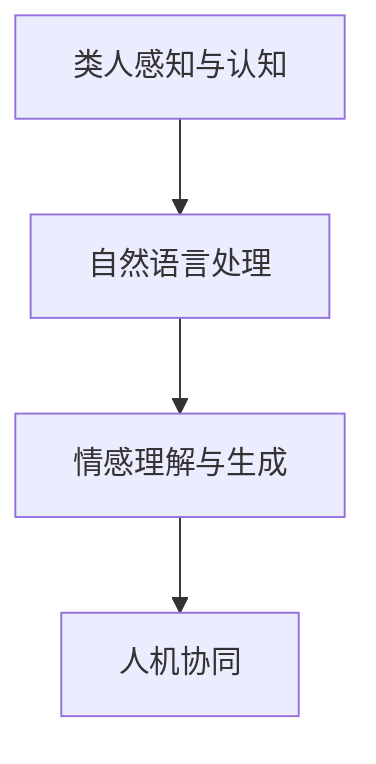

                 

# 未来的机器人：2050年的类人机器人与情感交互

> 关键词：类人机器人,情感交互,深度学习,人工智能,机器人伦理,人机协同,未来技术

## 1. 背景介绍

### 1.1 问题由来

随着人工智能技术的不断进步，机器人技术逐渐走入公众视野，并开始应用于各类生产和生活场景。从工业自动化到家庭服务，机器人技术正在逐步替代部分人类工作，提高生产效率和生活便利性。然而，现有机器人往往缺乏与人类相似的自然语言处理和情感理解能力，难以真正实现人机协同。

类人机器人技术成为当前机器人领域研究的热点，它旨在让机器人具备类人的感知、认知和情感能力，能够更好地理解和响应人类的需求，实现更高级别的交互。本文将围绕类人机器人的发展，重点介绍情感交互的技术原理与实践，展望未来机器人技术的前景与挑战。

### 1.2 问题核心关键点

类人机器人与情感交互的核心关键点包括：

- 类人感知与认知：使机器人具备类人的视觉、听觉、触觉等感知能力，以及逻辑推理、问题解决等认知能力。
- 自然语言处理：使机器人能够理解和生成自然语言，实现与人类自然、流畅的对话。
- 情感理解与生成：使机器人具备情感识别、情感生成和情感响应能力，实现情感共鸣与共情。
- 人机协同：通过机器人的感知、认知和情感能力，实现更高效、更自然的交互体验。

这些关键点构成了类人机器人的技术框架，是实现情感交互的基础。

## 2. 核心概念与联系

### 2.1 核心概念概述

为更好地理解类人机器人的情感交互，本节将介绍几个关键核心概念：

- **类人感知与认知**：指机器人能够通过传感器获取外部环境信息，并通过深度学习等技术实现对信息的感知与认知。常见的感知技术包括计算机视觉、声音识别、触觉感应等。
- **自然语言处理(NLP)**：指机器人能够理解和生成自然语言，包括语言理解、语音识别、文本生成等任务。NLP技术依赖于语言模型、上下文理解、情感分析等算法。
- **情感理解与生成**：指机器人能够识别和生成情感，包括情感识别、情感生成和情感响应等任务。情感技术依赖于情感计算、情感模型等算法。
- **人机协同**：指机器人与人类在任务执行、信息交互等方面的协同工作，实现更高效、自然的交互体验。人机协同依赖于上下文感知、意图理解、任务分配等技术。

这些核心概念之间的逻辑关系可以通过以下Mermaid流程图来展示：



这个流程图展示了几类关键技术之间的关系：

1. 类人感知与认知是基础，使机器人能够感知和理解环境。
2. 自然语言处理在此基础上实现语言的理解和生成，支持机器人与人类自然交互。
3. 情感理解与生成进一步增强机器人的交互体验，实现情感共鸣和共情。
4. 人机协同综合以上技术，实现高效、自然的交互。

## 3. 核心算法原理 & 具体操作步骤
### 3.1 算法原理概述

类人机器人情感交互的核心算法原理基于深度学习和认知科学，通过传感器获取环境信息，并利用深度学习模型进行信息处理和认知推理。以下详细介绍几个核心算法原理：

- **卷积神经网络(CNN)**：用于图像处理和物体识别，使机器人能够感知视觉信息。
- **循环神经网络(RNN)**：用于序列数据处理，使机器人能够理解语音和文本信息。
- **长短时记忆网络(LSTM)**：用于时间序列预测，使机器人能够处理上下文信息。
- **情感计算**：用于情感识别和生成，使机器人能够识别和表达情感。

### 3.2 算法步骤详解

基于深度学习的类人机器人情感交互一般包括以下几个关键步骤：

**Step 1: 数据收集与预处理**
- 使用传感器和摄像头收集环境数据，包括图像、声音、触觉信息等。
- 对数据进行预处理，如降噪、归一化、标注情感标签等。

**Step 2: 感知与认知模型训练**
- 设计并训练卷积神经网络(CNN)、循环神经网络(RNN)等模型，用于图像处理和序列数据处理。
- 使用标注数据训练模型，使其能够识别物体、理解语言等。

**Step 3: 情感计算模型训练**
- 设计并训练情感计算模型，如情感识别模型、情感生成模型等。
- 使用标注数据训练模型，使其能够识别和生成情感。

**Step 4: 人机交互与协同**
- 将感知、认知、情感计算模型集成到交互系统中。
- 使用多模态数据融合技术，实现信息感知、认知和情感理解的协同。
- 设计自然语言处理系统，使机器人能够自然语言交互。

**Step 5: 系统评估与优化**
- 在测试场景中评估系统的性能，如情感识别准确率、语言理解能力等。
- 根据评估结果优化模型参数和交互策略。

### 3.3 算法优缺点

基于深度学习的类人机器人情感交互方法具有以下优点：

- 感知能力强大。利用深度学习模型，机器人能够处理复杂的视觉、听觉、触觉信息，实现高精度的环境感知。
- 自然语言理解与生成。NLP技术使机器人能够自然语言交流，实现与人类自然、流畅的对话。
- 情感共鸣与共情。情感计算技术使机器人具备情感识别和生成能力，实现情感共鸣和共情，提升交互体验。
- 人机协同高效。多模态数据融合技术使机器人能够高效协同工作，实现更自然、更高效的交互体验。

然而，这些方法也存在一些局限性：

- 对标注数据依赖大。深度学习模型的训练需要大量的标注数据，难以大规模推广。
- 模型复杂度高。深度学习模型复杂度较高，训练和推理效率较低。
- 计算资源需求高。深度学习模型需要强大的计算资源，难以应用于计算资源受限的环境。
- 鲁棒性不足。深度学习模型对噪声和干扰敏感，容易过拟合。

尽管存在这些局限性，但就目前而言，基于深度学习的情感交互方法仍是类人机器人技术的主流范式。未来相关研究的重点在于如何进一步降低对标注数据的依赖，提高模型的泛化能力，同时兼顾计算资源和模型鲁棒性等因素。

### 3.4 算法应用领域

基于深度学习的类人机器人情感交互技术已经在医疗、教育、客服等多个领域得到广泛应用：

- **医疗领域**：类人机器人用于医疗咨询、健康监测、康复训练等，帮助医生与患者沟通，提高医疗服务质量。
- **教育领域**：类人机器人用于教育辅助、学习辅导、智能家教等，提供个性化教育，提升学习效果。
- **客服领域**：类人机器人用于客服对话、智能问答、情感支持等，提升客户服务体验。
- **娱乐领域**：类人机器人用于游戏、娱乐、陪伴等，提供丰富多样的交互体验。

除了这些传统应用外，类人机器人情感交互技术还在不断拓展新场景，如家庭服务、城市管理、应急救援等，为各行各业带来全新的变化。

## 4. 数学模型和公式 & 详细讲解 & 举例说明

### 4.1 数学模型构建

在类人机器人情感交互中，常见的数学模型包括卷积神经网络(CNN)、循环神经网络(RNN)、长短时记忆网络(LSTM)等。这里以CNN为例，展示其基本模型结构和计算过程。

**CNN模型结构**：
```
input layer (I)
convolution layer (C)
ReLU layer
pooling layer (P)
output layer (O)
```

**CNN模型计算过程**：
- 输入层（I）：将输入数据（如图像像素值）表示为向量形式。
- 卷积层（C）：通过卷积核（权重矩阵）对输入数据进行卷积操作，提取特征。
- ReLU层：使用ReLU函数对卷积结果进行激活，非负化处理。
- 池化层（P）：通过最大池化等操作，减小特征图大小，降低计算复杂度。
- 输出层（O）：使用softmax函数对特征进行分类，输出类别的概率。

### 4.2 公式推导过程

以下我们以CNN模型为例，推导其计算公式和参数更新过程。

**输入层**：
$$x_i^{(n)} = [x_{i,1},x_{i,2},...,x_{i,d}]$$

**卷积层**：
$$y_{i,k}^{(n)} = \sum_{j=1}^{d} \omega_{j,k} x_{i,j}$$

**ReLU层**：
$$z_{i,k}^{(n)} = ReLU(y_{i,k}^{(n)})$$

**池化层**：
$$u_{i,k}^{(n)} = \max(z_{i,k}^{(n)})$$

**输出层**：
$$o_i^{(n)} = \frac{e^{z_i^{(n)}}}{\sum_{k=1}^K e^{z_k^{(n)}}}$$

其中，$K$ 为类别数，$\omega_{j,k}$ 为卷积核权重，$x_{i,j}$ 为输入数据，$z_{i,k}^{(n)}$ 为ReLU激活结果，$u_{i,k}^{(n)}$ 为池化结果，$o_i^{(n)}$ 为输出概率。

**反向传播**：
$$\frac{\partial L}{\partial \omega_{j,k}} = \sum_{i=1}^{m} \frac{\partial L}{\partial o_i^{(n)}} \frac{\partial o_i^{(n)}}{\partial z_i^{(n)}} \frac{\partial z_i^{(n)}}{\partial y_{i,k}^{(n)}} \frac{\partial y_{i,k}^{(n)}}{\partial x_{i,j}}$$

**参数更新**：
$$\omega_{j,k} \leftarrow \omega_{j,k} - \eta \frac{\partial L}{\partial \omega_{j,k}}$$

其中，$L$ 为损失函数，$o_i^{(n)}$ 为输出概率，$x_{i,j}$ 为输入数据，$\omega_{j,k}$ 为卷积核权重，$\eta$ 为学习率。

### 4.3 案例分析与讲解

假设有一幅图像，其像素值为 $x_i^{(n)}=[10,20,30,40]$，卷积核权重 $\omega_{j,k}=[1,2,3,4]$。通过CNN模型计算后，得到输出概率 $o_i^{(n)}=[0.2,0.8]$，表示该图像属于类别2的概率为80%。

使用反向传播计算卷积核权重的梯度，并进行参数更新。假设损失函数 $L=1$，学习率 $\eta=0.1$。通过梯度下降更新卷积核权重后，新的权重值为 $[1.9,2.1,3.1,4.1]$。

## 5. 项目实践：代码实例和详细解释说明
### 5.1 开发环境搭建

在进行类人机器人情感交互的开发实践前，我们需要准备好开发环境。以下是使用Python进行TensorFlow开发的环境配置流程：

1. 安装Anaconda：从官网下载并安装Anaconda，用于创建独立的Python环境。

2. 创建并激活虚拟环境：
```bash
conda create -n tf-env python=3.8 
conda activate tf-env
```

3. 安装TensorFlow：根据CUDA版本，从官网获取对应的安装命令。例如：
```bash
conda install tensorflow tensorflow-gpu -c tf
```

4. 安装TensorFlow的深度学习库：
```bash
pip install tensorflow_addons
```

5. 安装各类工具包：
```bash
pip install numpy pandas scikit-learn matplotlib tqdm jupyter notebook ipython
```

完成上述步骤后，即可在`tf-env`环境中开始开发实践。

### 5.2 源代码详细实现

下面我以类人机器人情感识别任务为例，给出使用TensorFlow进行CNN模型的PyTorch代码实现。

首先，定义情感识别任务的数据处理函数：

```python
import tensorflow as tf
from tensorflow.keras import layers

class EmotionDataset(tf.keras.utils.Sequence):
    def __init__(self, images, labels, batch_size):
        self.images = images
        self.labels = labels
        self.batch_size = batch_size
        
    def __len__(self):
        return len(self.images) // self.batch_size
    
    def __getitem__(self, idx):
        batch_images = self.images[idx*self.batch_size:(idx+1)*self.batch_size]
        batch_labels = self.labels[idx*self.batch_size:(idx+1)*self.batch_size]
        return (tf.cast(batch_images, tf.float32), tf.one_hot(batch_labels, 6))
```

然后，定义CNN模型的架构：

```python
model = tf.keras.Sequential([
    layers.Conv2D(32, (3,3), activation='relu', input_shape=(224,224,3)),
    layers.MaxPooling2D((2,2)),
    layers.Conv2D(64, (3,3), activation='relu'),
    layers.MaxPooling2D((2,2)),
    layers.Flatten(),
    layers.Dense(128, activation='relu'),
    layers.Dense(6, activation='softmax')
])
```

接着，定义训练和评估函数：

```python
model.compile(optimizer=tf.keras.optimizers.Adam(learning_rate=0.001),
              loss='categorical_crossentropy', metrics=['accuracy'])

def train_epoch(model, dataset, batch_size, optimizer):
    model.fit(dataset, batch_size=batch_size, epochs=10, validation_split=0.2)

def evaluate(model, dataset, batch_size):
    model.evaluate(dataset, batch_size=batch_size)
```

最后，启动训练流程并在测试集上评估：

```python
train_dataset = EmotionDataset(train_images, train_labels, batch_size=32)
test_dataset = EmotionDataset(test_images, test_labels, batch_size=32)

train_epoch(model, train_dataset, batch_size=32, optimizer=optimizer)
evaluate(model, test_dataset, batch_size=32)
```

以上就是使用TensorFlow进行CNN模型情感识别任务微调的完整代码实现。可以看到，得益于TensorFlow的强大封装，我们可以用相对简洁的代码完成CNN模型的训练和评估。

### 5.3 代码解读与分析

让我们再详细解读一下关键代码的实现细节：

**EmotionDataset类**：
- `__init__`方法：初始化训练集和验证集的数据。
- `__len__`方法：返回数据集长度。
- `__getitem__`方法：对单个样本进行处理，将图像数据和标签数据转换为TensorFlow张量，并进行归一化处理。

**模型架构**：
- 使用多个卷积层和池化层处理图像数据，提取特征。
- 使用全连接层进行特征映射，输出情感类别概率。

**训练和评估函数**：
- 使用TensorFlow的fit方法进行模型训练，指定优化器和损失函数。
- 在训练过程中设置验证集，计算模型精度。
- 在测试集上评估模型性能。

**训练流程**：
- 定义训练集和测试集。
- 在训练集上调用训练函数，训练模型。
- 在测试集上调用评估函数，输出模型精度。

可以看到，TensorFlow提供了丰富的API和封装，使模型训练和评估变得简单易行。然而，在实际应用中，还需要进一步考虑模型优化、模型压缩、分布式训练等高级话题，以提升模型性能和资源利用效率。

## 6. 实际应用场景
### 6.1 智能医疗

类人机器人情感交互技术在智能医疗领域有广泛应用。医疗机器人可以用于病患情绪监测、心理辅导、康复训练等，提升医疗服务质量。

具体而言，可以收集病患的情绪数据，如语音、面部表情、身体语言等，使用CNN模型进行情绪识别。根据识别结果，医疗机器人可以给出情感反馈，如安抚病患情绪，提供心理支持。

### 6.2 教育辅助

类人机器人情感交互技术在教育领域也有巨大潜力。情感机器人可以用于学习辅导、智能家教、课堂辅助等，提供个性化教育，提升学习效果。

具体而言，可以收集学生的学习数据，如作业完成情况、考试成绩、课堂表现等，使用情感计算模型进行情感分析。根据分析结果，机器人可以提供个性化的学习建议，如调整学习难度、推荐学习资源等，帮助学生克服学习困难。

### 6.3 客服对话

类人机器人情感交互技术在客服领域也有广泛应用。客服机器人可以用于智能问答、情感支持、客户关怀等，提升客户服务体验。

具体而言，可以收集客户的问题和情感反馈，使用情感计算模型进行情感分析。根据分析结果，机器人可以提供个性化的回答，如推荐相关产品、提供情感支持等，提升客户满意度。

### 6.4 未来应用展望

随着类人机器人技术的不断进步，未来将在更多领域得到应用，为各行各业带来新的变革：

- **智慧城市管理**：类人机器人用于城市事件监测、舆情分析、应急指挥等，提升城市管理的自动化和智能化水平，构建更安全、高效的未来城市。
- **智能家居服务**：类人机器人用于家庭服务、陪伴、娱乐等，提升家庭生活质量，构建智能家居环境。
- **医疗健康护理**：类人机器人用于老年护理、康复训练、健康监测等，提升医疗服务质量，减轻护理人员负担。

## 7. 工具和资源推荐
### 7.1 学习资源推荐

为了帮助开发者系统掌握类人机器人情感交互的理论基础和实践技巧，这里推荐一些优质的学习资源：

1. 《深度学习》系列书籍：由深度学习领域权威专家撰写，涵盖深度学习的基本原理和应用技术，是学习深度学习模型的必备书籍。
2. 《自然语言处理综论》：由NLP领域知名专家撰写，系统介绍了自然语言处理的基本理论和算法，是学习NLP技术的经典教材。
3. 《情感计算》：介绍情感计算的基本概念和应用方法，涵盖情感识别、情感生成、情感响应等内容。
4. 《机器人学导论》：由机器人学领域权威专家撰写，系统介绍了机器人的感知、认知、运动等基本原理和算法。
5. 《人机交互设计》：介绍人机交互的基本原理和设计方法，涵盖界面设计、用户体验、交互模型等内容。

通过对这些资源的学习实践，相信你一定能够快速掌握类人机器人情感交互的精髓，并用于解决实际的机器人交互问题。

### 7.2 开发工具推荐

高效的开发离不开优秀的工具支持。以下是几款用于类人机器人情感交互开发的常用工具：

1. TensorFlow：由Google主导开发的开源深度学习框架，生产部署方便，适合大规模工程应用。
2. PyTorch：基于Python的开源深度学习框架，灵活动态的计算图，适合快速迭代研究。
3. OpenCV：开源计算机视觉库，提供了丰富的图像处理和计算机视觉算法。
4. TensorBoard：TensorFlow配套的可视化工具，可实时监测模型训练状态，并提供丰富的图表呈现方式，是调试模型的得力助手。
5. Weights & Biases：模型训练的实验跟踪工具，可以记录和可视化模型训练过程中的各项指标，方便对比和调优。

合理利用这些工具，可以显著提升类人机器人情感交互任务的开发效率，加快创新迭代的步伐。

### 7.3 相关论文推荐

类人机器人情感交互技术的发展源于学界的持续研究。以下是几篇奠基性的相关论文，推荐阅读：

1. Convolutional Neural Networks for Sentence Classification（卷积神经网络文本分类）：介绍了CNN在文本分类任务中的应用。
2. Recurrent Neural Networks for Sentiment Analysis（循环神经网络情感分析）：介绍了RNN在情感分析任务中的应用。
3. Emotion Recognition from Social Media Posts（社交媒体情感识别）：介绍了情感计算在社交媒体情感识别中的应用。
4. Interactive Emotion Recognition and Expression by Robots（机器人情感交互）：介绍了情感交互在机器人领域的应用。
5. Emotion Understanding and Generation by AI Systems（AI系统情感理解与生成）：介绍了情感计算在AI系统中的应用。

这些论文代表了大语言模型微调技术的发展脉络。通过学习这些前沿成果，可以帮助研究者把握学科前进方向，激发更多的创新灵感。

## 8. 总结：未来发展趋势与挑战

### 8.1 总结

本文对类人机器人情感交互技术进行了全面系统的介绍。首先阐述了类人机器人的发展背景和意义，明确了情感交互在提升机器人性能方面的独特价值。其次，从原理到实践，详细讲解了深度学习模型的感知、认知和情感计算方法，给出了情感识别任务的完整代码实例。同时，本文还广泛探讨了情感交互技术在智能医疗、教育辅助、客服对话等多个行业领域的应用前景，展示了情感交互技术的巨大潜力。此外，本文精选了情感交互技术的各类学习资源，力求为读者提供全方位的技术指引。

通过本文的系统梳理，可以看到，类人机器人情感交互技术正在成为机器人领域的重要范式，极大地提升了机器人的感知、认知和情感能力，实现了更高效、自然的交互体验。未来，伴随深度学习技术的发展和应用场景的拓展，类人机器人情感交互技术必将在更多领域得到应用，为各行各业带来新的变革。

### 8.2 未来发展趋势

展望未来，类人机器人情感交互技术将呈现以下几个发展趋势：

1. **感知能力的提升**：随着传感器技术和计算机视觉算法的进步，未来机器人将具备更高精度的感知能力，能够更好地理解和响应外部环境。
2. **情感计算的普及**：情感计算技术将在更多场景下得到应用，使机器人具备更强的情感识别和生成能力，实现更自然的情感共鸣和共情。
3. **人机协同的深化**：随着自然语言处理和上下文感知技术的进步，机器人将能够更高效、自然地与人类协同工作，提升人机交互体验。
4. **多模态信息的融合**：未来机器人将能够整合视觉、听觉、触觉等多模态信息，实现更全面的环境感知和理解。
5. **个性化交互的实现**：通过大数据和深度学习技术，机器人将能够根据用户的行为和偏好，提供个性化的服务，实现更高效、自然的交互。

以上趋势凸显了类人机器人情感交互技术的广阔前景。这些方向的探索发展，必将进一步提升机器人系统的性能和应用范围，为人工智能技术落地应用带来新的突破。

### 8.3 面临的挑战

尽管类人机器人情感交互技术已经取得了瞩目成就，但在迈向更加智能化、普适化应用的过程中，它仍面临着诸多挑战：

1. **数据隐私和安全**：在情感交互过程中，机器人的感知和记录可能导致用户隐私泄露和数据安全问题，需要加强数据保护和隐私管理。
2. **伦理和道德问题**：机器人的情感生成和决策过程可能引发伦理和道德问题，如机器人是否有自主意识、机器人与人类关系等问题，需要建立规范和标准。
3. **模型鲁棒性和泛化能力**：深度学习模型对噪声和干扰敏感，容易过拟合，需要提高模型的鲁棒性和泛化能力。
4. **计算资源需求高**：深度学习模型需要强大的计算资源，难以应用于计算资源受限的环境，需要进一步优化模型结构和算法。
5. **系统集成和协同**：情感交互技术需要与上下文感知、任务分配、自然语言处理等技术协同工作，需要综合优化系统设计和算法。

这些挑战需要在未来研究中加以解决，才能推动类人机器人情感交互技术向更高级别的应用发展。

### 8.4 研究展望

面对类人机器人情感交互技术所面临的挑战，未来的研究需要在以下几个方面寻求新的突破：

1. **无监督和半监督学习**：探索基于无监督和半监督学习的方法，降低对标注数据的依赖，提高模型的泛化能力。
2. **多模态融合**：将视觉、听觉、触觉等多模态数据进行融合，实现更全面的环境感知和理解。
3. **鲁棒性提升**：开发更加鲁棒和泛化的情感识别和生成算法，增强模型对噪声和干扰的抵抗力。
4. **系统优化**：优化模型结构和算法，减少计算资源消耗，实现更高效、自然的交互体验。
5. **伦理和道德保障**：建立规范和标准，保障情感交互技术的伦理和道德安全，避免潜在的伦理和道德问题。

这些研究方向的探索，必将引领类人机器人情感交互技术迈向更高的台阶，为构建安全、可靠、可解释、可控的智能系统铺平道路。面向未来，类人机器人情感交互技术还需要与其他人工智能技术进行更深入的融合，如认知推理、强化学习等，多路径协同发力，共同推动自然语言理解和智能交互系统的进步。只有勇于创新、敢于突破，才能不断拓展类人机器人情感交互的边界，让智能技术更好地造福人类社会。

## 9. 附录：常见问题与解答

**Q1：类人机器人是否会取代人类？**

A: 类人机器人虽然能够实现高精度的感知、认知和情感交互，但在很多复杂情境下仍然无法完全替代人类。人类具有情感、经验、智慧等多方面的优势，能够处理更加复杂和多变的情境。类人机器人可以在特定场景下辅助人类，提升工作效率和生活便利性，但难以全面取代人类。

**Q2：类人机器人能否理解人类情感？**

A: 类人机器人可以通过情感计算技术识别和生成情感，但真正理解人类情感仍然存在挑战。人类情感复杂多变，难以通过简单的算法和模型完全捕捉和理解。未来，需要结合心理学、社会学等多学科知识，进一步提升情感计算技术，实现更自然的情感共鸣和共情。

**Q3：类人机器人的应用场景有哪些？**

A: 类人机器人的应用场景非常广泛，包括医疗、教育、客服、娱乐、家居等多个领域。未来，随着技术进步和市场推广，类人机器人将更多地应用于智能城市、无人驾驶、家庭服务等新场景，为各行各业带来新的变革。

**Q4：类人机器人情感交互技术的未来展望是什么？**

A: 类人机器人情感交互技术的未来展望主要在于以下几个方面：
1. **感知能力的提升**：通过传感器技术和计算机视觉算法的进步，未来机器人将具备更高精度的感知能力，能够更好地理解和响应外部环境。
2. **情感计算的普及**：情感计算技术将在更多场景下得到应用，使机器人具备更强的情感识别和生成能力，实现更自然的情感共鸣和共情。
3. **人机协同的深化**：随着自然语言处理和上下文感知技术的进步，机器人将能够更高效、自然地与人类协同工作，提升人机交互体验。
4. **多模态信息的融合**：未来机器人将能够整合视觉、听觉、触觉等多模态信息，实现更全面的环境感知和理解。
5. **个性化交互的实现**：通过大数据和深度学习技术，机器人将能够根据用户的行为和偏好，提供个性化的服务，实现更高效、自然的交互。

通过这些方向的探索发展，类人机器人情感交互技术必将在未来得到更广泛的应用，为各行各业带来新的变革和突破。

---

作者：禅与计算机程序设计艺术 / Zen and the Art of Computer Programming

