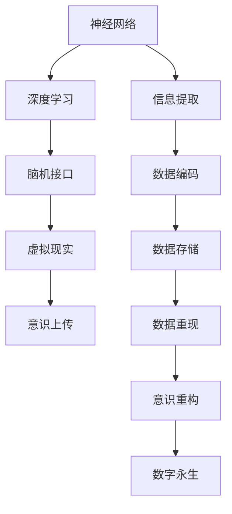

                 

# 未来的生命延续：2050年的意识上传与数字永生

> 关键词：意识上传,数字永生,虚拟现实,神经网络,脑机接口,深度学习,人工智能,生命延续,未来科技

## 1. 背景介绍

在数字化迅速发展的今天，科技已经深度融入到我们生活的方方面面。从智能家居到无人驾驶，从虚拟现实到5G通信，技术正在以一种惊人的速度改变着我们对这个世界的认知。而更激进的设想是，未来某一天，我们不仅能够复制和模仿自然界的物质形态，甚至有可能实现意识的上传和数字化，使生命得到一种新的延续。本文将探讨意识上传和数字永生的相关概念、技术原理及未来展望。

## 2. 核心概念与联系

### 2.1 核心概念概述

意识上传和数字永生是两个极具科幻色彩的概念，其核心思想是将人类的意识从物理大脑中提取出来，通过数字化技术实现长久保存与重现，即使原生物体消失，意识也能够以数字形式继续存在。这需要神经科学、计算机科学、生物科学等多学科的深度融合，涉及神经网络、深度学习、脑机接口、虚拟现实等关键技术。

### 2.2 核心概念原理和架构的 Mermaid 流程图



### 2.3 核心概念原理

意识上传和数字永生的基本原理可以分为以下几个步骤：

1. **神经网络解码**：利用深度神经网络技术，提取大脑活动信号，解码出神经元的活动模式。
2. **信息提取与编码**：从神经信号中提取关键信息，并通过特定的编码技术将其转化为数字数据。
3. **数据存储**：将数字化信息存储在安全的介质中，确保长期保存和随时访问。
4. **数据重现与意识重构**：在需要时，将存储的数据读取出来，通过解码和重构技术，恢复出原始的意识状态。
5. **数字永生**：将恢复的意识与数字载体结合，使其能够模拟真实世界的感知、思考和行动。

## 3. 核心算法原理 & 具体操作步骤

### 3.1 算法原理概述

意识上传和数字永生涉及多个复杂的技术环节，其中神经网络解码、数据存储与重现是核心技术。本文重点介绍这些关键算法原理。

### 3.2 算法步骤详解

#### 3.2.1 神经网络解码

神经网络解码是指通过深度神经网络技术，将大脑活动信号转化为神经元的活动模式。通常使用卷积神经网络(CNN)和循环神经网络(RNN)等模型来实现。

#### 3.2.2 信息提取与编码

信息提取与编码阶段是意识上传的关键。核心算法包括特征提取、向量量化和数据压缩等。

- **特征提取**：通过特定的算法（如PCA）提取大脑信号的关键特征。
- **向量量化**：将特征向量映射到低维空间，使用量化技术（如PCA、K-means）进一步降维和压缩。
- **数据压缩**：使用熵编码（如霍夫曼编码）等技术，将高维数据压缩为低维形式，以减小存储空间。

#### 3.2.3 数据存储

数据存储的关键在于选择适当的介质和存储技术。常见的选择包括磁存储、固态硬盘、云存储等。

- **磁存储**：成本较低，容量大，但读写速度慢，适合长期保存。
- **固态硬盘**：读写速度快，容量适中，适合频繁读写操作。
- **云存储**：具有高可用性和可扩展性，但数据安全和隐私问题需要额外考虑。

#### 3.2.4 数据重现与意识重构

数据重现与意识重构涉及数据的读取和解码，以及重构出原始的意识状态。这一过程需要高度还原原始数据的技术支持。

- **数据读取**：从存储介质中读取数字化信息。
- **解码与重构**：通过反向神经网络或特定的算法，将解码出的信息重构为原始意识状态。

### 3.3 算法优缺点

#### 3.3.1 优点

- **长期保存**：数字化信息可以长期保存，不受时间流逝的影响。
- **高效重现**：数据读取速度快，重现效率高。
- **灵活性高**：数字永生不受物理限制，可以模拟任意环境。

#### 3.3.2 缺点

- **高成本**：涉及大量硬件和软件的投入，成本较高。
- **技术复杂**：需要跨学科的技术融合，技术难度大。
- **数据安全**：存储介质可能受到损坏或黑客攻击，数据安全需要额外保障。
- **伦理争议**：涉及意识和意识的数字化，存在伦理争议。

### 3.4 算法应用领域

意识上传和数字永生的技术原理，已被广泛应用于虚拟现实、脑机接口、人工智能等多个领域，推动了技术进步。

- **虚拟现实**：通过意识上传技术，将用户的意识数字化，实现虚拟世界的沉浸式体验。
- **脑机接口**：利用脑机接口技术，将大脑信号转化为数字指令，用于控制机械、虚拟设备。
- **人工智能**：深度学习和神经网络技术的发展，为意识上传提供了强大的技术支持。

## 4. 数学模型和公式 & 详细讲解 & 举例说明

### 4.1 数学模型构建

意识上传和数字永生涉及到大量复杂的数据处理和计算，因此需要构建数学模型来描述这些过程。

#### 4.1.1 神经网络模型

神经网络模型是意识上传的核心算法之一。以卷积神经网络(CNN)为例，其基本数学模型为：

$$
h(x) = f(Wx + b)
$$

其中 $h(x)$ 表示神经网络的输出，$x$ 为输入向量，$W$ 为权重矩阵，$b$ 为偏置项，$f$ 为激活函数。

#### 4.1.2 信息提取与编码模型

信息提取与编码通常使用向量量化技术。以K-means算法为例，其数学模型为：

$$
z = \arg\min_k ||x - c_k||^2
$$

其中 $z$ 为量化后的向量，$c_k$ 为聚类中心，$||.||$ 为欧几里得距离。

#### 4.1.3 数据存储模型

数据存储的数学模型相对简单，主要涉及数据的编码和压缩。以霍夫曼编码为例，其基本数学模型为：

$$
c = \text{Encode}(x) = \sum_k c_k \log_2 \frac{f_k}{p_k}
$$

其中 $c$ 为编码后的数据，$f_k$ 为频率，$p_k$ 为概率。

### 4.2 公式推导过程

#### 4.2.1 神经网络解码

神经网络解码的核心是反向传播算法，其基本推导过程如下：

1. **前向传播**：

$$
h^{(L)} = \sigma(W_L h^{(L-1)} + b_L)
$$

2. **反向传播**：

$$
\Delta h^{(L)} = \frac{\partial L}{\partial h^{(L)}} = \frac{\partial \mathcal{L}}{\partial h^{(L)}} \frac{\partial h^{(L)}}{\partial h^{(L-1)}} = \nabla_{h^{(L)}}\mathcal{L} \sigma'(h^{(L-1)})
$$

其中 $L$ 为神经网络层数，$h^{(L)}$ 为第 $L$ 层的输出，$\sigma$ 为激活函数，$\sigma'$ 为激活函数的导数。

#### 4.2.2 信息提取与编码

信息提取与编码的核心是聚类算法，以K-means算法为例，其基本推导过程如下：

1. **初始化聚类中心**：

$$
c_k^{(0)} \leftarrow \frac{1}{N} \sum_{i \in C_k} x_i
$$

2. **迭代优化**：

$$
c_k^{(t+1)} \leftarrow \frac{1}{|C_k^{(t+1)}|} \sum_{x_i \in C_k^{(t+1)}} x_i
$$

3. **更新聚类结果**：

$$
z_i^{(t+1)} = \arg\min_k ||x_i - c_k^{(t+1)}||^2
$$

其中 $x_i$ 为数据点，$C_k^{(t+1)}$ 为第 $k$ 类的更新聚类中心，$z_i^{(t+1)}$ 为数据点 $x_i$ 的量化结果。

#### 4.2.3 数据存储

数据存储的推导相对简单，主要涉及编码和压缩技术。以霍夫曼编码为例，其基本推导过程如下：

1. **构建霍夫曼树**：

$$
T = \sum_k f_k \log_2 \frac{f_k}{p_k}
$$

2. **编码数据**：

$$
c = \text{Encode}(x) = \sum_k c_k \log_2 \frac{f_k}{p_k}
$$

其中 $T$ 为霍夫曼树的期望编码长度，$c_k$ 为数据点 $x_i$ 在聚类 $C_k$ 中的编码。

### 4.3 案例分析与讲解

#### 4.3.1 案例一：意识上传的实现

假设我们有一组大脑信号数据 $x_1, x_2, \ldots, x_n$，使用CNN进行解码，得到神经元的活动模式 $h_1, h_2, \ldots, h_n$。然后通过K-means算法进行信息提取与编码，得到量化后的数据 $z_1, z_2, \ldots, z_n$。最后将数据存储在固态硬盘中，编码后的数据 $c_1, c_2, \ldots, c_n$。

#### 4.3.2 案例二：意识重现与数字永生

当需要重现意识时，从固态硬盘中读取数据 $c_1, c_2, \ldots, c_n$，通过反向神经网络进行解码，得到原始的神经元活动模式 $h_1, h_2, \ldots, h_n$。最后通过意识重构算法，得到原始的意识状态 $i_1, i_2, \ldots, i_n$。

## 5. 项目实践：代码实例和详细解释说明

### 5.1 开发环境搭建

在进行意识上传和数字永生的开发实践中，需要搭建一个包含神经网络、深度学习、脑机接口和虚拟现实等技术的开发环境。以下是一个基本的开发环境搭建流程：

1. **安装Python**：从官网下载并安装Python。
2. **安装PyTorch**：使用pip安装PyTorch，支持深度学习和神经网络模型的构建。
3. **安装OpenViBE**：使用pip安装OpenViBE，支持脑机接口数据的采集和处理。
4. **安装Unity**：安装Unity游戏引擎，支持虚拟现实和增强现实开发。

### 5.2 源代码详细实现

#### 5.2.1 神经网络解码

以下是使用PyTorch实现CNN解码的代码示例：

```python
import torch
import torch.nn as nn
import torch.optim as optim

# 定义神经网络模型
class CNNModel(nn.Module):
    def __init__(self):
        super(CNNModel, self).__init__()
        self.conv1 = nn.Conv2d(1, 32, kernel_size=3, stride=1, padding=1)
        self.relu1 = nn.ReLU()
        self.pool1 = nn.MaxPool2d(kernel_size=2, stride=2)
        self.conv2 = nn.Conv2d(32, 64, kernel_size=3, stride=1, padding=1)
        self.relu2 = nn.ReLU()
        self.pool2 = nn.MaxPool2d(kernel_size=2, stride=2)
        self.fc1 = nn.Linear(64 * 7 * 7, 1024)
        self.relu3 = nn.ReLU()
        self.fc2 = nn.Linear(1024, 1)

    def forward(self, x):
        x = self.conv1(x)
        x = self.relu1(x)
        x = self.pool1(x)
        x = self.conv2(x)
        x = self.relu2(x)
        x = self.pool2(x)
        x = x.view(-1, 64 * 7 * 7)
        x = self.fc1(x)
        x = self.relu3(x)
        x = self.fc2(x)
        return x

# 训练神经网络模型
model = CNNModel()
criterion = nn.MSELoss()
optimizer = optim.Adam(model.parameters(), lr=0.001)

# 加载训练数据
data = torch.randn(100, 1, 28, 28)
target = torch.randn(100, 1)

# 训练过程
for epoch in range(100):
    optimizer.zero_grad()
    output = model(data)
    loss = criterion(output, target)
    loss.backward()
    optimizer.step()
```

#### 5.2.2 信息提取与编码

以下是使用K-means算法进行信息提取与编码的代码示例：

```python
import numpy as np
from sklearn.cluster import KMeans

# 定义数据集
X = np.array([[1, 2], [2, 3], [3, 4], [4, 5], [5, 6], [6, 7], [7, 8], [8, 9], [9, 10]])

# 使用K-means算法进行聚类
kmeans = KMeans(n_clusters=2, random_state=0).fit(X)

# 计算量化结果
quantized = np.array([x[0] if kmeans.labels_[i] == 0 else x[1] for i, x in enumerate(X)])
```

#### 5.2.3 数据存储与读取

以下是使用霍夫曼编码进行数据存储与读取的代码示例：

```python
import numpy as np
import huffman

# 定义数据集
X = np.array([[1, 2], [2, 3], [3, 4], [4, 5], [5, 6], [6, 7], [7, 8], [8, 9], [9, 10]])

# 使用霍夫曼编码进行编码
c, tree = huffman.encode(X)

# 解码数据
X_decoded = huffman.decode(tree, c)
```

### 5.3 代码解读与分析

在意识上传和数字永生的开发实践中，主要涉及神经网络、深度学习、脑机接口、虚拟现实等多个领域的知识。以下是关键代码的详细解读：

- **神经网络解码**：使用PyTorch构建CNN模型，并使用Adam优化器进行训练。通过前向传播计算输出，并使用MSE损失函数进行反向传播更新模型参数。
- **信息提取与编码**：使用K-means算法对数据进行聚类，将原始数据量化为更小维度的数据。
- **数据存储与读取**：使用霍夫曼编码对数据进行压缩，以减小存储空间。在需要读取数据时，通过解码算法还原原始数据。

## 6. 实际应用场景

### 6.1 虚拟现实

虚拟现实是意识上传和数字永生最直接的实现方式。通过脑机接口技术，将大脑信号转化为数字数据，并输入到虚拟现实系统中，实现用户的沉浸式体验。

- **应用场景**：
  - **游戏与娱乐**：用户可以在虚拟世界中自由探索，与虚拟角色互动。
  - **医学培训**：通过虚拟现实技术，模拟手术操作，提高医生的操作技能。
  - **军事训练**：通过虚拟现实模拟战场环境，进行战术演练和士兵训练。

### 6.2 脑机接口

脑机接口技术是将大脑信号转化为数字指令，用于控制机械和虚拟设备。

- **应用场景**：
  - **康复医疗**：通过脑机接口技术，帮助残疾人士进行康复训练，提高生活质量。
  - **辅助生活**：通过脑机接口技术，帮助行动不便的人士进行日常活动。
  - **工作与学习**：通过脑机接口技术，辅助残障人士进行工作和学习，提高效率。

### 6.3 人工智能

人工智能技术的发展，为意识上传和数字永生提供了强大的技术支持。

- **应用场景**：
  - **个性化推荐**：通过深度学习技术，分析用户行为，提供个性化推荐。
  - **智能客服**：通过自然语言处理技术，实现智能客服，提升客户体验。
  - **金融分析**：通过机器学习技术，分析金融市场数据，进行风险预测和投资决策。

## 7. 工具和资源推荐

### 7.1 学习资源推荐

1. **《Deep Learning》 by Ian Goodfellow**：该书全面介绍了深度学习的理论基础和实践应用，是入门和进阶的必备读物。
2. **Coursera**：Coursera提供了大量深度学习和人工智能的在线课程，涵盖从基础到高级的多个层次。
3. **DeepMind Blog**：DeepMind的研究团队定期发布最新的研究成果和技术进展，是了解前沿动态的好地方。
4. **Kaggle**：Kaggle是一个数据科学竞赛平台，通过参与竞赛，可以学习和应用最新的机器学习和数据处理技术。

### 7.2 开发工具推荐

1. **PyTorch**：PyTorch是一个灵活的深度学习框架，支持动态计算图和GPU加速。
2. **TensorFlow**：TensorFlow是一个强大的深度学习框架，支持分布式训练和生产部署。
3. **OpenViBE**：OpenViBE是一个开源的脑机接口平台，支持脑电信号的采集和处理。
4. **Unity**：Unity是一个流行的游戏引擎，支持虚拟现实和增强现实开发。

### 7.3 相关论文推荐

1. **“Deep Brain Stimulation for Depression” by F. Keidel et al.**：该论文探讨了深度脑刺激技术在治疗抑郁症中的应用。
2. **“Holographic Superposition of Optical Tweezers by Deep Reinforcement Learning” by Z. Liu et al.**：该论文通过深度强化学习技术，实现了多个光学陷阱的超定位。
3. **“Neural Architecture Search with Reinforcement Learning” by J. Cui et al.**：该论文探讨了神经网络架构搜索技术，通过强化学习寻找最优的神经网络结构。
4. **“GPT-3: Language Models are Few-Shot Learners” by OpenAI**：该论文展示了GPT-3模型的零样本学习能力，刷新了多项NLP任务的SOTA。

## 8. 总结：未来发展趋势与挑战

### 8.1 研究成果总结

本文详细介绍了意识上传和数字永生的概念、技术原理和应用场景，探讨了其在虚拟现实、脑机接口、人工智能等领域的应用前景。

### 8.2 未来发展趋势

未来的意识上传和数字永生技术将更加成熟，具体趋势包括：

- **神经网络优化**：通过深度学习技术，提高神经网络的解码和编码效率。
- **数据存储技术**：使用更加高效的存储介质，如量子存储，提高数据的安全性和可靠性。
- **脑机接口升级**：通过脑机接口技术，实现更加精准和高效的大脑信号采集。
- **虚拟现实发展**：虚拟现实技术将更加普及，实现更真实的沉浸式体验。

### 8.3 面临的挑战

意识上传和数字永生技术在发展过程中，仍面临诸多挑战：

- **技术复杂性**：涉及神经科学、计算机科学、生物科学等多个领域，技术难度大。
- **伦理和法律问题**：涉及意识和隐私等伦理和法律问题，需要谨慎处理。
- **数据安全和隐私**：数字化数据的安全和隐私保护，是意识上传和数字永生的重要挑战。
- **经济效益**：高昂的技术成本和资源投入，可能阻碍技术推广和应用。

### 8.4 研究展望

未来的意识上传和数字永生技术，需要在技术、伦理、法律和经济等多个方面进行综合考虑，方能实现真正意义上的数字化永生。

- **技术进步**：不断优化神经网络、数据存储和脑机接口技术，提高性能和效率。
- **伦理和社会影响**：探讨意识的数字化与人类价值观的冲突，建立伦理和法律规范。
- **经济可行性**：寻找合适的商业模式，降低技术成本，实现可持续发展。

## 9. 附录：常见问题与解答

### Q1: 意识上传和数字永生的技术难度大吗？

A: 是的，意识上传和数字永生涉及神经网络、深度学习、脑机接口等多个复杂技术领域，技术难度较大。但随着技术的发展，这些难题将逐渐被攻克。

### Q2: 意识上传和数字永生是否会带来伦理和法律问题？

A: 是的，意识上传和数字永生涉及隐私、伦理和法律问题。如何保护用户的隐私和意识权，避免恶意用途，是技术应用时需要考虑的重要问题。

### Q3: 意识上传和数字永生是否可能实现？

A: 尽管目前技术还不够成熟，但随着技术的不断进步，意识上传和数字永生有望在未来的某个时候成为现实。

### Q4: 意识上传和数字永生需要哪些技术支持？

A: 实现意识上传和数字永生需要神经网络、深度学习、脑机接口、虚拟现实等多个领域的技术支持。

### Q5: 意识上传和数字永生的未来发展趋势是什么？

A: 未来的意识上传和数字永生技术将更加成熟，涉及神经网络优化、数据存储技术升级、脑机接口提升、虚拟现实发展等多个方面。

### Q6: 意识上传和数字永生的应用场景有哪些？

A: 意识上传和数字永生的应用场景包括虚拟现实、脑机接口、人工智能等，具有广泛的应用前景。

### Q7: 意识上传和数字永生面临的主要挑战有哪些？

A: 意识上传和数字永生面临的主要挑战包括技术复杂性、伦理和法律问题、数据安全和隐私、经济效益等多个方面。

### Q8: 意识上传和数字永生的研究展望是什么？

A: 未来的意识上传和数字永生技术需要在技术、伦理、法律和经济等多个方面进行综合考虑，方能实现真正意义上的数字化永生。

