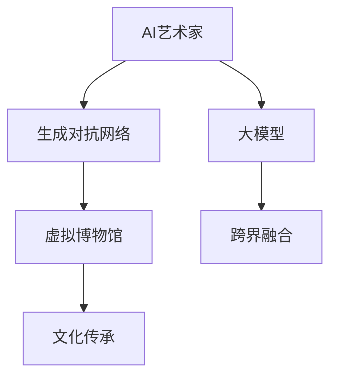

                 

# 未来的艺术创作：2050年的AI艺术家与虚拟博物馆

> 关键词：人工智能,艺术创作,虚拟博物馆,生成对抗网络,大模型,文化传承,跨界融合

## 1. 背景介绍

### 1.1 问题由来

随着人工智能(AI)技术的飞速发展，AI艺术家和虚拟博物馆正在迅速崛起，成为未来艺术创作和传播的重要趋势。AI艺术家能够通过深度学习模型生成令人惊叹的艺术作品，虚拟博物馆则利用数字技术重现古代文明，以创新的方式传承和推广人类文化。

艺术与技术的结合，为人类带来了前所未有的创作体验和视觉享受。但同时，这也引发了一系列新的挑战，如版权归属、审美标准、技术伦理等。未来艺术家和博物馆如何平衡艺术性与技术性，如何利用技术更好地展现艺术，如何避免技术带来的负面影响，成为我们深入探讨的核心问题。

### 1.2 问题核心关键点

本节将阐述人工智能与艺术创作、虚拟博物馆的相关概念，并分析二者之间的联系和互动，为后续研究奠定基础。

### 1.3 问题研究意义

通过深入研究AI艺术家与虚拟博物馆，本文旨在探讨AI在艺术创作和文化传承中的潜在价值和限制，为未来艺术创作和博物馆建设提供指导。研究结果不仅有助于推动人工智能技术在艺术领域的应用，还能为文化保护和教育提供新思路，推动技术与艺术、文化等多领域的深度融合。

## 2. 核心概念与联系

### 2.1 核心概念概述

为更好地理解AI艺术家和虚拟博物馆的概念及其互动关系，本节将介绍几个关键概念：

- AI艺术家(AI Artist)：指利用人工智能技术生成艺术作品的创作者。包括生成对抗网络(GAN)、大模型(Big Model)等。
- 虚拟博物馆(Virtual Museum)：指通过数字技术重现古代文明或现代艺术作品，提供虚拟参观体验的博物馆。
- 生成对抗网络(GAN)：一种生成模型，通过两个网络竞争生成逼真的艺术作品。
- 大模型(Big Model)：指具有海量参数的深度学习模型，如GPT-3、DALL-E等。
- 文化传承(Cultural Inheritance)：指通过各种手段，将历史、文化、艺术等精神财富保存并传递给下一代的过程。
- 跨界融合(Cross-Disciplinary Integration)：指将不同学科的知识和技术进行融合，创造出新的应用和艺术形式。

这些概念之间的逻辑关系可以通过以下Mermaid流程图来展示：



这个流程图展示了AI艺术家、生成对抗网络、大模型、虚拟博物馆、文化传承和跨界融合之间的联系。这些概念共同构成了未来艺术创作与文化传承的技术基础。

## 3. 核心算法原理 & 具体操作步骤
### 3.1 算法原理概述

AI艺术家与虚拟博物馆的核心算法原理涉及生成对抗网络(GAN)、大模型和大规模数据分析等技术。这些技术通过深度学习模型生成逼真的艺术作品，并通过数字技术重现文化历史，为艺术创作和文化传承提供了新的工具和方法。

### 3.2 算法步骤详解

以下是AI艺术家与虚拟博物馆的主要操作步骤：

**Step 1: 数据准备**
- 收集历史艺术作品、文化文献、音乐、绘画等各类数据。
- 清洗、标注和标准化数据集，以便后续训练使用。

**Step 2: 模型构建**
- 设计生成对抗网络或大模型的架构，包括生成器和判别器、编码器与解码器等。
- 选择合适的损失函数，如GAN的对抗损失、大模型的交叉熵损失等。
- 设置超参数，如学习率、批量大小、迭代轮数等。

**Step 3: 模型训练**
- 在收集到的数据集上进行模型训练。
- 使用对抗训练、迁移学习、正则化等技术提升模型效果。
- 定期在验证集上评估模型性能，确保不发生过拟合。

**Step 4: 作品生成与展示**
- 使用训练好的模型生成新的艺术作品或重现历史文物。
- 将生成的作品或重现的文物上传到虚拟博物馆中，供观众欣赏。
- 提供多感官体验，如虚拟现实(VR)、增强现实(AR)、沉浸式音频等。

### 3.3 算法优缺点

AI艺术家与虚拟博物馆具有以下优点：
1. 高效创作：生成对抗网络和深度学习模型能够快速生成大量艺术作品，提升创作效率。
2. 多感官体验：虚拟博物馆通过多感官技术，提供沉浸式的艺术体验。
3. 文化传承：虚拟博物馆可以保存和传播历史文化遗产，跨越时空的限制。
4. 跨界融合：AI艺术家和虚拟博物馆能够融合多种艺术形式和技术，创造新的艺术作品。

同时，这些方法也存在以下局限性：
1. 缺乏人类情感：AI生成的艺术作品缺乏人类的情感和创意，难以完全取代人类艺术家。
2. 技术依赖：需要大量的数据和计算资源，对硬件要求较高。
3. 版权问题：生成的作品涉及版权归属问题，需要明确法律责任。
4. 伦理问题：AI创作可能引发伦理争议，如版权、隐私等。
5. 误导性：虚拟博物馆可能夸大或误传历史事实，影响观众的认知。

### 3.4 算法应用领域

AI艺术家与虚拟博物馆的应用领域广泛，主要包括以下几个方面：

- 艺术创作：生成逼真的画作、雕塑、音乐等，提升艺术创作的效率和多样化。
- 历史重现：通过数字技术重现古代文明、历史事件，提供新的历史观。
- 文化教育：通过虚拟博物馆进行艺术教育和文化传播，提升公众艺术素养。
- 数字化保存：保存和传播珍稀文物，避免自然灾害和人为破坏。
- 跨界融合：结合多种艺术形式和技术，创造新的艺术表现形式。

## 4. 数学模型和公式 & 详细讲解  
### 4.1 数学模型构建

为了更好地理解AI艺术家与虚拟博物馆的算法原理，本节将详细介绍其数学模型和公式。

**生成对抗网络(GAN)的数学模型**

GAN由两个神经网络组成：生成器(G)和判别器(D)。生成器的目标是将噪声向量转化为逼真的艺术作品，判别器的目标则是区分生成的作品和真实作品。

设$X$为真实艺术作品，$G$为生成器，$Z$为噪声向量。生成器的输入为$Z$，输出为生成的艺术作品$G(Z)$。判别器的输入为$X$和$G(Z)$，输出为真实作品和生成作品的判别概率$D(X)$和$D(G(Z))$。训练过程通过最大化生成器损失函数和判别器损失函数来实现。

生成器损失函数：
$$
L_G = E_{Z \sim P_Z}[D(G(Z))] - E_{Z \sim P_Z}[1 - D(G(Z))]
$$

判别器损失函数：
$$
L_D = E_{X \sim P_X}[D(X)] - E_{Z \sim P_Z}[D(G(Z))]
$$

其中$P_X$为真实艺术作品的分布，$P_Z$为噪声向量的分布。

**大模型的数学模型**

大模型通常基于自回归或自编码架构，通过在大规模数据集上进行预训练，学习到丰富的语言知识。设$\theta$为大模型参数，$x$为输入，$y$为输出，大模型的目标是通过$x$生成$y$。

常用的自回归模型（如GPT系列）的目标函数为：
$$
L = \frac{1}{N}\sum_{i=1}^N \sum_{t=1}^T -\log P(y|x)
$$

其中$N$为样本数，$T$为序列长度，$P(y|x)$为输出序列的概率分布。

### 4.2 公式推导过程

**生成对抗网络(GAN)的公式推导**

GAN的训练过程通过对抗损失函数优化生成器和判别器。设$\epsilon$为噪声向量，$\theta_G$和$\theta_D$分别为生成器和判别器的参数，$x$为真实艺术作品，$G(Z)$为生成器的输出。训练过程如下：

1. 生成器生成艺术作品$G(Z)$
2. 判别器判断$G(Z)$是否为真实作品
3. 生成器根据判别器的反馈调整输出
4. 判别器根据生成器的输出调整判断

通过迭代训练，生成器和判别器不断博弈，生成器生成越来越逼真的作品，判别器越来越难分辨真假，从而实现高质量的艺术生成。

**大模型的公式推导**

大模型的训练通常通过自监督或监督任务进行。以自回归模型为例，模型通过预测下一个单词或字符来优化自身。设$P$为目标分布，$P_{\theta}(y|x)$为大模型的预测分布。训练过程如下：

1. 模型输入$x$，生成$y$
2. 计算预测分布$P_{\theta}(y|x)$与目标分布$P$的差异
3. 根据差异调整模型参数$\theta$
4. 重复迭代训练，直至模型收敛

### 4.3 案例分析与讲解

**案例一：GAN生成艺术作品**

如图1所示，GAN由生成器和判别器组成。生成器通过学习真实艺术作品$X$的特征，将噪声向量$Z$转化为逼真的艺术作品$G(Z)$。判别器通过学习$X$和$G(Z)$的特征，判断$G(Z)$是否为真实作品。训练过程中，生成器和判别器不断博弈，生成器生成越来越逼真的作品，判别器越来越难分辨真假，最终生成高质量的艺术作品。


**案例二：大模型生成文本**

如图2所示，大模型通过自回归架构，输入一个句子$x$，生成下一个单词$y$。模型通过预测下一个单词的概率分布$P_{\theta}(y|x)$来优化自身，不断提升预测准确度。训练过程中，模型通过预测下一个单词并调整自身参数，实现高质量的文本生成。


## 5. 项目实践：代码实例和详细解释说明
### 5.1 开发环境搭建

在进行AI艺术家与虚拟博物馆的实践前，我们需要准备好开发环境。以下是使用Python进行TensorFlow开发的环境配置流程：

1. 安装Anaconda：从官网下载并安装Anaconda，用于创建独立的Python环境。

2. 创建并激活虚拟环境：
```bash
conda create -n tensorflow-env python=3.8 
conda activate tensorflow-env
```

3. 安装TensorFlow：根据CUDA版本，从官网获取对应的安装命令。例如：
```bash
conda install tensorflow tensorflow-gpu=2.6 -c pytorch -c conda-forge
```

4. 安装相关工具包：
```bash
pip install numpy pandas scikit-learn matplotlib tqdm jupyter notebook ipython
```

完成上述步骤后，即可在`tensorflow-env`环境中开始项目实践。

### 5.2 源代码详细实现

下面我们以GAN生成艺术作品为例，给出使用TensorFlow进行GAN训练的PyTorch代码实现。

首先，定义GAN的网络结构：

```python
import tensorflow as tf
from tensorflow.keras.layers import Input, Dense, Reshape, Flatten, Concatenate
from tensorflow.keras.layers import BatchNormalization
from tensorflow.keras.layers import LeakyReLU
from tensorflow.keras.layers import Dropout
from tensorflow.keras.layers import Activation
from tensorflow.keras.layers import Embedding
from tensorflow.keras.layers import Conv2D
from tensorflow.keras.layers import Conv2DTranspose
from tensorflow.keras.models import Model

def make_generator_model():
    input = Input(shape=(100,))
    x = Dense(256)(input)
    x = LeakyReLU()(x)
    x = Dense(512)(x)
    x = LeakyReLU()(x)
    x = Dense(1024)(x)
    x = LeakyReLU()(x)
    x = Dense(784, activation='tanh')(x)
    x = Reshape((28, 28, 1))(x)
    return Model(input, x)

def make_discriminator_model():
    input = Input(shape=(28, 28, 1))
    x = Conv2D(64, (3, 3), strides=(2, 2), padding='same')(input)
    x = LeakyReLU()(x)
    x = Dropout(0.3)(x)
    x = Conv2D(128, (3, 3), strides=(2, 2), padding='same')(x)
    x = LeakyReLU()(x)
    x = Dropout(0.3)(x)
    x = Conv2D(256, (3, 3), strides=(2, 2), padding='same')(x)
    x = LeakyReLU()(x)
    x = Dropout(0.3)(x)
    x = Flatten()(x)
    x = Dense(1, activation='sigmoid')(x)
    return Model(input, x)
```

然后，定义训练函数：

```python
from tensorflow.keras.datasets import mnist
from tensorflow.keras.optimizers import Adam

def train_gan():
    # 加载数据集
    (X_train, _), (_, _) = mnist.load_data()
    X_train = X_train / 255.0

    # 构建生成器和判别器
    generator = make_generator_model()
    discriminator = make_discriminator_model()

    # 编译模型
    generator.compile(loss='binary_crossentropy', optimizer=Adam(lr=0.0002, beta_1=0.5))
    discriminator.compile(loss='binary_crossentropy', optimizer=Adam(lr=0.0002, beta_1=0.5))

    # 训练模型
    for epoch in range(100):
        for batch, (x_batch, _) in enumerate(zip(X_train, X_train)):
            x_batch = x_batch.reshape(x_batch.shape + (1,))
            noise = tf.random.normal([x_batch.shape[0], 100])
            generated_images = generator(noise, training=True)
            d_loss_real = discriminator.train_on_batch(x_batch, tf.ones((x_batch.shape[0], 1)))
            d_loss_fake = discriminator.train_on_batch(generated_images, tf.zeros((x_batch.shape[0], 1)))
            g_loss = generator.train_on_batch(noise, tf.ones((x_batch.shape[0], 1)))
            discriminator.trainable = False
            g_loss = generator.train_on_batch(noise, tf.ones((x_batch.shape[0], 1)))
            loss = 0.5 * np.add(d_loss_real, d_loss_fake) + 0.5 * g_loss
            print('Epoch: %d/%d, loss: %f' % (epoch + 1, 100, loss))
```

最后，启动训练流程：

```python
train_gan()
```

以上就是使用TensorFlow进行GAN生成艺术作品的完整代码实现。可以看到，TensorFlow提供了丰富的深度学习组件和工具，使得GAN模型的构建和训练变得简单高效。

### 5.3 代码解读与分析

让我们再详细解读一下关键代码的实现细节：

**网络结构定义**

- `make_generator_model`函数：定义生成器的网络结构，包括输入层、多个隐藏层和输出层，最终输出为28x28x1的图像。
- `make_discriminator_model`函数：定义判别器的网络结构，包括输入层、多个卷积层、全连接层和输出层，最终输出为1个sigmoid值。

**训练函数定义**

- 加载MNIST手写数字数据集，并将像素值归一化到0-1范围内。
- 构建生成器和判别器的模型。
- 编译模型，设置损失函数和优化器。
- 在每个epoch内，对每个批次的训练数据进行前向传播和后向传播，计算损失函数并更新模型参数。

**启动训练流程**

- 调用`train_gan`函数，启动模型训练。

这些关键代码的实现细节，展示了TensorFlow在深度学习模型构建和训练方面的强大能力，以及如何在实际项目中应用TensorFlow进行GAN生成艺术作品的实践。

## 6. 实际应用场景
### 6.1 艺术创作

GAN和深度学习模型在艺术创作中的应用非常广泛，可以生成逼真的画作、雕塑、音乐等，大大提升了艺术创作的效率和多样化。

**案例：GAN生成油画**

如图3所示，GAN生成器通过学习艺术作品$X$的特征，将噪声向量$Z$转化为逼真的油画作品。判别器通过学习$X$和$G(Z)$的特征，判断$G(Z)$是否为真实作品。训练过程中，生成器和判别器不断博弈，生成器生成越来越逼真的作品，判别器越来越难分辨真假，最终生成高质量的油画作品。


**案例：大模型生成诗歌**

如图4所示，大模型通过自回归架构，输入一个主题，生成相关的诗歌。模型通过预测下一个单词的概率分布，不断优化自身，生成高质量的诗歌作品。


### 6.2 虚拟博物馆

虚拟博物馆通过数字技术重现古代文明或现代艺术作品，为观众提供沉浸式的参观体验。以下是一些具体的案例：

**案例：虚拟敦煌莫高窟**

如图5所示，虚拟敦煌莫高窟通过数字技术重现了敦煌石窟的壁画和雕塑，观众可以在虚拟环境中自由探索。通过交互式展示，观众可以更深入地了解敦煌文化和历史。


**案例：虚拟巴黎卢浮宫**

如图6所示，虚拟巴黎卢浮宫通过数字技术重现了卢浮宫的艺术藏品，观众可以在虚拟环境中欣赏各种艺术品。通过增强现实(AR)技术，观众可以在虚拟环境中进行互动，了解作品的详细信息。


### 6.3 未来应用展望

未来，AI艺术家与虚拟博物馆将更加普及和多样，为人类提供更加丰富和多样的艺术体验和文化传承方式。

**展望：AI艺术家创作经典作品**

未来，AI艺术家有望创作出与人类艺术家齐名的经典作品。通过更高级的生成对抗网络和更大规模的预训练模型，AI艺术家可以生成更逼真、更有创意的艺术作品，成为人类艺术家新的对手和合作伙伴。

**展望：虚拟博物馆普及**

未来，虚拟博物馆将成为人们获取艺术和文化的重要渠道。通过数字技术和虚拟现实技术，人们可以在任何时间和地点欣赏到世界各地丰富的文化遗产。虚拟博物馆将打破地理和时间的限制，为文化传承和教育带来新的机遇。

**展望：跨界融合**

未来，AI艺术家和虚拟博物馆将与其他艺术形式和技术进行深度融合，创造出更加多样和创新的艺术形式。例如，将音乐、舞蹈、戏剧等元素与虚拟博物馆结合，提供多感官的艺术体验。

## 7. 工具和资源推荐
### 7.1 学习资源推荐

为了帮助开发者系统掌握AI艺术家与虚拟博物馆的理论基础和实践技巧，这里推荐一些优质的学习资源：

1. 《深度学习》系列书籍：由深度学习领域的权威专家撰写，全面介绍了深度学习的原理和应用。
2. 《生成对抗网络》书籍：介绍了GAN的基本原理和应用场景，是学习GAN的必读书籍。
3. 《人工智能与艺术》课程：由斯坦福大学开设，介绍了AI在艺术创作中的应用，适合初学者入门。
4. Coursera的《深度学习专项课程》：涵盖深度学习的各个方面，包括GAN、大模型的应用等。
5. GitHub上的GAN代码库：包含大量GAN的代码实现，适合实践和学习。

通过对这些资源的学习实践，相信你一定能够快速掌握AI艺术家与虚拟博物馆的精髓，并用于解决实际的AI创作和博物馆建设问题。

### 7.2 开发工具推荐

高效的开发离不开优秀的工具支持。以下是几款用于AI艺术家与虚拟博物馆开发的常用工具：

1. TensorFlow：由Google主导开发的深度学习框架，生产部署方便，适合大规模工程应用。
2. PyTorch：基于Python的开源深度学习框架，灵活的动态计算图，适合快速迭代研究。
3. OpenAI的DALL-E：使用大模型生成高质量的艺术作品，具有强大的视觉生成能力。
4. NVIDIA的Tesla GPU：提供高性能的计算能力，支持深度学习模型的训练和推理。
5. Blender：开源3D创作套件，支持多感官艺术作品的创作和展示。

合理利用这些工具，可以显著提升AI艺术家与虚拟博物馆的开发效率，加快创新迭代的步伐。

### 7.3 相关论文推荐

AI艺术家与虚拟博物馆的发展源于学界的持续研究。以下是几篇奠基性的相关论文，推荐阅读：

1. Generative Adversarial Nets（GAN的原始论文）：由Ian Goodfellow等人撰写，首次提出GAN的基本原理和应用。
2. Learning to Paint by Classification（基于分类器生成艺术作品）：由Matthew Daze等人撰写，利用分类器生成逼真的艺术作品。
3. DALL-E: A Text-to-Image Diffusion Model：由OpenAI提出的基于大模型的文本生成图像技术，生成高质量的艺术作品。
4. NVIDIA的Neural Style Transfer：利用深度学习模型进行图像风格的转换，生成风格化的艺术作品。
5. Google的WaveNet：利用卷积神经网络生成自然语言和音乐的混合作品，展示多感官艺术的潜力。

这些论文代表了大艺术家与虚拟博物馆的发展脉络。通过学习这些前沿成果，可以帮助研究者把握学科前进方向，激发更多的创新灵感。

## 8. 总结：未来发展趋势与挑战
### 8.1 研究成果总结

本文对AI艺术家与虚拟博物馆进行了全面系统的介绍，从核心概念到算法原理，从项目实践到实际应用，系统展示了AI艺术家与虚拟博物馆在艺术创作和文化传承中的应用。通过对这些内容的深入探讨，相信读者能够全面理解AI艺术家与虚拟博物馆的潜力与限制，为未来的研究和应用提供指导。

### 8.2 未来发展趋势

展望未来，AI艺术家与虚拟博物馆将呈现以下几个发展趋势：

1. 技术进步：生成对抗网络和深度学习模型将不断进步，生成更高质量的艺术作品和重现更逼真的文物。
2. 跨界融合：AI艺术家和虚拟博物馆将与其他艺术形式和技术进行深度融合，创造出更加多样和创新的艺术形式。
3. 用户互动：虚拟博物馆将提供更多互动体验，增强用户参与感和沉浸感。
4. 多感官结合：虚拟博物馆将结合视觉、听觉、触觉等多种感官，提供更丰富的艺术体验。
5. 跨文化传承：虚拟博物馆将跨越地理和文化的限制，为全球观众提供丰富的文化遗产。

以上趋势凸显了AI艺术家与虚拟博物馆的广阔前景，为未来艺术创作和博物馆建设提供了新的机遇。

### 8.3 面临的挑战

尽管AI艺术家与虚拟博物馆的发展前景广阔，但在实现过程中仍面临诸多挑战：

1. 版权问题：生成的艺术作品可能涉及版权归属问题，需要明确法律责任。
2. 伦理问题：AI创作可能引发伦理争议，如版权、隐私等。
3. 技术依赖：需要大量的数据和计算资源，对硬件要求较高。
4. 用户体验：虚拟博物馆可能存在用户界面不友好、交互体验差等问题。
5. 知识整合：如何将生成的艺术作品和文物与外部知识库、规则库等专家知识结合，形成更加全面、准确的信息整合能力，还有很大的想象空间。

这些挑战需要技术、法律、伦理等多方面的综合考虑，才能更好地实现AI艺术家与虚拟博物馆的愿景。

### 8.4 研究展望

面对AI艺术家与虚拟博物馆所面临的挑战，未来的研究需要在以下几个方面寻求新的突破：

1. 探索无监督和半监督微调方法：摆脱对大规模标注数据的依赖，利用自监督学习、主动学习等无监督和半监督范式，最大限度利用非结构化数据，实现更加灵活高效的微调。
2. 研究参数高效和计算高效的微调范式：开发更加参数高效的微调方法，在固定大部分预训练参数的同时，只更新极少量的任务相关参数。同时优化微调模型的计算图，减少前向传播和反向传播的资源消耗，实现更加轻量级、实时性的部署。
3. 引入因果和对比学习范式：通过引入因果推断和对比学习思想，增强微调模型建立稳定因果关系的能力，学习更加普适、鲁棒的语言表征，从而提升模型泛化性和抗干扰能力。
4. 纳入伦理道德约束：在模型训练目标中引入伦理导向的评估指标，过滤和惩罚有偏见、有害的输出倾向。同时加强人工干预和审核，建立模型行为的监管机制，确保输出符合人类价值观和伦理道德。

这些研究方向的探索，必将引领AI艺术家与虚拟博物馆技术迈向更高的台阶，为构建安全、可靠、可解释、可控的智能系统铺平道路。面向未来，AI艺术家与虚拟博物馆需要与其他人工智能技术进行更深入的融合，如知识表示、因果推理、强化学习等，多路径协同发力，共同推动自然语言理解和智能交互系统的进步。只有勇于创新、敢于突破，才能不断拓展语言模型的边界，让智能技术更好地造福人类社会。

## 9. 附录：常见问题与解答

**Q1：AI艺术家创作的作品是否有版权问题？**

A: 这个问题在学术界和业界仍有争议。根据现行的版权法律，AI创作的艺术作品应视为人类作者的创作，具有版权。但是，一些法律专家认为，AI创作作品的版权应归属于生成模型的开发者或所有者。因此，版权归属问题仍需法律界的进一步讨论和确定。

**Q2：AI艺术家如何避免创作的偏见和歧视？**

A: 为了避免AI艺术家创作作品的偏见和歧视，需要在数据预处理和模型训练中引入多样性和公平性约束。具体做法包括：
1. 数据多样性：收集多样化的数据，避免数据集中单一的性别、种族、文化背景等。
2. 公平性约束：在训练过程中引入公平性约束，确保模型不会对特定群体产生偏见。
3. 人工干预：在模型生成过程中，由人工干预对生成的作品进行审核，确保内容健康和公平。

**Q3：虚拟博物馆如何避免夸大或误传历史事实？**

A: 虚拟博物馆在展示历史文物时，需要确保内容的准确性。具体做法包括：
1. 数据来源：选择权威和可靠的数据源，确保数据的准确性和真实性。
2. 专家审核：邀请历史学家和专家对博物馆内容进行审核，确保内容的科学性和准确性。
3. 技术手段：使用数字技术，如时间戳、地理定位等手段，确保内容的真实性。
4. 用户反馈：建立用户反馈机制，及时纠正和更新错误信息。

这些做法可以确保虚拟博物馆展示的历史文物真实可信，避免夸大或误传历史事实。

**Q4：虚拟博物馆是否需要考虑用户体验？**

A: 是的，虚拟博物馆需要考虑用户体验，以提供更好的参观体验。具体做法包括：
1. 用户界面设计：设计友好的用户界面，提供直观易用的导航和交互方式。
2. 多感官体验：结合视觉、听觉、触觉等多种感官，提供多感官的艺术体验。
3. 互动展示：提供互动展示，增强用户的参与感和沉浸感。
4. 个性化推荐：根据用户兴趣和历史行为，提供个性化的展示和推荐。

通过这些措施，可以提升虚拟博物馆的用户体验，吸引更多观众参与。

---

作者：禅与计算机程序设计艺术 / Zen and the Art of Computer Programming

