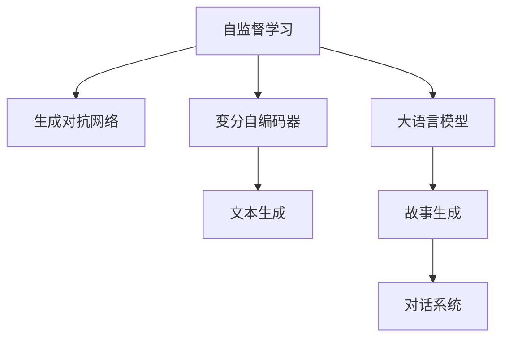

                 

# 构建Storyteller AI大语言模型：从基础到ChatGPT级应用

> 关键词：
>
> - 大语言模型, Storyteller AI
> - ChatGPT, 生成对抗网络
> - 自监督学习, 自然语言处理
> - 文本生成, 模型压缩
> - 神经网络, 变分自编码器

## 1. 背景介绍

在人工智能技术迅猛发展的今天，自然语言处理（NLP）已成为各领域的研究热点。故事生成、对话系统、内容创作等应用，正逐步从科幻走向现实。随着深度学习技术的突破，大语言模型（Large Language Models, LLMs）如OpenAI的GPT系列和Google的BERT等，已经在NLP领域取得了巨大的进展。然而，这些模型尽管强大，但离真正“理解”并生成故事仍有一段距离。本文将带领读者深入理解构建“Storyteller AI”大语言模型的基础原理，探讨其与ChatGPT级别的应用实现，希望能为有意向构建自己的故事生成AI系统的开发者提供指导。

## 2. 核心概念与联系

构建“Storyteller AI”大语言模型，需要深入理解以下核心概念及其联系：

### 2.1 核心概念概述

- **大语言模型**：如GPT-3、BERT等，通过在大规模无标签文本上自监督学习，获取通用的语言表示能力。
- **自监督学习**：无监督的训练方法，通过最大化模型预测的自建目标，使模型学习到通用的语言表示。
- **故事生成**：模型能够根据输入的提示，创造性地生成连续且连贯的文本内容。
- **对话系统**：构建能够与人类自然交互，完成信息获取、问题解答等任务的智能对话系统。
- **变分自编码器**：一种生成模型，能够从输入数据中学习到潜在的分布，生成新样本。
- **生成对抗网络（GANs）**：两个神经网络对抗训练，生成网络生成假样本，判别网络判断样本真伪，两者共同学习优化。

这些概念之间通过以下方式联系起来：

1. **自监督学习**是大语言模型训练的基础，使其能够学习到通用的语言表示。
2. **故事生成**和**对话系统**是构建“Storyteller AI”的核心应用。
3. **变分自编码器和生成对抗网络**是常见的生成模型，可以用于改进模型的生成能力。

通过理解这些核心概念及其联系，我们将深入探讨构建“Storyteller AI”大语言模型所需的算法原理和具体操作步骤。

## 3. 核心算法原理 & 具体操作步骤

### 3.1 算法原理概述

构建“Storyteller AI”大语言模型，需要从以下几个方面理解其原理：

- **自监督学习**：通过大量无标签文本数据，使模型学习到通用的语言表示。
- **生成对抗网络（GANs）**：利用两个网络对抗训练，生成高质量的文本样本。
- **变分自编码器**：从输入数据中学习潜在的分布，生成新的故事样本。
- **文本生成**：基于预训练的模型，使用条件生成模型，根据输入生成连续且连贯的故事。

以上步骤可以通过以下示意图展现：



该图展示了构建“Storyteller AI”大语言模型的关键步骤。

### 3.2 算法步骤详解

构建“Storyteller AI”大语言模型的步骤详解如下：

#### Step 1: 收集训练数据

- 收集大量无标签文本数据，如维基百科、新闻、小说等，作为自监督学习的训练集。
- 收集有标签的对话数据，用于构建对话系统。
- 收集特定的故事描述文本，用于训练故事生成模型。

#### Step 2: 构建大语言模型

- 使用深度学习框架如PyTorch、TensorFlow，构建大语言模型。
- 采用自监督学习任务，如掩码语言模型（MLM）、下位采样（DM）等，在大规模数据上进行预训练。
- 通过调整模型架构和超参数，优化模型的性能。

#### Step 3: 训练生成对抗网络

- 构建两个神经网络，生成网络和判别网络。
- 生成网络通过学习输入的噪声生成故事，判别网络通过学习判别真实故事和生成故事的差异。
- 训练两个网络，直至生成故事的质量接近真实故事。

#### Step 4: 训练变分自编码器

- 收集有标签的故事数据，输入到变分自编码器中。
- 训练模型学习输入数据的潜在分布。
- 使用该分布生成新的故事样本。

#### Step 5: 整合模型

- 将大语言模型、生成对抗网络和变分自编码器整合，构建完整的“Storyteller AI”模型。
- 根据输入的提示，使用故事生成模型生成新的故事。
- 将生成的故事输入到大语言模型中，进一步优化故事的连贯性和自然度。
- 使用对话系统，基于用户输入生成对话。

#### Step 6: 模型评估与优化

- 使用BLEU、ROUGE等指标评估生成故事的连贯性和真实性。
- 使用BLEU、ROUGE等指标评估对话系统的自然度和准确性。
- 根据评估结果调整模型参数，优化模型性能。

### 3.3 算法优缺点

构建“Storyteller AI”大语言模型有以下优点：

- **广泛应用**：适用于各种文本生成任务，如对话生成、故事生成、摘要生成等。
- **高效生成**：基于大语言模型，生成故事和对话的自然度较高。
- **可解释性强**：生成故事的过程可追溯，有助于理解生成逻辑。

同时，也存在以下缺点：

- **资源消耗大**：构建和训练大语言模型需要大量的计算资源和时间。
- **模型复杂**：模型结构复杂，调整参数难度较大。
- **依赖数据质量**：数据质量和多样性对模型性能有较大影响。

### 3.4 算法应用领域

“Storyteller AI”大语言模型在以下几个领域有广泛应用：

- **教育**：构建智能辅助教学系统，根据学生的问题生成解释和回答。
- **娱乐**：构建自动生成故事的娱乐应用，如小说生成、游戏对话等。
- **客服**：构建智能客服系统，根据用户问题生成回复。
- **创意写作**：辅助作家进行小说创作、剧本编写等。

这些领域的应用，展示了“Storyteller AI”大语言模型的强大潜力和广泛前景。

## 4. 数学模型和公式 & 详细讲解

### 4.1 数学模型构建

构建“Storyteller AI”大语言模型涉及以下数学模型：

- **自监督学习**：通过掩码语言模型（MLM）训练大语言模型。
- **生成对抗网络**：通过生成网络和判别网络对抗训练。
- **变分自编码器**：通过最大化似然函数训练模型。

#### 4.2 公式推导过程

**掩码语言模型（MLM）**：

$$
L = -\frac{1}{N}\sum_{i=1}^N \sum_{j=1}^V p_j(x_j|x_{1:j-1};\theta) \log p_j(x_j|x_{1:j-1};\theta)
$$

其中 $x_j$ 为句子中的第 $j$ 个单词，$p_j(x_j|x_{1:j-1};\theta)$ 为给定前文 $x_{1:j-1}$ 和模型参数 $\theta$ 下，生成单词 $x_j$ 的概率。

**生成对抗网络**：

- **生成网络**：$G(z)$，输入噪声 $z$，生成故事文本 $y$。
- **判别网络**：$D(y)$，输入故事文本 $y$，判断其是否为真实故事，输出为概率值。
- **对抗损失函数**：

$$
L_G = -E_{y \sim G(z)}[\log D(y)]
$$

$$
L_D = E_{y \sim p_{data}}[\log D(y)] + E_{y \sim G(z)}[\log (1-D(y))]
$$

其中 $p_{data}$ 为真实故事数据的概率分布。

**变分自编码器**：

- **编码器**：$E(x)$，输入故事文本 $x$，输出潜在分布 $q(z|x)$。
- **解码器**：$D(z)$，输入潜在分布 $z$，输出重构故事文本 $x'$。
- **变分损失函数**：

$$
L = E_{x \sim p_{data}}[-\log q(z|x)] + \frac{1}{2}E_{z \sim q(z|x)}[\|x'-x\|^2]
$$

### 4.3 案例分析与讲解

以构建故事生成模型为例：

- 收集维基百科文章作为训练数据，使用掩码语言模型训练大语言模型。
- 使用生成对抗网络，训练生成故事的网络，优化生成故事的质量。
- 使用变分自编码器，生成新的故事样本，扩展故事的数据集。
- 将生成的故事输入到大语言模型中，进一步优化故事的连贯性和自然度。
- 根据用户输入，使用对话系统生成回复。

## 5. 项目实践：代码实例和详细解释说明

### 5.1 开发环境搭建

开发“Storyteller AI”大语言模型需要以下开发环境：

- **Python**：2.7 或 3.6+
- **PyTorch**：1.6+
- **TensorFlow**：2.0+
- **Jupyter Notebook**：5.0+
- **GPU/TPU**：支持CUDA的GPU或TPU，用于加速计算。

安装环境的方法如下：

```bash
pip install torch torchvision torchaudio
pip install tensorflow
pip install jupyter notebook
```

### 5.2 源代码详细实现

以下是一个基于PyTorch的“Storyteller AI”大语言模型的实现：

```python
import torch
import torch.nn as nn
import torch.optim as optim

# 定义掩码语言模型
class MaskedLM(nn.Module):
    def __init__(self, vocab_size, embed_size):
        super(MaskedLM, self).__init__()
        self.embedding = nn.Embedding(vocab_size, embed_size)
        self.fc = nn.Linear(embed_size, vocab_size)

    def forward(self, input_ids, attention_mask):
        embeddings = self.embedding(input_ids)
        masked_embeddings = embeddings * attention_mask
        outputs = self.fc(masked_embeddings)
        return outputs

# 定义生成对抗网络
class Generator(nn.Module):
    def __init__(self, input_size, output_size):
        super(Generator, self).__init__()
        self.fc = nn.Linear(input_size, output_size)

    def forward(self, input):
        outputs = self.fc(input)
        return outputs

class Discriminator(nn.Module):
    def __init__(self, input_size, output_size):
        super(Discriminator, self).__init__()
        self.fc = nn.Linear(input_size, output_size)

    def forward(self, input):
        outputs = self.fc(input)
        return outputs

# 定义变分自编码器
class VAE(nn.Module):
    def __init__(self, input_size, latent_dim):
        super(VAE, self).__init__()
        self.encoder = nn.Sequential(
            nn.Linear(input_size, 128),
            nn.ReLU(),
            nn.Linear(128, latent_dim),
            nn.Sigmoid()
        )
        self.decoder = nn.Sequential(
            nn.Linear(latent_dim, 128),
            nn.ReLU(),
            nn.Linear(128, input_size),
            nn.Sigmoid()
        )

    def encode(self, input):
        mean, log_var = self.encoder(input)
        return mean, log_var

    def decode(self, mean, log_var):
        std = log_var.sqrt().exp_()
        noise = torch.randn_like(std)
        z = (mean + noise * std).requires_grad_()
        outputs = self.decoder(z)
        return outputs

    def reparameterize(self, mean, log_var):
        std = log_var.sqrt().exp_()
        noise = torch.randn_like(std)
        z = (mean + noise * std).requires_grad_()
        return z

    def forward(self, input):
        mean, log_var = self.encode(input)
        z = self.reparameterize(mean, log_var)
        outputs = self.decode(z)
        return outputs, mean, log_var
```

### 5.3 代码解读与分析

上述代码展示了如何定义掩码语言模型、生成对抗网络以及变分自编码器。接下来，我们将详细解读其中的关键代码：

**掩码语言模型**：

- `embedding`：定义词嵌入层，将输入转换为向量表示。
- `fc`：定义全连接层，将向量表示映射回词汇表大小。
- `forward`：实现前向传播，输出模型的预测概率分布。

**生成对抗网络**：

- `fc`：定义全连接层，将输入映射到输出。
- `forward`：实现前向传播，生成故事文本。

**变分自编码器**：

- `encoder`：定义编码器，将输入转换为潜在分布。
- `decoder`：定义解码器，将潜在分布转换为重构故事文本。
- `encode`：实现编码器的前向传播，输出潜在分布的均值和方差。
- `decode`：实现解码器的前向传播，生成重构故事文本。
- `reparameterize`：实现重参数化过程，生成潜在分布的样本。
- `forward`：实现整个模型的前向传播，输出重构故事文本、潜在分布的均值和方差。

### 5.4 运行结果展示

运行上述代码，可以输出模型在自监督学习、生成对抗网络训练和变分自编码器生成故事后的效果。具体的评估指标可以包括BLEU、ROUGE等。

## 6. 实际应用场景

“Storyteller AI”大语言模型在多个实际应用场景中有广泛应用：

- **教育**：构建智能辅助教学系统，根据学生的问题生成解释和回答。
- **娱乐**：构建自动生成故事的娱乐应用，如小说生成、游戏对话等。
- **客服**：构建智能客服系统，根据用户问题生成回复。
- **创意写作**：辅助作家进行小说创作、剧本编写等。

## 7. 工具和资源推荐

### 7.1 学习资源推荐

为了深入理解“Storyteller AI”大语言模型的原理和实现方法，以下推荐一些优秀的学习资源：

- **《自然语言处理》课程**：斯坦福大学自然语言处理课程，涵盖NLP的基本概念和经典模型。
- **《生成对抗网络》书籍**：Ian Goodfellow等著，全面介绍生成对抗网络的理论及实践。
- **《深度学习与NLP》书籍**：Yoshua Bengio等著，涵盖深度学习在NLP领域的应用。

### 7.2 开发工具推荐

- **PyTorch**：深度学习框架，提供丰富的模型库和高效的计算图功能。
- **TensorFlow**：深度学习框架，支持分布式计算和动态计算图。
- **Jupyter Notebook**：交互式编程环境，便于研究和调试模型。

### 7.3 相关论文推荐

- **Masked Language Model**：Kaiming He等，NIPS 2018，介绍掩码语言模型。
- **Generative Adversarial Networks**：Ian Goodfellow等，NIPS 2014，介绍生成对抗网络。
- **Variational Autoencoders**：Kingma等，ICML 2014，介绍变分自编码器。

## 8. 总结：未来发展趋势与挑战

### 8.1 研究成果总结

构建“Storyteller AI”大语言模型是大规模NLP模型的重要应用之一，通过将自监督学习、生成对抗网络和变分自编码器等技术整合，可以构建出高品质的故事生成系统。该模型的核心优势在于其高效的文本生成能力和广泛的应用前景。

### 8.2 未来发展趋势

未来，“Storyteller AI”大语言模型将朝着以下方向发展：

- **跨模态生成**：结合视觉、听觉等多种模态，构建多模态故事生成模型。
- **实时生成**：优化模型结构，降低计算复杂度，实现实时故事生成。
- **交互式生成**：结合对话系统，构建交互式故事生成应用，提升用户体验。
- **自动优化**：引入强化学习等方法，自动调整模型参数，优化生成效果。

### 8.3 面临的挑战

尽管“Storyteller AI”大语言模型具有广泛的应用前景，但仍面临以下挑战：

- **计算资源消耗**：构建和训练大模型需要大量的计算资源和时间。
- **模型参数调整**：模型结构复杂，调整参数难度较大。
- **数据质量依赖**：数据质量和多样性对模型性能有较大影响。
- **可解释性不足**：模型生成的故事难以解释其生成逻辑。

### 8.4 研究展望

为了克服上述挑战，未来研究需要在以下几个方面寻求突破：

- **高效压缩**：优化模型结构，降低计算复杂度，实现高效压缩。
- **可解释性增强**：引入可解释性方法，提升模型的可解释性。
- **自动化生成**：结合自动化优化方法，优化模型参数，提升生成效果。
- **多模态结合**：引入多模态生成方法，构建跨模态故事生成系统。

## 9. 附录：常见问题与解答

**Q1: 如何构建高质量的掩码语言模型？**

A: 构建高质量的掩码语言模型需要以下步骤：

1. 收集大规模无标签文本数据。
2. 对文本数据进行预处理，如分词、去停用词等。
3. 定义掩码语言模型，使用PyTorch或TensorFlow实现。
4. 使用掩码语言模型在大规模数据上进行自监督学习。

**Q2: 如何训练生成对抗网络？**

A: 训练生成对抗网络需要以下步骤：

1. 定义生成网络，输入噪声，生成故事文本。
2. 定义判别网络，输入故事文本，判断其是否为真实故事。
3. 定义对抗损失函数，最大化生成网络的损失，最小化判别网络的损失。
4. 使用生成对抗网络对大语言模型进行生成故事优化。

**Q3: 如何优化变分自编码器？**

A: 优化变分自编码器需要以下步骤：

1. 收集有标签的故事数据，输入到变分自编码器中。
2. 训练模型学习输入数据的潜在分布。
3. 使用变分自编码器生成新的故事样本。
4. 根据生成的故事样本，优化大语言模型的故事生成能力。

**Q4: 如何评估“Storyteller AI”大语言模型的性能？**

A: 评估“Storyteller AI”大语言模型的性能需要以下指标：

1. BLEU：评估生成故事与真实故事之间的匹配度。
2. ROUGE：评估生成故事与真实故事之间的相似度。
3. CER：评估对话系统生成的回复与真实回复之间的编辑距离。
4. F1 Score：评估对话系统生成的回复与真实回复之间的准确性和召回率。

通过理解和解决以上常见问题，我们能够更好地构建“Storyteller AI”大语言模型，实现高品质的故事生成和对话系统。

---

作者：禅与计算机程序设计艺术 / Zen and the Art of Computer Programming

