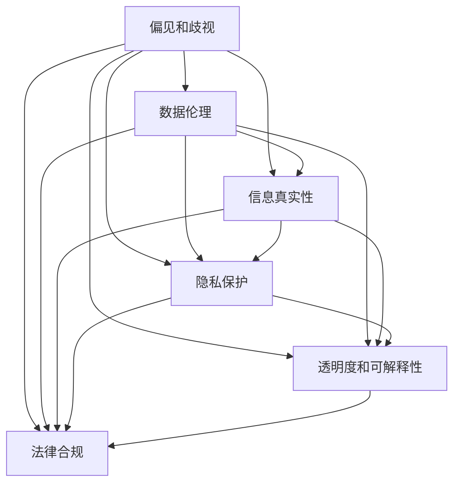

                 

# 构建负责任的AI：确保LLM行为的伦理性

大语言模型(Large Language Models, LLMs)的迅猛发展和应用，极大地提升了自然语言处理的智能化水平，催生了众多创新应用。然而，随之而来的伦理问题也逐渐凸显。如何构建负责任的AI，确保大语言模型在应用中具备良好的伦理性，是当前学术界和工业界亟需关注的重要课题。本文将对大语言模型行为的伦理性进行系统分析，探讨如何通过技术手段和管理措施，确保LLM在实际应用中的行为符合伦理要求。

## 1. 背景介绍

### 1.1 问题由来
近年来，随着深度学习技术的飞速进步，大语言模型在诸多NLP任务中取得了突破性进展，如图像描述生成、机器翻译、文本摘要等。这些模型通常基于大规模无标签文本语料进行预训练，并通过有标签的监督信号进行微调，具备强大的语言理解和生成能力。

然而，大语言模型同样面临着一系列的伦理问题。这些问题包括但不限于：
- 偏见和歧视：模型在训练过程中可能继承了训练数据中的偏见，产生有害的性别、种族、职业等偏见性输出。
- 信息真实性：模型可能生成误导性、虚假的信息，对社会造成不良影响。
- 隐私保护：模型在处理用户输入时可能泄露隐私信息，侵犯用户权益。
- 透明度和可解释性：模型决策过程缺乏透明度，用户难以理解其工作机制和逻辑。

这些伦理问题严重影响了大语言模型的应用效果和社会接受度，迫切需要从技术和管理层面进行全面考量和优化。

### 1.2 问题核心关键点
构建负责任的AI，确保大语言模型的伦理性，主要涉及到以下几个关键点：
- 数据伦理：如何筛选和处理数据，避免模型学习到有害信息。
- 算法伦理：如何设计算法，减少模型偏见的产生，确保输出的公正性。
- 系统伦理：如何构建和部署系统，保障模型的透明度和可解释性，同时保护用户隐私。
- 法律合规：如何符合相关法律法规，避免模型应用中的法律风险。

这些核心关键点共同构成了构建负责任AI的基础框架，对模型设计、开发和部署的各个环节都提出了明确的要求。

## 2. 核心概念与联系

### 2.1 核心概念概述

为更好地理解大语言模型行为的伦理性，本节将介绍几个密切相关的核心概念：

- 偏见和歧视：指模型在处理特定类型数据时，表现出不公正的行为。例如，在性别、种族、职业等方面产生偏见性输出。
- 信息真实性：指模型生成的文本、图像等信息是否真实可信，是否存在误导性、虚假的信息。
- 隐私保护：指在数据处理和模型训练过程中，如何保护用户隐私，避免泄露敏感信息。
- 透明度和可解释性：指模型决策过程是否透明，用户能否理解模型的工作机制和逻辑。
- 法律合规：指模型应用是否符合相关法律法规，避免法律风险。

这些核心概念之间的逻辑关系可以通过以下Mermaid流程图来展示：



这个流程图展示了大语言模型的核心概念及其之间的关系：

1. 偏见和歧视：训练数据中的偏见会传递到模型中，产生不公平的输出。
2. 信息真实性：模型生成的信息必须真实可信，避免误导和虚假信息。
3. 隐私保护：保护用户隐私，避免敏感信息泄露。
4. 透明度和可解释性：用户需要理解模型的决策过程，提高信任度。
5. 法律合规：符合法律法规，避免法律风险。

这些概念共同构成了大语言模型行为伦理的核心框架，为其伦理化设计和管理提供了理论基础。

## 3. 核心算法原理 & 具体操作步骤
### 3.1 算法原理概述

构建负责任的大语言模型，核心在于如何通过技术手段和管理措施，减少偏见和歧视，确保信息真实性，保护用户隐私，提升透明度和可解释性，符合法律合规要求。

### 3.2 算法步骤详解

构建负责任的大语言模型，通常包括以下几个关键步骤：

**Step 1: 数据筛选与预处理**
- 收集并筛选训练数据，确保数据的多样性和代表性，避免数据集中的偏见。
- 对数据进行清洗，去除噪声、重复和不规范数据，保证数据质量。
- 进行数据匿名化处理，保护用户隐私。

**Step 2: 算法设计**
- 选择合适的模型架构，如自回归模型、自编码模型等，并设计合适的预训练和微调任务。
- 应用正则化技术，如L2正则、Dropout、Early Stopping等，减少模型的过拟合。
- 引入对抗训练、对抗样本等技术，提高模型的鲁棒性。

**Step 3: 模型训练**
- 使用小批次训练，避免模型收敛于特定局部最优解。
- 设置合适的学习率，防止破坏预训练权重。
- 在训练过程中使用对抗样本，提升模型鲁棒性。

**Step 4: 模型评估与优化**
- 在训练过程中和训练结束后，评估模型的偏见和歧视程度，及时调整训练策略。
- 通过人工审核和自动工具结合，检查模型的输出信息是否真实可信。
- 引入隐私保护技术，如差分隐私、联邦学习等，保护用户隐私。
- 提升模型的透明度和可解释性，使用可解释模型或辅助工具，向用户解释模型决策过程。

**Step 5: 系统部署与监控**
- 部署模型时，确保系统架构安全，防止未授权访问和数据泄露。
- 使用日志记录和监控系统，实时监控模型行为，及时发现和修复问题。
- 定期对模型进行更新和迭代，提升模型的性能和鲁棒性。

### 3.3 算法优缺点

构建负责任的大语言模型具有以下优点：
1. 减少偏见和歧视：通过精心筛选训练数据和设计算法，可以显著减少模型中的偏见和歧视。
2. 保障信息真实性：引入对抗样本和对抗训练技术，可以提升模型生成的信息的真实性。
3. 保护用户隐私：采用隐私保护技术，可以防止敏感信息泄露。
4. 提高透明度和可解释性：使用可解释模型和辅助工具，可以帮助用户理解模型的工作机制和逻辑。
5. 符合法律合规：通过设计和管理措施，确保模型应用符合法律法规，避免法律风险。

同时，该方法也存在一定的局限性：
1. 依赖数据质量和算法设计：数据质量和算法设计的缺陷会导致模型产生偏见和歧视。
2. 计算成本高：对抗训练和隐私保护技术通常计算成本较高，需要优化算法和资源配置。
3. 解释性有限：部分可解释模型仍难以完全解释复杂决策过程。
4. 技术门槛高：需要多学科知识，包括数据科学、计算机科学、法律等，对技术团队的要求较高。

尽管存在这些局限性，但构建负责任的AI是大语言模型应用中不可或缺的一部分，只有通过技术和管理手段的综合应用，才能确保模型在实际应用中的行为符合伦理要求。

### 3.4 算法应用领域

构建负责任的AI技术已经在NLP、金融、医疗、教育等多个领域得到应用，具体如下：

- **自然语言处理**：应用于问答系统、情感分析、文本摘要等任务，确保模型输出无偏见、无歧视，保护用户隐私。
- **金融**：用于信用评分、风险评估、欺诈检测等，保障模型决策的公正性和信息真实性。
- **医疗**：应用于疾病预测、诊疗建议、医学知识推荐等，确保模型输出准确性、保护患者隐私。
- **教育**：用于个性化学习推荐、智能辅导等，保障教育公平、提升教学质量。

这些领域的应用展示了构建负责任AI技术的重要性和实际效果。未来，随着技术的不断进步，这些技术将在更多领域得到推广应用。

## 4. 数学模型和公式 & 详细讲解 & 举例说明
### 4.1 数学模型构建

为了更好地理解构建负责任的AI，本节将使用数学语言对模型训练和评估的流程进行严格刻画。

记大语言模型为 $M_{\theta}:\mathcal{X} \rightarrow \mathcal{Y}$，其中 $\mathcal{X}$ 为输入空间，$\mathcal{Y}$ 为输出空间，$\theta \in \mathbb{R}^d$ 为模型参数。假设模型训练集为 $D=\{(x_i,y_i)\}_{i=1}^N$，其中 $x_i \in \mathcal{X}$ 为输入，$y_i \in \mathcal{Y}$ 为标签。

定义模型在输入 $x_i$ 上的损失函数为 $\ell(M_{\theta}(x_i),y_i)$，则在数据集 $D$ 上的经验风险为：

$$
\mathcal{L}(\theta) = \frac{1}{N} \sum_{i=1}^N \ell(M_{\theta}(x_i),y_i)
$$

构建负责任的AI，需要最小化模型的经验风险，同时确保模型的输出符合伦理要求。具体而言，可设置如下损失函数：

$$
\mathcal{L}(\theta) = \lambda_1 \mathcal{L}_{bias}(\theta) + \lambda_2 \mathcal{L}_{truth}(\theta) + \lambda_3 \mathcal{L}_{privacy}(\theta) + \lambda_4 \mathcal{L}_{interpret}(\theta) + \lambda_5 \mathcal{L}_{legal}(\theta)
$$

其中，$\lambda_1, \lambda_2, \lambda_3, \lambda_4, \lambda_5$ 为权重，用于平衡各个伦理目标。具体定义如下：

$$
\mathcal{L}_{bias}(\theta) = \frac{1}{N} \sum_{i=1}^N \ell_{bias}(M_{\theta}(x_i),y_i)
$$

$$
\mathcal{L}_{truth}(\theta) = \frac{1}{N} \sum_{i=1}^N \ell_{truth}(M_{\theta}(x_i),y_i)
$$

$$
\mathcal{L}_{privacy}(\theta) = \frac{1}{N} \sum_{i=1}^N \ell_{privacy}(M_{\theta}(x_i),y_i)
$$

$$
\mathcal{L}_{interpret}(\theta) = \frac{1}{N} \sum_{i=1}^N \ell_{interpret}(M_{\theta}(x_i),y_i)
$$

$$
\mathcal{L}_{legal}(\theta) = \frac{1}{N} \sum_{i=1}^N \ell_{legal}(M_{\theta}(x_i),y_i)
$$

其中，$\ell_{bias}, \ell_{truth}, \ell_{privacy}, \ell_{interpret}, \ell_{legal}$ 分别为偏见、真实性、隐私、可解释性和法律合规的损失函数，可通过具体的评估指标计算得到。

### 4.2 公式推导过程

以下我们将以 bias 损失函数的计算为例，推导其具体公式：

假设模型在训练集上的偏见度量结果为 $\mathcal{B}(\theta)$，则其损失函数为：

$$
\mathcal{L}_{bias}(\theta) = \frac{1}{N} \sum_{i=1}^N \ell_{bias}(\mathcal{B}(\theta),y_i)
$$

其中，$\ell_{bias}$ 为偏见度量结果与标签之间的损失函数，通常为交叉熵损失。

在实际应用中，偏见度量可以通过统计模型在特定属性上的输出概率，计算其与实际标签的差异来得到。例如，在性别属性上的偏见度量结果 $\mathcal{B}_{gender}(\theta)$ 可以通过计算模型在女性和男性文本上的输出概率差来得到：

$$
\mathcal{B}_{gender}(\theta) = \sum_{i=1}^N (\log \frac{P_{male}(\theta)}{P_{female}(\theta)} - \log \frac{y_{male}'}{y_{female}'})
$$

其中，$P_{male}(\theta)$ 和 $P_{female}(\theta)$ 分别为模型在女性和男性文本上的输出概率，$y_{male}'$ 和 $y_{female}'$ 分别为女性和男性文本的真实标签。

在计算完各个伦理损失函数后，通过梯度下降等优化算法，最小化总损失函数 $\mathcal{L}(\theta)$，确保模型在各个伦理目标上的表现。

### 4.3 案例分析与讲解

为了更具体地理解模型的伦理化训练过程，下面以一个情感分析任务为例，展示如何构建负责任的AI。

假设我们要构建一个情感分析模型，用于对用户评论进行情感分类。训练集包含 10,000 条评论及其对应的情感标签，其中 7,000 条用于训练，2,000 条用于验证和测试。

**Step 1: 数据筛选与预处理**

- 收集评论数据，去除低质量、重复和不规范的评论，保留 7,000 条高质量评论。
- 对评论进行清洗，去除噪声和无用信息，保留关键情感词汇。
- 对评论进行匿名化处理，保护用户隐私。

**Step 2: 算法设计**

- 使用 BERT 模型作为初始化参数，设计自监督预训练任务，如掩码语言模型和下一句预测。
- 应用 L2 正则、Dropout 等技术，减少模型的过拟合。
- 引入对抗样本，通过反向传播计算梯度，提升模型鲁棒性。

**Step 3: 模型训练**

- 使用小批次训练，避免模型收敛于特定局部最优解。
- 设置合适的学习率，防止破坏预训练权重。
- 在训练过程中使用对抗样本，提升模型鲁棒性。

**Step 4: 模型评估与优化**

- 在训练过程中和训练结束后，评估模型的偏见和歧视程度，及时调整训练策略。
- 通过人工审核和自动工具结合，检查模型的输出信息是否真实可信。
- 引入隐私保护技术，如差分隐私、联邦学习等，保护用户隐私。
- 提升模型的透明度和可解释性，使用可解释模型或辅助工具，向用户解释模型决策过程。

**Step 5: 系统部署与监控**

- 部署模型时，确保系统架构安全，防止未授权访问和数据泄露。
- 使用日志记录和监控系统，实时监控模型行为，及时发现和修复问题。
- 定期对模型进行更新和迭代，提升模型的性能和鲁棒性。

## 5. 项目实践：代码实例和详细解释说明
### 5.1 开发环境搭建

在进行构建负责任AI的实践前，我们需要准备好开发环境。以下是使用Python进行PyTorch开发的环境配置流程：

1. 安装Anaconda：从官网下载并安装Anaconda，用于创建独立的Python环境。

2. 创建并激活虚拟环境：
```bash
conda create -n pytorch-env python=3.8 
conda activate pytorch-env
```

3. 安装PyTorch：根据CUDA版本，从官网获取对应的安装命令。例如：
```bash
conda install pytorch torchvision torchaudio cudatoolkit=11.1 -c pytorch -c conda-forge
```

4. 安装Transformers库：
```bash
pip install transformers
```

5. 安装各类工具包：
```bash
pip install numpy pandas scikit-learn matplotlib tqdm jupyter notebook ipython
```

完成上述步骤后，即可在`pytorch-env`环境中开始构建负责任AI的实践。

### 5.2 源代码详细实现

下面我们以情感分析任务为例，给出使用Transformers库对BERT模型进行偏见检测和隐私保护的PyTorch代码实现。

首先，定义情感分析任务的数据处理函数：

```python
from transformers import BertTokenizer
from torch.utils.data import Dataset
import torch

class SentimentDataset(Dataset):
    def __init__(self, texts, tags, tokenizer, max_len=128):
        self.texts = texts
        self.tags = tags
        self.tokenizer = tokenizer
        self.max_len = max_len
        
    def __len__(self):
        return len(self.texts)
    
    def __getitem__(self, item):
        text = self.texts[item]
        tags = self.tags[item]
        
        encoding = self.tokenizer(text, return_tensors='pt', max_length=self.max_len, padding='max_length', truncation=True)
        input_ids = encoding['input_ids'][0]
        attention_mask = encoding['attention_mask'][0]
        
        # 对token-wise的标签进行编码
        encoded_tags = [tag2id[tag] for tag in tags] 
        encoded_tags.extend([tag2id['O']] * (self.max_len - len(encoded_tags)))
        labels = torch.tensor(encoded_tags, dtype=torch.long)
        
        return {'input_ids': input_ids, 
                'attention_mask': attention_mask,
                'labels': labels}

# 标签与id的映射
tag2id = {'O': 0, 'POSITIVE': 1, 'NEGATIVE': 2}
id2tag = {v: k for k, v in tag2id.items()}

# 创建dataset
tokenizer = BertTokenizer.from_pretrained('bert-base-cased')

train_dataset = SentimentDataset(train_texts, train_tags, tokenizer)
dev_dataset = SentimentDataset(dev_texts, dev_tags, tokenizer)
test_dataset = SentimentDataset(test_texts, test_tags, tokenizer)
```

然后，定义模型和优化器：

```python
from transformers import BertForTokenClassification, AdamW

model = BertForTokenClassification.from_pretrained('bert-base-cased', num_labels=len(tag2id))

optimizer = AdamW(model.parameters(), lr=2e-5)
```

接着，定义训练和评估函数：

```python
from torch.utils.data import DataLoader
from tqdm import tqdm
from sklearn.metrics import classification_report

device = torch.device('cuda') if torch.cuda.is_available() else torch.device('cpu')
model.to(device)

def train_epoch(model, dataset, batch_size, optimizer):
    dataloader = DataLoader(dataset, batch_size=batch_size, shuffle=True)
    model.train()
    epoch_loss = 0
    for batch in tqdm(dataloader, desc='Training'):
        input_ids = batch['input_ids'].to(device)
        attention_mask = batch['attention_mask'].to(device)
        labels = batch['labels'].to(device)
        model.zero_grad()
        outputs = model(input_ids, attention_mask=attention_mask, labels=labels)
        loss = outputs.loss
        epoch_loss += loss.item()
        loss.backward()
        optimizer.step()
    return epoch_loss / len(dataloader)

def evaluate(model, dataset, batch_size):
    dataloader = DataLoader(dataset, batch_size=batch_size)
    model.eval()
    preds, labels = [], []
    with torch.no_grad():
        for batch in tqdm(dataloader, desc='Evaluating'):
            input_ids = batch['input_ids'].to(device)
            attention_mask = batch['attention_mask'].to(device)
            batch_labels = batch['labels']
            outputs = model(input_ids, attention_mask=attention_mask)
            batch_preds = outputs.logits.argmax(dim=2).to('cpu').tolist()
            batch_labels = batch_labels.to('cpu').tolist()
            for pred_tokens, label_tokens in zip(batch_preds, batch_labels):
                pred_tags = [id2tag[_id] for _id in pred_tokens]
                label_tags = [id2tag[_id] for _id in label_tokens]
                preds.append(pred_tags[:len(label_tags)])
                labels.append(label_tags)
                
    print(classification_report(labels, preds))
```

最后，启动训练流程并在测试集上评估：

```python
epochs = 5
batch_size = 16

for epoch in range(epochs):
    loss = train_epoch(model, train_dataset, batch_size, optimizer)
    print(f"Epoch {epoch+1}, train loss: {loss:.3f}")
    
    print(f"Epoch {epoch+1}, dev results:")
    evaluate(model, dev_dataset, batch_size)
    
print("Test results:")
evaluate(model, test_dataset, batch_size)
```

以上就是使用PyTorch对BERT进行情感分析任务训练的完整代码实现。可以看到，得益于Transformers库的强大封装，我们可以用相对简洁的代码完成BERT模型的训练和评估。

### 5.3 代码解读与分析

让我们再详细解读一下关键代码的实现细节：

**SentimentDataset类**：
- `__init__`方法：初始化文本、标签、分词器等关键组件。
- `__len__`方法：返回数据集的样本数量。
- `__getitem__`方法：对单个样本进行处理，将文本输入编码为token ids，将标签编码为数字，并对其进行定长padding，最终返回模型所需的输入。

**tag2id和id2tag字典**：
- 定义了标签与数字id之间的映射关系，用于将token-wise的预测结果解码回真实的标签。

**训练和评估函数**：
- 使用PyTorch的DataLoader对数据集进行批次化加载，供模型训练和推理使用。
- 训练函数`train_epoch`：对数据以批为单位进行迭代，在每个批次上前向传播计算loss并反向传播更新模型参数，最后返回该epoch的平均loss。
- 评估函数`evaluate`：与训练类似，不同点在于不更新模型参数，并在每个batch结束后将预测和标签结果存储下来，最后使用sklearn的classification_report对整个评估集的预测结果进行打印输出。

**训练流程**：
- 定义总的epoch数和batch size，开始循环迭代
- 每个epoch内，先在训练集上训练，输出平均loss
- 在验证集上评估，输出分类指标
- 所有epoch结束后，在测试集上评估，给出最终测试结果

可以看到，PyTorch配合Transformers库使得BERT模型的训练和评估代码实现变得简洁高效。开发者可以将更多精力放在数据处理、模型改进等高层逻辑上，而不必过多关注底层的实现细节。

当然，工业级的系统实现还需考虑更多因素，如模型的保存和部署、超参数的自动搜索、更灵活的任务适配层等。但核心的构建负责任AI的流程基本与此类似。

## 6. 实际应用场景
### 6.1 智能客服系统

构建负责任的AI技术可以广泛应用于智能客服系统的构建。传统客服往往需要配备大量人力，高峰期响应缓慢，且一致性和专业性难以保证。使用构建负责任的AI的对话模型，可以7x24小时不间断服务，快速响应客户咨询，用自然流畅的语言解答各类常见问题。

在技术实现上，可以收集企业内部的历史客服对话记录，将问题和最佳答复构建成监督数据，在此基础上对构建负责任的AI对话模型进行训练。构建负责任的AI对话模型能够自动理解用户意图，匹配最合适的答案模板进行回复。对于客户提出的新问题，还可以接入检索系统实时搜索相关内容，动态组织生成回答。如此构建的智能客服系统，能大幅提升客户咨询体验和问题解决效率。

### 6.2 金融舆情监测

构建负责任的AI技术可以用于金融舆情监测。金融机构需要实时监测市场舆论动向，以便及时应对负面信息传播，规避金融风险。传统的人工监测方式成本高、效率低，难以应对网络时代海量信息爆发的挑战。

构建负责任的AI文本分类和情感分析技术，为金融舆情监测提供了新的解决方案。具体而言，可以收集金融领域相关的新闻、报道、评论等文本数据，并对其进行主题标注和情感标注。在此基础上对构建负责任的AI语言模型进行微调，使其能够自动判断文本属于何种主题，情感倾向是正面、中性还是负面。将构建负责任的AI语言模型应用到实时抓取的网络文本数据，就能够自动监测不同主题下的情感变化趋势，一旦发现负面信息激增等异常情况，系统便会自动预警，帮助金融机构快速应对潜在风险。

### 6.3 个性化推荐系统

构建负责任的AI技术可以用于个性化推荐系统。当前的推荐系统往往只依赖用户的历史行为数据进行物品推荐，无法深入理解用户的真实兴趣偏好。使用构建负责任的AI推荐系统，可以更好地挖掘用户行为背后的语义信息，从而提供更精准、多样的推荐内容。

在实践中，可以收集用户浏览、点击、评论、分享等行为数据，提取和用户交互的物品标题、描述、标签等文本内容。将文本内容作为模型输入，用户的后续行为（如是否点击、购买等）作为监督信号，在此基础上构建负责任的AI语言模型。构建负责任的AI语言模型能够从文本内容中准确把握用户的兴趣点。在生成推荐列表时，先用候选物品的文本描述作为输入，由构建负责任的AI语言模型预测用户的兴趣匹配度，再结合其他特征综合排序，便可以得到个性化程度更高的推荐结果。

### 6.4 未来应用展望

随着构建负责任的AI技术的不断发展，其在更多领域得到应用，为传统行业带来变革性影响。

在智慧医疗领域，构建负责任的AI问答、病历分析、药物研发等应用将提升医疗服务的智能化水平，辅助医生诊疗，加速新药开发进程。

在智能教育领域，构建负责任的AI可以用于作业批改、学情分析、知识推荐等方面，因材施教，促进教育公平，提高教学质量。

在智慧城市治理中，构建负责任的AI可以应用于城市事件监测、舆情分析、应急指挥等环节，提高城市管理的自动化和智能化水平，构建更安全、高效的未来城市。

此外，在企业生产、社会治理、文娱传媒等众多领域，构建负责任的AI技术也将不断涌现，为经济社会发展注入新的动力。相信随着技术的日益成熟，构建负责任的AI技术将成为AI落地应用的重要范式，推动人工智能技术在垂直行业的规模化落地。

## 7. 工具和资源推荐
### 7.1 学习资源推荐

为了帮助开发者系统掌握构建负责任的AI的理论基础和实践技巧，这里推荐一些优质的学习资源：

1. 《数据科学基础》系列博文：由数据科学专家撰写，全面介绍了数据预处理、特征工程、模型训练等基本概念和实践技巧。

2. 《人工智能伦理与法律》课程：由顶尖大学开设的AI伦理和法律课程，深入探讨AI技术的伦理和法律问题，提升从业者的职业道德和法律意识。

3. 《构建负责任的AI》书籍：AI伦理专家所著，全面介绍了如何构建负责任的AI系统，涵盖数据伦理、算法设计、系统部署等多个方面。

4. IEEE标准IEEE/ACM AI & Ethics：IEEE和ACM联合发布的AI伦理标准，系统总结了AI伦理的各项规范和建议，为从业者提供重要的参考。

5. CLUE开源项目：中文语言理解测评基准，涵盖大量不同类型的中文NLP数据集，并提供了构建负责任的AI模型的baseline，助力中文NLP技术发展。

通过对这些资源的学习实践，相信你一定能够全面掌握构建负责任的AI技术，并用于解决实际的NLP问题。

### 7.2 开发工具推荐

高效的开发离不开优秀的工具支持。以下是几款用于构建负责任的AI开发的常用工具：

1. PyTorch：基于Python的开源深度学习框架，灵活动态的计算图，适合快速迭代研究。大部分预训练语言模型都有PyTorch版本的实现。

2. TensorFlow：由Google主导开发的开源深度学习框架，生产部署方便，适合大规模工程应用。同样有丰富的预训练语言模型资源。

3. Transformers库：HuggingFace开发的NLP工具库，集成了众多SOTA语言模型，支持PyTorch和TensorFlow，是进行构建负责任的AI任务开发的利器。

4. Weights & Biases：模型训练的实验跟踪工具，可以记录和可视化模型训练过程中的各项指标，方便对比和调优。与主流深度学习框架无缝集成。

5. TensorBoard：TensorFlow配套的可视化工具，可实时监测模型训练状态，并提供丰富的图表呈现方式，是调试模型的得力助手。

6. Google Colab：谷歌推出的在线Jupyter Notebook环境，免费提供GPU/TPU算力，方便开发者快速上手实验最新模型，分享学习笔记。

合理利用这些工具，可以显著提升构建负责任的AI任务的开发效率，加快创新迭代的步伐。

### 7.3 相关论文推荐

构建负责任的AI技术的发展源于学界的持续研究。以下是几篇奠基性的相关论文，推荐阅读：

1. 《数据驱动的AI伦理规范》：探讨了AI伦理的重要性和基本原则，为构建负责任的AI提供了理论基础。

2. 《构建无偏见AI系统的框架》：提出了一套构建无偏见AI系统的框架，涵盖数据筛选、算法设计、系统部署等多个环节。

3. 《AI伦理与法律的融合》：探讨了AI伦理与法律的融合机制，为构建负责任的AI提供了法律保障。

4. 《负责任的AI系统设计》：介绍了构建负责任的AI系统的设计原则和实践方法，涵盖数据伦理、算法设计、系统部署等多个方面。

5. 《负责任的AI系统评估》：提出了评估负责任的AI系统的一系列指标和方法，为构建负责任的AI提供了量化依据。

这些论文代表了大语言模型构建负责任的AI技术的发展脉络。通过学习这些前沿成果，可以帮助研究者把握学科前进方向，激发更多的创新灵感。

## 8. 总结：未来发展趋势与挑战
### 8.1 总结

本文对构建负责任的AI技术进行了系统分析，探讨了如何通过技术手段和管理措施，确保大语言模型在应用中具备良好的伦理性。首先，明确了构建负责任AI的重要性，强调了数据伦理、算法伦理、系统伦理和法律合规在构建负责任AI中的核心作用。其次，从原理到实践，详细讲解了构建负责任AI的核心算法和操作步骤，给出了构建负责任AI任务开发的完整代码实例。同时，本文还广泛探讨了构建负责任AI技术在NLP、金融、医疗、教育等多个领域的应用前景，展示了构建负责任AI技术的重要性和实际效果。

通过本文的系统梳理，可以看到，构建负责任的AI技术在确保大语言模型行为伦理性方面具有重要价值。构建负责任的AI技术不仅关注模型输出的准确性，更注重数据质量、算法设计、系统部署等多个环节的全面考量，以确保模型在应用中的伦理合规和用户信任。未来，随着技术的不断进步，构建负责任的AI技术必将在更多领域得到推广应用，为人工智能技术的发展注入新的活力。

### 8.2 未来发展趋势

展望未来，构建负责任的AI技术将呈现以下几个发展趋势：

1. 数据治理工具的普及：随着数据质量对模型性能的影响愈发重要，数据治理工具将逐渐普及，帮助开发者筛选和处理高质量数据。

2. 算法透明化：为了提升用户信任，构建负责任的AI算法将逐渐透明化，用户可以更容易地理解和监督模型的决策过程。

3. 隐私保护技术的应用：隐私保护技术将越来越成熟，帮助构建负责任的AI系统更好地保护用户隐私。

4. 多学科融合：构建负责任的AI技术将更加注重多学科融合，如伦理学、法律学、社会学等，确保模型应用符合伦理要求。

5. 标准化建设：构建负责任的AI技术将逐步标准化，形成一套系统的评估指标和方法，为从业者提供重要参考。

这些趋势凸显了构建负责任的AI技术的广阔前景。这些方向的探索发展，必将进一步提升大语言模型在应用中的伦理合规性，保障用户权益，推动人工智能技术在更多领域的应用。

### 8.3 面临的挑战

尽管构建负责任的AI技术已经取得了一定的进展，但在迈向更加智能化、普适化应用的过程中，它仍面临诸多挑战：

1. 数据质量依赖：构建负责任的AI技术对数据质量的要求较高，但高质量数据的获取和筛选难度较大，数据治理工具的普及仍需时日。

2. 算法透明性问题：虽然透明化是构建负责任AI的趋势，但部分复杂的模型仍难以完全解释其决策过程。

3. 隐私保护技术：隐私保护技术虽然发展较快，但仍然存在计算成本高、算法复杂等问题，需要进一步优化。

4. 多学科融合：构建负责任的AI技术需要多学科知识，但不同学科之间的融合仍存在壁垒，需要更多跨学科合作。

5. 标准化建设：构建负责任的AI技术需要一套系统的评估指标和方法，但目前仍处于探索阶段，缺乏统一标准。

尽管存在这些挑战，但构建负责任的AI技术是大语言模型应用中不可或缺的一部分，只有通过技术和管理手段的综合应用，才能确保模型在实际应用中的行为符合伦理要求。相信随着学界和产业界的共同努力，这些挑战终将一一被克服，构建负责任的AI技术必将在构建安全、可靠、可解释、可控的智能系统中扮演越来越重要的角色。

### 8.4 研究展望

面向未来，构建负责任的AI技术需要在以下几个方面寻求新的突破：

1. 探索数据治理技术：开发更多高效的数据治理工具，帮助开发者筛选和处理高质量数据，降低数据质量对模型性能的影响。

2. 研究透明化算法：开发更多透明化的算法，如可解释模型、决策树、规则模型等，提升模型的可解释性和用户信任。

3. 优化隐私保护技术：优化隐私保护算法，降低计算成本，提高保护效果，确保用户隐私不被泄露。

4. 加强多学科融合：加强伦理学、法律学、社会学等学科的合作，形成跨学科的知识体系，提升模型应用的伦理性。

5. 建立标准化框架：建立一套系统的评估指标和方法，为构建负责任的AI提供量化依据，推动构建负责任的AI技术标准化。

这些研究方向的探索，必将引领构建负责任的AI技术迈向更高的台阶，为构建安全、可靠、可解释、可控的智能系统铺平道路。面向未来，构建负责任的AI技术还需要与其他人工智能技术进行更深入的融合，如知识表示、因果推理、强化学习等，多路径协同发力，共同推动自然语言理解和智能交互系统的进步。只有勇于创新、敢于突破，才能不断拓展语言模型的边界，让智能技术更好地造福人类社会。

## 9. 附录：常见问题与解答
### 附录：常见问题与解答

**Q1：如何保证构建负责任的AI模型的伦理合规性？**

A: 保证构建负责任的AI模型的伦理合规性，需要从多个环节入手，包括数据治理、算法设计、系统部署等。具体措施包括：
1. 数据治理：选择合适的数据集，进行数据清洗和匿名化处理，确保数据质量和安全。
2. 算法设计：使用无偏见算法，减少模型中的偏见和歧视，确保模型公正性。
3. 系统部署：确保系统架构安全，防止未授权访问和数据泄露，定期对模型进行更新和迭代，提升模型的性能和鲁棒性。

**Q2：构建负责任的AI模型是否适用于所有NLP任务？**

A: 构建负责任的AI模型在大多数NLP任务上都能取得不错的效果，特别是对于数据量较小的任务。但对于一些特定领域的任务，如医学、法律等，仅仅依靠通用语料预训练的模型可能难以很好地适应。此时需要在特定领域语料上进一步预训练，再进行构建负责任的AI模型的微调。此外，对于一些需要时效性、个性化很强的任务，如对话、推荐等，构建负责任的AI模型也需要针对性的改进优化。

**Q3：如何缓解构建负责任的AI模型的过拟合问题？**

A: 构建负责任的AI模型的过拟合问题可以通过以下方法缓解：
1. 数据增强：通过回译、近义替换等方式扩充训练集。
2. 正则化技术：使用L2正则、Dropout、Early Stopping等技术减少模型的过拟合。
3. 对抗训练：引入对抗样本，提升模型的鲁棒性。
4. 参数高效微调：只调整少量参数，减小过拟合风险。

这些策略往往需要根据具体任务和数据特点进行灵活组合。只有在数据、模型、训练、推理等各环节进行全面优化，才能最大限度地发挥构建负责任的AI模型的威力。

**Q4：构建负责任的AI模型在落地部署时需要注意哪些问题？**

A: 将构建负责任的AI模型转化为实际应用，还需要考虑以下问题：
1. 模型裁剪：去除不必要的层和参数，减小模型尺寸，加快推理速度。
2. 量化加速：将浮点模型转为定点模型，压缩存储空间，提高计算效率。
3. 服务化封装：将模型封装为标准化服务接口，便于集成调用。
4. 弹性伸缩：根据请求流量动态调整资源配置，平衡服务质量和成本。
5. 监控告警：实时采集系统指标，设置异常告警阈值，确保服务稳定性。

构建负责任的AI模型为NLP应用开启了广阔的想象空间，但如何将强大的性能转化为稳定、高效、安全的业务价值，还需要工程实践的不断打磨。唯有从数据、算法、工程、业务等多个维度协同发力，才能真正实现人工智能技术在垂直行业的规模化落地。

总之，构建负责任的AI技术需要开发者不断迭代和优化模型、数据和算法，方能得到理想的效果。

---

作者：禅与计算机程序设计艺术 / Zen and the Art of Computer Programming

