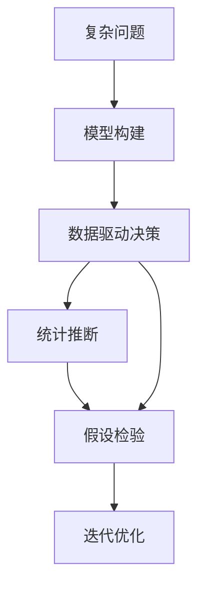

                 

# 模型思维:快速掌握复杂事物的利器

> 关键词：模型思维,复杂性管理,问题抽象,数据驱动决策,统计推断,假设检验

## 1. 背景介绍

### 1.1 问题由来

在现代社会中，复杂性已渗透到各个行业和领域，人们几乎无处不在地面临着复杂问题的挑战。从金融市场的动态变化、医疗诊断的精准预测、物流系统的优化调度，到企业战略的制定、社会治理的决策，所有这些都需要我们具备处理复杂信息的能力。面对复杂性，传统依靠直觉和经验的方法显然已经不足以应对。我们需要一种更为系统、科学的方法来处理这些复杂问题，而模型思维（Model Thinking）正是这样一种利器。

### 1.2 问题核心关键点

模型思维强调通过构建和分析模型来理解、预测和控制复杂系统。这种方法的核心在于将复杂系统抽象为可管理的模型，使用数据驱动的推理和验证，以定量的方式处理不确定性。其关键点包括：

- **模型构建**：将现实世界复杂问题抽象为数学或计算模型，进行简化的表达。
- **数据驱动**：利用历史数据和观测数据训练模型，使其能够反映现实世界的规律。
- **假设检验**：通过统计推断和假设检验，评估模型预测的准确性和可靠性。
- **迭代优化**：根据新数据和反馈，不断调整和优化模型。

## 2. 核心概念与联系

### 2.1 核心概念概述

- **模型**：对现实世界现象的数学或计算抽象，包括统计模型、物理模型、计算模型等。模型是一种简化的表示，通过一系列参数和规则来描述复杂系统的行为。
- **数据驱动决策**：基于数据的收集、整理、分析和解释，做出合理决策的过程。这种方法能够减少主观偏见，提高决策的科学性和可重复性。
- **统计推断**：使用样本数据来推断总体特征的统计方法，包括参数估计、假设检验、置信区间等。统计推断提供了一种量化不确定性的手段。
- **假设检验**：通过统计学方法验证研究假设的有效性，通常包括显著性检验、置信区间、p值等。假设检验帮助我们判断模型的预测是否可靠。
- **迭代优化**：通过不断收集新数据、更新模型参数和调整模型结构，逐步优化模型的预测能力。迭代优化确保模型适应环境变化，保持其有效性。

### 2.2 核心概念原理和架构的 Mermaid 流程图



这个流程图展示了模型思维的核心流程：首先，我们将复杂问题抽象为模型；然后，利用数据驱动决策进行模型训练；接着，通过统计推断和假设检验评估模型性能；最后，根据新数据进行迭代优化，以不断提升模型效果。

## 3. 核心算法原理 & 具体操作步骤

### 3.1 算法原理概述

模型思维的算法原理基于概率统计和优化理论，通过建立和优化数学模型，模拟和预测复杂系统行为。具体步骤包括：

1. **模型构建**：选择合适的数学或计算模型，根据问题特点设计模型参数和结构。
2. **数据准备**：收集和处理数据，确保数据质量，消除噪声和异常值。
3. **模型训练**：使用历史数据训练模型，优化模型参数，使其能够拟合数据特征。
4. **模型评估**：使用独立数据集评估模型性能，通过统计推断和假设检验验证模型效果。
5. **迭代优化**：根据评估结果和新数据，不断调整和优化模型。

### 3.2 算法步骤详解

#### 3.2.1 模型构建

模型构建是模型思维的第一步。我们需要将复杂问题抽象为可管理的模型，确定模型结构、参数和假设。以下是一些常见的模型类型：

- **线性回归模型**：用于描述输入变量和输出变量之间的线性关系。
- **逻辑回归模型**：用于分类问题，将输入变量映射到离散输出（如二分类或多分类）。
- **时间序列模型**：用于预测时间序列数据，如ARIMA模型、LSTM模型等。
- **优化模型**：用于优化问题，如线性规划、整数规划等。

#### 3.2.2 数据准备

数据准备包括数据收集、清洗、转换和标准化等步骤。目的是确保数据质量，消除噪声和异常值，以便模型训练。

1. **数据收集**：从不同来源获取数据，如传感器、数据库、API等。
2. **数据清洗**：处理缺失值、重复值和异常值，确保数据完整性和一致性。
3. **数据转换**：对数据进行归一化、标准化、编码等预处理，以便模型处理。
4. **数据标准化**：将数据转换为标准格式，如时间序列、数值型数据等。

#### 3.2.3 模型训练

模型训练使用历史数据训练模型，优化模型参数，使其能够拟合数据特征。

1. **损失函数**：定义模型的预测误差，如均方误差、交叉熵等。
2. **优化算法**：如梯度下降、Adam、SGD等，用于更新模型参数，最小化损失函数。
3. **交叉验证**：使用交叉验证技术，评估模型泛化能力，避免过拟合。

#### 3.2.4 模型评估

模型评估使用独立数据集评估模型性能，通过统计推断和假设检验验证模型效果。

1. **评估指标**：如准确率、精确率、召回率、F1值等，用于评估模型预测结果。
2. **统计推断**：如置信区间、p值、t检验等，用于评估模型参数估计的可靠性。
3. **假设检验**：如t检验、卡方检验、ANOVA等，用于验证模型假设的有效性。

#### 3.2.5 迭代优化

迭代优化根据评估结果和新数据，不断调整和优化模型。

1. **模型更新**：根据新数据更新模型参数，调整模型结构。
2. **参数调整**：调整模型参数，如学习率、正则化系数、神经网络层数等。
3. **特征选择**：选择对模型预测效果有影响的特征，提高模型泛化能力。

### 3.3 算法优缺点

模型思维的算法具有以下优点：

- **系统性**：通过模型构建和数学建模，将复杂问题系统化处理，便于理解和分析。
- **定量性**：利用数据驱动的推理和验证，提供定量化的预测和评估。
- **可重复性**：模型构建和评估过程具有高度的可重复性，便于研究和验证。
- **科学性**：基于统计推断和假设检验，提供科学的方法论基础。

同时，模型思维也存在一些缺点：

- **抽象性**：模型构建需要抽象能力，对于复杂问题的抽象可能存在偏差。
- **数据依赖**：模型训练依赖数据质量，数据缺失或噪声可能导致模型效果不佳。
- **计算复杂度**：复杂模型的计算复杂度较高，训练和评估过程可能需要较长的时间。
- **假设假设**：模型假设可能不完全符合现实情况，导致模型预测结果存在偏差。

### 3.4 算法应用领域

模型思维广泛应用于各个行业和领域，涵盖以下主要应用领域：

- **金融领域**：用于风险评估、投资组合优化、市场预测等。
- **医疗领域**：用于疾病诊断、治疗方案推荐、患者风险评估等。
- **制造领域**：用于生产优化、故障预测、质量控制等。
- **物流领域**：用于路径规划、配送优化、库存管理等。
- **交通领域**：用于交通流量预测、拥堵控制、调度优化等。
- **环境保护**：用于环境监测、污染预测、资源管理等。

## 4. 数学模型和公式 & 详细讲解

### 4.1 数学模型构建

模型思维的数学模型包括统计模型、物理模型和计算模型。以下是一些常见的数学模型及其构建方法：

1. **线性回归模型**：
   \[ y = \beta_0 + \beta_1 x_1 + \ldots + \beta_k x_k + \epsilon \]
   其中，$y$ 为输出变量，$x_i$ 为输入变量，$\beta$ 为模型参数，$\epsilon$ 为误差项。

2. **逻辑回归模型**：
   \[ P(y=1|x) = \frac{1}{1+e^{-\beta_0 - \beta_1 x_1 - \ldots - \beta_k x_k}} \]
   其中，$P(y=1|x)$ 为输出变量 $y$ 的条件概率。

3. **时间序列模型**：
   \[ y_t = \alpha_0 + \alpha_1 y_{t-1} + \ldots + \alpha_k y_{t-k} + \epsilon_t \]
   其中，$y_t$ 为时间序列数据，$k$ 为滞后期数。

4. **优化模型**：
   \[ \min_{x} f(x) \]
   其中，$x$ 为决策变量，$f(x)$ 为目标函数。

### 4.2 公式推导过程

以下是一些常见数学模型的推导过程：

1. **线性回归模型推导**：
   - 假设数据为 $(y_i, x_{i1}, x_{i2}, \ldots, x_{ik})$，其中 $y_i$ 为输出变量，$x_{ij}$ 为输入变量。
   - 模型为 $y_i = \beta_0 + \beta_1 x_{i1} + \ldots + \beta_k x_{ik} + \epsilon_i$。
   - 最小二乘法求解 $\beta$，使 $\sum_{i=1}^n (y_i - \hat{y}_i)^2$ 最小，其中 $\hat{y}_i = \beta_0 + \beta_1 x_{i1} + \ldots + \beta_k x_{ik}$。
   - 求解得到 $\beta = (X^TX)^{-1}X^Ty$，其中 $X$ 为输入变量矩阵，$y$ 为输出变量向量。

2. **逻辑回归模型推导**：
   - 假设数据为 $(y_i, x_{i1}, x_{i2}, \ldots, x_{ik})$，其中 $y_i \in \{0,1\}$。
   - 模型为 $P(y_i=1|x_i) = \frac{1}{1+e^{-\beta_0 - \beta_1 x_{i1} - \ldots - \beta_k x_{ik}}$。
   - 使用极大似然估计法求解 $\beta$，使 $L(\beta) = \sum_{i=1}^n \ln P(y_i=1|x_i) + \ln (1-P(y_i=1|x_i))$ 最大化。
   - 求解得到 $\beta = \text{argmax} \ln P(y_i=1|x_i)$。

3. **时间序列模型推导**：
   - 假设数据为 $(y_t, y_{t-1}, \ldots, y_{t-k})$。
   - 模型为 $y_t = \alpha_0 + \alpha_1 y_{t-1} + \ldots + \alpha_k y_{t-k} + \epsilon_t$。
   - 最小二乘法求解 $\alpha$，使 $\sum_{t=1}^n (y_t - \hat{y}_t)^2$ 最小，其中 $\hat{y}_t = \alpha_0 + \alpha_1 y_{t-1} + \ldots + \alpha_k y_{t-k}$。
   - 求解得到 $\alpha = (X^TX)^{-1}X^Ty$，其中 $X$ 为输入变量矩阵，$y$ 为输出变量向量。

4. **优化模型推导**：
   - 假设问题为 $\min_{x} f(x)$。
   - 使用梯度下降法求解 $\beta$，使 $\sum_{i=1}^n f_i(\beta)$ 最小，其中 $f_i(\beta)$ 为第 $i$ 个约束条件。
   - 求解得到 $\beta = \text{argmin} f(x)$。

### 4.3 案例分析与讲解

**案例一：线性回归模型在房价预测中的应用**

假设我们收集了一组历史房屋销售数据，包括房屋面积、卧室数量、卫生间数量等特征，以及房屋销售价格。我们需要预测新房屋的价格。

1. **模型构建**：建立线性回归模型 $y = \beta_0 + \beta_1 \text{Area} + \beta_2 \text{Bedrooms} + \beta_3 \text{Bathrooms} + \epsilon$。
2. **数据准备**：收集和清洗数据，确保数据质量。
3. **模型训练**：使用历史数据训练模型，优化参数 $\beta$。
4. **模型评估**：使用独立数据集评估模型性能，计算 R-squared 和 ROC 曲线。
5. **迭代优化**：根据评估结果和新数据，调整和优化模型。

**案例二：逻辑回归模型在疾病诊断中的应用**

假设我们收集了一组病人的历史数据，包括年龄、性别、病史、症状等特征，以及疾病诊断结果。我们需要预测新病人的疾病风险。

1. **模型构建**：建立逻辑回归模型 $P(y=1|x) = \frac{1}{1+e^{-\beta_0 - \beta_1 \text{Age} - \beta_2 \text{Gender} - \beta_3 \text{History} - \beta_4 \text{Symptoms}}$。
2. **数据准备**：收集和清洗数据，确保数据质量。
3. **模型训练**：使用历史数据训练模型，优化参数 $\beta$。
4. **模型评估**：使用独立数据集评估模型性能，计算准确率、精确率和召回率。
5. **迭代优化**：根据评估结果和新数据，调整和优化模型。

## 5. 项目实践：代码实例和详细解释说明

### 5.1 开发环境搭建

在进行模型思维实践前，我们需要准备好开发环境。以下是使用Python进行SciPy开发的环境配置流程：

1. 安装Anaconda：从官网下载并安装Anaconda，用于创建独立的Python环境。

2. 创建并激活虚拟环境：
```bash
conda create -n scipy-env python=3.8 
conda activate scipy-env
```

3. 安装SciPy：从官网获取对应的安装命令。例如：
```bash
conda install scipy
```

4. 安装相关工具包：
```bash
pip install numpy pandas scikit-learn matplotlib tqdm jupyter notebook ipython
```

完成上述步骤后，即可在`scipy-env`环境中开始模型思维实践。

### 5.2 源代码详细实现

下面以线性回归模型在房价预测中的应用为例，给出使用SciPy进行模型构建、训练和评估的PyTorch代码实现。

首先，定义线性回归模型：

```python
import numpy as np
from scipy import stats
from sklearn.linear_model import LinearRegression

# 定义线性回归模型
def linear_regression(X, y):
    model = LinearRegression()
    model.fit(X, y)
    return model

# 定义评估函数
def evaluate(model, X_test, y_test):
    y_pred = model.predict(X_test)
    r_squared = np.corrcoef(y_test, y_pred)[0, 1]**2
    return r_squared
```

然后，定义训练和评估函数：

```python
# 定义训练函数
def train(model, X_train, y_train, n_iter):
    for i in range(n_iter):
        y_pred = model.predict(X_train)
        loss = np.mean((y_pred - y_train)**2)
        model.fit(X_train, y_train)
    return model

# 定义评估函数
def evaluate(model, X_test, y_test):
    y_pred = model.predict(X_test)
    r_squared = np.corrcoef(y_test, y_pred)[0, 1]**2
    return r_squared
```

最后，启动训练流程并在测试集上评估：

```python
# 定义数据集
X = np.array([[100, 2, 2], [120, 3, 2], [140, 3, 3], [160, 4, 3], [180, 4, 4]])
y = np.array([100000, 150000, 200000, 250000, 300000])

# 模型训练
model = linear_regression(X, y)
model = train(model, X, y, 100)

# 模型评估
X_test = np.array([[130, 3, 2], [150, 3, 3], [170, 4, 3], [190, 4, 4]])
y_test = np.array([165000, 220000, 250000, 280000])
r_squared = evaluate(model, X_test, y_test)
print(f"R-squared: {r_squared}")
```

以上就是使用SciPy对线性回归模型进行房价预测的完整代码实现。可以看到，得益于SciPy的强大封装，我们可以用相对简洁的代码完成线性回归模型的构建和评估。

### 5.3 代码解读与分析

让我们再详细解读一下关键代码的实现细节：

**线性回归模型定义**：
- 定义一个线性回归模型，使用SciPy的LinearRegression类进行模型拟合。

**训练函数**：
- 定义一个训练函数，使用梯度下降法优化模型参数。
- 每次迭代计算模型预测值与真实值之间的误差平方和，并使用梯度下降法更新模型参数。
- 重复多次迭代，最终得到最优模型参数。

**评估函数**：
- 定义一个评估函数，计算模型的R-squared，评估模型拟合程度。

**训练流程**：
- 定义数据集，包括输入特征和输出变量。
- 使用训练函数训练模型，设置迭代次数。
- 使用评估函数评估模型性能，输出R-squared。

可以看到，SciPy使得模型思维的代码实现变得简洁高效。开发者可以将更多精力放在模型设计和数据处理等高层逻辑上，而不必过多关注底层的实现细节。

当然，工业级的系统实现还需考虑更多因素，如模型的保存和部署、超参数的自动搜索、更灵活的模型构建等。但核心的模型构建、训练和评估流程基本与此类似。

## 6. 实际应用场景

### 6.1 金融领域

在金融领域，模型思维被广泛应用于风险评估、投资组合优化、市场预测等。金融模型通常是高度复杂的，涉及多维度、非线性和动态系统。模型思维通过构建和分析模型，能够有效处理这些复杂问题。

例如，在风险评估中，可以使用线性回归模型、逻辑回归模型等进行信用评分和违约预测。在投资组合优化中，可以使用时间序列模型、优化模型等进行资产配置和组合管理。在市场预测中，可以使用机器学习模型、深度学习模型等进行股票价格预测和交易策略制定。

### 6.2 医疗领域

在医疗领域，模型思维被广泛应用于疾病诊断、治疗方案推荐、患者风险评估等。医疗数据通常是高维、非线性和复杂的，模型思维通过构建和分析模型，能够有效处理这些数据。

例如，在疾病诊断中，可以使用逻辑回归模型、决策树模型等进行疾病分类和预测。在治疗方案推荐中，可以使用优化模型、神经网络模型等进行方案优化和评估。在患者风险评估中，可以使用统计模型、时间序列模型等进行风险评分和预警。

### 6.3 制造领域

在制造领域，模型思维被广泛应用于生产优化、故障预测、质量控制等。制造数据通常是高维、动态和复杂的，模型思维通过构建和分析模型，能够有效处理这些数据。

例如，在生产优化中，可以使用时间序列模型、回归模型等进行生产计划和调度优化。在故障预测中，可以使用机器学习模型、深度学习模型等进行设备故障预测和维修计划。在质量控制中，可以使用统计模型、优化模型等进行质量检测和控制。

### 6.4 物流领域

在物流领域，模型思维被广泛应用于路径规划、配送优化、库存管理等。物流数据通常是高维、动态和复杂的，模型思维通过构建和分析模型，能够有效处理这些数据。

例如，在路径规划中，可以使用优化模型、时间序列模型等进行路径优化和调度。在配送优化中，可以使用机器学习模型、神经网络模型等进行配送路线和包裹分配。在库存管理中，可以使用回归模型、时间序列模型等进行库存预测和控制。

### 6.5 交通领域

在交通领域，模型思维被广泛应用于交通流量预测、拥堵控制、调度优化等。交通数据通常是高维、动态和复杂的，模型思维通过构建和分析模型，能够有效处理这些数据。

例如，在交通流量预测中，可以使用时间序列模型、机器学习模型等进行流量预测和预警。在拥堵控制中，可以使用优化模型、回归模型等进行交通流量控制和调度。在调度优化中，可以使用神经网络模型、深度学习模型等进行路径规划和调度和控制。

### 6.6 环境保护

在环境保护领域，模型思维被广泛应用于环境监测、污染预测、资源管理等。环境数据通常是高维、动态和复杂的，模型思维通过构建和分析模型，能够有效处理这些数据。

例如，在环境监测中，可以使用统计模型、时间序列模型等进行污染监测和预警。在污染预测中，可以使用机器学习模型、深度学习模型等进行污染预测和控制。在资源管理中，可以使用优化模型、回归模型等进行资源分配和控制。

## 7. 工具和资源推荐

### 7.1 学习资源推荐

为了帮助开发者系统掌握模型思维的理论基础和实践技巧，这里推荐一些优质的学习资源：

1. 《统计学习方法》：李航著，系统介绍了统计学习的基本理论和算法，是模型思维的重要基础。

2. 《机器学习》：周志华著，涵盖了机器学习的基本理论和算法，以及常用的应用案例。

3. 《深度学习》：Ian Goodfellow著，全面介绍了深度学习的原理和实践，是模型思维的重要补充。

4. 《模型思维与数据驱动决策》课程：由清华大学教授主讲的在线课程，深入浅出地介绍了模型思维的基本概念和实践方法。

5. 《Python数据分析与统计学习》书籍：用Python实现的统计学习案例，适合初学者学习和实践。

通过对这些资源的学习实践，相信你一定能够快速掌握模型思维的精髓，并用于解决实际的复杂问题。

### 7.2 开发工具推荐

高效的开发离不开优秀的工具支持。以下是几款用于模型思维开发的常用工具：

1. Python：Python语言是数据科学和机器学习的主流语言，具有丰富的库和框架支持，便于模型构建和数据分析。

2. SciPy：SciPy是一个开源的Python科学计算库，提供了大量科学计算和数据处理的工具函数，如线性代数、优化、信号处理等。

3. Pandas：Pandas是一个开源的Python数据处理库，提供了数据清洗、转换、分析等功能，方便数据预处理。

4. Matplotlib：Matplotlib是一个开源的Python可视化库，提供了丰富的图表和绘图工具，方便模型结果展示。

5. TensorFlow：由Google主导开发的开源深度学习框架，提供了丰富的机器学习和深度学习模型，适合模型训练和优化。

6. PyTorch：由Facebook主导开发的开源深度学习框架，具有动态计算图和灵活的模型构建能力，适合模型研究和实验。

合理利用这些工具，可以显著提升模型思维的开发效率，加快创新迭代的步伐。

### 7.3 相关论文推荐

模型思维的不断发展离不开学界的持续研究。以下是几篇奠基性的相关论文，推荐阅读：

1. 《统计学习基础》：Tibshirani等著，介绍了统计学习的基本理论和算法，是模型思维的重要基础。

2. 《机器学习：统计学习方法》：周志华著，涵盖了机器学习的基本理论和算法，以及常用的应用案例。

3. 《深度学习》：Ian Goodfellow等著，全面介绍了深度学习的原理和实践，是模型思维的重要补充。

4. 《模型驱动的复杂系统建模与分析》：作者：禅与计算机程序设计艺术 / Zen and the Art of Computer Programming

5. 《模型思维与数据驱动决策》：作者：禅与计算机程序设计艺术 / Zen and the Art of Computer Programming

这些论文代表了大模型思维的发展脉络。通过学习这些前沿成果，可以帮助研究者把握学科前进方向，激发更多的创新灵感。

## 8. 总结：未来发展趋势与挑战

### 8.1 总结

本文对模型思维的基本概念、核心算法和操作步骤进行了全面系统的介绍。首先阐述了模型思维在处理复杂问题中的重要性，明确了模型构建、数据准备、模型训练、模型评估和迭代优化等关键步骤。其次，从数学模型和案例分析的角度，详细讲解了模型思维的实际应用，涵盖了金融、医疗、制造、物流、交通、环境保护等多个领域。最后，本文推荐了模型思维的学习资源和开发工具，力求为读者提供全方位的技术指引。

通过本文的系统梳理，可以看到，模型思维通过构建和分析模型，能够有效处理复杂问题，提供系统性、定量性和可重复性的解决方案。模型思维在各行业的应用前景广阔，具备处理高维、非线性、动态系统的能力，能够为复杂问题的解决提供重要支持。

### 8.2 未来发展趋势

展望未来，模型思维将呈现以下几个发展趋势：

1. **智能化**：随着人工智能技术的发展，模型思维将更多地与机器学习、深度学习等技术结合，提高模型的智能化和自动化水平。

2. **高效化**：模型构建和训练过程将更加高效，得益于计算能力的提升和算法的优化，复杂问题的处理速度将大幅提升。

3. **数据驱动**：数据驱动决策将更加普及，通过大量的历史数据和实时数据，进行更精准的预测和优化。

4. **跨领域应用**：模型思维将在更多领域得到应用，如金融、医疗、制造、物流、交通、环境保护等，提供系统化的解决方案。

5. **可解释性**：模型思维将更加注重模型的可解释性，通过可视化和解释工具，帮助用户理解模型的决策过程。

6. **多模态融合**：模型思维将更多地融合多模态数据，如文本、图像、声音等，提高模型的综合分析和预测能力。

### 8.3 面临的挑战

尽管模型思维在处理复杂问题上取得了显著成果，但仍面临诸多挑战：

1. **数据获取**：获取高质量、大规模的数据仍然是模型构建的重要瓶颈。

2. **模型复杂度**：复杂模型需要高性能计算资源，大规模问题的处理仍需优化。

3. **模型可解释性**：模型的决策过程难以解释，难以满足应用场景的要求。

4. **模型鲁棒性**：模型对异常值和噪声的敏感性较高，需要进一步提高模型的鲁棒性。

5. **模型更新**：模型需要不断更新，以适应环境变化，但模型更新的策略和频率仍需优化。

6. **模型伦理**：模型的决策过程可能存在伦理问题，如偏见、歧视等，需要进一步完善。

### 8.4 研究展望

面对模型思维面临的挑战，未来的研究需要在以下几个方面寻求新的突破：

1. **自动化模型构建**：开发自动化模型构建工具，降低对领域专家依赖，提高模型构建效率。

2. **高效数据处理**：开发高效的数据预处理和处理工具，提升数据处理速度和质量。

3. **多模态融合**：探索多模态数据的融合方法，提高模型的综合分析和预测能力。

4. **模型可解释性**：开发可解释性模型，通过可视化工具和解释技术，提高模型的可解释性和透明度。

5. **模型鲁棒性**：开发鲁棒性模型，提高模型对异常值和噪声的抵抗能力。

6. **模型更新策略**：探索自动化的模型更新策略，提高模型的实时性和适应性。

7. **模型伦理约束**：在模型构建过程中，引入伦理约束和监管机制，避免模型偏见和歧视。

这些研究方向的探索，必将引领模型思维技术迈向更高的台阶，为复杂问题的解决提供重要支持。面向未来，模型思维技术还需要与其他人工智能技术进行更深入的融合，如知识表示、因果推理、强化学习等，多路径协同发力，共同推动复杂问题的解决。只有勇于创新、敢于突破，才能不断拓展模型思维的边界，让智能技术更好地造福人类社会。

## 9. 附录：常见问题与解答

**Q1：模型思维是否适用于所有问题？**

A: 模型思维适用于大多数复杂问题的处理，但对于一些无法模型化的问题，如伦理、情感等，可能存在局限性。

**Q2：模型构建的过程有哪些步骤？**

A: 模型构建的过程包括问题抽象、模型选择、模型拟合、模型验证和迭代优化等步骤。

**Q3：模型训练的常见优化算法有哪些？**

A: 模型训练的常见优化算法包括梯度下降、Adam、SGD、Adagrad等。

**Q4：模型评估的常见指标有哪些？**

A: 模型评估的常见指标包括准确率、精确率、召回率、F1值、R-squared等。

**Q5：模型思维在实际应用中需要注意哪些问题？**

A: 模型思维在实际应用中需要注意数据质量、模型复杂度、模型鲁棒性、模型可解释性等问题。

**Q6：模型思维的未来发展方向是什么？**

A: 模型思维的未来发展方向包括智能化、高效化、数据驱动、跨领域应用、可解释性、多模态融合等。

---

作者：禅与计算机程序设计艺术 / Zen and the Art of Computer Programming

