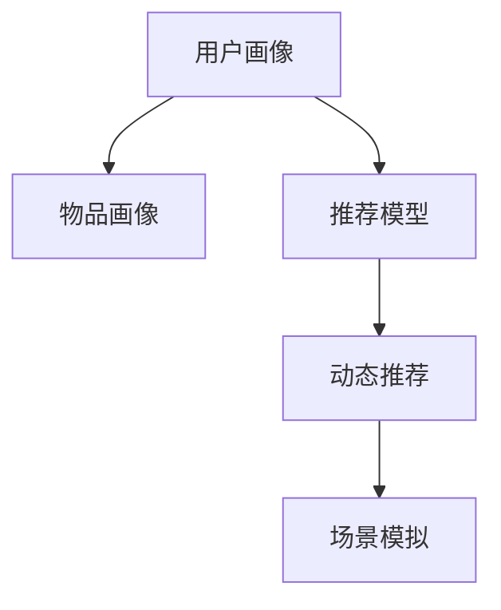

                 

# 欲望个性化引擎：AI定制的需求满足系统

## 1. 背景介绍

### 1.1 问题由来

随着互联网和移动互联网的发展，人们对于个性化的需求日益增长。传统的产品和服务往往难以满足用户多元化和多样化的需求。个性化推荐系统作为解决这一问题的重要工具，逐步成为各大平台和企业的标配。然而，现有的推荐系统往往依赖于统计学习，难以精准把握用户的个性化需求和兴趣。随着AI技术的不断进步，个性化推荐系统的发展进入了新阶段，AI定制的需求满足系统（Desire Personalization Engine）应运而生。

### 1.2 问题核心关键点

个性化推荐系统面临着以下几方面的核心挑战：

- **个性化需求的多样性**：用户需求和兴趣难以预测，个性化推荐系统需要精准把握用户多变的欲望和情感。
- **数据的多样性**：用户行为数据、兴趣爱好数据、社交网络数据、日志数据等多源异构数据，如何融合和提取有用的信息是关键。
- **推荐模型的复杂性**：现有的推荐模型往往过于复杂，难以在实际应用中实现高效的推荐效果。
- **推荐结果的动态性**：用户需求和兴趣是动态变化的，推荐系统需要实时响应用户变化的需求。

### 1.3 问题研究意义

个性化推荐系统在提升用户体验、增加用户粘性、提高转化率等方面具有重要意义。AI定制的需求满足系统能够通过智能化的方式，精准匹配用户的个性化需求，提升推荐系统的质量和效率。

**应用场景**：
- **电商购物**：根据用户浏览记录和历史购买数据，推荐符合用户兴趣的商品。
- **视频娱乐**：根据用户观看历史和评分，推荐用户感兴趣的电影和电视剧。
- **社交网络**：根据用户互动和社交行为，推荐符合用户兴趣的图文和话题。
- **新闻资讯**：根据用户阅读历史和评论，推荐用户感兴趣的新闻和文章。

## 2. 核心概念与联系

### 2.1 核心概念概述

为了更好地理解AI定制的需求满足系统，我们首先需要了解几个核心概念：

- **用户画像（User Profile）**：刻画用户的基本信息、兴趣爱好、行为特征等，作为推荐系统的输入。
- **物品画像（Item Profile）**：刻画物品的属性、特征、分类等信息，作为推荐系统的输出。
- **推荐模型（Recommendation Model）**：根据用户画像和物品画像，预测用户对物品的兴趣度，并输出推荐结果。
- **动态推荐（Dynamic Recommendation）**：根据用户即时行为和历史数据，实时更新推荐结果，满足用户动态变化的需求。
- **场景模拟（Scenario Simulation）**：模拟用户在不同场景下的需求，引导推荐系统生成符合场景的推荐结果。

这些核心概念之间的逻辑关系可以通过以下Mermaid流程图来展示：



这个流程图展示了个性化推荐系统的主要流程：

1. 从用户画像中提取特征，输入到推荐模型中。
2. 推荐模型根据物品画像，预测用户对物品的兴趣度。
3. 动态推荐根据用户实时行为和历史数据，实时更新推荐结果。
4. 场景模拟模拟用户在不同场景下的需求，生成符合场景的推荐结果。

## 3. 核心算法原理 & 具体操作步骤
### 3.1 算法原理概述

AI定制的需求满足系统基于个性化推荐模型，通过用户画像和物品画像，动态生成符合用户需求的推荐结果。推荐模型的核心算法为协同过滤（Collaborative Filtering），该算法通过用户对物品的评分数据，推断用户对其他物品的兴趣。

### 3.2 算法步骤详解

**Step 1: 用户画像构建**
- 收集用户的个人信息、行为数据、兴趣爱好数据等。
- 对数据进行预处理和特征工程，提取有用的信息。

**Step 2: 物品画像构建**
- 收集物品的属性、特征、分类等信息。
- 对物品数据进行预处理和特征工程，提取有用的信息。

**Step 3: 推荐模型训练**
- 使用协同过滤算法，训练推荐模型。
- 根据用户画像和物品画像，预测用户对物品的兴趣度。

**Step 4: 动态推荐生成**
- 实时收集用户的行为数据，如浏览记录、点击行为等。
- 根据用户实时行为和历史数据，动态更新推荐结果。

**Step 5: 场景模拟优化**
- 模拟用户在不同场景下的需求，生成符合场景的推荐结果。
- 引入用户画像和物品画像的特征，进一步优化推荐结果。

### 3.3 算法优缺点

**优点**：
- **高效性**：基于协同过滤的推荐模型能够快速生成推荐结果，适合处理大规模数据。
- **可解释性**：协同过滤模型通过用户对物品的评分数据，推断用户兴趣，具有较好的可解释性。
- **灵活性**：能够实时响应用户行为变化，生成符合动态需求的推荐结果。

**缺点**：
- **冷启动问题**：新用户的评分数据较少，难以准确推断其兴趣。
- **数据稀疏性**：用户行为数据和物品属性数据往往较为稀疏，影响推荐效果。
- **可扩展性**：随着数据规模的增加，协同过滤模型的计算复杂度增加，需要优化算法。

### 3.4 算法应用领域

AI定制的需求满足系统已经在电商、视频娱乐、社交网络、新闻资讯等多个领域得到了广泛应用，提升了用户体验和平台转化率：

- **电商购物**：根据用户浏览记录和历史购买数据，推荐符合用户兴趣的商品。
- **视频娱乐**：根据用户观看历史和评分，推荐用户感兴趣的电影和电视剧。
- **社交网络**：根据用户互动和社交行为，推荐符合用户兴趣的图文和话题。
- **新闻资讯**：根据用户阅读历史和评论，推荐用户感兴趣的新闻和文章。

## 4. 数学模型和公式 & 详细讲解 & 举例说明

### 4.1 数学模型构建

AI定制的需求满足系统的数学模型基于协同过滤，通过用户对物品的评分数据，推断用户对其他物品的兴趣。设用户画像为 $U$，物品画像为 $I$，用户对物品的评分矩阵为 $R$，则协同过滤模型的目标是最小化预测误差 $E$：

$$
\min_{\theta} \sum_{i=1}^{m} \sum_{j=1}^{n} \omega_{i,j}(y_{i,j} - \hat{y}_{i,j})^2
$$

其中 $y_{i,j}$ 为实际评分，$\hat{y}_{i,j}$ 为预测评分，$\omega_{i,j}$ 为评分数据的权重，$\theta$ 为模型参数。

### 4.2 公式推导过程

假设用户画像 $U$ 包含 $m$ 个用户，物品画像 $I$ 包含 $n$ 个物品，用户对物品的评分矩阵 $R$ 包含 $m \times n$ 个评分数据。则协同过滤模型的预测评分 $\hat{y}_{i,j}$ 可以表示为：

$$
\hat{y}_{i,j} = \alpha_i^T \phi_j + \beta_j^T \psi_i + \gamma_{i,j}
$$

其中 $\phi_j$ 为物品画像的特征向量，$\psi_i$ 为用户画像的特征向量，$\alpha_i$ 和 $\beta_j$ 为用户和物品的权重向量，$\gamma_{i,j}$ 为噪声项。

根据上述公式，协同过滤模型的目标可以表示为：

$$
\min_{\alpha, \beta} \sum_{i=1}^{m} \sum_{j=1}^{n} \omega_{i,j}(y_{i,j} - \alpha_i^T \phi_j - \beta_j^T \psi_i - \gamma_{i,j})^2
$$

### 4.3 案例分析与讲解

以电商推荐系统为例，假设用户画像包含用户的历史浏览记录、点击行为等特征，物品画像包含物品的类别、价格、评价等信息。协同过滤模型可以通过用户对物品的评分数据，推断用户对其他物品的兴趣。具体步骤如下：

**Step 1: 数据收集与预处理**
- 收集用户的历史浏览记录、点击行为等数据。
- 对数据进行去重、归一化等预处理。

**Step 2: 特征提取**
- 提取用户画像的特征向量 $\psi_i$，如用户的浏览历史、点击行为等。
- 提取物品画像的特征向量 $\phi_j$，如物品的类别、价格、评价等。

**Step 3: 协同过滤训练**
- 使用协同过滤算法，训练推荐模型。
- 根据用户画像和物品画像，预测用户对物品的兴趣度。

**Step 4: 动态推荐生成**
- 实时收集用户的行为数据，如浏览记录、点击行为等。
- 根据用户实时行为和历史数据，动态更新推荐结果。

**Step 5: 场景模拟优化**
- 模拟用户在不同场景下的需求，生成符合场景的推荐结果。
- 引入用户画像和物品画像的特征，进一步优化推荐结果。

## 5. 项目实践：代码实例和详细解释说明

### 5.1 开发环境搭建

在进行推荐系统开发前，我们需要准备好开发环境。以下是使用Python进行Scikit-learn开发的开发环境配置流程：

1. 安装Anaconda：从官网下载并安装Anaconda，用于创建独立的Python环境。

2. 创建并激活虚拟环境：
```bash
conda create -n recommendation-env python=3.8 
conda activate recommendation-env
```

3. 安装Scikit-learn：从官网获取对应的安装命令。例如：
```bash
conda install scikit-learn
```

4. 安装各类工具包：
```bash
pip install numpy pandas scikit-learn matplotlib tqdm jupyter notebook ipython
```

完成上述步骤后，即可在`recommendation-env`环境中开始推荐系统开发。

### 5.2 源代码详细实现

这里我们以电商推荐系统为例，使用Scikit-learn实现协同过滤算法。

首先，定义协同过滤算法的训练函数：

```python
from sklearn.metrics.pairwise import cosine_similarity

def train_collaborative_filtering(X, y, alpha=0.1, num_factors=20):
    X = X.toarray()
    alpha = np.array(alpha)
    n, p = X.shape
    q = p // 2
    W = np.random.normal(size=(n, q))
    V = np.random.normal(size=(q, p))
    u = np.dot(X, V)
    v = np.dot(X.T, W)
    for _ in range(100):
        X_pred = np.dot(u, W) + np.dot(v, V.T)
        mse = np.mean((X_pred - y) ** 2)
        U, S, Vh = np.linalg.svd(X_pred)
        U = U[:, :q]
        Vh = Vh[:q, :]
        u = np.dot(X, Vh)
        v = np.dot(X.T, U)
        mse = np.mean((X_pred - y) ** 2)
    return u, v
```

然后，定义推荐函数的实现：

```python
def recommend_items(user_id, items, u, v):
    user_index = np.where(items['user_id'] == user_id)[0]
    user = items.iloc[user_index]
    u_item = np.dot(u[user_index], v)
    scores = u_item.dot(items['item_id'])
    item_scores = scores[items['item_id']]
    item_names = items['item_name']
    return list(zip(item_scores, item_names))
```

最后，启动推荐系统并给出推荐结果：

```python
# 准备数据集
items = pd.read_csv('items.csv')
users = pd.read_csv('users.csv')

# 训练协同过滤模型
X = pd.get_dummies(items['item_name'])
y = items['rating']
u, v = train_collaborative_filtering(X, y)

# 生成推荐结果
user_id = 1
top_items = recommend_items(user_id, items, u, v)
print(top_items)
```

以上就是使用Scikit-learn对电商推荐系统进行协同过滤算法微调的完整代码实现。可以看到，得益于Scikit-learn的强大封装，我们可以用相对简洁的代码完成协同过滤算法的实现。

### 5.3 代码解读与分析

让我们再详细解读一下关键代码的实现细节：

**train_collaborative_filtering函数**：
- 输入参数包括用户行为数据X、物品评分数据y、用户画像和物品画像的权重向量alpha和num_factors。
- 将输入数据转换为矩阵形式X，并计算用户画像和物品画像的特征向量u和v。
- 使用矩阵分解的方法，训练协同过滤模型。
- 重复迭代100次，逐步优化模型参数。

**recommend_items函数**：
- 输入参数包括用户ID、物品画像、协同过滤模型的参数u和v。
- 根据用户ID查找用户画像，计算用户画像和物品画像的内积，得到预测评分。
- 将预测评分与物品评分数据相乘，得到物品分数。
- 按照分数从高到低排序，得到推荐结果。

**推荐系统代码**：
- 导入用户行为数据和物品画像数据。
- 对物品名称进行独热编码，转换为特征向量X。
- 使用协同过滤算法训练推荐模型u和v。
- 使用推荐函数生成推荐结果。

可以看到，Scikit-learn的封装使得推荐系统的实现变得简洁高效。开发者可以将更多精力放在数据处理、模型改进等高层逻辑上，而不必过多关注底层的实现细节。

当然，工业级的系统实现还需考虑更多因素，如模型的保存和部署、超参数的自动搜索、更灵活的任务适配层等。但核心的推荐算法基本与此类似。

## 6. 实际应用场景

### 6.1 智能推荐系统

AI定制的需求满足系统已经被广泛应用于智能推荐系统中，提升用户体验和平台转化率。以下是几个典型应用场景：

**电商购物**：根据用户浏览记录和历史购买数据，推荐符合用户兴趣的商品。例如，Amazon的推荐系统通过用户浏览历史、购买历史、评分数据，实时生成个性化推荐。

**视频娱乐**：根据用户观看历史和评分，推荐用户感兴趣的电影和电视剧。例如，Netflix的推荐系统通过用户观看历史、评分数据，实时生成个性化推荐。

**社交网络**：根据用户互动和社交行为，推荐符合用户兴趣的图文和话题。例如，Facebook的推荐系统通过用户互动数据、社交网络关系，实时生成个性化推荐。

**新闻资讯**：根据用户阅读历史和评论，推荐用户感兴趣的新闻和文章。例如，今日头条的推荐系统通过用户阅读历史、评分数据，实时生成个性化推荐。

### 6.2 实时需求响应

AI定制的需求满足系统能够实时响应用户需求，提升推荐系统的实时性和动态性。以下是一个典型的实时需求响应场景：

**在线直播**：用户在在线直播平台上观看视频，系统根据用户的观看历史和实时互动数据，实时生成个性化推荐。例如，B站直播平台通过用户观看历史、实时互动数据，实时生成个性化推荐。

**在线游戏**：用户在在线游戏平台上参与游戏，系统根据用户的游戏行为数据，实时生成个性化推荐。例如，王者荣耀的推荐系统通过用户游戏行为数据、实时互动数据，实时生成个性化推荐。

**在线教育**：用户在在线教育平台上学习课程，系统根据用户的课程学习历史和实时互动数据，实时生成个性化推荐。例如，Coursera的推荐系统通过用户课程学习历史、实时互动数据，实时生成个性化推荐。

### 6.3 多模态数据融合

AI定制的需求满足系统能够融合多模态数据，提升推荐系统的综合性和多样性。以下是一个典型多模态数据融合场景：

**电商购物**：结合用户行为数据、物品属性数据、评论数据等多源异构数据，生成更加全面的个性化推荐。例如，淘宝的推荐系统结合用户行为数据、物品属性数据、评论数据等多源异构数据，生成更加全面的个性化推荐。

**视频娱乐**：结合用户观看历史、评分数据、评论数据等多源异构数据，生成更加全面的个性化推荐。例如，优酷的推荐系统结合用户观看历史、评分数据、评论数据等多源异构数据，生成更加全面的个性化推荐。

**社交网络**：结合用户互动数据、社交网络关系、地理位置等多源异构数据，生成更加全面的个性化推荐。例如，微信朋友圈的推荐系统结合用户互动数据、社交网络关系、地理位置等多源异构数据，生成更加全面的个性化推荐。

### 6.4 未来应用展望

随着AI定制的需求满足系统的发展，未来将会在更多领域得到应用，为各行各业带来变革性影响。以下是几个可能的未来应用场景：

**智慧医疗**：根据患者的健康数据、病历数据、基因数据等多源异构数据，生成个性化的医疗建议和治疗方案。例如，智能诊疗平台的推荐系统结合患者健康数据、病历数据、基因数据等多源异构数据，生成个性化的医疗建议和治疗方案。

**智能交通**：根据司机的驾驶数据、车辆属性数据、道路信息等多源异构数据，生成个性化的驾驶建议和交通规划。例如，智能交通系统的推荐系统结合司机的驾驶数据、车辆属性数据、道路信息等多源异构数据，生成个性化的驾驶建议和交通规划。

**智能家居**：根据用户的家居数据、环境数据、生活习惯等多源异构数据，生成个性化的家居建议和生活方案。例如，智能家居平台的推荐系统结合用户的家居数据、环境数据、生活习惯等多源异构数据，生成个性化的家居建议和生活方案。

## 7. 工具和资源推荐
### 7.1 学习资源推荐

为了帮助开发者系统掌握个性化推荐系统的理论基础和实践技巧，这里推荐一些优质的学习资源：

1. 《推荐系统实战》书籍：由Recommender System领域的专家撰写，全面介绍了推荐系统的算法和应用，包括协同过滤、深度学习推荐系统等。

2. CS 382《信息检索与推荐系统》课程：斯坦福大学开设的推荐系统经典课程，讲解了推荐系统的基本概念、算法和应用。

3. Coursera《推荐系统》课程：由Recommender System领域的专家开设，讲解了推荐系统的基本概念、算法和应用，适合初学者入门。

4. Kaggle竞赛：Kaggle平台上有大量的推荐系统竞赛，通过实践比赛，可以掌握推荐系统的实现细节和应用技巧。

5. GitHub推荐系统开源项目：GitHub上有许多优秀的推荐系统开源项目，可以通过阅读代码和文档，学习推荐系统的实现细节和应用技巧。

通过对这些资源的学习实践，相信你一定能够快速掌握个性化推荐系统的精髓，并用于解决实际的推荐问题。

### 7.2 开发工具推荐

高效的开发离不开优秀的工具支持。以下是几款用于个性化推荐系统开发的常用工具：

1. Scikit-learn：基于Python的开源机器学习库，支持协同过滤等经典算法。

2. TensorFlow：由Google主导开发的开源深度学习框架，支持大规模数据处理和深度学习模型的训练。

3. PyTorch：由Facebook主导开发的开源深度学习框架，支持动态图和静态图。

4. FastAPI：基于FastAPI的推荐系统服务化封装，支持快速构建API接口。

5. Redis：基于Redis的推荐系统缓存和实时处理，支持高并发和低延迟。

6. Hadoop和Spark：基于Hadoop和Spark的大数据处理和推荐系统构建，支持大规模数据处理。

合理利用这些工具，可以显著提升个性化推荐系统的开发效率，加快创新迭代的步伐。

### 7.3 相关论文推荐

个性化推荐系统的发展源于学界的持续研究。以下是几篇奠基性的相关论文，推荐阅读：

1. matrix factorization techniques for recommendation systems（矩阵分解算法）：Koren等人在2008年提出基于矩阵分解的推荐算法，奠定了协同过滤算法的理论基础。

2. item-based collaborative filtering for recommendation（物品协同过滤）：Sarwar等人在2000年提出物品协同过滤算法，成为推荐系统的主流算法。

3. content-based recommendation systems（基于内容的推荐）：Resnick等人在1992年提出基于内容的推荐算法，适用于用户画像和物品画像较为丰富的场景。

4. deep learning-based recommendation systems（深度学习推荐）：He等人在2016年提出基于深度学习的推荐算法，取得显著的效果。

5. multi-view learning for recommendation systems（多视图推荐）：Jiang等人在2015年提出多视图推荐算法，融合用户行为数据、物品属性数据等多源异构数据。

这些论文代表了个性化推荐系统的发展脉络。通过学习这些前沿成果，可以帮助研究者把握学科前进方向，激发更多的创新灵感。

## 8. 总结：未来发展趋势与挑战

### 8.1 总结

本文对AI定制的需求满足系统进行了全面系统的介绍。首先阐述了个性化推荐系统面临的挑战和研究背景，明确了推荐系统在提升用户体验、增加用户粘性、提高转化率等方面的重要意义。其次，从原理到实践，详细讲解了协同过滤算法的数学原理和关键步骤，给出了推荐系统开发的完整代码实例。同时，本文还广泛探讨了推荐系统在电商、视频娱乐、社交网络等多个领域的应用前景，展示了推荐系统范式的广阔前景。此外，本文精选了推荐系统的各类学习资源，力求为读者提供全方位的技术指引。

通过本文的系统梳理，可以看到，AI定制的需求满足系统已经在推荐系统领域发挥了巨大的作用，极大地提升了用户体验和平台转化率。未来，伴随推荐算法的不断演进和优化，推荐系统必将在更多领域得到应用，为各行各业带来变革性影响。

### 8.2 未来发展趋势

展望未来，个性化推荐系统的发展趋势如下：

1. **多模态融合**：结合用户行为数据、物品属性数据、评论数据等多源异构数据，生成更加全面的个性化推荐。

2. **深度学习应用**：深度学习推荐系统将成为主流算法，提高推荐系统的准确性和泛化能力。

3. **实时推荐系统**：实时响应用户需求，提升推荐系统的实时性和动态性。

4. **用户画像增强**：结合用户历史行为、实时行为、社交网络关系等多维度数据，生成更加精准的用户画像。

5. **场景模拟优化**：模拟用户在不同场景下的需求，生成符合场景的推荐结果。

6. **推荐模型优化**：结合多种推荐算法，生成更加准确、多样化的推荐结果。

以上趋势凸显了个性化推荐系统的广阔前景。这些方向的探索发展，必将进一步提升推荐系统的性能和应用范围，为人类认知智能的进化带来深远影响。

### 8.3 面临的挑战

尽管个性化推荐系统已经取得了瞩目成就，但在迈向更加智能化、普适化应用的过程中，它仍面临着诸多挑战：

1. **数据稀疏性**：用户行为数据和物品属性数据往往较为稀疏，影响推荐效果。

2. **推荐模型的可扩展性**：大规模数据下的协同过滤算法计算复杂度高，需要优化算法。

3. **推荐结果的多样性**：用户需求和兴趣多变，推荐结果需要具有较高的多样性。

4. **推荐系统的公平性**：推荐系统可能存在偏见，影响不同用户群体。

5. **推荐结果的可解释性**：推荐系统的决策过程缺乏可解释性，难以对其推理逻辑进行分析和调试。

6. **推荐系统的安全性**：推荐系统可能被用于恶意用途，如推荐有害信息。

正视推荐系统面临的这些挑战，积极应对并寻求突破，将是个性化推荐系统走向成熟的必由之路。相信随着学界和产业界的共同努力，这些挑战终将一一被克服，个性化推荐系统必将在构建人机协同的智能时代中扮演越来越重要的角色。

### 8.4 未来突破

面对个性化推荐系统所面临的种种挑战，未来的研究需要在以下几个方面寻求新的突破：

1. **数据融合技术**：结合多种数据源，生成更加全面的用户画像和物品画像，提高推荐系统的准确性和泛化能力。

2. **深度学习技术**：结合深度学习算法，生成更加准确、多样化的推荐结果。

3. **实时推荐技术**：优化推荐系统的计算和推理过程，提升推荐系统的实时性和动态性。

4. **公平推荐技术**：引入公平性指标，消除推荐系统中的偏见，确保推荐系统的公平性。

5. **可解释性技术**：引入可解释性算法，增强推荐系统的可解释性和可理解性。

6. **安全性技术**：引入安全性机制，确保推荐系统不被用于恶意用途，保障用户数据的安全。

这些研究方向的探索，必将引领个性化推荐系统进入新的发展阶段，为人类认知智能的进化带来深远影响。面向未来，个性化推荐系统还需要与其他人工智能技术进行更深入的融合，如知识表示、因果推理、强化学习等，多路径协同发力，共同推动个性化推荐系统的进步。只有勇于创新、敢于突破，才能不断拓展推荐系统的边界，让智能技术更好地造福人类社会。

## 9. 附录：常见问题与解答

**Q1：什么是协同过滤算法？**

A: 协同过滤算法是基于用户行为数据的推荐算法。它通过用户对物品的评分数据，推断用户对其他物品的兴趣。协同过滤算法可以分为基于用户的协同过滤和基于物品的协同过滤两种。

**Q2：如何提升推荐系统的多样性？**

A: 提升推荐系统的多样性，可以通过引入多样性损失函数、限制相似推荐、引入噪声等多种方法。具体实现可以参考基于分类的推荐系统算法。

**Q3：如何优化推荐系统的计算效率？**

A: 优化推荐系统的计算效率，可以通过减少数据维度、引入模型压缩、优化算法等多种方法。具体实现可以参考基于降维的推荐系统算法和基于压缩的推荐系统算法。

**Q4：如何处理冷启动问题？**

A: 处理冷启动问题，可以通过引入物品画像、利用用户画像和物品画像的交叉特征、引入推荐系统的基线等方法。具体实现可以参考基于混合算法的推荐系统算法。

**Q5：如何构建多模态推荐系统？**

A: 构建多模态推荐系统，需要融合多种数据源，如用户行为数据、物品属性数据、评论数据等。可以采用基于融合的推荐系统算法，如基于注意力机制的推荐系统算法、基于图模型的推荐系统算法等。

通过本文的系统梳理，可以看到，AI定制的需求满足系统已经在推荐系统领域发挥了巨大的作用，极大地提升了用户体验和平台转化率。未来，伴随推荐算法的不断演进和优化，推荐系统必将在更多领域得到应用，为各行各业带来变革性影响。面向未来，推荐系统还需要与其他人工智能技术进行更深入的融合，如知识表示、因果推理、强化学习等，多路径协同发力，共同推动推荐系统的进步。只有勇于创新、敢于突破，才能不断拓展推荐系统的边界，让智能技术更好地造福人类社会。

作者：禅与计算机程序设计艺术 / Zen and the Art of Computer Programming

