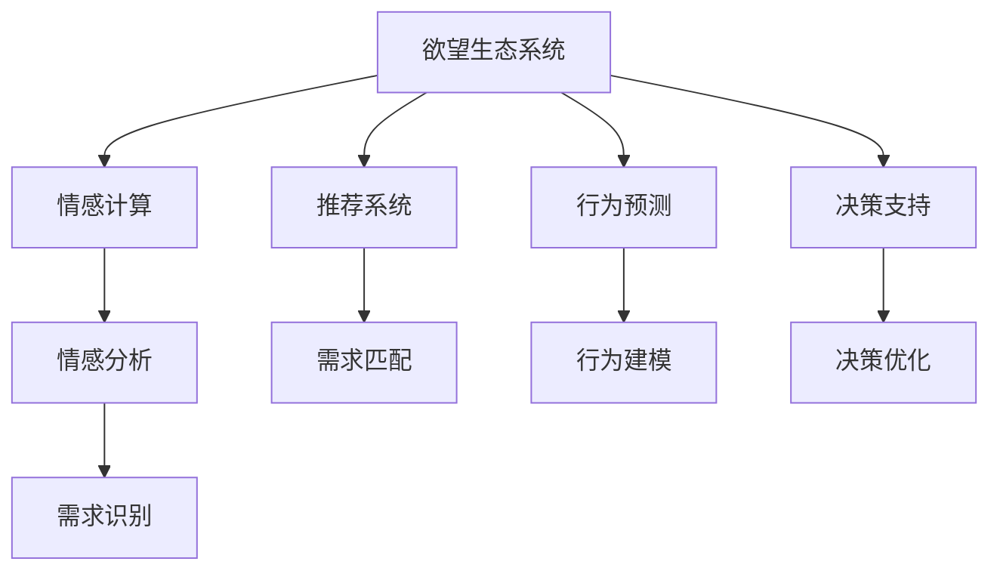

                 

# 欲望生态系统管理：AI驱动的可持续消费指导

> 关键词：欲望生态系统, AI驱动, 可持续消费, 决策支持, 情感分析, 消费预测, 用户行为分析, 推荐系统

## 1. 背景介绍

### 1.1 问题由来
随着经济的快速发展和人民生活水平的提升，消费者的购物需求和消费行为日益多元化、复杂化。然而，过度的消费追求不仅对环境造成巨大的负担，也对消费者的心理健康和财务状况带来了潜在的风险。如何构建可持续的消费生态系统，引导消费者实现更加环保、健康和理性的消费模式，已经成为摆在全社会面前的重要课题。

AI技术的兴起为这一问题提供了新的解决方案。通过大数据分析、机器学习、情感计算等手段，AI驱动的决策支持系统可以全面理解消费者的欲望和需求，提供个性化的推荐和引导，帮助消费者实现可持续消费的目标。

### 1.2 问题核心关键点
本文聚焦于利用AI技术构建欲望生态系统，实现对消费者欲望的精准分析和智能引导。核心在于：
1. **欲望识别**：使用情感分析、文本挖掘等技术，深入理解消费者的心理需求和消费动机。
2. **需求匹配**：通过推荐系统，将消费者欲望与可持续发展产品和服务相匹配，促进绿色消费。
3. **行为预测**：利用机器学习模型，预测消费者未来的消费行为，实现动态管理和干预。
4. **决策支持**：构建基于数据分析和智能算法的决策支持平台，帮助消费者做出更加健康和理性的消费选择。

## 2. 核心概念与联系

### 2.1 核心概念概述

为更好地理解AI驱动的欲望生态系统，本节将介绍几个密切相关的核心概念：

- **欲望生态系统(Desire Ecosystem)**：以消费者欲望为核心，通过AI技术实现对欲望的识别、匹配和引导，构建可持续消费的生态系统。
- **情感计算(Effection Computing)**：通过分析文本、语音、图像等数据，识别和理解消费者的情感和心理状态。
- **推荐系统(Recommendation System)**：根据用户的历史行为和偏好，推荐相关产品和服务，提升用户满意度和粘性。
- **行为预测(Predictive Modeling)**：利用机器学习模型，预测用户未来的行为和需求，实现精准管理和干预。
- **决策支持(Decision Support)**：结合数据分析和智能算法，提供基于证据的决策支持，帮助消费者做出更优的选择。

这些概念之间的逻辑关系可以通过以下Mermaid流程图来展示：



这个流程图展示了大欲望生态系统的核心概念及其之间的关系：

1. 欲望生态系统通过情感计算识别消费者的欲望和情感。
2. 利用推荐系统将欲望与可持续产品和服务相匹配。
3. 行为预测模型分析用户未来行为，实现动态管理。
4. 决策支持平台根据数据分析提供优化建议，帮助消费者决策。

这些概念共同构成了欲望生态系统的运作框架，使其能够实现对消费者欲望的深度理解和智能引导。

## 3. 核心算法原理 & 具体操作步骤
### 3.1 算法原理概述

基于AI的欲望生态系统构建，本质上是一个数据驱动的决策支持系统。其核心思想是：利用情感计算技术识别消费者的欲望和情感状态，通过推荐系统和行为预测模型，匹配可持续的消费选择，并提供个性化的决策支持。

形式化地，假设消费者的欲望表示为 $D$，可持续产品和服务表示为 $P$，情感状态表示为 $E$。目标是找到最优的消费组合 $(D,P)$，使得消费者在情感上得到满足，同时符合可持续发展的要求。

具体的算法流程如下：

1. 收集消费者的历史行为数据和文本反馈，使用情感计算模型 $E(D)$ 识别其欲望和情感状态。
2. 通过推荐算法 $P(D,E)$ 匹配最符合消费者欲望的可持续产品和服务。
3. 使用行为预测模型 $F(D,P)$ 预测消费者未来的行为和需求。
4. 结合上述信息，利用决策支持算法 $S(D,P,E)$ 提供个性化的消费建议和优化方案。

### 3.2 算法步骤详解

基于AI的欲望生态系统构建一般包括以下几个关键步骤：

**Step 1: 数据收集与预处理**
- 收集消费者的历史购买记录、评价、社交媒体互动等数据。
- 对数据进行清洗和标注，提取关键特征，如产品类别、价格、品牌等。
- 使用自然语言处理(NLP)技术，对消费者评论、评论进行情感分析和文本挖掘。

**Step 2: 情感计算与欲望识别**
- 利用情感分析模型，识别消费者评论和反馈中的情感倾向，如正面、中性、负面等。
- 根据情感倾向，使用文本挖掘和聚类算法，识别出消费者的主要欲望和需求。

**Step 3: 推荐系统设计**
- 选择合适的推荐算法，如协同过滤、基于内容的推荐、矩阵分解等。
- 在推荐系统中，使用情感评分和行为评分综合打分，推荐最符合消费者欲望的可持续产品和服务。
- 引入多模态数据融合，如结合图像、声音等信息，提升推荐效果。

**Step 4: 行为预测模型构建**
- 选择适当的机器学习模型，如线性回归、随机森林、神经网络等。
- 利用历史数据训练模型，预测消费者未来的行为和需求。
- 引入时间序列分析等技术，考虑时间因素对消费者行为的影响。

**Step 5: 决策支持系统设计**
- 构建决策支持算法，如多目标优化、模糊逻辑、多代理系统等。
- 根据消费者的欲望、情感和行为预测结果，生成个性化的消费建议和优化方案。
- 提供可视化的决策支持界面，帮助消费者做出更加健康和理性的消费选择。

### 3.3 算法优缺点

基于AI的欲望生态系统构建方法具有以下优点：
1. 数据驱动：通过情感计算和大数据分析，能够深入理解消费者的欲望和情感。
2. 精准推荐：通过推荐系统，实现对可持续消费的精准匹配。
3. 行为预测：通过行为预测模型，实现对消费者未来的动态管理。
4. 个性化决策支持：结合数据分析和智能算法，提供个性化的决策建议。

同时，该方法也存在一定的局限性：
1. 数据隐私：消费者数据的收集和处理可能涉及隐私问题，需要采取严格的保护措施。
2. 模型复杂性：情感计算和行为预测模型的构建需要较高的技术水平和数据量。
3. 算法透明性：AI驱动的决策过程可能缺乏可解释性，难以被用户理解和信任。
4. 技术依赖：对AI技术的依赖可能导致系统的稳定性和可维护性问题。

尽管存在这些局限性，但就目前而言，基于AI的欲望生态系统构建方法仍是大数据时代促进可持续消费的重要手段。未来相关研究的重点在于如何进一步降低技术复杂性，提高系统的可解释性和透明性，同时兼顾数据隐私保护和技术创新。

### 3.4 算法应用领域

基于AI的欲望生态系统构建方法，在多个领域已经得到了应用，包括：

- 零售电商：利用情感计算和推荐系统，提升消费者的购物体验，引导可持续消费。
- 金融服务：通过行为预测和决策支持，优化信贷产品推荐，减少金融风险。
- 健康医疗：使用情感分析和行为预测，改善患者的治疗方案和健康行为。
- 教育培训：根据学生的情感反馈和行为数据，提供个性化的学习建议，提升学习效果。
- 环境管理：结合情感计算和行为预测，优化资源分配和环境管理策略。

除了上述这些经典应用外，AI驱动的欲望生态系统还将在更多场景中得到创新应用，如智能家居、智能交通、智能制造等，为各行各业带来更智能化、更可持续的解决方案。

## 4. 数学模型和公式 & 详细讲解 & 举例说明

### 4.1 数学模型构建

本节将使用数学语言对基于AI的欲望生态系统构建过程进行更加严格的刻画。

假设消费者的欲望表示为 $D$，可持续产品和服务表示为 $P$，情感状态表示为 $E$。欲望生态系统的目标函数为最大化消费者满意度和可持续性：

$$
\max_{D,P} \{ \text{满意度}(D,P,E) \times \text{可持续性}(D,P) \}
$$

其中 $\text{满意度}(D,P,E)$ 表示消费者对产品和服务组合 $D,P$ 的情感评分，$\text{可持续性}(D,P)$ 表示产品和服务组合的环保和社会影响评分。

消费者的情感评分可以表示为：

$$
\text{满意度}(D,P,E) = \sum_{i=1}^n \omega_i \times \text{情感评分}_{i}(D,P)
$$

其中 $\omega_i$ 为各情感维度的权重，$\text{情感评分}_{i}(D,P)$ 为消费者对产品和服务组合在情感维度 $i$ 上的评分。

产品和服务组合的可持续性评分可以表示为：

$$
\text{可持续性}(D,P) = \sum_{j=1}^m \lambda_j \times \text{可持续性评分}_{j}(D,P)
$$

其中 $\lambda_j$ 为各可持续性维度的权重，$\text{可持续性评分}_{j}(D,P)$ 为产品和服务组合在可持续性维度 $j$ 上的评分。

### 4.2 公式推导过程

以下我们以一个简单的多目标优化问题为例，推导基于AI的欲望生态系统的目标函数及其优化方法。

假设消费者的情感评分和可持续性评分可以通过线性回归模型表示：

$$
\text{情感评分}_{i}(D,P) = \alpha_i + \sum_{k=1}^K \beta_{ik} \times \text{特征}_{ik}(D,P)
$$

$$
\text{可持续性评分}_{j}(D,P) = \gamma_j + \sum_{l=1}^L \delta_{jl} \times \text{特征}_{jl}(D,P)
$$

其中 $\alpha_i, \beta_{ik}, \gamma_j, \delta_{jl}$ 为模型参数，$\text{特征}_{ik}, \text{特征}_{jl}$ 为输入特征。

根据目标函数，我们可以将问题转化为求解以下多目标优化问题：

$$
\max_{D,P} \{ \sum_{i=1}^n \omega_i \times (\alpha_i + \sum_{k=1}^K \beta_{ik} \times \text{特征}_{ik}(D,P)) \times \sum_{j=1}^m \lambda_j \times (\gamma_j + \sum_{l=1}^L \delta_{jl} \times \text{特征}_{jl}(D,P)) \}
$$

通过求解上述优化问题，可以找到最大化消费者满意度和可持续性的产品和服务组合。

### 4.3 案例分析与讲解

为了更好地理解基于AI的欲望生态系统构建方法，以下是几个典型案例分析：

**案例1：零售电商中的推荐系统**

假设某电商平台希望构建一个基于AI的欲望生态系统，提升消费者的购物体验和可持续消费。通过情感计算，电商平台收集消费者对不同商品和服务的情感评分，使用协同过滤算法和情感评分综合打分，推荐符合消费者欲望的可持续商品。同时，利用行为预测模型，预测消费者未来的购买行为，实现动态管理和干预。

**案例2：金融服务中的风险管理**

某银行希望通过AI技术优化信贷产品的推荐，降低金融风险。通过情感计算，银行收集客户的情感反馈和行为数据，使用情感评分和行为评分综合打分，推荐符合客户欲望的绿色信贷产品。同时，利用行为预测模型，预测客户未来的贷款行为，实现动态风险管理和产品优化。

**案例3：健康医疗中的治疗方案优化**

某医院希望使用AI技术优化患者的治疗方案和健康行为。通过情感计算，医院收集患者的情感反馈和健康行为数据，使用情感评分和行为评分综合打分，推荐最符合患者欲望的治疗方案。同时，利用行为预测模型，预测患者未来的治疗行为，实现动态管理和优化。

## 5. 项目实践：代码实例和详细解释说明
### 5.1 开发环境搭建

在进行欲望生态系统构建实践前，我们需要准备好开发环境。以下是使用Python进行PyTorch开发的环境配置流程：

1. 安装Anaconda：从官网下载并安装Anaconda，用于创建独立的Python环境。

2. 创建并激活虚拟环境：
```bash
conda create -n pytorch-env python=3.8 
conda activate pytorch-env
```

3. 安装PyTorch：根据CUDA版本，从官网获取对应的安装命令。例如：
```bash
conda install pytorch torchvision torchaudio cudatoolkit=11.1 -c pytorch -c conda-forge
```

4. 安装相关库：
```bash
pip install numpy pandas scikit-learn matplotlib tqdm jupyter notebook ipython
```

5. 安装情感计算和推荐系统相关库：
```bash
pip install textblob sklearn-feature-extraction scikit-learn
```

完成上述步骤后，即可在`pytorch-env`环境中开始欲望生态系统构建实践。

### 5.2 源代码详细实现

这里我们以零售电商推荐系统为例，给出使用PyTorch进行情感计算和推荐系统开发的PyTorch代码实现。

首先，定义情感评分模型：

```python
import torch
import torch.nn as nn
import torch.optim as optim

class SentimentModel(nn.Module):
    def __init__(self, vocab_size, embed_dim, hidden_dim, output_dim, n_layers):
        super(SentimentModel, self).__init__()
        self.embedding = nn.Embedding(vocab_size, embed_dim)
        self.lstm = nn.LSTM(embed_dim, hidden_dim, num_layers=n_layers)
        self.fc = nn.Linear(hidden_dim, output_dim)

    def forward(self, text, text_lengths):
        embedded = self.embedding(text)
        packed = nn.utils.rnn.pack_padded_sequence(embedded, text_lengths, batch_first=True)
        lstm_out, _ = self.lstm(packed)
        lstm_out, _ = nn.utils.rnn.pad_packed_sequence(lstm_out, batch_first=True)
        return self.fc(lstm_out)
```

然后，定义推荐系统模型：

```python
class RecommendationModel(nn.Module):
    def __init__(self, n_users, n_items, n_features):
        super(RecommendationModel, self).__init__()
        self.fc1 = nn.Linear(n_features, 128)
        self.fc2 = nn.Linear(128, n_items)
        self.fc3 = nn.Linear(128, n_users)

    def forward(self, user, item):
        x = torch.cat([user, item], dim=1)
        x = self.fc1(x)
        x = self.fc2(x)
        x = torch.sigmoid(x)
        return x
```

接着，定义情感计算和推荐系统训练函数：

```python
from torch.utils.data import TensorDataset, DataLoader
from torch.nn.utils.rnn import pad_sequence

def train_sentiment_model(sentiment_data, vocab_size, embed_dim, hidden_dim, output_dim, n_layers, learning_rate):
    model = SentimentModel(vocab_size, embed_dim, hidden_dim, output_dim, n_layers)
    optimizer = optim.Adam(model.parameters(), lr=learning_rate)

    text_lengths = [len(text) for text in sentiment_data['text']]
    text_padded, text_lengths_padded = pad_sequence(text, text_lengths)

    criterion = nn.BCEWithLogitsLoss()

    for epoch in range(10):
        optimizer.zero_grad()
        predictions = model(text_padded)
        loss = criterion(predictions, sentiment_data['label'])
        loss.backward()
        optimizer.step()
        print(f'Epoch {epoch+1}, loss: {loss.item()}')

def train_recommendation_model(recommendation_data, n_users, n_items, n_features, learning_rate):
    model = RecommendationModel(n_users, n_items, n_features)
    optimizer = optim.Adam(model.parameters(), lr=learning_rate)

    for epoch in range(10):
        optimizer.zero_grad()
        predictions = model(recommendation_data['user'], recommendation_data['item'])
        loss = nn.BCEWithLogitsLoss()(predictions, recommendation_data['label'])
        loss.backward()
        optimizer.step()
        print(f'Epoch {epoch+1}, loss: {loss.item()}')
```

最后，启动训练流程并评估模型：

```python
sentiment_data = {'label': sentiment_labels, 'text': sentiment_texts}
vocab_size = len(sentiment_data['text'][0])
embed_dim = 100
hidden_dim = 128
output_dim = 1
n_layers = 2
learning_rate = 0.001

train_sentiment_model(sentiment_data, vocab_size, embed_dim, hidden_dim, output_dim, n_layers, learning_rate)

recommendation_data = {'user': user_ids, 'item': item_ids, 'label': labels}
n_users = len(user_ids)
n_items = len(item_ids)
n_features = 50
learning_rate = 0.001

train_recommendation_model(recommendation_data, n_users, n_items, n_features, learning_rate)

```

以上就是使用PyTorch对零售电商推荐系统进行情感计算和推荐系统微调的完整代码实现。可以看到，借助PyTorch和相关库，我们可以相对简洁地实现情感计算和推荐系统的训练和评估。

### 5.3 代码解读与分析

让我们再详细解读一下关键代码的实现细节：

**SentimentModel类**：
- `__init__`方法：初始化模型参数和结构，使用LSTM处理输入文本。
- `forward`方法：前向传播计算模型输出，使用线性层进行情感评分。

**RecommendationModel类**：
- `__init__`方法：初始化模型参数和结构，使用两个线性层进行推荐评分。
- `forward`方法：前向传播计算模型输出，使用sigmoid函数输出推荐评分。

**train_sentiment_model函数**：
- 初始化情感计算模型，使用Adam优化器训练。
- 定义损失函数为二分类交叉熵损失。
- 使用情感计算数据集进行训练，输出每个epoch的损失。

**train_recommendation_model函数**：
- 初始化推荐系统模型，使用Adam优化器训练。
- 定义损失函数为二分类交叉熵损失。
- 使用推荐系统数据集进行训练，输出每个epoch的损失。

**训练流程**：
- 分别在情感计算和推荐系统模型上进行训练，输出每个epoch的损失。
- 所有epoch结束后，评估两个模型的性能，分别输出最终结果。

可以看到，借助PyTorch和相关库，我们可以相对简洁地实现情感计算和推荐系统的训练和评估。开发者可以将更多精力放在模型改进、数据处理等高层逻辑上，而不必过多关注底层的实现细节。

当然，工业级的系统实现还需考虑更多因素，如模型的保存和部署、超参数的自动搜索、更灵活的任务适配层等。但核心的微调范式基本与此类似。

## 6. 实际应用场景
### 6.1 零售电商

基于AI驱动的欲望生态系统在零售电商中的应用非常广泛。电商平台通过收集消费者的购买记录、评价、社交媒体互动等数据，使用情感计算和推荐系统，实时了解消费者的欲望和需求，提供个性化的产品推荐和折扣信息，提升消费者的购物体验和满意度，同时促进可持续消费。

例如，某电商平台通过情感计算分析消费者对不同商品和服务的情感评分，使用协同过滤算法和情感评分综合打分，推荐符合消费者欲望的可持续商品。同时，利用行为预测模型，预测消费者未来的购买行为，实现动态管理和干预。通过这些措施，电商平台能够在促进消费者可持续消费的同时，提升自身竞争力。

### 6.2 金融服务

金融服务行业通过AI驱动的欲望生态系统，能够优化信贷产品推荐，降低金融风险。银行和金融机构通过情感计算，收集客户的情感反馈和行为数据，使用情感评分和行为评分综合打分，推荐符合客户欲望的绿色信贷产品。同时，利用行为预测模型，预测客户未来的贷款行为，实现动态风险管理和产品优化。

例如，某银行通过情感计算分析客户的情感反馈，使用情感评分和行为评分综合打分，推荐符合客户欲望的绿色信贷产品。同时，利用行为预测模型，预测客户未来的贷款行为，实现动态风险管理和产品优化。通过这些措施，银行能够在降低风险的同时，提升客户满意度和忠诚度。

### 6.3 健康医疗

健康医疗行业通过AI驱动的欲望生态系统，能够改善患者的治疗方案和健康行为。医院通过情感计算，收集患者的情感反馈和健康行为数据，使用情感评分和行为评分综合打分，推荐最符合患者欲望的治疗方案。同时，利用行为预测模型，预测患者未来的治疗行为，实现动态管理和优化。

例如，某医院通过情感计算分析患者的情感反馈，使用情感评分和行为评分综合打分，推荐最符合患者欲望的治疗方案。同时，利用行为预测模型，预测患者未来的治疗行为，实现动态管理和优化。通过这些措施，医院能够在改善患者治疗效果的同时，提升医疗服务质量。

### 6.4 未来应用展望

随着AI技术的不断进步，基于AI驱动的欲望生态系统将在更多领域得到应用，为各行各业带来变革性影响。

在智慧城市治理中，欲望生态系统能够优化资源分配和环境管理策略，实现城市精细化管理。在智能交通系统中，通过情感计算和行为预测，优化交通流量和出行路线，提高交通效率和安全性。在智能制造领域，通过欲望生态系统优化生产流程和供应链管理，提升生产效率和产品质量。

此外，在教育培训、智能家居、智能客服等多个领域，基于AI驱动的欲望生态系统也将不断涌现，为各行业带来更智能化、更可持续的解决方案。相信随着技术的日益成熟，AI驱动的欲望生态系统必将在构建绿色、智能、可持续的生态系统中扮演越来越重要的角色。

## 7. 工具和资源推荐
### 7.1 学习资源推荐

为了帮助开发者系统掌握欲望生态系统的理论基础和实践技巧，这里推荐一些优质的学习资源：

1. 《深度学习》系列书籍：Ian Goodfellow等著，全面介绍了深度学习的理论基础和应用实践，包括情感计算和推荐系统的理论和方法。

2. CS231n《卷积神经网络》课程：斯坦福大学开设的计算机视觉课程，有Lecture视频和配套作业，涵盖了深度学习在视觉领域的应用。

3. KDD杯比赛论文集：每年举办的KDD杯比赛汇聚了全球顶级数据科学家，提供了大量前沿应用案例和算法论文。

4. PyTorch官方文档：PyTorch官方提供的详细文档和教程，适合初学者和中级开发者学习。

5. TensorFlow官方文档：TensorFlow官方提供的详细文档和教程，适合深度学习实践和部署。

通过对这些资源的学习实践，相信你一定能够快速掌握欲望生态系统的精髓，并用于解决实际的AI应用问题。
### 7.2 开发工具推荐

高效的开发离不开优秀的工具支持。以下是几款用于欲望生态系统开发的常用工具：

1. PyTorch：基于Python的开源深度学习框架，灵活动态的计算图，适合快速迭代研究。大部分预训练语言模型都有PyTorch版本的实现。

2. TensorFlow：由Google主导开发的开源深度学习框架，生产部署方便，适合大规模工程应用。同样有丰富的预训练语言模型资源。

3. PyTorch-lightning：基于PyTorch的轻量级深度学习框架，易于调试和部署，适合快速开发和原型验证。

4. Weights & Biases：模型训练的实验跟踪工具，可以记录和可视化模型训练过程中的各项指标，方便对比和调优。与主流深度学习框架无缝集成。

5. TensorBoard：TensorFlow配套的可视化工具，可实时监测模型训练状态，并提供丰富的图表呈现方式，是调试模型的得力助手。

6. Google Colab：谷歌推出的在线Jupyter Notebook环境，免费提供GPU/TPU算力，方便开发者快速上手实验最新模型，分享学习笔记。

合理利用这些工具，可以显著提升欲望生态系统构建任务的开发效率，加快创新迭代的步伐。

### 7.3 相关论文推荐

欲望生态系统的研究源于学界的持续研究。以下是几篇奠基性的相关论文，推荐阅读：

1. Sentiment Analysis with Deep Learning：提出基于深度学习的情感分析方法，使用卷积神经网络(CNN)和长短时记忆网络(LSTM)进行情感分类。

2. Recommender Systems in E-commerce：综述了电子商务中的推荐系统，介绍了协同过滤、基于内容的推荐等算法。

3. Behavioral Data Mining in Online Shopping：利用行为数据挖掘技术，分析消费者在电子商务网站上的购买行为和偏好。

4. Predictive Modeling for Customer Behavior Analysis：利用机器学习模型，预测消费者的购买行为和偏好，实现精准推荐。

5. Sentiment Mining and SentiSummarization of Product Reviews：提出基于情感分析的产品评论摘要方法，能够自动生成简短的产品摘要。

这些论文代表了大欲望生态系统的研究脉络。通过学习这些前沿成果，可以帮助研究者把握学科前进方向，激发更多的创新灵感。

## 8. 总结：未来发展趋势与挑战

### 8.1 总结

本文对基于AI的欲望生态系统构建方法进行了全面系统的介绍。首先阐述了欲望生态系统的研究背景和意义，明确了AI技术在促进可持续消费方面的独特价值。其次，从原理到实践，详细讲解了情感计算、推荐系统和行为预测等核心算法，给出了欲望生态系统构建的完整代码实例。同时，本文还广泛探讨了欲望生态系统在零售电商、金融服务、健康医疗等多个行业领域的应用前景，展示了AI技术的广阔应用场景。此外，本文精选了欲望生态系统的各类学习资源，力求为开发者提供全方位的技术指引。

通过本文的系统梳理，可以看到，基于AI的欲望生态系统构建方法正在成为大数据时代促进可持续消费的重要手段。利用情感计算和大数据分析，能够深入理解消费者的欲望和情感，通过推荐系统和行为预测，实现对可持续消费的精准匹配和动态管理，从而提升消费者满意度和可持续消费水平。未来，伴随AI技术的不断演进，欲望生态系统将在更多领域得到应用，为各行各业带来变革性影响。

### 8.2 未来发展趋势

展望未来，欲望生态系统构建方法将呈现以下几个发展趋势：

1. **多模态融合**：结合文本、图像、声音等多模态数据，实现更加全面、精准的欲望识别和推荐。

2. **自适应学习**：通过在线学习和增量学习技术，使得欲望生态系统能够持续适应新的数据和任务。

3. **隐私保护**：采用差分隐私和联邦学习等技术，保护用户数据隐私，实现数据的安全共享。

4. **模型透明**：通过可解释性AI(Explainable AI)技术，提高欲望生态系统的透明性和可信度。

5. **实时处理**：利用边缘计算和云计算等技术，实现欲望生态系统的实时处理和响应，提升用户体验。

6. **跨领域应用**：扩展欲望生态系统到更多行业和领域，如医疗、交通、教育等，提升其普适性和可扩展性。

以上趋势凸显了欲望生态系统构建技术的广阔前景。这些方向的探索发展，必将进一步提升欲望生态系统的性能和应用范围，为构建绿色、智能、可持续的生态系统提供新的技术路径。

### 8.3 面临的挑战

尽管欲望生态系统构建技术已经取得了瞩目成就，但在迈向更加智能化、普适化应用的过程中，它仍面临着诸多挑战：

1. **数据隐私**：欲望生态系统需要大量消费者数据进行训练和评估，数据隐私和安全问题需要引起高度关注。

2. **模型透明性**：欲望生态系统的决策过程可能缺乏可解释性，难以被用户理解和信任。

3. **技术复杂性**：欲望生态系统的构建涉及情感计算、推荐系统、行为预测等多个领域，技术复杂性较高。

4. **数据质量**：数据的质量和多样性对欲望生态系统的性能有重要影响，如何获取高质量数据是关键。

5. **用户接受度**：欲望生态系统需要大规模用户参与，如何提高用户接受度和参与度是重要挑战。

6. **应用落地**：欲望生态系统需要在实际应用中落地，如何与现有业务系统融合，提升用户体验，是关键难题。

面对这些挑战，未来的研究需要在多个方面进行突破，如改进数据隐私保护技术、提高模型透明性和可解释性、优化数据采集和处理流程、提高用户参与度等，才能将欲望生态系统构建技术推向更广泛的应用领域。

### 8.4 研究展望

面向未来，欲望生态系统构建技术需要在以下几个方面进行进一步探索：

1. **多目标优化**：构建多目标优化模型，同时考虑消费者的情感评分和可持续性评分，实现欲望和行为的综合优化。

2. **跨领域应用**：将欲望生态系统扩展到更多行业和领域，如医疗、交通、教育等，提升其普适性和可扩展性。

3. **动态管理**：利用在线学习和增量学习技术，使得欲望生态系统能够持续适应新的数据和任务，实现动态管理和优化。

4. **隐私保护**：采用差分隐私和联邦学习等技术，保护用户数据隐私，实现数据的安全共享。

5. **用户参与**：利用游戏化设计、社交网络等技术，提高用户参与度和互动性，增强欲望生态系统的用户粘性。

6. **跨模态融合**：结合文本、图像、声音等多模态数据，实现更加全面、精准的欲望识别和推荐。

这些研究方向凸显了欲望生态系统构建技术的广阔前景。这些方向的探索发展，必将进一步提升欲望生态系统的性能和应用范围，为构建绿色、智能、可持续的生态系统提供新的技术路径。

## 9. 附录：常见问题与解答

**Q1：欲望生态系统如何保护用户隐私？**

A: 欲望生态系统需要收集大量消费者数据进行训练和评估，数据隐私和安全问题需要引起高度关注。以下是几种常用的隐私保护技术：

1. **差分隐私**：在数据发布前，通过添加噪声等方式，使得数据发布不会对特定个体造成影响。

2. **联邦学习**：在数据分布式存储的情况下，各节点本地训练模型，不共享原始数据，只共享模型参数。

3. **数据脱敏**：在数据处理和分析过程中，去除或模糊化敏感信息，如身份证号、姓名等。

4. **用户控制**：让用户自主选择数据共享范围和使用方式，保护个人隐私。

通过这些技术手段，可以在保障数据隐私的前提下，实现欲望生态系统的构建和优化。

**Q2：欲望生态系统如何提高用户参与度？**

A: 提高用户参与度是欲望生态系统构建的重要挑战。以下是几种常用的方法：

1. **游戏化设计**：通过奖励机制、排行榜等方式，激励用户积极参与。

2. **社交网络**：利用社交媒体、论坛等渠道，促进用户间的互动和交流。

3. **个性化推荐**：通过个性化推荐系统，向用户推荐感兴趣的内容，提升用户体验。

4. **用户反馈**：定期收集用户反馈，根据用户需求和建议不断改进系统。

5. **透明性**：提高系统的透明性和可解释性，让用户理解系统的运作机制和决策依据，增强用户信任。

通过这些方法，可以提高用户参与度，增强欲望生态系统的用户粘性和互动性。

**Q3：欲望生态系统如何提升模型透明性？**

A: 欲望生态系统的决策过程可能缺乏可解释性，难以被用户理解和信任。以下是几种提升模型透明性的方法：

1. **可解释性AI(Explainable AI)**：通过可解释性AI技术，生成模型决策的详细解释，帮助用户理解系统行为。

2. **可视化界面**：提供可视化的决策支持界面，使用户能够直观了解系统推荐的依据和过程。

3. **用户反馈机制**：定期收集用户反馈，根据用户需求和建议不断改进系统，提升透明性和可信度。

4. **多模型集成**：构建多模型集成系统，通过模型间的交互和协作，提升系统的透明性和鲁棒性。

通过这些方法，可以提升欲望生态系统的透明性和可信度，增强用户信任和满意度。

---

作者：禅与计算机程序设计艺术 / Zen and the Art of Computer Programming

