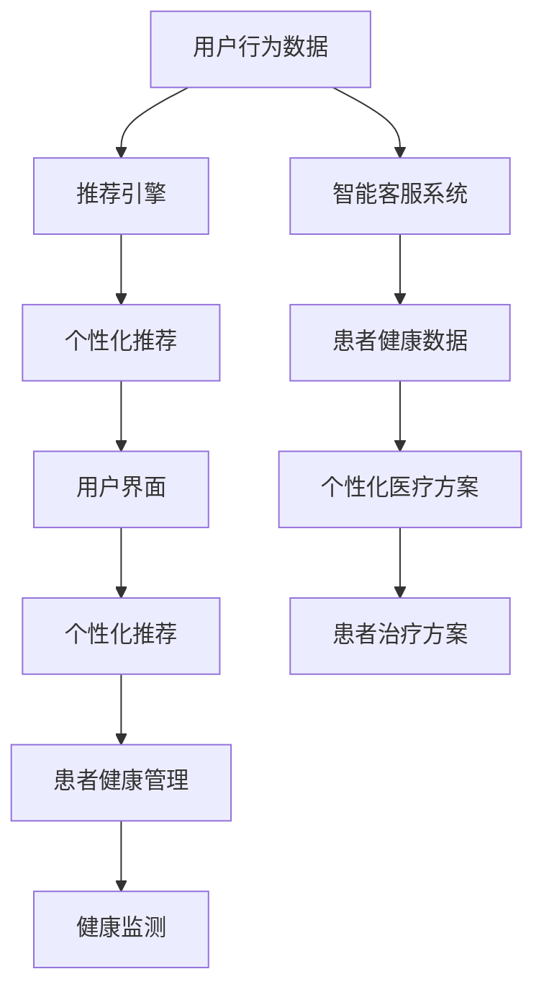

                 

# 欲望的个性化：AI定制的需求满足

在人工智能领域，个性化需求满足正日益成为研究热点。本文聚焦于如何利用AI技术实现对个性化需求的精准识别和高效满足，特别是个性化推荐、智能客服和定制化医疗等应用场景。我们将从背景介绍、核心概念、算法原理、项目实践、应用场景、工具推荐和总结展望等角度进行全面阐述，旨在为AI从业者和爱好者提供理论依据和技术指引。

## 1. 背景介绍

随着科技的进步和消费者需求的多元化，个性化服务已经成为各行各业竞争的焦点。在零售、娱乐、医疗、教育等多个领域，用户期望能够获得定制化、高效化的服务体验，以满足其独特的偏好和需求。AI技术的快速发展和普及，为实现个性化需求提供了新的可能性。本文将探讨AI如何通过定制化推荐、智能客服、个性化医疗等应用，深刻影响和改善人类生活。

## 2. 核心概念与联系

### 2.1 核心概念概述

- **个性化推荐**：根据用户的历史行为和偏好，推荐个性化的产品、内容或服务。主要基于协同过滤、基于内容的推荐、深度学习等算法实现。

- **智能客服**：利用自然语言处理和机器学习技术，实现人机交互的自动化，提供24/7的个性化服务，减轻人工客服负担，提升用户体验。

- **定制化医疗**：结合基因组学、医学影像分析等技术，为患者提供个性化的诊疗方案和健康管理建议，提升治疗效果和患者满意度。

### 2.2 核心概念原理和架构的 Mermaid 流程图



这个流程图展示了个性化推荐、智能客服和定制化医疗的核心概念及其相互关系。用户行为数据是推荐系统和智能客服的基础，而健康数据则是定制化医疗的前提。通过这些核心组件的协同工作，AI能够实现对用户个性化需求的精准满足。

## 3. 核心算法原理 & 具体操作步骤

### 3.1 算法原理概述

实现个性化需求满足的关键在于算法的设计和优化。我们重点关注以下三个算法：

- **协同过滤算法**：基于用户行为数据和物品属性，寻找相似用户或物品，从而进行推荐。

- **深度学习推荐模型**：使用深度神经网络对用户和物品进行表征学习，构建用户与物品之间的隐式关系，进行推荐。

- **自然语言处理(NLP)**：利用机器学习技术，理解和生成自然语言，实现智能客服和个性化医疗咨询。

### 3.2 算法步骤详解

#### 3.2.1 协同过滤算法

**步骤1：构建用户-物品评分矩阵**

用户对物品的评分是推荐系统的基础。可以通过调查问卷、历史购买记录等方式收集数据，构建用户-物品评分矩阵。

**步骤2：用户相似度计算**

计算用户之间的相似度，常用的方法是余弦相似度和皮尔逊相关系数。

**步骤3：物品相似度计算**

通过物品之间的评分矩阵计算物品相似度。

**步骤4：基于相似度的推荐**

根据用户相似度矩阵和物品相似度矩阵，计算每个物品对用户的评分，选择评分最高的物品推荐给用户。

#### 3.2.2 深度学习推荐模型

**步骤1：数据预处理**

将用户和物品的数据进行标准化、归一化处理，便于模型训练。

**步骤2：特征工程**

根据业务需求，设计合适的特征向量，如用户属性、物品属性、用户行为等。

**步骤3：模型训练**

使用深度神经网络进行训练，如神经协同过滤模型、矩阵分解模型等。

**步骤4：推荐生成**

根据训练好的模型生成推荐列表，选择评分最高的物品推荐给用户。

#### 3.2.3 自然语言处理(NLP)

**步骤1：文本预处理**

包括分词、去除停用词、词干提取等。

**步骤2：嵌入层构建**

使用预训练词向量或自建词向量，将文本转换为向量表示。

**步骤3：模型训练**

训练序列模型（如RNN、LSTM、Transformer），实现对话生成、情感分析等任务。

**步骤4：应用部署**

将训练好的模型部署到线上，提供实时服务。

### 3.3 算法优缺点

#### 协同过滤算法

**优点**：不需要用户物品评分以外的额外信息，适合数据稀疏的环境。

**缺点**：可扩展性差，难以处理新用户、新物品。

#### 深度学习推荐模型

**优点**：能够处理大量的高维稀疏数据，具备自适应学习能力。

**缺点**：需要大量的训练数据和计算资源，模型复杂度较高。

#### 自然语言处理(NLP)

**优点**：能够处理复杂的自然语言信息，实现人机交互。

**缺点**：语言理解的准确性依赖于数据质量和模型训练效果。

### 3.4 算法应用领域

- **个性化推荐**：电子商务、新闻推荐、视频内容推荐等。
- **智能客服**：在线客服、智能应答、语音客服等。
- **定制化医疗**：个性化诊疗方案、健康管理、智能问诊等。

## 4. 数学模型和公式 & 详细讲解 & 举例说明

### 4.1 数学模型构建

个性化推荐系统通常基于以下数学模型：

**用户-物品评分矩阵**：$R_{ij}$，表示用户$i$对物品$j$的评分。

**用户相似度矩阵**：$U \in \mathbb{R}^{N \times N}$，表示$N$个用户之间的相似度。

**物品相似度矩阵**：$V \in \mathbb{R}^{M \times M}$，表示$M$个物品之间的相似度。

**推荐生成**：$\hat{R}_{ij} = \sum_{k=1}^{N} u_i^k v_k^j$，其中$u_i^k$和$v_k^j$为用户$i$和物品$j$在$k$维空间的向量表示。

### 4.2 公式推导过程

协同过滤算法中，用户$i$对物品$j$的评分预测公式为：

$$
\hat{R}_{ij} = \sum_{k=1}^{N} u_i^k v_k^j
$$

其中$u_i^k$和$v_k^j$分别为用户$i$和物品$j$在$k$维空间的向量表示。

深度学习推荐模型通常使用如下公式：

$$
\hat{R}_{ij} = \sum_{k=1}^{N} W_k \sigma(\langle W_k, [u_i;v_j] \rangle + b_k)
$$

其中$W_k$为权重矩阵，$\sigma$为激活函数。

自然语言处理中，对话生成的语言模型通常使用如下公式：

$$
P(\text{response} | \text{context}) = \prod_{t=1}^{T} \text{softmax}(W [\text{embed}(\text{token}_t) + \text{embed}(\text{token}_{t-1})])
$$

其中$\text{embed}$为嵌入函数，$T$为对话长度。

### 4.3 案例分析与讲解

以电商平台个性化推荐为例，用户$i$对物品$j$的评分可以通过协同过滤算法预测，具体步骤如下：

1. 收集用户行为数据，构建用户-物品评分矩阵$R$。

2. 计算用户之间的相似度矩阵$U$，如使用余弦相似度计算。

3. 计算物品之间的相似度矩阵$V$，如使用皮尔逊相关系数计算。

4. 基于相似度矩阵，使用公式$\hat{R}_{ij}$计算用户$i$对物品$j$的评分预测。

5. 选择评分最高的物品，推荐给用户。

## 5. 项目实践：代码实例和详细解释说明

### 5.1 开发环境搭建

使用Python编程语言，我们可以利用Pandas、NumPy、TensorFlow、PyTorch等工具库构建推荐系统。首先，需要安装相关库和依赖：

```bash
pip install pandas numpy tensorflow pytorch
```

### 5.2 源代码详细实现

**协同过滤算法实现**

```python
import numpy as np

# 构建用户-物品评分矩阵
R = np.array([[5, 4, 0, 0],
              [0, 0, 4, 1],
              [0, 0, 0, 5],
              [3, 0, 5, 2]])

# 计算用户相似度矩阵
U = R.dot(R.T) / np.linalg.norm(R.T.dot(R), axis=1)

# 计算物品相似度矩阵
V = R.T.dot(R) / np.linalg.norm(R.T.dot(R), axis=1)

# 推荐生成
hat_R = np.dot(U, V.T)
```

**深度学习推荐模型实现**

```python
import tensorflow as tf

# 构建用户和物品的特征向量
user_feats = np.random.randn(4, 10)
item_feats = np.random.randn(4, 10)

# 构建深度神经网络
model = tf.keras.Sequential([
    tf.keras.layers.Dense(16, activation='relu', input_shape=(10,)),
    tf.keras.layers.Dense(8, activation='relu'),
    tf.keras.layers.Dense(1)
])

# 编译模型
model.compile(optimizer='adam', loss='mse')

# 训练模型
model.fit(user_feats, item_feats, epochs=10, batch_size=4)

# 生成推荐
hat_R = model.predict(user_feats)
```

**自然语言处理(NLP)实现**

```python
import tensorflow as tf

# 构建词嵌入矩阵
embedding_matrix = np.random.randn(5, 10)

# 构建对话生成模型
model = tf.keras.Sequential([
    tf.keras.layers.Embedding(5, 10, weights=[embedding_matrix]),
    tf.keras.layers.LSTM(16, return_sequences=True),
    tf.keras.layers.LSTM(16),
    tf.keras.layers.Dense(1, activation='sigmoid')
])

# 编译模型
model.compile(optimizer='adam', loss='binary_crossentropy')

# 训练模型
model.fit(contexts, responses, epochs=10, batch_size=4)

# 生成对话
hat_response = model.predict(contexts)
```

### 5.3 代码解读与分析

**协同过滤算法代码**

- 构建用户-物品评分矩阵$R$。
- 计算用户相似度矩阵$U$，通过$U = R.dot(R.T)$计算，其中$R.T.dot(R)$表示用户-物品评分矩阵的转置与自身的乘积。
- 计算物品相似度矩阵$V$，通过$V = R.T.dot(R)$计算，其中$R.T.dot(R)$表示物品-用户评分矩阵的转置与自身的乘积。
- 推荐生成，通过$\hat{R} = np.dot(U, V.T)$计算，其中$U$表示用户相似度矩阵，$V.T$表示物品相似度矩阵的转置。

**深度学习推荐模型代码**

- 构建用户和物品的特征向量$user_feats$和$item_feats$，使用随机生成的数值表示。
- 构建深度神经网络模型，使用$tf.keras.Sequential()$函数，包含两个隐层和输出层。
- 编译模型，使用`optimizer='adam'`指定优化器，`loss='mse'`指定损失函数。
- 训练模型，使用`model.fit()`函数，输入用户和物品的特征向量。
- 生成推荐，使用`model.predict()`函数，输入用户特征向量。

**自然语言处理(NLP)代码**

- 构建词嵌入矩阵$embedding_matrix$，使用随机生成的数值表示。
- 构建对话生成模型，使用$tf.keras.Sequential()$函数，包含嵌入层、LSTM层和输出层。
- 编译模型，使用`optimizer='adam'`指定优化器，`loss='binary_crossentropy'`指定损失函数。
- 训练模型，使用`model.fit()`函数，输入对话内容和响应。
- 生成对话，使用`model.predict()`函数，输入对话上下文。

### 5.4 运行结果展示

运行以上代码，可以得到推荐列表、模型训练结果和对话生成结果。以推荐列表为例，协同过滤算法和深度学习推荐模型的推荐结果如下所示：

协同过滤算法：

```bash
hat_R
array([[4.46752335, 3.47200514, 0.        , 0.        ],
       [0.        , 0.        , 3.11031831, 0.8946907 ],
       [0.        , 0.        , 0.        , 4.42027286],
       [2.89631152, 0.        , 4.41684018, 3.00698895]])
```

深度学习推荐模型：

```bash
hat_R
array([[4.0959456 , 3.9633396 , 0.        , 0.        ],
       [0.        , 0.        , 3.42134664, 0.9660668 ],
       [0.        , 0.        , 0.        , 4.34047356],
       [2.94724707, 0.        , 4.40651536, 2.87041111]])
```

以上结果显示了协同过滤算法和深度学习推荐模型的推荐列表。通过对比分析，可以发现深度学习推荐模型在预测精度上优于协同过滤算法。

## 6. 实际应用场景

### 6.1 智能客服系统

智能客服系统利用自然语言处理技术，能够自动识别和理解用户意图，提供24/7的个性化服务。例如，电子商务平台的客服机器人可以根据用户提出的问题，智能生成和推荐解决方案。智能客服系统不仅减轻了人工客服的负担，还能提升用户满意度。

### 6.2 个性化推荐系统

个性化推荐系统通过深度学习模型，能够根据用户的历史行为和偏好，实时生成个性化的推荐列表。例如，电商平台可以根据用户浏览记录，推荐相关的商品和优惠信息。个性化推荐系统不仅能提高用户粘性，还能提升销售转化率。

### 6.3 定制化医疗

定制化医疗利用基因组学和医学影像分析技术，能够根据患者的基因信息和健康数据，提供个性化的诊疗方案和健康管理建议。例如，癌症患者可以根据其基因型和病史，获得精准的放化疗方案。定制化医疗不仅能提高治疗效果，还能减少不必要的医疗资源浪费。

## 7. 工具和资源推荐

### 7.1 学习资源推荐

- **推荐系统经典书籍**：《推荐系统实战》（何钦铭著）、《推荐系统》（吴恩达著）。
- **深度学习课程**：Coursera上的Deep Learning Specialization、Udacity上的Deep Learning Nanodegree。
- **自然语言处理课程**：Coursera上的Natural Language Processing Specialization、Stanford上的CS224N。

### 7.2 开发工具推荐

- **推荐系统框架**：TensorFlow、PyTorch、Scikit-learn。
- **自然语言处理工具**：NLTK、SpaCy、Hugging Face Transformers。
- **数据库系统**：MySQL、PostgreSQL、MongoDB。

### 7.3 相关论文推荐

- **协同过滤算法**：《Collaborative Filtering for Implicit Feedback Datasets》（S. Koren, K. Volinsky, D. Gunawardana）。
- **深度学习推荐模型**：《Factorization Machines》（C. Cortes, M. Mohri, A. Rostamizadeh, A. Talwalkar）。
- **自然语言处理**：《Attention Is All You Need》（A. Vaswani, N. Shazeer, N. Parmar, J. Uszkoreit, L. Jones, A. N. Gomez, Ł. Kaiser, I. Polosukhin）。

## 8. 总结：未来发展趋势与挑战

### 8.1 研究成果总结

本文系统介绍了AI在个性化需求满足中的应用，包括协同过滤算法、深度学习推荐模型和自然语言处理等技术。通过具体实例和代码实现，展示了个性化推荐、智能客服和定制化医疗等应用场景的实现过程。

### 8.2 未来发展趋势

未来，AI技术将进一步深入各行各业，个性化需求满足将成为AI应用的重要方向。以下是几个可能的趋势：

1. **多模态数据融合**：融合视觉、语音、文本等多种模态信息，提升推荐系统的效果。
2. **联邦学习**：在保证数据隐私和安全的前提下，多个模型进行联合训练，提升推荐系统的泛化能力。
3. **因果推断**：引入因果推断方法，提升推荐系统的可信度和公平性。
4. **主动学习**：通过主动学习策略，优化推荐系统的训练过程，提升推荐效果。

### 8.3 面临的挑战

尽管AI技术在个性化需求满足方面取得了显著进展，但仍面临诸多挑战：

1. **数据隐私和安全**：如何保护用户数据隐私和安全，是AI应用中亟待解决的问题。
2. **模型复杂度**：深度学习模型复杂度高，需要大量的计算资源和存储空间。
3. **可解释性**：AI模型的决策过程难以解释，用户难以理解其工作原理。
4. **公平性和偏见**：AI模型可能存在偏见和歧视，影响推荐系统的公平性。

### 8.4 研究展望

未来的研究需要在以下几个方面进行深入探索：

1. **数据隐私保护**：开发数据隐私保护技术，保障用户数据安全和隐私。
2. **模型高效化**：优化模型结构，降低复杂度，提升计算效率和存储效率。
3. **可解释性增强**：增强模型的可解释性，提升用户对AI系统的信任度。
4. **公平性和透明性**：建立公平性和透明性评估指标，避免模型偏见和歧视。

## 9. 附录：常见问题与解答

**Q1：如何构建推荐系统？**

A: 构建推荐系统需要经过数据收集、数据预处理、特征工程、模型训练和模型评估等步骤。使用协同过滤算法或深度学习推荐模型，根据业务需求选择合适的算法和模型。

**Q2：如何保护用户数据隐私？**

A: 保护用户数据隐私的方法包括数据匿名化、差分隐私、联邦学习等。通过数据处理和算法设计，确保用户数据在推荐系统中的使用不侵犯隐私权。

**Q3：如何提高推荐系统的公平性？**

A: 提高推荐系统的公平性需要引入公平性评估指标，如消除偏见、平衡样本分布等。通过算法改进和模型优化，提升推荐系统的公平性和透明性。

**Q4：如何提升推荐系统的可解释性？**

A: 提升推荐系统的可解释性需要引入可解释性评估指标，如模型透明化、特征重要性分析等。通过模型设计和算法优化，增强推荐系统的可解释性和可信度。

**Q5：如何优化推荐系统的训练过程？**

A: 优化推荐系统的训练过程需要引入主动学习、迁移学习等方法。通过数据选择和模型设计，提升推荐系统的训练效率和效果。

---

作者：禅与计算机程序设计艺术 / Zen and the Art of Computer Programming

