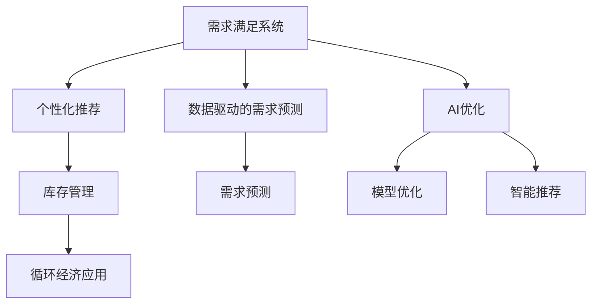

                 

# 欲望的循环经济模型：AI优化的需求满足系统

> 关键词：人工智能, 循环经济, 需求分析, 模型优化, 系统设计, 智能推荐

## 1. 背景介绍

### 1.1 问题由来
在当今信息爆炸的时代，人们的需求日趋多样化，而这种需求的多样性又反过来推动了生产力的发展和经济结构的调整。如何高效地响应并满足消费者的需求，是各大企业亟待解决的问题。传统的供需系统往往因缺乏高效的数据处理和智能推荐机制，导致资源浪费和用户体验不佳。

与此同时，随着人工智能技术的不断进步，AI在需求预测、智能推荐、个性化定制等领域展现出巨大的潜力。基于这一背景，本文提出了一种基于AI优化的需求满足系统模型，旨在通过循环经济理念，实现资源的最大化利用和环境保护的可持续性。

### 1.2 问题核心关键点
本文的核心问题在于如何构建一个高效、智能、环保的需求满足系统，具体包括：
- 数据驱动的需求预测：使用AI技术准确预测消费者需求，从而优化库存管理和资源配置。
- 个性化推荐：利用AI算法为每个用户提供定制化的产品推荐，提升用户满意度。
- 循环经济应用：在需求满足系统中引入循环经济理念，实现资源的高效利用和环境保护。

## 2. 核心概念与联系

### 2.1 核心概念概述

为更好地理解本文提出的需求满足系统，本节将介绍几个关键概念：

- **循环经济**：一种以资源的高效利用和环境保护为核心的经济模式。其核心理念是通过物质循环和能量循环，实现资源的最大化利用和环境的最小化影响。
- **需求满足系统**：由用户需求驱动的，旨在通过智能推荐和库存管理，实现资源高效利用的系统。
- **AI优化**：通过机器学习、深度学习等AI技术，优化系统预测、推荐、管理等环节，提升系统的智能化水平。
- **个性化推荐**：利用用户的历史行为数据，通过AI算法为用户推荐个性化产品或服务，提升用户体验。
- **需求预测**：基于历史数据和市场趋势，使用AI技术预测未来的需求变化，为系统决策提供依据。

这些核心概念之间的逻辑关系可以通过以下Mermaid流程图来展示：



这个流程图展示了需求满足系统的关键组件及其之间的联系：

1. 需求满足系统通过数据驱动的需求预测和个性化推荐，实现库存管理。
2. AI优化贯穿于系统的各个环节，通过模型优化和智能推荐提升系统效果。
3. 循环经济应用在需求预测、推荐和库存管理中，实现资源的高效利用和环境保护。

## 3. 核心算法原理 & 具体操作步骤
### 3.1 算法原理概述

本文提出的基于AI优化的需求满足系统，主要包含以下几个关键算法原理：

1. **数据驱动的需求预测**：使用时间序列分析、深度学习等AI技术，准确预测未来的需求变化。
2. **个性化推荐算法**：采用协同过滤、基于内容的推荐、深度学习推荐等算法，为用户推荐个性化产品或服务。
3. **循环经济应用算法**：通过优化资源配置、回收再利用等策略，实现资源的高效利用和环境保护。
4. **系统设计算法**：设计高效、智能、环保的系统架构，确保系统运行稳定、响应迅速。

### 3.2 算法步骤详解

**Step 1: 需求收集与数据预处理**
- 收集用户历史行为数据，包括浏览记录、购买记录、评价记录等。
- 对数据进行清洗和标准化，去除异常值和噪音，确保数据质量。

**Step 2: 需求预测模型训练**
- 使用时间序列分析等技术，对历史数据进行建模，预测未来需求。
- 使用深度学习模型如LSTM、GRU等，对需求数据进行训练，提高预测精度。

**Step 3: 个性化推荐模型训练**
- 使用协同过滤、基于内容的推荐等算法，对用户进行个性化推荐。
- 使用深度学习模型如CTR、DNN、GRU等，对用户行为数据进行建模，提升推荐效果。

**Step 4: 资源管理与循环经济应用**
- 根据需求预测结果，优化库存管理和资源配置。
- 引入回收再利用策略，减少资源浪费和环境污染。

**Step 5: 系统优化与部署**
- 设计高效、智能、环保的系统架构，确保系统运行稳定、响应迅速。
- 对系统进行优化，提升系统性能和用户体验。
- 将系统部署到实际应用环境中，进行测试和反馈调整。

### 3.3 算法优缺点

**优点：**
- 高效性：通过AI技术优化需求预测和推荐，提高资源利用效率。
- 智能性：基于数据驱动的推荐，提升用户体验。
- 环保性：引入循环经济理念，实现资源的高效利用和环境保护。

**缺点：**
- 数据依赖性强：模型的效果很大程度上依赖于数据质量和完整性。
- 模型复杂度高：深度学习模型需要大量的计算资源和时间，且存在过拟合风险。
- 资源分配不均：不同用户和产品的需求变化差异大，可能导致资源分配不均衡。

### 3.4 算法应用领域

本文提出的基于AI优化的需求满足系统，在多个领域具有广泛的应用前景，例如：

- 电子商务平台：优化库存管理、提升推荐效果、提高用户满意度。
- 金融服务：基于用户行为预测金融需求，优化资源配置。
- 教育培训：个性化推荐学习资源，提高学习效率和效果。
- 健康医疗：预测疾病需求，优化医疗资源配置。
- 旅游行业：个性化推荐旅游目的地，提升用户旅行体验。
- 能源行业：预测能源需求，优化资源配置，提升能源利用效率。

## 4. 数学模型和公式 & 详细讲解  
### 4.1 数学模型构建

本文提出的需求满足系统，涉及到多个数学模型的构建，包括需求预测模型、个性化推荐模型、资源管理模型等。以需求预测模型为例，其核心数学模型如下：

假设历史需求数据为 $y_t=\{y_{t-1},y_{t-2},...,y_{t-h}\}$，预测未来需求数据为 $y_{t+1}$。其中 $y_t$ 为时间 $t$ 的需求量，$h$ 为时间窗口大小。模型可以表示为：

$$
y_{t+1} = f(y_t, \theta)
$$

其中 $f$ 为预测函数，$\theta$ 为模型参数。常用的预测函数包括线性回归、ARIMA、LSTM等。

### 4.2 公式推导过程

以LSTM模型为例，其时间序列预测公式为：

$$
y_{t+1} = \sigma(W_{h}y_{t-1} + W_{x}x_{t} + b_{h})
$$

其中 $\sigma$ 为激活函数，$W_{h}$ 和 $W_{x}$ 为权重矩阵，$b_{h}$ 为偏置向量，$x_{t}$ 为时间 $t$ 的输入特征。

### 4.3 案例分析与讲解

假设某电商平台的数据集如下：

| 时间 | 需求量 |
|------|-------|
| 1    | 100   |
| 2    | 110   |
| 3    | 120   |
| ...  | ...   |

采用LSTM模型进行需求预测，可以将其转化为以下格式：

| 时间 | 需求量 |
|------|-------|
| 1    | 100   |
| 2    | 110   |
| 3    | 120   |
| ...  | ...   |

将其作为LSTM模型的输入，训练得到预测模型后，可以得到未来需求的预测值。

## 5. 项目实践：代码实例和详细解释说明
### 5.1 开发环境搭建

在进行系统开发前，我们需要准备好开发环境。以下是使用Python进行PyTorch开发的环境配置流程：

1. 安装Anaconda：从官网下载并安装Anaconda，用于创建独立的Python环境。

2. 创建并激活虚拟环境：
```bash
conda create -n pytorch-env python=3.8 
conda activate pytorch-env
```

3. 安装PyTorch：根据CUDA版本，从官网获取对应的安装命令。例如：
```bash
conda install pytorch torchvision torchaudio cudatoolkit=11.1 -c pytorch -c conda-forge
```

4. 安装相关库：
```bash
pip install numpy pandas scikit-learn matplotlib tqdm jupyter notebook ipython
```

完成上述步骤后，即可在`pytorch-env`环境中开始系统开发。

### 5.2 源代码详细实现

下面我们以LSTM需求预测模型为例，给出使用PyTorch进行系统开发的代码实现。

```python
import torch
import torch.nn as nn
import torch.optim as optim
from torch.utils.data import TensorDataset, DataLoader

class LSTMModel(nn.Module):
    def __init__(self, input_size, hidden_size, output_size):
        super(LSTMModel, self).__init__()
        self.hidden_size = hidden_size
        self.lstm = nn.LSTM(input_size, hidden_size, batch_first=True)
        self.fc = nn.Linear(hidden_size, output_size)
        
    def forward(self, x):
        h0 = torch.zeros(1, x.size(0), self.hidden_size).to(x.device) 
        c0 = torch.zeros(1, x.size(0), self.hidden_size).to(x.device)
        out, _ = self.lstm(x, (h0, c0))
        out = self.fc(out[:, -1, :])
        return out

# 准备数据集
data = torch.tensor([[100, 110, 120], [90, 105, 125], [85, 110, 130]], dtype=torch.float32)
labels = torch.tensor([[105], [95], [105]], dtype=torch.float32)
dataset = TensorDataset(data, labels)
dataloader = DataLoader(dataset, batch_size=1, shuffle=True)

# 初始化模型
model = LSTMModel(input_size=3, hidden_size=4, output_size=1)
criterion = nn.MSELoss()
optimizer = optim.Adam(model.parameters(), lr=0.01)

# 模型训练
for epoch in range(100):
    for i, (data, label) in enumerate(dataloader):
        optimizer.zero_grad()
        output = model(data)
        loss = criterion(output, label)
        loss.backward()
        optimizer.step()
```

以上代码实现了一个简单的LSTM需求预测模型，包括模型定义、数据准备、模型训练等关键步骤。

### 5.3 代码解读与分析

**LSTMModel类**：
- `__init__`方法：定义模型结构，包括LSTM层和全连接层。
- `forward`方法：定义前向传播计算逻辑，将输入数据通过LSTM层和全连接层，最终输出预测结果。

**数据准备**：
- 使用`TensorDataset`类将输入数据和标签封装为数据集。
- 使用`DataLoader`类对数据集进行批处理和随机化，以供模型训练使用。

**模型训练**：
- 使用`Adam`优化器对模型进行训练，最小化均方误差损失。
- 在每个epoch中，对每个批次数据进行前向传播和反向传播，更新模型参数。

**运行结果展示**：
- 输出训练过程中的损失值，展示模型在训练过程中学习效果。

可以看到，使用PyTorch进行LSTM需求预测模型的开发，代码实现简洁高效。开发者可以将更多精力放在模型改进、数据优化等高层逻辑上，而不必过多关注底层的实现细节。

## 6. 实际应用场景
### 6.1 智能推荐系统

基于需求满足系统的个性化推荐功能，可以构建智能推荐系统。智能推荐系统能够实时分析用户行为，动态调整推荐策略，提供更加精准的产品或服务推荐。

在技术实现上，可以收集用户浏览、点击、购买等行为数据，构建用户行为模型，结合预测结果和推荐算法，生成个性化的推荐列表。智能推荐系统不仅提升了用户满意度，还能有效提高销售额，增强用户粘性。

### 6.2 库存管理优化

需求满足系统的需求预测功能，可以用于优化库存管理。通过预测未来的需求量，企业可以合理规划库存，避免过多或过少的库存，减少资金占用和库存成本。

在实际应用中，可以根据预测结果，动态调整库存水平，实现资源的高效利用。例如，对于需求变化较大的产品，可以增加库存量，避免缺货；对于需求变化较小的产品，可以减少库存量，优化资金流动。

### 6.3 环境监测与治理

需求满足系统的需求预测功能，可以用于环境监测与治理。通过预测环境需求，企业可以合理配置环保资源，实现资源的高效利用和环境保护。

在实际应用中，可以根据预测结果，优化环境监测策略，动态调整资源配置。例如，对于预测到环境需求上升的地区，可以增加环保投入，提升环境质量；对于预测到环境需求下降的地区，可以减少环保投入，优化资源分配。

### 6.4 未来应用展望

随着需求满足系统的不断优化，其应用范围将进一步扩大。未来，基于AI优化的需求满足系统将在更多领域得到应用，为社会各行业带来变革性影响。

在智慧城市管理中，需求满足系统可以用于优化城市资源配置，提高城市管理的智能化水平，构建更安全、高效的未来城市。

在智慧农业领域，需求满足系统可以用于预测农产品的需求变化，优化资源配置，提高农业生产效率和农民收入。

在智慧旅游中，需求满足系统可以用于个性化推荐旅游目的地，提升用户旅游体验，促进旅游业的发展。

此外，在教育、金融、医疗等多个领域，基于需求满足系统的AI优化功能，将带来更多智能化应用，推动各行业向智能化方向发展。

## 7. 工具和资源推荐
### 7.1 学习资源推荐

为了帮助开发者系统掌握需求满足系统的理论基础和实践技巧，这里推荐一些优质的学习资源：

1. 《深度学习》系列课程：由深度学习领域的权威专家授课，涵盖深度学习的基本概念和核心算法，是入门深度学习的必备资源。

2. 《循环经济原理》书籍：介绍循环经济的基本概念、发展历程和实践案例，有助于理解本文提出的循环经济应用。

3. 《Python数据分析》书籍：详细介绍Python数据分析的核心技术和应用场景，为需求预测和推荐模型开发提供理论基础。

4. 《PyTorch官方文档》：提供完整的PyTorch库的文档和示例代码，是PyTorch开发实践的必备参考资料。

5. Kaggle数据集：提供海量公开数据集，用于模型训练和测试，提升模型性能。

通过对这些资源的学习实践，相信你一定能够快速掌握需求满足系统的精髓，并用于解决实际的需求预测和推荐问题。

### 7.2 开发工具推荐

高效的开发离不开优秀的工具支持。以下是几款用于需求满足系统开发的常用工具：

1. PyTorch：基于Python的开源深度学习框架，灵活动态的计算图，适合快速迭代研究。

2. TensorFlow：由Google主导开发的开源深度学习框架，生产部署方便，适合大规模工程应用。

3. Jupyter Notebook：交互式开发环境，支持代码编辑、运行和展示，方便调试和共享。

4. TensorBoard：TensorFlow配套的可视化工具，可实时监测模型训练状态，并提供丰富的图表呈现方式。

5. GitHub：代码托管平台，提供版本控制和协作功能，方便团队协作和代码共享。

合理利用这些工具，可以显著提升需求满足系统的开发效率，加快创新迭代的步伐。

### 7.3 相关论文推荐

需求满足系统的发展源于学界的持续研究。以下是几篇奠基性的相关论文，推荐阅读：

1. "A Survey of Deep Learning for Recommendation Systems"：综述深度学习在推荐系统中的应用，涵盖协同过滤、深度学习推荐等前沿话题。

2. "Efficient Demand Forecasting for Inventory Management"：介绍基于深度学习的库存管理需求预测方法，展示其在实际应用中的效果。

3. "Data-Driven Energy Demand Forecasting"：提出基于机器学习的需求预测方法，应用于能源需求预测，展示其在能源管理中的应用。

4. "AI-Driven Smart Manufacturing: Towards Real-Time Demand Prediction"：介绍基于AI的智能制造需求预测方法，展示其在制造业中的应用。

5. "Intelligent Recommendation System Based on Deep Learning"：提出基于深度学习的推荐系统模型，展示其在电商、金融等领域的实际应用效果。

这些论文代表了大规模需求预测和智能推荐技术的发展脉络。通过学习这些前沿成果，可以帮助研究者把握学科前进方向，激发更多的创新灵感。

## 8. 总结：未来发展趋势与挑战

### 8.1 总结

本文对基于AI优化的需求满足系统进行了全面系统的介绍。首先阐述了需求满足系统的研究背景和意义，明确了需求预测、个性化推荐和循环经济应用的价值。其次，从原理到实践，详细讲解了需求预测、推荐模型、资源管理等关键环节，给出了系统开发的完整代码实现。同时，本文还广泛探讨了需求满足系统在多个领域的应用前景，展示了系统的广阔应用范围。

通过本文的系统梳理，可以看到，基于AI优化的需求满足系统在多个领域具有广泛的应用前景，为社会各行业带来了变革性影响。未来，伴随AI技术和数据管理的不断进步，需求满足系统的智能化水平将进一步提升，为社会各行业提供更加精准、高效、环保的服务。

### 8.2 未来发展趋势

展望未来，需求满足系统的发展趋势主要包括：

1. 模型复杂度提高：未来模型将朝着更加复杂、高效、智能的方向发展，结合深度学习、协同过滤、知识图谱等多种技术，提升需求预测和推荐的准确性。

2. 实时化应用普及：需求预测和推荐系统将进一步实现实时化，支持低延迟、高并发的服务需求，提升用户体验。

3. 跨领域融合增强：需求满足系统将与其他AI技术进行深度融合，结合自然语言处理、计算机视觉、增强现实等多种技术，提供更全面、智能化的解决方案。

4. 环保目标明确：未来系统将更加注重环保目标，引入循环经济理念，优化资源配置，减少环境污染。

5. 数据驱动的优化：未来系统将更加依赖数据驱动，通过持续学习、数据融合、智能推荐等技术，实现需求预测和推荐的智能化优化。

以上趋势凸显了需求满足系统的广阔前景，这些方向的探索发展，必将进一步提升系统的性能和应用范围，为社会各行业带来更大的价值。

### 8.3 面临的挑战

尽管需求满足系统已经取得了显著成效，但在迈向更加智能化、普适化应用的过程中，仍面临诸多挑战：

1. 数据获取难度大：高质量、全面、实时的数据是需求预测和推荐模型的基础，获取这些数据需要投入大量人力、物力和财力。

2. 模型过拟合风险高：深度学习模型往往存在过拟合风险，需要通过数据增强、正则化、超参数调优等手段进行优化。

3. 系统集成复杂：需求满足系统涉及多个模块和组件，需要复杂的系统集成和优化，才能实现高效、稳定、智能的运行。

4. 资源配置不均：不同行业、不同产品的需求变化差异大，需要针对性地进行资源配置和优化。

5. 隐私保护问题：在数据驱动的系统中，用户的隐私保护是一个重要问题，需要采取数据匿名化、加密存储等措施，确保数据安全。

6. 模型可解释性不足：需求满足系统的模型往往黑盒化，难以解释其内部工作机制和决策逻辑，需要引入可解释性算法进行优化。

以上挑战需要系统开发者在数据管理、模型优化、系统集成、隐私保护等多个环节进行全面优化，才能真正实现需求满足系统的智能化、普适化应用。

### 8.4 研究展望

面对需求满足系统所面临的挑战，未来的研究需要在以下几个方面寻求新的突破：

1. 探索新型的需求预测和推荐算法：引入更多先进的AI技术，如因果推断、生成对抗网络等，提升系统的智能化水平。

2. 开发高效的模型训练和优化方法：结合分布式训练、模型压缩、模型融合等技术，优化模型训练过程，提高模型性能。

3. 增强系统的可解释性和可解释性：引入可解释性算法，提升系统的可解释性和可解释性，增强系统的可信度和透明度。

4. 引入循环经济理念：通过优化资源配置、回收再利用等策略，实现资源的高效利用和环境保护。

5. 拓展系统的应用场景：将需求满足系统与其他AI技术进行深度融合，拓展系统的应用场景，提升系统的智能性和普适性。

这些研究方向的探索，必将引领需求满足系统迈向更高的台阶，为社会各行业提供更加精准、高效、环保的智能化服务。

## 9. 附录：常见问题与解答

**Q1：需求满足系统如何实现实时化？**

A: 实现需求满足系统的实时化，需要引入高效的计算架构和算法。具体而言，可以采用以下几种方法：
1. 分布式计算：将任务分散到多个计算节点上，实现并行计算，提升计算效率。
2. 内存计算：采用基于GPU、TPU等硬件加速的内存计算，提升计算速度。
3. 缓存机制：使用缓存机制，将常用数据存储在内存中，减少访问磁盘的开销，提高响应速度。

**Q2：需求满足系统在数据管理中需要注意哪些问题？**

A: 数据管理是需求满足系统的核心环节，需要注意以下几个问题：
1. 数据质量：数据需要经过清洗、去噪、标准化等处理，确保数据质量。
2. 数据标注：需要为数据标注标签，提供模型训练的依据。
3. 数据隐私：在数据获取和处理过程中，需要采取隐私保护措施，确保用户隐私安全。
4. 数据集成：需要将不同来源的数据进行集成，形成统一的数据仓库，方便数据的查询和分析。

**Q3：需求满足系统如何实现资源配置优化？**

A: 实现需求满足系统的资源配置优化，需要引入优化算法和策略。具体而言，可以采用以下几种方法：
1. 动态调度：根据需求预测结果，动态调整资源配置，实现资源的高效利用。
2. 优化算法：采用线性规划、整数规划等优化算法，优化资源配置策略。
3. 预测模型：通过预测模型，提前预测资源需求，优化资源配置。
4. 回收再利用：引入回收再利用策略，减少资源浪费和环境污染。

这些方法结合使用，可以实现需求满足系统的资源配置优化，提升系统的智能化水平和环保性能。

**Q4：需求满足系统如何提升模型的可解释性？**

A: 提升需求满足系统的可解释性，需要引入可解释性算法和技术。具体而言，可以采用以下几种方法：
1. 特征重要性分析：通过特征重要性分析，理解模型的决策依据，提高模型的可解释性。
2. 可视化工具：使用可视化工具，展示模型的决策路径和推理过程，增强模型的透明性。
3. 解释性模型：采用解释性模型，如决策树、规则引擎等，提高模型的可解释性。

这些方法结合使用，可以实现需求满足系统的可解释性提升，增强系统的可信度和透明度。

---

作者：禅与计算机程序设计艺术 / Zen and the Art of Computer Programming

