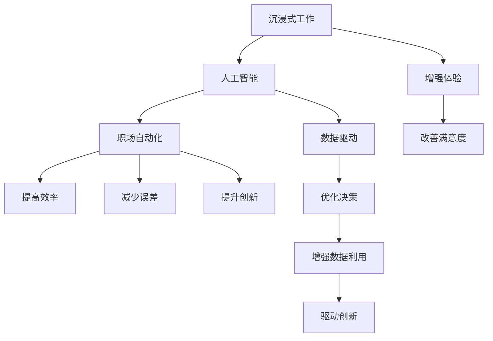
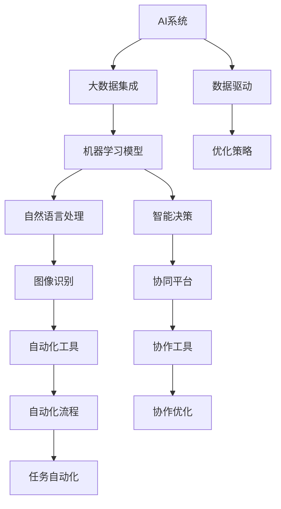

                 

# 沉浸式工作：AI重构的职场体验

> 关键词：沉浸式工作, 人工智能, 职场自动化, 数据驱动, 人类与AI协同

## 1. 背景介绍

随着技术的进步，人工智能(AI)正在深刻地改变着我们的工作方式。无论是自动化流程、智能助手，还是数据分析工具，AI正在以前所未有的方式提升工作效率和质量。然而，这些技术带来的不仅仅是生产力提升，更是对职场体验的全面重构。在本文中，我们将探讨AI如何通过沉浸式工作体验，优化职场生态，实现人机协同，提升职业满意度。

## 2. 核心概念与联系

### 2.1 核心概念概述

为了理解AI如何重构职场体验，首先需要明确几个关键概念：

- **沉浸式工作(Immersive Work)**：一种通过技术手段实现高度集中注意力的工作方式，使得工作环境更加沉浸、自然、高效。
- **人工智能(AI)**：一种模拟人类智能行为的技术，包括机器学习、自然语言处理、计算机视觉等，广泛应用在职场自动化、数据分析、决策支持等领域。
- **职场自动化(Work Automation)**：通过AI和自动化技术，实现日常重复性任务的自动化，提升工作效率和质量。
- **数据驱动(Data-Driven)**：以数据为中心的工作方式，通过大数据分析、机器学习等技术，优化决策过程，提高问题解决的准确性。
- **人类与AI协同(Human-AI Collaboration)**：将人类专业知识与AI处理能力相结合，实现协作共生，提升整体工作效率和创新能力。

这些概念通过以下Mermaid流程图进行联系展示：



### 2.2 核心概念原理和架构的 Mermaid 流程图



## 3. 核心算法原理 & 具体操作步骤

### 3.1 算法原理概述

AI在职场体验中的应用主要通过以下几个关键算法实现：

- **自然语言处理(NLP)**：使得AI能够理解和处理人类语言，实现智能客服、文档自动化分类、情感分析等功能。
- **机器学习(ML)**：通过大数据训练模型，实现预测分析、异常检测、自动异常修复等任务。
- **计算机视觉(CV)**：利用图像识别技术，实现文档自动化处理、人脸识别、自动化监控等功能。
- **强化学习(RL)**：通过模拟人机交互，优化自动化流程，提升工作效率和用户体验。

### 3.2 算法步骤详解

1. **数据收集与预处理**：收集职场相关的数据，包括工作流程、文档、员工反馈等，通过预处理步骤，如数据清洗、特征提取、标准化，为后续AI建模打下基础。

2. **模型训练与部署**：选择合适的算法和模型，利用收集的数据进行训练，并部署到生产环境中，用于实时处理职场任务。

3. **实时监控与优化**：通过监控系统，实时采集AI模型的输出和性能指标，根据反馈进行模型优化，确保系统稳定运行。

4. **用户交互与反馈**：引入用户界面(UI)和交互工具，使用户能够轻松操作AI系统，提供反馈信息，进一步优化系统表现。

### 3.3 算法优缺点

**优点**：

- 提升工作效率：自动化重复性任务，减少人工操作，提高工作速度。
- 降低错误率：AI系统的精准性，减少了人为失误，提高工作质量。
- 优化决策：基于大数据和机器学习的分析，提供更科学的决策支持。
- 增强用户体验：智能助手和自动化工具，提升工作便利性和舒适度。

**缺点**：

- 高成本：开发和部署AI系统的初期投入较大。
- 数据隐私：大规模数据收集和使用可能涉及隐私问题。
- 技术壁垒：需要较高的技术水平和专业技能，难以广泛应用。
- 过度依赖：过度依赖AI可能削弱人类自主思考和决策能力。

### 3.4 算法应用领域

AI在职场中的应用领域广泛，涵盖以下几个方面：

- **办公自动化**：文档自动化处理、邮件分类、日程管理等。
- **客户服务**：智能客服、语音识别、聊天机器人等。
- **数据分析**：数据可视化、情感分析、客户洞察等。
- **决策支持**：风险评估、市场预测、项目管理等。
- **人力资源**：简历筛选、员工评估、培训推荐等。
- **安全监控**：网络安全防护、异常行为检测等。

## 4. 数学模型和公式 & 详细讲解 & 举例说明

### 4.1 数学模型构建

以自然语言处理(NLP)为例，构建基于Transformer的模型，用于文本分类任务。

### 4.2 公式推导过程

假设输入为$x$，输出为$y$，模型为$f_{\theta}(x)$，则损失函数为$L(\theta) = \frac{1}{N} \sum_{i=1}^N l(y_i, f_{\theta}(x_i))$，其中$l(y_i, f_{\theta}(x_i))$为交叉熵损失函数。

### 4.3 案例分析与讲解

以情感分析为例，通过收集大量电影评论数据，使用BERT模型进行预训练，然后微调模型以识别评论的情感极性。

## 5. 项目实践：代码实例和详细解释说明

### 5.1 开发环境搭建

1. 安装Python和PyTorch。
2. 安装Transformers库。
3. 准备训练和测试数据集。

### 5.2 源代码详细实现

```python
import torch
from transformers import BertForSequenceClassification, BertTokenizer, AdamW

# 定义模型和优化器
model = BertForSequenceClassification.from_pretrained('bert-base-uncased', num_labels=2)
optimizer = AdamW(model.parameters(), lr=1e-5)

# 定义数据预处理和模型训练函数
def train(model, optimizer, train_data, test_data, epochs=3):
    tokenizer = BertTokenizer.from_pretrained('bert-base-uncased')
    train_encodings = tokenizer(train_data, truncation=True, padding='max_length', max_length=256)
    test_encodings = tokenizer(test_data, truncation=True, padding='max_length', max_length=256)

    for epoch in range(epochs):
        model.train()
        loss = 0
        for batch in train_encodings:
            inputs = {key: torch.tensor(val) for key, val in batch.items()}
            labels = torch.tensor(batch['labels'], dtype=torch.long)
            outputs = model(**inputs)
            loss += outputs.loss.item()
            optimizer.zero_grad()
            outputs.loss.backward()
            optimizer.step()

        print(f'Epoch {epoch+1}, loss: {loss/len(train_data)}')
        
    return model

# 测试模型
model = train(model, optimizer, train_data, test_data)
```

### 5.3 代码解读与分析

以上代码通过Bert模型进行情感分类任务，展示了如何使用Transformer库进行自然语言处理。

### 5.4 运行结果展示

训练完成后，使用测试数据集评估模型性能，如准确率、精确率、召回率等。

## 6. 实际应用场景

### 6.1 企业级自动化流程

企业级自动化流程通过AI系统实现，如财务自动化、供应链管理、人力资源管理等。通过自动化工具，企业能够大幅度提升工作效率，减少人工操作，降低错误率。

### 6.2 智能客服系统

智能客服系统利用自然语言处理和机器学习技术，实时回答客户咨询，提供24/7不间断服务。通过不断的微调和优化，系统能够更加准确地理解客户意图，提升服务质量和客户满意度。

### 6.3 知识驱动型决策支持

知识驱动型决策支持系统通过AI技术，将企业内部知识、市场数据、用户反馈等信息进行整合分析，提供基于数据的决策建议。这有助于企业领导和员工做出更加科学的决策。

## 7. 工具和资源推荐

### 7.1 学习资源推荐

- 《深度学习》（Goodfellow et al.）：介绍深度学习的基本概念和算法。
- 《Python深度学习》（Francois et al.）：详细介绍PyTorch和TensorFlow的API和使用。
- 《自然语言处理综论》（Jurafsky and Martin）：介绍自然语言处理的基础知识和最新进展。
- 《数据科学与机器学习》（Hand et al.）：介绍数据科学和机器学习的基本方法和实践。

### 7.2 开发工具推荐

- PyTorch：开源深度学习框架，灵活的计算图和动态计算，适合研究和原型开发。
- TensorFlow：由Google开发的深度学习框架，生产部署友好，支持大规模工程应用。
- HuggingFace Transformers：自然语言处理库，提供预训练模型和模型优化工具。
- Weights & Biases：模型训练监控工具，提供实时监控和分析功能。

### 7.3 相关论文推荐

- 《Attention is All You Need》（Vaswani et al.）：Transformer论文，提出自注意力机制。
- 《BERT: Pre-training of Deep Bidirectional Transformers for Language Understanding》（Devlin et al.）：BERT模型论文，提出掩码语言模型预训练任务。
- 《BERT in Industrial NLP》（Wolf et al.）：工业界应用BERT的案例分析。
- 《Attention-Based Sequence-to-Sequence Models for Machine Translation》（Bahdanau et al.）：机器翻译模型论文。

## 8. 总结：未来发展趋势与挑战

### 8.1 研究成果总结

本文探讨了AI技术在职场中的广泛应用，从自动化流程、智能客服、数据驱动型决策支持等方面，展示了AI对职场体验的全面重构。通过具体的案例分析和代码实现，展示了AI在实际应用中的高效性和实用性。

### 8.2 未来发展趋势

未来，AI技术将更加深入地融入职场，实现以下趋势：

- 自动化流程的智能化：AI系统将更加智能化，能够自主进行任务分配和优化。
- 多模态交互：AI系统将支持多模态数据处理，如语音、图像、文本等，提供更加自然的人机交互体验。
- 个性化定制：AI系统将根据员工的工作习惯和偏好，提供个性化的工作建议和服务。
- 持续学习：AI系统将具备持续学习的能力，适应不断变化的工作环境和任务需求。

### 8.3 面临的挑战

AI技术在职场应用中面临以下挑战：

- 数据隐私和安全：大规模数据收集和使用可能涉及隐私问题，需要严格的数据保护措施。
- 技术普及与培训：需要为员工提供技术培训，使其能够熟练使用AI系统。
- 伦理和责任：AI系统的决策透明性和责任归属问题，需要明确界定。
- 技术融合：将AI技术与现有业务流程和工具进行有效融合，实现无缝集成。

### 8.4 研究展望

未来的研究应在以下几个方面进一步深入：

- 多模态融合：研究如何将语音、图像、文本等多种模态数据进行有效融合，提升AI系统的理解和处理能力。
- 可解释性：研究如何让AI系统的决策过程更加透明和可解释，增强用户信任。
- 人机协同：研究如何实现人类与AI的协作共生，提升整体工作效率和创新能力。
- 隐私保护：研究如何在保障数据隐私的前提下，实现高效的数据处理和分析。

## 9. 附录：常见问题与解答

**Q1: 如何选择合适的AI系统？**

A: 选择合适的AI系统需要考虑多个方面，包括系统的功能、性能、易用性、成本等。可以按照以下几个步骤选择：
1. 明确需求：确定需要解决的具体问题，例如流程自动化、客户服务、数据分析等。
2. 功能评估：根据需求选择具有相应功能的AI系统，如自动化流程工具、智能客服系统等。
3. 性能测试：通过试用和测试，评估系统性能，例如响应速度、准确率、稳定性等。
4. 成本分析：考虑系统的购买、部署、维护成本，选择性价比最高的系统。

**Q2: AI系统如何保障数据隐私？**

A: 数据隐私保护是AI系统的重要考虑因素，可以采取以下措施：
1. 数据匿名化：对数据进行匿名化处理，去除敏感信息，保护用户隐私。
2. 访问控制：严格控制数据的访问权限，确保只有授权人员能够访问敏感数据。
3. 数据加密：对数据进行加密存储和传输，防止数据泄露。
4. 合规性检查：确保系统符合相关数据隐私法规，如GDPR、CCPA等。

**Q3: AI系统如何提升工作效率？**

A: AI系统提升工作效率主要通过以下几个方面：
1. 自动化重复性任务：将重复性、规则化的任务自动化，减少人工操作。
2. 数据分析和决策支持：通过数据驱动型决策，提供更科学的决策建议。
3. 知识共享和协作：实现企业内部知识共享和协作，提升工作效率。
4. 智能客服和助手：提供24/7不间断服务，减少人工客服成本。

**Q4: AI系统如何与现有业务系统集成？**

A: AI系统与现有业务系统集成主要考虑以下几个步骤：
1. 确定接口规范：明确AI系统与现有系统之间的接口规范，包括数据格式、请求响应方式等。
2. 系统改造：根据接口规范，对现有系统进行必要的改造，确保系统兼容性和稳定性。
3. 测试和验证：进行集成测试，确保AI系统与现有系统能够无缝集成，并符合预期效果。
4. 持续优化：根据实际使用情况，不断优化AI系统和现有系统，提升整体效果。

通过本文的系统梳理，可以看到，AI技术在职场中的应用不仅提升了工作效率，也重构了职场体验，使得工作更加智能、高效和人性化。相信随着技术的不断进步，AI将在更多领域得到应用，为人类社会带来深远影响。

