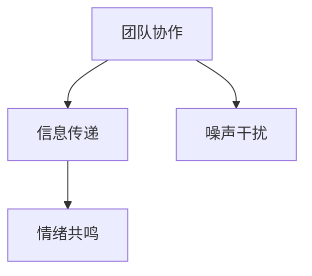

                 

# 沟通管理：提升团队协作的核心能力

## 1. 背景介绍

在现代组织结构中，团队协作已成为提升工作效率和创新能力的关键因素。然而，团队协作并非易事，尤其是在团队规模较大、成员间距离较远或文化背景多样化的环境下。本文旨在探讨如何通过沟通管理来提升团队协作能力，从而在多变的环境中实现高效协同。

### 1.1 问题由来

随着全球化的加速，企业间的协作更加频繁。远程办公、跨地域项目、多元文化团队等新情况，使得沟通管理变得更加复杂。如何确保团队成员间的有效沟通、信息共享、协作效率，成为许多组织面临的共同挑战。不当的沟通管理不仅影响团队生产力，还可能引发冲突和不和谐。

### 1.2 问题核心关键点

有效沟通的核心在于信息的准确传递、理解的共通以及情感的共鸣。然而，由于信息的冗余、噪音干扰、理解的偏差等因素，沟通常常出现障碍。

## 2. 核心概念与联系

### 2.1 核心概念概述

为更好地理解沟通管理，本节将介绍几个密切相关的核心概念：

- 团队协作(Team Collaboration)：指团队成员间通过信息共享、任务分工、角色互补等形式，共同实现目标的过程。
- 信息传递(Information Transmission)：指通过沟通方式，将信息从一个主体传递给另一个主体的过程。
- 噪声干扰(Noise Interference)：指在信息传递过程中，由于环境、心理等因素产生的干扰信号，影响信息的准确性。
- 情绪共鸣(Emotional Resonance)：指沟通双方在情感上的共通和共鸣，是有效沟通的关键要素。

这些核心概念之间的逻辑关系可以通过以下Mermaid流程图来展示：



这个流程图展示了几大核心概念之间的关系：

1. 团队协作依赖于信息的有效传递。
2. 信息传递过程可能受到噪声干扰。
3. 情绪共鸣有助于提升信息传递的准确性和效率。

## 3. 核心算法原理 & 具体操作步骤

### 3.1 算法原理概述

团队协作的沟通管理可视为一个复杂系统，其中涉及多个子系统，包括信息传递、任务分配、成员互动等。有效的沟通管理，需要通过算法和模型来优化系统各个子系统的运作。

### 3.2 算法步骤详解

#### 3.2.1 建立沟通模型

1. **定义沟通节点**：将团队成员视为沟通节点，并定义每个节点的信息需求和输出。
2. **建立沟通链路**：根据团队结构和任务需求，建立节点间的沟通链路，明确信息传递的路径。
3. **确定沟通频率**：根据任务复杂度和紧急程度，确定节点间沟通的频率。

#### 3.2.2 优化信息传递

1. **选择合适的沟通工具**：根据沟通需求选择合适的沟通工具，如邮件、即时通讯、视频会议等。
2. **设定信息格式规范**：制定统一的信息格式规范，如使用标准的模板、统一的术语等，减少信息解码的难度。
3. **采用层次化沟通**：根据信息的重要性和紧急性，采用层次化沟通策略，确保关键信息得到优先传递。

#### 3.2.3 应对噪声干扰

1. **环境优化**：改善沟通环境，如减少干扰、确保网络连接稳定等。
2. **心理调节**：采用心理调节技巧，如冥想、深呼吸等，帮助成员减少压力和焦虑。
3. **情感管理**：培养团队成员的情感管理能力，通过共情和积极反馈，提升信息传递的准确性和效率。

#### 3.2.4 促进情绪共鸣

1. **建立共同目标**：明确团队的共同目标和愿景，增强成员的归属感和认同感。
2. **增强团队互动**：通过团队建设活动、社交活动等形式，增进成员间的了解和信任。
3. **及时反馈与支持**：提供及时的支持和反馈，增强成员的成就感和归属感。

### 3.3 算法优缺点

沟通管理的优点包括：

- **提升团队协作效率**：通过优化信息传递和团队互动，提升团队的整体协作效率。
- **增强团队凝聚力**：通过共同目标和情感共鸣，增强团队的凝聚力和向心力。

缺点包括：

- **管理复杂度高**：团队规模较大时，沟通管理变得复杂，需要投入更多资源。
- **文化差异挑战**：多元文化团队中，语言和文化差异可能影响沟通效果。
- **技术依赖性高**：现代沟通管理高度依赖于技术工具，技术故障可能影响沟通的流畅性。

### 3.4 算法应用领域

沟通管理在多个领域都有广泛应用，例如：

- **软件开发**：在敏捷开发中，通过持续集成和即时沟通，提升团队的协作效率和代码质量。
- **项目管理**：在项目管理中，通过有效的沟通管理，确保项目按时交付，减少冲突。
- **市场营销**：在市场营销中，通过团队间的信息共享和协作，提升产品推广效果。
- **教育培训**：在教育培训中，通过清晰的信息传递和情感共鸣，提升教学效果和学生体验。
- **医疗服务**：在医疗服务中，通过有效的沟通管理，确保患者信息的准确传递，提升诊疗效果。

## 4. 数学模型和公式 & 详细讲解 & 举例说明

### 4.1 数学模型构建

沟通管理的数学模型可以表示为：

$$
\text{Efficiency} = \frac{\text{信息的正确传递}}{\text{信息传递的时间成本} + \text{信息解码的难度} + \text{情感共鸣的程度}}
$$

### 4.2 公式推导过程

该公式展示了沟通效率的计算方法，其中：

- **信息的正确传递**：取决于沟通工具的选择、信息的格式规范和沟通链路的设计。
- **信息传递的时间成本**：取决于沟通频率和沟通链路的长度。
- **信息解码的难度**：取决于信息的格式规范和成员的沟通技能。
- **情感共鸣的程度**：取决于团队目标的明确度、成员的互动和反馈机制。

### 4.3 案例分析与讲解

以软件开发团队为例，团队协作的沟通管理可以按以下步骤进行：

1. **建立沟通模型**：
   - 定义沟通节点：项目经理、开发者、测试人员等。
   - 建立沟通链路：需求分析、代码开发、测试验证等。
   - 确定沟通频率：每日站会、每周总结会等。

2. **优化信息传递**：
   - 选择合适的沟通工具：使用Slack、GitHub等工具。
   - 设定信息格式规范：使用统一的Jira模板、统一的代码风格等。
   - 采用层次化沟通：关键问题优先讨论，日常问题随时交流。

3. **应对噪声干扰**：
   - 环境优化：提供安静的工作空间，确保网络稳定。
   - 心理调节：定期进行压力管理培训，帮助成员缓解压力。
   - 情感管理：定期组织团队建设活动，增进成员间的信任。

4. **促进情绪共鸣**：
   - 建立共同目标：明确项目的愿景和目标，增强团队的使命感。
   - 增强团队互动：定期举行团队聚餐、团建活动，提升成员的归属感。
   - 及时反馈与支持：通过定期的绩效评估和激励机制，提升成员的成就感和满意度。

## 5. 项目实践：代码实例和详细解释说明

### 5.1 开发环境搭建

要实现沟通管理的系统化，需要搭建一个基于Web的协作平台。以下是搭建开发环境的步骤：

1. 选择技术栈：如React.js、Node.js、MongoDB等。
2. 搭建Web服务：使用Node.js和Express框架搭建后端服务，处理请求和数据库操作。
3. 开发前端界面：使用React.js和Redux框架开发前端界面，提供用户交互体验。
4. 部署和测试：将应用程序部署到云服务（如AWS、GCP等），进行测试和优化。

### 5.2 源代码详细实现

以下是使用Node.js和React.js实现的沟通管理平台的代码示例：

```javascript
// server.js
const express = require('express');
const app = express();
const port = 3000;

app.get('/', (req, res) => {
  res.sendFile(__dirname + '/index.html');
});

app.listen(port, () => {
  console.log(`Server running at http://localhost:${port}/`);
});

// client.js
import React from 'react';
import ReactDOM from 'react-dom';
import './index.css';

const App = () => {
  return (
    <div>
      <h1>Team Collaboration Platform</h1>
      <input type="text" placeholder="Enter message" />
      <button onClick={sendMessage}>Send</button>
    </div>
  );
};

ReactDOM.render(<App />, document.getElementById('root'));

function sendMessage() {
  const message = document.querySelector('input').value;
  // send message to server
}
```

### 5.3 代码解读与分析

上述代码中，服务器通过Express框架处理HTTP请求，并将响应返回给客户端。客户端使用React.js构建用户界面，通过输入框和按钮实现信息传递。

在实际开发中，还需考虑更多细节，如用户认证、信息加密、跨域处理等。通过团队协作，将复杂任务分解为多个子任务，可以更高效地完成开发。

### 5.4 运行结果展示

运行上述代码后，在浏览器中访问`http://localhost:3000/`，即可看到基本的沟通管理界面。

## 6. 实际应用场景

### 6.1 软件开发

在软件开发中，有效的沟通管理可以提升团队协作效率和代码质量。通过持续集成和即时沟通，团队成员可以及时交流问题、共享代码和反馈进展，减少信息不对称和冲突。

### 6.2 项目管理

在项目管理中，通过沟通管理，可以确保项目按时交付。明确的沟通模型和层次化沟通策略，可以确保关键问题得到优先处理，减少延期和返工。

### 6.3 市场营销

在市场营销中，有效的沟通管理可以提升产品推广效果。通过团队间的信息共享和协作，可以更好地理解用户需求，制定有效的营销策略。

### 6.4 教育培训

在教育培训中，通过沟通管理，可以提升教学效果和学生体验。清晰的信息传递和情感共鸣，可以帮助学生更好地理解课程内容，增强学习的兴趣和效果。

### 6.5 医疗服务

在医疗服务中，通过有效的沟通管理，可以确保患者信息的准确传递，提升诊疗效果。通过明确的沟通链路和规范的信息格式，可以减少误解和误诊，提升服务质量。

## 7. 工具和资源推荐

### 7.1 学习资源推荐

1. **《Effective Communication in Organizations》**：介绍有效沟通的理论和实践，帮助理解沟通管理的核心要素。
2. **《Communication Skills for IT Professionals》**：针对IT从业者，提供实用的沟通技能和工具。
3. **Coursera上的《Communication in the Global Workplace》**：通过在线课程，提升跨文化沟通能力。
4. **《The Five Dysfunctions of a Team》**：经典书籍，通过生动的案例，讲述如何克服团队沟通障碍。
5. **Harvard Business Review上的文章《Communication Skills in the Digital Age》**：分析数字时代下的沟通挑战和应对策略。

### 7.2 开发工具推荐

1. **Slack**：一款流行的即时通讯工具，支持团队协作和信息传递。
2. **GitHub**：版本控制平台，支持代码协作和信息共享。
3. **Jira**：项目管理工具，提供任务分配、进度跟踪和沟通管理。
4. **Zoom**：视频会议工具，支持远程沟通和实时交流。
5. **Google Docs**：在线文档工具，支持团队协作和信息共享。

### 7.3 相关论文推荐

1. **《Communication Networks in Virtual Teams: A Comparative Analysis of Collaboration》**：研究虚拟团队中的沟通网络，提出优化策略。
2. **《Cross-cultural Communication in Global Teams: The Role of Technology》**：探讨全球团队中跨文化沟通的挑战和解决方法。
3. **《A Theoretical Framework for Effective Communication Management》**：建立有效的沟通管理理论框架，为实践提供指导。
4. **《Communication Skills Training for Software Developers》**：提供软件开发中的沟通技巧和工具。
5. **《Patient Safety and Communication》**：研究医疗领域中的沟通管理，提升患者安全。

## 8. 总结：未来发展趋势与挑战

### 8.1 总结

本文对团队协作中的沟通管理进行了全面系统的介绍。通过系统梳理沟通管理的核心概念和操作步骤，展示了其在软件开发、项目管理、市场营销、教育培训、医疗服务等多个领域的应用价值。希望通过本文，读者能够理解沟通管理的重要性和实践方法，提升团队协作能力。

### 8.2 未来发展趋势

展望未来，团队协作的沟通管理将呈现以下几个发展趋势：

1. **技术手段更加先进**：随着AI和大数据技术的发展，沟通管理将更加智能化和自动化，提供个性化的沟通建议和优化方案。
2. **跨文化沟通更为便捷**：随着全球化的深入，跨文化沟通将成为常态。未来的沟通管理工具将更加支持多语言和多文化环境下的有效沟通。
3. **实时协作工具更加丰富**：未来的沟通管理工具将支持更多形式的实时协作，如协作白板、虚拟现实等，提升团队的互动体验。
4. **数据驱动的管理更加普及**：通过分析沟通数据，团队管理者可以更好地了解团队状态和问题，采取针对性的管理措施。
5. **员工自我管理能力提升**：未来的沟通管理将更加注重员工自我管理能力的提升，通过工具和培训，帮助员工更好地管理自己的沟通和情绪。

### 8.3 面临的挑战

尽管沟通管理在提升团队协作方面具有重要意义，但在实施过程中仍面临诸多挑战：

1. **技术依赖性高**：沟通管理高度依赖于技术工具，技术故障可能影响沟通的流畅性。
2. **文化差异挑战**：多元文化团队中，语言和文化差异可能影响沟通效果。
3. **数据隐私问题**：沟通管理工具需要处理大量敏感信息，数据隐私和安全问题需引起重视。
4. **员工接受度低**：新工具和方法的引入，可能遭到部分员工的抵触，需要加强培训和引导。
5. **资源投入大**：有效的沟通管理需要投入大量资源，如培训费用、技术维护等。

### 8.4 研究展望

未来的研究需要在以下几个方面寻求新的突破：

1. **智能化沟通工具**：开发智能化的沟通工具，通过AI技术提供个性化的沟通建议和优化方案。
2. **跨文化沟通模型**：建立跨文化沟通模型，帮助团队成员更好地理解和适应不同文化背景的沟通方式。
3. **数据驱动的沟通管理**：利用大数据分析技术，提升沟通管理的效果和效率。
4. **员工自我管理培训**：开发员工自我管理的培训工具和方法，提升员工的沟通和情绪管理能力。
5. **隐私保护技术**：研究和应用隐私保护技术，确保沟通数据的安全和隐私。

## 9. 附录：常见问题与解答

**Q1: 如何选择合适的沟通工具？**

A: 选择沟通工具时，需考虑团队规模、任务需求、文化背景等因素。如小团队可使用Slack，大团队可使用Microsoft Teams，跨文化团队可使用Zoom。

**Q2: 沟通管理是否对团队成员的技能要求高？**

A: 沟通管理需要团队成员具备良好的沟通和协作技能，但并非高不可攀。通过培训和引导，大多数团队成员都能适应和提升。

**Q3: 沟通管理是否需要投入大量资源？**

A: 有效的沟通管理需要投入一定资源，但相比直接改进流程和工具，沟通管理的成本相对较低。通过合理的资源分配和利用，可以获得更好的回报。

**Q4: 如何应对跨文化沟通的挑战？**

A: 跨文化沟通需要尊重文化差异，建立文化敏感性。通过多元文化培训、交流活动等方式，增进团队成员的文化理解。

**Q5: 如何处理沟通中的信息不对称问题？**

A: 建立明确的沟通链路和规则，确保信息传递的准确性。使用统一的信息格式和工具，减少信息解码的难度。

综上所述，沟通管理是提升团队协作的核心能力，需要系统化地设计和实施。通过技术手段、工具和资源的合理应用，可以显著提升团队的协作效率和效果。希望本文能帮助团队管理者更好地理解和实践沟通管理，打造高效、协作、创新的团队。

---

作者：禅与计算机程序设计艺术 / Zen and the Art of Computer Programming

