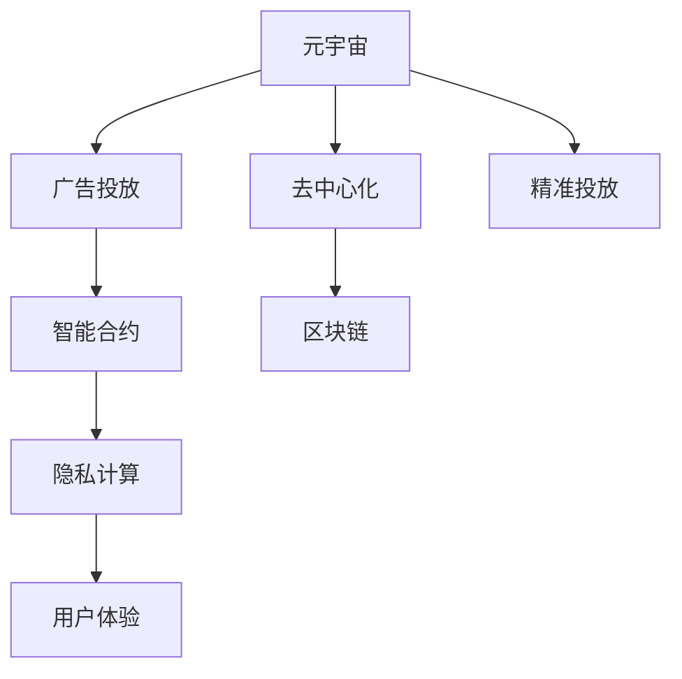

                 

# 注意力市场:元宇宙广告的新思路

> 关键词：元宇宙,注意力市场,广告投放,去中心化,智能合约,区块链

## 1. 背景介绍

### 1.1 问题由来
随着虚拟现实（VR）、增强现实（AR）、混合现实（MR）等技术的日益成熟，元宇宙（Metaverse）已经成为当今世界最热门的概念之一。据统计，元宇宙用户数量预计将在2030年达到30亿，市场规模将达1.5万亿美元。

在如此庞大的元宇宙市场中，广告作为重要的商业模式之一，其发展潜力巨大。然而，当前广告市场存在诸如资源垄断、用户隐私保护不足、广告效果难以评估等问题，亟需变革。

### 1.2 问题核心关键点
元宇宙广告的核心关键点在于：
- **去中心化**：去中心化广告投放机制，打破传统中心化广告网络的垄断，提升广告主和用户间的双向交互。
- **智能合约**：利用智能合约确保广告投放过程透明、可信、不可篡改。
- **用户体验**：在元宇宙中，用户体验至关重要，广告形式和内容需与环境融合，减少干扰。
- **精准投放**：根据用户行为和偏好，精准投放广告，提升广告效果。
- **数据隐私**：保护用户隐私，减少个人信息泄露。

## 2. 核心概念与联系

### 2.1 核心概念概述

元宇宙广告投放需要引入多个关键概念：

- **元宇宙**：一个基于虚拟现实技术的数字世界，包含完整的虚拟经济系统和社会结构。
- **去中心化**：广告投放不依赖中心化广告网络，基于区块链等技术，实现用户和广告主之间的双向交互。
- **智能合约**：利用区块链技术自动执行广告投放合约，提升广告投放的透明度和安全性。
- **区块链**：基于去中心化、公开透明的区块链技术，提供广告投放的安全保障。
- **隐私计算**：在保护用户隐私的前提下，利用密码学技术实现数据的计算和分析。

这些概念相互联系，共同构成了元宇宙广告的底层框架。

### 2.2 核心概念原理和架构的 Mermaid 流程图



上述图表展示了元宇宙广告的关键概念及其相互联系。元宇宙广告从元宇宙中获取用户数据，通过去中心化的区块链和智能合约进行广告投放，结合隐私计算保障用户隐私，最终提供以用户为中心的精准广告投放和优质用户体验。

## 3. 核心算法原理 & 具体操作步骤

### 3.1 算法原理概述

元宇宙广告的算法原理主要基于区块链技术和智能合约。广告主和用户通过智能合约进行交互，智能合约在区块链上自动执行，确保广告投放的透明、可信和不可篡改。

具体流程如下：
1. 广告主在元宇宙平台注册，并上传广告内容。
2. 智能合约根据广告主设定的投放规则，生成广告投放列表。
3. 用户在元宇宙平台浏览时，智能合约根据用户行为动态调整广告投放列表。
4. 用户点击广告后，智能合约自动完成支付和广告内容展示。
5. 广告主根据点击量和支付数据进行广告效果评估和费用结算。

### 3.2 算法步骤详解

#### 3.2.1 广告主注册与广告上传
广告主在元宇宙平台注册账户，并上传广告内容（如图像、视频、文字等）。广告内容需要经过平台审核，确保符合元宇宙的规则和标准。

#### 3.2.2 智能合约生成广告投放列表
智能合约根据广告主设定的投放规则，生成广告投放列表。投放规则包括：广告预算、投放时间、目标用户群体等。智能合约会根据这些规则，自动调整广告投放列表，确保广告效果最优。

#### 3.2.3 用户行为分析与广告投放调整
用户在元宇宙平台浏览时，智能合约会自动收集用户行为数据，如浏览时长、点击次数、停留区域等。基于这些数据，智能合约会动态调整广告投放列表，优先展示与用户行为最相关的广告。

#### 3.2.4 用户点击与支付
用户点击广告后，智能合约会自动完成支付流程，用户支付费用后，广告内容自动展示。

#### 3.2.5 广告效果评估与费用结算
广告主可以根据点击量和支付数据进行广告效果评估，智能合约根据支付数据自动完成费用结算，确保交易透明、可信。

### 3.3 算法优缺点

#### 3.3.1 优点
- **去中心化**：打破传统中心化广告网络的垄断，提升广告主和用户间的双向交互。
- **透明可信**：利用智能合约和区块链技术，确保广告投放过程透明、可信、不可篡改。
- **精准投放**：根据用户行为和偏好，精准投放广告，提升广告效果。
- **隐私保护**：利用隐私计算技术，保护用户隐私，减少个人信息泄露。

#### 3.3.2 缺点
- **技术门槛高**：智能合约和区块链技术的开发和维护需要较高的技术门槛。
- **运行成本高**：智能合约和区块链的运行需要消耗大量算力和存储资源。
- **用户接受度低**：部分用户可能对去中心化技术和隐私保护技术有抵触情绪。
- **监管难度大**：监管机构难以全面监管去中心化广告的合规性。

### 3.4 算法应用领域

元宇宙广告投放技术可以应用于多个领域：

- **电商**：在元宇宙中推广商品，精准定位用户，提升销售转化率。
- **旅游**：在元宇宙中展示旅游目的地，吸引用户到现实中旅游。
- **教育**：在元宇宙中推广在线课程，提供互动学习体验。
- **娱乐**：在元宇宙中推广游戏、音乐等娱乐内容，提升用户黏性。
- **医疗**：在元宇宙中推广健康产品，提供个性化健康管理服务。

## 4. 数学模型和公式 & 详细讲解

### 4.1 数学模型构建

元宇宙广告投放的数学模型可以概括为以下几部分：

- **广告主模型**：描述广告主的投放需求，如预算、投放时间、目标用户群体等。
- **用户模型**：描述用户在元宇宙中的行为和偏好，如浏览时长、点击次数、停留区域等。
- **广告效果模型**：描述广告投放的效果，如点击率、转化率等。
- **费用结算模型**：描述广告费用的计算和结算，如每次点击费用、每次展示费用等。

### 4.2 公式推导过程

#### 4.2.1 广告主模型
广告主模型描述了广告主的投放需求，公式如下：

$$
M = \left\{ \begin{aligned}
& \text{投放预算} \\
& \text{投放时间} \\
& \text{目标用户群体}
\end{aligned} \right.
$$

其中，投放预算为广告主愿意投入的总费用；投放时间为广告的起始时间和结束时间；目标用户群体包括用户的年龄、性别、地理位置等信息。

#### 4.2.2 用户模型
用户模型描述了用户在元宇宙中的行为和偏好，公式如下：

$$
U = \left\{ \begin{aligned}
& \text{浏览时长} \\
& \text{点击次数} \\
& \text{停留区域}
\end{aligned} \right.
$$

其中，浏览时长为用户在元宇宙中停留的总时间；点击次数为用户点击广告的次数；停留区域为用户停留的区域信息。

#### 4.2.3 广告效果模型
广告效果模型描述了广告投放的效果，公式如下：

$$
E = \left\{ \begin{aligned}
& \text{点击率} \\
& \text{转化率}
\end{aligned} \right.
$$

其中，点击率表示用户点击广告的比例；转化率表示用户完成支付的比例。

#### 4.2.4 费用结算模型
费用结算模型描述了广告费用的计算和结算，公式如下：

$$
C = \left\{ \begin{aligned}
& \text{每次点击费用} \\
& \text{每次展示费用}
\end{aligned} \right.
$$

其中，每次点击费用表示用户每次点击广告需要支付的费用；每次展示费用表示广告每次展示需要支付的费用。

### 4.3 案例分析与讲解

假设某电商平台在元宇宙中投放一则服装广告，投放预算为10,000元，投放时间为7月1日至7月31日，目标用户群体为25-40岁的女性用户。广告在元宇宙中的展示效果如下：

- 点击率为0.5%
- 转化率为5%
- 每次点击费用为0.1元

根据以上数据，可以计算出每次展示费用为：

$$
C_{展示} = \frac{总费用}{总展示次数} = \frac{10000}{展示次数} \times 0.5\% \times 5\% = 0.000125 \times \frac{10000}{展示次数}
$$

其中，展示次数为广告在元宇宙中的展示总次数。

## 5. 项目实践：代码实例和详细解释说明

### 5.1 开发环境搭建

1. **环境安装**：首先，需要安装Python、Node.js等开发环境。
2. **智能合约编写**：使用Solidity等编程语言编写智能合约，并在区块链上部署。
3. **广告投放平台搭建**：搭建元宇宙广告投放平台，实现广告上传、投放规则设定等功能。
4. **用户行为分析**：实现对用户行为的收集和分析，提供广告投放动态调整功能。

### 5.2 源代码详细实现

以下是广告主注册和广告上传的示例代码：

```python
# 广告主注册
def register_advertiser(advertiser_id, budget, start_time, end_time, target_user):
    # 将投放预算、时间、用户群体保存到智能合约中
    # 智能合约自动生成广告投放列表，并执行广告投放操作

# 广告上传
def upload_ad(advertiser_id, ad_content):
    # 将广告内容保存到智能合约中
    # 智能合约根据广告主的投放规则，自动调整广告投放列表
```

### 5.3 代码解读与分析

广告主注册和广告上传的代码主要涉及广告主的投放需求和广告内容上传。智能合约在后台自动处理广告投放，确保广告投放的透明、可信和不可篡改。广告投放过程中，智能合约会根据广告主的设定，动态调整广告投放列表，确保广告效果最优。

### 5.4 运行结果展示

广告投放平台运行结果如下：

1. 广告主注册账户，上传广告内容。
2. 智能合约根据广告主设定的投放规则，生成广告投放列表。
3. 用户在元宇宙平台浏览时，智能合约根据用户行为动态调整广告投放列表。
4. 用户点击广告后，智能合约自动完成支付流程，广告内容自动展示。
5. 广告主根据点击量和支付数据进行广告效果评估和费用结算。

## 6. 实际应用场景

### 6.1 智能客服系统

元宇宙广告可以应用于智能客服系统中。用户可以在元宇宙中寻找问题，点击广告链接，查看相关解决方案。智能合约根据用户行为，自动调整广告投放列表，提供最相关的解决方案，提升用户满意度。

### 6.2 在线教育平台

在线教育平台可以在元宇宙中推广在线课程，根据用户的学习行为，智能投放广告。广告内容可以为课程介绍、学习效果等，提升用户对课程的认知和兴趣。

### 6.3 旅游平台

旅游平台可以在元宇宙中推广旅游目的地，根据用户的浏览行为，智能投放广告。广告内容可以包含景点介绍、旅游优惠等，吸引用户到现实中旅游。

### 6.4 未来应用展望

元宇宙广告投放技术将带来以下未来应用展望：

1. **去中心化广告市场**：打破传统中心化广告网络的垄断，形成去中心化的广告市场，提升广告主和用户间的双向交互。
2. **个性化广告投放**：基于智能合约和区块链技术，实现精准广告投放，提升广告效果。
3. **隐私保护**：利用隐私计算技术，保护用户隐私，减少个人信息泄露。
4. **跨平台广告**：元宇宙广告将与现实世界广告无缝衔接，形成跨平台广告生态，提升广告投放的多样性和灵活性。

## 7. 工具和资源推荐

### 7.1 学习资源推荐

1. **《区块链技术与应用》课程**：由知名高校开设的区块链课程，深入浅出地介绍区块链技术和应用。
2. **《智能合约编程实战》书籍**：介绍智能合约的编程技巧和应用场景，帮助开发者掌握智能合约开发技术。
3. **《元宇宙技术白皮书》**：由知名公司或研究机构发布的元宇宙技术白皮书，涵盖元宇宙技术的前沿进展和应用案例。

### 7.2 开发工具推荐

1. **Solidity IDE**：开发智能合约的工具，提供代码编写、编译、部署等一站式服务。
2. **Metamask**：元宇宙中的钱包工具，用于管理数字资产和参与元宇宙交易。
3. **Truffle**：开发智能合约的框架，提供自动测试、部署、监控等功能。

### 7.3 相关论文推荐

1. **《区块链技术在元宇宙中的应用》**：介绍区块链技术在元宇宙中的应用，包括去中心化广告、智能合约等方面。
2. **《元宇宙广告的隐私保护技术》**：探讨元宇宙广告中用户隐私保护的实现技术，如隐私计算、差分隐私等。
3. **《元宇宙中的广告投放模型》**：介绍元宇宙广告投放的数学模型和算法优化方法。

## 8. 总结：未来发展趋势与挑战

### 8.1 研究成果总结

本文详细介绍了元宇宙广告投放的原理和操作步骤，涵盖了广告主注册、广告上传、智能合约生成、用户行为分析、广告投放调整、用户点击与支付、广告效果评估与费用结算等多个环节。基于区块链和智能合约技术，元宇宙广告可以实现去中心化、透明可信、精准投放和隐私保护等优点，具备广阔的应用前景。

### 8.2 未来发展趋势

元宇宙广告投放技术将呈现以下未来发展趋势：

1. **去中心化广告市场**：随着元宇宙用户数量的增长，去中心化广告市场将进一步发展壮大。
2. **智能合约优化**：智能合约将不断优化，提升广告投放的效率和安全性。
3. **跨平台广告**：元宇宙广告将与现实世界广告无缝衔接，形成跨平台广告生态。
4. **隐私保护技术**：隐私计算等隐私保护技术将不断进步，保障用户隐私安全。
5. **用户交互体验**：元宇宙广告将提升用户体验，减少广告的干扰和打扰。

### 8.3 面临的挑战

元宇宙广告投放技术仍面临以下挑战：

1. **技术门槛高**：智能合约和区块链技术的开发和维护需要较高的技术门槛。
2. **运行成本高**：智能合约和区块链的运行需要消耗大量算力和存储资源。
3. **用户接受度低**：部分用户可能对去中心化技术和隐私保护技术有抵触情绪。
4. **监管难度大**：监管机构难以全面监管去中心化广告的合规性。

### 8.4 研究展望

未来的研究需要在以下几个方面寻求新的突破：

1. **智能合约优化**：开发更加高效、低成本的智能合约，提升广告投放的效率和安全性。
2. **隐私保护技术**：结合差分隐私、多方安全计算等技术，提升隐私保护能力。
3. **用户体验优化**：优化广告形式和内容，减少对用户的干扰，提升用户体验。
4. **跨平台广告**：研究元宇宙广告与现实世界广告的衔接技术，提升广告投放的多样性和灵活性。
5. **监管合规**：研究去中心化广告的监管机制，确保广告投放的合法合规。

## 9. 附录：常见问题与解答

**Q1: 什么是元宇宙广告？**

A: 元宇宙广告是基于虚拟现实技术的广告投放形式，广告主在元宇宙平台上投放广告，通过智能合约实现广告的精准投放和费用结算。

**Q2: 智能合约在元宇宙广告中的应用有哪些？**

A: 智能合约在元宇宙广告中的应用包括广告主注册、广告上传、广告投放列表生成、用户行为分析、广告投放调整、用户点击与支付、广告效果评估与费用结算等环节。

**Q3: 元宇宙广告的优点有哪些？**

A: 元宇宙广告的优点包括去中心化、透明可信、精准投放、隐私保护等。

**Q4: 元宇宙广告的缺点有哪些？**

A: 元宇宙广告的缺点包括技术门槛高、运行成本高、用户接受度低、监管难度大等。

**Q5: 元宇宙广告的未来发展趋势是什么？**

A: 元宇宙广告的未来发展趋势包括去中心化广告市场的壮大、智能合约的优化、跨平台广告的实现、隐私保护技术的进步、用户体验的提升等。

---

作者：禅与计算机程序设计艺术 / Zen and the Art of Computer Programming

