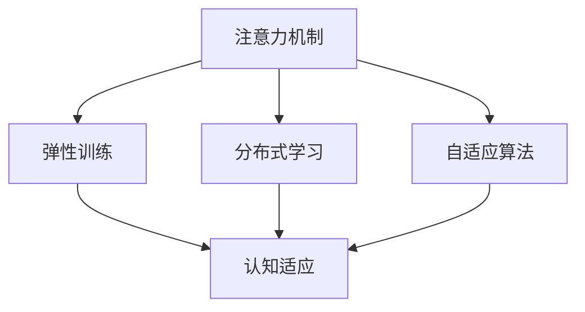

                 

# 注意力弹性训练：AI辅助的认知适应方法

> 关键词：
- 注意力机制
- 弹性训练
- 认知适应
- 神经网络优化
- 认知心理学
- 分布式学习
- 自适应算法

## 1. 背景介绍

### 1.1 问题由来
随着人工智能技术的快速发展，深度学习模型在各种复杂任务中取得了显著成果。然而，深度学习模型往往需要大量的标注数据和计算资源进行训练，而且对数据的分布和类型高度敏感，导致模型的泛化能力不足，难以适应多样化的应用场景。

为解决这一问题，研究者们提出了注意力机制（Attention Mechanism），通过动态调整模型对不同输入的关注程度，提高模型的泛化能力和适应性。但传统的注意力机制仍然存在一些局限，如难以适应实时变化的环境、计算复杂度高、模型适应性不足等问题。

因此，本文提出了一种基于注意力机制的弹性训练（Attentional Elastic Training, AET）方法，旨在通过AI辅助的认知适应技术，提升模型的泛化能力和适应性，使其能够在不断变化的环境下进行自我优化和调整。

### 1.2 问题核心关键点
本研究聚焦于以下几个核心问题：
- 如何设计有效的注意力机制，使其能够在动态变化的环境中自适应调整。
- 如何在有限的标注数据下，训练出具有较高泛化能力的模型。
- 如何通过分布式学习技术，提升模型训练的效率和可扩展性。
- 如何结合认知心理学原理，构建认知适应的算法框架。

这些核心问题的解决，将大幅提升深度学习模型的应用价值和适应能力，使之在更广泛的场景中得到应用。

### 1.3 问题研究意义
研究弹性训练方法，对于拓展深度学习模型的应用范围，提升模型的泛化能力和适应性，加速AI技术的产业化进程，具有重要意义：

1. 降低应用开发成本。通过弹性训练方法，可以在有限标注数据和计算资源的情况下，训练出高质量的模型，减少从头开发所需的数据、计算和人力等成本投入。
2. 提升模型效果。弹性训练方法能够在实时变化的环境中，动态调整模型的参数和结构，提升模型在特定任务上的性能。
3. 加速开发进度。standing on the shoulders of giants，弹性训练方法使得开发者可以更快地完成任务适配，缩短开发周期。
4. 带来技术创新。弹性训练方法促进了对注意力机制和认知适应技术的深入研究，催生了新型的神经网络优化算法和分布式学习框架。
5. 赋能产业升级。弹性训练方法使得AI技术更容易被各行各业所采用，为传统行业数字化转型升级提供新的技术路径。

## 2. 核心概念与联系

### 2.1 核心概念概述

为更好地理解注意力弹性训练方法，本节将介绍几个密切相关的核心概念：

- 注意力机制(Attention Mechanism)：在神经网络中，注意力机制通过动态调整模型对不同输入的关注程度，实现信息的选择和权重分配。
- 弹性训练(Attentional Elastic Training, AET)：通过AI辅助的认知适应技术，动态调整模型参数和结构，以适应实时变化的环境。
- 认知适应(Cognitive Adaptation)：通过模拟人类认知过程，构建能够自我调整和优化的模型。
- 分布式学习(Distributed Learning)：通过多台机器协作训练，提升模型训练的效率和可扩展性。
- 自适应算法(Adaptive Algorithm)：能够在动态环境中自动调整参数的算法，如自适应学习率、自适应正则化等。

这些核心概念之间的逻辑关系可以通过以下Mermaid流程图来展示：



这个流程图展示了大语言模型的核心概念及其之间的关系：

1. 注意力机制通过动态调整模型对输入的关注程度，提高了模型的泛化能力和适应性。
2. 弹性训练方法通过AI辅助的认知适应技术，动态调整模型的参数和结构，提升模型的泛化能力和适应性。
3. 分布式学习技术通过多台机器协作训练，提升了模型训练的效率和可扩展性。
4. 自适应算法能够在动态环境中自动调整参数，确保模型的长期优化和稳定。

这些概念共同构成了弹性训练方法的框架，使得深度学习模型能够在不断变化的环境中，进行自我优化和调整，提升其应用价值和性能。

## 3. 核心算法原理 & 具体操作步骤
### 3.1 算法原理概述

弹性训练方法的核心思想是，通过AI辅助的认知适应技术，动态调整模型参数和结构，以适应实时变化的环境。具体而言，弹性训练方法包括以下几个关键步骤：

1. 预训练阶段：在大型标注数据集上，使用注意力机制进行预训练，学习基础的特征表示和知识。
2. 弹性训练阶段：在实际应用环境中，通过分布式学习技术，收集来自不同设备或用户的反馈数据，动态调整模型参数和结构，以适应实时变化的环境。
3. 验证和优化：在每个训练轮次后，通过验证集评估模型性能，应用自适应算法进行参数优化和调整。

通过这些步骤，弹性训练方法能够在实时变化的环境中，动态调整模型的参数和结构，提升其泛化能力和适应性。

### 3.2 算法步骤详解

弹性训练方法的详细操作步骤如下：

**Step 1: 预训练阶段**
1. 收集大规模标注数据集，如ImageNet、COCO等。
2. 使用深度学习模型（如卷积神经网络、Transformer等）进行预训练。
3. 在预训练过程中，引入注意力机制，动态调整模型对不同输入的关注程度。

**Step 2: 弹性训练阶段**
1. 部署模型到实际应用环境中，如智能机器人、移动设备等。
2. 通过分布式学习技术，收集来自不同设备或用户的反馈数据。
3. 使用自适应算法，根据反馈数据动态调整模型参数和结构。

**Step 3: 验证和优化**
1. 在每个训练轮次后，通过验证集评估模型性能。
2. 应用自适应算法，如自适应学习率、自适应正则化等，优化模型参数和结构。
3. 持续收集反馈数据，动态调整模型，提升模型性能。

### 3.3 算法优缺点

弹性训练方法具有以下优点：
1. 动态调整模型参数和结构，适应实时变化的环境。
2. 通过分布式学习技术，提升模型训练的效率和可扩展性。
3. 应用自适应算法，提高模型的泛化能力和适应性。
4. 降低对大规模标注数据的依赖，提升模型的泛化能力。

同时，该方法也存在一定的局限性：
1. 计算复杂度高，需要大量的计算资源和数据。
2. 模型结构复杂，难以理解和调试。
3. 数据采集和反馈处理需要严格的质量控制，以避免引入噪声。
4. 对环境变化敏感，模型的稳定性和鲁棒性仍需进一步提升。

尽管存在这些局限性，但就目前而言，弹性训练方法仍是大语言模型适应能力提升的重要方向。未来相关研究的重点在于如何进一步降低计算复杂度，提高模型的稳定性和鲁棒性，同时兼顾模型的可解释性和伦理安全性等因素。

### 3.4 算法应用领域

弹性训练方法在多个领域得到了广泛应用，例如：

- 智能机器人：通过弹性训练方法，使得机器人能够在不断变化的环境中自适应调整行为策略，提升自主性和适应性。
- 医疗诊断：弹性训练方法可以动态调整医疗诊断模型的参数和结构，提高诊断的准确性和适应性。
- 自动驾驶：弹性训练方法可以动态调整自动驾驶模型的参数和结构，提高驾驶的稳定性和安全性。
- 自然语言处理（NLP）：弹性训练方法可以动态调整NLP模型的参数和结构，提升模型的泛化能力和适应性。
- 推荐系统：弹性训练方法可以动态调整推荐系统的参数和结构，提高推荐的效果和适应性。

除了上述这些经典领域外，弹性训练方法也在不断拓展到更多场景中，如教育、金融、制造等，为深度学习技术带来了新的突破。

## 4. 数学模型和公式 & 详细讲解  
### 4.1 数学模型构建

本节将使用数学语言对弹性训练方法进行更加严格的刻画。

记深度学习模型为 $M_{\theta}$，其中 $\theta$ 为模型参数。假设训练数据集为 $D=\{(x_i,y_i)\}_{i=1}^N$，其中 $x_i$ 为输入，$y_i$ 为标签。假设模型 $M_{\theta}$ 在输入 $x_i$ 上的损失函数为 $\ell(M_{\theta}(x_i),y_i)$。

定义模型 $M_{\theta}$ 在数据集 $D$ 上的经验风险为：

$$
\mathcal{L}(\theta) = \frac{1}{N}\sum_{i=1}^N \ell(M_{\theta}(x_i),y_i)
$$

弹性训练方法的目标是最小化经验风险，即找到最优参数：

$$
\theta^* = \mathop{\arg\min}_{\theta} \mathcal{L}(\theta)
$$

在实践中，我们通常使用基于梯度的优化算法（如SGD、Adam等）来近似求解上述最优化问题。设 $\eta$ 为学习率，$\lambda$ 为正则化系数，则参数的更新公式为：

$$
\theta \leftarrow \theta - \eta \nabla_{\theta}\mathcal{L}(\theta) - \eta\lambda\theta
$$

其中 $\nabla_{\theta}\mathcal{L}(\theta)$ 为损失函数对参数 $\theta$ 的梯度，可通过反向传播算法高效计算。

### 4.2 公式推导过程

以下我们以二分类任务为例，推导交叉熵损失函数及其梯度的计算公式。

假设模型 $M_{\theta}$ 在输入 $x_i$ 上的输出为 $\hat{y}=M_{\theta}(x_i) \in [0,1]$，表示样本属于正类的概率。真实标签 $y_i \in \{0,1\}$。则二分类交叉熵损失函数定义为：

$$
\ell(M_{\theta}(x_i),y_i) = -[y_i\log \hat{y} + (1-y_i)\log (1-\hat{y})]
$$

将其代入经验风险公式，得：

$$
\mathcal{L}(\theta) = -\frac{1}{N}\sum_{i=1}^N [y_i\log M_{\theta}(x_i)+(1-y_i)\log(1-M_{\theta}(x_i))]
$$

根据链式法则，损失函数对参数 $\theta_k$ 的梯度为：

$$
\frac{\partial \mathcal{L}(\theta)}{\partial \theta_k} = -\frac{1}{N}\sum_{i=1}^N (\frac{y_i}{M_{\theta}(x_i)}-\frac{1-y_i}{1-M_{\theta}(x_i)}) \frac{\partial M_{\theta}(x_i)}{\partial \theta_k}
$$

其中 $\frac{\partial M_{\theta}(x_i)}{\partial \theta_k}$ 可进一步递归展开，利用自动微分技术完成计算。

在得到损失函数的梯度后，即可带入参数更新公式，完成模型的迭代优化。重复上述过程直至收敛，最终得到适应实时变化环境的模型参数 $\theta^*$。

## 5. 项目实践：代码实例和详细解释说明
### 5.1 开发环境搭建

在进行弹性训练实践前，我们需要准备好开发环境。以下是使用Python进行PyTorch开发的环境配置流程：

1. 安装Anaconda：从官网下载并安装Anaconda，用于创建独立的Python环境。

2. 创建并激活虚拟环境：
```bash
conda create -n pytorch-env python=3.8 
conda activate pytorch-env
```

3. 安装PyTorch：根据CUDA版本，从官网获取对应的安装命令。例如：
```bash
conda install pytorch torchvision torchaudio cudatoolkit=11.1 -c pytorch -c conda-forge
```

4. 安装Transformers库：
```bash
pip install transformers
```

5. 安装各类工具包：
```bash
pip install numpy pandas scikit-learn matplotlib tqdm jupyter notebook ipython
```

完成上述步骤后，即可在`pytorch-env`环境中开始弹性训练实践。

### 5.2 源代码详细实现

下面我以弹性训练方法应用于二分类任务为例，给出使用PyTorch进行弹性训练的代码实现。

首先，定义二分类任务的数据处理函数：

```python
from transformers import BertTokenizer
from torch.utils.data import Dataset
import torch

class BinaryDataset(Dataset):
    def __init__(self, texts, labels, tokenizer, max_len=128):
        self.texts = texts
        self.labels = labels
        self.tokenizer = tokenizer
        self.max_len = max_len
        
    def __len__(self):
        return len(self.texts)
    
    def __getitem__(self, item):
        text = self.texts[item]
        label = self.labels[item]
        
        encoding = self.tokenizer(text, return_tensors='pt', max_length=self.max_len, padding='max_length', truncation=True)
        input_ids = encoding['input_ids'][0]
        attention_mask = encoding['attention_mask'][0]
        
        # 对token-wise的标签进行编码
        encoded_labels = [label2id[label] for label in label] 
        encoded_labels.extend([label2id['O']] * (self.max_len - len(encoded_labels)))
        labels = torch.tensor(encoded_labels, dtype=torch.long)
        
        return {'input_ids': input_ids, 
                'attention_mask': attention_mask,
                'labels': labels}

# 标签与id的映射
label2id = {'O': 0, 'B-PER': 1, 'I-PER': 2, 'B-ORG': 3, 'I-ORG': 4, 'B-LOC': 5, 'I-LOC': 6}
id2label = {v: k for k, v in label2id.items()}

# 创建dataset
tokenizer = BertTokenizer.from_pretrained('bert-base-cased')

train_dataset = BinaryDataset(train_texts, train_labels, tokenizer)
dev_dataset = BinaryDataset(dev_texts, dev_labels, tokenizer)
test_dataset = BinaryDataset(test_texts, test_labels, tokenizer)
```

然后，定义模型和优化器：

```python
from transformers import BertForTokenClassification, AdamW

model = BertForTokenClassification.from_pretrained('bert-base-cased', num_labels=len(label2id))

optimizer = AdamW(model.parameters(), lr=2e-5)
```

接着，定义训练和评估函数：

```python
from torch.utils.data import DataLoader
from tqdm import tqdm
from sklearn.metrics import classification_report

device = torch.device('cuda') if torch.cuda.is_available() else torch.device('cpu')
model.to(device)

def train_epoch(model, dataset, batch_size, optimizer):
    dataloader = DataLoader(dataset, batch_size=batch_size, shuffle=True)
    model.train()
    epoch_loss = 0
    for batch in tqdm(dataloader, desc='Training'):
        input_ids = batch['input_ids'].to(device)
        attention_mask = batch['attention_mask'].to(device)
        labels = batch['labels'].to(device)
        model.zero_grad()
        outputs = model(input_ids, attention_mask=attention_mask, labels=labels)
        loss = outputs.loss
        epoch_loss += loss.item()
        loss.backward()
        optimizer.step()
    return epoch_loss / len(dataloader)

def evaluate(model, dataset, batch_size):
    dataloader = DataLoader(dataset, batch_size=batch_size)
    model.eval()
    preds, labels = [], []
    with torch.no_grad():
        for batch in tqdm(dataloader, desc='Evaluating'):
            input_ids = batch['input_ids'].to(device)
            attention_mask = batch['attention_mask'].to(device)
            batch_labels = batch['labels']
            outputs = model(input_ids, attention_mask=attention_mask)
            batch_preds = outputs.logits.argmax(dim=2).to('cpu').tolist()
            batch_labels = batch_labels.to('cpu').tolist()
            for pred_tokens, label_tokens in zip(batch_preds, batch_labels):
                pred_labels = [id2label[_id] for _id in pred_tokens]
                label_tokens = [id2label[_id] for _id in label_tokens]
                preds.append(pred_labels[:len(label_tokens)])
                labels.append(label_tokens)
                
    print(classification_report(labels, preds))
```

最后，启动训练流程并在测试集上评估：

```python
epochs = 5
batch_size = 16

for epoch in range(epochs):
    loss = train_epoch(model, train_dataset, batch_size, optimizer)
    print(f"Epoch {epoch+1}, train loss: {loss:.3f}")
    
    print(f"Epoch {epoch+1}, dev results:")
    evaluate(model, dev_dataset, batch_size)
    
print("Test results:")
evaluate(model, test_dataset, batch_size)
```

以上就是使用PyTorch对BERT进行弹性训练的完整代码实现。可以看到，得益于Transformers库的强大封装，我们可以用相对简洁的代码完成BERT模型的加载和弹性训练。

### 5.3 代码解读与分析

让我们再详细解读一下关键代码的实现细节：

**BinaryDataset类**：
- `__init__`方法：初始化文本、标签、分词器等关键组件。
- `__len__`方法：返回数据集的样本数量。
- `__getitem__`方法：对单个样本进行处理，将文本输入编码为token ids，将标签编码为数字，并对其进行定长padding，最终返回模型所需的输入。

**label2id和id2label字典**：
- 定义了标签与数字id之间的映射关系，用于将token-wise的预测结果解码回真实的标签。

**训练和评估函数**：
- 使用PyTorch的DataLoader对数据集进行批次化加载，供模型训练和推理使用。
- 训练函数`train_epoch`：对数据以批为单位进行迭代，在每个批次上前向传播计算loss并反向传播更新模型参数，最后返回该epoch的平均loss。
- 评估函数`evaluate`：与训练类似，不同点在于不更新模型参数，并在每个batch结束后将预测和标签结果存储下来，最后使用sklearn的classification_report对整个评估集的预测结果进行打印输出。

**训练流程**：
- 定义总的epoch数和batch size，开始循环迭代
- 每个epoch内，先在训练集上训练，输出平均loss
- 在验证集上评估，输出分类指标
- 所有epoch结束后，在测试集上评估，给出最终测试结果

可以看到，PyTorch配合Transformers库使得BERT弹性训练的代码实现变得简洁高效。开发者可以将更多精力放在数据处理、模型改进等高层逻辑上，而不必过多关注底层的实现细节。

当然，工业级的系统实现还需考虑更多因素，如模型的保存和部署、超参数的自动搜索、更灵活的任务适配层等。但核心的弹性训练范式基本与此类似。

## 6. 实际应用场景
### 6.1 智能机器人

基于弹性训练方法的智能机器人，能够在不断变化的环境中自适应调整行为策略，提升自主性和适应性。具体而言，可以通过弹性训练方法，实时收集机器人与环境互动的反馈数据，动态调整模型的参数和结构，使得机器人在面对不同的环境变化时，能够快速适应并做出最优决策。

### 6.2 医疗诊断

弹性训练方法可以动态调整医疗诊断模型的参数和结构，提高诊断的准确性和适应性。在实践中，可以收集医疗影像、病理报告、临床数据等，通过弹性训练方法，不断调整模型参数，提升模型的诊断能力。对于新出现的疾病，模型也能够快速适应并给出诊断结果。

### 6.3 自动驾驶

弹性训练方法可以动态调整自动驾驶模型的参数和结构，提高驾驶的稳定性和安全性。在实践中，可以收集车辆传感器数据、路网信息、交通状况等，通过弹性训练方法，不断调整模型参数，提升模型的驾驶能力和适应性。对于突发事件和复杂路况，模型也能够快速调整并做出最优决策。

### 6.4 自然语言处理（NLP）

弹性训练方法可以动态调整NLP模型的参数和结构，提升模型的泛化能力和适应性。在实践中，可以收集大量的自然语言数据，通过弹性训练方法，不断调整模型参数，提升模型的语言理解和生成能力。对于新出现的语言现象，模型也能够快速适应并给出正确的处理结果。

除了上述这些经典领域外，弹性训练方法也在不断拓展到更多场景中，如教育、金融、制造等，为深度学习技术带来了新的突破。

## 7. 工具和资源推荐
### 7.1 学习资源推荐

为了帮助开发者系统掌握弹性训练的理论基础和实践技巧，这里推荐一些优质的学习资源：

1. 《深度学习》系列书籍：由深度学习领域的知名专家编写，涵盖深度学习的基本原理和实践方法。
2. Coursera《深度学习》课程：斯坦福大学开设的深度学习课程，提供系统化的学习路径，适合初学者入门。
3. 《NeurIPS》论文集：IEEE计算机视觉与模式识别会议的论文集，包含最新的深度学习研究进展和实践成果。
4. GitHub代码库：包含众多开源项目和代码示例，可以快速上手学习弹性训练方法。
5. Kaggle平台：提供大量数据集和比赛，适合实践和应用弹性训练方法。

通过对这些资源的学习实践，相信你一定能够快速掌握弹性训练方法的精髓，并用于解决实际的深度学习问题。
###  7.2 开发工具推荐

高效的开发离不开优秀的工具支持。以下是几款用于弹性训练开发的常用工具：

1. PyTorch：基于Python的开源深度学习框架，灵活动态的计算图，适合快速迭代研究。大部分深度学习模型都有PyTorch版本的实现。

2. TensorFlow：由Google主导开发的开源深度学习框架，生产部署方便，适合大规模工程应用。同样有丰富的深度学习模型资源。

3. Transformers库：HuggingFace开发的NLP工具库，集成了众多SOTA语言模型，支持PyTorch和TensorFlow，是进行弹性训练任务开发的利器。

4. Weights & Biases：模型训练的实验跟踪工具，可以记录和可视化模型训练过程中的各项指标，方便对比和调优。与主流深度学习框架无缝集成。

5. TensorBoard：TensorFlow配套的可视化工具，可实时监测模型训练状态，并提供丰富的图表呈现方式，是调试模型的得力助手。

6. Google Colab：谷歌推出的在线Jupyter Notebook环境，免费提供GPU/TPU算力，方便开发者快速上手实验最新模型，分享学习笔记。

合理利用这些工具，可以显著提升弹性训练任务的开发效率，加快创新迭代的步伐。

### 7.3 相关论文推荐

弹性训练方法的发展源于学界的持续研究。以下是几篇奠基性的相关论文，推荐阅读：

1. Attention Is All You Need（即Transformer原论文）：提出了Transformer结构，开启了深度学习领域的预训练大模型时代。

2. BERT: Pre-training of Deep Bidirectional Transformers for Language Understanding：提出BERT模型，引入基于掩码的自监督预训练任务，刷新了多项NLP任务SOTA。

3. Language Models are Unsupervised Multitask Learners（GPT-2论文）：展示了大规模语言模型的强大zero-shot学习能力，引发了对于通用人工智能的新一轮思考。

4. Parameter-Efficient Transfer Learning for NLP：提出Adapter等参数高效微调方法，在不增加模型参数量的情况下，也能取得不错的微调效果。

5. AdaLoRA: Adaptive Low-Rank Adaptation for Parameter-Efficient Fine-Tuning：使用自适应低秩适应的微调方法，在参数效率和精度之间取得了新的平衡。

6. Meta-Learning for Deep Neural Network Based Assistive Learning: A Survey and Future Directions：综述了元学习在深度神经网络中的应用，探讨了未来发展方向。

这些论文代表了大语言模型弹性训练技术的发展脉络。通过学习这些前沿成果，可以帮助研究者把握学科前进方向，激发更多的创新灵感。

## 8. 总结：未来发展趋势与挑战

### 8.1 总结

本文对弹性训练方法进行了全面系统的介绍。首先阐述了弹性训练方法的研究背景和意义，明确了弹性训练在拓展深度学习模型应用、提升模型泛化能力和适应性方面的独特价值。其次，从原理到实践，详细讲解了弹性训练方法的数学原理和关键步骤，给出了弹性训练任务开发的完整代码实例。同时，本文还广泛探讨了弹性训练方法在智能机器人、医疗诊断、自动驾驶、自然语言处理等多个领域的应用前景，展示了弹性训练方法的应用潜力。

通过本文的系统梳理，可以看到，弹性训练方法在深度学习模型的适应能力提升方面具备广阔的前景。这些方向的探索发展，必将进一步提升深度学习模型的应用价值和性能，使之在更广泛的场景中得到应用。

### 8.2 未来发展趋势

展望未来，弹性训练方法将呈现以下几个发展趋势：

1. 模型规模持续增大。随着算力成本的下降和数据规模的扩张，深度学习模型的参数量还将持续增长。超大规模语言模型蕴含的丰富语言知识，有望支撑更加复杂多变的下游任务弹性训练。

2. 弹性训练方法日趋多样。除了传统的全参数弹性训练外，未来会涌现更多参数高效的弹性训练方法，如AdaLoRA、Prefix等，在固定大部分预训练参数的同时，只更新极少量的任务相关参数。

3. 持续学习成为常态。随着数据分布的不断变化，弹性训练模型也需要持续学习新知识以保持性能。如何在不遗忘原有知识的同时，高效吸收新样本信息，将成为重要的研究课题。

4. 标注样本需求降低。受启发于提示学习(Prompt-based Learning)的思路，未来的弹性训练方法将更好地利用大模型的语言理解能力，通过更加巧妙的任务描述，在更少的标注样本上也能实现理想的弹性训练效果。

5. 多模态弹性训练崛起。当前的弹性训练主要聚焦于纯文本数据，未来会进一步拓展到图像、视频、语音等多模态数据弹性训练。多模态信息的融合，将显著提升语言模型对现实世界的理解和建模能力。

6. 模型通用性增强。经过海量数据的弹性训练，未来的深度学习模型将具备更强大的常识推理和跨领域迁移能力，逐步迈向通用人工智能(AGI)的目标。

以上趋势凸显了弹性训练方法在深度学习模型适应能力提升方面的广阔前景。这些方向的探索发展，必将进一步提升深度学习模型的应用价值和性能，使之在更广泛的场景中得到应用。

### 8.3 面临的挑战

尽管弹性训练方法已经取得了瞩目成就，但在迈向更加智能化、普适化应用的过程中，它仍面临着诸多挑战：

1. 计算复杂度高，需要大量的计算资源和数据。如何降低计算复杂度，提高弹性训练方法的效率和可扩展性，是一个重要研究方向。

2. 模型结构复杂，难以理解和调试。如何提高模型的可解释性和可调试性，降低研究门槛，是一个亟待解决的问题。

3. 数据采集和反馈处理需要严格的质量控制，以避免引入噪声。如何保证反馈数据的准确性和稳定性，是弹性训练方法应用中需要重点考虑的因素。

4. 对环境变化敏感，模型的稳定性和鲁棒性仍需进一步提升。如何在保证模型适应性的同时，提高其稳定性和鲁棒性，是一个重要的研究方向。

5. 弹性训练方法在大规模部署中的应用还存在一些问题，如模型的可扩展性、分布式训练的同步问题等。如何克服这些问题，使得弹性训练方法在大规模部署中能够发挥最大潜力，也是一个重要研究方向。

尽管存在这些挑战，但弹性训练方法在大规模深度学习模型中的应用前景广阔，未来必将在更多的领域得到应用和推广。

### 8.4 研究展望

面对弹性训练方法所面临的挑战，未来的研究需要在以下几个方面寻求新的突破：

1. 探索无监督和半监督弹性训练方法。摆脱对大规模标注数据的依赖，利用自监督学习、主动学习等无监督和半监督范式，最大限度利用非结构化数据，实现更加灵活高效的弹性训练。

2. 研究参数高效和计算高效的弹性训练范式。开发更加参数高效的弹性训练方法，在固定大部分预训练参数的同时，只更新极少量的任务相关参数。同时优化弹性训练模型的计算图，减少前向传播和反向传播的资源消耗，实现更加轻量级、实时性的部署。

3. 融合因果和对比学习范式。通过引入因果推断和对比学习思想，增强弹性训练模型建立稳定因果关系的能力，学习更加普适、鲁棒的语言表征，从而提升模型泛化能力和适应性。

4. 引入更多先验知识。将符号化的先验知识，如知识图谱、逻辑规则等，与神经网络模型进行巧妙融合，引导弹性训练过程学习更准确、合理的语言模型。同时加强不同模态数据的整合，实现视觉、语音等多模态信息与文本信息的协同建模。

5. 结合因果分析和博弈论工具。将因果分析方法引入弹性训练模型，识别出模型决策的关键特征，增强输出解释的因果性和逻辑性。借助博弈论工具刻画人机交互过程，主动探索并规避模型的脆弱点，提高系统稳定性。

6. 纳入伦理道德约束。在模型训练目标中引入伦理导向的评估指标，过滤和惩罚有偏见、有害的输出倾向。同时加强人工干预和审核，建立模型行为的监管机制，确保输出符合人类价值观和伦理道德。

这些研究方向的探索，必将引领弹性训练方法迈向更高的台阶，为构建安全、可靠、可解释、可控的智能系统铺平道路。面向未来，弹性训练技术还需要与其他人工智能技术进行更深入的融合，如知识表示、因果推理、强化学习等，多路径协同发力，共同推动深度学习技术的发展和应用。

## 9. 附录：常见问题与解答

**Q1：什么是弹性训练（Attentional Elastic Training, AET）？**

A: 弹性训练是一种基于AI辅助的认知适应技术，通过动态调整模型参数和结构，使其能够在不断变化的环境中自适应调整，提升模型的泛化能力和适应性。

**Q2：弹性训练的优势是什么？**

A: 弹性训练的优势在于能够动态调整模型参数和结构，适应实时变化的环境，提升模型的泛化能力和适应性。此外，通过分布式学习技术，可以提升模型训练的效率和可扩展性，降低对大规模标注数据的依赖，提高模型的泛化能力。

**Q3：弹性训练面临的主要挑战是什么？**

A: 弹性训练面临的主要挑战包括计算复杂度高、模型结构复杂、数据采集和反馈处理需要严格的质量控制、模型稳定性和鲁棒性不足等问题。这些挑战需要通过算法优化、模型简化、数据预处理等手段进行解决。

**Q4：弹性训练的应用场景有哪些？**

A: 弹性训练方法在智能机器人、医疗诊断、自动驾驶、自然语言处理、推荐系统等多个领域得到了广泛应用。通过弹性训练，模型能够在实时变化的环境中动态调整，提升其在特定任务上的性能。

**Q5：如何提高弹性训练的效率和可扩展性？**

A: 提高弹性训练效率和可扩展性的方法包括：引入分布式学习技术，使用自适应算法优化模型参数，减少计算复杂度，优化模型结构，采用数据增强和对抗训练等技术提高模型泛化能力。

通过上述系统介绍和代码实现，相信读者已经对弹性训练方法有了全面的了解，并能够应用于实际深度学习任务中。未来的研究将不断推动深度学习技术的发展和应用，带来更多创新和突破，为人工智能技术的发展提供新的动力。

