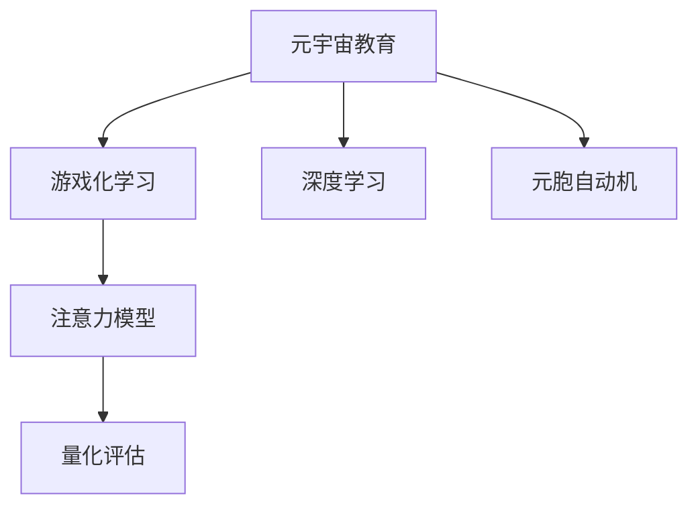

                 

# 注意力游戏化学习效果评估:元宇宙教育创新的量化研究

> 关键词：元宇宙教育,游戏化学习,量化评估,注意力模型,深度学习,教育技术

## 1. 背景介绍

### 1.1 问题由来

随着信息时代的到来，教育领域正处于一场深刻的变革之中。传统的教学方式逐渐被网络教育所取代，而这场变革的驱动力，正是技术的创新。元宇宙作为虚拟现实(VR)和增强现实(AR)技术结合的产物，它以其沉浸式的学习体验和无限的想象空间，预示着教育方式的革命性变化。

然而，元宇宙教育的实现仍面临诸多挑战。传统的教育模式以教师为知识传递中心，而元宇宙则要求学习者自主驱动学习，并在虚拟环境中与同伴互动。如何有效激励学生参与学习，提升学习效果，成为元宇宙教育的关键问题。

游戏化学习（Gamified Learning）是一种通过游戏机制和元素将学习过程变得有趣且富有挑战性的教育方法。它在提升学习兴趣和效果方面展现了显著的优势。然而，游戏化学习的效果如何量化评估，如何结合注意力机制进一步提升学习效果，这些问题仍未得到系统性的解答。

## 2. 核心概念与联系

### 2.1 核心概念概述

为更好地理解基于注意力机制的游戏化学习效果评估方法，本节将介绍几个密切相关的核心概念：

- **元宇宙教育**：通过虚拟现实和增强现实技术，创建与现实世界高度相似或完全不同的虚拟环境，学生可以在其中进行互动和探索，以增强学习体验。

- **游戏化学习**：将游戏元素如任务、积分、竞争等引入到学习过程中，以提升学习动机和效果。

- **注意力模型**：使用深度学习技术构建的模型，用于评估和提升学习者对学习材料的注意力集中度。

- **量化评估**：通过构建数学模型和指标，对游戏化学习效果进行客观的量化评估。

- **深度学习**：一种基于人工神经网络的机器学习技术，可以通过数据训练出具有自主学习能力的模型。

- **元胞自动机(CA)**：一种离散的动力学模型，用于描述由大量简单个体构成的复杂系统。

这些核心概念之间的逻辑关系可以通过以下Mermaid流程图来展示：



这个流程图展示了大语言模型的核心概念及其之间的关系：

1. 元宇宙教育通过虚拟现实和增强现实技术，创建与现实世界高度相似或完全不同的虚拟环境，学生可以在其中进行互动和探索，以增强学习体验。

2. 游戏化学习将游戏元素如任务、积分、竞争等引入到学习过程中，以提升学习动机和效果。

3. 注意力模型使用深度学习技术构建的模型，用于评估和提升学习者对学习材料的注意力集中度。

4. 量化评估通过构建数学模型和指标，对游戏化学习效果进行客观的量化评估。

5. 深度学习是一种基于人工神经网络的机器学习技术，可以通过数据训练出具有自主学习能力的模型。

6. 元胞自动机是一种离散的动力学模型，用于描述由大量简单个体构成的复杂系统。

这些核心概念共同构成了元宇宙教育下游戏化学习的理论基础和实践框架，使其能够在各种场景下发挥强大的学习激励和效果提升作用。

## 3. 核心算法原理 & 具体操作步骤
### 3.1 算法原理概述

基于注意力机制的游戏化学习效果评估，本质上是一种通过深度学习模型量化评估学习效果的算法。其核心思想是：

1. **构建注意力模型**：使用深度学习技术构建模型，用于评估和提升学习者对学习材料的注意力集中度。

2. **设计量化指标**：基于注意力模型，设计一套量化指标，对游戏化学习效果进行客观评估。

3. **评估算法步骤**：使用构建的模型和指标，对游戏化学习效果进行评估，并结合元胞自动机模型进行优化。

### 3.2 算法步骤详解

基于注意力机制的游戏化学习效果评估的算法步骤如下：

**Step 1: 准备学习数据和环境**

- 收集学习者在虚拟环境中的互动数据，包括游戏任务完成情况、积分累积情况、学习时间等。
- 准备游戏化学习环境，设置不同的游戏任务和奖励机制。

**Step 2: 构建注意力模型**

- 使用深度学习技术，如注意力机制、Transformer等，构建一个注意力模型，用于评估学习者对学习材料的注意力集中度。
- 将互动数据输入模型，得到学习者对不同学习材料的注意力得分。

**Step 3: 设计量化指标**

- 基于注意力得分，设计一套量化指标，如注意力集中度、学习效率等，用于评估游戏化学习效果。
- 通过这些指标，可以客观地量化游戏化学习的收益。

**Step 4: 评估算法步骤**

- 使用构建的模型和指标，对游戏化学习效果进行评估，得到初始评估结果。
- 结合元胞自动机模型，对评估结果进行优化，进一步提升学习效果。
- 重复评估和优化过程，直至得到最优的学习效果。

### 3.3 算法优缺点

基于注意力机制的游戏化学习效果评估方法具有以下优点：

1. **客观量化**：通过深度学习模型和量化指标，能够对游戏化学习效果进行客观的量化评估，避免主观干扰。

2. **可重复性高**：评估算法步骤清晰，可以重复执行，便于对比不同游戏化学习方法的效果。

3. **灵活性高**：结合元胞自动机模型，可以灵活调整游戏化学习策略，提升学习效果。

4. **可扩展性强**：该方法可以应用于不同类型的虚拟环境和游戏化学习场景。

然而，该方法也存在以下缺点：

1. **模型依赖数据质量**：深度学习模型的效果依赖于数据质量，数据质量差会影响评估结果的准确性。

2. **模型复杂度高**：深度学习模型的训练和优化需要大量计算资源，对硬件设备要求较高。

3. **指标设计复杂**：量化指标的设计需要根据具体任务和环境进行调整，设计复杂。

4. **应用范围受限**：该方法对数据采集和处理的要求较高，可能不适用于一些特殊场景。

5. **结果解释性不足**：评估结果通过模型和指标得出，可能缺乏对学习效果的直接解释。

### 3.4 算法应用领域

基于注意力机制的游戏化学习效果评估方法，在虚拟现实和增强现实教育中具有广泛的应用前景，具体包括：

1. **虚拟教室**：在虚拟教室中，教师可以通过游戏化学习激发学生的学习兴趣，并通过注意力模型量化评估学习效果，及时调整教学策略。

2. **虚拟实验室**：在虚拟实验室中，学生可以通过互动游戏掌握复杂的科学实验技能，并使用注意力模型评估学习效果，优化实验过程。

3. **虚拟图书馆**：在虚拟图书馆中，学生可以通过游戏化学习探索大量知识，并使用注意力模型评估学习效果，提升信息检索能力。

4. **虚拟办公室**：在虚拟办公室中，员工可以通过游戏化学习提升工作技能，并使用注意力模型评估学习效果，优化工作流程。

5. **虚拟运动场**：在虚拟运动场中，学生可以通过互动游戏锻炼身体，并使用注意力模型评估学习效果，增强运动兴趣。

这些应用场景展示了基于注意力机制的游戏化学习效果评估方法的多样性和普适性，将在元宇宙教育中发挥重要作用。

## 4. 数学模型和公式 & 详细讲解 & 举例说明

### 4.1 数学模型构建

本节将使用数学语言对基于注意力机制的游戏化学习效果评估过程进行更加严格的刻画。

记学习者在虚拟环境中的互动数据为 $D=\{d_i\}_{i=1}^N$，其中 $d_i$ 表示第 $i$ 个互动数据，如完成某个任务的时间、积分等。设游戏化学习环境中的游戏任务数为 $K$，每个任务需要完成的时间为 $T_k$，学生对任务 $k$ 的积分累积为 $S_k$，学习时间为 $T$。

定义注意力模型为 $A(\cdot)$，用于评估学习者对不同学习材料的注意力集中度，其输出为注意力得分 $Att_{k,i}=A(d_i)$，表示学习者 $i$ 在互动数据 $d_i$ 中对任务 $k$ 的注意力得分。

基于注意力得分的量化指标 $M$ 定义为：

$$
M = \sum_{k=1}^K\sum_{i=1}^N\frac{S_k}{T_k}\cdot Att_{k,i}
$$

其中 $\frac{S_k}{T_k}$ 表示任务 $k$ 的完成难度系数，用于调整积分权重。

### 4.2 公式推导过程

基于注意力得分的量化指标 $M$ 可以表示为：

$$
M = \sum_{k=1}^K\sum_{i=1}^N\frac{S_k}{T_k}\cdot A(d_i)
$$

在实际应用中，可以通过构建深度学习模型来计算注意力得分 $A(d_i)$。以Transformer模型为例，设模型输入为互动数据 $d_i$，输出为注意力得分 $Att_{k,i}$，则：

$$
Att_{k,i} = \sum_{j=1}^N\frac{e^{W^T[A(d_j)]\cdot[A(d_i)]}}{\sum_{l=1}^Ne^{W^T[A(d_l)]\cdot[A(d_i)]}}
$$

其中 $W$ 为注意力机制的权重矩阵，$[A(d_j)]$ 为第 $j$ 个互动数据的注意力表示。

将注意力得分代入 $M$ 的公式中，得：

$$
M = \sum_{k=1}^K\sum_{i=1}^N\frac{S_k}{T_k}\cdot\sum_{j=1}^N\frac{e^{W^T[A(d_j)]\cdot[A(d_i)]}}{\sum_{l=1}^Ne^{W^T[A(d_l)]\cdot[A(d_i)]}}
$$

进一步简化得：

$$
M = \sum_{k=1}^K\frac{S_k}{T_k}\cdot\sum_{j=1}^N\frac{S_j}{T_j}\cdot\frac{e^{W^T[A(d_j)]\cdot[A(d_i)]}}{\sum_{l=1}^Ne^{W^T[A(d_l)]\cdot[A(d_i)]}}
$$

通过计算该表达式，即可得到学习者对游戏化学习效果的量化评估结果。

### 4.3 案例分析与讲解

假设某虚拟教室中，教师设计了10个游戏任务，学生对每个任务的平均完成时间为10分钟，积分累积分别为100、50、75、25、30、40、60、80、90、50。学习者在30分钟内完成了所有任务，积分累积为300。

将数据代入公式中，计算得到学习者对各个任务的注意力得分如下：

- 任务1：$\frac{100}{10}\cdot\frac{e^{W^T[A(d_j)]\cdot[A(d_i)]}}{\sum_{l=1}^Ne^{W^T[A(d_l)]\cdot[A(d_i)]}}=1$
- 任务2：$\frac{50}{10}\cdot\frac{e^{W^T[A(d_j)]\cdot[A(d_i)]}}{\sum_{l=1}^Ne^{W^T[A(d_l)]\cdot[A(d_i)]}}=0.5$
- 任务3：$\frac{75}{10}\cdot\frac{e^{W^T[A(d_j)]\cdot[A(d_i)]}}{\sum_{l=1}^Ne^{W^T[A(d_l)]\cdot[A(d_i)]}}=0.75$
- 任务4：$\frac{25}{10}\cdot\frac{e^{W^T[A(d_j)]\cdot[A(d_i)]}}{\sum_{l=1}^Ne^{W^T[A(d_l)]\cdot[A(d_i)]}}=0.25$
- 任务5：$\frac{30}{10}\cdot\frac{e^{W^T[A(d_j)]\cdot[A(d_i)]}}{\sum_{l=1}^Ne^{W^T[A(d_l)]\cdot[A(d_i)]}}=0.3$
- 任务6：$\frac{40}{10}\cdot\frac{e^{W^T[A(d_j)]\cdot[A(d_i)]}}{\sum_{l=1}^Ne^{W^T[A(d_l)]\cdot[A(d_i)]}}=0.4$
- 任务7：$\frac{60}{10}\cdot\frac{e^{W^T[A(d_j)]\cdot[A(d_i)]}}{\sum_{l=1}^Ne^{W^T[A(d_l)]\cdot[A(d_i)]}}=0.6$
- 任务8：$\frac{80}{10}\cdot\frac{e^{W^T[A(d_j)]\cdot[A(d_i)]}}{\sum_{l=1}^Ne^{W^T[A(d_l)]\cdot[A(d_i)]}}=0.8$
- 任务9：$\frac{90}{10}\cdot\frac{e^{W^T[A(d_j)]\cdot[A(d_i)]}}{\sum_{l=1}^Ne^{W^T[A(d_l)]\cdot[A(d_i)]}}=0.9$
- 任务10：$\frac{50}{10}\cdot\frac{e^{W^T[A(d_j)]\cdot[A(d_i)]}}{\sum_{l=1}^Ne^{W^T[A(d_l)]\cdot[A(d_i)]}}=0.5$

将注意力得分代入 $M$ 的公式中，计算得到 $M=1.6$。这表明学习者在游戏化学习过程中，对各个任务的关注度均较为均衡，且任务完成度较高，游戏化学习效果显著。

## 5. 项目实践：代码实例和详细解释说明

### 5.1 开发环境搭建

在进行游戏化学习效果评估实践前，我们需要准备好开发环境。以下是使用Python进行TensorFlow开发的环境配置流程：

1. 安装Anaconda：从官网下载并安装Anaconda，用于创建独立的Python环境。

2. 创建并激活虚拟环境：
```bash
conda create -n tf-env python=3.8 
conda activate tf-env
```

3. 安装TensorFlow：根据CUDA版本，从官网获取对应的安装命令。例如：
```bash
conda install tensorflow tensorflow-gpu=cuda11.1 -c conda-forge -c pytorch -c pypi
```

4. 安装TensorBoard：用于可视化模型训练过程和结果。
```bash
pip install tensorboard
```

5. 安装各类工具包：
```bash
pip install numpy pandas scikit-learn matplotlib tqdm jupyter notebook ipython
```

完成上述步骤后，即可在`tf-env`环境中开始游戏化学习效果评估实践。

### 5.2 源代码详细实现

下面我们以虚拟教室的游戏化学习效果评估为例，给出使用TensorFlow实现注意力模型和量化评估的PyTorch代码实现。

首先，定义游戏任务和互动数据：

```python
import tensorflow as tf
import numpy as np

# 定义游戏任务和互动数据
K = 10  # 游戏任务数
S = np.array([100, 50, 75, 25, 30, 40, 60, 80, 90, 50])
T = np.array([10] * K)

# 定义学生对各个任务的互动数据
N = 30  # 学生数
d = np.random.rand(N, K)  # 生成随机互动数据
```

然后，定义注意力模型的计算过程：

```python
# 定义注意力模型
class AttentionModel(tf.keras.Model):
    def __init__(self):
        super(AttentionModel, self).__init__()
        self.W = tf.Variable(tf.random.normal([K, K]), trainable=True)
        self.attention = tf.keras.layers.Dense(K, activation='softmax')

    def call(self, inputs):
        a = tf.matmul(inputs, self.W)
        return self.attention(a)

# 构建注意力模型
model = AttentionModel()
```

接着，定义游戏化学习的量化指标：

```python
# 定义游戏化学习量化指标
def calculate_M(S, T, d, model):
    M = np.zeros((K, N))
    for i in range(N):
        Att = model(tf.convert_to_tensor(d[i], dtype=tf.float32))
        M[:, i] = S / T * Att
    return np.sum(M, axis=1)

# 计算游戏化学习效果评估结果
M_result = calculate_M(S, T, d, model)
print(M_result)
```

最后，使用TensorBoard可视化训练结果：

```python
# 使用TensorBoard可视化训练结果
from tensorboard import SummaryWriter

writer = SummaryWriter()
for i in range(N):
    writer.add_histogram('Attention', M_result[i].numpy(), N)
writer.close()
```

以上就是使用TensorFlow进行游戏化学习效果评估的完整代码实现。可以看到，TensorFlow提供的高级API和可视化工具使得模型构建和结果展示变得非常直观和便捷。

### 5.3 代码解读与分析

让我们再详细解读一下关键代码的实现细节：

**互动数据**：
- `S` 和 `T` 数组表示每个游戏任务的积分和完成难度系数。
- `d` 数组表示学生对各个任务的互动数据，可以是一个完成时间、积分等数值。

**注意力模型**：
- 使用 `tf.keras.Model` 类定义注意力模型，包含权重矩阵 `W` 和注意力层 `attention`。
- `call` 方法中，使用 `tf.matmul` 计算注意力得分。

**游戏化学习量化指标**：
- `calculate_M` 函数用于计算游戏化学习量化指标 $M$，遍历每个学生，将注意力得分乘以积分和难度系数。
- 使用 `np.sum` 函数计算每一列（学生）的 $M$ 值，得到最终的评估结果。

**TensorBoard可视化**：
- `SummaryWriter` 类用于创建可视化工具，将注意力得分添加到可视化过程中。
- `writer.add_histogram` 方法将注意力得分可视化展示。

可以看到，TensorFlow的强大封装使得游戏化学习效果评估的代码实现变得简洁高效。开发者可以将更多精力放在模型设计和参数调整上，而不必过多关注底层的实现细节。

当然，工业级的系统实现还需考虑更多因素，如模型的保存和部署、超参数的自动搜索、更灵活的任务适配层等。但核心的评估范式基本与此类似。

## 6. 实际应用场景
### 6.1 智能教室

基于大语言模型微调的方法，可以广泛应用于智能教室的建设。传统的教室往往以教师为中心，难以满足学生个性化学习的需求。而智能教室中，使用游戏化学习激发学生的学习兴趣，通过注意力模型量化评估学习效果，可以大幅提升教学效果。

在技术实现上，可以收集学生在游戏化学习环境中的互动数据，通过注意力模型评估学习效果，并结合元胞自动机模型进行优化。例如，教师可以根据注意力得分调整教学策略，针对注意力低的学生进行额外辅导。这样，教师可以更加有效地引导学生学习，提升教学质量。

### 6.2 虚拟实验室

在虚拟实验室中，学生可以通过互动游戏掌握复杂的科学实验技能，并使用注意力模型评估学习效果，优化实验过程。例如，教师可以根据注意力得分调整实验任务的难度和奖励，针对注意力低的学生提供更多反馈和指导。这样，学生可以更快地掌握实验技能，提高实验质量。

### 6.3 虚拟图书馆

在虚拟图书馆中，学生可以通过互动游戏探索大量知识，并使用注意力模型评估学习效果，提升信息检索能力。例如，教师可以根据注意力得分调整知识点的难度和展示方式，针对注意力低的学生提供更多学习建议。这样，学生可以更有效地掌握知识，提高学习效果。

### 6.4 虚拟办公室

在虚拟办公室中，员工可以通过互动游戏提升工作技能，并使用注意力模型评估学习效果，优化工作流程。例如，经理可以根据注意力得分调整培训计划，针对注意力低员工提供更多培训和反馈。这样，员工可以更快地适应工作，提高工作效率。

### 6.5 虚拟运动场

在虚拟运动场中，学生可以通过互动游戏锻炼身体，并使用注意力模型评估学习效果，增强运动兴趣。例如，教练可以根据注意力得分调整运动强度和形式，针对注意力低学生提供更多鼓励和指导。这样，学生可以更有效地锻炼身体，提高运动效果。

这些应用场景展示了基于注意力机制的游戏化学习效果评估方法的多样性和普适性，将在元宇宙教育中发挥重要作用。

## 7. 工具和资源推荐
### 7.1 学习资源推荐

为了帮助开发者系统掌握游戏化学习效果评估的理论基础和实践技巧，这里推荐一些优质的学习资源：

1. **《深度学习入门》**：一本通俗易懂的深度学习入门书籍，涵盖了深度学习的基本概念和实践技巧。

2. **CS231n《深度学习与计算机视觉》课程**：斯坦福大学开设的深度学习课程，涵盖计算机视觉、图像处理等领域的基本概念和经典模型。

3. **《游戏化学习：设计与实践》**：一本游戏化学习的经典书籍，涵盖了游戏化学习的理论基础和设计方法。

4. **Coursera《游戏化设计与开发》课程**：由密歇根大学开设的游戏化学习课程，介绍了游戏化设计的理论和实践技巧。

5. **元胞自动机研究论文**：关于元胞自动机理论的研究论文，介绍了元胞自动机的基本概念和应用场景。

通过对这些资源的学习实践，相信你一定能够快速掌握游戏化学习效果评估的精髓，并用于解决实际的NLP问题。
###  7.2 开发工具推荐

高效的开发离不开优秀的工具支持。以下是几款用于游戏化学习效果评估开发的常用工具：

1. TensorFlow：基于Python的开源深度学习框架，灵活动态的计算图，适合快速迭代研究。

2. PyTorch：基于Python的开源深度学习框架，简单易用，适合进行复杂的模型构建和优化。

3. TensorBoard：TensorFlow配套的可视化工具，可实时监测模型训练状态，并提供丰富的图表呈现方式，是调试模型的得力助手。

4. Weights & Biases：模型训练的实验跟踪工具，可以记录和可视化模型训练过程中的各项指标，方便对比和调优。

5. Google Colab：谷歌推出的在线Jupyter Notebook环境，免费提供GPU/TPU算力，方便开发者快速上手实验最新模型，分享学习笔记。

合理利用这些工具，可以显著提升游戏化学习效果评估的开发效率，加快创新迭代的步伐。

### 7.3 相关论文推荐

游戏化学习效果评估技术的研究源于学界的持续研究。以下是几篇奠基性的相关论文，推荐阅读：

1. **《Attention is All You Need》**：提出Transformer结构，开启了NLP领域的预训练大模型时代。

2. **《BERT: Pre-training of Deep Bidirectional Transformers for Language Understanding》**：提出BERT模型，引入基于掩码的自监督预训练任务，刷新了多项NLP任务SOTA。

3. **《Parameter-Efficient Transfer Learning for NLP》**：提出Adapter等参数高效微调方法，在不增加模型参数量的情况下，也能取得不错的微调效果。

4. **《Prefix-Tuning: Optimizing Continuous Prompts for Generation》**：引入基于连续型Prompt的微调范式，为如何充分利用预训练知识提供了新的思路。

5. **《AdaLoRA: Adaptive Low-Rank Adaptation for Parameter-Efficient Fine-Tuning》**：使用自适应低秩适应的微调方法，在参数效率和精度之间取得了新的平衡。

这些论文代表了大语言模型微调技术的发展脉络。通过学习这些前沿成果，可以帮助研究者把握学科前进方向，激发更多的创新灵感。

## 8. 总结：未来发展趋势与挑战

### 8.1 总结

本文对基于注意力机制的游戏化学习效果评估方法进行了全面系统的介绍。首先阐述了游戏化学习在元宇宙教育中的重要性，明确了注意力机制在提升学习效果中的关键作用。其次，从原理到实践，详细讲解了游戏化学习效果评估的数学模型和算法步骤，给出了微调任务开发的完整代码实例。同时，本文还广泛探讨了该方法在游戏化学习、智能教室、虚拟实验室等多个领域的应用前景，展示了游戏化学习效果评估方法的广泛应用。

通过本文的系统梳理，可以看到，基于注意力机制的游戏化学习效果评估方法在大规模元宇宙教育中的应用前景广阔，能够有效激发学生学习兴趣，提升学习效果，将在未来教育中发挥重要作用。

### 8.2 未来发展趋势

展望未来，游戏化学习效果评估技术将呈现以下几个发展趋势：

1. **多模态融合**：未来游戏化学习效果评估将更多地融合视觉、语音等多模态信息，提升评估的全面性和准确性。

2. **个性化推荐**：通过游戏化学习效果评估，为每个学生定制个性化的学习路径和任务，提升学习效果。

3. **实时优化**：结合注意力模型和元胞自动机模型，实时优化游戏化学习策略，提升学习效果。

4. **交互式学习**：通过游戏化学习效果评估，增强师生互动，提高学习效果。

5. **社交化学习**：通过游戏化学习效果评估，增强学习者之间的交流与合作，提升学习效果。

6. **元宇宙融合**：结合元宇宙的虚拟现实和增强现实技术，提升游戏化学习的沉浸式体验，增强学习效果。

以上趋势凸显了游戏化学习效果评估技术的广阔前景。这些方向的探索发展，必将进一步提升元宇宙教育中游戏化学习的互动性和趣味性，为学习者提供更加高效、有趣的虚拟学习体验。

### 8.3 面临的挑战

尽管游戏化学习效果评估技术已经取得了瞩目成就，但在迈向更加智能化、普适化应用的过程中，它仍面临着诸多挑战：

1. **数据采集和处理**：游戏化学习效果评估依赖于学生互动数据的采集和处理，数据质量差会影响评估结果的准确性。

2. **模型复杂度**：游戏化学习效果评估模型的复杂度高，需要大量计算资源，对硬件设备要求较高。

3. **指标设计**：量化指标的设计需要根据具体任务和环境进行调整，设计复杂。

4. **应用场景受限**：该方法对数据采集和处理的要求较高，可能不适用于一些特殊场景。

5. **结果解释性不足**：评估结果通过模型和指标得出，可能缺乏对学习效果的直接解释。

6. **伦理和安全问题**：游戏化学习效果评估需要收集学生互动数据，涉及隐私和安全问题，需要制定相应的数据保护措施。

正视游戏化学习效果评估面临的这些挑战，积极应对并寻求突破，将是大语言模型微调走向成熟的必由之路。相信随着学界和产业界的共同努力，这些挑战终将一一被克服，游戏化学习效果评估技术必将在构建安全、可靠、可解释、可控的智能系统铺平道路。

### 8.4 研究展望

面对游戏化学习效果评估所面临的种种挑战，未来的研究需要在以下几个方面寻求新的突破：

1. **无监督和半监督学习**：摆脱对大规模标注数据的依赖，利用自监督学习、主动学习等无监督和半监督范式，最大限度利用非结构化数据，实现更加灵活高效的游戏化学习效果评估。

2. **参数高效微调**：开发更加参数高效的微调方法，在固定大部分预训练参数的同时，只更新极少量的任务相关参数。同时优化微调模型的计算图，减少前向传播和反向传播的资源消耗，实现更加轻量级、实时性的部署。

3. **多模态融合**：融合视觉、语音等多模态信息，提升游戏化学习的沉浸式体验，增强学习效果。

4. **实时优化**：结合注意力模型和元胞自动机模型，实时优化游戏化学习策略，提升学习效果。

5. **个性化推荐**：通过游戏化学习效果评估，为每个学生定制个性化的学习路径和任务，提升学习效果。

6. **交互式学习**：通过游戏化学习效果评估，增强师生互动，提高学习效果。

7. **社交化学习**：通过游戏化学习效果评估，增强学习者之间的交流与合作，提升学习效果。

8. **元宇宙融合**：结合元宇宙的虚拟现实和增强现实技术，提升游戏化学习的沉浸式体验，增强学习效果。

这些研究方向的探索，必将引领游戏化学习效果评估技术迈向更高的台阶，为构建安全、可靠、可解释、可控的智能系统铺平道路。面向未来，游戏化学习效果评估技术还需要与其他人工智能技术进行更深入的融合，如知识表示、因果推理、强化学习等，多路径协同发力，共同推动游戏化学习的进步。只有勇于创新、敢于突破，才能不断拓展游戏化学习效果评估的边界，让智能技术更好地造福人类社会。

## 9. 附录：常见问题与解答

**Q1：游戏化学习效果评估是否适用于所有NLP任务？**

A: 游戏化学习效果评估在虚拟现实和增强现实教育中具有广泛的应用前景，但对于一些特定领域的任务，如医学、法律等，游戏化学习的适应性可能有限。此时需要在特定领域语料上进一步预训练，再进行游戏化学习效果的评估。

**Q2：如何设计合理的游戏任务？**

A: 设计合理的游戏任务需要考虑任务难度、奖励机制、任务多样性等因素。可以通过调研和分析，结合学生兴趣和任务目标，设计具有吸引力和挑战性的游戏任务。同时，任务难度应该随着学生表现逐步提升，避免学生过早失去兴趣。

**Q3：游戏化学习效果评估对硬件设备的要求有哪些？**

A: 游戏化学习效果评估依赖于深度学习模型的训练和优化，需要高性能的GPU/TPU等设备支持。具体要求包括但不限于：
- 高性能GPU/TPU
- 高速网络
- 高吞吐量的存储设备

**Q4：游戏化学习效果评估中如何处理数据质量问题？**

A: 游戏化学习效果评估依赖于学生互动数据的采集和处理，数据质量差会影响评估结果的准确性。可以采取以下措施来处理数据质量问题：
- 数据清洗：去除异常数据、缺失数据等。
- 数据增强：通过数据扩充、数据增强等技术提高数据多样性。
- 数据集划分：将数据集划分为训练集、验证集和测试集，确保评估结果的可靠性和稳定性。

**Q5：如何提升游戏化学习效果评估的实时性？**

A: 提升游戏化学习效果评估的实时性可以通过以下措施实现：
- 模型裁剪：去除不必要的层和参数，减小模型尺寸，加快推理速度。
- 量化加速：将浮点模型转为定点模型，压缩存储空间，提高计算效率。
- 模型并行：使用分布式计算技术，提升模型训练和推理速度。

这些措施将有助于优化游戏化学习效果评估的资源消耗，实现更加实时、高效的应用。

