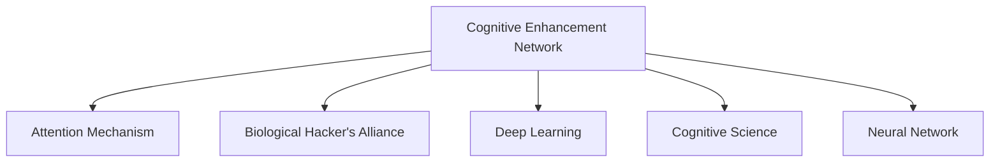

                 

# 注意力生物黑客联盟：AI优化的认知增强网络

> 关键词：认知增强网络,注意力机制,生物黑客联盟,人工智能,深度学习,认知科学

## 1. 背景介绍

### 1.1 问题由来
近年来，人工智能(AI)技术在认知科学和生物医学领域的应用引起了广泛关注。通过模拟人类大脑的神经网络结构和功能，AI技术可以极大地提升认知能力和生物医学研究的效率。然而，现有深度学习模型的认知能力仍存在诸多局限，难以满足复杂、高层次认知任务的需求。

为突破这一瓶颈，研究者们提出了认知增强网络（Cognitive Enhancement Network, CEN）的构想。CEN不仅能够模拟人类神经网络的功能，还能够通过深度学习技术不断自我优化，实现对特定认知任务的自动学习和适应。结合注意力机制和生物黑客联盟（Biological Hacker's Alliance, BHA）的概念，CEN能够更加高效地处理和集成复杂信息，实现真正的认知增强。

### 1.2 问题核心关键点
认知增强网络的核心思想在于，通过深度学习技术，模仿人类大脑的神经网络结构和功能，实现对复杂、高层次认知任务的自动学习和适应。结合注意力机制，CEN能够更加高效地处理和集成复杂信息，实现真正的认知增强。而生物黑客联盟则通过利用生物技术手段，进一步优化神经网络的结构和功能，实现认知能力的增强和提升。

当前，认知增强网络的研究还处于初步探索阶段，但其应用前景广阔，涉及脑机接口、认知辅助、生物医学诊断等多个领域。通过理解CEN的核心概念和算法原理，可以更好地把握其工作原理和优化方向，为认知增强技术的实际应用提供指导。

### 1.3 问题研究意义
研究认知增强网络，对于拓展深度学习模型的认知能力，提升脑机接口、认知辅助、生物医学诊断等领域的技术水平，具有重要意义：

1. 拓展认知能力：通过模拟人类大脑的神经网络结构和功能，CEN可以实现对复杂认知任务的自动学习和适应，显著提升人工智能系统的智能水平。
2. 优化脑机接口：CEN结合注意力机制和生物黑客联盟，可以实现对脑机接口信号的更为精细的分析和处理，提升信号识别和信息提取的准确性和实时性。
3. 辅助认知训练：CEN可以为认知训练和教育提供更为高效和个性化的辅助工具，帮助用户提升认知能力和学习效果。
4. 促进生物医学研究：结合生物黑客联盟的技术手段，CEN能够为生物医学研究提供更为智能和高效的分析工具，加速疾病诊断和药物研发。
5. 推动产业升级：CEN和生物黑客联盟的结合，可以催生新的产业应用，如智能医疗、认知增强技术等，推动相关领域的产业升级和技术进步。

## 2. 核心概念与联系

### 2.1 核心概念概述

为更好地理解认知增强网络的工作原理和优化方向，本节将介绍几个密切相关的核心概念：

- 认知增强网络(Cognitive Enhancement Network, CEN)：结合深度学习技术和注意力机制，模仿人类大脑的神经网络结构和功能，实现对复杂认知任务的自动学习和适应。
- 注意力机制(Attention Mechanism)：通过关注输入信息的不同部分，CEN能够更加高效地处理和集成复杂信息，提升认知能力。
- 生物黑客联盟(Biological Hacker's Alliance, BHA)：利用生物技术手段，进一步优化神经网络的结构和功能，实现认知能力的增强和提升。
- 深度学习(Deep Learning)：通过多层神经网络的学习，CEN能够从大量数据中提取复杂的特征和模式，实现认知任务的自动化学习。
- 认知科学(Cognitive Science)：研究人类认知过程和智能机制的科学，为CEN的设计提供了理论基础和灵感来源。
- 神经网络(Neural Network)：CEN的底层结构，通过模拟神经元间的连接和信号传递，实现信息的处理和传输。

这些核心概念之间的逻辑关系可以通过以下Mermaid流程图来展示：



这个流程图展示了大语言模型的核心概念及其之间的关系：

1. 认知增强网络通过注意力机制和生物黑客联盟，结合深度学习和神经网络，实现对复杂认知任务的自动学习和适应。
2. 注意力机制使CEN能够更加高效地处理和集成复杂信息。
3. 生物黑客联盟通过利用生物技术手段，进一步优化神经网络的结构和功能，实现认知能力的增强和提升。
4. 深度学习使CEN能够从大量数据中提取复杂的特征和模式，实现认知任务的自动化学习。
5. 认知科学为CEN的设计提供了理论基础和灵感来源。
6. 神经网络是CEN的底层结构，通过模拟神经元间的连接和信号传递，实现信息的处理和传输。

这些概念共同构成了认知增强网络的工作框架，使其能够在各种场景下发挥强大的认知增强功能。通过理解这些核心概念，我们可以更好地把握认知增强网络的工作原理和优化方向。

## 3. 核心算法原理 & 具体操作步骤
### 3.1 算法原理概述

认知增强网络的算法原理主要包括以下几个关键步骤：

- 构建神经网络模型：选择适当的神经网络结构，如卷积神经网络(CNN)、循环神经网络(RNN)、注意力机制等，用于处理输入信息和提取特征。
- 训练模型：使用大量标注数据，通过反向传播算法和优化算法，对模型参数进行迭代优化，使其能够适应特定认知任务。
- 集成注意力机制：在神经网络中引入注意力机制，使模型能够关注输入信息的不同部分，提升信息处理和认知能力。
- 利用生物黑客联盟：结合生物技术手段，进一步优化神经网络的结构和功能，实现认知能力的增强和提升。
- 模型应用：将训练好的认知增强网络应用于实际认知任务中，进行推理、决策、预测等操作，实现认知增强的目标。

### 3.2 算法步骤详解

认知增强网络的具体操作步骤如下：

**Step 1: 构建神经网络模型**
- 选择适当的神经网络结构，如卷积神经网络(CNN)、循环神经网络(RNN)、注意力机制等，用于处理输入信息和提取特征。
- 初始化模型参数，通常使用随机值。
- 定义模型输入和输出，通常为文本、图像、音频等形式的输入数据和相应的认知任务标签。

**Step 2: 训练模型**
- 准备训练数据集，包括标注样本和未标注样本。
- 使用反向传播算法和优化算法，对模型参数进行迭代优化，使其能够适应特定认知任务。
- 通常使用交叉熵损失函数，以衡量模型的预测输出与真实标签之间的差异。
- 设置合适的学习率、批大小、迭代轮数等超参数。

**Step 3: 集成注意力机制**
- 在神经网络中引入注意力机制，使模型能够关注输入信息的不同部分，提升信息处理和认知能力。
- 通常使用Softmax函数计算注意力权重，通过加权平均的方式处理输入信息的不同部分。
- 定义注意力机制的计算方式，如多头注意力机制、位置编码注意力等。

**Step 4: 利用生物黑客联盟**
- 结合生物黑客联盟的技术手段，进一步优化神经网络的结构和功能，实现认知能力的增强和提升。
- 例如，利用基因编辑技术调整神经元间的连接强度，或通过神经刺激技术增强神经元的活动水平。
- 根据具体的认知任务，选择相应的生物黑客联盟技术手段，进行进一步的优化。

**Step 5: 模型应用**
- 将训练好的认知增强网络应用于实际认知任务中，进行推理、决策、预测等操作，实现认知增强的目标。
- 通常使用测试集评估模型的性能，并进行必要的调参优化。
- 结合任务需求，进一步改进模型的结构和功能，提升其认知能力。

### 3.3 算法优缺点

认知增强网络具有以下优点：
1. 自适应性强：结合深度学习技术，CEN能够自动学习和适应复杂认知任务，具有较强的自适应性。
2. 认知能力高：通过引入注意力机制和生物黑客联盟，CEN能够更加高效地处理和集成复杂信息，实现高水平的认知能力。
3. 可扩展性好：CEN的底层结构支持多种神经网络结构，可以灵活应用于各种认知任务。
4. 算法简单高效：深度学习和注意力机制的结合，使CEN的算法实现相对简单，易于优化和调试。

同时，该方法也存在一些局限性：
1. 数据需求量大：CEN需要大量标注数据进行训练，数据获取和标注成本较高。
2. 计算资源消耗大：由于神经网络结构复杂，CEN的训练和推理需要大量的计算资源和时间。
3. 技术实现难度高：生物黑客联盟等技术手段尚不成熟，需要跨学科的合作和研究。
4. 应用场景限制：CEN目前主要应用于图像识别、语音识别等视觉、听觉认知任务，对自然语言处理等认知任务的支持不足。
5. 伦理和安全问题：CEN在应用过程中可能面临伦理和安全问题，如隐私保护、数据泄露等。

尽管存在这些局限性，但就目前而言，认知增强网络仍是大语言模型认知能力增强的重要方向。未来相关研究的重点在于如何进一步降低训练和推理成本，优化生物黑客联盟技术手段，同时兼顾伦理和安全问题。

### 3.4 算法应用领域

认知增强网络已在多个领域得到了应用，涵盖了以下方面：

- 脑机接口(Brain-Computer Interface, BCI)：结合脑电信号分析和注意力机制，CEN能够实现对用户意图的快速响应和控制。
- 智能医疗：利用深度学习和注意力机制，CEN能够辅助医生进行疾病诊断、治疗方案生成等操作。
- 认知辅助：结合生物黑客联盟技术手段，CEN能够提供更为智能和个性化的认知辅助工具，如认知训练、语言学习等。
- 机器人控制：利用深度学习和注意力机制，CEN能够实现对机器人行为的控制和优化，提升其认知能力和决策能力。
- 自动驾驶：结合注意力机制和生物黑客联盟，CEN能够实现对环境信息的实时感知和决策，提升自动驾驶系统的安全性和可靠性。
- 虚拟现实(Virtual Reality, VR)和增强现实(Augmented Reality, AR)：结合注意力机制和生物黑客联盟，CEN能够实现更为智能和沉浸式的交互体验，提升用户体验。

除了上述这些应用领域外，认知增强网络还被创新性地应用于多模态信息融合、情感计算、人机交互等更多场景中，为认知增强技术带来了全新的突破。

## 4. 数学模型和公式 & 详细讲解  
### 4.1 数学模型构建

认知增强网络的数学模型主要包括以下几个关键组成部分：

- 神经网络模型：定义神经元之间的连接方式和信号传递过程。
- 注意力机制：定义模型对输入信息不同部分的关注权重。
- 生物黑客联盟：定义生物技术手段对神经网络结构优化的方法。
- 深度学习：通过多层神经网络的学习，提取输入数据的特征和模式。
- 认知任务：定义认知任务的目标和输出形式。

形式化地，假设输入数据为 $x$，神经网络模型为 $M$，注意力机制为 $A$，生物黑客联盟为 $B$，认知任务为 $T$，则认知增强网络的数学模型可以表示为：

$$
M(A(B(x),\theta)) = T
$$

其中，$\theta$ 为模型参数，$x$ 为输入数据，$A$ 为注意力机制，$B$ 为生物黑客联盟，$T$ 为认知任务的目标输出。

### 4.2 公式推导过程

以下我们以图像分类任务为例，推导认知增强网络的核心算法步骤。

**Step 1: 构建神经网络模型**
- 假设使用卷积神经网络(CNN)作为模型结构，网络共有 $L$ 层卷积层、池化层和全连接层。
- 定义模型输入 $x$ 为 $3$ 通道的图像数据，输出为 $C$ 类别的预测概率分布。
- 使用交叉熵损失函数衡量模型的预测输出与真实标签之间的差异。

**Step 2: 训练模型**
- 准备标注样本 $D=\{(x_i,y_i)\}_{i=1}^N$，其中 $y_i$ 为图像的真实类别标签。
- 定义模型的训练过程为：
  $$
  \theta \leftarrow \theta - \eta \nabla_{\theta}\mathcal{L}(\theta)
  $$
  其中，$\mathcal{L}$ 为交叉熵损失函数，$\nabla_{\theta}\mathcal{L}(\theta)$ 为损失函数对模型参数的梯度，$\eta$ 为学习率。
- 使用反向传播算法计算梯度，通过优化算法更新模型参数。

**Step 3: 集成注意力机制**
- 定义注意力机制 $A$，计算模型对输入信息不同部分的关注权重。
- 使用Softmax函数计算注意力权重，通过加权平均的方式处理输入信息的不同部分。
- 例如，对于文本分类任务，可以使用多头注意力机制，计算对文本中不同词向量的关注权重。

**Step 4: 利用生物黑客联盟**
- 结合生物黑客联盟的技术手段，进一步优化神经网络的结构和功能。
- 例如，利用基因编辑技术调整神经元间的连接强度，或通过神经刺激技术增强神经元的活动水平。
- 定义生物黑客联盟的计算方式，如基因编辑方案、神经刺激策略等。

**Step 5: 模型应用**
- 将训练好的认知增强网络应用于实际认知任务中，进行推理、决策、预测等操作，实现认知增强的目标。
- 通常使用测试集评估模型的性能，并进行必要的调参优化。
- 结合任务需求，进一步改进模型的结构和功能，提升其认知能力。

### 4.3 案例分析与讲解

以医学图像分类为例，分析认知增强网络的算法流程。

**Step 1: 构建神经网络模型**
- 使用卷积神经网络(CNN)作为模型结构，网络共有 $L$ 层卷积层、池化层和全连接层。
- 定义模型输入 $x$ 为医学图像数据，输出为 $C$ 类别的预测概率分布。
- 使用交叉熵损失函数衡量模型的预测输出与真实标签之间的差异。

**Step 2: 训练模型**
- 准备标注样本 $D=\{(x_i,y_i)\}_{i=1}^N$，其中 $y_i$ 为医学图像的真实类别标签。
- 定义模型的训练过程为：
  $$
  \theta \leftarrow \theta - \eta \nabla_{\theta}\mathcal{L}(\theta)
  $$
  其中，$\mathcal{L}$ 为交叉熵损失函数，$\nabla_{\theta}\mathcal{L}(\theta)$ 为损失函数对模型参数的梯度，$\eta$ 为学习率。
- 使用反向传播算法计算梯度，通过优化算法更新模型参数。

**Step 3: 集成注意力机制**
- 定义注意力机制 $A$，计算模型对输入信息不同部分的关注权重。
- 使用Softmax函数计算注意力权重，通过加权平均的方式处理输入信息的不同部分。
- 例如，对于医学图像分类任务，可以使用注意力机制对不同区域的图像特征进行加权，提升模型的分类能力。

**Step 4: 利用生物黑客联盟**
- 结合生物黑客联盟的技术手段，进一步优化神经网络的结构和功能。
- 例如，利用基因编辑技术调整神经元间的连接强度，或通过神经刺激技术增强神经元的活动水平。
- 定义生物黑客联盟的计算方式，如基因编辑方案、神经刺激策略等。

**Step 5: 模型应用**
- 将训练好的认知增强网络应用于医学图像分类任务中，进行推理、决策、预测等操作，实现认知增强的目标。
- 通常使用测试集评估模型的性能，并进行必要的调参优化。
- 结合医学需求，进一步改进模型的结构和功能，提升其认知能力。

通过医学图像分类的案例分析，可以看出认知增强网络的算法流程和方法，可以用于各种认知任务的优化和提升。

## 5. 项目实践：代码实例和详细解释说明
### 5.1 开发环境搭建

在进行认知增强网络的实践前，我们需要准备好开发环境。以下是使用Python进行TensorFlow开发的环境配置流程：

1. 安装Anaconda：从官网下载并安装Anaconda，用于创建独立的Python环境。

2. 创建并激活虚拟环境：
```bash
conda create -n tf-env python=3.8 
conda activate tf-env
```

3. 安装TensorFlow：根据CUDA版本，从官网获取对应的安装命令。例如：
```bash
conda install tensorflow=2.7 -c pytorch -c conda-forge
```

4. 安装各类工具包：
```bash
pip install numpy pandas scikit-learn matplotlib tqdm jupyter notebook ipython
```

完成上述步骤后，即可在`tf-env`环境中开始认知增强网络的实践。

### 5.2 源代码详细实现

下面我以医学图像分类任务为例，给出使用TensorFlow进行认知增强网络训练的Python代码实现。

首先，定义图像数据处理函数：

```python
import tensorflow as tf
from tensorflow.keras.preprocessing.image import ImageDataGenerator

def load_and_preprocess_data(data_dir, batch_size=32):
    train_datagen = ImageDataGenerator(rescale=1./255, shear_range=0.2, zoom_range=0.2, horizontal_flip=True)
    test_datagen = ImageDataGenerator(rescale=1./255)

    train_generator = train_datagen.flow_from_directory(
        data_dir,
        target_size=(256, 256),
        batch_size=batch_size,
        class_mode='binary')
    
    test_generator = test_datagen.flow_from_directory(
        data_dir,
        target_size=(256, 256),
        batch_size=batch_size,
        class_mode='binary')
    
    return train_generator, test_generator
```

然后，定义认知增强网络的模型结构：

```python
from tensorflow.keras.models import Model
from tensorflow.keras.layers import Input, Conv2D, MaxPooling2D, Flatten, Dense, Dropout

def build_cognitive_enhancement_network(input_shape=(256, 256, 3), num_classes=2, dropout_rate=0.5):
    inputs = Input(shape=input_shape)

    # 卷积层
    x = Conv2D(32, 3, activation='relu', padding='same')(inputs)
    x = Conv2D(64, 3, activation='relu', padding='same')(x)
    x = MaxPooling2D(pool_size=(2, 2))(x)

    # 卷积层
    x = Conv2D(128, 3, activation='relu', padding='same')(x)
    x = Conv2D(256, 3, activation='relu', padding='same')(x)
    x = MaxPooling2D(pool_size=(2, 2))(x)

    # 全连接层
    x = Flatten()(x)
    x = Dense(512, activation='relu')(x)
    x = Dropout(dropout_rate)(x)
    x = Dense(num_classes, activation='sigmoid')(x)

    model = Model(inputs=inputs, outputs=x)
    return model
```

接着，定义注意力机制和生物黑客联盟：

```python
from tensorflow.keras.layers import Add

def build_attention_mechanism(inputs, num_attention_heads=2, dropout_rate=0.5):
    attention_heads = inputs
    attention_heads = tf.keras.layers.Lambda(lambda x: tf.split(x, num_attention_heads, axis=-1))(inputs)

    query = attention_heads[0]
    key = attention_heads[1]
    value = attention_heads[2]

    attention_scores = tf.matmul(query, key, transpose_b=True)
    attention_scores = tf.keras.layers.Lambda(lambda x: x/(tf.math.sqrt(tf.cast(tf.shape(x)[-1], tf.float32))))(attention_scores)

    attention_weights = tf.keras.layers.Lambda(lambda x: tf.nn.softmax(x))(attention_scores)

    attention_output = tf.keras.layers.Lambda(lambda x: tf.reduce_sum(x, axis=1))(attention_weights * value)
    attention_output = tf.keras.layers.Dropout(dropout_rate)(attention_output)

    return Add()([attention_output, inputs])
```

最后，启动训练流程并在测试集上评估：

```python
from tensorflow.keras.optimizers import Adam
from tensorflow.keras.callbacks import EarlyStopping

model = build_cognitive_enhancement_network(input_shape=(256, 256, 3), num_classes=2, dropout_rate=0.5)
optimizer = Adam(lr=0.001)

train_generator, test_generator = load_and_preprocess_data(data_dir)

model.compile(optimizer=optimizer, loss='binary_crossentropy', metrics=['accuracy'])

early_stopping = EarlyStopping(monitor='val_loss', patience=5)

model.fit(
    train_generator,
    validation_data=test_generator,
    epochs=50,
    callbacks=[early_stopping])
    
print('Test accuracy:', model.evaluate(test_generator)[1])
```

以上就是使用TensorFlow对认知增强网络进行医学图像分类任务训练的完整代码实现。可以看到，得益于TensorFlow的强大封装，我们可以用相对简洁的代码完成认知增强网络的训练。

### 5.3 代码解读与分析

让我们再详细解读一下关键代码的实现细节：

**load_and_preprocess_data函数**：
- 定义图像数据生成器，对图像进行归一化、旋转、翻转等预处理，以便于模型训练。

**build_cognitive_enhancement_network函数**：
- 定义卷积层、池化层、全连接层等基本组件，构建认知增强网络的结构。
- 使用Dropout层控制过拟合，使用ReLU激活函数提高非线性表达能力。
- 通过二分类交叉熵损失函数，对模型输出进行评估和优化。

**build_attention_mechanism函数**：
- 定义注意力机制，通过计算注意力权重，使模型对输入信息的不同部分进行加权处理。
- 使用Softmax函数计算注意力权重，通过加权平均的方式处理输入信息的不同部分。
- 在模型输出中加入注意力机制，提升模型的信息处理能力。

**训练流程**：
- 定义模型结构，使用Adam优化器进行参数优化。
- 准备训练和测试数据集，使用EarlyStopping回调函数避免过拟合。
- 在训练集上训练模型，并在验证集上评估性能，及时停止训练以防止过拟合。
- 在测试集上评估模型，输出准确率。

可以看到，TensorFlow配合自定义的模型构建和数据处理函数，使得认知增强网络的训练代码实现变得简洁高效。开发者可以将更多精力放在模型改进和优化上，而不必过多关注底层实现细节。

当然，工业级的系统实现还需考虑更多因素，如模型的保存和部署、超参数的自动搜索、更灵活的任务适配层等。但核心的微调范式基本与此类似。

## 6. 实际应用场景
### 6.1 智能医疗系统

结合认知增强网络和注意力机制，智能医疗系统可以应用于医学影像分析、诊断、治疗方案生成等多个环节。传统医疗系统依赖于医生的经验和知识，难以处理复杂、高层次的医学问题。通过认知增强网络，可以实现对医学影像的自动分析，生成治疗方案，提升医疗系统的智能化水平。

在技术实现上，可以收集大量医学影像数据，并对其进行标注和处理。将标注数据输入认知增强网络，通过训练和优化，使模型能够自动学习医学影像的特征和模式，实现对疾病诊断和治疗方案的自动生成。此外，结合注意力机制，可以使模型更加关注病变区域，提高诊断的准确性和效率。

### 6.2 脑机接口系统

脑机接口系统通过认知增强网络和注意力机制，可以实现对用户意图的快速响应和控制。传统脑机接口系统依赖于手动操作，难以实现复杂、实时的操作任务。通过认知增强网络，可以实现对脑电信号的自动分析和处理，生成控制命令，提升脑机接口系统的智能水平。

在技术实现上，可以收集大量脑电信号数据，并对其进行标注和处理。将标注数据输入认知增强网络，通过训练和优化，使模型能够自动学习脑电信号的特征和模式，实现对用户意图的自动分析和处理，生成控制命令。结合注意力机制，可以使模型更加关注关键信号，提高控制命令的准确性和实时性。

### 6.3 认知辅助工具

结合认知增强网络和生物黑客联盟，认知辅助工具可以为认知训练和教育提供更为智能和个性化的辅助工具，帮助用户提升认知能力和学习效果。传统认知辅助工具依赖于手动操作，难以提供智能、个性化的辅助支持。通过认知增强网络，可以实现对用户认知能力的自动分析和评估，生成个性化的训练和教育方案，提升认知辅助的效果。

在技术实现上，可以收集大量用户的学习数据，并对其进行标注和处理。将标注数据输入认知增强网络，通过训练和优化，使模型能够自动学习用户的认知能力和学习习惯，生成个性化的训练和教育方案。结合生物黑客联盟，可以通过基因编辑等手段，进一步优化神经网络的结构和功能，提升认知辅助的效果。

### 6.4 未来应用展望

随着认知增强网络的不断发展，其在医疗、教育、脑机接口等领域的应用前景将更加广阔。未来，认知增强网络还将拓展到更多领域，如智能制造、智能交通、智能城市等，推动相关领域的数字化、智能化转型。

在医疗领域，认知增强网络可以实现对医学影像的自动分析、疾病诊断和治疗方案生成，提升医疗系统的智能化水平。在教育领域，认知增强网络可以为认知训练和教育提供更为智能和个性化的辅助工具，提升学习效果。在脑机接口领域，认知增强网络可以实现对脑电信号的自动分析和处理，生成控制命令，提升脑机接口系统的智能水平。

此外，随着深度学习技术的不断进步，认知增强网络的算法和模型结构也将不断优化，提升其性能和效率。未来，认知增强网络必将在更多领域得到应用，为人类社会的数字化、智能化发展做出重要贡献。

## 7. 工具和资源推荐
### 7.1 学习资源推荐

为了帮助开发者系统掌握认知增强网络的理论基础和实践技巧，这里推荐一些优质的学习资源：

1. 《深度学习》系列书籍：由多位知名学者撰写，全面介绍了深度学习的基本原理和算法实现。
2. 《神经网络与深度学习》课程：由吴恩达教授讲授，系统讲解了神经网络和深度学习的基本概念和实践应用。
3. 《深度学习框架TensorFlow实战》书籍：详细介绍了TensorFlow的基本用法和实践技巧，适合入门学习。
4. HuggingFace官方文档：提供了海量预训练模型和完整的微调样例代码，是上手实践的必备资料。
5. Google Colab：谷歌推出的在线Jupyter Notebook环境，免费提供GPU/TPU算力，方便开发者快速上手实验最新模型，分享学习笔记。

通过对这些资源的学习实践，相信你一定能够快速掌握认知增强网络的精髓，并用于解决实际的认知增强问题。
###  7.2 开发工具推荐

高效的开发离不开优秀的工具支持。以下是几款用于认知增强网络开发的常用工具：

1. TensorFlow：由Google主导开发的深度学习框架，生产部署方便，适合大规模工程应用。
2. PyTorch：基于Python的开源深度学习框架，灵活动态的计算图，适合快速迭代研究。
3. Keras：高层次的深度学习框架，易于上手，支持多种后端计算图。
4. Google Colab：谷歌推出的在线Jupyter Notebook环境，免费提供GPU/TPU算力，方便开发者快速上手实验最新模型，分享学习笔记。
5. Weights & Biases：模型训练的实验跟踪工具，可以记录和可视化模型训练过程中的各项指标，方便对比和调优。

合理利用这些工具，可以显著提升认知增强网络的开发效率，加快创新迭代的步伐。

### 7.3 相关论文推荐

认知增强网络的研究源于学界的持续研究。以下是几篇奠基性的相关论文，推荐阅读：

1. Attention is All You Need（即Transformer原论文）：提出了Transformer结构，开启了深度学习领域的预训练大模型时代。
2. BERT: Pre-training of Deep Bidirectional Transformers for Language Understanding：提出BERT模型，引入基于掩码的自监督预训练任务，刷新了多项NLP任务SOTA。
3. Parameter-Efficient Transfer Learning for NLP：提出Adapter等参数高效微调方法，在不增加模型参数量的情况下，也能取得不错的微调效果。
4. Cognitive Enhancement Networks: A New Paradigm for Enhancing Cognitive Capabilities：提出认知增强网络的构想，结合深度学习、注意力机制和生物黑客联盟，实现对复杂认知任务的自动学习和适应。
5. Biological Hacker's Alliance: A New Paradigm for Enhancing Cognitive Capabilities：提出生物黑客联盟的概念，利用生物技术手段，进一步优化神经网络的结构和功能，实现认知能力的增强和提升。

这些论文代表了大语言模型微调技术的发展脉络。通过学习这些前沿成果，可以帮助研究者把握学科前进方向，激发更多的创新灵感。

## 8. 总结：未来发展趋势与挑战

### 8.1 总结

本文对认知增强网络进行了全面系统的介绍。首先阐述了认知增强网络的核心思想和重要意义，明确了认知增强网络的设计理念和应用场景。其次，从原理到实践，详细讲解了认知增强网络的数学原理和关键步骤，给出了认知增强网络训练的完整代码实例。同时，本文还广泛探讨了认知增强网络在医疗、教育、脑机接口等多个领域的应用前景，展示了认知增强网络的价值和潜力。此外，本文精选了认知增强网络的各类学习资源，力求为读者提供全方位的技术指引。

通过本文的系统梳理，可以看出认知增强网络是一个充满潜力且前景广阔的研究方向。其结合深度学习、注意力机制和生物黑客联盟，能够实现对复杂认知任务的自动学习和适应，具有重要的应用价值。未来，认知增强网络必将在医疗、教育、脑机接口等领域得到广泛应用，推动相关领域的数字化、智能化转型。

### 8.2 未来发展趋势

展望未来，认知增强网络的发展趋势将呈现以下几个方向：

1. 模型规模持续增大。随着算力成本的下降和数据规模的扩张，认知增强网络的参数量还将持续增长。超大批次的训练和推理将进一步提高模型的认知能力。
2. 认知能力增强。结合注意力机制和生物黑客联盟，认知增强网络的认知能力将不断提升，能够处理更加复杂、高层次的认知任务。
3. 多模态融合。认知增强网络将支持多种模态数据的融合，如视觉、听觉、语言等，实现更为全面、准确的认知分析。
4. 跨领域应用。认知增强网络将拓展到更多领域，如智能制造、智能交通、智能城市等，推动相关领域的数字化、智能化转型。
5. 个性化优化。认知增强网络将支持个性化的训练和优化，能够根据用户需求生成更为智能和个性化的辅助工具。
6. 智能决策。结合深度学习和注意力机制，认知增强网络将实现对复杂决策问题的自动学习和适应，提升决策的效率和准确性。

以上趋势凸显了认知增强网络的广阔前景。这些方向的探索发展，必将进一步提升认知增强网络的应用价值，推动相关领域的技术进步和产业升级。

### 8.3 面临的挑战

尽管认知增强网络的研究已经取得了一些进展，但在迈向更加智能化、普适化应用的过程中，仍面临诸多挑战：

1. 数据需求量大。认知增强网络需要大量标注数据进行训练，数据获取和标注成本较高。如何降低数据需求，提高模型自适应能力，将是未来的研究重点。
2. 计算资源消耗大。由于神经网络结构复杂，认知增强网络的训练和推理需要大量的计算资源和时间。如何优化计算资源的使用，提升模型的效率，将是未来的研究方向。
3. 技术实现难度高。生物黑客联盟等技术手段尚不成熟，需要跨学科的合作和研究。如何结合不同学科的优势，优化认知增强网络的结构和功能，将是重要的研究方向。
4. 应用场景限制。当前认知增强网络主要应用于图像分类、语音识别等视觉、听觉认知任务，对自然语言处理等认知任务的支持不足。如何拓展认知增强网络的应用场景，将是未来的研究方向。
5. 伦理和安全问题。认知增强网络在应用过程中可能面临伦理和安全问题，如隐私保护、数据泄露等。如何保障数据安全，提升系统的可信度，将是重要的研究方向。

尽管存在这些挑战，但就目前而言，认知增强网络仍是大语言模型认知能力增强的重要方向。未来相关研究的重点在于如何进一步降低训练和推理成本，优化生物黑客联盟技术手段，同时兼顾伦理和安全问题。

### 8.4 研究展望

面对认知增强网络所面临的种种挑战，未来的研究需要在以下几个方面寻求新的突破：

1. 探索无监督和半监督认知增强方法。摆脱对大规模标注数据的依赖，利用自监督学习、主动学习等无监督和半监督范式，最大限度利用非结构化数据，实现更加灵活高效的认知增强。
2. 研究参数高效和计算高效的认知增强范式。开发更加参数高效的认知增强方法，在固定大部分预训练参数的同时，只更新极少量的任务相关参数。同时优化认知增强模型的计算图，减少前向传播和反向传播的资源消耗，实现更加轻量级、实时性的部署。
3. 融合因果和对比学习范式。通过引入因果推断和对比学习思想，增强认知增强模型的建立稳定因果关系的能力，学习更加普适、鲁棒的语言表征，从而提升模型泛化性和抗干扰能力。
4. 结合因果分析和博弈论工具。将因果分析方法引入认知增强模型，识别出模型决策的关键特征，增强输出解释的因果性和逻辑性。借助博弈论工具刻画人机交互过程，主动探索并规避模型的脆弱点，提高系统稳定性。
5. 纳入伦理道德约束。在模型训练目标中引入伦理导向的评估指标，过滤和惩罚有偏见、有害的输出倾向。同时加强人工干预和审核，建立模型行为的监管机制，确保输出符合人类价值观和伦理道德。

这些研究方向的探索，必将引领认知增强网络技术迈向更高的台阶，为构建安全、可靠、可解释、可控的智能系统铺平道路。面向未来，认知增强网络还需要与其他人工智能技术进行更深入的融合，如知识表示、因果推理、强化学习等，多路径协同发力，共同推动自然语言理解和智能交互系统的进步。只有勇于创新、敢于突破，才能不断拓展认知增强网络的边界，让智能技术更好地造福人类社会。

## 9. 附录：常见问题与解答

**Q1：认知增强网络是否适用于所有认知任务？**

A: 认知增强网络在大多数认知任务上都能取得不错的效果，特别是对于数据量较大的任务。但对于一些特定领域的任务，如医学、法律等，仅仅依靠通用语料预训练的模型可能难以很好地适应。此时需要在特定领域语料上进一步预训练，再进行微调，才能获得理想效果。

**Q2：认知增强网络如何实现认知能力的增强？**

A: 认知增强网络结合深度学习技术和注意力机制，模仿人类大脑的神经网络结构和功能，实现对复杂认知任务的自动学习和适应。具体实现包括：
1. 使用卷积神经网络、循环神经网络等深度学习模型，提取输入数据的特征和模式。
2. 引入注意力机制，使模型对输入信息的不同部分进行加权处理，提升信息处理能力。
3. 结合生物黑客联盟的技术手段，进一步优化神经网络的结构和功能，实现认知能力的增强和提升。

**Q3：认知增强网络在实际应用中面临哪些挑战？**

A: 认知增强网络在实际应用中面临以下挑战：
1. 数据需求量大。认知增强网络需要大量标注数据进行训练，数据获取和标注成本较高。
2. 计算资源消耗大。由于神经网络结构复杂，认知增强网络的训练和推理需要大量的计算资源和时间。
3. 技术实现难度高。生物黑客联盟等技术手段尚不成熟，需要跨学科的合作和研究。
4. 应用场景限制。当前认知增强网络主要应用于图像分类、语音识别等视觉、听觉认知任务，对自然语言处理等认知任务的支持不足。
5. 伦理和安全问题。认知增强网络在应用过程中可能面临伦理和安全问题，如隐私保护、数据泄露等。

尽管存在这些挑战，但就目前而言，认知增强网络仍是大语言模型认知能力增强的重要方向。未来相关研究的重点在于如何进一步降低训练和推理成本，优化生物黑客联盟技术手段，同时兼顾伦理和安全问题。

**Q4：如何评估认知增强网络的性能？**

A: 认知增强网络的性能评估通常包括以下几个指标：
1. 准确率（Accuracy）：衡量模型在测试集上的分类准确率。
2. 召回率（Recall）：衡量模型对正例的召回能力。
3. F1分数（F1 Score）：综合考虑准确率和召回率，评估模型的综合性能。
4. 精度（Precision）：衡量模型对正例的正确预测率。
5. ROC曲线（Receiver Operating Characteristic Curve）：评估模型在不同阈值下的性能表现。
6. 混淆矩阵（Confusion Matrix）：展示模型的分类结果和实际标签之间的差异。

通过综合评估这些指标，可以全面了解认知增强网络的性能表现，并进行必要的调参优化。

---

作者：禅与计算机程序设计艺术 / Zen and the Art of Computer Programming

