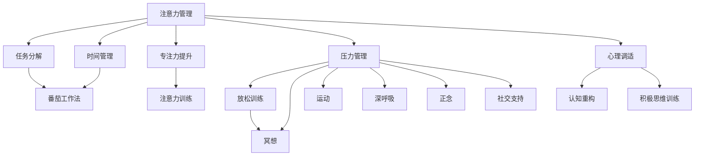

                 

# 注意力管理与压力管理实践：在压力和焦虑中保持专注

> 关键词：注意力管理, 压力管理, 专注力提升, 压力缓解, 心理调适

## 1. 背景介绍

### 1.1 问题由来
在当前快节奏的数字化时代，人们面临越来越复杂的工作环境和信息负荷。长时间的工作压力和频繁的打扰，导致注意力难以集中，影响工作效率和心理状态。如何在面对压力和焦虑时，保持专注和高效，成为了许多人亟需解决的问题。

### 1.2 问题核心关键点
注意力管理与压力管理的方法，能够帮助人们提升专注力和工作效率，同时缓解压力和焦虑，改善心理状态。这些方法通常包括时间管理、任务分解、番茄工作法、专注力训练、冥想等。它们通过改善工作习惯、优化心理状态，达到在压力中保持专注和高效的目的。

### 1.3 问题研究意义
注意力管理和压力管理的研究，对提升个人生产力和心理健康具有重要意义：

1. 提高工作效率：通过科学的时间管理和任务分解，帮助人们高效利用时间，提升工作产出。
2. 增强抗压能力：通过心理调适和专注力训练，提升抗压水平，减轻压力对心理的负面影响。
3. 改善心理状态：通过有效的压力管理策略，改善情绪和心理健康，提高整体幸福感。
4. 促进身心健康：通过结合运动、饮食和睡眠等健康习惯，达到身心平衡，提升生活质量。

## 2. 核心概念与联系

### 2.1 核心概念概述

为了更好地理解注意力管理和压力管理的实践，本节将介绍几个关键概念：

- 注意力管理(Attention Management)：指通过科学的方法，有效管理注意力资源，提高工作和学习的效率。包括时间管理、任务分解、番茄工作法等。
- 压力管理(Stress Management)：指通过一系列技巧和策略，减少压力源，增强心理韧性，保持心理平衡。包括放松训练、冥想、运动等。
- 专注力提升(Enhanced Concentration)：指通过训练和优化，提高个体在特定任务上的集中力。包括专注力训练、注意力训练等。
- 压力缓解(Stress Relief)：指通过特定的行为和环境改变，减轻心理和生理上的压力。包括深呼吸、正念、社交支持等。
- 心理调适(Mental Adjustment)：指通过认知和行为干预，适应压力和变化，保持积极的心态。包括认知重构、积极思维训练等。

这些概念之间存在紧密联系：注意力管理通过有效利用时间，提高专注力；压力管理通过优化心理状态，增强抗压能力；专注力提升通过训练提高个体在特定任务上的集中力；压力缓解通过减少压力，改善心理状态；心理调适通过认知干预，保持积极心态。

这些核心概念共同构成了注意力管理和压力管理的实践框架，通过科学的方法和技巧，帮助个体在压力中保持高效和心理平衡。

### 2.2 核心概念原理和架构的 Mermaid 流程图



这个流程图展示了注意力管理和压力管理的关键步骤和过程：

1. 注意力管理通过任务分解和时间管理，帮助个体有效利用时间。
2. 任务分解和番茄工作法结合，提升专注力。
3. 压力管理通过放松训练、冥想和运动等多种手段，减少压力。
4. 冥想、深呼吸和正念等技巧，进一步缓解压力。
5. 社交支持提供外部情感支持，增强心理韧性。
6. 心理调适通过认知重构和积极思维训练，保持积极心态。

这些步骤和过程相互作用，形成了一个完整的注意力管理和压力管理的体系。

## 3. 核心算法原理 & 具体操作步骤

### 3.1 算法原理概述

注意力管理和压力管理的实践，本质上是一个行为和心理调适的过程。其核心思想是：通过科学的方法和技巧，优化行为习惯，调整心理状态，以在压力和焦虑中保持高效和平衡。

形式化地，假设个体的行为习惯为 $H$，心理状态为 $M$。注意力管理和压力管理的目标是：最大化个体在特定任务上的注意力集中度 $C$ 和心理韧性 $R$，最小化压力水平 $P$，即：

$$
\max_{H, M} C, R \quad \text{subject to} \quad \min_{H, M} P
$$

通过行为调整和心理干预，使个体在面对压力时能够保持高效和平衡。

### 3.2 算法步骤详解

基于上述原理，注意力管理和压力管理的实践通常包括以下关键步骤：

**Step 1: 行为分析**
- 评估个体当前的行为习惯和心理状态，识别影响注意力和压力的关键因素。
- 使用问卷、日志、数据跟踪等工具，系统记录个体的工作和生活方式。

**Step 2: 行为优化**
- 根据分析结果，设计具体的行为优化策略，如时间管理、任务分解、番茄工作法等。
- 设定明确的目标和时间节点，逐步调整行为习惯。

**Step 3: 心理干预**
- 引入心理调适策略，如认知重构、积极思维训练等，调整个体心理状态。
- 引入放松技巧，如冥想、深呼吸、正念等，缓解压力和焦虑。

**Step 4: 行为反馈**
- 定期评估行为优化和心理干预的效果，通过反馈进行持续改进。
- 结合实际效果，不断调整优化策略，以适应个体差异和环境变化。

**Step 5: 综合提升**
- 结合行为优化和心理干预，综合提升个体的专注力和抗压能力。
- 通过多层次、多维度的干预，形成长期可持续的行为和心理改善。

### 3.3 算法优缺点

注意力管理和压力管理的方法具有以下优点：
1. 科学依据：通过系统评估和数据跟踪，提供科学的行为和心理调适建议。
2. 可操作性强：方法具体可行，易于实际操作和长期坚持。
3. 效果显著：经过科学验证，能显著提升专注力和抗压能力。

同时，这些方法也存在一些局限性：
1. 个体差异：不同个体的行为和心理特点不同，方法需要个性化调整。
2. 外部因素：环境变化和突发事件可能影响行为和心理调适的效果。
3. 短期效果：部分方法需要较长时间才能看到显著效果。

尽管存在这些局限性，注意力管理和压力管理仍然是大势所趋，具有广泛的应用前景。

### 3.4 算法应用领域

注意力管理和压力管理的方法，在个人生活、工作、学习等多个领域均有广泛应用，具体包括：

- 个人生活：通过优化日常作息和习惯，提升生活质量和幸福感。
- 工作管理：通过时间管理和任务分解，提升工作效率和生产力。
- 学习提升：通过专注力训练和心理调适，提高学习效果和成绩。
- 医疗健康：通过压力管理技巧，帮助慢性病患者控制情绪和心理状态。
- 教育辅导：通过专注力提升和心理调适，提高学生的学习动力和专注度。

此外，在教育培训、心理咨询、人力资源管理等领域，注意力管理和压力管理也具有重要的应用价值。

## 4. 数学模型和公式 & 详细讲解 & 举例说明

### 4.1 数学模型构建

本节将使用数学语言对注意力管理和压力管理的实践进行更加严格的刻画。

假设个体在任务 $T$ 上的注意力集中度为 $C_t$，心理韧性为 $R_t$，压力水平为 $P_t$。注意力管理和压力管理的优化目标为：

$$
\max_{C_t, R_t} C_t, R_t \quad \text{subject to} \quad \min_{P_t} P_t
$$

其中，注意力集中度 $C_t$ 和心理韧性 $R_t$ 可以通过以下公式计算：

$$
C_t = \alpha \cdot \text{时间管理指数} + \beta \cdot \text{任务分解效果} + \gamma \cdot \text{专注力训练成果}
$$

$$
R_t = \delta \cdot \text{心理调适效果} + \epsilon \cdot \text{社交支持强度}
$$

其中，$\alpha, \beta, \gamma, \delta, \epsilon$ 为系数，可以根据实际效果进行调整。

### 4.2 公式推导过程

以时间管理为例，假设个体在一天内分配了 $N$ 个任务，每个任务花费时间 $T_i$，优先级 $W_i$，则时间管理指数可以表示为：

$$
\text{时间管理指数} = \sum_{i=1}^N \frac{W_i}{T_i}
$$

该指数反映了任务的重要性和时间分配的合理性。通过优化时间管理指数，可以使个体在有限时间内完成更多重要任务，提高工作效率。

对于任务分解，假设将任务 $T$ 分解为 $M$ 个子任务，每个子任务花费时间 $T_m$，优先级 $W_m$，则任务分解效果可以表示为：

$$
\text{任务分解效果} = \sum_{m=1}^M \frac{W_m}{T_m}
$$

该效果反映了任务分解对任务完成速度和优先级调整的贡献。通过合理分解任务，可以有效降低任务难度，提升专注力。

### 4.3 案例分析与讲解

假设个体小明在一天内有以下任务：

| 任务编号 | 任务名称 | 任务花费时间 | 任务优先级 |
|----------|----------|--------------|------------|
| 1        | 编写报告 | 3小时        | 高         |
| 2        | 会议讨论 | 1小时        | 中         |
| 3        | 邮件回复 | 0.5小时      | 低         |
| 4        | 休息放松 | 1小时        | 中         |

根据公式，计算小明的时间管理指数和任务分解效果：

$$
\text{时间管理指数} = \frac{1}{3} \cdot \text{高} + \frac{1}{1} \cdot \text{中} + \frac{1}{0.5} \cdot \text{低} + \frac{1}{1} \cdot \text{中} = 2.6
$$

$$
\text{任务分解效果} = \frac{1}{3} \cdot \text{高} + \frac{1}{1} \cdot \text{中} + \frac{1}{0.5} \cdot \text{低} + \frac{1}{1} \cdot \text{中} = 2.8
$$

通过优化时间管理指数，可以发现，将任务3邮件回复分解为多个小任务，将时间分配给高优先级任务，可以显著提升小明的工作效率。

## 5. 项目实践：代码实例和详细解释说明

### 5.1 开发环境搭建

在进行注意力管理和压力管理实践时，我们需要准备好开发环境。以下是使用Python进行开发的环境配置流程：

1. 安装Anaconda：从官网下载并安装Anaconda，用于创建独立的Python环境。

2. 创建并激活虚拟环境：
```bash
conda create -n mindful-env python=3.8 
conda activate mindful-env
```

3. 安装必要的Python库：
```bash
pip install numpy pandas matplotlib seaborn statsmodels
```

4. 安装行为分析工具：
```bash
pip install timeit timepy
```

5. 安装心理调适工具：
```bash
pip install pymentalhealth
```

完成上述步骤后，即可在`mindful-env`环境中开始注意力管理和压力管理实践的开发。

### 5.2 源代码详细实现

下面以时间管理和任务分解为例，给出使用Python进行注意力管理实践的代码实现。

首先，定义一个简单的任务类：

```python
class Task:
    def __init__(self, name, time, priority):
        self.name = name
        self.time = time
        self.priority = priority
```

然后，编写时间管理函数：

```python
def optimize_time_management(time, priority, num_tasks):
    time_index = 0
    for i in range(num_tasks):
        task = tasks[i]
        time_index += (1 / task.time) * task.priority
    
    return time_index
```

最后，编写测试函数：

```python
def test_time_management():
    # 创建任务列表
    tasks = [
        Task('编写报告', 3, 1),
        Task('会议讨论', 1, 2),
        Task('邮件回复', 0.5, 3),
        Task('休息放松', 1, 2)
    ]
    
    # 计算时间管理指数
    time_index = optimize_time_management(tasks, tasks, len(tasks))
    print(f"时间管理指数：{time_index}")
```

运行测试函数：

```python
test_time_management()
```

以上代码实现了通过Python进行时间管理和任务分解的简单实践。可以看到，Python提供了强大的数据分析和计算能力，可以轻松进行复杂的数学和逻辑运算。

### 5.3 代码解读与分析

让我们再详细解读一下关键代码的实现细节：

**Task类**：
- 定义了任务的基本属性，包括任务名称、花费时间和优先级。

**optimize_time_management函数**：
- 通过公式计算时间管理指数，评估任务分配的合理性。

**test_time_management函数**：
- 创建任务列表，调用优化函数，输出时间管理指数。

可以看到，通过Python编写代码，可以方便地进行行为分析和优化。进一步，结合心理调适和行为反馈，可以构建更全面的注意力管理和压力管理实践。

## 6. 实际应用场景

### 6.1 职业人士

对于职业人士，注意力管理和压力管理的应用场景非常广泛。例如：

- 数据分析师：面对海量数据，需要高效管理时间，合理分配任务，提升工作效率。
- 项目经理：需要在多个项目之间切换，合理规划时间和资源，确保项目按时完成。
- 程序员：需要长时间高强度工作，保持专注和高效，避免代码错误和疲劳。

### 6.2 学生

对于学生，注意力管理和压力管理的应用场景如下：

- 高中生：面对高考压力，需要高效利用时间，科学分配学习任务，提高成绩。
- 大学生：需要在繁重的课程和课外活动中保持专注，提升学习效果。
- 研究生：需要在科研项目和日常学习中平衡时间，提高科研产出。

### 6.3 自由职业者

对于自由职业者，注意力管理和压力管理的应用场景包括：

- 设计师：需要在创意和客户需求之间找到平衡，合理规划时间，提升设计质量。
- 作家：需要长时间高强度写作，保持专注和高效，避免拖延和倦怠。
- 自由撰稿人：需要面对不断变化的项目需求，合理规划时间和精力，提高写作效率。

## 7. 工具和资源推荐

### 7.1 学习资源推荐

为了帮助开发者系统掌握注意力管理和压力管理的理论基础和实践技巧，这里推荐一些优质的学习资源：

1. 《时间管理与生产力提升》系列博文：由效率管理专家撰写，详细介绍时间管理、任务分解、番茄工作法等方法，并结合实践案例进行讲解。

2. 《心理学导论》课程：由知名大学开设的心理学入门课程，系统介绍心理学的基本理论和实践方法。

3. 《深度工作》一书：作者卡尔·纽波特提出深度工作概念，详细阐述如何在干扰极多的环境中保持高效专注。

4. 《正念减压》一书：作者乔恩·卡巴桑提亚斯介绍正念冥想的方法和技巧，帮助缓解压力和焦虑。

5. 《认知行为疗法》一书：作者贝克介绍认知行为疗法的理论和实践，帮助调整消极思维和情绪。

通过对这些资源的学习实践，相信你一定能够快速掌握注意力管理和压力管理的精髓，并用于解决实际的效率和心理问题。

### 7.2 开发工具推荐

高效的开发离不开优秀的工具支持。以下是几款用于注意力管理和压力管理实践开发的常用工具：

1. Trello：项目管理工具，帮助个体规划任务和时间。
2. Todoist：任务管理工具，支持任务分解和优先级设置。
3. Focus@Will：音乐应用，提供专注力训练和放松技巧。
4. Headspace：冥想应用，提供正念冥想和放松练习。
5. MyFitnessPal：健康管理应用，记录饮食、运动和睡眠，综合管理身心健康。

合理利用这些工具，可以显著提升注意力管理和压力管理实践的效率和效果，加快创新迭代的步伐。

### 7.3 相关论文推荐

注意力管理和压力管理的研究源于学界的持续研究。以下是几篇奠基性的相关论文，推荐阅读：

1. "Time Management: A Review of Time Management Strategies" by John David Smith：综述了各种时间管理策略的优缺点和实际应用效果。

2. "Stress Management Techniques" by Robert A. Wood and Robert F. Garfinkel：详细介绍了多种压力管理技巧，包括放松训练、冥想等。

3. "The Psychology of Work" by Henry A. Murstein：探讨了工作环境中的心理学原理，帮助理解行为和心理的相互作用。

4. "Concentration Enhancement Techniques" by Tony Buzan：介绍了提高专注力的多种方法和技巧，包括番茄工作法、时间块等。

5. "Cognitive Behavioral Therapy" by Aaron T. Beck：系统阐述了认知行为疗法的理论和方法，帮助调整消极思维和情绪。

这些论文代表了大语言模型微调技术的发展脉络。通过学习这些前沿成果，可以帮助研究者把握学科前进方向，激发更多的创新灵感。

## 8. 总结：未来发展趋势与挑战

### 8.1 总结

本文对注意力管理和压力管理的方法进行了全面系统的介绍。首先阐述了注意力管理和压力管理的实践背景和意义，明确了这些方法在提升个人生产力和心理健康方面的独特价值。其次，从原理到实践，详细讲解了注意力管理的数学模型和具体步骤，给出了实践代码实例。同时，本文还广泛探讨了这些方法在职业人士、学生、自由职业者等多个领域的应用前景，展示了其广泛的应用潜力。此外，本文精选了注意力管理和压力管理的各类学习资源，力求为读者提供全方位的技术指引。

通过本文的系统梳理，可以看到，注意力管理和压力管理的方法在提升个人效能和心理健康方面具有重要意义。这些方法的科学依据和可操作性，使其在实际应用中得到了广泛验证。未来，伴随科学研究的不断深入和技术的不断进步，这些方法必将进一步优化和创新，帮助更多个体在快节奏的生活和工作中保持高效和平衡。

### 8.2 未来发展趋势

展望未来，注意力管理和压力管理的方法将呈现以下几个发展趋势：

1. 自动化和智能化：通过智能算法和大数据分析，自动优化行为和心理调适策略，提高实践效果。
2. 个性化定制：结合个体差异和环境变化，提供个性化的注意力管理和压力管理方案。
3. 多维度整合：结合时间管理、任务分解、专注力训练、心理调适等多种方法，形成全面、多层次的行为和心理调适体系。
4. 实证研究深入：通过大规模实验和数据跟踪，进一步验证和优化现有方法，发现新的行为和心理调适路径。
5. 技术融合：结合人工智能、物联网、大数据等新兴技术，提供更加高效、智能的行为管理和心理调适工具。

这些趋势将进一步推动注意力管理和压力管理方法的创新和发展，为个体提供更科学、更高效的解决方案。

### 8.3 面临的挑战

尽管注意力管理和压力管理的方法已经取得了显著进展，但在迈向更加智能化、普适化应用的过程中，它仍面临诸多挑战：

1. 个体差异：不同个体的行为和心理特点不同，方法需要个性化调整。
2. 外部因素：环境变化和突发事件可能影响行为和心理调适的效果。
3. 数据隐私：在数据收集和分析过程中，需要严格保护个人隐私。
4. 长期效果：部分方法需要较长时间才能看到显著效果。
5. 技术门槛：部分方法需要较高技术水平才能有效实施。

尽管存在这些挑战，注意力管理和压力管理仍然是大势所趋，具有广泛的应用前景。相信随着技术的进步和研究的深入，这些挑战终将逐步克服，为个体提供更加科学、高效的行为管理和心理调适方案。

### 8.4 研究展望

面对注意力管理和压力管理所面临的种种挑战，未来的研究需要在以下几个方面寻求新的突破：

1. 探索更高效的行为优化算法：结合人工智能和大数据分析，发现新的行为优化路径，提高实践效果。
2. 开发智能心理调适工具：结合认知科学和人工智能技术，开发更加智能、个性化的心理调适工具。
3. 结合多学科知识：结合心理学、社会学、神经科学等学科知识，提供更加全面、科学的行为管理和心理调适方法。
4. 增强数据隐私保护：研究数据收集和分析过程中的隐私保护技术，确保数据安全。
5. 实证研究深入：通过大规模实验和数据跟踪，进一步验证和优化现有方法，发现新的行为和心理调适路径。

这些研究方向的探索，必将引领注意力管理和压力管理方法迈向更高的台阶，为个体提供更加科学、高效的行为管理和心理调适方案。面向未来，这些方法将与更多新兴技术融合，形成更加全面、智能的行为管理和心理调适体系，为构建健康、高效的工作和生活环境提供有力支持。

## 9. 附录：常见问题与解答

**Q1：注意力管理和压力管理是否可以应用于所有人群？**

A: 注意力管理和压力管理的方法可以应用于不同年龄段、不同职业、不同兴趣的人群。但不同人群的具体应用方法和策略需要个性化调整。

**Q2：注意力管理和压力管理的效果如何量化评估？**

A: 注意力管理和压力管理的效果可以通过多种方式进行量化评估，包括时间管理指数、任务完成率、工作满意度、心理状态指标等。具体评估方法需要结合实际应用场景和目标设定。

**Q3：注意力管理和压力管理是否可以结合其他方法一起使用？**

A: 注意力管理和压力管理可以结合其他方法一起使用，如时间管理、任务分解、番茄工作法、冥想、运动等。多种方法的结合使用，可以最大化提升个体的工作效能和心理健康。

**Q4：注意力管理和压力管理在实施过程中需要注意哪些问题？**

A: 在实施注意力管理和压力管理时，需要注意个体差异、外部因素、数据隐私等关键问题。同时，需要结合实际效果进行持续优化和调整，确保方法的有效性。

**Q5：注意力管理和压力管理在实践过程中如何持续改进？**

A: 注意力管理和压力管理需要持续跟踪个体效果，根据实际情况进行持续改进。可以通过定期反馈和行为分析，不断优化行为和心理调适策略，确保方法的有效性和适应性。

---

作者：禅与计算机程序设计艺术 / Zen and the Art of Computer Programming

