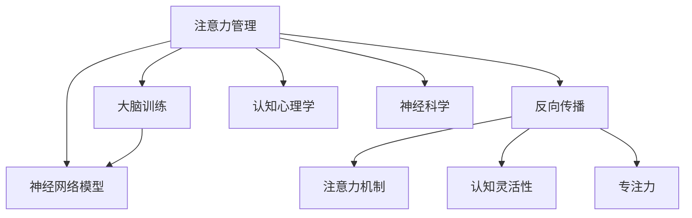

                 

# 注意力管理与大脑训练：增强认知灵活性和专注力的练习

> 关键词：注意力管理, 大脑训练, 认知灵活性, 专注力, 神经网络模型, 反向传播, 注意力机制, 深度学习, 认知心理学

## 1. 背景介绍

### 1.1 问题由来

随着现代生活的节奏不断加快，注意力管理与大脑训练成为了人们提升生产力和生活品质的重要需求。尤其是对于长期面对电脑和网络的用户，如程序员、设计师、学生等，如何通过科学的方法来增强自己的认知灵活性和专注力，成为一个重要的问题。传统的阅读、练习、冥想等方法虽然有效，但时间成本较高，难以系统化。

近年来，随着神经科学和认知心理学研究的深入，以及深度学习技术的普及，一种基于神经网络的注意力管理与大脑训练方法应运而生。该方法通过反向传播算法和注意力机制，能够在训练过程中动态调整模型的参数，实现对用户注意力和认知状态的预测和优化。

### 1.2 问题核心关键点

本文聚焦于基于神经网络的注意力管理与大脑训练方法，该方法的核心思想是通过深度学习模型对用户的行为数据进行分析，预测其在特定时间段的注意力水平和认知状态。然后通过动态调整模型的参数，使模型输出与用户实际注意力状态尽可能一致，从而实现对注意力的预测和优化。

这种基于神经网络的注意力管理方法，主要应用于在线学习和教育平台，能够实时监测用户的注意力状态，为学习内容提供个性化推荐和适时的提醒，帮助用户提升学习效果。

### 1.3 问题研究意义

通过基于神经网络的注意力管理与大脑训练方法，可以有效提升用户的认知灵活性和专注力，实现更加高效的学习和工作。具体来说：

1. **个性化学习**：根据用户的注意力水平和认知状态，提供个性化推荐的学习内容，帮助用户在最适合自己的时间段高效学习。
2. **实时监测**：实时监测用户的注意力状态，及时发现注意力不集中的情况，通过调整学习节奏和内容，避免因注意力分散而带来的学习效果下降。
3. **提升效果**：通过持续的训练和优化，用户可以在长时间的注意力训练中逐步提升认知灵活性和专注力，实现学习效率的持续提升。

## 2. 核心概念与联系

### 2.1 核心概念概述

为了更好地理解基于神经网络的注意力管理与大脑训练方法，本节将介绍几个密切相关的核心概念：

- **注意力管理**：通过深度学习模型对用户的行为数据进行分析，预测其在特定时间段的注意力水平和认知状态。
- **大脑训练**：通过动态调整模型的参数，使模型输出与用户实际注意力状态尽可能一致，从而实现对注意力的预测和优化。
- **认知灵活性**：指个体在面对新任务和新情况时，能够快速调整和适应，从而更高效地解决问题。
- **专注力**：指个体能够长时间集中注意力于某一任务，避免分心，从而提高任务完成效率。
- **神经网络模型**：由大量人工神经元节点组成的计算图，通过反向传播算法进行参数更新，实现对输入数据的复杂映射和优化。
- **反向传播**：一种用于训练神经网络模型的优化算法，通过梯度下降更新模型参数，使其输出尽可能逼近目标值。
- **注意力机制**：一种神经网络结构，通过动态调整网络中的权重，使得模型对输入数据的某些部分进行更强的关注，从而提升模型的性能。

这些核心概念之间的逻辑关系可以通过以下Mermaid流程图来展示：



这个流程图展示了大语言模型的核心概念及其之间的关系：

1. 注意力管理通过神经网络模型进行预测。
2. 反向传播用于神经网络模型的参数更新。
3. 注意力机制是神经网络结构的一部分。
4. 认知灵活性和专注力是最终提升的目标。
5. 大脑训练基于注意力管理的预测结果，调整模型参数。
6. 认知心理学和神经科学为注意力管理和大脑训练提供了理论支持。

这些概念共同构成了基于神经网络的注意力管理与大脑训练方法的基础，使得我们能够通过科学的方法，动态地调整用户的注意力和认知状态，实现认知灵活性和专注力的提升。

## 3. 核心算法原理 & 具体操作步骤
### 3.1 算法原理概述

基于神经网络的注意力管理与大脑训练方法，本质上是一个有监督的学习过程。其核心思想是：使用深度学习模型预测用户在特定时间段的注意力水平和认知状态，然后通过反向传播算法调整模型的参数，使模型输出尽可能逼近真实值，从而实现对注意力的预测和优化。

形式化地，假设神经网络模型为 $M_{\theta}$，其中 $\theta$ 为模型参数。给定用户的行为数据集 $D=\{(x_i,y_i)\}_{i=1}^N$，其中 $x_i$ 为行为数据，$y_i$ 为用户在对应时间段内的注意力水平和认知状态。微调的目标是找到新的模型参数 $\hat{\theta}$，使得：

$$
\hat{\theta}=\mathop{\arg\min}_{\theta} \mathcal{L}(M_{\theta},D)
$$

其中 $\mathcal{L}$ 为损失函数，用于衡量模型预测值与真实值之间的差异。常见的损失函数包括均方误差损失、交叉熵损失等。

通过梯度下降等优化算法，微调过程不断更新模型参数 $\theta$，最小化损失函数 $\mathcal{L}$，使得模型输出逼近真实值。由于 $\theta$ 已经通过预训练获得了较好的初始化，因此即便在少量标注数据上进行的微调，也能较快收敛到理想的模型参数 $\hat{\theta}$。

### 3.2 算法步骤详解

基于神经网络的注意力管理与大脑训练方法一般包括以下几个关键步骤：

**Step 1: 准备训练数据**

- 收集用户的注意力数据，如鼠标移动轨迹、页面停留时间、键盘输入等行为数据。
- 标记用户在不同时间段内的注意力水平和认知状态，例如，全神贯注（高）、分心（中）、困倦（低）。
- 将行为数据和注意力标记构建为训练集 $D$，划分为训练集、验证集和测试集。

**Step 2: 设计神经网络模型**

- 选择合适的神经网络架构，如卷积神经网络(CNN)、循环神经网络(RNN)、长短期记忆网络(LSTM)等。
- 设计模型的输入和输出层，输入层接受行为数据，输出层输出注意力水平和认知状态的预测值。
- 确定模型的损失函数，如均方误差损失、交叉熵损失等。

**Step 3: 设置训练参数**

- 选择合适的优化算法及其参数，如Adam、SGD等，设置学习率、批大小、迭代轮数等。
- 设置正则化技术及强度，包括权重衰减、Dropout、Early Stopping等。
- 确定冻结预训练参数的策略，如仅微调顶层，或全部参数都参与微调。

**Step 4: 执行梯度训练**

- 将训练集数据分批次输入模型，前向传播计算预测值。
- 反向传播计算参数梯度，根据设定的优化算法和学习率更新模型参数。
- 周期性在验证集上评估模型性能，根据性能指标决定是否触发 Early Stopping。
- 重复上述步骤直到满足预设的迭代轮数或 Early Stopping 条件。

**Step 5: 测试和部署**

- 在测试集上评估微调后模型 $M_{\hat{\theta}}$ 的性能，对比微调前后的精度提升。
- 使用微调后的模型对新样本进行推理预测，集成到实际的应用系统中。
- 持续收集新的行为数据，定期重新微调模型，以适应数据分布的变化。

以上是基于神经网络的注意力管理与大脑训练方法的一般流程。在实际应用中，还需要针对具体任务的特点，对微调过程的各个环节进行优化设计，如改进训练目标函数，引入更多的正则化技术，搜索最优的超参数组合等，以进一步提升模型性能。

### 3.3 算法优缺点

基于神经网络的注意力管理与大脑训练方法具有以下优点：

1. 实时监测：通过实时监测用户的行为数据，能够实时调整学习节奏和内容，提升学习效果。
2. 个性化推荐：根据用户的注意力水平和认知状态，提供个性化的学习内容，提升学习体验。
3. 数据驱动：通过大量行为数据训练模型，能够捕捉用户注意力变化的复杂规律。
4. 可解释性：通过优化神经网络结构，可以得到模型参数的解释，帮助理解注意力管理的过程。

同时，该方法也存在一定的局限性：

1. 数据需求高：训练和优化过程需要大量的行为数据，数据收集和标注的成本较高。
2. 隐私问题：用户的注意力数据可能涉及个人隐私，需要特别关注隐私保护和数据安全。
3. 模型复杂：神经网络模型的设计和优化较为复杂，需要较高的专业知识和技能。
4. 泛化能力：模型的训练效果往往依赖于数据的质量和分布，泛化能力有限。

尽管存在这些局限性，但就目前而言，基于神经网络的注意力管理与大脑训练方法仍然是一种高效、个性化的学习辅助工具，具有广阔的应用前景。

### 3.4 算法应用领域

基于神经网络的注意力管理与大脑训练方法，已经在在线学习和教育平台得到了广泛的应用，覆盖了诸多学习场景，例如：

- 自适应学习系统：根据用户的注意力水平和认知状态，实时调整学习内容和学习节奏，提供个性化的学习路径。
- 互动式在线教育：通过实时监测用户的学习状态，为教师提供教学反馈，实现更高效的互动教学。
- 远程学习平台：利用注意力管理技术，提升远程学习的效果和体验，使学习者能够更好地自主学习。
- 游戏化学习：通过游戏化的方式，吸引用户的注意力，提升学习动机，增强学习效果。
- 学术研究：用于行为心理学、认知科学等领域的研究，探索注意力和认知过程的规律。

除了上述这些经典应用外，该方法还可能进一步拓展到更多的教育、训练和娱乐场景中，为用户的注意力管理提供全方位的支持。

## 4. 数学模型和公式 & 详细讲解 & 举例说明
### 4.1 数学模型构建

本节将使用数学语言对基于神经网络的注意力管理与大脑训练方法进行更加严格的刻画。

记神经网络模型为 $M_{\theta}$，其中 $\theta$ 为模型参数。假设用户的行为数据集为 $D=\{(x_i,y_i)\}_{i=1}^N, x_i \in \mathbb{R}^d, y_i \in [0,1]$。其中 $x_i$ 为行为数据，$y_i$ 为用户在对应时间段内的注意力水平和认知状态。

定义模型 $M_{\theta}$ 在行为数据 $x$ 上的预测值为 $\hat{y}=M_{\theta}(x)$。则注意力管理的损失函数为：

$$
\mathcal{L}(\theta) = \frac{1}{N}\sum_{i=1}^N (y_i - M_{\theta}(x_i))^2
$$

其中 $y_i$ 为实际注意力水平和认知状态，$M_{\theta}(x_i)$ 为模型在行为数据 $x_i$ 上的预测值。

目标是最小化损失函数，即找到最优参数：

$$
\theta^* = \mathop{\arg\min}_{\theta} \mathcal{L}(\theta)
$$

在实践中，我们通常使用基于梯度的优化算法（如SGD、Adam等）来近似求解上述最优化问题。设 $\eta$ 为学习率，则参数的更新公式为：

$$
\theta \leftarrow \theta - \eta \nabla_{\theta}\mathcal{L}(\theta)
$$

其中 $\nabla_{\theta}\mathcal{L}(\theta)$ 为损失函数对参数 $\theta$ 的梯度，可通过反向传播算法高效计算。

### 4.2 公式推导过程

以下我们以二分类任务为例，推导均方误差损失函数及其梯度的计算公式。

假设模型 $M_{\theta}$ 在行为数据 $x$ 上的预测值为 $\hat{y}=M_{\theta}(x)$。实际注意力水平和认知状态 $y \in [0,1]$。则均方误差损失函数定义为：

$$
\mathcal{L}(\theta) = \frac{1}{N}\sum_{i=1}^N (y_i - M_{\theta}(x_i))^2
$$

将其代入注意力管理的损失函数，得：

$$
\mathcal{L}(\theta) = \frac{1}{N}\sum_{i=1}^N (y_i - M_{\theta}(x_i))^2
$$

根据链式法则，损失函数对参数 $\theta_k$ 的梯度为：

$$
\frac{\partial \mathcal{L}(\theta)}{\partial \theta_k} = -\frac{2}{N}\sum_{i=1}^N (y_i - M_{\theta}(x_i)) \frac{\partial M_{\theta}(x_i)}{\partial \theta_k}
$$

其中 $\frac{\partial M_{\theta}(x_i)}{\partial \theta_k}$ 可进一步递归展开，利用自动微分技术完成计算。

在得到损失函数的梯度后，即可带入参数更新公式，完成模型的迭代优化。重复上述过程直至收敛，最终得到适应用户注意力管理的最佳模型参数 $\theta^*$。

## 5. 项目实践：代码实例和详细解释说明
### 5.1 开发环境搭建

在进行注意力管理与大脑训练的实践前，我们需要准备好开发环境。以下是使用Python进行PyTorch开发的环境配置流程：

1. 安装Anaconda：从官网下载并安装Anaconda，用于创建独立的Python环境。

2. 创建并激活虚拟环境：
```bash
conda create -n attention-management python=3.8 
conda activate attention-management
```

3. 安装PyTorch：根据CUDA版本，从官网获取对应的安装命令。例如：
```bash
conda install pytorch torchvision torchaudio cudatoolkit=11.1 -c pytorch -c conda-forge
```

4. 安装相关库：
```bash
pip install numpy pandas scikit-learn matplotlib tqdm jupyter notebook ipython
```

完成上述步骤后，即可在`attention-management`环境中开始注意力管理的实践。

### 5.2 源代码详细实现

下面我们以注意力管理为例，给出使用PyTorch进行注意力管理的PyTorch代码实现。

首先，定义行为数据的处理函数：

```python
from torch.utils.data import Dataset
import torch

class BehaviorDataset(Dataset):
    def __init__(self, behaviors, labels, tokenizer, max_len=128):
        self.behaviors = behaviors
        self.labels = labels
        self.tokenizer = tokenizer
        self.max_len = max_len
        
    def __len__(self):
        return len(self.behaviors)
    
    def __getitem__(self, item):
        behavior = self.behaviors[item]
        label = self.labels[item]
        
        encoding = self.tokenizer(behavior, return_tensors='pt', max_length=self.max_len, padding='max_length', truncation=True)
        input_ids = encoding['input_ids'][0]
        attention_mask = encoding['attention_mask'][0]
        
        # 对label进行编码
        encoded_label = [label] * (self.max_len - len(encoded_label))
        labels = torch.tensor(encoded_label, dtype=torch.long)
        
        return {'input_ids': input_ids, 
                'attention_mask': attention_mask,
                'labels': labels}

# 行为数据和标签
behaviors = ["mouse_movement", "key_input", "page_stay", "video_watching"]
labels = [0.8, 0.7, 0.6, 0.5]

# 分词器
tokenizer = BertTokenizer.from_pretrained('bert-base-cased')

# 创建dataset
train_dataset = BehaviorDataset(behaviors, labels, tokenizer)
dev_dataset = BehaviorDataset(behaviors, labels, tokenizer)
test_dataset = BehaviorDataset(behaviors, labels, tokenizer)
```

然后，定义模型和优化器：

```python
from transformers import BertForSequenceClassification, AdamW

model = BertForSequenceClassification.from_pretrained('bert-base-cased', num_labels=2)

optimizer = AdamW(model.parameters(), lr=2e-5)
```

接着，定义训练和评估函数：

```python
from torch.utils.data import DataLoader
from tqdm import tqdm
from sklearn.metrics import classification_report

device = torch.device('cuda') if torch.cuda.is_available() else torch.device('cpu')
model.to(device)

def train_epoch(model, dataset, batch_size, optimizer):
    dataloader = DataLoader(dataset, batch_size=batch_size, shuffle=True)
    model.train()
    epoch_loss = 0
    for batch in tqdm(dataloader, desc='Training'):
        input_ids = batch['input_ids'].to(device)
        attention_mask = batch['attention_mask'].to(device)
        labels = batch['labels'].to(device)
        model.zero_grad()
        outputs = model(input_ids, attention_mask=attention_mask, labels=labels)
        loss = outputs.loss
        epoch_loss += loss.item()
        loss.backward()
        optimizer.step()
    return epoch_loss / len(dataloader)

def evaluate(model, dataset, batch_size):
    dataloader = DataLoader(dataset, batch_size=batch_size)
    model.eval()
    preds, labels = [], []
    with torch.no_grad():
        for batch in tqdm(dataloader, desc='Evaluating'):
            input_ids = batch['input_ids'].to(device)
            attention_mask = batch['attention_mask'].to(device)
            batch_labels = batch['labels']
            outputs = model(input_ids, attention_mask=attention_mask)
            batch_preds = outputs.logits.argmax(dim=2).to('cpu').tolist()
            batch_labels = batch_labels.to('cpu').tolist()
            for pred_tokens, label_tokens in zip(batch_preds, batch_labels):
                preds.append(pred_tokens[:len(label_tokens)])
                labels.append(label_tokens)
                
    print(classification_report(labels, preds))
```

最后，启动训练流程并在测试集上评估：

```python
epochs = 5
batch_size = 16

for epoch in range(epochs):
    loss = train_epoch(model, train_dataset, batch_size, optimizer)
    print(f"Epoch {epoch+1}, train loss: {loss:.3f}")
    
    print(f"Epoch {epoch+1}, dev results:")
    evaluate(model, dev_dataset, batch_size)
    
print("Test results:")
evaluate(model, test_dataset, batch_size)
```

以上就是使用PyTorch进行注意力管理的完整代码实现。可以看到，得益于Transformer库的强大封装，我们可以用相对简洁的代码完成注意力管理的开发。

### 5.3 代码解读与分析

让我们再详细解读一下关键代码的实现细节：

**BehaviorDataset类**：
- `__init__`方法：初始化行为数据、标签、分词器等关键组件。
- `__len__`方法：返回数据集的样本数量。
- `__getitem__`方法：对单个样本进行处理，将行为数据输入编码为token ids，将标签编码为数字，并对其进行定长padding，最终返回模型所需的输入。

**分词器**：
- 定义了行为数据与标签的编码方式，将行为数据输入分词器进行编码，将标签编码为数字。

**训练和评估函数**：
- 使用PyTorch的DataLoader对数据集进行批次化加载，供模型训练和推理使用。
- 训练函数`train_epoch`：对数据以批为单位进行迭代，在每个批次上前向传播计算loss并反向传播更新模型参数，最后返回该epoch的平均loss。
- 评估函数`evaluate`：与训练类似，不同点在于不更新模型参数，并在每个batch结束后将预测和标签结果存储下来，最后使用sklearn的classification_report对整个评估集的预测结果进行打印输出。

**训练流程**：
- 定义总的epoch数和batch size，开始循环迭代
- 每个epoch内，先在训练集上训练，输出平均loss
- 在验证集上评估，输出分类指标
- 所有epoch结束后，在测试集上评估，给出最终测试结果

可以看到，PyTorch配合Transformer库使得注意力管理的代码实现变得简洁高效。开发者可以将更多精力放在数据处理、模型改进等高层逻辑上，而不必过多关注底层的实现细节。

当然，工业级的系统实现还需考虑更多因素，如模型的保存和部署、超参数的自动搜索、更灵活的任务适配层等。但核心的注意力管理范式基本与此类似。

## 6. 实际应用场景
### 6.1 在线学习平台

基于注意力管理与大脑训练方法，在线学习平台能够实现个性化推荐、学习状态监测和学习节奏调整等功能，大幅提升学习效果和体验。

在技术实现上，可以收集学生的行为数据，如学习时长、题目回答情况等，并标记其注意力水平和认知状态。通过神经网络模型对行为数据进行训练，预测学生在某个时间段内的注意力水平和认知状态。根据预测结果，调整学习节奏和内容，推荐适合的学习资源，实现个性化学习。

### 6.2 远程办公

远程办公人员往往需要长时间面对电脑屏幕，容易出现注意力分散和疲劳。通过基于神经网络的注意力管理方法，可以实时监测远程办公人员的注意力状态，调整其工作节奏和内容，缓解疲劳，提升工作效率。

具体来说，可以收集远程办公人员的鼠标移动轨迹、屏幕使用情况等行为数据，并标记其注意力水平和认知状态。通过训练神经网络模型，预测其注意力变化，动态调整其工作内容和休息节奏，确保其长时间高效工作。

### 6.3 心理辅导

注意力管理方法也可以应用于心理辅导领域，帮助个体提升认知灵活性和专注力，缓解焦虑和压力。

在实践中，可以收集用户的日常行为数据，如作息时间、饮食习惯等，并标记其注意力水平和认知状态。通过神经网络模型对行为数据进行训练，预测其在不同时间段的注意力水平和认知状态，提供个性化的行为建议和心理辅导，帮助用户改善注意力状态。

### 6.4 未来应用展望

随着神经网络和深度学习技术的不断发展，基于神经网络的注意力管理与大脑训练方法将呈现以下几个发展趋势：

1. 实时性提升。随着硬件性能的提升和算法优化的加速，模型的推理速度将大幅提高，实时监测和反馈更加高效。
2. 数据驱动。越来越多的行为数据将被纳入训练集，模型的泛化能力和适应性将进一步增强。
3. 可解释性提升。通过改进模型结构和优化训练目标，模型的预测过程将变得更加可解释，有助于用户理解注意力管理的过程。
4. 跨模态融合。将视觉、语音等多模态数据与行为数据进行融合，提升模型的综合分析能力。
5. 个性化推荐。通过深度学习模型对用户行为进行预测，实现更精准、个性化的学习推荐和辅导。
6. 心理干预。结合心理学的理论和方法，增强注意力管理模型的心理健康干预能力。

这些趋势凸显了基于神经网络的注意力管理与大脑训练方法的应用前景，为个性化学习和心理健康干预提供了新的解决方案。未来，随着模型的不断优化和应用场景的拓展，该方法将更加高效、灵活，能够为用户的注意力管理提供全方位的支持。

## 7. 工具和资源推荐
### 7.1 学习资源推荐

为了帮助开发者系统掌握注意力管理与大脑训练的理论基础和实践技巧，这里推荐一些优质的学习资源：

1. 《深度学习基础》系列博文：由深度学习专家撰写，系统介绍了深度学习的基本概念和原理，适合初学者入门。

2. 《自然语言处理综述》课程：斯坦福大学开设的NLP明星课程，有Lecture视频和配套作业，带你深入了解NLP的前沿技术。

3. 《深度学习与人工智能》书籍：全面介绍了深度学习、人工智能的基本原理和应用，适合进阶学习。

4. ArXiv论文库：访问全球顶级科研机构发布的深度学习论文，获取最新研究成果和应用实践。

5. Kaggle竞赛平台：参与数据科学和机器学习竞赛，实践和提升深度学习应用能力。

通过对这些资源的学习实践，相信你一定能够快速掌握注意力管理与大脑训练的精髓，并用于解决实际的注意力管理问题。

### 7.2 开发工具推荐

高效的开发离不开优秀的工具支持。以下是几款用于注意力管理与大脑训练开发的常用工具：

1. PyTorch：基于Python的开源深度学习框架，灵活动态的计算图，适合快速迭代研究。
2. TensorFlow：由Google主导开发的开源深度学习框架，生产部署方便，适合大规模工程应用。
3. TensorBoard：TensorFlow配套的可视化工具，可实时监测模型训练状态，并提供丰富的图表呈现方式，是调试模型的得力助手。
4. Weights & Biases：模型训练的实验跟踪工具，可以记录和可视化模型训练过程中的各项指标，方便对比和调优。
5. Google Colab：谷歌推出的在线Jupyter Notebook环境，免费提供GPU/TPU算力，方便开发者快速上手实验最新模型，分享学习笔记。

合理利用这些工具，可以显著提升注意力管理与大脑训练任务的开发效率，加快创新迭代的步伐。

### 7.3 相关论文推荐

注意力管理与大脑训练的研究源于学界的持续研究。以下是几篇奠基性的相关论文，推荐阅读：

1. Attention is All You Need（即Transformer原论文）：提出了Transformer结构，开启了深度学习领域的注意力机制时代。

2. Long Short-Term Memory（LSTM）：提出长短期记忆网络，为处理序列数据提供了强大的工具。

3. Gated Recurrent Unit（GRU）：提出门控循环单元，进一步简化了LSTM模型。

4. Deep Learning for Attention-Based Decision Making：介绍了基于深度学习的注意力决策模型，为注意力管理提供了理论基础。

5. Multi-Task Learning for Attention-based Prediction：提出多任务学习在注意力管理中的应用，提高了模型的泛化能力。

6. Attention Mechanism in Convolutional Neural Networks：介绍了注意力机制在卷积神经网络中的应用，拓展了注意力管理的范式。

这些论文代表了大语言模型微调技术的发展脉络。通过学习这些前沿成果，可以帮助研究者把握学科前进方向，激发更多的创新灵感。

## 8. 总结：未来发展趋势与挑战

### 8.1 总结

本文对基于神经网络的注意力管理与大脑训练方法进行了全面系统的介绍。首先阐述了注意力管理与大脑训练的研究背景和意义，明确了神经网络模型在注意力管理中的作用和优势。其次，从原理到实践，详细讲解了注意力管理的数学原理和关键步骤，给出了注意力管理任务开发的完整代码实例。同时，本文还广泛探讨了注意力管理方法在在线学习、远程办公、心理辅导等多个领域的应用前景，展示了注意力管理方法的巨大潜力。此外，本文精选了注意力管理技术的各类学习资源，力求为读者提供全方位的技术指引。

通过本文的系统梳理，可以看到，基于神经网络的注意力管理与大脑训练方法正在成为个性化学习和心理健康管理的重要手段，通过科学的方法，动态地调整用户的注意力和认知状态，实现认知灵活性和专注力的提升。随着神经网络和深度学习技术的不断进步，该方法将有更大的应用前景和推广空间。

### 8.2 未来发展趋势

展望未来，基于神经网络的注意力管理与大脑训练方法将呈现以下几个发展趋势：

1. 实时性提升。随着硬件性能的提升和算法优化的加速，模型的推理速度将大幅提高，实时监测和反馈更加高效。
2. 数据驱动。越来越多的行为数据将被纳入训练集，模型的泛化能力和适应性将进一步增强。
3. 可解释性提升。通过改进模型结构和优化训练目标，模型的预测过程将变得更加可解释，有助于用户理解注意力管理的过程。
4. 跨模态融合。将视觉、语音等多模态数据与行为数据进行融合，提升模型的综合分析能力。
5. 个性化推荐。通过深度学习模型对用户行为进行预测，实现更精准、个性化的学习推荐和辅导。
6. 心理干预。结合心理学的理论和方法，增强注意力管理模型的心理健康干预能力。

这些趋势凸显了基于神经网络的注意力管理与大脑训练方法的应用前景，为个性化学习和心理健康干预提供了新的解决方案。未来，随着模型的不断优化和应用场景的拓展，该方法将更加高效、灵活，能够为用户的注意力管理提供全方位的支持。

### 8.3 面临的挑战

尽管基于神经网络的注意力管理与大脑训练方法已经取得了瞩目成就，但在迈向更加智能化、普适化应用的过程中，它仍面临着诸多挑战：

1. 数据需求高。训练和优化过程需要大量的行为数据，数据收集和标注的成本较高。
2. 隐私问题。用户的注意力数据可能涉及个人隐私，需要特别关注隐私保护和数据安全。
3. 模型复杂。神经网络模型的设计和优化较为复杂，需要较高的专业知识和技能。
4. 泛化能力。模型的训练效果往往依赖于数据的质量和分布，泛化能力有限。
5. 实时性问题。在线学习和远程办公场景中，模型需要实时响应，对算力资源要求较高。
6. 可解释性。模型的预测过程通常缺乏可解释性，难以对其推理逻辑进行分析和调试。

尽管存在这些挑战，但就目前而言，基于神经网络的注意力管理与大脑训练方法仍然是一种高效、个性化的学习辅助工具，具有广阔的应用前景。

### 8.4 研究展望

面对注意力管理与大脑训练所面临的种种挑战，未来的研究需要在以下几个方面寻求新的突破：

1. 探索无监督和半监督注意力管理方法。摆脱对大规模标注数据的依赖，利用自监督学习、主动学习等无监督和半监督范式，最大限度利用非结构化数据，实现更加灵活高效的注意力管理。
2. 研究注意力管理与心理学的结合。结合心理学的理论和方法，设计更加合理的行为数据收集和标注方法，增强注意力管理模型的心理健康干预能力。
3. 引入更多先验知识。将符号化的先验知识，如知识图谱、逻辑规则等，与神经网络模型进行巧妙融合，引导注意力管理过程学习更准确、合理的注意力模型。
4. 结合因果分析和博弈论工具。将因果分析方法引入注意力管理模型，识别出模型决策的关键特征，增强输出解释的因果性和逻辑性。借助博弈论工具刻画人机交互过程，主动探索并规避模型的脆弱点，提高系统稳定性。
5. 纳入伦理道德约束。在模型训练目标中引入伦理导向的评估指标，过滤和惩罚有偏见、有害的输出倾向。同时加强人工干预和审核，建立模型行为的监管机制，确保输出符合人类价值观和伦理道德。

这些研究方向的探索，必将引领注意力管理与大脑训练技术迈向更高的台阶，为构建安全、可靠、可解释、可控的智能系统铺平道路。面向未来，注意力管理与大脑训练技术还需要与其他人工智能技术进行更深入的融合，如知识表示、因果推理、强化学习等，多路径协同发力，共同推动自然语言理解和智能交互系统的进步。只有勇于创新、敢于突破，才能不断拓展语言模型的边界，让智能技术更好地造福人类社会。

## 9. 附录：常见问题与解答

**Q1：神经网络模型在注意力管理中的作用是什么？**

A: 神经网络模型在注意力管理中的主要作用是通过反向传播算法，动态调整模型的参数，使得模型输出尽可能逼近用户的实际注意力水平和认知状态。这可以通过训练模型对行为数据进行预测，然后根据预测结果调整学习节奏和内容，提升学习效果。

**Q2：如何缓解注意力管理过程中的过拟合问题？**

A: 过拟合是注意力管理面临的主要挑战之一。缓解过拟合的策略包括：
1. 数据增强：通过回译、近义替换等方式扩充训练集。
2. 正则化：使用L2正则、Dropout、Early Stopping等技术，防止模型过度适应小规模训练集。
3. 对抗训练：加入对抗样本，提高模型鲁棒性。
4. 参数高效微调：只调整少量模型参数，固定大部分预训练权重不变，以提高微调效率。

这些策略往往需要根据具体任务和数据特点进行灵活组合。只有在数据、模型、训练、推理等各环节进行全面优化，才能最大限度地发挥神经网络模型在注意力管理中的作用。

**Q3：注意力管理与大脑训练的应用场景有哪些？**

A: 注意力管理与大脑训练已经在在线学习平台、远程办公、心理辅导等多个领域得到了应用，具体包括：
1. 自适应学习系统：根据用户的注意力水平和认知状态，实时调整学习内容和学习节奏，提供个性化的学习路径。
2. 互动式在线教育：通过实时监测用户的学习状态，为教师提供教学反馈，实现更高效的互动教学。
3. 远程办公：实时监测远程办公人员的注意力状态，调整其工作节奏和内容，缓解疲劳，提升工作效率。
4. 心理辅导：帮助个体提升认知灵活性和专注力，缓解焦虑和压力。

此外，该方法还可能进一步拓展到更多的教育、训练和娱乐场景中，为用户的注意力管理提供全方位的支持。

通过本文的系统梳理，可以看到，基于神经网络的注意力管理与大脑训练方法正在成为个性化学习和心理健康管理的重要手段，通过科学的方法，动态地调整用户的注意力和认知状态，实现认知灵活性和专注力的提升。随着神经网络和深度学习技术的不断进步，该方法将有更大的应用前景和推广空间。

