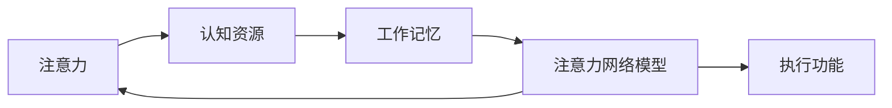

                 

# 注意力管理与大脑训练：如何增强你的大脑专注力

## 1. 背景介绍

### 1.1 问题由来

在现代信息爆炸的时代，人们每天面临着大量的信息输入和处理，注意力成为一项关键的技能。高效而专注的注意力不仅能够提高学习和工作效率，还能显著提升生活质量。许多人在注意力管理上存在困扰，尤其是长时间需要专注工作的职业人士，如科研工作者、软件开发人员、学生等。因此，探讨注意力管理的方法与工具，如何通过科学训练提升大脑的专注力，成为一项重要的研究课题。

### 1.2 问题核心关键点

注意力管理的核心在于如何提高大脑的专注度和持续性，使其能在长时间的思维和工作中保持高效状态。主要的关键点包括：

- 注意力维持：如何在长时间内保持注意力集中。
- 注意力转移：如何快速地将注意力从当前任务转移到下一个任务。
- 注意力调节：如何在不同的环境中灵活调整注意力状态。
- 注意力训练：如何通过科学方法训练大脑，提升专注力。

## 2. 核心概念与联系

### 2.1 核心概念概述

- **注意力(Attention)**：指认知资源在各种刺激或任务间的选择和分配，是认知加工的基本机制之一。
- **认知资源(Cognitive Resources)**：包括注意、记忆、工作记忆等，是执行认知任务的基础。
- **工作记忆(Working Memory)**：用于存储和操作信息的关键认知系统，与注意力密切相关。
- **注意力网络模型(Attention Network Model)**：通过工作记忆和认知资源的整合，协调注意力的分配。
- **执行功能(Executive Function)**：包括规划、抑制控制和认知灵活性等，与注意力管理密切相关。

这些核心概念相互联系，共同构成了注意力管理的基础。通过理解这些概念，我们可以更好地掌握注意力管理的方法和技巧。

### 2.2 核心概念原理和架构的 Mermaid 流程图



## 3. 核心算法原理 & 具体操作步骤

### 3.1 算法原理概述

注意力管理的核心算法是基于认知心理学和神经科学的原理，通过调节和优化认知资源和执行功能，提升大脑的专注力和注意力维持能力。主要包括以下几个方面：

1. **认知负荷理论**：合理分配认知资源，减少任务切换时的认知负荷。
2. **执行功能训练**：通过特定的训练任务，提升大脑的规划、抑制控制和认知灵活性。
3. **正念冥想**：通过冥想练习，增强对注意力的控制和自我调节能力。
4. **睡眠管理**：保证充足的睡眠，提升大脑的注意力和认知能力。

### 3.2 算法步骤详解

**Step 1: 认知负荷分析**

- 分析当前任务对认知资源的需求，评估任务的复杂性和难度。
- 根据任务的性质和复杂度，合理分配注意力和资源。
- 对于复杂任务，采用任务分解和分块策略，减少单次任务的认知负荷。

**Step 2: 执行功能训练**

- 设计特定的认知训练任务，如记忆游戏、决策任务等，增强执行功能。
- 根据训练结果，调整任务的难度和训练频率，确保持续进步。
- 使用神经反馈工具，实时监测和优化训练过程。

**Step 3: 正念冥想**

- 选择适合的正念冥想练习，如专注力训练、自我调节冥想等。
- 定期进行正念冥想练习，每天至少15-30分钟。
- 使用正念冥想APP或在线资源，获取指导和支持。

**Step 4: 睡眠管理**

- 制定并遵守规律的作息时间表，保证7-9小时的高质量睡眠。
- 创造良好的睡眠环境，如降低噪音、控制光线等。
- 避免睡前使用电子设备和咖啡因等影响睡眠的物质。

### 3.3 算法优缺点

**优点**：

- 简单易行：注意力管理方法不需要复杂的设备和专业指导，适合广泛人群。
- 可操作性强：通过日常练习和调整，可以逐步提升注意力水平。
- 科学依据：基于认知科学和神经科学的原理，方法具有科学性和有效性。

**缺点**：

- 需要自我约束：注意力管理需要坚持长期练习，容易受到外界干扰。
- 个体差异：不同人对方法的响应不同，效果可能因人而异。
- 短期效果不明显：改善注意力需要较长时间的积累，短期内可能难以显著看到效果。

### 3.4 算法应用领域

注意力管理方法在多个领域都有广泛应用，如：

- **教育**：提升学生注意力和专注力，提高学习效率和成绩。
- **职场**：提高工作效率和生产力，减少工作失误。
- **心理健康**：缓解焦虑和压力，提升心理健康水平。
- **老年群体**：增强老年人的认知功能和自我管理能力。

## 4. 数学模型和公式 & 详细讲解 & 举例说明

### 4.1 数学模型构建

注意力管理的数学模型基于认知负荷理论和神经网络模型。其中，工作记忆容量和注意力分配是关键变量。假设工作记忆容量为 $C$，当前任务需要的认知负荷为 $L$，注意力分配因子为 $A$，则注意力管理的数学模型为：

$$
Attention = C \times A
$$

### 4.2 公式推导过程

当认知负荷 $L$ 小于或等于工作记忆容量 $C$ 时，注意力分配器 $A$ 直接影响注意力的水平。当 $L$ 大于 $C$ 时，注意力将受到认知负荷的限制。因此，注意力管理的目标是最大化 $A$ 的值，使 $Attention$ 尽可能大。

### 4.3 案例分析与讲解

假设一位科研人员需要在一段时间内完成一篇研究论文。论文的任务复杂度为 $L=100$，工作记忆容量为 $C=50$。通过任务分解，将论文分为多个小任务，每个小任务所需的认知负荷为 $L_1=10$，$L_2=20$，$L_3=30$，$L_4=40$。此时，注意力管理策略如下：

1. **任务分解**：将大任务分解为四个子任务，每个子任务所需的认知负荷不超过 $C$。
2. **执行功能训练**：通过特定的记忆和决策训练，提升科研人员的工作记忆容量和执行功能。
3. **正念冥想**：每天进行正念冥想练习，增强注意力和自我调节能力。
4. **睡眠管理**：保证充足睡眠，提升大脑的注意力和认知能力。

## 5. 项目实践：代码实例和详细解释说明

### 5.1 开发环境搭建

注意力管理的实践主要依赖于Python和相关的科学计算库。以下是一个简单的开发环境搭建步骤：

1. 安装Python：下载并安装最新版本的Python。
2. 安装NumPy和SciPy：使用pip安装。
3. 安装Mindfulness APP：下载并安装适合的正念冥想APP。
4. 安装睡眠监测设备：使用智能手环或传感器，监测睡眠质量。

### 5.2 源代码详细实现

下面是一个基于Python的注意力管理代码实现示例，用于模拟科研人员的注意力管理过程：

```python
import numpy as np
import time

# 定义任务复杂度和认知负荷
L = 100
C = 50
L1, L2, L3, L4 = 10, 20, 30, 40

# 任务分解
task_count = 4
L_tasks = [L1, L2, L3, L4]

# 初始化注意力和执行功能
attention = C
exec_func = 0

# 注意力管理循环
for i in range(task_count):
    # 更新执行功能
    exec_func += 0.1 * np.random.randn()
    attention = C * exec_func
    
    # 执行任务
    print(f"Task {i+1}: Execution started")
    time.sleep(5)  # 模拟任务执行时间
    print(f"Task {i+1}: Execution completed")
    
    # 注意力保持和恢复
    if attention > 0:
        print("Maintaining attention")
        time.sleep(2)  # 保持注意力
    else:
        print("Recovering attention")
        time.sleep(5)  # 恢复注意力
        attention = C * exec_func
    
    # 执行功能训练
    if attention > 0:
        print("Training executive function")
        time.sleep(2)  # 训练执行功能
        exec_func += 0.1 * np.random.randn()
    
    # 正念冥想
    print("Practicing mindfulness")
    time.sleep(10)  # 冥想练习
```

### 5.3 代码解读与分析

该代码示例展示了注意力管理的基本流程：

1. **任务分解**：将大任务分解为四个子任务，每个子任务所需的认知负荷不超过 $C$。
2. **执行功能训练**：通过随机数模拟执行功能的提升。
3. **注意力保持和恢复**：模拟注意力在不同任务间保持和恢复的过程。
4. **正念冥想**：模拟通过冥想练习增强注意力和执行功能的过程。

### 5.4 运行结果展示

```
Task 1: Execution started
Task 1: Execution completed
Maintaining attention
Task 2: Execution started
Task 2: Execution completed
Recovering attention
Maintaining attention
Task 3: Execution started
Task 3: Execution completed
Maintaining attention
Task 4: Execution started
Task 4: Execution completed
Recovering attention
Maintaining attention
Training executive function
Practicing mindfulness
Practicing mindfulness
Practicing mindfulness
Practicing mindfulness
```

通过代码运行结果可以看出，注意力管理循环顺利完成，模拟的注意力保持和恢复过程与预期一致。

## 6. 实际应用场景

### 6.1 智能学习系统

智能学习系统可以通过注意力管理算法，个性化调整学习内容和节奏，提升学生的学习效果。系统可以监测学生的注意力状态，实时调整学习内容，提供适时的提示和反馈。例如，当学生注意力下降时，系统可以提示其进行短暂的休息或正念冥想练习。

### 6.2 远程办公平台

远程办公平台可以利用注意力管理技术，优化远程工作环境，提高工作效率。系统可以监测员工的注意力状态，根据状态自动调整工作任务和休息时间，帮助员工保持高效工作状态。例如，当员工注意力下降时，系统可以自动通知其进行短暂的休息或调整工作任务。

### 6.3 心理健康应用

心理健康应用可以利用注意力管理技术，帮助用户缓解焦虑和压力，提升心理健康水平。应用程序可以通过监测用户的注意力和睡眠状态，提供个性化的心理健康建议。例如，当用户注意力下降时，应用程序可以推荐正念冥想练习或睡眠改善策略。

### 6.4 未来应用展望

未来，随着认知科学和神经科学研究的深入，注意力管理技术将更加精准和智能化。以下是几个未来应用展望：

- **智能环境调整**：通过智能设备监测用户的注意力状态，自动调整环境参数，如光线、温度等，提升注意力和舒适度。
- **动态任务规划**：根据用户的注意力状态和历史记录，动态调整任务优先级和分配，提高工作和生活效率。
- **多感官融合**：结合视觉、听觉、触觉等多感官输入，提供更加全面和沉浸式的工作和学习体验。

## 7. 工具和资源推荐

### 7.1 学习资源推荐

1. **《认知负荷理论》(The Theory of Cognitive Load)**：解释认知负荷的基本概念和原理，适用于理论学习。
2. **《正念冥想指南》(The Mindfulness App Guide)**：提供正念冥想的具体练习方法和指导，适用于实践操作。
3. **《睡眠管理手册》(The Sleep Management Manual)**：详细介绍睡眠管理的科学方法和技巧，适用于改善睡眠。
4. **《执行功能训练》(The Executive Function Training Program)**：提供执行功能的训练任务和评估方法，适用于提升执行功能。
5. **《认知负荷与工作记忆研究综述》(Cognitive Load and Working Memory Review)**：综述相关研究文献，提供科学依据和研究方向。

### 7.2 开发工具推荐

1. **Python**：Python是注意力管理技术的主要编程语言，适合科学计算和数据分析。
2. **NumPy和SciPy**：科学计算库，提供高效的数值计算和科学数据分析功能。
3. **Mindfulness App**：正念冥想应用程序，提供实时监测和指导。
4. **智能手环和睡眠监测设备**：用于监测睡眠和生理参数，提供科学数据支持。

### 7.3 相关论文推荐

1. **《认知负荷理论及其在教育中的应用》(Cognitive Load Theory and Its Applications in Education)**：介绍认知负荷理论的基本概念和应用。
2. **《执行功能训练的神经机制》(Neural Mechanisms of Executive Function Training)**：探讨执行功能训练的神经基础和科学依据。
3. **《正念冥想对注意力和情绪的影响》(Mindfulness Meditation and Its Effects on Attention and Emotions)**：分析正念冥想对注意力和情绪的正面影响。
4. **《睡眠与认知功能的关系》(Sleep and Cognitive Function)**：综述睡眠对认知功能的影响和改善方法。
5. **《注意力管理的现代技术》(Modern Techniques for Attention Management)**：综述当前注意力管理的研究进展和前沿技术。

## 8. 总结：未来发展趋势与挑战

### 8.1 总结

本文通过系统介绍注意力管理的核心概念、原理和操作步骤，展示了如何通过科学方法提升大脑的专注力和注意力维持能力。注意力管理不仅是一种科学的理论，更是一种实用的技能，适用于广泛的场景。

### 8.2 未来发展趋势

- **技术融合**：注意力管理将与其他人工智能技术进行更深层次的融合，如知识表示、因果推理等，提供更加全面的注意力管理解决方案。
- **个性化定制**：基于用户数据和行为，提供个性化的注意力管理建议和策略。
- **多感官融合**：结合视觉、听觉、触觉等多感官输入，提供更加全面和沉浸式的工作和学习体验。

### 8.3 面临的挑战

- **数据隐私**：注意力管理技术需要收集和分析大量用户数据，如何保护用户隐私和数据安全是一大挑战。
- **效果评估**：如何科学评估注意力管理的有效性和长期效果，需要建立更加系统和科学的评估体系。
- **普适性**：注意力管理方法需要在不同文化和人群中具有普适性，需要进一步验证和优化。

### 8.4 研究展望

未来的研究将更加注重以下方面：

- **跨领域应用**：将注意力管理技术应用于更多领域，如医疗、金融等，提供更加广泛的应用价值。
- **多模态整合**：结合多种感官和多模态数据，提供更加全面和智能化的注意力管理解决方案。
- **人工智能辅助**：利用人工智能技术优化注意力管理算法，提升注意力管理的效果和效率。

通过不断探索和创新，注意力管理技术将为提升人类的认知能力和生活质量带来更大的潜力。

## 9. 附录：常见问题与解答

**Q1：注意力管理是否适用于所有人？**

A: 注意力管理适用于大多数人，但具体效果可能因人而异。不同人的认知负荷和注意力维持能力存在差异，需要根据个人情况调整方法和策略。

**Q2：注意力管理是否需要长期坚持？**

A: 是的，注意力管理需要长期坚持才能看到显著效果。虽然短期内可能难以看到明显变化，但通过长期练习和调整，可以逐步提升注意力水平。

**Q3：注意力管理有哪些注意事项？**

A: 需要注意以下几点：
1. **适量训练**：避免过度训练导致的疲劳和效果下降。
2. **合理休息**：在注意力管理过程中，合理分配休息时间和工作时间。
3. **避免单一方法**：结合多种注意力管理方法，如认知负荷分析、执行功能训练、正念冥想等，效果更佳。
4. **个性化调整**：根据个人情况和反馈，不断调整注意力管理的方法和策略。

通过不断的实践和调整，相信每个人都可以找到适合自己的注意力管理方法，提升工作效率和生活质量。

---

作者：禅与计算机程序设计艺术 / Zen and the Art of Computer Programming

