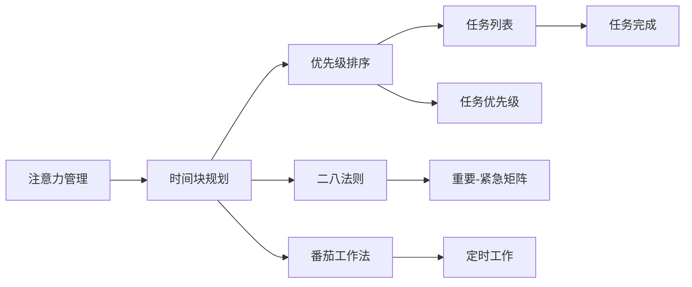

                 

## 1. 背景介绍

在当前信息爆炸和竞争激烈的数字时代，时间管理和注意力管理成为了个人和团队提升效率和生产力的关键。个人工作时间的碎片化、信息干扰的加剧、心理负担的增加等问题，使人们常常陷入低效和疲惫的状态。注意力管理与时间块规划（Time Blocking）是应对这些问题的一种有效方法。

时间块规划是一种通过将一天分成多个时间段来管理时间和注意力的方法。它要求个人在固定的时间段内专注于某一特定任务，避免在多个任务之间频繁切换，从而提高工作效率和专注力。

## 2. 核心概念与联系

### 2.1 核心概念概述

- **注意力管理（Attention Management）**：注意力管理是指通过各种方法和工具，帮助个体控制注意力，减少干扰，专注于重要任务。其核心在于提升工作效率和专注度。
- **时间块规划（Time Blocking）**：时间块规划是一种时间管理方法，通过将一天分成多个时间段，每个时间段专注于一个特定任务，提高工作效率和专注力。
- **优先级排序（Priority Sorting）**：通过优先级排序将任务按重要性和紧急性排序，确保在有限的时间内完成最重要的工作。
- **番茄工作法（Pomodoro Technique）**：一种通过设定固定时间段来提高工作效率和专注力的方法，每25分钟工作一次，休息5分钟，循环进行。
- **二八法则（Pareto Principle）**：80%的成果往往来自20%的努力，即最重要的工作集中在少数几个高优先级任务上。

这些概念的联系在于，它们都是通过不同的方式帮助个体提升效率和专注力。注意力管理提供了一个集中精力的环境，时间块规划提供了一种结构化的任务处理方式，而优先级排序和二八法则帮助个体集中于最重要的任务，番茄工作法则是提高专注力的一个简单而有效的方法。

### 2.2 核心概念原理和架构的 Mermaid 流程图



这个流程图展示了注意力管理、时间块规划与其他核心概念的联系。通过优先级排序、二八法则、番茄工作法等辅助方法，时间块规划更加具体化，帮助个体更好地完成重要任务，从而提升整体效率。

## 3. 核心算法原理 & 具体操作步骤

### 3.1 算法原理概述

时间块规划的核心原理是“批量处理”。即将一天分成多个时间段，每个时间段专注于一个特定任务，避免在多个任务之间频繁切换，从而提高工作效率和专注力。其原理基于认知科学中的“有限注意力理论”，即人类注意力资源有限，频繁切换任务会消耗大量能量，影响工作效率。

### 3.2 算法步骤详解

1. **任务清单编制**：列出所有需要完成的任务，并对每个任务进行分类和评估。
2. **优先级排序**：根据任务的紧急程度和重要性，对任务进行排序。
3. **时间块划分**：根据任务的重要性和紧急性，划分出需要专注的时间块。
4. **时间块执行**：在每个时间块内专注于特定任务，避免切换任务。
5. **休息调整**：每个时间块之间设置短暂的休息时间，以恢复精力。
6. **复盘与调整**：每天结束时，复盘当天的工作，评估时间块的效果，并根据实际情况进行调整。

### 3.3 算法优缺点

**优点**：
- 结构化：通过明确的时间块划分，使任务处理更加结构化和有条理。
- 专注力提升：每个时间块专注于一个任务，减少了任务切换带来的注意力分散。
- 高效工作：通过优先级排序和批量处理，提升了重要任务的完成效率。

**缺点**：
- 灵活性不足：时间块规划较为固定，可能需要根据实际情况进行调整。
- 过度规划：过度规划可能会带来心理负担，影响灵活性。
- 中断干扰：突发事件和不可预见的干扰可能打乱时间块计划。

### 3.4 算法应用领域

时间块规划和注意力管理在多个领域都有广泛应用，例如：
- **个人效率提升**：提高个人工作和学习的效率，减少任务切换带来的干扰。
- **团队协作**：在团队中应用时间块规划，有助于统一工作节奏，提高团队整体效率。
- **项目管理**：将时间块规划应用到项目管理中，有助于合理分配资源，确保项目按时完成。
- **知识管理**：通过时间块规划，集中精力学习和整理知识，提升学习效果。

## 4. 数学模型和公式 & 详细讲解

### 4.1 数学模型构建

假设一天有$T$小时，每小时有$60$分钟，每个时间块长度为$P$分钟，则一天可以划分的时间块数为：
$$N = \frac{T \times 60}{P}$$

### 4.2 公式推导过程

设任务集合为$S$，任务数为$|S|$。每个任务$i$的优先级为$p_i$，紧急程度为$d_i$。则任务排序后的优先级排序矩阵为：
$$P = \begin{bmatrix} 
p_1 & p_2 & \cdots & p_{|S|} 
\end{bmatrix}$$

优先级排序矩阵可以通过以下方式计算：
$$p_i = \frac{d_i + \text{优先级权重}}{\text{优先级权重}}$$

其中，优先级权重可以根据任务的重要性和紧急程度进行设定。例如，可以设置权重为$1$（重要）、$2$（紧急）、$3$（既重要又紧急）等。

### 4.3 案例分析与讲解

假设小明需要完成以下任务：
- 准备明天的会议（紧急且重要）
- 回复邮件（紧急但不重要）
- 阅读论文（重要但不紧急）
- 编写代码（不重要也不紧急）

根据优先级排序，可以得出排序后的任务列表和优先级排序矩阵：
- 准备会议：$3$分
- 回复邮件：$2$分
- 阅读论文：$1$分
- 编写代码：$0$分

根据二八法则，小明优先完成前两项任务，即准备会议和回复邮件。剩余时间用于阅读论文和编写代码。

## 5. 项目实践：代码实例和详细解释说明

### 5.1 开发环境搭建

要实现时间块规划，需要一个简单易用的时间块管理工具。可以使用Google Calendar、Todoist、Trello等工具，或自己编写简单的Python脚本来实现。

### 5.2 源代码详细实现

以下是一个简单的Python脚本，用于模拟时间块规划和任务优先级排序：

```python
import random
import time

# 任务列表
tasks = [
    {'name': '会议准备', 'priority': 3, 'due_time': '2024-01-01 09:00:00'},
    {'name': '回复邮件', 'priority': 2, 'due_time': '2024-01-01 10:00:00'},
    {'name': '阅读论文', 'priority': 1, 'due_time': '2024-01-01 13:00:00'},
    {'name': '编写代码', 'priority': 0, 'due_time': '2024-01-01 14:00:00'}
]

# 优先级排序
tasks.sort(key=lambda x: x['priority'], reverse=True)

# 时间块划分
time_blocks = [
    {'start_time': '2024-01-01 08:00:00', 'end_time': '2024-01-01 10:00:00'},
    {'start_time': '2024-01-01 10:15:00', 'end_time': '2024-01-01 12:00:00'},
    {'start_time': '2024-01-01 12:15:00', 'end_time': '2024-01-01 14:00:00'}
]

# 时间块执行
for i, block in enumerate(time_blocks):
    print(f"Time Block {i+1}")
    for task in tasks:
        if task['due_time'] <= block['end_time']:
            print(f"    {task['name']}")
            time.sleep(random.randint(1, 30))  # 模拟任务执行时间
            del task  # 任务完成
            break
    else:
        print(f"    No tasks in block")

print("All tasks completed!")
```

### 5.3 代码解读与分析

该脚本首先定义了一个任务列表，根据任务的优先级进行排序。然后，将一天划分为多个时间块，在每个时间块中依次执行任务。如果时间块内没有任务，则打印“No tasks in block”。

## 6. 实际应用场景

### 6.1 个人工作场景

时间块规划在个人工作场景中的应用非常广泛。例如，一名软件开发人员可以每天早上规划一天的工作时间块，上午专注于代码编写，下午专注于代码测试和调试。每个时间块之间设置短暂的休息时间，以恢复精力，避免长时间高强度工作的疲劳。

### 6.2 项目管理场景

在项目管理中，时间块规划也有广泛应用。例如，项目经理可以将一天划分为多个时间块，每个时间块专注于某个项目任务。这有助于团队成员集中精力完成任务，同时避免在多个任务之间频繁切换，提高整体效率。

### 6.3 学习场景

学生也可以应用时间块规划来提高学习效率。例如，每节课后安排固定的时间块复习课程内容，避免长时间学习带来的疲劳，同时集中精力解决疑难问题。

### 6.4 未来应用展望

未来，时间块规划和注意力管理的应用将更加广泛和智能化。例如，智能助手可以根据用户的日程安排和任务优先级，自动安排时间块，提醒用户完成任务。同时，结合人工智能和大数据分析，智能助手可以预测用户的工作效率，并提供优化建议。

## 7. 工具和资源推荐

### 7.1 学习资源推荐

- **书籍**：《深度工作：如何有效利用你的每一小时》（Deep Work: Rules for Focused Success in a Distracted World），作者：Cal Newport
- **在线课程**：Coursera上的《时间管理与个人效率》（Time Management and Personal Productivity）
- **博客**：Medium上的《如何高效工作：时间块规划的秘诀》（How to Work Efficiently: The Secret to Time Blocking）

### 7.2 开发工具推荐

- **Google Calendar**：简单易用的在线日历工具，适用于个人和团队时间块规划。
- **Todoist**：功能丰富的任务管理工具，支持任务优先级排序和时间块划分。
- **Trello**：可视化任务管理工具，适合团队协作和项目管理。

### 7.3 相关论文推荐

- **《深度工作：一项心智活动》**（Deep Work: A New Understanding of Information Technology, Organizations, and Creativity），作者：Cal Newport
- **《时间块规划：一种时间管理技术》**（Time Blocking: A Time Management Technique），作者：Lisa Bergeron

## 8. 总结：未来发展趋势与挑战

### 8.1 研究成果总结

时间块规划和注意力管理技术在提高个人和团队效率方面已经取得了显著成果。这些技术的应用不仅提高了工作效率，还改善了工作环境和工作状态，有助于减少压力和焦虑。

### 8.2 未来发展趋势

未来，时间块规划和注意力管理将更加智能化和自动化。例如，智能助手可以根据用户的行为模式和任务优先级，自动安排时间块，并提供优化建议。同时，结合人工智能和大数据分析，智能助手可以预测用户的工作效率，并提供个性化建议。

### 8.3 面临的挑战

尽管时间块规划和注意力管理技术已经取得了显著成果，但仍面临一些挑战：
- **灵活性不足**：时间块规划较为固定，可能需要根据实际情况进行调整。
- **中断干扰**：突发事件和不可预见的干扰可能打乱时间块计划。
- **心理负担**：过度规划可能会带来心理负担，影响灵活性。

### 8.4 研究展望

未来研究需要关注以下几个方面：
- **自适应时间块规划**：根据用户的实时状态和环境，动态调整时间块长度和任务优先级。
- **智能提醒系统**：结合智能助手和人工智能技术，提供个性化的时间块规划和任务提醒。
- **多任务协同**：探索如何将时间块规划与多任务协同、项目管理等技术结合，提高整体效率。

总之，时间块规划和注意力管理技术将继续发展，并在个人、团队和组织中发挥更大的作用。未来，这些技术将更加智能化和自动化，帮助个体和企业更高效地利用时间和注意力，提高整体生产力和工作满意度。

## 9. 附录：常见问题与解答

**Q1：如何选择合适的任务优先级？**

A: 任务的优先级可以根据任务的紧急程度和重要性进行设定。一般来说，紧急且重要的任务优先级最高，其次是紧急但不重要的任务，然后是重要但不紧急的任务，最后是不重要也不紧急的任务。优先级权重可以根据实际情况进行调整。

**Q2：时间块长度应如何设定？**

A: 时间块长度应根据任务的复杂度和注意力持续时间进行设定。一般来说，每个时间块长度为25-30分钟较为适宜。在长时间的高强度工作后，可以安排短暂的休息时间，以恢复精力。

**Q3：如何应对突发事件和干扰？**

A: 突发事件和干扰是不可避免的，可以通过以下方式应对：
- **预留缓冲时间**：在时间块之间设置缓冲时间，以应对突发事件和干扰。
- **紧急处理机制**：建立紧急处理机制，在突发事件发生时快速响应。
- **灵活调整计划**：根据实际情况灵活调整时间块计划，避免过度规划和刚性执行。

**Q4：时间块规划是否适用于所有人？**

A: 时间块规划适用于大多数人群，尤其是那些工作繁忙、任务繁重、容易分心的人群。但是，对于那些需要高频率切换任务的人群（如服务员、护士等），时间块规划可能不太适用。

**Q5：时间块规划是否适用于远程工作？**

A: 时间块规划同样适用于远程工作。通过时间块规划，远程工作者可以更好地管理自己的时间和任务，提高工作效率和专注力。但是，远程工作环境下，时间块的划分和执行需要更多的自律和自我管理。

作者：禅与计算机程序设计艺术 / Zen and the Art of Computer Programming

