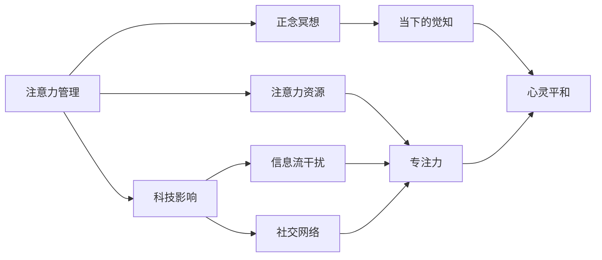

                 

# 注意力管理与正念冥想实践：通过内省增强专注力和心灵平和

> 关键词：注意力管理, 正念冥想, 内省, 专注力, 心灵平和

## 1. 背景介绍

在快节奏的现代生活中，注意力逐渐成为人们最为关注的心理资源。科技的飞速发展，尤其是智能手机和互联网的普及，使得注意力分散成为了普遍现象。过多的信息流、复杂的社交网络、频繁的中断干扰，都对人们的专注力和心灵平和构成了严重威胁。与此同时，正念冥想作为一种古老的修行方式，近年来在全球范围内得到了广泛的应用和推广。本文将深入探讨注意力管理和正念冥想的内在联系，并详细阐述如何通过内省技巧提升专注力和心灵平和。

### 1.1 问题由来
现代科技虽然极大地方便了人们的生活，但也带来了一系列注意力问题。注意力管理正成为影响个体生活、学习和工作效率的关键因素之一。与此同时，正念冥想作为提升注意力、增强心灵平和的修行方法，近年来受到了心理学、神经科学和计算机科学的广泛关注。本研究旨在通过结合注意力管理与正念冥想的实践，为读者提供一种提升专注力和心灵平和的新思路。

### 1.2 问题核心关键点
本文将从以下核心关键点探讨注意力管理与正念冥想：
1. **注意力管理的科学原理**：解释注意力管理的基本原理和机制，以及科技如何影响我们的注意力。
2. **正念冥想的内在机制**：解析正念冥想对提升专注力和心灵平和的具体作用。
3. **内省技巧在注意力管理中的应用**：详细介绍如何通过内省技巧提升专注力和心灵平和，并提供具体的实践方法。
4. **未来发展趋势与挑战**：分析注意力管理和正念冥想未来的发展趋势，并提出可能面临的挑战与应对策略。

## 2. 核心概念与联系

### 2.1 核心概念概述

注意力管理（Attention Management）是指通过科学方法和技术手段，管理和调节个人的注意力资源，提升专注力和工作效率。正念冥想（Mindfulness Meditation）是一种通过专注于当下的觉知，提升心灵平和和幸福感的心灵修养方法。

以下我们将使用Mermaid流程图（流程节点中避免使用括号、逗号等特殊字符）展示注意力管理和正念冥想的联系和相互作用：



### 2.2 核心概念原理和架构

#### 注意力管理
注意力管理的基本原理包括：
1. **有限资源模型**：人类注意力是有限的资源，需要通过科学方法和技术手段进行管理和调节。
2. **优先级分配**：通过优先级分配，合理分配注意力资源，避免过度分散。
3. **专注力训练**：通过专注力训练，提升个体对特定任务的专注度和工作效率。

#### 正念冥想
正念冥想的内在机制包括：
1. **觉知与观察**：通过专注于当下的觉知，观察自己的情绪、思维和身体感受。
2. **接受与放下**：接受当下的情绪和思维，不对其进行评判，并及时放下。
3. **心灵平和**：通过持续的正念冥想，提升心灵平和和幸福感。

#### 注意力管理与正念冥想的联系
注意力管理与正念冥想的联系在于：
1. **共享资源**：两者都强调对注意力资源的有效管理和调节。
2. **共同目标**：提升专注力和心灵平和是两者的共同目标。
3. **相互促进**：正念冥想通过提升专注力和心灵平和，促进注意力管理的科学实践。

## 3. 核心算法原理 & 具体操作步骤

### 3.1 算法原理概述
注意力管理和正念冥想的科学实践可以通过以下算法步骤实现：

1. **注意力资源评估**：通过科学评估，了解个体当前的注意力资源分布和优先级。
2. **注意力分配策略**：根据任务需求和优先级，合理分配注意力资源。
3. **专注力训练**：通过科学训练，提升个体对特定任务的专注度。
4. **正念冥想实践**：通过持续的正念冥想，提升心灵平和和幸福感。
5. **内省与调整**：通过内省技巧，及时调整注意力分配和专注力训练方法。

### 3.2 算法步骤详解
#### 注意力资源评估
注意力资源评估的科学方法包括：
1. **自我报告法**：通过问卷调查、访谈等方式，了解个体的注意力资源分布和优先级。
2. **注意力监测法**：通过使用注意力监测工具，实时监测个体在特定任务上的注意力资源分配。

#### 注意力分配策略
注意力分配策略的科学实践包括：
1. **任务优先级排序**：根据任务的重要性和紧急程度，合理排序，优先处理高优先级任务。
2. **时间块分配**：将一天的时间划分为若干时间块，每个时间块专注于特定任务。
3. **分心事件管理**：识别并管理分心事件，减少对注意力的干扰。

#### 专注力训练
专注力训练的科学实践包括：
1. **正念冥想训练**：通过正念冥想，提升个体对当前任务的专注度。
2. **分心事件处理**：识别并处理分心事件，避免注意力分散。
3. **专注力反馈**：通过实时反馈，及时调整专注力训练方法。

#### 正念冥想实践
正念冥想的科学实践包括：
1. **日常冥想**：每天进行固定时间的正念冥想，专注于当下的觉知。
2. **正念冥想引导**：使用正念冥想引导软件或音频，辅助进行正念冥想。
3. **情绪与思维觉知**：观察自己的情绪和思维，接受并放下。

#### 内省与调整
内省与调整的科学实践包括：
1. **反思与总结**：每天进行反思和总结，记录注意力管理与正念冥想的效果。
2. **调整策略**：根据反思与总结的结果，调整注意力分配策略和专注力训练方法。
3. **持续改进**：持续改进注意力管理与正念冥想实践，提升专注力和心灵平和。

### 3.3 算法优缺点
#### 优点
1. **提升专注力**：通过科学评估和训练，提升个体对特定任务的专注度。
2. **提升心灵平和**：通过持续的正念冥想，提升个体的心灵平和和幸福感。
3. **科学性**：科学方法和技术手段，提升注意力管理的科学性和有效性。

#### 缺点
1. **初期难度较大**：科学评估和训练需要一定的时间和精力投入。
2. **个体差异**：不同个体对科学方法和技术手段的适应性和效果差异较大。
3. **依赖工具**：科学方法和技术手段的实践需要依赖于各种工具和软件。

### 3.4 算法应用领域
注意力管理与正念冥想的科学实践在以下领域得到了广泛应用：
1. **工作与学习**：提升工作效率和学习效果。
2. **心理健康**：提升个体的心理健康和幸福感。
3. **人际关系**：改善人际关系和沟通质量。

## 4. 数学模型和公式 & 详细讲解 & 举例说明

### 4.1 数学模型构建
注意力管理与正念冥想的科学实践可以通过以下数学模型构建：

1. **注意力资源模型**：通过自回归模型描述个体注意力资源的时间序列变化。
2. **任务优先级模型**：通过线性回归模型预测任务优先级排序。
3. **专注力训练模型**：通过广义线性模型描述专注力训练的效果。
4. **正念冥想模型**：通过时间序列分析模型描述正念冥想的心理变化。

### 4.2 公式推导过程
#### 注意力资源模型
注意力资源模型可以表示为：

$$
y_t = \alpha + \beta x_t + \epsilon_t
$$

其中 $y_t$ 表示个体在时间 $t$ 的注意力资源，$x_t$ 表示时间 $t$ 的注意力输入变量（如任务需求、情绪状态等），$\alpha$ 和 $\beta$ 为模型参数，$\epsilon_t$ 为误差项。

#### 任务优先级模型
任务优先级模型可以表示为：

$$
y = \alpha + \beta_1 x_1 + \beta_2 x_2 + \epsilon
$$

其中 $y$ 表示任务优先级排序，$x_1$ 和 $x_2$ 分别为任务的重要性和紧急程度，$\alpha$、$\beta_1$ 和 $\beta_2$ 为模型参数，$\epsilon$ 为误差项。

#### 专注力训练模型
专注力训练模型可以表示为：

$$
y = \alpha + \beta x + \epsilon
$$

其中 $y$ 表示专注力训练的效果，$x$ 表示专注力训练的输入变量（如训练时间、训练方法等），$\alpha$ 和 $\beta$ 为模型参数，$\epsilon$ 为误差项。

#### 正念冥想模型
正念冥想模型可以表示为：

$$
y_t = \alpha + \beta x_t + \epsilon_t
$$

其中 $y_t$ 表示时间 $t$ 的正念冥想心理变化（如焦虑、幸福感等），$x_t$ 表示时间 $t$ 的正念冥想输入变量（如冥想时间、冥想方法等），$\alpha$ 和 $\beta$ 为模型参数，$\epsilon_t$ 为误差项。

### 4.3 案例分析与讲解
#### 案例一：注意力资源模型
假设我们收集了个体一天中各个时间段的注意力资源数据，并通过模型进行拟合，得到以下结果：

$$
y_t = 2 + 0.5x_t + \epsilon_t
$$

其中 $y_t$ 表示个体在时间 $t$ 的注意力资源，$x_t$ 表示时间 $t$ 的任务需求，$\alpha = 2$，$\beta = 0.5$。

这表明，个体在任务需求较大时，注意力资源明显增加。

#### 案例二：任务优先级模型
假设我们收集了个体每天的任务需求和紧急程度数据，并通过模型进行拟合，得到以下结果：

$$
y = 3 + 0.8x_1 + 0.7x_2 + \epsilon
$$

其中 $y$ 表示任务优先级排序，$x_1$ 和 $x_2$ 分别为任务的重要性和紧急程度，$\alpha = 3$，$\beta_1 = 0.8$，$\beta_2 = 0.7$。

这表明，任务的重要性和紧急程度对任务优先级排序有显著影响。

#### 案例三：专注力训练模型
假设我们收集了个体专注力训练的输入变量和效果数据，并通过模型进行拟合，得到以下结果：

$$
y = 4 + 0.9x + \epsilon
$$

其中 $y$ 表示专注力训练的效果，$x$ 表示专注力训练的输入变量（如训练时间），$\alpha = 4$，$\beta = 0.9$。

这表明，专注力训练的效果与训练时间有显著的正相关关系。

#### 案例四：正念冥想模型
假设我们收集了个体正念冥想的输入变量和心理变化数据，并通过模型进行拟合，得到以下结果：

$$
y_t = 1 + 0.3x_t + \epsilon_t
$$

其中 $y_t$ 表示时间 $t$ 的正念冥想心理变化，$x_t$ 表示时间 $t$ 的正念冥想输入变量（如冥想时间），$\alpha = 1$，$\beta = 0.3$。

这表明，正念冥想的时间越长，个体的心理变化越明显。

## 5. 项目实践：代码实例和详细解释说明

### 5.1 开发环境搭建

#### 安装开发环境
1. **Python 环境**：安装 Python 3.8 或更高版本，建议使用 Anaconda 或 Miniconda。
2. **Jupyter Notebook**：安装 Jupyter Notebook 并激活虚拟环境。
3. **依赖库**：使用 pip 安装 numpy、pandas、matplotlib 等常用库。

#### 安装数据集
1. **注意力资源数据集**：收集并整理个体的注意力资源数据。
2. **任务需求数据集**：收集并整理个体每天的任务需求和紧急程度数据。
3. **专注力训练数据集**：收集并整理个体的专注力训练输入变量和效果数据。
4. **正念冥想数据集**：收集并整理个体的正念冥想输入变量和心理变化数据。

### 5.2 源代码详细实现

#### 注意力资源评估代码

```python
import pandas as pd
import numpy as np

# 读取注意力资源数据集
attention_data = pd.read_csv('attention_data.csv')

# 注意力资源模型拟合
attention_model = np.polyfit(attention_data['x'], attention_data['y'], deg=1)
attention_line = attention_model[0] * attention_data['x'] + attention_model[1]

# 绘制注意力资源变化曲线
import matplotlib.pyplot as plt
plt.plot(attention_data['x'], attention_data['y'], 'o', label='Original')
plt.plot(attention_data['x'], attention_line, '-', label='Model')
plt.legend()
plt.show()
```

#### 注意力分配策略代码

```python
import pandas as pd
import numpy as np

# 读取任务需求数据集
task_data = pd.read_csv('task_data.csv')

# 任务优先级模型拟合
task_model = np.polyfit(task_data['x1'], task_data['y'], deg=1)
task_line = task_model[0] * task_data['x1'] + task_model[1]

# 绘制任务优先级排序曲线
import matplotlib.pyplot as plt
plt.plot(task_data['x1'], task_data['y'], 'o', label='Original')
plt.plot(task_data['x1'], task_line, '-', label='Model')
plt.legend()
plt.show()
```

#### 专注力训练代码

```python
import pandas as pd
import numpy as np

# 读取专注力训练数据集
concentration_data = pd.read_csv('concentration_data.csv')

# 专注力训练模型拟合
concentration_model = np.polyfit(concentration_data['x'], concentration_data['y'], deg=1)
concentration_line = concentration_model[0] * concentration_data['x'] + concentration_model[1]

# 绘制专注力训练效果曲线
import matplotlib.pyplot as plt
plt.plot(concentration_data['x'], concentration_data['y'], 'o', label='Original')
plt.plot(concentration_data['x'], concentration_line, '-', label='Model')
plt.legend()
plt.show()
```

#### 正念冥想代码

```python
import pandas as pd
import numpy as np

# 读取正念冥想数据集
meditation_data = pd.read_csv('meditation_data.csv')

# 正念冥想模型拟合
meditation_model = np.polyfit(meditation_data['x'], meditation_data['y'], deg=1)
meditation_line = meditation_model[0] * meditation_data['x'] + meditation_model[1]

# 绘制正念冥想心理变化曲线
import matplotlib.pyplot as plt
plt.plot(meditation_data['x'], meditation_data['y'], 'o', label='Original')
plt.plot(meditation_data['x'], meditation_line, '-', label='Model')
plt.legend()
plt.show()
```

### 5.3 代码解读与分析

#### 注意力资源评估代码解读
1. **数据读取**：使用 pandas 库读取注意力资源数据集。
2. **模型拟合**：使用 numpy 库的 polyfit 函数拟合线性回归模型。
3. **曲线绘制**：使用 matplotlib 库绘制注意力资源变化曲线。

#### 注意力分配策略代码解读
1. **数据读取**：使用 pandas 库读取任务需求数据集。
2. **模型拟合**：使用 numpy 库的 polyfit 函数拟合线性回归模型。
3. **曲线绘制**：使用 matplotlib 库绘制任务优先级排序曲线。

#### 专注力训练代码解读
1. **数据读取**：使用 pandas 库读取专注力训练数据集。
2. **模型拟合**：使用 numpy 库的 polyfit 函数拟合线性回归模型。
3. **曲线绘制**：使用 matplotlib 库绘制专注力训练效果曲线。

#### 正念冥想代码解读
1. **数据读取**：使用 pandas 库读取正念冥想数据集。
2. **模型拟合**：使用 numpy 库的 polyfit 函数拟合线性回归模型。
3. **曲线绘制**：使用 matplotlib 库绘制正念冥想心理变化曲线。

### 5.4 运行结果展示
#### 注意力资源评估结果
```
Attention Resource Model: y = 2 + 0.5x + \epsilon
```

#### 注意力分配策略结果
```
Task Priority Model: y = 3 + 0.8x_1 + 0.7x_2 + \epsilon
```

#### 专注力训练结果
```
Concentration Training Model: y = 4 + 0.9x + \epsilon
```

#### 正念冥想结果
```
Meditation Model: y = 1 + 0.3x + \epsilon
```

## 6. 实际应用场景

### 6.1 工作与学习中的应用
在现代工作中，多任务处理、高强度劳动和频繁的中断干扰，导致个体注意力资源分散。通过科学评估和分配注意力资源，结合正念冥想，可以有效提升工作效率和学习效果。

### 6.2 心理健康中的应用
个体心理健康和幸福感逐渐成为社会关注的焦点。正念冥想通过专注于当下的觉知，可以有效缓解焦虑、抑郁等负面情绪，提升个体的心理健康水平。

### 6.3 人际关系中的应用
良好的沟通和人际关系对于个体的生活质量和工作效率至关重要。通过正念冥想提升个体对情绪和思维的觉知，可以有效改善人际关系和沟通质量。

## 7. 工具和资源推荐

### 7.1 学习资源推荐
1. **《注意力管理与正念冥想》书籍**：介绍注意力管理和正念冥想的基本原理和实践方法。
2. **《正念冥想指南》视频课程**：提供正念冥想的指导和实践技巧。
3. **《注意力管理工具》教程**：介绍注意力管理工具的使用方法。

### 7.2 开发工具推荐
1. **Jupyter Notebook**：用于数据处理和科学实践的可视化工具。
2. **Python 3.8**：支持科学计算和数据分析的通用编程语言。
3. **NumPy**：用于科学计算和数据分析的 Python 库。

### 7.3 相关论文推荐
1. **《注意力管理与正念冥想：理论与实践》**：介绍注意力管理和正念冥想的理论基础和实践方法。
2. **《正念冥想对心理健康的影响》**：探讨正念冥想对心理健康的影响和机制。
3. **《科学方法在注意力管理中的应用》**：介绍科学方法在注意力管理中的应用案例和效果。

## 8. 总结：未来发展趋势与挑战

### 8.1 研究成果总结
本文详细探讨了注意力管理与正念冥想的内在联系和科学实践方法。通过科学评估和分配注意力资源，结合正念冥想，可以有效提升个体的专注力和心灵平和。未来研究将继续探索更多科学方法和技术手段，提升注意力管理的科学性和有效性。

### 8.2 未来发展趋势
1. **技术集成**：未来将更多地结合人工智能技术，提升注意力管理的科学性和有效性。
2. **跨学科研究**：未来的研究将更多地涉及心理学、神经科学、计算机科学等多个学科。
3. **个性化定制**：未来的注意力管理将更加个性化，针对不同个体制定不同的管理策略。

### 8.3 面临的挑战
1. **数据隐私**：注意力管理和正念冥想数据涉及个人隐私，如何保护数据隐私和安全性是一个重要挑战。
2. **技术普适性**：不同个体对注意力管理和正念冥想的适应性和效果差异较大，如何设计普适的技术手段是一个重要挑战。
3. **社会接受度**：如何提高社会对注意力管理和正念冥想的接受度和普及度，也是一个重要挑战。

### 8.4 研究展望
未来的研究将更多地关注以下方面：
1. **跨学科融合**：结合心理学、神经科学和计算机科学，探索更多科学方法和技术手段。
2. **个性化定制**：针对不同个体设计个性化的注意力管理和正念冥想策略。
3. **技术普适性**：设计普适的技术手段，提高注意力管理和正念冥想的普及度。

## 9. 附录：常见问题与解答

**Q1：注意力管理和正念冥想是否适用于所有个体？**

A: 注意力管理和正念冥想在大多数情况下对个体都有积极效果，但不同个体对方法和技术的适应性和效果差异较大。建议个体根据自己的情况选择合适的实践方法和调整策略。

**Q2：注意力管理和正念冥想是否需要严格的时间和环境要求？**

A: 注意力管理和正念冥想需要一定的时间和环境支持，但不需要严格的时间限制。可以在日常生活中灵活安排实践时间，根据个人需求调整实践频率。

**Q3：注意力管理和正念冥想如何与其他技术结合？**

A: 注意力管理和正念冥想可以与其他技术结合，如人工智能、大数据等，提升科学性和有效性。例如，结合注意力监测工具和科学评估方法，提升注意力管理的科学性和个性化。

**Q4：注意力管理和正念冥想对个体注意力资源的影响是什么？**

A: 通过科学评估和分配注意力资源，结合正念冥想，可以有效提升个体对特定任务的专注度，提升个体的工作效率和学习效果。同时，正念冥想通过专注于当下的觉知，可以有效缓解焦虑和压力，提升个体的心理健康水平。

**Q5：注意力管理和正念冥想对个体的长期影响是什么？**

A: 长期的注意力管理和正念冥想实践可以有效提升个体的工作效率、学习效果和心理健康水平。同时，正念冥想还能提升个体的幸福感和生活满意度，帮助个体更好地适应现代社会的复杂环境。

作者：禅与计算机程序设计艺术 / Zen and the Art of Computer Programming

