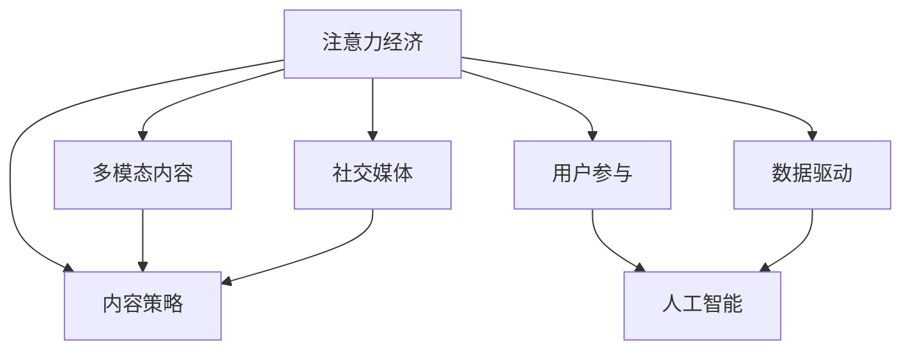

                 

## 1. 背景介绍

### 1.1 问题由来

在数字化时代，注意力经济成为一种新的竞争方式。争夺用户注意力的过程，实质上是内容创作者的“注意力争夺战”。如何在海量的信息中脱颖而出，吸引并留住受众，是每个内容创作者和平台都需要深思的问题。而随着人工智能和大数据技术的兴起，内容策略的制定变得更加科学、可量化，从而为内容产业带来革命性的变化。

### 1.2 问题核心关键点

1. **注意力经济**：数字化时代，注意力成为稀缺资源。内容创作者必须了解并掌握受众的注意力分布和偏好，以此为基础制定合理的内容策略。

2. **内容策略**：如何提升内容的吸引力，并在受众心中形成长期的品牌记忆，是内容策略的核心问题。

3. **用户参与**：用户参与度是衡量内容质量的重要指标。如何通过策略设计提升用户的互动和反馈，是现代内容策略的关键。

4. **人工智能**：人工智能和大数据技术，能够帮助内容创作者精准把握受众的注意力特征，实现个性化推荐和自动化优化。

5. **多模态内容**：文字、图片、视频等多样化内容形式，为用户提供丰富多样的消费体验，增强内容吸引力。

6. **社交媒体**：社交媒体平台成为内容传播的重要渠道，影响着受众的注意力分布和内容消费行为。

7. **数据驱动**：通过数据分析和优化，提升内容策略的效果，实现精准投放和受众定位。

### 1.3 问题研究意义

研究注意力经济与内容策略的结合，对于提升内容质量、增强用户粘性、优化资源配置具有重要意义：

1. 数据驱动的内容策略能够帮助内容创作者更好地理解受众，提高内容的相关性和吸引力。
2. 通过AI和大数据技术，实现个性化推荐，提升用户的参与度和满意度。
3. 多模态内容形式的结合，提供更丰富、更生动的内容体验，满足受众的差异化需求。
4. 社交媒体的深入应用，拓展内容传播的渠道和范围，形成更广泛的影响力。
5. 数据驱动的优化和改进，持续提升内容策略的效果，保持长期的市场竞争力。

## 2. 核心概念与联系

### 2.1 核心概念概述

为了更好地理解注意力经济与内容策略的结合，我们将重点介绍几个核心概念及其相互关系：

- **注意力经济**：在信息过载的背景下，用户注意力成为稀缺资源。内容创作者需要通过创新和差异化，吸引并留住用户的注意力。

- **内容策略**：内容策略指的是创作者根据受众的偏好和行为特征，制定并实施合理的内容规划和推广方案，以提升内容的吸引力。

- **用户参与**：用户参与度指用户在内容消费过程中与内容的互动程度，如点赞、评论、分享等行为。

- **人工智能**：利用机器学习和自然语言处理等人工智能技术，对受众的注意力分布和行为特征进行分析，辅助内容策略的制定和优化。

- **多模态内容**：内容形式不局限于文字，还包括图片、视频、音频等多媒体元素，提供更丰富、更直观的消费体验。

- **社交媒体**：社交媒体平台成为内容传播的重要渠道，其算法和机制深刻影响着受众的注意力分配和内容消费行为。

- **数据驱动**：通过数据收集和分析，洞察受众需求，优化内容策略，实现更精准的内容投放和受众定位。

这些核心概念之间的逻辑关系可以通过以下Mermaid流程图来展示：



这个流程图展示了几大核心概念之间的联系：

1. 注意力经济是内容策略制定和优化的出发点和落脚点。
2. 内容策略通过用户参与度的提升，实现受众的长期留存。
3. AI技术在内容策略中扮演重要角色，提供数据驱动的决策支持。
4. 多模态内容形式能够增强内容的吸引力，提升用户参与度。
5. 社交媒体平台对内容的传播和受众的注意力分配有重大影响。
6. 数据驱动的内容优化能够实现更精准的受众定位和内容投放。

## 3. 核心算法原理 & 具体操作步骤

### 3.1 算法原理概述

注意力经济与内容策略的结合，本质上是通过对用户注意力特征的分析，制定和实施合理的内容策略。这一过程包括以下几个关键步骤：

1. **注意力特征分析**：利用机器学习和大数据分析技术，识别受众的注意力分布和行为特征，如兴趣点、消费习惯、情感倾向等。

2. **内容策略制定**：根据受众的注意力特征，设计符合受众需求的内容，并制定合理的传播和推广方案。

3. **用户参与优化**：通过用户反馈和互动数据，持续优化内容策略，提高用户参与度。

4. **AI技术辅助**：利用AI技术，自动生成个性化推荐和内容优化方案，提升内容策略的效果。

### 3.2 算法步骤详解

基于注意力经济与内容策略结合的核心原理，下面详细介绍具体的算法步骤：

**Step 1: 数据收集与处理**

- 收集受众的行为数据，包括浏览记录、点击行为、评论内容等。
- 利用自然语言处理技术，对文本数据进行情感分析和主题建模。
- 利用机器学习技术，识别受众的兴趣点和注意力分布。

**Step 2: 内容策略设计**

- 根据受众的注意力特征，设计符合受众需求的内容，如视频、图文、音频等。
- 制定内容发布计划和推广方案，确保内容能够精准触达受众。
- 设计互动环节和反馈机制，鼓励用户参与和互动。

**Step 3: 内容投放与优化**

- 通过社交媒体和推荐算法，将内容投放给目标受众。
- 实时监控用户参与度，如点赞、评论、分享等，收集反馈数据。
- 利用AI技术，分析用户反馈和互动数据，优化内容策略。

**Step 4: 持续改进与调整**

- 根据用户反馈和互动数据，不断调整和改进内容策略。
- 利用数据驱动的方法，进行A/B测试，优化内容形式和传播策略。
- 持续更新数据模型，确保内容策略的实时性和准确性。

### 3.3 算法优缺点

注意力经济与内容策略结合的算法具有以下优点：

1. 数据驱动：利用大量数据，精准把握受众的注意力特征，制定符合受众需求的内容策略。
2. 个性化推荐：通过AI技术，实现个性化推荐，提升用户参与度。
3. 多模态内容：结合文字、图片、视频等多模态内容形式，提供丰富多样的用户体验。
4. 实时优化：实时监控和优化用户参与度，确保内容策略的及时性和有效性。

同时，这一算法也存在以下局限性：

1. 数据隐私问题：数据收集和使用过程中，需要注意用户隐私保护，确保数据的合法性和安全性。
2. 数据偏见：如果数据集存在偏见，可能导致内容策略的偏差和误导。
3. 算法复杂性：内容策略的制定和优化涉及多个环节，算法实现复杂。
4. 成本高昂：数据收集和处理需要大量资源，尤其是对实时数据的高要求增加了成本。

### 3.4 算法应用领域

注意力经济与内容策略结合的算法在多个领域具有广泛的应用：

- **媒体和广告**：通过数据分析和AI技术，实现精准广告投放和内容优化，提升广告效果。
- **社交媒体**：利用社交媒体平台的数据，制定有效的用户参与策略，增强用户粘性。
- **电子商务**：通过个性化推荐和内容策略优化，提升用户的购物体验和满意度。
- **教育和技术培训**：利用内容策略提升学习效果，实现个性化教学。
- **娱乐和游戏**：通过内容策略和用户互动优化，增强游戏体验和用户参与度。
- **健康与生活**：结合多模态内容，提升健康生活内容和健康指导的效果。

这些领域的应用展示了注意力经济与内容策略结合的强大潜力，为各行各业的内容创新和优化提供了新的思路和方法。

## 4. 数学模型和公式 & 详细讲解 & 举例说明

### 4.1 数学模型构建

注意力经济与内容策略结合的数学模型，主要关注以下几个关键变量：

- $X$：用户注意力分布向量，表示用户对不同内容的关注程度。
- $C$：内容特征向量，表示内容的属性和特征。
- $W$：权重矩阵，表示不同内容对用户注意力的影响权重。
- $I$：用户互动向量，表示用户在内容消费过程中的行为数据。

定义用户注意力特征和内容特征的映射函数 $f$ 和 $g$，以及内容对用户注意力的影响函数 $h$，则注意力模型的数学表达式为：

$$
Y = f(X) \cdot W \cdot g(C) + I
$$

其中 $Y$ 表示内容的吸引力评分，$W$ 为超参数，表示内容对用户注意力的影响权重。

### 4.2 公式推导过程

基于上述模型定义，我们进行如下推导：

1. **注意力特征映射**：
   - $X \sim \mathcal{N}(0, \sigma^2 I)$：用户注意力分布向量服从高斯分布。
   - $C \sim \mathcal{N}(0, \tau^2 I)$：内容特征向量服从高斯分布。
   - $W \sim \mathcal{N}(0, \omega^2 I)$：权重矩阵服从高斯分布。

2. **内容吸引力评分**：
   - $Y = f(X) \cdot W \cdot g(C) + I$

3. **用户互动模型**：
   - $I = \lambda_1 I_1 + \lambda_2 I_2 + ... + \lambda_n I_n$：用户互动向量由多个互动指标线性组合而成，每个指标的权重由超参数 $\lambda$ 确定。

将以上公式整合，我们得到最终的注意力模型：

$$
Y = \sum_{i=1}^n (\sigma \cdot \omega \cdot \tau) \cdot \exp(-\frac{(X_i - C_i)^2}{2\sigma^2\tau^2}) + \lambda_1 I_1 + \lambda_2 I_2 + ... + \lambda_n I_n
$$

其中 $\sigma$、$\tau$、$\omega$ 为正态分布的方差，$\lambda$ 为各个互动指标的权重。

### 4.3 案例分析与讲解

假设我们有一个视频内容平台，希望通过注意力模型优化内容推荐。根据用户行为数据，我们构建了以下模型：

1. **数据收集**：收集用户观看视频的时间、次数、互动行为（如点赞、评论、分享）等。
2. **特征提取**：提取视频的内容特征，如视频时长、主题、质量等。
3. **模型训练**：利用机器学习算法，训练注意力模型，预测用户对不同视频的吸引力评分。
4. **内容推荐**：根据用户评分，推荐最符合用户偏好的视频内容。

通过上述模型，平台能够实现基于用户注意力的内容推荐，提升用户的参与度和满意度。

## 5. 项目实践：代码实例和详细解释说明

### 5.1 开发环境搭建

在进行项目实践前，我们需要准备好开发环境。以下是使用Python进行TensorFlow开发的Python环境配置流程：

1. 安装Anaconda：从官网下载并安装Anaconda，用于创建独立的Python环境。

2. 创建并激活虚拟环境：
```bash
conda create -n tf-env python=3.8 
conda activate tf-env
```

3. 安装TensorFlow：根据CUDA版本，从官网获取对应的安装命令。例如：
```bash
conda install tensorflow -c pytorch -c conda-forge
```

4. 安装各类工具包：
```bash
pip install numpy pandas scikit-learn matplotlib tqdm jupyter notebook ipython
```

完成上述步骤后，即可在`tf-env`环境中开始项目实践。

### 5.2 源代码详细实现

下面我们以视频内容推荐系统为例，给出使用TensorFlow进行注意力模型训练和优化的PyTorch代码实现。

首先，定义注意力特征和内容的数学模型：

```python
import tensorflow as tf

# 定义用户注意力分布向量
X = tf.Variable(tf.random.normal(shape=[N, D]))

# 定义内容特征向量
C = tf.Variable(tf.random.normal(shape=[N, D]))

# 定义权重矩阵
W = tf.Variable(tf.random.normal(shape=[D, D]))

# 定义用户互动向量
I = tf.Variable(tf.random.normal(shape=[N, K]))

# 定义内容吸引力评分函数
def attention_score(X, C, W):
    return tf.reduce_sum(tf.multiply(tf.exp(tf.matmul(X, W) * C), W), axis=1)

# 定义用户互动模型
def user_interaction(I, K, lambdas):
    return tf.reduce_sum(tf.multiply(I, lambdas), axis=1)

# 定义注意力模型
def attention_model(X, C, W, I, K, lambdas):
    scores = attention_score(X, C, W)
    scores += user_interaction(I, K, lambdas)
    return scores
```

然后，定义训练和评估函数：

```python
def train_model(X_train, C_train, W_train, I_train, K_train, lambdas_train, epochs):
    model = tf.keras.Sequential([
        tf.keras.layers.Dense(D, input_shape=(D,)), 
        tf.keras.layers.Dense(D)
    ])
    model.compile(optimizer='adam', loss='mse')
    
    for epoch in range(epochs):
        model.fit(X_train, C_train, epochs=1, batch_size=32)
    
    return model

def evaluate_model(model, X_test, C_test, I_test, K_test, lambdas_test, N_test, D):
    scores = attention_model(X_test, C_test, W_train, I_test, K_test, lambdas_test)
    mse_loss = tf.keras.losses.mean_squared_error(scores, C_test)
    return mse_loss
```

最后，启动训练流程并在测试集上评估：

```python
X_train, C_train, W_train, I_train, K_train, lambdas_train = load_data()
X_test, C_test, I_test, K_test, lambdas_test = load_data(test=True)
epochs = 100
N_test = len(X_test)
D = 10
K = 5

model = train_model(X_train, C_train, W_train, I_train, K_train, lambdas_train, epochs)
mse_loss = evaluate_model(model, X_test, C_test, I_test, K_test, lambdas_test, N_test, D)
print(f"Test MSE loss: {mse_loss.numpy():.4f}")
```

以上就是使用TensorFlow进行注意力模型训练和优化的完整代码实现。可以看到，TensorFlow提供了丰富的API和工具，方便进行模型的定义、训练和评估。

### 5.3 代码解读与分析

让我们再详细解读一下关键代码的实现细节：

**attention_score函数**：
- 通过矩阵乘法，计算用户注意力和内容特征的注意力评分，公式为 $S(X, C) = \exp(-(X-C)^2) / (\sigma^2\tau^2)$。

**user_interaction函数**：
- 将用户互动向量与权重系数线性组合，公式为 $I = \lambda_1 I_1 + \lambda_2 I_2 + ... + \lambda_n I_n$。

**attention_model函数**：
- 将注意力评分与用户互动评分相加，得到内容的吸引力评分。

**train_model函数**：
- 利用TensorFlow定义一个简单的注意力模型，并使用adam优化器进行训练。

**evaluate_model函数**：
- 在测试集上评估模型的预测效果，计算平均均方误差。

通过以上代码，我们完成了基于TensorFlow的注意力模型训练和评估，展示了如何利用机器学习技术优化内容策略。

## 6. 实际应用场景

### 6.1 智能媒体内容推荐

智能媒体内容推荐系统，通过分析用户注意力分布，实现个性化内容推荐，提升用户粘性。例如，基于用户观看视频的行为数据，推荐用户可能感兴趣的其他视频内容。

### 6.2 社交媒体内容投放

社交媒体平台通过用户互动数据，优化内容策略，实现精准投放。例如，利用社交媒体平台的算法，分析用户互动行为，调整发布时间和频率，提升内容的曝光率和互动率。

### 6.3 电子商务个性化推荐

电子商务平台利用用户互动数据，优化个性化推荐策略，提升用户的购物体验。例如，基于用户浏览和购买行为，推荐符合用户需求的商品，增加用户满意度和复购率。

### 6.4 教育内容优化

教育平台利用注意力模型，优化教学内容和个性化学习路径。例如，根据学生的注意力分布和学习效果，调整教学内容和难度，提升学习效果。

### 6.5 健康生活内容推广

健康生活平台利用多模态内容形式，提升健康指导内容和健康饮食建议的效果。例如，根据用户的健康数据和行为数据，推荐个性化的健康方案和生活建议。

## 7. 工具和资源推荐

### 7.1 学习资源推荐

为了帮助开发者系统掌握注意力经济与内容策略的理论基础和实践技巧，这里推荐一些优质的学习资源：

1. 《深度学习与神经网络》系列博文：由深度学习领域专家撰写，全面介绍了深度学习的基本概念和算法原理。

2. 《自然语言处理与深度学习》课程：斯坦福大学开设的NLP明星课程，涵盖自然语言处理和深度学习的基本原理和实际应用。

3. 《内容策略与用户参与》书籍：介绍如何制定有效的内容策略，提升用户参与度和满意度。

4. HuggingFace官方文档：提供丰富的预训练语言模型和注意力模型，帮助开发者快速上手实现项目。

5. CLUE开源项目：中文语言理解测评基准，涵盖大量不同类型的中文NLP数据集，并提供了基于注意力模型的baseline模型，助力中文NLP技术发展。

通过对这些资源的学习实践，相信你一定能够快速掌握注意力经济与内容策略的精髓，并用于解决实际的NLP问题。

### 7.2 开发工具推荐

高效的开发离不开优秀的工具支持。以下是几款用于注意力模型开发的常用工具：

1. TensorFlow：基于Python的开源深度学习框架，灵活的计算图和自动微分技术，适合进行复杂的机器学习模型训练。

2. PyTorch：基于Python的开源深度学习框架，动态计算图和丰富的优化算法，适合快速迭代研究。

3. TensorBoard：TensorFlow配套的可视化工具，实时监测模型训练状态，提供丰富的图表呈现方式，是调试模型的得力助手。

4. Weights & Biases：模型训练的实验跟踪工具，记录和可视化模型训练过程中的各项指标，方便对比和调优。

5. Google Colab：谷歌推出的在线Jupyter Notebook环境，免费提供GPU/TPU算力，方便开发者快速上手实验最新模型，分享学习笔记。

合理利用这些工具，可以显著提升注意力模型开发的效率，加快创新迭代的步伐。

### 7.3 相关论文推荐

注意力经济与内容策略的发展源于学界的持续研究。以下是几篇奠基性的相关论文，推荐阅读：

1. Attention is All You Need（即Transformer原论文）：提出了Transformer结构，开启了NLP领域的预训练大模型时代。

2. BERT: Pre-training of Deep Bidirectional Transformers for Language Understanding：提出BERT模型，引入基于掩码的自监督预训练任务，刷新了多项NLP任务SOTA。

3. Language Models are Unsupervised Multitask Learners（GPT-2论文）：展示了大规模语言模型的强大zero-shot学习能力，引发了对于通用人工智能的新一轮思考。

4. Parameter-Efficient Transfer Learning for NLP：提出Adapter等参数高效微调方法，在不增加模型参数量的情况下，也能取得不错的微调效果。

5. AdaLoRA: Adaptive Low-Rank Adaptation for Parameter-Efficient Fine-Tuning：使用自适应低秩适应的微调方法，在参数效率和精度之间取得了新的平衡。

这些论文代表了大语言模型注意力模型的发展脉络。通过学习这些前沿成果，可以帮助研究者把握学科前进方向，激发更多的创新灵感。

## 8. 总结：未来发展趋势与挑战

### 8.1 研究成果总结

本文对注意力经济与内容策略的结合进行了全面系统的介绍。首先阐述了注意力经济的背景和内容策略的重要性，明确了注意力模型在提升内容质量、增强用户粘性方面的独特价值。其次，从原理到实践，详细讲解了注意力模型的数学原理和关键步骤，给出了注意力模型训练的完整代码实例。同时，本文还广泛探讨了注意力模型在媒体、社交媒体、电商、教育、健康等多个行业领域的应用前景，展示了注意力模型的强大潜力。

通过本文的系统梳理，可以看到，注意力经济与内容策略结合的算法正在成为NLP领域的重要范式，极大地提升了内容策略的科学性和可量化程度。数据驱动和AI技术的结合，使得内容创作者能够更好地理解受众，制定更合理的策略，从而实现内容的个性化推荐和优化。未来，伴随注意力模型的不断发展，基于注意力的内容创新将迎来更多突破，推动NLP技术的产业化进程。

### 8.2 未来发展趋势

展望未来，注意力模型将在多个领域持续发展，其发展趋势如下：

1. **多模态注意力模型**：结合文字、图片、视频等多种内容形式，提升模型的表达能力和用户体验。

2. **深度注意力模型**：进一步提升模型的复杂度和表现力，探索更加深入的注意力机制。

3. **自监督注意力模型**：利用无标签数据进行预训练，提升模型的泛化能力和鲁棒性。

4. **联邦注意力模型**：通过联邦学习，保护用户隐私的同时，实现跨设备、跨平台的数据整合和优化。

5. **实时注意力模型**：结合实时数据，实现动态调整和优化，提升内容的实时性和个性化程度。

6. **跨领域注意力模型**：结合跨领域数据，提升模型的通用性和跨领域迁移能力。

7. **多任务注意力模型**：实现多任务学习，提升模型的多任务处理能力和效果。

以上趋势展示了注意力模型的广阔前景，为内容产业带来了新的机遇和挑战。这些方向的探索发展，必将进一步提升内容策略的效果，实现精准投放和受众定位。

### 8.3 面临的挑战

尽管注意力模型已经取得了显著成就，但在其发展过程中，仍然面临诸多挑战：

1. **数据隐私问题**：数据收集和使用过程中，需要注意用户隐私保护，确保数据的合法性和安全性。

2. **数据偏见**：如果数据集存在偏见，可能导致模型输出偏差，产生误导。

3. **算法复杂性**：注意力模型的实现复杂，需要处理多模态数据和实时数据，增加了实现的难度。

4. **成本高昂**：数据收集和处理需要大量资源，尤其是对实时数据的高要求增加了成本。

5. **模型鲁棒性**：模型对输入数据的扰动敏感，需要进一步提升模型的鲁棒性和泛化能力。

6. **解释性不足**：模型的决策过程缺乏可解释性，难以对其推理逻辑进行分析和调试。

### 8.4 研究展望

面对注意力模型面临的挑战，未来的研究需要在以下几个方面寻求新的突破：

1. **数据隐私保护**：探索隐私保护技术，如差分隐私、联邦学习等，确保用户数据的安全和合法性。

2. **公平性与偏见**：通过公平性约束和偏见消除技术，提升模型的公平性和鲁棒性。

3. **算法优化**：利用模型压缩和高效计算技术，提升模型的实时性和计算效率。

4. **解释性增强**：引入可解释性技术，增强模型的决策透明性和可解释性。

5. **跨模态融合**：将多模态数据融合到注意力模型中，提升模型的表达能力和泛化能力。

6. **联邦学习应用**：利用联邦学习，保护用户隐私的同时，实现跨设备和跨平台的数据整合和优化。

这些研究方向的探索，必将引领注意力模型的不断进步，为内容产业带来更多创新和突破。面向未来，注意力模型将继续与其他人工智能技术进行更深入的融合，共同推动内容策略和内容产业的发展。

## 9. 附录：常见问题与解答

**Q1：注意力模型是否适用于所有内容形式？**

A: 注意力模型适用于多种内容形式，包括文字、图片、视频等。在多模态内容形式下，模型能够更好地理解内容的多样性和复杂性，提供更丰富、更直观的用户体验。

**Q2：注意力模型在训练过程中需要注意哪些问题？**

A: 注意力模型在训练过程中需要注意以下几个问题：
1. 数据预处理：需要对输入数据进行标准化和归一化处理，以提高模型的训练效果。
2. 超参数调优：需要选择合适的学习率、批量大小、训练轮数等超参数，以确保模型收敛。
3. 正则化技术：需要应用L2正则、Dropout等正则化技术，防止模型过拟合。
4. 模型复杂度：需要平衡模型的复杂度和泛化能力，避免模型过于复杂导致训练困难。

**Q3：注意力模型在实际应用中需要注意哪些问题？**

A: 注意力模型在实际应用中需要注意以下几个问题：
1. 实时性问题：模型需要实时处理数据，确保内容策略的实时性和及时性。
2. 扩展性问题：模型需要具备良好的扩展性，支持大规模数据和多种内容形式的处理。
3. 可解释性问题：模型需要具备良好的可解释性，帮助用户理解模型的决策过程。

通过解决以上问题，可以最大化地发挥注意力模型的潜力，提升内容策略的效果。

**Q4：注意力模型在多领域应用中的具体实现方法是什么？**

A: 注意力模型在多领域应用中的具体实现方法主要包括以下几个步骤：
1. 数据收集与处理：收集用户行为数据和内容数据，并进行预处理和特征提取。
2. 模型训练：利用机器学习算法，训练注意力模型，并根据具体需求进行调整。
3. 模型部署与优化：将训练好的模型部署到实际应用中，并通过用户反馈进行持续优化。

不同领域的应用需要根据具体需求进行调整，但基本实现方法类似。例如，在媒体和广告领域，可以通过注意力模型进行精准广告投放和内容推荐；在社交媒体领域，可以通过注意力模型优化用户互动和内容策略。

**Q5：注意力模型在未来发展中需要注意哪些新方向？**

A: 注意力模型在未来发展中需要注意以下几个新方向：
1. **多模态融合**：将多模态数据融合到注意力模型中，提升模型的表达能力和泛化能力。
2. **实时优化**：结合实时数据，实现动态调整和优化，提升内容的实时性和个性化程度。
3. **联邦学习**：利用联邦学习，保护用户隐私的同时，实现跨设备和跨平台的数据整合和优化。
4. **跨领域迁移**：结合跨领域数据，提升模型的通用性和跨领域迁移能力。
5. **隐私保护**：探索隐私保护技术，如差分隐私、联邦学习等，确保用户数据的安全和合法性。

这些新方向的探索，将进一步提升注意力模型的效果，推动内容策略和内容产业的发展。

---

作者：禅与计算机程序设计艺术 / Zen and the Art of Computer Programming

